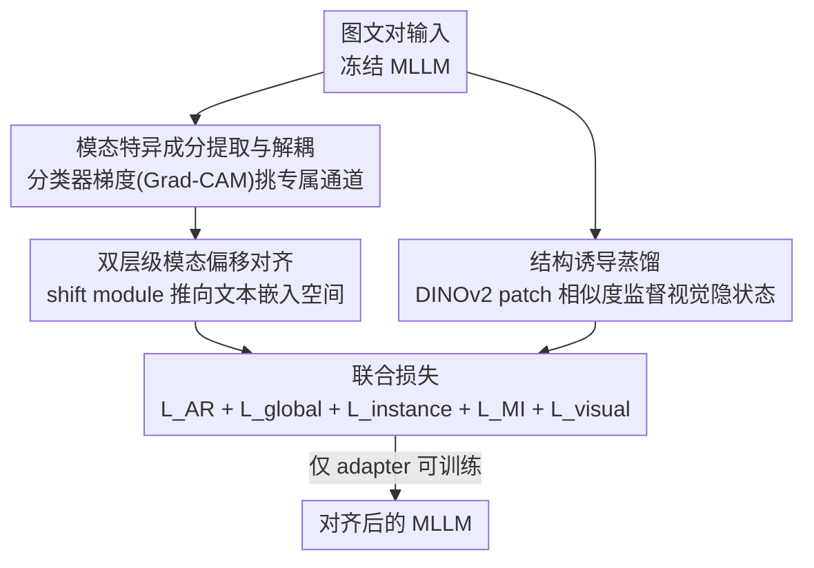

# DeepAlign: Mitigating Modality Conflict through Modality-Specific Alignment

**会议**: CVPR 2026  
**论文**: [CVF Open Access](https://openaccess.thecvf.com/content/CVPR2026/html/Li_DeepAlign_Mitigating_Modality_Conflict_through_Modality-Specific_Alignment_CVPR_2026_paper.html)  
**代码**: 无  
**领域**: 多模态VLM  
**关键词**: 模态冲突 / 表征干预 / 结构诱导蒸馏 / MLLM后训练 / DINOv2  

## 一句话总结
针对多模态大模型里"视觉一接进来反而把语言能力拖累、又抓不住图里细节"的模态冲突，DeepAlign 用一个即插即用的后训练框架——一边用分类器梯度把视觉表征里的"模态特异成分"挑出来、推向 LLM 的文本嵌入空间，一边把 DINOv2 的 patch 结构关系蒸馏进 MLLM 的视觉隐状态——只训练插入的 adapter（200M 参数），就在三种主流 MLLM 上跨十余个 benchmark 稳定涨点，还顺带激活了多模态上下文学习等涌现能力。

## 研究背景与动机
**领域现状**：主流 MLLM（LLaVA、Qwen2.5-VL、InternVL 这类）走的是"桥接"范式——预训练视觉编码器 + 预训练 LLM，中间用一个轻量连接模块（如 MLP projector）把视觉特征对齐到文本模态，让 LLM "顺手"接管多模态任务。

**现有痛点**：作者做了一组探针实验，揭示这个范式有两个被忽视的副作用。其一，LLM 一旦变成 MLLM，纯语言能力明显退化——LLaVA-v1.5-7B 在 MMLU 上比它的底座 Vicuna-7B 平均掉 10 分，对 Wikipedia 文本的困惑度也显著升高，说明视觉模态非但没帮上忙，反而干扰了文本处理。其二，在 MNER / MMT / MRE 这些"看图能加分"的视觉辅助任务上，给 MLLM 喂图反而比纯文本输入更差；而在 BLINK 的细粒度感知 VQA 上，把原图换成 dense caption 让模型"盲视"作答，性能几乎不掉——这说明 MLLM 对图像的理解只停在"模态共享"语义层，根本没抓到图里那些难以言说的细节。

**核心矛盾**：作者把根因归结为"模态冲突"——现有视觉-语言预训练只盯着**模态共享信息**（比如给图配一句 caption 这种高层语义），系统性地忽略了**模态特异知识**。由此派生出两类具体冲突：(1) **模态特异表征的错位**——"teddy bear""scarf"这种高层语义对齐了，但"gray""blue"这类颜色属性没对齐，视觉模态没法和文本协同反而拖累推理；(2) **模态特异细节的流失**——自回归训练只在文本侧算 loss，视觉沦为附属，岩石的纹理、天空的光照这些图里有、文本没写的细节就丢了。

**本文目标**：从"表征"和"细节"两个层面同时把模态特异信息补回来，且要做成不重训底座、即插即用的后训练方案。

**核心 idea**：用**表征干预（representation intervention）**把视觉表征里的模态特异成分定向"推"到文本嵌入空间消除错位，再用**结构诱导蒸馏（structure-induced distillation）**借 DINOv2 这个纯视觉自监督模型当老师，把它的 patch 间结构关系灌进 MLLM 的视觉隐状态补回细节——两路合力缓解模态冲突。

## 方法详解

### 整体框架
DeepAlign 是一个 model-agnostic 的后训练框架：输入是图文对，底座 MLLM 全程冻结，唯一可训练的是插入若干中间 Transformer 层的 adapter（modality shift module，约 200M 参数）。它沿两条互补的支路同时纠偏：

- **表征干预支路**（治"错位"）：先用一个模态分类器 + Grad-CAM 把每个表征里"专属于某模态"的通道挑出来，量化出视觉→文本的"模态偏移方向"，再让 modality shift module 学着把视觉表征沿这个方向推向 LLM 的文本嵌入空间。
- **结构诱导蒸馏支路**（治"流失"）：把同一张图喂给 DINOv2，取它的 patch 嵌入，用 patch 两两相似度矩阵去监督 MLLM 视觉隐状态的相似度矩阵，强行把"结构语义"注入进来。

最后把两路的监督信号和原本的文本自回归 loss 加在一起联合优化。下图是整体流向，三个贡献节点与下面"关键设计"一一对应：

### 关键设计

**1. 模态特异成分的提取与解耦：用分类器梯度把"专属通道"挑出来**

错位问题的前提是——你得先知道一个视觉表征里，哪些维度是"模态共享"的（已经对齐了，别动），哪些是"模态特异"的（没对齐，要纠）。DeepAlign 的做法很巧：对每层 MLLM 最后一个 token 的隐状态，取出 pooled 的视觉/文本表征 $(h_t, h_v) \in \mathbb{R}^D$，先训一个模态分类器 $f$ 判别某个表征来自视觉还是文本，输出 $y=f(h)$。然后借鉴 Grad-CAM——把分类得分对表征的梯度 $w_{cls}=\nabla_h y_k$（$k$ 为真实模态）当作通道注意力权重，因为"对判别模态最重要的通道"恰恰就是模态特异通道：

$$h_{mod} = s\,w_{cls} \odot h$$

其中 $\odot$ 是 Hadamard 积，$s$ 是一个自适应非负标量，用来把 $h_{mod}$ 的能量拉回和原表征一致（$\epsilon(h_{mod})=\|h_{mod}\|_2^2 = \epsilon(h)$），具体 $s=\sqrt{\sum_d h_d^2 / \sum_d (w_{cls,d} h_d)^2}$。这一步的妙处在于：它不需要人工标注"哪些维度是颜色/纹理"，而是让分类器的梯度自动"指认"出区分模态的成分，从而把错位定位到具体通道上。

**2. 双层级模态偏移对齐：把视觉表征定向推向文本嵌入空间**

挑出模态特异成分后，要回答"往哪个方向推、推多少"。DeepAlign 在两个粒度上估计偏移方向：**实例级** $d_{instance}=h_{mod_t}-h_{mod_v}$（这一对图文样本里，文本特异成分减去视觉特异成分），**全局级** $d_{global}=\mathrm{Mean}(\{d_{instance}^i\}_{i=1}^m)$（跨多样本求平均，捕捉整体趋势）。然后让 modality shift module $\mathrm{SHF}(\cdot)$（插在若干中间层的 adapter）把视觉表征变成 $h'_v=\mathrm{SHF}(h_v)$，并用两级方向监督它"推对方向"：

$$L_{global}=\alpha(1-\cos(h'_v[-1]-h_v[-1],\, d_{global})),\quad L_{instance}=\beta(1-\cos(h'_v[-1]-h_v[-1],\, d_{instance}))$$

即要求"位移向量"（对齐前后视觉表征之差）与目标偏移方向尽量同向。光对齐还不够，怕把视觉信息推丢了，于是再加一个互信息正则，约束对齐前后视觉表征与文本表征间的互信息变化最小：$L_{MI}=-\gamma(\mathrm{MI}(h'_v,h_t)-\mathrm{MI}(h_v,h_t))$，让 $h'_v$ 既更贴近文本模态、又保留关键信息。实例级负责单样本精修、全局级提供稳定方向、互信息项防信息坍缩——三者配合才能做到"既对齐又不失真"，这是它区别于只做粗粒度对齐 baseline 的地方。

**3. 结构诱导蒸馏：用 DINOv2 的 patch 关系补回视觉细节**

表征干预治的是"错位"，但治不了"细节流失"——因为流失的根源是训练只有文本侧监督，视觉端从来没有自己的 loss。作者的观察（ImageNet 线性探针）也印证：MLLM 中间层视觉隐状态的分类精度在某层达峰后随深度急剧下滑，且整体远低于 DINOv2，说明 MLLM 没保住富视觉语义。DeepAlign 的解法是给视觉端找个"纯视觉老师"：DINOv2 是无语言线索的自监督模型，擅长捕捉结构化的细粒度视觉细节。具体地，对一张图 $I$，取 DINOv2 编码 $g=\mathrm{Enc}(I)\in\mathbb{R}^{n\times D}$ 和 post-MLLM 隐状态 $\tilde h=\mathrm{MLLM}(I)\in\mathbb{R}^{n\times D'}$（$n$ 为 patch 数），用 MSE 把两者的"patch 间相似度矩阵"对齐：

$$L_{visual}=\mu\cdot\frac{1}{n^2}\sum_{i=1}^{n}\sum_{j=1}^{n}\big\|\,\mathrm{Sim}(\tilde h_i,\tilde h_j)-\mathrm{Sim}(g_i,g_j)\,\big\|^2$$

蒸的不是 DINOv2 的特征本身，而是它"哪些 patch 彼此相似"的**结构关系**——这就把图像的空间/语义结构当作一种归纳约束灌进 MLLM，让视觉模态终于有了自己的监督信号，从而保住那些"难以用文本描述"的细节。

### 损失函数 / 训练策略
最终损失把表征干预的三项（$L_{global}, L_{instance}, L_{MI}$）、结构诱导的 $L_{visual}$，和常规文本自回归 loss $L_{AR}=\sum \log P(t_i\mid t_1,\dots,t_{i-1};I)$ 加在一起：

$$L = L_{AR}+L_{global}+L_{instance}+L_{MI}+L_{visual}$$

后训练数据取自 CC3M、COCO Caption 的高质量子集（均来自底座 MLLM 原本的预训练/指令微调数据），唯一可训练参数是 adapter（modality shift module，200M），峰值学习率 $3\times10^{-5}$。底座 MLLM 完全冻结，这保证了方法即插即用、不破坏原模型权重。

## 实验关键数据

DeepAlign 应用到 LLaVA-v1.5-7B、Qwen2.5-VL-7B、InternVL3-8B 三种底座，与同样做模态对齐后训练的 RLHF / HADPO / DataTailor / POVID / SIMA / VISTA 等对比。

### 主实验（零样本视觉-语言理解）
LLaVA-v1.5-7B 底座上各后训练方法对比（节选关键 benchmark）：

| 方法 | MMBench | MMStar | MMMU | HallusionBench | OCRBench | MMVet | TextVQA |
|------|---------|--------|------|----------------|----------|-------|---------|
| LLaVA-v1.5-7B（底座） | 62.1 | 34.6 | 33.7 | 25.2 | 385 | 32.2 | 49.7 |
| +VISTA（次优 baseline） | 65.4 | 35.9 | 37.5 | 28.9 | 410 | 34.1 | 52.6 |
| **+DeepAlign** | **68.2** | **40.1** | **39.4** | **31.0** | **427** | **38.5** | **55.7** |

在更强底座上也稳定提升：Qwen2.5-VL-7B 上 MMBench +1.0、MMStar +1.6、ScienceQA +1.5、TextVQA +1.7；InternVL3-8B 上 ScienceQA 从 97.9→99.2、TextVQA 从 82.1→83.9，且大多数 benchmark 上优于所有 baseline。

### 消融实验（个体组件，LLaVA-v1.5-7B）
| 配置 | MMBench | MMStar | ScienceQA | TextVQA | 说明 |
|------|---------|--------|-----------|---------|------|
| LLaVA-v1.5-7B | 62.1 | 34.6 | 69.2 | 49.7 | 底座 |
| **+DeepAlign（完整）** | **68.2** | **40.1** | **75.3** | **55.7** | 全部组件 |
| w/o intervention | 63.5 | 36.2 | 70.8 | 51.3 | 去表征干预，掉得最多 |
| w/o distillation | 65.4 | 37.6 | 72.5 | 52.8 | 去结构蒸馏，掉第二多 |
| w/o global | 66.8 | 38.8 | 73.9 | 54.1 | 去全局偏移方向 |
| w/o mutual | 67.5 | 39.5 | 74.6 | 54.9 | 去互信息正则 |

### 关键发现
- **表征干预贡献最大**：去掉它（w/o intervention）MMBench 从 68.2 直接掉到 63.5，几乎打回原形——说明"模态特异表征错位"是模态冲突的首要矛盾；结构蒸馏次之（w/o distillation 掉到 65.4）。
- **模态冲突被实证缓解**：在 BLINK 细粒度感知 VQA（Table 2）六个子任务上 Qwen2.5-VL-7B 全面上涨，缩小了与 GPT-4o / Gemini-1.5-Pro 的差距；视觉辅助任务上"加图反而变差"的现象被扭转为"加图有增益"（Fig 5a），文本困惑度也明显回落（Fig 5b）。
- **涌现能力**：(1) 缓解幻觉——HallusionBench 上 Qwen2.5-VL-7B +1.7、InternVL3-8B +1.5；(2) 多模态上下文学习——few-shot 下 LLaVA+DeepAlign 在 VQAv2 从 4→16-shot 随样本增多稳定上涨（66.4→68.0），而原底座反而随 shot 增多下降（60.2→52.6）；(3) DEMON 交错图文指令跟随（Table 4）全任务类别提升。
- **语义鸿沟收窄**：蒸馏后 MLLM 视觉隐状态的 ImageNet 线性探针精度在高层不再骤降，且峰值追平 DINOv2，证明结构监督确实让视觉语义在深层得以保留。

## 亮点与洞察
- **用 Grad-CAM 来"指认"模态特异通道**是全文最巧的一笔：把一个本来用于可视化分类依据的工具，反过来当成"挑出需要纠偏的维度"的探针，无需任何属性级标注就完成了共享/特异成分的解耦。
- **"蒸结构关系而非蒸特征"**：DINOv2 和 MLLM 的嵌入维度、语义空间都不同，直接对齐特征不现实；改成对齐 patch 间相似度矩阵，绕过了维度/空间不匹配，把可迁移的"结构归纳偏置"灌了进去——这套"蒸关系"的思路可迁移到任何想借异构老师补监督的场景。
- **冻结底座、只训 200M adapter**，让方法变成可插在任意 MLLM 上的后训练补丁，工程上极友好；且能在不重训的前提下激活上下文学习等涌现能力，说明很多"涌现"其实是被模态冲突压制了。
- 把"MLLM 语言能力退化"这个常被忽略的现象量化（MMLU -10、困惑度升高）并归因到模态冲突，本身就是一个有说服力的问题刻画。

## 局限与展望
- **依赖 DINOv2 当老师**：结构蒸馏的天花板某种程度上被 DINOv2 的能力锁死，对 DINOv2 本身不擅长的领域（如医学、遥感）能补回多少细节存疑 ⚠️。
- **多项超参**（$\alpha,\beta,\gamma,\mu,s$ 及 adapter 插入层位）需要调，论文未给出系统的敏感性分析，迁移到新底座的调参成本不明。
- **绝对增益在强底座上趋小**：Qwen2.5-VL-7B / InternVL3-8B 上多数提升在 1 分上下，说明底座越强、模态冲突的"可压缩空间"越小，方法主要红利在偏弱的 LLaVA 上。
- 互信息项 $L_{MI}$ 的具体 MI 估计实现细节正文未展开，复现时需查附录 ⚠️。

## 相关工作与启发
- **vs RLHF / POVID / SIMA / VISTA（偏好/对齐类后训练）**：这些方法多在输出/偏好层面纠正（如 DPO 式优化、减幻觉），DeepAlign 直接在**内部表征**层面动手——定位并搬移模态特异成分，属于更底层的对齐，因而在感知类任务上增益更明显。
- **vs 桥接范式（LLaVA 等连接模块对齐）**：传统连接模块只学模态共享语义的粗对齐，DeepAlign 指出这恰恰是模态冲突之源，转而显式保护模态特异信息，是对"桥接是否充分"这一质疑（LaVIT 提过）的一个具体回应。
- **vs 视觉自监督蒸馏工作**：以往把 DINOv2 蒸进感知模型多为蒸特征/logits，DeepAlign 蒸的是 patch 间结构关系，且目的不是涨分类而是给 MLLM 视觉端补监督信号，动机和落点都不同。

## 评分
- 新颖性: ⭐⭐⭐⭐⭐ Grad-CAM 解耦模态特异通道 + 蒸 DINOv2 结构关系，两个角度都新且自洽
- 实验充分度: ⭐⭐⭐⭐ 三底座、十余 benchmark、消融与涌现能力齐全，唯超参敏感性分析欠缺
- 写作质量: ⭐⭐⭐⭐⭐ 探针实验把"模态冲突"刻画得清晰，方法-动机扣得很紧
- 价值: ⭐⭐⭐⭐ 即插即用、可激活涌现能力，但对强底座增益有限

<!-- RELATED:START -->

## 相关论文

- [\[CVPR 2026\] Towards Dynamic Modality Alignment in Multimodal Continual Learning](towards_dynamic_modality_alignment_in_multimodal_continual_learning.md)
- [\[CVPR 2026\] Bridging the Modality Gap in Compositional Zero-Shot Learning via Sparse Alignment and Unimodal Memory Bank](bridging_the_modality_gap_in_compositional_zero-shot_learning_via_sparse_alignme.md)
- [\[CVPR 2026\] LVLM-Aided Alignment of Task-Specific Vision Models](lvlm-aided_alignment_of_task-specific_vision_models.md)
- [\[CVPR 2026\] Is the Modality Gap a Bug or a Feature? A Robustness Perspective](is_the_modality_gap_a_bug_or_a_feature_a_robustness_perspective.md)
- [\[CVPR 2026\] Efficient and High-Fidelity Omni Modality Retrieval](efficient_and_high-fidelity_omni_modality_retrieval.md)

<!-- RELATED:END -->
