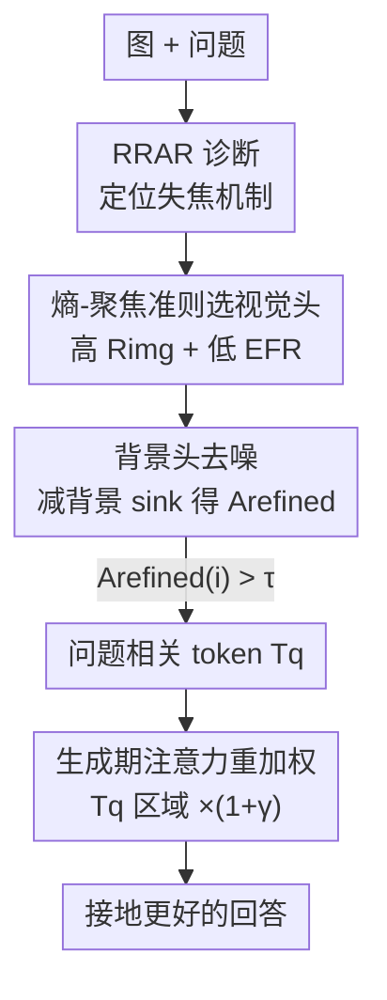

# Deeper Thought, Weaker Aim: Understanding and Mitigating Perceptual Impairment during Reasoning in Multimodal Large Language Models

**会议**: CVPR 2026  
**论文**: [CVF Open Access](https://openaccess.thecvf.com/content/CVPR2026/html/Peng_Deeper_Thought_Weaker_Aim_Understanding_and_Mitigating_Perceptual_Impairment_during_CVPR_2026_paper.html)  
**代码**: https://github.com/Ivine11/VRGA  
**领域**: 多模态VLM  
**关键词**: MLLM推理, 注意力分散, 视觉接地, 注意力头选择, 训练-free  

## 一句话总结
本文发现多模态大模型在「想得越多」的 CoT 推理模式下视觉注意力会**空间发散**、漂离问题相关区域（看得越久、瞄得越偏），并据此提出免训练的 VRGA 框架：用「熵-聚焦」准则自动挑出真正处理视觉的注意力头、定位问题相关区域、再在生成阶段对这些区域加权，从而在不重训模型的前提下恢复视觉接地、降低跑题、提升 VQA 综合得分（跨模型规模 1–6 分）。

## 研究背景与动机
**领域现状**：为了让 MLLM 像文本 LLM 那样「深度推理」，社区普遍把链式思维（CoT，如「think step by step」）和强化学习奖励搬到视觉问答（VQA）上，期望更长的推理链能带来更强的视觉推理能力。

**现有痛点**：一个反直觉的悖论出现了——直接让模型生成长 CoT 反而**降低** VQA 准确率，尤其在依赖感知细节的任务上。已有工作（ICoT、DeepEyes 等）把退化归因于「推理过程中感知能力下降」，于是用工具裁剪图像区域、或往推理步骤里注入图像 token 来补救。但本文在 TextVQA 上分析失败案例发现：**大多数答错样本其实对场景的描述是正确的**（感知没坏），却仍给出错误答案。这说明问题不在「模型看到了什么」，而在「模型怎么处理它看到的东西」。

**核心矛盾**：感知正确 ≠ 推理正确。模型不仅要看清图，还要在一堆视觉信息里**持续聚焦到问题相关区域、过滤掉干扰**。已有研究（Liu et al.）只发现「推理链越长、对图像的整体注意力越低、幻觉越多」，停留在整体注意力与幻觉的相关性，既没解释机制，也难以在实践中动态控制推理长度。

**切入角度**：作者把分析粒度从「整层平均注意力」下沉到「单个注意力头」，并区分注意力的**空间分布**（聚焦 vs 发散），而非只看注意力总量。一个关键观察是：真正在做视觉处理的头，既对图像 token 有高注意力（$R_{img}$ 大），又在图像内部空间上高度集中（熵 $H_{img}$ 小）——这俩量之间存在强线性相关，可以反过来**无监督地把视觉头挑出来**。

**核心 idea**：把 CoT 退化重新定义为「注意力分散导致的失焦」，然后**免训练、推理期、按头按区域**地把分散的注意力重新拉回问题相关区域——不改输入、不重训模型，只在对的头上对的区域做注意力重加权。

## 方法详解

### 整体框架
本文分两块：**前半段是机制分析**（第 3 节，搞清楚 CoT 到底坏在哪），**后半段是方法 VRGA**（第 4 节，按分析结论开药方）。

机制分析回答两个问题：(1) CoT 是否系统性地把注意力推离问题相关区域、且这种发散与答错相关？(2) 头粒度上，视觉接地强的头是否注意力也更空间集中？两个问题分别用 RRAR 指标和 $R_{img}$–$H_{img}$ 线性关系坐实。

VRGA 是免训练框架，输入是「图 + 问题」，输出是接地更好的回答，中间走两阶段流水线：**① 定位问题相关区域**（挑视觉头 → 去背景噪声 → 选出相关 token $T_q$）→ **② 生成阶段对 $T_q$ 区域的注意力加权**。下图给出整条流水线，节点名与下面「关键设计」一一对应：

### 关键设计

**1. RRAR 诊断：用「相关区域注意力比」坐实 CoT 失焦机制**

这一步解决的是「凭什么说 CoT 让模型失焦」。作者定义 **相关区域注意力比 RRAR**（Relevant Region Attention Ratio）：设 $V$ 为全部视觉 token，$B\subseteq V$ 为 ground-truth bounding box 标出的问题相关区域，$A_{qt}$ 为问题末尾 token 到视觉 token 的注意力张量，则单头 $(l,h)$ 的 RRAR 为

$$\Gamma^{(l,h)}=\frac{\frac{1}{|B|}\sum_{i\in B} a_i^{(l,h)}}{\frac{1}{|V|}\sum_{j\in V} a_j^{(l,h)}}$$

直觉上 $\Gamma>1$ 表示该头对相关区域的关注高于全图平均（聚焦），$\Gamma<1$ 表示发散失焦；层级 RRAR 是对头取平均 $\Gamma^{(l)}=\frac{1}{H}\sum_h \Gamma^{(l,h)}$。在 7 个模型、1450 个 TextVQA 样本、三种 prompt（Direct / Reason / Region-guided）下，得到三条干净的结论：**答对的样本 RRAR 显著更高**；**CoT 系统性压低 RRAR**，即 $\Gamma_{\text{reason}}<\Gamma_{\text{direct}}<\Gamma_{\text{region-guided}}$；**发散程度与准确率掉点同步**。这三条把「CoT → 注意力发散 → 失焦 → 答错」这条因果链钉死，也直接指向「与其改输入或重训，不如直接把注意力分布重新加权」的解法。

**2. 熵-聚焦准则：无监督地把真正做视觉处理的头挑出来**

推理期没有 ground-truth box，必须只凭注意力统计量自动找到「视觉头」。作者引入两个互补指标：**图像注意力比** $R_{img}^{(l,h)}=\frac{\frac{1}{|V|}\sum_{i\in V}a_i}{\frac{1}{M}\sum_{j=1}^{M}a_j}$（衡量头给视觉 token 多少注意力，$M$ 为全部 token 数），以及 **图像注意力熵** $H_{img}^{(l,h)}=-\sum_{i\in V}\tilde a_i\log(\tilde a_i+\epsilon)$（衡量注意力在图像内部有多集中，$\tilde a_i$ 是图像内归一化后的权重，$\epsilon=10^{-8}$）。关键发现是二者跨模型呈强线性关系 $R_{img}=k\cdot H_{img}+b$（5 个模型 Pearson $r>0.9$、截距 $|b|<0.1$），且真正高 RRAR 的头都落在「高 $R_{img}$、低 $H_{img}$」的左上角。据此定义 **熵-聚焦比** $\text{EFR}=\frac{H_{img}}{R_{img}}$，EFR 越低代表越集中、越接地；结合高 $R_{img}$ 即可从三方面（偏好图像而非文本、覆盖全局视觉、图内空间集中）筛出**视觉头集合 $H_v$**。这一招比已有「按整层平均图像注意力做层级选择」更细——因为同一层里不同头分工天差地别，层级粒度会把视觉头和语言头混在一起。⚠️ 文中称 EFC（Entropy–Focus Criterion）为整体准则、EFR 为其比值量，定义以原文为准。

**3. 背景头去噪：减掉注意力 sink，得到干净的相关区域图**

仅把视觉头 $H_v$ 的注意力图聚合起来还不够——很多头会一起「sink」到图像左上角等无信息 token（注意力陷阱），导致相关图被噪声污染。作者观察到：在早期层模型主要处理指令、还没真正看图，于是把这些**图像注意力低、空间发散**的头单独拎出来作为**背景头集合 $H_b$**，它们恰好暴露了哪些背景区域在反复吸走注意力。构造去噪后的精炼图时，用视觉头聚合图**减去**背景头的平均图：

$$A_{\text{refined}}=\text{Norm}\!\left(\frac{1}{|H_v|}\sum_{h\in H_v}A_h-\lambda\cdot\frac{1}{|H_b|}\sum_{h\in H_b}A_h\right)$$

其中 $\lambda$ 控制背景抑制强度，$\text{Norm}(\cdot)$ 在图像区域内归一化。最后取超过阈值 $\tau$ 的 token 作为问题相关 token：$T_q=\{i\mid A_{\text{refined}}(i)>\tau\}$。这一步等于用「无信息头」当负样本，把共有的 sink 偏置抵消掉，让剩下的高响应真正对应语义相关区域。

**4. 注意力重加权：只在视觉头上放大相关区域、保住推理流畅性**

定位到 $T_q$ 后，在**生成阶段、只对视觉头 $H_v$** 放大对这些 token 的注意力：

$$\tilde A_h(i)=\begin{cases}(1+\gamma)A_h(i), & i\in T_q\\ A_h(i), & \text{otherwise}\end{cases}$$

$\gamma$ 控制增强强度，加权后重新归一化以保持注意力总质量不变。之所以只动视觉头、不碰其他头，是因为给语言/跨模态头加权会干扰它们原本的功能、引入噪声。作者还先做了**掩码验证**（把这些头对视觉 token 的注意力清零，见公式 $A_{l,h}[v_{\text{start}}:v_{\text{end}}]=0$）确认选中的头确实承载视觉证据，再放心地对它们加权。与已有「全局注入额外 token」的训练型方法相比，VRGA 是**选择性、上下文感知、只在需要处加权**，因此能在恢复视觉接地的同时保住模型原有的推理流畅度。

### 损失函数 / 训练策略
无训练。VRGA 全程在推理期工作，不引入任何可学习参数或微调，所有操作（头选择、去噪、token 选择、重加权）都基于前向注意力统计量完成。主要超参为背景抑制强度 $\lambda$、token 选择阈值 $\tau$、增强强度 $\gamma$，以及每层掩码/选择的头数 $k$（16 头模型取 $k=5$，32 头模型取 $k=10$）。

## 实验关键数据

### 主实验
在 HaloQuest、HallusionBench、MMStar 三个强调真实视觉推理的 benchmark 上，对 Qwen 系列四个基座加挂 VRGA，报告综合得分 $S=A\times(1-\alpha I)$、准确率 ACC、跑题度 $I$（越低越好）。

| 模型 / 数据集 | HaloQuest ACC% | HaloQuest S↑ | HaloQuest I↓ | MMStar S↑ |
|--------------|----------------|--------------|--------------|-----------|
| Qwen2.5-VL-3B | 58.87 | 0.445 | 0.601 | 0.436 |
| Qwen2.5-VL-3B + VRGA | 59.03 | **0.488** | **0.405** | **0.441** |
| Qwen2.5-VL-7B | 66.67 | 0.502 | 0.595 | 0.389 |
| Qwen2.5-VL-7B + VRGA | **73.96** | **0.549** | **0.578** | 0.388 |
| Qwen2-VL-7B | 53.81 | 0.406 | 0.622 | 0.419 |
| Qwen2-VL-7B + VRGA | 54.47 | 0.404 | 0.608 | 0.405 |

VRGA 的提升主要来自**跑题度 $I$ 大幅下降**（如 Qwen2.5-VL-3B 在 HaloQuest 上 $I$ 从 0.601 → 0.405）同时维持/提升准确率；Qwen2.5-VL-7B 则是准确率与综合分双升（ACC 0.667 → 0.740）。相比之下 CCoT、ICoT 这类「靠更长/更结构化推理链」的方法在多数设置下反而把准确率拉低（如 Qwen2.5-VL-7B+CCoT 在 HaloQuest 仅 51.08%）。

### 消融实验（头选择的有效性验证）
通过头掩码实验验证「选中的头确实是视觉关键头」：把每层 $k$ 个头对视觉 token 的注意力清零，看准确率掉多少，掉得越多说明选得越准。

| 掩码策略 | Qwen2.5-VL-3B | Qwen2.5-VL-7B | Qwen3-VL-30B |
|---------|---------------|---------------|--------------|
| Baseline（不掩码） | 87.64 | 86.88 | 90.44 |
| Random 随机掩码 | 83.38 | 86.95 | 88.80 |
| Low-Visual（最低 $R_{img}$） | 87.02 | 87.50 | 90.31 |
| **EFR-Guided（本文）** | **24.31** | **40.52** | **42.27** |

本文的 EFR 选头造成的准确率崩塌远大于随机或低视觉头掩码（3B 上 87.64 → 24.31），说明熵-聚焦准则确实精准命中了承载视觉证据的头，而非语言/上下文头。

### 关键发现
- **感知没坏，是失焦坏了**：失败案例里多数对场景描述正确却答错，定位到注意力发散而非感知能力下降——这是对「CoT 退化归因于感知下降」主流解释的修正。
- **整体注意力高 ≠ 视觉处理好**：只有「高 $R_{img}$ + 低 $H_{img}$（空间集中）」的头才真正接地；均匀铺满全图的高注意力反而无效。
- **$R_{img}$–$H_{img}$ 线性关系跨架构稳健**（$r>0.9$、$|b|<0.1$），使无监督选头成为可能，是整个方法能免训练的基石。

## 亮点与洞察
- **把「想得越深、瞄得越偏」量化成可干预的机制**：从「CoT 降准确率」这一现象，一路追到「注意力空间发散」这一可测量、可干预的根因，诊断（RRAR）与药方（VRGA）一脉相承，是分析+方法结合得很顺的范例。
- **用线性相关换掉监督信号**：发现 $R_{img}=k H_{img}+b$ 后，把「找视觉头」从需要 GT box 的监督问题变成纯注意力统计问题，这个 trick 可迁移到任何需要在推理期识别功能性注意力头的场景（如幻觉抑制、KV cache 裁剪）。
- **「负样本头去噪」很巧**：拿早期层的背景头当 sink 模板去减，相当于用模型自己暴露的注意力陷阱来抵消偏置，比硬性 mask 左上角更自适应。
- **只动视觉头、保推理流畅**：选择性加权而非全局注入，避免了破坏语言头功能——这解释了为何 VRGA 在降跑题的同时不牺牲推理连贯性。

## 局限与展望
- 作者承认这是**事后（post-hoc）注意力重加权**，治标性质明显；展望用强化学习直接训练「视觉接地的推理」，从根上让模型不发散。
- 主实验多在 Qwen 系列上验证，跨家族架构（如 LLaVA、Gemma 虽在分析里出现）的方法端收益未充分展开；⚠️ 表 3 部分单元格缺失（CCoT/ICoT 多列为 `/`），横向比较需谨慎。
- 引入 $\lambda$、$\tau$、$\gamma$、$k$ 多个超参，论文未给出系统的敏感性分析，实际部署到新模型时的调参成本存疑。
- 准确率绝对提升在部分 benchmark 上较温和（作者也承认 absolute gains modest），主要红利集中在「降跑题/降幻觉」而非「答对率大涨」。

## 相关工作与启发
- **vs ICoT / DeepEyes（训练型感知增强）**: 它们靠重训 + 全局注入图像 token 来补感知，关注「该包含什么视觉信息」；本文指出即使信息齐全，CoT 仍会因注意力发散而失焦，关注「该往哪看」，且免训练、只在需要处局部加权。
- **vs Zhang et al.（层级视觉处理识别）/ Liu et al.（注意力-幻觉相关性）**: 它们停在层级粒度、只看注意力总量、且偏诊断；本文下沉到头级、显式区分聚焦 vs 发散，并从诊断走向干预（intervention）。
- **vs Li et al.（attention sink 识别）**: 他们把 sink 头一律排除出视觉头，但 sink 模式也可能落在相关区域而被误判；本文不排除而是用背景头去**抵消** sink 偏置，更细粒度。

## 评分
- 新颖性: ⭐⭐⭐⭐⭐ 把 CoT 退化重定义为注意力发散，并用 $R_{img}$-$H_{img}$ 线性关系实现无监督选头，机制与方法都新。
- 实验充分度: ⭐⭐⭐⭐ 多模型多 benchmark + 掩码验证有力，但超参敏感性与跨家族泛化展开不足、部分表格缺值。
- 写作质量: ⭐⭐⭐⭐ 诊断到方法逻辑顺、指标定义清晰；个别图表标注（如 Table 3 标题笔误「Large Language ModelGA」）略糙。
- 价值: ⭐⭐⭐⭐⭐ 免训练、即插即用、可解释，对所有跑 CoT 的 MLLM 都有直接落地价值。

<!-- RELATED:START -->

## 相关论文

- [\[CVPR 2026\] Perceptual-Evidence Anchored Reinforced Learning for Multimodal Reasoning](perceptual-evidence_anchored_reinforced_learning_for_multimodal_reasoning.md)
- [\[ICML 2026\] Mitigating Perceptual Judgment Bias in Multimodal LLM-as-a-Judge via Perceptual Perturbation and Reward Modeling](../../ICML2026/multimodal_vlm/mitigating_perceptual_judgment_bias_in_multimodal_llm-as-a-judge_via_perceptual_.md)
- [\[CVPR 2026\] Fuel Gauge: Estimating Chain-of-Thought Length Ahead of Time in Large Multimodal Models](fuel_gauge_estimating_chain-of-thought_length_ahead_of_time_in_large_multimodal_.md)
- [\[CVPR 2026\] ReaGEN: Adaptive Generation of Structured Chains-of-Thought for Efficient Multimodal Reasoning](reagen_adaptive_generation_of_structured_chains-of-thought_for_efficient_multimo.md)
- [\[CVPR 2026\] See Less, See Right: Bi-directional Perceptual Shaping For Multimodal Reasoning](see_less_see_right_bi-directional_perceptual_shaping_for_multimodal_reasoning.md)

<!-- RELATED:END -->
