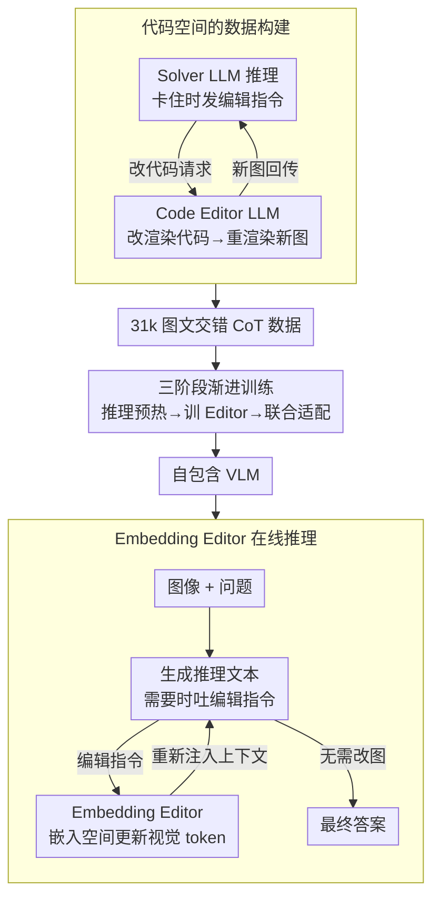

# DeepSketcher: Internalizing Visual Manipulation for Multimodal Reasoning

**会议**: CVPR 2026  
**arXiv**: [2509.25866](https://arxiv.org/abs/2509.25866)  
**代码**: [GitHub](https://github.com/MiliLab/DeepSketcher)  
**领域**: 机器人  
**关键词**: 视觉推理, 图文交错推理, 视觉思考, 嵌入编辑器, 代码渲染

## 一句话总结

提出DeepSketcher套件——包含31k高质量代码渲染的图文交错CoT数据集和一个自包含的Embedding Editor模型，使VLM无需外部工具即可在视觉嵌入空间直接生成"视觉思考"进行多模态推理。

## 研究背景与动机

"thinking with images"是VLM推理的新范式，通过让模型在推理过程中操作视觉输入（裁剪、缩放、画辅助线等），实现更深层的视觉理解。但现有方法面临三个核心矛盾：

1. **动作空间有限**：VILASR等方法只支持预定义的操作集（缩放、裁剪），灵活性差
2. **空间定位困难**：DeepEyes等通过RL学习操作，但依赖精确的坐标回归，训练数据噪声大
3. **训练难度极高**：Bagel等尝试统一生成和推理，但"想象力"空间太大，有效性未充分验证

DeepSketcher从代码渲染VQA数据出发，提出互补视角：所有图像通过代码渲染生成，视觉操作通过修改代码实现——精确、可复现、无空间定位噪声。

## 方法详解

### 整体框架

DeepSketcher想解决的是：让VLM在推理过程中真正"动手改图"，又不依赖外部工具调用和精确坐标。它的做法分两条线——离线先用一套双Agent系统在代码空间里把"边推理边改图"的过程录制成31k条图文交错CoT数据；在线则训练一个自包含模型，推理时不再真的渲染图像，而是让一个Embedding Editor在视觉嵌入空间里直接把"改图"这一步做掉。

具体到一次在线推理：模型读入代码渲染出的图像和问题，先生成一段推理文本并在需要时吐出一条编辑指令；Embedding Editor接过这条指令，在视觉嵌入空间里更新视觉token；更新后的嵌入被重新注入上下文，模型据此继续往下推理，直到给出最终答案。整个"看图—想—改图—接着想"的循环全在模型内部完成，没有任何代码执行或重复的图像编码。

### 关键设计

**1. 代码空间的数据构建：用改代码代替改像素，绕开定位噪声**

"thinking with images"最难的一步是怎么拿到高质量的"边推理边改图"轨迹。像素级操作要么受限于预定义动作集，要么依赖坐标回归、训练数据噪声大。DeepSketcher的切入点是：既然所有图像都由代码渲染而来，那"改图"就等价于"改代码"。它搭了一个双Agent闭环——Solver LLM负责推理并在卡住时发出一条操作请求（如"把这条辅助线画出来"），Code Editor LLM接到请求后去修改渲染代码、重新跑出新图，新图再喂回Solver继续推理。这样"推理→指令→改代码→渲染→推理"循环往复，每一步的图像都是代码精确生成的，可复现、可验证，天然没有像素操作的定位噪声，也没有生成模型那种不可控的幻觉。最终筛出的31k条轨迹覆盖数学、物理、化学等多学科。

**2. Embedding Editor：把"改图"内化到嵌入空间，推理时不再渲染**

数据是用代码渲染造的，但在线推理时再去执行代码、重新编码图像太慢也太重。Embedding Editor要做的就是把这一整套"改图"操作压进模型内部的一次前向传播。它采用Q-Former风格的交叉注意力结构：当前的视觉token作为Query，编辑指令的隐藏状态经自适应池化后作为Key/Value，通过交叉注意力加FFN直接算出更新后的视觉嵌入。也就是说，模型不再生成一张新的像素图，而是直接在视觉表示层面把"画了辅助线之后的图"对应的嵌入算出来。这样就彻底摆脱了对代码执行、外部工具和重复图像编码的依赖，让"thinking with images"变成模型自己能完成的一步。

**3. 三阶段渐进训练：先靠GT喂养，再逐步断奶**

如果一上来就端到端训练，Editor早期会吐出带噪声的嵌入，反过来污染推理、整个系统学不动。DeepSketcher因此把训练拆成三段，逐步把模型对"真值图像"的依赖解耦掉。Phase 1是推理预热，直接用GT编辑图像的特征喂进上下文，让LLM先学会怎么利用"改过的图"做推理；Phase 2开始训练Editor，冻结其他模块，用L1损失把Editor预测的嵌入对齐到GT编辑图像的嵌入上；Phase 3做联合适配，解冻LLM骨干，让推理主干去适应Editor真实输出的（而非GT的）嵌入。每一阶段只动一个环节，保证组件逐个稳定下来再耦合。

### 一个完整示例

以一道几何题"求三角形某角"为例，走一遍数据构建的双Agent闭环：

- **起点**：代码渲染出一个三角形，Solver LLM读图后推理"需要作一条从顶点到对边的辅助线才能用相似三角形"，于是发出操作请求"添加辅助线 AD"。
- **第一轮改图**：Code Editor LLM接到请求，在渲染代码里加上画线 AD 的语句，重新渲染出带辅助线的新图，回传给 Solver。
- **接着推理**：Solver 看到新图，继续推理"现在出现两个相似三角形"，但发现还需要标注角度，于是再发请求"标出 ∠ADB"。
- **第二轮改图**：Code Editor 再次改代码、重渲染，新图回传。
- **收尾**：Solver 据此完成计算给出答案。

这一整条"推理文本 + 编辑指令 + 渲染新图"交替出现的记录，就是一条图文交错CoT轨迹。在线推理时，这条链路里"改代码+重渲染"的两步被 Embedding Editor 的两次前向替代——模型自己在嵌入空间里"画"出 AD 和标注，不再真的跑代码。

### 损失函数 / 训练策略

- Phase 1：标准自回归语言建模损失（仅监督文本token）
- Phase 2：L1嵌入重建损失（对齐Editor预测嵌入与GT编辑图像嵌入）+ 条件语言建模损失
- Phase 3：与Phase 2相同目标，但解冻LLM骨干一并适配

## 实验关键数据

### 主实验（多模态推理基准）

| 模型 | MathVerse | MathVision | MathVista | LogicVista | WeMath | 平均 |
|------|-----------|------------|-----------|------------|--------|------|
| Qwen2.5-VL-7B | 41.1 | 27.0 | 68.2 | 39.8 | 34.3 | 42.1 |
| DeepEyes-7B | 42.2 | 26.6 | 70.1 | 47.7 | 38.9 | 45.1 |
| Mirage-7B (Inner Visual) | 27.3 | 28.6 | 63.7 | 40.7 | 16.7 | 35.4 |
| DeepSketcher-7B | 43.2 | 32.3 | 69.1 | 48.1 | 37.1 | 46.0 |

### 消融实验

| 阶段 | 设置 | MathVerse | WeMath | Indicator-500 |
|------|------|-----------|--------|---------------|
| Phase 2 | 纯文本基线 | 37.2 | 28.3 | 38.3 |
| Phase 2 | +Editor | 41.6 | 37.5 | 33.8 |
| Phase 3 | 纯文本基线 | 38.1 | 31.2 | 37.5 |
| Phase 3 | +Editor | 43.2 | 37.1 | 40.5 |

### 关键发现

- 在几何和计数任务上改进最显著（MathVision +5.3），涉及符号操作的任务改进较小
- 双Agent协作（Solver+Code Editor）比单独推理显著提升（GPT-4.1 pass@8: 0.72→0.80）
- Embedding Editor的差异图可视化显示编辑区域与指令高度一致

## 亮点与洞察

- 代码空间的数据构建是优雅的解决方案：精确、可复现、可验证，避免了坐标回归和图像生成的噪声
- Embedding Editor在嵌入空间操作的设计独特——不生成像素图像，而是直接修改视觉表示
- 作为"Inner Visual Thought VLM"中的最强方法，证明了内化视觉操作的可行性
- 31k数据集覆盖多学科（数学、物理、化学等），高质量且可扩展

## 局限与展望

- 代码渲染数据限制了应用范围（主要是结构化图形），自然图像场景未覆盖
- Embedding Editor的编辑质量仍不如GT代码渲染图像（Indicator-500上有差距）
- 比工具调用方法慢（因为需要经过Editor的前向传播）
- Phase 3解冻LLM后Indicator-500性能有时下降，说明适配不完全

## 相关工作与启发

- **vs VILASR/DeepEyes**: 预定义操作集+坐标回归；DeepSketcher动作空间开放且无需坐标
- **vs Mirage/Bagel**: 在压缩潜空间编辑图像；DeepSketcher在视觉token空间操作，保留更多语义信息
- **vs Visual Sketchpad**: 依赖外部工具执行；DeepSketcher内化整个操作链路

## 评分

- 新颖性: ⭐⭐⭐⭐⭐ 代码空间数据构建+嵌入空间视觉编辑，双重创新
- 实验充分度: ⭐⭐⭐⭐ 多基准覆盖，消融详细，但缺少自然图像场景评估
- 写作质量: ⭐⭐⭐⭐ 方法流程清晰，三阶段训练设计合理
- 价值: ⭐⭐⭐⭐ 为"thinking with images"范式提供了新的数据和模型路径

<!-- RELATED:START -->

## 相关论文

- [\[ICML 2026\] iVGR: Internalizing Visually Grounded Reasoning for MLLMs with Reinforcement Learning](../../ICML2026/multimodal_vlm/ivgr_internalizing_visually_grounded_reasoning_for_mllms_with_reinforcement_lear.md)
- [\[CVPR 2026\] HIVE: Query, Hypothesize, Verify — An LLM Framework for Multimodal Reasoning-Intensive Retrieval](hive_query_hypothesize_verify_an_llm_framework_for_multimodal_reasoning-intensiv.md)
- [\[CVPR 2026\] PhysInOne: Visual Physics Learning and Reasoning in One Suite](physisinone_visual_physics_learning_and_reasoning_in_one_suite.md)
- [\[CVPR 2026\] CodeDance: A Dynamic Tool-integrated MLLM for Executable Visual Reasoning](codedance_a_dynamic_tool-integrated_mllm_for_executable_visual_reasoning.md)
- [\[CVPR 2026\] ReasonMap: Towards Fine-Grained Visual Reasoning from Transit Maps](reasonmap_towards_fine-grained_visual_reasoning_from_transit_maps.md)

<!-- RELATED:END -->
