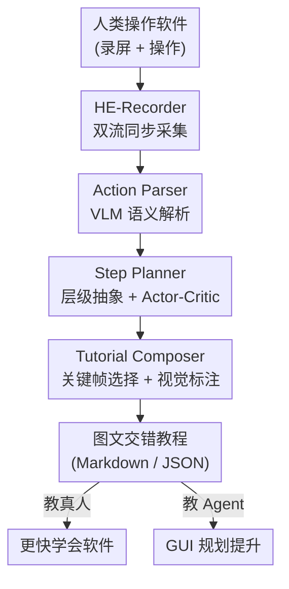

# Demo2Tutorial: From Human Experience to Multimodal Software Tutorials

**会议**: CVPR 2026  
**arXiv**: [2606.03951](https://arxiv.org/abs/2606.03951)  
**代码**: https://github.com/showlab/Demo2Tutorial (将开放)  
**领域**: 多模态VLM / GUI Agent / 计算机使用  
**关键词**: 软件教程生成, 屏幕录制, GUI Agent, 多模态文档, Actor-Critic

## 一句话总结
Demo2Tutorial 是一个 agentic 框架，把人类操作软件的原始屏幕录制 + 底层操作日志，自动蒸馏成图文交错的结构化教程；生成的教程在自建 benchmark 上质量（86.2）反超官方人工教程（79.1），既能让 GUI Agent 在 OSWorld 上规划成功率大幅提升（GPT-5 在 Chrome 上 52.9%→70.6%），也能让真人学软件提速 10.5%、80% 用户更偏好。

## 研究背景与动机

**领域现状**：人类在数字环境里的操作行为（点击、敲键、拖拽）是一座巨大的程序性知识金矿。已有不少工作研究真实世界教学视频的理解，但把这种理解延伸到「交互式数字环境」（桌面软件操作）几乎是空白。人类使用电脑的经验主要有两种形态：原始屏幕录制（demonstration，演示）和精心制作的分步教程（tutorial）。

**现有痛点**：作者指出 demonstration 和 tutorial 之间存在一道关键鸿沟。演示的目的是「展示功能（what it does）」，观众是被动旁观者，录制只需录屏即可、零成本；教程的目的是「教会技能（how to do it）」，要把观众变成主动参与者，需要分步指令 + 语言讲解 + 视觉高亮。把一段冗长、未剪辑的录屏变成高质量教程，需要大量人力。

**核心矛盾**：自动化制作教程要同时啃下两块硬骨头——其一是**长上下文压缩**：一段原始演示里塞满了啰嗦、无关的操作，必须挑出并概括关键步骤；其二是**多模态引导**：合格教程的每一步都要图文并茂，既有清晰的文字旁白，又有视觉高亮（如局部放大、点击标记）来引导注意力。这两点正是纯录屏做不到、人工又太贵的地方。

**本文目标**：构建一个端到端框架，自动采集人类「计算机使用经验」，并转化为结构化、可复用的多模态教程文档，让这份蒸馏出来的知识同时服务两类学习者——真人学习者（学新软件）和计算机使用 Agent（提升桌面任务规划）。

**切入角度**：作者观察到，与「直接拿原始演示训练 Agent」（隐式行为模仿）不同，把演示先蒸馏成可解释的教程，能让 Agent 走「指令遵循」路线，知识更可读、更可迁移。

**核心 idea**：用「录制 → 解析 → 规划 → 合成」四阶段 agentic 流水线，把底层操作流（low-level action）自底向上抽象成层级任务图，再渲染成带智能视觉标注的图文交错教程。

## 方法详解

### 整体框架
Demo2Tutorial 的输入是一次人类操作软件的录制（屏幕视频 + 同步的底层操作日志），输出是一份图文交错、分章节分步骤的教程文档（同时存为 Markdown 和 JSON）。整条流水线由四个核心组件串行协作：HE-Recorder 负责双流同步采集；Action Parser 把底层操作翻译成自然语言语义；Step Planner 自底向上把零散动作抽象成层级任务图，并用 actor-critic 回环打磨质量；Tutorial Composer 为每一步挑选最佳关键帧并叠加自适应视觉标注，最终渲染成教程。

### 关键设计

**1. HE-Recorder：把「只录画面」升级为「画面+操作」双流同步采集**

现有录屏工具只录视觉流，丢掉了「人到底点了哪、按了什么键」这种底层语义，下游想理解意图就只能靠猜。HE-Recorder 同时采集两路：用 FFmpeg + ddagrab 滤镜原生录制全屏 30 FPS 高保真视频（无需 OBS 等外部软件），并在 KeyCastOW（C++ 按键可视化工具）基础上改造出实时操作日志，记录所有鼠标动作（点击/移动/拖拽）和键盘输入，并带高精度时间戳写入结构化日志。难点在于不同机器上视频流与操作流存在不可避免的时延，作者设计了一个**交互式时间校准**机制：录制开始时屏幕弹出计时器提示用户按热键，以这一刻作为两路流共同的时间锚点。这一步对齐对捕捉专家用户「快速连续操作」尤其关键——没有它，密集动作序列就对不上对应视频帧

**2. Action Parser：自底向上的 VLM 语义解析，把底层动作翻译成「看到什么/做了什么/想干什么」**

光有「在(x,y)点击」这种坐标级日志没法生成教程，必须先把它升维成语义。Parser 先做**数据校准**三步预处理：用热键时间戳对齐动作与视频帧、把 1 秒窗口内的连续敲键合并成单个「typing」动作、把 Shift/Ctrl/Alt 等修饰键合并成「快捷键」动作，以降低粒度同时保留语义。然后用 GPT-4o 做**动作锚定的视觉提示**解析：对每个动作抽取「操作前 / 操作后」两帧截图，在鼠标坐标处画红框高亮交互区域。为抑制幻觉、提高准确率，作者设计了一套 Chain-of-Thought 提示，强制 VLM 顺序输出五个字段——(1) 操作前观察、(2) 操作后观察、(3) 两态差异、(4) 事实性动作描述、(5) 推断的用户意图。这种结构化推理把「低层操作」和「高层意图」显式区分开，为后面的任务级抽象打底

**3. Step Planner：自底向上层级抽象 + Actor-Critic 迭代精炼**

把一长串原子动作直接交给 LLM，要么粒度太碎、要么把无关操作也写进教程。Planner 反其道而行，不做 top-down 的任务分解，而是 **bottom-up 三级抽象**：在 step 层，把围绕同一子目标的连续动作（如「把字号调到 24pt」）聚成一个带动作动词（click/type/select/drag）的指令步骤；在 chapter 层，把语义相关的步骤聚成逻辑阶段（如「基础配置」「内容编辑」）；最后从所有章节综合出一个总教程目标。这种自底向上的聚合天然过滤掉无关操作、保留真实工作流；对超长序列还会在自然断点（软件切换、时间间隙）处分块，再合并各块输出并解决时序与层级依赖。质量保证靠一个 **actor-critic 回环**：Planner 当 actor，生成带层级组织和步骤指令的结构化教程 JSON 草稿；独立的 Critic agent 从覆盖度、粒度、有序性、可学习性等维度打分，不达标就给出可执行的反馈；Planner 据此在下一轮精炼指令清晰度、调整粒度或重组章节边界，直到 Critic 通过或达到最大迭代上限

**4. Tutorial Composer：关键帧打分选择 + 自适应视觉标注**

教程草稿有了文字，还缺「每一步配哪张图、图上怎么标」。Composer 的第一个核心是**关键帧选择**：不是均匀采样或按固定时间戳取帧，而是在动作前后的时间窗内采多个候选帧，用一个多维加权打分函数挑最优——四项准则为 (1) 文本相关性（OCR 把帧内容与指令文本做语义匹配）、(2) 图像清晰度（拉普拉斯方差避免运动模糊）、(3) 运动稳定性（时序一致性避免抓到过渡瞬间）、(4) 时间邻近度（与动作时间戳的高斯加权距离）。打分最高的帧作为视觉锚点，即便面对复杂多步操作或拖拽也能保证图文对齐。第二个核心是**自适应视觉标注**：借助 SAM2 做 UI 组件分割、RapidOCR 做文字区域检测，按动作类型动态叠加标注——点击标记、拖拽轨迹、快捷键徽标、细节放大镜；并辅以自适应裁剪（聚焦动作密集区）、高亮（强调相关 UI 元素）、对比度调整等编辑操作，确保每一步都有清晰无歧义的视觉引导

### 一个完整示例
以「在 PowerPoint 里做一个自定义运动路径动画」为例走一遍：专家用 HE-Recorder 录下整个操作（屏幕视频 + 点击/敲键日志，开头按热键校准时间）→ Action Parser 把「点击动画面板」「拖拽路径锚点」等底层动作逐个翻译成五字段语义描述 → Step Planner 把零散动作聚成「选中对象」「添加运动路径」「调整时序」等步骤、再聚成章节、综合出总目标，Critic 发现某步粒度太粗就打回重写 → Tutorial Composer 为「拖拽路径锚点」这步在动作窗口内挑出最清晰、与文字最匹配、无运动模糊的那一帧，叠上拖拽轨迹箭头和局部放大镜 → 输出一份每步图文对齐、有视觉高亮的教程。对照实验里，官方教程只给一张截图配大段文字，Vanilla 多智能体基线则图文错位、指令含糊（如「apply animations」），而 Demo2Tutorial 每步都有语义对齐的标注截图。

## 实验关键数据

### 主实验：教程生成质量（TutorialBench）
评测在自建 TutorialBench 上进行（110 个样本，覆盖 Word/PPT/Excel/Acrobat/Premiere/Photoshop/After Effects 7 款软件，每个样本是 ⟨任务目标, 原始演示, 官方教程⟩ 三元组）。用 GPT-4o 做 VLM-as-judge，按内容分（可执行性 Action / 完整性 Complete / 简洁性 Concise）和视觉分（标注 Annot / 图像相关性 Img Rel）两域五维打分（0-1，乘 100 显示）；VLM 评分与人工评分相关性 $\rho=0.755$。

| 框架 | Action. | Complete. | Concise. | 内容均值 | Annot. | Img Rel. | 视觉均值 | 总分 |
|------|---------|-----------|----------|----------|--------|----------|----------|------|
| GT（人工官方教程） | 81.0 | **90.6** | **83.1** | 84.9 | 54.4 | 86.6 | 70.5 | 79.1 |
| Text-based 端到端 | 75.4 | 62.0 | 40.1 | 59.2 | – | – | – | – |
| Vision-based 端到端 | 78.2 | **95.1** | 65.1 | 79.4 | 9.2 | 74.0 | 41.6 | 64.3 |
| Vanilla Multi-Agent | 71.1 | 88.9 | 59.0 | 73.0 | 51.3 | 81.5 | 66.4 | 70.3 |
| **Demo2Tutorial** | **90.5** | 92.3 | 70.8 | 84.5 | **83.3** | **94.0** | **88.7** | **86.2** |

Demo2Tutorial 总分 86.2，反超人工官方教程（79.1），并大幅领先所有基线。值得注意的是它在视觉分上 88.7 远超人工的 70.5——人工教程往往只给部分步骤配图、缺乏全程视觉标注，反而被自动化的关键帧选择 + 自适应标注超越。

### 消融实验（OSWorld，教程是否帮到 GUI Agent）
把生成教程接入 Agent-S3 框架，在 OSWorld 的 Chrome（17 任务）/ VLC（14 任务）上测成功率（%）：

| 模型 | Chrome 基线 | Chrome +Tutorial | VLC 基线 | VLC +Tutorial |
|------|-------------|------------------|----------|----------------|
| o4-mini | 47.1 | 58.8 (+11.7) | 53.4 | 56.1 (+2.7) |
| GPT-5 | 52.9 | **70.6 (+17.6)** | 59.6 | **70.7 (+11.1)** |

对四级上下文（baseline / +Text / +Image / +Tutorial）的消融显示：只加文字（+Text）提升微弱（文字缺乏视觉锚定，无法支撑视觉动作推理）；只加图像（+Image）贡献不稳定（Chrome 有帮助、VLC 因域差异波动）；唯有完整图文教程（+Tutorial）始终给出最高成功率，印证「语言-视觉紧耦合」才是最强的知识增强。

### 关键发现
- **视觉锚定是教程质量的命门**：纯文本生成总分仅 59.2，Vision-based 虽靠堆采样帧把完整性刷到 95.1，但视觉标注崩到 9.2（均匀采样导致画面杂乱、缺有效引导），总分只有 64.3。
- **Actor-Critic + 智能标注是关键增量**：Vanilla Multi-Agent 已用上动作对齐关键帧，但缺 actor-critic 精炼和 Composer 自适应标注，总分 70.3，比 Demo2Tutorial 低 15.9，这道差距直接量化了两个核心设计的贡献。
- **真人学习收益**：20 人用户研究（PowerPoint 自定义运动路径动画任务，10 人看录屏 vs 10 人看生成教程），用教程平均 131.6 秒完成，比看录屏（147.1 秒）快 10.5%；16/20（80%）用户更偏好教程格式。

## 亮点与洞察
- **「demonstration → tutorial」这个问题定义本身很有洞察**：把「展示功能」和「教会技能」的鸿沟讲清楚，自然引出长上下文压缩 + 多模态引导两大挑战，框架的四个组件刚好各打一个痛点，叙事闭环。
- **自底向上层级抽象 + actor-critic** 这套组合可迁移：任何「把长序列噪声操作压成结构化文档」的任务（如把日志/轨迹转成 SOP、把代码操作转成 onboarding 文档）都能复用「聚原子→聚步骤→聚章节 + critic 把关」的范式。
- **关键帧多维打分函数**很实用：文本相关性(OCR)+清晰度(拉普拉斯方差)+运动稳定性+时间邻近度，四项加权，是一个轻量、无需训练、可直接搬到「为任意动作序列配图」场景的工程 trick。
- **「自动教程反超人工」的视觉分结果**让人 aha：人工教程因为太费力反而省略了大量配图，自动化在「不嫌累」这点上天然占优。

## 局限与展望
- **平台局限**：当前只覆盖桌面软件，作者也承认未来要扩展到移动端 / Web 平台。
- **依赖闭源大模型**：Action Parser 用 GPT-4o、规划模型用 GPT-5/o4-mini，成本与可复现性受限；论文把 runtime/cost 统计放在补充材料，正文未给。
- **评测规模与主观性**：TutorialBench 仅 110 样本、7 款软件；质量评测用 VLM-as-judge（$\rho=0.755$ 算中高相关但非强一致），人类用户研究仅 20 人、单一 PPT 任务，结论的普适性有待更大规模验证。⚠️ 横向比较时需注意不同软件任务复杂度差异很大（After Effects 平均 21.4 步 vs Word 7.35 步），分数不宜直接跨软件比大小。
- **改进思路**：作者提到要做个性化教程生成、提升计算效率；可补充自适应标注的失败案例分析（如 SAM2/OCR 误检时标注错位）。

## 相关工作与启发
- **vs 视觉设计自动化（Paper2Poster / PPTAgent / AutoPresent）**：它们从「已结构化的文档」生成海报/幻灯片，主要优化美学；本文从「未结构化的原始人类演示」生成教程，难点在于先把噪声操作流抽象成结构，是更上游、更难的输入侧问题。
- **vs 计算机使用 Agent（UI-TARS / OpenCUA / Agent-S2/S3）**：这些工作把 GUI 自动化做成端到端 vision-language-action，或直接拿人类演示训练 Agent（隐式行为模仿）；本文把演示蒸馏成可解释教程当外部知识，走「指令遵循」而非「行为模仿」，提供可读、可迁移的规划引导，并实测能插进 Agent-S3 提升 OSWorld 成功率。
- **vs 从演示学习（OpenCUA / VideoAgentTrek / VideoWebArena）**：前者靠大规模人机交互轨迹做预训练或挖无标注录屏 bootstrap；本文强调把交互经验表示成「Agent 能高效消费的形式」（结构化教程），是对这条线「表示形式」问题的正面回答。

## 评分
- 新颖性: ⭐⭐⭐⭐⭐ 「demonstration→tutorial」问题定义 + 自底向上层级抽象 + 教程同时服务人与 Agent 的双重效用，组合新颖。
- 实验充分度: ⭐⭐⭐⭐ 三条评测线（质量/Agent/真人）齐全且自洽，但 benchmark 与用户研究规模偏小、部分成本细节藏在补充材料。
- 写作质量: ⭐⭐⭐⭐⭐ 问题动机讲得透彻，四组件职责清晰，图表与正文数字对得上。
- 价值: ⭐⭐⭐⭐⭐ 同时利好软件学习者与 GUI Agent 训练，TutorialBench 与开源代码对社区有实用价值。

<!-- RELATED:START -->

## 相关论文

- [\[CVPR 2026\] ProSoftArena: Benchmarking Hierarchical Capabilities of Multi-modal Agents in Professional Software Environments](prosoftarena_benchmarking_hierarchical_capabilities_of_multi-modal_agents_in_pro.md)
- [\[CVPR 2026\] HumanVBench: Probing Human-Centric Video Understanding in MLLMs with Automatically Synthesized Benchmarks](humanvbench_probing_human_centric_video_understanding_in_mllms_with_automatica.md)
- [\[CVPR 2026\] Mimic Human Cognition, Master Multi-Image Reasoning: A Meta-Action Framework for Enhanced Visual Understanding](mimic_human_cognition_master_multi-image_reasoning_a_meta-action_framework_for_e.md)
- [\[CVPR 2026\] VLM-Guided Group Preference Alignment for Diffusion-based Human Mesh Recovery](vlm-guided_group_preference_alignment_for_diffusion-based_human_mesh_recovery.md)
- [\[NeurIPS 2025\] Face-Human-Bench: A Comprehensive Benchmark of Face and Human Understanding for Multi-modal Assistants](../../NeurIPS2025/multimodal_vlm/face-human-bench_a_comprehensive_benchmark_of_face_and_human_understanding_for_m.md)

<!-- RELATED:END -->
