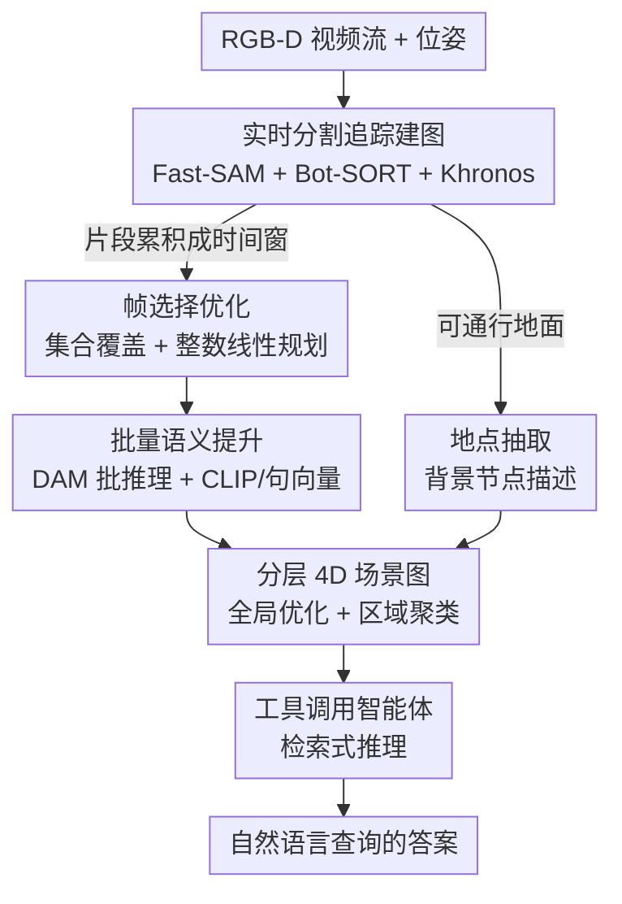

# Describe Anything Anywhere At Any Moment

**会议**: CVPR 2026  
**论文**: [CVF Open Access](https://openaccess.thecvf.com/content/CVPR2026/html/Gorlo_Describe_Anything_Anywhere_At_Any_Moment_CVPR_2026_paper.html)  
**代码**: 论文称将开源数据与实现，未在正文给出链接  
**领域**: 多模态VLM  
**关键词**: 时空记忆, 4D场景图, 局部区域描述, 具身问答, 实时建图  

## 一句话总结
DAAAM 把"实时的几何-语义建图"和"大模型生成的细粒度局部描述"解耦开：用一个优化问题挑选最少的关键帧、再批量喂给 Describe Anything Model（DAM）生成开放词汇描述，从而在 10 Hz 实时下构建带详细文字标注的分层 4D 场景图，作为具身智能体的时空记忆，在大尺度时空问答与序列任务定位上取得 SOTA。

## 研究背景与动机
**领域现状**：机器人和 AR 需要一种"时空记忆"，既能精确地把物体定位在 3D 里（用于操作、导航），又能用丰富的开放词汇语义回答任意自然语言查询（"我上次在哪、什么时候看到红色螺丝刀？"）。目前主要有两条路线：一是度量-语义地图（尤其是 3D 场景图），把物体几何重建后再赋予语义；二是基于视角的方法，直接用多模态大模型给每帧/每段视频打文字标注存进数据库做检索。

**现有痛点**：这两条路各有硬伤。度量-语义地图要么用快但封闭词汇的分割/embedding（语义太弱），要么逐物体去查大模型拿开放词汇标注（精确但极慢，无法实时）。基于视角的方法语义够丰富，但标注是"按帧存"而不是"按物体存"，缺乏跨帧的空间和时间一致性——它没把同一物体在不同帧的观测关联起来，因此答不了"数一下有几把椅子"或长程空间关系这类问题。

**核心矛盾**：表达力越强的语义描述（来自越大的模型），就越贵、越难在移动端实时跑；而要做精确空间推理，又必须把描述真正"接地"到 3D 几何上。丰富语义、3D 接地、实时计算三者，现有方法只能同时占两个。

**本文目标**：构建一个同时满足三者的时空记忆——大尺度、实时、带细粒度开放词汇描述、且几何上严格接地。

**切入角度**：作者注意到，"几何追踪"可以在传感器帧率（10 Hz）下跑，真正昂贵的只是"调用大模型生成细致描述"这一步。那么与其逐帧逐物体地查大模型，不如把昂贵的语义标注从快速的几何前端**解耦**出去，只在少数精选帧上批量做一次。

**核心 idea**：把"该标注哪些帧、哪些 mask"形式化成一个优化问题，求出能覆盖所有物体片段的最少帧集合并挑选最佳视角，再用批量推理一次性喂给 DAM——把 3B 级大模型的在线部署提速一个数量级，最终把这些描述回填进一个全局一致的分层 4D 场景图作为记忆。

## 方法详解

### 整体框架
输入是带位姿的 RGB-D 视频流，输出是一个随时间增量构建、全局空间与时间一致的**分层 4D 场景图（4D SG）**，图中每个物体/地点节点都挂着 DAM 生成的详细自然语言描述及其历史时间戳；下游一个工具调用智能体（tool-calling agent）通过检索这张图来回答自然语言查询。

整条管线把"快"和"慢"两条线程拆开。快线程跟随 Khronos 前端在 10 Hz 下做实时几何处理（**A·主动窗口**，本文沿用 [Khronos] 搭好的脚手架）：每帧先用 Fast-SAM 切成 segment、用 Bot-SORT 跨帧追踪成物体片段（fragment），再由 Khronos 把片段抬升到 3D 并重建形状与位置。慢线程并行做昂贵的语义标注：先用**帧选择优化**挑出最少且视角最好的帧，再**批量语义提升**一次性把 DAM 描述打到所有片段上，同时给背景做**地点抽取**，最后在后端做**全局优化与区域聚类**把节点合并、补齐时间历史并抽象出区域。最终下游用**工具调用智能体**消费这张记忆图。其中"帧选择优化 + 批量语义提升"是把大模型塞进实时管线的关键，"分层 4D 场景图"是记忆本体。

### 关键设计

**1. 帧选择优化：用最少的帧覆盖所有物体，把大模型调用次数压到最低**

痛点直接：要拿到细致描述就得调 DAM 这种大模型，而逐帧逐物体地调根本无法实时。作者把"在一个时间窗 $w=[t_{start}, t_{start}+m]$ 内该标注哪些帧"建成一个两步优化。先解集合覆盖问题，求出能让每个被追踪片段 $o_j^w$ 至少被看见一次的最小帧集合 $\mathcal{S}$：

$$K^\star = \min_{\mathcal{S}\subseteq \mathcal{F}^w} |\mathcal{S}| \quad \text{s.t.} \quad \forall o_j^w\in \mathcal{O}:\ \exists f_i\in \mathcal{S},\ v_{ij}=1$$

其中可见性指示 $v_{ij}\in\{0,1\}$ 表示片段 $j$ 在帧 $i$ 是否可见，这一步用贪心求解得到最小帧数 $K^\star$。光"看得见"还不够，还要"看得清"，于是第二步在固定帧预算 $K^\star+\epsilon$（松弛 $\epsilon=1$）下解一个二元线性规划，最大化被选片段的视角质量：

$$\max_{x,y}\ \sum_{i}\sum_{j} q_{ij}\, y_{ij}\quad \text{s.t.}\quad \sum_i x_i = K^\star+\epsilon,\ \sum_i y_{ij}=1,\ y_{ij}\le x_i,\ y_{ij}\le v_{ij}$$

$x_i$ 表示是否选帧 $i$，$y_{ij}$ 把片段 $j$ 唯一指派到一个可见它的被选帧。质量分把"位置"和"大小"两项加权：$q_{ij}=\alpha\, q^{pos}_{ij}+(1-\alpha)\, q^{size}_{ij}$（$\alpha=0.5$）。$q^{pos}_{ij}$ 用归一化坐标的熵来偏好画面中心的物体（居中时最大、贴边时最小）；$q^{size}_{ij}$ 用一个双曲正切对大物体饱和、并惩罚小于最小面积阈值 $A_{min}$ 的物体，保证被标注的物体足够清晰。这一设计妙在它同时压低了送进 DAM 的帧数、又让每帧塞进尽量多 mask，天然契合后面的批量推理。

**2. 批量语义提升：一次前向同时标注一帧里的所有 mask，把 3B 模型提速一个数量级**

拿到"图像-片段"配对后，作者把选中的图像和 mask 打包成单个张量，一次 DAM 前向就给所有片段生成描述，而不是逐 mask 调用——这把多帧多 mask 的冗余计算和并行度都吃满了。配合设计 1 选出的帧数本就最少、每帧 mask 又多，DAM 的批推理在 batch size 48–128 时相比逐张（batch=1）提速约一个数量级（Fig. 3），这是 DAAAM 能在 10 Hz 实时下还用得起 3B 大模型的根本原因。除文字描述外，每个片段还在批处理中被赋予一个 CLIP 特征和一个句向量特征，用于后续语义检索、聚类、汇总以及重复观测物体的对账（reconciliation）。

**3. 分层 4D 场景图：把描述真正接地到全局一致的几何记忆里**

基于视角的方法答不了长程问题，根子在于标注没和 3D 关联。DAAAM 把描述回填进一张 4D 场景图：除物体节点外，还做**地点抽取**——基于地面可通行性把局部占据图沿 Z 轴压平、再用内接最大矩形（最大边长约束 2 m）镶嵌出地点节点 $p_j$；地点的语义不是用整帧描述（作者发现整帧查询对 DAM 是分布外、易出错），而是投影到覆盖它的地面片段、按多数投票赋值。后端用 [Khronos] 的因子图持续优化所有节点位置以保证空间全局一致；几何与描述特征相近的物体/地点节点会被合并（reconciliation）以保证时间一致，合并时把各自的描述按时间戳**追加成历史**，这正是"At Any Moment"的来源。再往上，用余弦距离作边权、跑 Hydra 的最稳团（most-stable-clique）算法把地点聚成区域 $R_i$，物体归到最近的簇，并用对区域内特征做最远点采样后提示 LLM 生成区域摘要。这样得到的是一张语义详尽、几何精确、还带时间历史的分层记忆。

**4. 工具调用智能体：用检索式推理消费 4D 场景图**

记忆建好后，推理交给一个工具调用智能体：它可以 (a) 基于语义检索物体、(b) 查询区域信息、(c) 查询智能体自身信息，检索结果带回每个 4D SG 节点的空间与时间信息。因为记忆已经做好了几何接地和时间对账，智能体只需在结构化的节点上做组合推理，就能回答涉及长程空间关系、物体计数、时间跨度的复杂查询，而不必让大模型从一堆原始帧里硬猜 3D 结构。

## 实验关键数据

### 主实验

在作者重标注扩展的大尺度长时基准 **OC-NaVQA**（最长 35.8 min、行进 1.64 km）上，DAAAM 全面超过基于视角的 ReMEmbR 与基于度量-语义地图的 ConceptGraphs（均用 GPT-5-mini 做推理）：

| 数据集 | 方法 | 问答准确率↑ | 位置误差[m]↓ | 时间误差[min]↓ |
|--------|------|------|------|------|
| OC-NaVQA | ReMEmbR (NVILA-Lite-2B) | 0.432 | 53.47 | 2.287 |
| OC-NaVQA | ReMEmbR (NVILA-Lite-8B) | 0.463 | 55.89 | 4.106 |
| OC-NaVQA | ConceptGraphs | 0.299 | 111.29 | × |
| OC-NaVQA | **DAAAM (Ours)** | **0.711** | **41.75** | **1.792** |

在序列任务定位基准 **SG3D**（HM3D 场景）上，DAAAM 同时超过度量-语义地图方法（Hydra/HOV-SG）和专门做分层任务分析的 ASHiTA，体现其 4D SG 记忆的通用性：

| 方法 | 子任务准确率 s-acc[%]↑ | 任务准确率 t-acc[%]↑ |
|------|------|------|
| Hydra + GPT | 8.18 | 2.44 |
| Hydra (GT Seg) + GPT | 14.2 | 6.34 |
| HOV-SG | 8.98 | 1.95 |
| ASHiTA | 21.7 | 8.78 |
| **DAAAM (Ours) + GPT** | **22.16** | **11.22** |

在原始 NaVQA 上（Tab. 1），DAAAM（DAM-3B + GPT-5-mini）整体问答准确率 0.672、时间误差 1.591 min，长序列和时间推理上优势尤为明显，甚至优于更大的 ReMEmbR+VILA1.5-13b。作者也诚实地指出 NaVQA 存在多处缺陷（in-context 样本泄漏到测试集、空间答案标的是"观测位置"而非物体真实位置从而偏向视角方法、22/210 样本真值时间落在给定窗口之外），这也是他们另做 OC-NaVQA 的原因。

### 消融实验（OC-NaVQA）

| 配置 | 问答准确率↑ | 位置误差[m]↓ | 时间误差[min]↓ | 说明 |
|------|------|------|------|------|
| DAAAM (Full) | 0.711 | 41.75 | 1.792 | 完整模型 |
| w/o DAM 描述（只用图像 crop+视觉特征） | 0.776 | 50.05 | 2.396 | 位置/时间误差变差，二元题反而更好 |
| w/o 区域聚类 | 0.707 | 48.93 | 3.576 | 时间题受损最重 |
| w/o 帧选择质量启发式 | 0.627 | 49.92 | 1.678 | 空间与问答准确率下降 |

### 关键发现
- **显式文字描述主要利好空间/时间推理**：去掉 DAM 描述后，位置误差和时间误差分别恶化约 16.6% 与 25.4%；但二元（yes/no）题反而更好——直接把图像 crop 喂给 LLM 做视觉核验更可靠。空间和时间查询需要在很多描述与时间戳上做组合推理，简洁文字描述在这里更有优势。
- **区域聚类对时间查询最关键**：去掉后时间误差从 1.792 飙到 3.576，分层结构帮助回答"在里面待了多久"这类需要大范围上下文的问题。
- **质量启发式撑住空间精度**：去掉后问答准确率从 0.711 掉到 0.627；但 NaVQA 的时间题常聚焦大物体，质量分在那里作用较小。
- **检索互补性**：DAM 描述编成句向量做纯检索不如 CLIP（refCOCOg Top-1 18.07% vs 19.59%），但把 CLIP 与句向量拼接后反超 CLIP（25.11% vs 19.59%），说明两类特征捕获的信息互补。
- **实时性**：整体 10 Hz（Tab. 6），单 worker 每秒可标注约 5.2 个新片段；主瓶颈是分割与追踪而非语义线程。代价是慢线程有延迟——帧选择 1.2±0.74 s、语义提升 9.2±1.4 s，即详细推理约滞后 10 s，属于"高吞吐换低延迟"的取舍。

## 亮点与洞察
- **把"标注谁"当成一个可解的优化问题**：集合覆盖求最小帧数 + 二元线性规划挑最佳视角，这一形式化让"批量调用大模型"变得自然——选最少帧的同时每帧塞最多 mask，正好喂饱批推理。这个"先覆盖、再优选视角"的思路可迁移到任何"昂贵标注器 + 大量待标对象"的在线场景。
- **解耦快慢线程**：几何追踪 10 Hz 不间断，语义标注放到高延迟并行线程。它揭示了一个对机器人很实用的观点——大尺度长时记忆里，眼前一瞬的语义不那么重要，只要其余观测都被准确汇总即可，这正是"吞吐优先于延迟"成立的场景（仓库盘点、监控回看）。
- **描述按物体存成历史、而非按帧存**：合并节点时把描述追加成带时间戳的历史，既保证了空间一致又保留了时间维度，这是它能答时间题、而视角方法答不了的根因。

## 局限与展望
- **DAM 训练语料偏小（1.5M）**：对分布外或罕见物体的描述会"向均值幻觉"（如把电梯门脑补成带把手），作者预期更强的局部描述模型会缓解。
- **吞吐对更动态平台不够**：单 worker 每秒约 5.2 个片段够地面机器人用，但对快速飞行的无人机或 VR 头显可能偏慢；可换更小模型换吞吐。
- **追踪假设物体身份不变**：状态变换（如切割）会打断关联，产生与源物体无链接的新轨迹。
- **动态节点的描述历史可能不会无限可扩展**⚠️：作者承认需要后续研究摘要策略来约束记忆体量。
- ⚠️ 部分公式（质量分 $q^{pos}/q^{size}$ 的具体函数形式、BLP 的精确约束写法）在缓存全文中有 OCR 断裂，细节以原论文为准。

## 相关工作与启发
- **vs ReMEmbR（基于视角的检索增强记忆）**：ReMEmbR 把帧/视频段标注存进向量库做 RAG，语义灵活但缺 3D 接地，大尺度下多视角一致性和空间推理变差；DAAAM 把描述接地到全局一致的 4D 场景图，长序列与空间/时间题上明显更稳（OC-NaVQA 0.711 vs 0.463）。
- **vs ConceptGraphs（基于度量-语义地图）**：ConceptGraphs 逐物体查 VLM 拿开放词汇标注、且维护全点云，在数据集规模下既慢又爆内存（0.075 Hz，问答 0.299）；DAAAM 用帧选择 + 批推理把大模型成本摊薄，做到 10 Hz 实时。
- **vs Hydra / ASHiTA（场景图 / 任务分析）**：DAAAM 复用 Hydra/Khronos 作为几何前端与后端脚手架，但补上了 DAM 的细粒度开放词汇描述，因此即便对 Hydra 给真值单词标签也大幅领先，并超过专门做分层任务分析的 ASHiTA，体现 4D SG 记忆兼顾语义详尽与空间精确。

## 评分
- 新颖性: ⭐⭐⭐⭐⭐ 把"选哪些帧/mask 喂大模型"形式化成集合覆盖+ILP，干净地解决了"开放词汇语义 vs 实时 3D 接地"的老矛盾。
- 实验充分度: ⭐⭐⭐⭐⭐ 覆盖 SQA、序列任务定位、检索、消融、运行时五类实验，并自建 OC-NaVQA、坦诚指出原基准缺陷。
- 写作质量: ⭐⭐⭐⭐ 系统拆解清晰、动机扎实；公式排版（受 OCR 影响）和模块编号略多，初读需对照框图。
- 价值: ⭐⭐⭐⭐⭐ 给机器人/AR 提供了一个实时、可扩展、几何接地的细粒度时空记忆，工程落地价值高且开源。

<!-- RELATED:START -->

## 相关论文

- [\[CVPR 2026\] Enhancing Part-Level Point Grounding for Any Open-Source MLLMs](enhancing_part-level_point_grounding_for_any_open-source_mllms.md)
- [\[CVPR 2025\] Multimodal OCR: Parse Anything from Documents](../../CVPR2025/multimodal_vlm/multimodal_ocr_parse_anything_from_documents.md)
- [\[ICLR 2026\] Modal Aphasia: Can Unified Multimodal Models Describe Images From Memory?](../../ICLR2026/multimodal_vlm/modal_aphasia_can_unified_multimodal_models_describe_images_from_memory.md)
- [\[NeurIPS 2025\] MDReID: Modality-Decoupled Learning for Any-to-Any Multi-Modal Object Re-Identification](../../NeurIPS2025/multimodal_vlm/mdreid_modality-decoupled_learning_for_any-to-any_multi-modal_object_re-identifi.md)
- [\[ICCV 2025\] MAVias: Mitigate Any Visual Bias](../../ICCV2025/multimodal_vlm/mavias_mitigate_any_visual_bias.md)

<!-- RELATED:END -->
