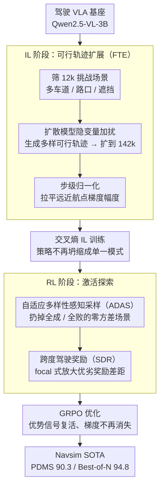

# Devil is in Narrow Policy: Unleashing Exploration in Driving VLA Models

**会议**: CVPR 2026  
**arXiv**: [2603.06049](https://arxiv.org/abs/2603.06049)  
**代码**: [GitHub](https://github.com/Mashiroln/curious_vla.git)  
**领域**: 多模态VLM  
**关键词**: 自动驾驶VLA, 窄策略问题, 探索-利用困境, 强化学习, 轨迹多样性

## 一句话总结

揭示驾驶 VLA 模型中被忽视的"窄策略"（Narrow Policy）瓶颈——IL 阶段过度利用导致探索坍缩，进而限制 RL 阶段。提出 Curious-VLA 框架，通过可行轨迹扩展 + 多样性感知 RL 在 Navsim 上达到 SOTA（PDMS 90.3，Best-of-N 94.8）。

## 研究背景与动机

**驾驶 VLA 的两阶段范式**：当前驾驶 VLA 普遍采用 IL（模仿学习）→ RL（强化学习）的两阶段训练，但存在根本性的探索-利用失衡。

**窄策略问题的发现**：IL 阶段使用交叉熵损失模仿真值轨迹，导致策略分布坍缩到单一模式，多次推理产生的轨迹几乎完全重叠（mean-pFDE 仅 0.20-0.33m）。

**RL 阶段的优势坍缩**：策略坍缩后，GRPO 采样的奖励几乎相同（$R(y_i) \approx \mu_R$），标准差 $\sigma_R \to 0$，导致优势估计 $A_i \to 0$，梯度消失。

**交叉熵损失的内在缺陷**：CE 将所有非真值 token 视为等价错误，缺乏空间/功能邻近性概念，鼓励对单一模式的过度自信。

**时序尺度不匹配**：远期航点方差远大于近期（$t=4s$ 的方差比 $t=0.5s$ 大数量级），远期损失主导训练。

**行为诊断指标的缺失**：此前缺乏定量诊断窄策略现象的工具。

## 方法详解

### 整体框架

这篇论文要解决的是驾驶 VLA「先 IL 再 RL」两阶段管线里的一个隐性病灶：IL 阶段把策略压成单一模式（窄策略），等到 RL 想靠采样去探索时，所有 rollout 的轨迹几乎重叠、奖励方差趋零，GRPO 的优势估计直接塌成 0，RL 等于白训。Curious-VLA 不换骨架，而是在两个阶段分别下药——IL 阶段先把训练数据从「只有一条真值轨迹」扩成「一批安全可行的多样轨迹」，并按预测步重新归一化损失，从源头避免策略过早收敛；RL 阶段则在采样前先筛掉那些注定学不到东西的场景，再把奖励重塑成能拉开优劣差距的形式，让优势信号重新活过来。

### 关键设计

**1. 可行轨迹扩展（FTE）：给 IL 一批「不止一条对」的轨迹，从源头反窄策略**

窄策略的根在 IL：交叉熵只认那一条真值轨迹、把其余全部当等价错误，策略自然坍缩到单一模式。FTE 的思路是把监督信号本身变多样——从 103k NavTrain 里筛出 12k 个真正需要决策分叉的挑战场景（多车道、路口、遮挡），在 ReCogDrive 扩散模型的隐变量上加扰动，生成一批同样安全可行但走法不同的候选轨迹，再用 PDMS 评分器做安全过滤，最终把训练集扩到 142k 样本。每个扩展样本还配上 Qwen2.5-VL-72B 合成的四阶段推理链（感知→解释→元行为→轨迹），让模型学的不只是「这么开」而是「为什么这么开」。这样 IL 阶段看到的就是「一个场景对应多种合理开法」，策略分布天然被撑开，而不是被压成一个点。

此外 FTE 顺手解决了一个时序尺度问题：远期航点（$t=4\text{s}$）的方差比近期（$t=0.5\text{s}$）大一个数量级，直接算损失会让远期主导梯度、近期学不动。于是对每个预测步独立做步级归一化

$$\tilde{w}_t = \frac{w_t - \mu_t}{\sigma_t}$$

把各时间步的梯度幅度拉平，近期航点的精度也跟着提上来。

**2. 自适应多样性感知采样（ADAS）：在 RL 采样前先扔掉「学不到东西」的场景**

即便 IL 后策略不再死板，RL 里仍有大量场景要么稳过、要么必败——这两类场景里 G 次 rollout 的奖励几乎全同，优势恒为 0，纯属浪费算力还稀释梯度。ADAS 把每个场景的成败建模成伯努利过程，先离线 rollout $M$ 次估出成功率 $\hat{p}$，只保留同时满足两个条件的场景：一是 $\hat{p}^G + (1-\hat{p})^G < \epsilon_{\text{div}}$，排除全成/全败这种零方差场景；二是 $|\sigma_R - \sqrt{\hat{p}(1-\hat{p})}\,R_{\text{range}}| < \epsilon_{\text{conf}}$，确保该场景实测的奖励标准差跟伯努利理论值对得上、奖励分布没退化。两道闸门过后，进入 GRPO 的都是优势信号还活着、真能产生学习梯度的场景，避免 RL 早期就饱和。

**3. 跨度驾驶奖励（SDR）：把扁平的 PDMS 重塑成能拉开优劣差距的奖励**

原始 PDMS 各子指标加权求和，次优行为和最优行为的分差很小，落到 GRPO 里优势依旧微弱。SDR 借 focal loss 的思路把奖励改成非线性形式

$$R_{\text{span}} = \prod_{c \in C} c \cdot \frac{\sum_m w'_m \big(1-(1-m)^{\gamma_m}\big)}{\sum_m w'_m}$$

其中乘积项 $\prod_{c\in C} c$ 是碰撞类硬约束（一旦违规整体归零），后半部分对每个软指标 $m$ 用 $(1-(1-m)^{\gamma_m})$ 做非线性放大。$\gamma_m$ 越大，越是放大「还差一点到满分」那段的奖励差异，于是次优和最优之间被拉开，GRPO 能据此分出高下、优势不再被压平。

### 损失函数

IL 阶段仍用交叉熵，但作用在步级归一化后的航点权重上；RL 阶段用 GRPO 目标函数，奖励换成 SDR，配合 ADAS 筛过的场景一起训练。

## 实验关键数据

### 主实验：Navsim V1 Benchmark

| 方法 | 基座 | PDMS↑ | NC↑ | EP↑ |
|------|------|-------|-----|-----|
| UniAD | - | 84.0 | 97.7 | 79.2 |
| ReCogDrive | InternVL2-8B | 89.6 | 98.2 | 83.5 |
| AutoVLA | Qwen2.5-VL-3B | 89.1 | 98.4 | 81.9 |
| AdaThinkDrive | InternVL3-8B | 90.3 | 98.4 | 84.4 |
| **Curious-VLA** | Qwen2.5-VL-3B | **90.3** | 98.4 | **88.5** |
| **Curious-VLA†(BoN)** | Qwen2.5-VL-3B | **94.8** | - | - |

### 消融实验：行为诊断

| 方法 | Diversity(pFDE)↑ | Quality(min-FDE)↓ | PDMS↑ |
|------|-------------------|-------------------|-------|
| Qwen2.5-VL | 0.20m | 1.05m | - |
| ReCogDrive | 0.33m | - | - |
| **Curious-VLA** | **最优** | **最优** | **90.3** |

### 关键发现

- BoN PDMS 94.8 直接证明了探索潜力被成功释放
- 直接对 IL 后模型进行 GRPO 训练反而降低性能，验证了窄策略对 RL 的阻碍
- 步级归一化显著提升近期航点的学习效果
- ADAS 有效避免了 RL 阶段的早期饱和

## 亮点与洞察

- **窄策略问题的发现与形式化**是重要贡献，揭示了 IL→RL 管线的根本瓶颈
- 行为诊断（Diversity/Quality/Performance）三维指标设计直观有效
- 仅用 3B 模型 + 单摄像头即达到 SOTA，效率优势明显
- BoN 评估方式巧妙验证了策略的探索潜力
- 从数据扩展、采样策略、奖励函数三个层面系统解决问题

## 局限性

- FTE 依赖 ReCogDrive 的扩散模块生成多样轨迹，引入了外部依赖
- Navsim 是闭环模拟器，真实世界效果待验证
- ADAS 的离线 rollout 阶段计算开销较大
- 核心分析基于 VLA-Token 范式，VLA-Planner 范式的窄策略程度未深入讨论

## 相关工作与启发

- 与 DeepSeek-R1/GRPO 的关系：本文揭示了 GRPO 在驾驶场景的失效原因并提出针对性改进
- 与 DAPO 的对比：DAPO 改进优势估计，Curious-VLA 从数据多样性角度解决
- "Narrow Policy" 概念可推广到其他 IL→RL 场景（如机器人操控）

## 评分
- 新颖性: ⭐⭐⭐⭐⭐
- 实验充分度: ⭐⭐⭐⭐
- 写作质量: ⭐⭐⭐⭐
- 价值: ⭐⭐⭐⭐⭐

<!-- RELATED:START -->

## 相关论文

- [\[AAAI 2026\] VILTA: A VLM-in-the-Loop Adversary for Enhancing Driving Policy Robustness](../../AAAI2026/multimodal_vlm/vilta_a_vlm-in-the-loop_adversary_for_enhancing_driving_poli.md)
- [\[CVPR 2026\] TreeTeaming: Autonomous Red-Teaming of Vision-Language Models via Hierarchical Strategy Exploration](treeteaming_autonomous_red-teaming_of_vision-language_models_via_hierarchical_s.md)
- [\[CVPR 2026\] Prune2Drive: A Plug-and-Play Framework for Accelerating Vision-Language Models in Autonomous Driving](prune2drive_a_plug-and-play_framework_for_accelerating_vision-language_models_in.md)
- [\[CVPR 2026\] FlowHijack: A Dynamics-Aware Backdoor Attack on Flow-Matching VLA Models](flowhijack_dynamics_aware_backdoor_attack_on_flow_matching_vla_models.md)
- [\[ICML 2026\] What You Think is What You See: Driving Exploration in VLM Agents via Visual-Linguistic Curiosity (GLANCE)](../../ICML2026/multimodal_vlm/what_you_think_is_what_you_see_driving_exploration_in_vlm_agents_via_visual-ling.md)

<!-- RELATED:END -->
