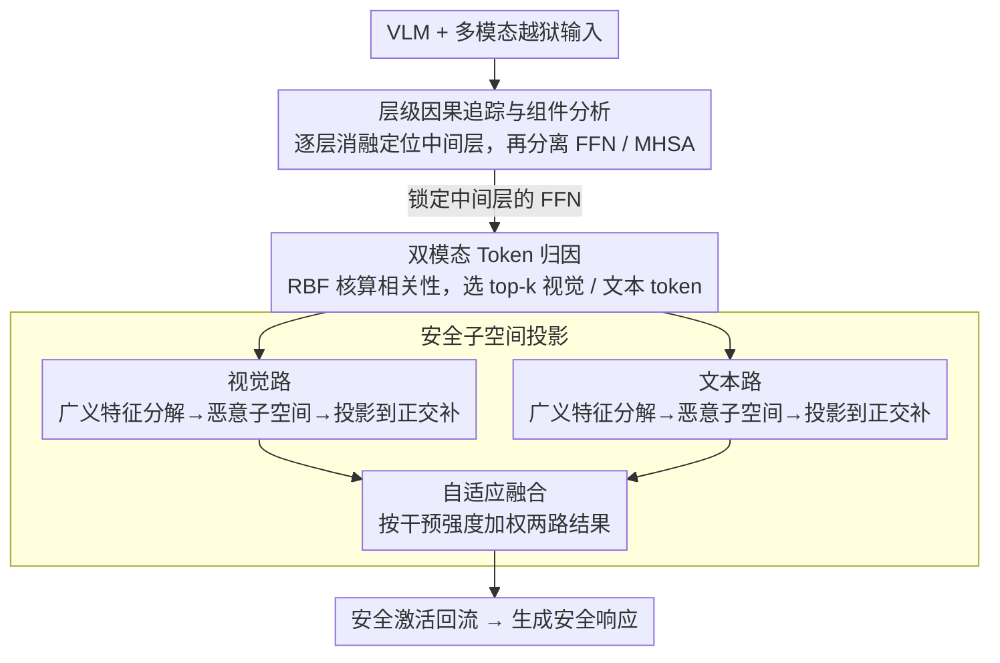

# Diagnosing and Repairing Unsafe Channels in Vision-Language Models via Causal Discovery and Dual-Modal Safety Subspace Projection

**会议**: CVPR 2026  
**arXiv**: [2603.27240](https://arxiv.org/abs/2603.27240)  
**代码**: 无  
**领域**: Multimodal / VLM  
**关键词**: VLM安全, 因果中介分析, 安全子空间投影, 对抗攻击防御, 双模态修复

## 一句话总结
提出 CARE 框架，先用因果中介分析精确定位 VLM 中与不安全行为因果相关的神经元和层（诊断），再通过广义特征分解构建双模态安全子空间并在推理时投影激活值（修复），将攻击成功率降至 10% 以下且几乎不损失通用能力。

## 研究背景与动机
**领域现状**: 大型视觉语言模型 (LVLM) 在多模态理解上表现出色，但面临越狱攻击（jailbreak）——精心构造的多模态提示可绕过安全对齐机制。

**现有痛点**: (1) 输入预处理和对抗训练计算昂贵且可能降低通用性能；(2) 现有激活层面防御（ASTRA, SPO-VLM）缺乏对不安全组件的精确定位，仅使用单一模态，且启发式的线性转向会扭曲通用表征。

**核心矛盾**: 如何精确定位 VLM 内部与不安全行为相关的组件，并在不损害通用能力的前提下修复它们？

**本文目标**: 建立一个因果驱动的、非线性的、双模态的 VLM 安全诊断与修复框架。

**切入角度**: 先因果定位（哪些层/神经元导致不安全输出），再子空间投影（将激活投影到安全方向）。

**核心 idea**: 诊断——因果中介分析定位 FFN 中层 → 修复——广义特征分解找到恶意子空间 → 投影到其正交补空间。

## 方法详解

### 整体框架
CARE 想解决的问题是：VLM 被越狱攻击绕过安全对齐，但既有的激活层防御要么靠预处理/对抗训练（贵且伤通用能力），要么在所有层做粗粒度线性转向（不知道哪里真正出问题、还会扭曲正常表征）。CARE 的思路是"先诊断、后修复"，全程不重训练、只在推理时介入：先用因果消融逐层定位到底是哪一层、哪个组件（FFN 还是注意力）在主导不安全输出；再在这些关键层上做双模态 token 归因，找出真正与越狱相关的视觉/文本 token；最后用良性与恶意激活的协方差对比解出一个"恶意方向"子空间，推理时把激活投影出这个子空间。三步串起来，就是"层 → token → 子空间"由粗到细地把不安全信号一层层剥出来再消掉。

### 关键设计

**1. 层级因果追踪与组件分析：先找出安全到底藏在哪一层、哪个模块**

既有防御的盲点是不知道在哪干预，CARE 先做因果消融来回答这个问题：系统性地逐层 block 激活、观察攻击成功率 (ASR) 的变化，ASR 掉得最多的层就是安全关键层。再把同一层里的 FFN 和多头注意力 (MHSA) 分开消融，结论是 **FFN 对安全性的影响远大于 MHSA**——这并非巧合：FFN 是逐 token 独立投影，激活在样本间相关性低，安全信号相对"干净可分"；而 MHSA 把全局上下文混在一起，安全信号被摊薄、难以隔离。为佐证关键层的存在，作者用 Silhouette 系数、类分离度、Mahalanobis 距离三个指标度量"良性 vs 恶意激活"的可分性，三者都在第 16-17 层（LLaVA）附近同时达到峰值，说明中间层才是安全表征最集中的地方，后续修复就锁定在这里。

**2. 双模态 Token 归因：在关键层里只挑出真正肇事的 token**

并不是关键层里的每个 token 都和越狱等价相关，若不加区分地处理会把无关表征也搅进来，所以在投影前先做归因、聚焦高相关 token。视觉侧用 RBF 核刻画视觉-文本 token 的跨模态相关性，对居中后的跨模态核矩阵取每行的 L2 范数 $s_i = \|\tilde{K}_{i,:}\|_2^2$，再归一化成归因分数

$$MI_i^v = \frac{s_i - s_{min}}{s_{max} - s_{min}}$$

据此选出与攻击最相关的 top-k 视觉 token。文本侧则用自模态 RBF 核矩阵算每个文本 token 的语义独立性分数，挑出最有影响力的文本 token。两路归因都只保留高分 token 进入下一步，这样构建的恶意子空间更聚焦、对正常内容的误伤更小。

**3. 安全子空间投影：把激活投出"恶意方向"再补回良性成分**

定位到关键层和关键 token 后，剩下的问题是怎么"修"——CARE 用一个有原理的子空间投影代替启发式线性转向。先收集良性、恶意样本在目标层的激活 $A_b, A_m$，中心化后求各自协方差矩阵 $C_b, C_m$，再解广义特征分解

$$C_m u = \lambda C_b u$$

最大特征值对应的方向，正是恶意激活相对良性激活偏离最大的方向（和 LDA 找判别方向同理）。取 top-k 特征向量 $U_k$ 张成"恶意子空间"，构造投影到其正交补的安全算子，并在投影后按系数 $\beta$ 补回一点良性参考激活以稳住正常表征：

$$P_{\text{safe}} = I - U_k U_k^T, \qquad h' = P_{\text{safe}}\, h + \beta\,(1 - P_{\text{safe}})\, h_{\text{benign}}$$

由于视觉攻击与文本攻击的机制不同，CARE 对两种模态各自建一套安全子空间分别投影，再用自适应权重把两路结果融合：

$$w_{vis} = \frac{\|h'_{vis} - h_{txt}\|}{\|h'_{vis} - h\| + \|h'_{txt} - h\|}$$

相比直接在某个固定方向上做线性转向，这种"协方差对比 + 正交投影"能精确对准恶意成分、几乎不动与攻击无关的方向，这也是它能压低 ASR 又保住通用能力的关键。

### 损失函数 / 训练策略
全程无需训练，只在推理时介入。只需离线收集少量良性/恶意样本提取激活，用于解广义特征分解、构建各模态的投影矩阵；部署时每次推理只多做一次矩阵乘法，开销极低。

## 实验关键数据

### 主实验（攻击成功率 ASR % ↓）

| 方法 | JailBreakV | MMSafety | PGD-Toxic κ=64 | PGD-Jailbreak κ=64 |
|------|-----------|---------|---------------|-------------------|
| LLaVA 原始 | 45.71 | 36.48 | 60.38 | 65.15 |
| SPO-VLM | 10.37 | 16.26 | 17.90 | 17.38 |
| ASTRA | 11.98 | 15.37 | 16.37 | 14.85 |
| **CARE (Ours)** | **7.03** | **9.13** | **12.78** | **8.46** |

**Qwen2.5-VL 上类似趋势**：JailBreakV 6.55%, MMSafety 8.72%

### 消融实验

| 配置 | JailBreakV ASR↓ | PGD-Toxic-64 ASR↓ | 说明 |
|------|----------------|-------------------|------|
| CARE (full) | 7.03 / 6.55 | 12.78 / 4.60 | 双模态完整版本 |
| CARE w/o text | 15.26 / 14.3 | — | 文本子空间对语言越狱关键 |
| CARE w/o visual | — | 45.71 / 46.13 | 视觉子空间对图像攻击关键 |

### 关键发现
- **FFN > MHSA**: block FFN 对 ASR 影响远大于 block MHSA，证实 FFN 是安全机制的主要载体
- **中间层最关键**: 安全相关表征在第 16-17 层（LLaVA）或 12-14 层（Qwen）达到峰值聚类分离度
- **双模态缺一不可**: 去掉文本子空间→语言越狱 ASR 翻倍；去掉视觉子空间→PGD 攻击 ASR 翻 10 倍
- **通用能力保持**: MMBench、MM-Vet、SQA 上仅 2-8% 的性能下降
- **迁移防御**: 对未见过的 PGD 攻击也有效

## 亮点与洞察
- **因果驱动的精确定位**：不是盲目地在所有层做干预，而是先定位安全关键层和组件（FFN），减少对无关表征的干扰。
- **广义特征分解**的理论优雅性：直接在"良性 vs 恶意"的协方差空间中找到最大偏离方向，比启发式的线性转向更有原理性。
- **无需训练**：仅需离线提取少量激活，推理时做矩阵乘法，开销极低。
- **FFN 的"判别投影器"角色**：FFN 激活低样本间相关性意味着安全信号在其中更"纯净可分"，这一发现对理解 VLM 内部安全机制具有理论价值。

## 局限与展望
- 安全子空间的构建依赖于离线收集的恶意样本，可能对全新类型的攻击覆盖不足
- 投影操作虽然轻量但在每次推理时增加了计算开销
- 良性正则化项 $\beta$ 需要调节，不同模型可能需要不同超参数
- 仅在 7-8B 规模的模型上验证，更大规模模型是否有相同安全机制有待验证
- 安全子空间的维度 $k$ 选择需要经验调参
- 对纯文本越狱（无图像输入）的防御效果未单独评估
- 安全机制在更深层被"特征纠缠"稀释的现象值得进一步研究

## 相关工作与启发
- 与 ASTRA、SPO-VLM 的区别：CARE 通过因果分析精确定位而非粗粒度干预，使用非线性 RBF 核和广义特征分解而非线性转向。
- 与 Refusal Pairs（微调方法）相比：CARE 无需重训练，且效果更好。
- 因果中介分析在 NLP 可解释性中已有应用，本文首次将其用于 VLM 安全定位。
- 广义特征分解也用于 LDA 等经典判别分析，本文将其创新性地用于安全/恶意方向的分离。
- FFN 的"判别投影器"角色与 Neural Collapse 现象的联系值得深入探索

## 技术细节补充
- **RBF 核带宽**: $\sigma = \sqrt{0.5 \cdot \text{median}(D_{ij})}$，自适应于数据分布
- **Kernel 居中**: 视觉单侧 $\tilde{K} = K_{cross}H_t$，文本双侧 $\tilde{K} = HKH$
- **安全投影**: $h' = P_{safe}h + \beta(1-P_{safe})h_{benign}$
- **融合权重**: $w_{vis} = \frac{\|h'_{vis}-h_{txt}\|}{\|h'_{vis}-h\|+\|h'_{txt}-h\|}$
- **定位验证**: Silhouette/Class Sep./Mahalanobis 三指标在层 16-17 峰值
- **攻击数据**: JailbreakVBench + AdvBench + FigStep
- **通用性能**: MMBench 降 2-3%, MM-Vet 降 5-8%, SQA 降 2-4%

## 评分
- 新颖性: ⭐⭐⭐⭐⭐ 因果诊断+双模态安全子空间投影的组合是首创
- 实验充分度: ⭐⭐⭐⭐⭐ 2 个 VLM × 多 benchmark × PGD 攻击 × 消融全面
- 写作质量: ⭐⭐⭐⭐ 框架清晰，因果分析部分深入，但数学符号较密
- 价值: ⭐⭐⭐⭐⭐ 对 VLM 安全防御具有重要实践意义，无需重训练即可部署

<!-- RELATED:START -->

## 相关论文

- [\[CVPR 2026\] BiomedCCPL: Causal Conditional Prompt Learning for Biomedical Vision-Language Models](biomedccpl_causal_conditional_prompt_learning_for_biomedical_vision-language_mod.md)
- [\[CVPR 2026\] HandVQA: Diagnosing and Improving Fine-Grained Spatial Reasoning about Hands in Vision-Language Models](handvqa_diagnosing_and_improving_fine-grained_spatial_reasoning_about_hands_in_v.md)
- [\[CVPR 2026\] Evolving Contextual Safety in Multi-Modal Large Language Models via Inference-Time Self-Reflective Memory](evolving_contextual_safety_in_multi-modal_large_language_models_via_inference-ti.md)
- [\[CVPR 2026\] Bias Is a Subspace, Not a Coordinate: A Geometric Rethinking of Post-hoc Debiasing in Vision-Language Models](bias_is_a_subspace_not_a_coordinate_a_geometric_rethinking_of_post-hoc_debiasing.md)
- [\[CVPR 2026\] Multi-Modal Representation Learning via Semi-Supervised Rate Reduction for Generalized Category Discovery](multi-modal_representation_learning_via_semi-supervised_rate_reduction_for_gener.md)

<!-- RELATED:END -->
