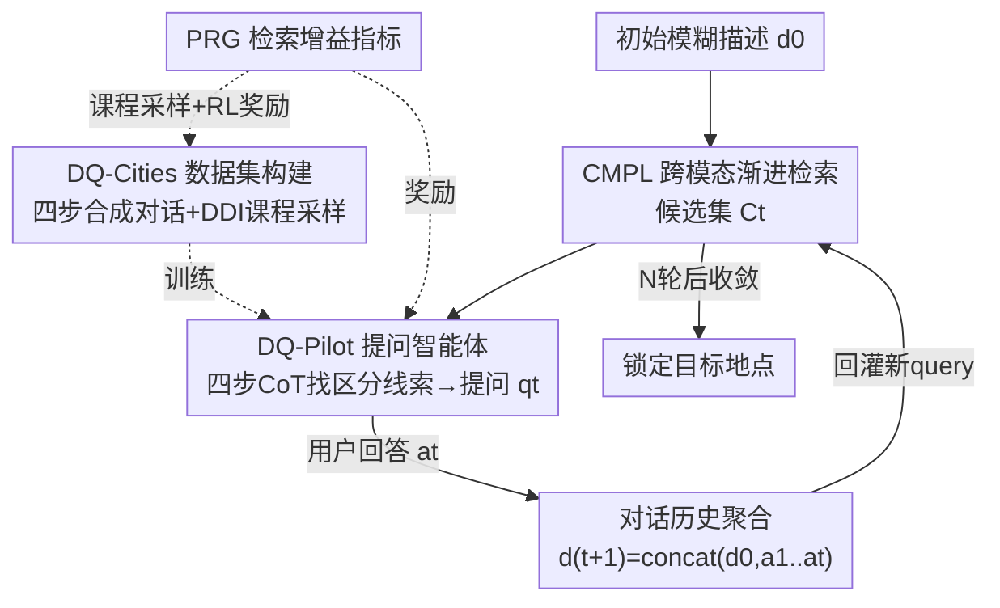

# DialogueVPR: Towards Conversational Visual Place Recognition

**会议**: CVPR 2026  
**论文**: [CVF Open Access](https://openaccess.thecvf.com/content/CVPR2026/html/Song_DialogueVPR_Towards_Conversational_Visual_Place_Recognition_CVPR_2026_paper.html)  
**代码**: https://github.com/Graysonggg/DlgPR  
**领域**: 多模态VLM  
**关键词**: 视觉地点识别, 对话式检索, 推理检索, 课程学习, GRPO

## 一句话总结
把语言引导的地点识别从「一句话查一次、查完就完」的静态检索，改造成「检索器先粗筛 → 多模态大模型主动提问 → 用户回答 → 再检索」的多轮对话推理（DlgPR），并配套造了首个对话式地点识别基准 DQ-Cities 和一套「SFT + GRPO 课程学习」训练的提问智能体 DQ-Pilot，5 轮对话后 R@1 比 7B 基座提升 13.4%、甚至超过 72B 模型。

## 研究背景与动机
**领域现状**：用自然语言描述来定位（language-guided geo-localization）正变热门——乘客口述路口让出租车找位置、报警时描述周围环境、用语音指挥家用机器人，都是这个范式的现实场景。主流做法（Text2Loc、各种 text-to-image 检索）是把一段文本 query 编码后，到大规模街景/卫星图库里做一次跨模态检索，返回最匹配的地点。

**现有痛点**：这种「静态一次性检索」本质是**被动的**。现实里用户给的初始描述往往模糊、不完整甚至记错（作者称之为 "user description dilemma"），比如「我看到一家银行旁边有个黑色电话亭」——这种描述能匹配成百上千个地点。被动检索器拿到模糊 query 只能硬查一次，**无法主动追问、无法补充信息**，结果就是在真实噪声场景下非常脆弱。

**核心矛盾**：人类定位别人位置时是**交互**的——「那银行墙上有没有门牌号？」「电话亭是红的还是黑的？」，靠一问一答逐步消歧。而现有系统把这个交互过程砍掉了，只剩单轮匹配，于是初始描述的歧义没有任何机制去化解。

**本文目标**：让地点识别从「被动检索（passive retrieval）」进化到「推理检索（reasoning retrieval）」，具体要解决三个子问题——(1) 没有支持对话式定位的数据；(2) 检索器要能随对话历史增长不断精化搜索；(3) 要有一个会「分析候选 → 找出区分性线索 → 提最有信息量的问题」的智能提问者。

**切入角度**：作者观察到，消歧的关键不是问任意问题，而是问**能最大化检索增益**的问题。于是把「一个问题好不好」直接量化成它带来的排名提升（PRG），用这个信号既做数据课程采样、又做强化学习奖励。

**核心 idea**：用「跨模态检索器 CMPL（管检索）+ 多模态 LLM 提问者 DQ-Pilot（管推理提问）」的协同闭环，把定位变成「分析—提问—优化」的多轮对话，并用一个统一的检索增益指标 PRG 串起数据构建与训练。

## 方法详解

### 整体框架
DlgPR 把地点识别重构成一个动态交互循环，两个核心组件分工协作：**CMPL 检索器**负责把不断变长的对话历史编码、检索出候选地点；**DQ-Pilot 提问智能体**负责看着当前候选，找出歧义、生成一个最具区分性的问题去问用户。

流程上：用户给初始 query $d_0$，CMPL 先做 Round 0 的粗检索得到候选集 $C_0$。进入迭代循环后，第 $t$ 轮 DQ-Pilot 分析当前候选 $C_t$ 生成问题 $q_t$；用户回答 $a_t$ 后，框架把历史拼成更丰富的 query $d_{t+1}=\text{concat}(d_0,a_1,\dots,a_t)$ 喂回 CMPL，得到精化后的候选 $C_{t+1}$。如此「问答—检索」反复，搜索空间逐步收缩直到锁定目标。整套训练所需的对话数据由一条自动化流水线（DQ-Cities 数据集构建）合成，DQ-Pilot 则在其上经「SFT → GRPO」两阶段课程学习。

### 关键设计

**1. CMPL 跨模态渐进学习检索器：从局部到全局对齐细粒度长描述**

静态检索这一环必须够强，否则候选粗筛就把目标漏掉了，后面再问也白搭；而地点描述往往是上百词的长文本（DQ-Cities 平均 154.6 词），普通 CLIP 既吃不下长文也对不齐细粒度线索。CMPL 的做法是**多层级渐进对齐**：从 ViT 的中间层 $P=\{p_3,p_6,p_9,p_{12}\}$ 同时抽视觉 patch $V^{(l)}$ 和文本 token $T^{(l)}$；其中视觉特征先过一个显著性过滤模块（SFM），按注意力权重动态挑出「地理相关」的判别性 token 得到 $V_s^{(l)}$，并由辅助损失 $L_{vpr}$ 监督。再用一组**可学习的 instance-concept 查询** $Q^{(l)}$（每层 16 个）作为语义锚点，经共享细粒度提取器 $E_f$ 把视觉、文本蒸馏到统一表示：

$$F_v^{(l)}=E_f(Q^{(l)}, V_s^{(l)}), \quad F_t^{(l)}=E_f(Q^{(l)}, T^{(l)})$$

对齐用层级化的相似度分布匹配（SDM）损失，最小化预测分布 $p$ 与真值 $q$ 的双向 KL；图像锚点对一个 batch 内 $B$ 条文本的预测分布为 $p_{v\to t,i,j}=\dfrac{\exp(s_{i,j}/\tau)}{\sum_{k=1}^{B}\exp(s_{i,k}/\tau)}$。它还额外配了**Hard-Negative Isolation（HI）损失**：在每个 batch 里挑出最易混淆的负样本 $j^\*,k^\*$，用 margin triplet 把它们在两个模态方向上都推开，强化几何可分性。总目标 $L_{total}=\lambda_{gs}L_{gs}+\lambda_h\sum_{l\in P}\big(L_{ls}^{(l)}+L_{hi}^{(l)}\big)+L_{vpr}$，其中 $L_{gs}$ 是 [CLS] 全局余弦对齐、$L_{ls}^{(l)}$ 是各中间层局部 token 平均相似度对齐。静态检索 R@1 上 CMPL 比最强的 FG-CLIP 高约 15 个点，说明这套细粒度对齐确实把长描述的判别力榨出来了。

**2. PRG 检索增益 + DDI 难度指数：用「问题值不值」统一驱动数据与训练**

「主动提问」这件事最难的是没有监督信号告诉你哪个问题是好问题。作者把它量化为**Positional Retrieval Gain（PRG）**：衡量某一轮问答后正样本排名的真实提升。定义增益 $G$ 为正样本集 $P$ 上 nDCG 式贡献 $c(r)=1/\log_2(r+1)$ 之和，则

$$PRG_i=\frac{G^{(i)}-G^{(i-1)}}{G^*-G^{(i-1)}}$$

分母 $G^*$ 是所有正样本都排到最前的理想增益，所以 PRG 把「这次提问带来的排名进步」归一化到了「最大可能进步」上。基于它再构造**Discriminative Difficulty Index（DDI）**作课程采样：$DDI=w_{sa}\cdot SA+w_{rid}\cdot RID$，其中语义歧义度 $SA=\alpha\cdot\text{sim}(\phi_T(t_t),\phi_T(t_n))+(1-\alpha)\cdot\big(1-\text{sim}(\phi_T(t_t),\phi_T(t_p))\big)$ 衡量候选集内在的难分程度（正负样本文本越像越难），而 $RID_i=1-PRG_i$ 用检索器的经验难度兜底（一轮问答带来的排名提升越小，说明这个 case 越难）。这个 PRG/DDI 体系是全文的枢纽：DDI 决定数据怎么按难度分层采样，PRG 又直接当强化学习的奖励——同一把尺子同时管「学什么」和「奖什么」。

**3. DQ-Pilot 两阶段课程：SFT 打底 + GRPO 学会问出有增益的问题**

DQ-Pilot 基于 Qwen2.5-VL-7B、用 LoRA 微调，训练严格按 DDI 难度分两段走。**Stage 1 SFT** 在偏简单（约 70% 低 DDI）的 DQ-cities-20k 上做标准 next-token 预测：每个样本是一轮对话，输入是当前对话历史 $Q_i$ + 候选集 `<image>` token + 指明提问目标和输出格式的指令，输出是一段结构化推理链加一个区分性问题，让模型先建立「把对话上下文与空间歧义关联、并提出能引导检索器走向正确地点的问题」这一基础能力。**Stage 2 GRPO** 在偏难（约 70% 高 DDI）的 DQ-cities-10k 上做强化精炼，奖励是两部分加权 $R=\alpha R_{prg}+\beta R_{fmt}$：$R_{prg}=PRG_t$ 直接奖励问题带来的检索增益，格式奖励 $R_{fmt}$ 是个二值项，验证输出是否符合 `<think></think><question></question>` 模板（保证推理结构和可解释性）。SFT 只是模仿教师的提问，GRPO 才让模型超越模仿、学会主动生成「简洁、有区分度、能真正提升检索」的问题。消融显示从 SFT 到 SFT+GRPO，5 轮 R@1 从 58.1% 提到 60.5%。

### 一个完整示例
以图 1 场景为例：用户说「我看到一家银行紧挨着一个黑色电话亭，我在哪？」——这是 Round 0 的模糊初始描述，CMPL 粗检索返回一批视觉相似候选（如 Image 1/2/3）。DQ-Pilot 走四步 CoT：① 分析对话历史（确认「银行 + 黑色电话亭」）；② 逐个核对候选（Image 1、3 不匹配描述，Image 2 匹配）；③ 找区分线索（发现 Image 2 墙上有带浮雕徽章的数字「82」，而 1、3 没有）；④ 制定策略，于是问「建筑上是不是有个数字『82』、下方还有个雕花徽章？」用户答「是的，墙上有个『82』」。这条新证据被拼进对话历史回灌 CMPL，候选集随之收缩，正样本排名前移——重复若干轮后即可把目标从一堆相似街景中唯一锁定。

### 损失函数 / 训练策略
- CMPL 端：$L_{total}=\lambda_{gs}L_{gs}+\lambda_h\sum_{l\in P}(L_{ls}^{(l)}+L_{hi}^{(l)})+L_{vpr}$，含全局/局部 SDM 对齐 + 硬负样本隔离 + 显著性 VPR 辅助损失。
- DQ-Pilot 端：Stage 1 用 next-token 预测做 SFT；Stage 2 用 GRPO，奖励 $R=\alpha R_{prg}+\beta R_{fmt}$。
- 数据课程：先用 $PRG_i<\tau_1$ 过滤掉低质对话 + 少量人工抽检，再按 DDI 阈值切成「低难度 20k 给 SFT、高难度 10k 给 GRPO」的两段课程。CMPL 用 CLIP ViT-B/16，每层 16 个可学习 query，长文本对位置编码做线性插值；全程 2 张 A100。

## 实验关键数据

### 主实验
五个代表城市上的**多轮交互检索**（从短初始 query 起，报告第 3、5 轮的累计 Recall 与效率指标 BRI，BRI 越低越好）。下表取 LosAngeles 与平均（PRG 列）的代表性数字：

| 方法 | 轮次 | LA R@1 | LA R@5 | 平均 R@1 | 平均 R@5 | BRI↓ |
|------|------|--------|--------|----------|----------|------|
| Initial | round0 | 35.9 | 56.3 | 52.8 | 74.2 | / |
| Qwen2.5-VL-7B | round5 | 43.2 | 60.1 | 59.1 | 74.9 | 1.58 |
| Qwen2.5-VL-72B | round5 | 49.5 | 68.6 | 65.1 | 82.1 | 1.44 |
| PlugIR | round5 | 51.2 | 70.3 | 66.2 | 83.2 | 1.41 |
| DlgQuest (SFT) | round5 | 54.6 | 73.6 | 68.4 | 85.3 | 1.29 |
| **DlgQuest (SFT+GRPO)** | round5 | **58.4** | **76.5** | **71.4** | **86.6** | **1.18** |

5 轮后 DQ-Pilot 比 7B 基座 R@1 提升 13.4%（3 轮提升 9.2%），且超过大得多的 72B 模型 7.3 个点，同时 BRI 最低（交互效率最高）——说明提升来自「渐进对齐 + 奖励优化训练」而非单纯堆模型规模。

**静态检索**（用完整长描述，代表检索上界）下 CMPL 对各 CLIP 类模型的优势：

| 方法 | LA R@1 | LA R@5 | LA R@10 | 平均 R@1 |
|------|--------|--------|---------|----------|
| CLIP | 41.0 | 60.2 | 68.2 | 64.0 |
| Long-CLIP | 46.8 | 65.9 | 73.1 | 69.1 |
| FG-CLIP | 56.1 | 76.6 | 83.2 | 78.2 |
| Flair | 57.9 | 76.2 | 79.9 | 78.1 |
| **CMPL (Ours)** | **71.9** | **88.3** | **92.9** | **82.5** |

### 消融实验
| 配置（CMPL 组件） | R@1 | R@5 | R@10 |
|------|------|------|------|
| Baseline（仅 $L_{gs}$） | 71.6 | 88.0 | 95.3 |
| + Token Selection（SFM） | 71.9 | 88.5 | 95.9 |
| + Progressive SDM | 72.3 | 89.0 | 96.4 |
| + HI（硬负样本隔离） | 72.7 | 89.5 | 97.0 |
| **Full（全部）** | **73.2** | **90.0** | **97.5** |

| 配置（DQ-Pilot 学习策略，5 轮） | R@1 | R@5 |
|------|------|------|
| **DQ-pilot（完整）** | **60.5** | **77.8** |
| w/o DDI Curriculum（随机采样） | 59.6 | 77.2 |
| w/o GRPO（SFT-30k 全量） | 59.1 | 76.6 |
| w/o GRPO（仅 SFT） | 58.1 | 75.9 |

### 关键发现
- **GRPO 是提问质量的关键**：去掉 GRPO（仅 SFT）5 轮 R@1 从 60.5% 掉到 58.1%，说明纯模仿教师只学会「会问」，要学会「问得有增益」必须靠 PRG 奖励的强化学习。
- **DDI 课程确实有用但贡献相对温和**：把 DDI 难度采样换成随机采样，R@1 仅小幅下降 0.9 个点（60.5→59.6）；而同等样本量下 SFT-30k 全量（无难度分层、无 GRPO）反而只有 59.1%，印证「按难度由易到难分层 + 强化精炼」比单纯堆数据更有效。
- **CMPL 四个组件单调累加**：从 Baseline 到 Full，R@1 逐步 71.6→73.2，其中显著性 token 选择、渐进 SDM、HI 各贡献约 0.3–0.5 点，说明细粒度对齐要靠多个机制叠加才能榨干。
- **轮次越多收益越大**：所有方法从 round3 到 round5 都在涨，验证多轮对话确实在持续消歧，而非一两轮就饱和。

## 亮点与洞察
- **把「好问题」操作化为可计算的检索增益**：PRG 用归一化排名提升把「这个问题值不值得问」变成一个标量，既能当 RL 奖励又能当课程难度，一把尺子贯穿数据与训练——这是全文最巧的地方，可迁移到任何「主动提问 / 主动查询」的交互式检索任务。
- **DDI 把「语义歧义」和「检索器经验难度」两路信号融合**：SA 看候选文本本身像不像，RID 看检索器实际有没有被难住，二者互补避免了单一指标的偏差，难度分层因此更可靠。
- **「检索器粗筛 + LLM 精推」的分工范式**：让强检索器扛大规模召回、让 MLLM 专注于「看候选→找区分线索→提问」，避免把 LLM 直接当检索器用，工程上更可落地；这套分工对其他多模态交互检索（行人重识别、商品检索）有直接借鉴价值。

## 局限与展望
- 作者承认的方向：未来要探索更自适应的对话策略、检索器与提问者更紧的协同训练（co-training），以及面向具身智能体的实时部署。
- 自己看到的局限：用户回答由 GPT-4o 教师模型合成模拟，**真实用户的回答可能更含糊、更不配合甚至说错**，对模型鲁棒性的考验在论文里没充分检验（⚠️ 真实人机交互的 gap 待验证）。
- 评测只在 GSV-Cities 衍生的五座城市上做，且都是静态街景图库；面对天气/季节/视角剧烈变化的真实场景，CMPL 的细粒度对齐是否仍稳健存疑。
- 多轮对话每轮都要 MLLM 推理 + 检索器重排，**延迟和算力开销**随轮数线性增长，论文用 BRI 衡量「问几轮」但没报告端到端时延，实时部署的成本仍是未知数。

## 相关工作与启发
- **vs Text2Loc / Text2Pose（语言→3D 点云定位）**：它们在 3D 点云里做单次位置回归，需要构建和存储昂贵的大规模 3D 地图；本文转向「语言↔街景图」的大规模 2D 检索，且把单次匹配换成多轮对话，部署成本更低、对模糊描述更鲁棒。
- **vs PlugIR（对话式 text-to-image 检索）**：PlugIR 用 LLM 把「对话理解」与「检索」解耦以兼容黑盒模型，但它和多数多轮方法一样是**反应式信息聚合**（根据显式反馈被动堆信息）；本文 DQ-Pilot 是**主动推理**，会先诊断候选间的歧义再针对性提问，并用 PRG 奖励确保问题有检索增益，5 轮 R@1 在 LA 上高出 PlugIR 7.2 个点。
- **vs LLaVA-ReID（前瞻式提问）**：同样追求「最大信息增益的问题」，但本文把信息增益具体落到「检索排名提升」这一可验证奖励上，并用 GRPO 做强化，使提问目标与下游检索任务严格对齐。

## 评分
- 新颖性: ⭐⭐⭐⭐⭐ 首次把地点识别定义成对话推理任务（DlgPR），并用 PRG/DDI 把「好问题」可计算化，范式与指标双创新。
- 实验充分度: ⭐⭐⭐⭐ 五城市、多轮交互 + 静态检索 + 双路消融较完整，但缺真实用户交互与端到端时延验证。
- 写作质量: ⭐⭐⭐⭐ 动机清晰、公式与流程交代到位，个别符号（如 SDM、HI）略密。
- 价值: ⭐⭐⭐⭐⭐ 提供首个对话式地点识别基准 + 一套可复用的「检索增益驱动主动提问」框架，对交互式多模态检索有较强外溢价值。

<!-- RELATED:START -->

## 相关论文

- [\[CVPR 2026\] WikiCLIP: An Efficient Contrastive Baseline for Open-domain Visual Entity Recognition](wikiclip_an_efficient_contrastive_baseline_for_open-domain_visual_entity_recogni.md)
- [\[CVPR 2026\] Taxonomy-Aware Representation Alignment for Hierarchical Visual Recognition with Large Multimodal Models](taxonomy-aware_representation_alignment_for_hierarchical_visual_recognition_with.md)
- [\[CVPR 2026\] TRivia: Self-supervised Fine-tuning of Vision-Language Models for Table Recognition](trivia_self-supervised_fine-tuning_of_vision-language_models_for_table_recogniti.md)
- [\[CVPR 2026\] RetFormer: Multimodal Retrieval for Enhancing Image Recognition](retformer_multimodal_retrieval_for_enhancing_image_recognition.md)
- [\[CVPR 2026\] Condensed Test-Time Adaptation of VLMs for Action Recognition](condensed_test-time_adaptation_of_vlms_for_action_recognition.md)

<!-- RELATED:END -->
