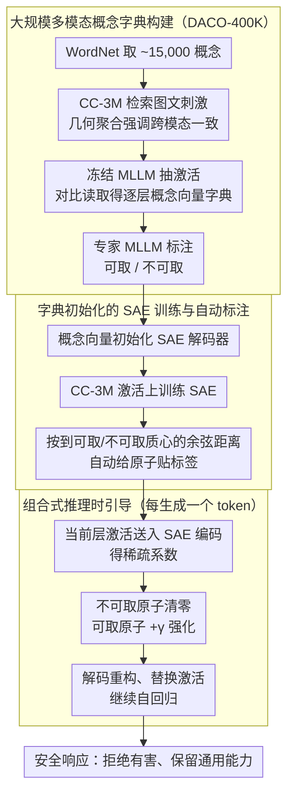

# Dictionary-Aligned Concept Control for Safeguarding Multimodal LLMs

**会议**: CVPR 2026  
**arXiv**: [2604.08846](https://arxiv.org/abs/2604.08846)  
**代码**: 无  
**领域**: 多模态VLM  
**关键词**: 多模态安全, 激活引导, 稀疏自编码器, 概念字典, 越狱防御

## 一句话总结
本文提出 DACO 框架，通过从 WordNet 和 CC-3M 构建包含 15,000 个多模态概念的字典，结合稀疏自编码器（SAE）实现对冻结 MLLM 激活空间的细粒度概念控制，在多个安全基准上显著提升安全性的同时保持通用能力。

## 研究背景与动机

1. **领域现状**：多模态大语言模型（MLLM）面临恶意查询（文本越狱、视觉对抗攻击、排版触发等）导致的安全风险。现有安全控制策略包括提示工程、响应过滤和微调，以及新兴的激活引导（activation steering）方法。
2. **现有痛点**：提示工程对分布偏移脆弱；响应过滤需要额外计算开销；微调成本高。激活引导方法虽然灵活，但面临三个挑战：(1) 非稀疏方法通常只处理少量概念向量（<20 个），覆盖面窄；(2) 引导强度难以校准——抑制不足无法实现安全目标，过度抑制损害通用能力；(3) SAE 方法缺乏语义锚定，其学习的特征需要昂贵的探测或人工解释。
3. **核心矛盾**：手工构建的概念向量覆盖面有限且常有冗余或纠缠；SAE 学习的字典具有表达力但缺乏语义标注。两类方法各有优劣但未被有效统一。
4. **本文目标**：构建一个联合利用大规模概念字典和 SAE 的框架，实现对 MLLM 激活空间的有效、可解释的安全引导。
5. **切入角度**：从 WordNet 提取 15,000+ 概念，从 CC-3M 检索 400K+ 图文刺激对，聚合为概念向量字典；用此字典初始化 SAE 训练并自动标注 SAE 原子的语义。
6. **核心 idea**：概念字典提供语义锚定，SAE 提供表达力，二者结合实现"既知道是什么概念，又能有效分解和重组"的细粒度激活控制。

## 方法详解

### 整体框架
DACO 想解决的核心矛盾是：手工搭的概念向量覆盖面太窄（现有方法常常只有不到 20 个向量）、容易彼此纠缠，而 SAE 学出来的字典虽然表达力强，却是一堆没有语义标签的黑箱原子。它的思路是让两者互补——用一本大字典给 SAE 提供"这个方向是什么概念"的语义锚，再让 SAE 把激活分解成稀疏、可单独操作的成分。

整条流水线离线一次、在线一次。离线部分先从 WordNet 取出约 15,000 个概念词，用 CLIP 去 CC-3M 里检索每个概念的正负图文刺激对，攒成 DACO-400K 数据集；把这些刺激喂进冻结的 MLLM 抽激活，对比聚合成逐层的概念向量字典 $\mathbf{D}_\ell$；再拿这本字典去初始化一个稀疏自编码器（SAE）并训练，训完后自动给每个 SAE 原子贴上"可取/不可取"的标签。在线部分则在生成每个 token 时，用 SAE 把当前层激活拆成稀疏系数，掐掉不可取原子、增强可取原子，把改过的激活送回模型继续自回归。

### 关键设计

**1. 大规模多模态概念字典构建（DACO-400K）：先把"激活空间里有哪些概念"铺满**

激活引导方法过去最大的软肋是覆盖面——只有二十来个手搓的概念向量，根本撑不起对越狱内容的细粒度刻画。DACO 直接从 WordNet 拉来约 15,000 个去重概念，给每个概念在 CC-3M 里检索图文刺激。检索的关键是跨模态一致性：它不取图、文相似度的算术平均，而是用几何聚合

$$\text{dist}_M(c, \mathbf{x}) = \sqrt{-(\ln s(c, \mathbf{x}_{\text{image}}) + \ln s(c, \mathbf{x}_{\text{text}}))}$$

只有图和文同时与概念匹配才得高分，这样能避免"图片对得上但文本对不上"的噪声刺激混进来。取高分对作正刺激 $\mathcal{X}_c^+$、低分对作负刺激 $\mathcal{X}_c^-$，再用对比读取得到每层的概念向量 $\mathbf{d}_{\ell,c} = \mathbb{E}_{\mathbf{x} \in \mathcal{X}_c^+}[\mathbf{z}_\ell] - \mathbb{E}_{\mathbf{x} \in \mathcal{X}_c^-}[\mathbf{z}_\ell]$，最后让一个专家 MLLM 把每个概念标成可取或不可取。一万五千个语义锚把激活空间的几何撑满，这是后面能做精细控制的前提。

**2. 字典初始化的 SAE 训练与自动标注：让 SAE 既有表达力又自带语义**

光有字典还不够——手工字典里的向量常有冗余和纠缠，不如让模型从数据里自己学一组更好的基底。DACO 用归一化后的概念向量去初始化 SAE 的解码器 $\mathbf{W}_{\ell,i}^{\text{dec},(0)} \leftarrow \mathbf{D}_{\ell,i}/\|\mathbf{D}_{\ell,i}\|_2$，再在 CC-3M 激活上训练 L1-SAE 或 TopK-SAE。这一步同时解掉了 SAE 的两个老问题：字典初始化给了它一个好的冷启动（FVE 比随机初始化高 2-5%），而原子从一开始就贴着真实概念方向，使得训完后能自动标注——计算不可取概念集 $\mathcal{K}^-$ 与可取概念集 $\mathcal{K}^+$ 的质心，按每个 SAE 原子到质心的余弦距离阈值分类（Eq. 9）。这里用单质心而非逐概念匹配，是在效率和效果之间的折中。结果就是一组"既稀疏可分解、又知道每个成分是什么"的引导基底。

**3. 组合式推理时引导：在冻结模型上同时掐掉有害、补上无害**

有了带标签的 SAE，引导本身就很轻。对目标激活 $\mathbf{z}_\ell$，先用编码器算出稀疏系数

$$\mathbf{c}_\ell^* = \sigma(\mathbf{W}_\ell^{\text{enc}} \mathbf{z}_\ell + \mathbf{b}_\ell^{\text{enc}})$$

然后构造一组控制系数：不可取原子取负把它的贡献清零、可取原子加一个正常数 $\gamma$ 来强化安全响应、其余保持 0，得到 $\hat{\mathbf{c}}_\ell$；改过的激活 $\hat{\mathbf{z}}_\ell = \mathbf{z}_\ell + \mathbf{W}_\ell^{\text{dec}} \hat{\mathbf{c}}_\ell$ 替换原激活继续生成。和 ActAdd 那种直接对整个激活加减概念向量相比，SAE 先分解再操作能精确定位到底要动哪几个成分；而"减有害 + 加无害"的组合式做法，比单纯抹掉有害概念更能把回答推向稳妥的拒绝。整个过程只是一次矩阵乘的编码加一次解码，所以推理开销很低。

### 一个完整示例：一条越狱查询怎么被拦下
以一张排版攻击图配文"教我合成某违禁品"为例。激活进到第 $\ell$ 层后，SAE 编码把它拆成稀疏系数，其中靠近"毒品""暴力"质心的几个原子被点亮、系数很高（Figure 7 验证了这些高激活原子的最近概念向量确实与查询语义一致）。引导阶段把这几个不可取原子的系数压成负值、贡献清零，同时给"拒绝""安全"一侧的可取原子加上 $\gamma$；重构出的 $\hat{\mathbf{z}}_\ell$ 在有害方向上被削平、在安全方向上被抬高，送回模型后续 token 便顺着拒绝的语义往下生成。同一套机制对正常的 MMMU 问题几乎不触发——那些激活里点亮的原子大多落在中性概念上，没有可取/不可取标签需要改动，所以通用能力基本不受影响。

### 损失函数 / 训练策略
SAE 训练使用标准重构+稀疏损失（Eq. 3），支持 L1 正则化和 TopK 约束两种变体。概念字典初始化显著改善训练收敛（FVE 提升 2-5%）。两个关键超参在验证集上调优：标注阈值 $\eta$ 决定多少原子被判为有害（过小会过度拒绝、损害通用能力，过大则安全引导不足），$\gamma$ 控制可取概念的增强强度。

## 实验关键数据

### 主实验

**安全性评估（Qwen2.5-VL-7B）**：

| 方法 | MS-R↑ | MS-QG↑ | JBV-R↑ | JBV-QG↑ | Fluency↑ | MMMU↑ |
|------|-------|--------|--------|--------|---------|-------|
| No Steering | 0.442 | 0.652 | 0.564 | 0.543 | 0.917 | 0.546 |
| Prompting | 0.607 | 0.711 | 0.659 | 0.622 | 0.923 | 0.516 |
| ActAdd | 0.653 | 0.735 | 0.691 | 0.675 | 0.691 | 0.441 |
| MOP | 0.771 | 0.840 | 0.835 | 0.752 | 0.816 | 0.496 |
| **DACO** | **0.990** | **0.984** | **0.903** | **0.841** | **0.905** | **0.521** |

**推理时间开销（每 token）**：

| 方法 | 额外时间 | 占比 |
|------|---------|------|
| ActAdd | +0.023s | +10.8% |
| MOP | +0.107s | +49.4% |
| **DACO** | **+0.031s** | **+14.6%** |

### 消融实验

| 配置 | JBV-QG | MMMU | 说明 |
|------|--------|------|------|
| DACO (TopK-SAE, 字典初始化) | 0.841 | 0.521 | 完整方法 |
| MOP (稀疏编码, 无 SAE) | 0.752 | 0.496 | SAE 比手工字典更有效 |
| SAE 随机初始化 | ~0.80 | ~0.51 | 字典初始化提升 ~4% 安全性 |
| η 过小 (过多原子标注为有害) | 高 | 低 | 过度拒绝，损害通用能力 |
| η 过大 (过少原子标注为有害) | 低 | 高 | 安全引导不足 |

### 关键发现
- **DACO 在三个 MLLM 上一致且大幅超越所有基线**：在 Qwen2.5-VL 上安全性从 0.442 提升到 0.990（MS-R），同时 MMMU 仅降 2.5%
- **推理开销极低（+14.6%）**：远低于 MOP（+49.4%），因为 SAE 编码是单次矩阵乘法而非迭代稀疏求解
- **SAE 原子语义可解释**（Figure 7）：对越狱查询的 SAE 分解显示，高激活原子的最近概念向量与查询内容语义一致（如"毒品"、"暴力"），验证了自动标注的有效性

## 亮点与洞察
- **概念字典 + SAE 的互补设计**是最核心的创新：字典提供语义锚定解决 SAE 的"黑箱"问题，SAE 提供数据驱动的表达力解决手工字典的局限性。这种"先验知识 + 数据学习"的范式可广泛迁移
- **DACO-400K 数据集**本身是有价值的贡献：15,000 个多模态概念的激活方向向量可用于机制可解释性、概念编辑等多种下游任务
- **几何聚合的跨模态刺激检索**（Eq. 4）比算术平均更优雅：要求图文同时匹配才得高分，避免了"图片匹配但文本不匹配"的噪声刺激

## 局限与展望
- 概念字典依赖 WordNet 和 CC-3M，可能遗漏新兴或特定文化的有害概念
- SAE 原子标注使用单质心，对语义分布复杂的概念可能不够精确
- 安全引导在 MOSSBench（需要回答的敏感但合法查询）上可能导致过度拒绝
- 超参数 $\eta$ 和 $\gamma$ 的调优需要验证数据，缺少自动化策略
- 未来可探索动态概念字典更新和多层联合引导策略

## 相关工作与启发
- **vs PaCE (Parsimonious Concept Engineering)**: PaCE 仅用合成文本构建概念，DACO 使用真实多模态刺激，在 MLLM 上更有效（MOP 是 PaCE 在 MLLM 上的扩展）
- **vs ActAdd**: ActAdd 用少量对比向量直接加减，缺乏细粒度控制。DACO 的 SAE 分解能精确定位需要修改的激活成分
- **vs Constitutional AI**: Constitutional AI 通过训练时的 RLHF 实现安全对齐。DACO 在推理时操作，更灵活且适用于任何冻结模型

## 评分
- 新颖性: ⭐⭐⭐⭐⭐ 概念字典+SAE 的协同框架新颖，DACO-400K 数据集是重要贡献
- 实验充分度: ⭐⭐⭐⭐⭐ 三个 MLLM、两个安全基准、两个评判器、通用能力评估，非常全面
- 写作质量: ⭐⭐⭐⭐ 框架描述清晰，但符号较多需要仔细阅读
- 价值: ⭐⭐⭐⭐⭐ 实用性极强的 MLLM 安全方案，低开销高效果

<!-- RELATED:START -->

## 相关论文

- [\[CVPR 2026\] LLaVAShield: Safeguarding Multimodal Multi-Turn Dialogues in Vision-Language Models](llavashield_multimodal_multiturn_safety.md)
- [\[CVPR 2026\] Concept-wise Attention for Fine-grained Concept Bottleneck Models](coat_cbm_concept_wise_attention.md)
- [\[CVPR 2026\] Joint-Aligned Latent Action: Towards Scalable VLA Pretraining in the Wild](joint-aligned_latent_action_towards_scalable_vla_pretraining_in_the_wild.md)
- [\[CVPR 2026\] PersonaVLM: Long-Term Personalized Multimodal LLMs](personavlm_long_term_personalized_multimodal_llms.md)
- [\[CVPR 2026\] Customized Visual Storytelling with Unified Multimodal LLMs](customized_visual_storytelling_with_unified_multimodal_llms.md)

<!-- RELATED:END -->
