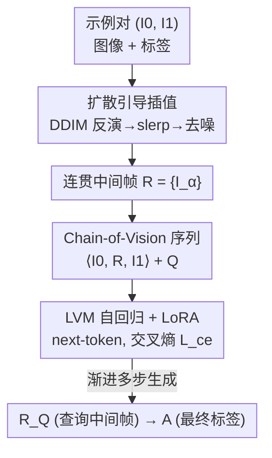

# Diffusion Guided Chain-of-Vision for Large Autoregressive Vision Models

**会议**: CVPR 2026  
**论文**: [CVF Open Access](https://openaccess.thecvf.com/content/CVPR2026/html/Wang_Diffusion_Guided_Chain-of-Vision_for_Large_Autoregressive_Vision_Models_CVPR_2026_paper.html)  
**代码**: https://github.com/wxy1006/CoV （有，标注 Code will be released）  
**领域**: 多模态VLM  
**关键词**: Chain-of-Vision, 视觉上下文学习, 自回归视觉模型, 扩散引导插值, 多步生成

## 一句话总结
把语言模型里的 Chain-of-Thought 搬进纯视觉的自回归大模型（LVM）：用预训练扩散模型在图像空间生成一串视觉上连贯的中间帧，作为"任务无关的推理过程"插进输入序列，让 LVM 在做分割/深度/位姿等下游任务时从"一步直出标签"变成"多步渐进生成"，七个视觉任务、三种模型规模上均稳定涨点。

## 研究背景与动机
**领域现状**：以 LVM（Large Vision Model）为代表的纯视觉自回归模型把图像 VQGAN 量化成 256 个 token，像语言模型一样做 next-token 预测，靠在输入序列里拼"示例图+示例标签+查询图"做视觉 in-context learning（ICL），不需要任务专属 head，一套接口通吃多任务。

**现有痛点**：这条路有两个硬伤。其一，性能高度依赖视觉 prompt 工程和示例选择，遇到域偏移就掉得厉害，部署成本高（这也是 Chain-of-Focus、prompt selection 这类方法的共同毛病）。其二，语言模型能显式吐出一条 CoT 推理链来分解难题，但纯视觉自回归模型只有"输入→输出"一步路径，缺少标准化的多步输出通道，复杂任务很难拆解。

**核心矛盾**：CoT 在 LLM 里之所以有效，是因为文本天然能写出中间推理步骤；可视觉模态没有现成的"中间步骤"长什么样，更没有跨任务统一的中间监督信号——你没法手工为分割、深度、位姿各自定义一套"推理中间图"。

**本文目标**：给纯视觉模型装上一条显式的、多步的视觉输出通道，且这条通道要 task-free（同一套机制适配所有任务），不引入任何特殊 token 或任务标记。

**切入角度**：作者的关键观察是——预训练扩散模型在图像空间里诱导出一条可靠的"概率流"，沿这条流采样出的中间图像在视觉上是连贯过渡的。那么把"源图 → 目标标签"之间的这串中间图当作天然的"chain-of-vision"监督，不就解决了"中间步骤怎么来"的问题吗？

**核心 idea**：用扩散插值生成"输入图→目标标签"之间的连贯中间帧，把它们当作视觉版 CoT 插进自回归序列，让 LVM 学会多步渐进生成，从而降低最终标签生成的困惑度、提升下游性能。

## 方法详解

### 整体框架
方法要解决的是"纯视觉模型没有中间推理步骤"这件事，整体思路是**离线用扩散模型为每个图-标签对造一串中间帧 → 把这串帧插进 in-context 视觉序列 → 让 LVM 用标准 next-token 目标把"中间帧 + 最终标签"一起自回归生成出来**。

具体来说，给一个示例对 $(I_0, I_1)$（图像与其标签），先用扩散插值生成若干中间帧 $R=\{I_\alpha\}$；把它们拼成扩展后的视觉句子 $\langle I_0, R, I_1\rangle + Q$；LVM（套一个 LoRA adapter）在这个序列上做 next-token 预测，先生成查询的中间帧 $R_Q$、再生成最终标签 $A$。整个过程不需要任何特殊分隔符，全靠统一的交叉熵 next-token 目标学出来。中间帧的"造"与序列的"用"是两个解耦的组件：前者是扩散侧的离线数据构建，后者是 LVM 侧的微调与推理。

### 关键设计

**1. Chain-of-Vision prompting：把中间帧塞进视觉句子，让单步直出变成多步渐进**

针对的痛点是纯视觉自回归模型"只有输入→输出一步路径、无法分解难题"。标准视觉 ICL 是 $\langle I_0, I_1\rangle + Q \to A$，模型直接从查询图蹦到标签。本文把示例对里的中间表示 $R$ 显式插进序列，变成

$$\langle I_0, R, I_1\rangle + Q \to R_Q + A,$$

并要求模型不仅生成最终标签 $A$，还要先生成查询自己的中间步骤 $R_Q$。联合分布仍按自回归方式分解、用同一个 next-token 目标优化：

$$p(A, R_Q \mid Q;\ \langle I_0, R, I_1\rangle) = \prod_{t=T_0+1}^{T} p\big(v_t \mid v_{<t}, Q;\ \theta\big),$$

其中 $v_t$ 既包含中间表示 $R_Q$ 的 token、也包含最终标签 $A$ 的 token。这个设计最妙的地方是**不引入任何特殊 token 或任务标记**——它完全沿用 LVM "把一切当 token 序列、统一交叉熵 $L_{ce}$"的接口，因此天然 task-agnostic，分割/深度/位姿共用一套机制。作者把它类比 LLM 的 CoT：中间步骤给了模型一个"逐步推理"的脚手架，实测能把最终标签生成的困惑度（PPL）显著拉低（如 7B 模型上多步监督把 PPL 从几十降到十几），困惑度降了，生成质量自然上去。

**2. 扩散引导插值：用概率流造出"视觉连贯"的中间帧，而不是像素混合**

CoV 需要中间帧 $R$，但中间帧从哪来、长什么样才"合理"？最朴素的做法是 RGB 空间逐像素线性插值 $r_\alpha = (1-\alpha)I_0 + \alpha I_1$，但这只是两张图叠加，会产生 ghosting、生不出输入之外的新内容，作为监督信号并不忠实。本文转而借预训练扩散模型（Stable Diffusion v2.1）学到的高度结构化隐空间，沿其概率流采样中间点，得到视觉上自然过渡的序列。流程三步：

1. **DDIM 反演**：把源图、目标图分别确定性地反演到各自的隐空间噪声 $z_T^0, z_T^1$。DDIM 的确定性动力学保证反演稳定、保身份。
2. **隐空间球面插值（slerp）**：在噪声空间对两端做球面线性插值得到中间噪声

$$z_T^\alpha = \frac{\sin\big((1-\alpha)\theta\big)}{\sin\theta}\, z_T^0 + \frac{\sin(\alpha\theta)}{\sin\theta}\, z_T^1,\qquad \theta = \arccos\frac{(z_T^0)^\top z_T^1}{\lVert z_T^0\rVert\,\lVert z_T^1\rVert}.$$

用 slerp 而非线性插值，是因为扩散噪声近似落在高维球面上，球面插值才能保持范数、留在概率流上。

3. **DDIM 去噪**：对插值得到的 $z_T^\alpha$ 做 DDIM 去噪，生成最终中间图 $I_\alpha$。因为整条生成轨迹始终落在预训练模型的学得概率流上，所以出来的中间帧平滑、连贯、保结构。

值得注意的是：反演与去噪阶段都**不用 classifier-free guidance、不加文本条件**，纯靠扩散先验，这让它真正 task-free——不依赖任何任务文字描述。相比线性插值，它在结构敏感任务（分割、位姿、边缘）上的优势尤其明显，因为它能呈现"先抓显著结构、再逐步锐化"的真·多步细化过程，而像素混合做不到这点。中间帧数量 $n$ 决定采样哪些 $\alpha$（主结果用固定 $\alpha=0.33, 0.67$ 两帧；分析实验里 $\alpha$ 从 $[0,1]$ 均匀采样、可变长度）。

### 损失函数 / 训练策略
统一的 next-token 交叉熵 $L_{ce}$，无任务专属损失。适配阶段对 LVM-300M / 1B / 7B 全部用 LoRA（rank 32、alpha 64）微调，冻结主干、保留泛化能力。VQGAN tokenizer 下采样因子 16、码本 8192，256×256 图得到 16×16 token 网格。AdamW + cosine 调度，batch 172K token；300M/1B 训 50 epoch、7B 训 20 epoch；7B 在 32 张 H20 上约 12 小时。每任务从训练集随机采 10000 个图-标签对生成插值帧；扩散插值用 50 步 DDIM。

## 实验关键数据

### 主实验
七个视觉任务（分割、位姿、上色、表面法线、边缘检测、深度、低光增强）× 三种 LVM 规模。下表摘取图像分割（MS-COCO，IoU/P-ACC）、位姿（LPIPS）、深度（A.Rel/S.Rel）、低光（PSNR）几个代表指标。FT = LoRA 微调，Diff. interp. = 扩散引导插值。

| 模型 | 配置 | 分割 IoU↑ | 分割 P-ACC↑ | 位姿 LPIPS↓ | 深度 A.Rel↓ | 低光 PSNR↑ |
|------|------|-----------|-------------|-------------|-------------|------------|
| LVM-300M | CoF [80] | 0.135 | 0.229 | 0.418 | - | - |
| LVM-300M | FT w/o interp. | 0.383 | 0.517 | 0.308 | 0.519 | 17.12 |
| LVM-300M | FT + Lin. interp. | 0.426 | 0.539 | 0.312 | 0.515 | 18.52 |
| LVM-300M | **FT + Diff. interp.** | **0.441** | **0.566** | **0.295** | **0.477** | **18.97** |
| LVM-1B | FT w/o interp. | 0.424 | 0.553 | 0.266 | 0.442 | 18.74 |
| LVM-1B | **FT + Diff. interp.** | **0.471** | **0.596** | **0.250** | **0.419** | **19.42** |
| LVM-7B | FT w/o interp. | 0.463 | 0.591 | 0.235 | 0.331 | 18.87 |
| LVM-7B | FT + Lin. interp. | 0.487 | 0.594 | 0.235 | 0.326 | 19.40 |
| LVM-7B | **FT + Diff. interp.** | **0.500** | **0.612** | **0.221** | **0.315** | **20.45** |

三条一致结论：① 多步监督（任何插值）都显著优于无插值的直接微调；② 扩散插值稳定优于线性插值（7B 上 14 个指标全胜，300M/1B 各胜 12/14）；③ 性能随模型规模正向 scaling。

### 消融 / 分析实验
固定 7B、单任务微调，研究**插值长度**与**示例对数量**的影响（分割 IoU、深度 S.Rel）。

| 维度 | 方法 | 设置 | 分割 IoU↑ | 深度 S.Rel↓ |
|------|------|------|-----------|-------------|
| 长度 | LVM-7B 基线 | len 2 | 0.475 | 0.070 |
| 长度 | Lin. interp. | len 8 | 0.505 | 0.062 |
| 长度 | Diff. interp. | len 4 | 0.510 | 0.060 |
| 长度 | Diff. interp. | len 8 | **0.533** | **0.050** |
| 对数 | Lin. interp. | 3-pair | 0.515 | 0.054 |
| 对数 | Diff. interp. | 2-pair | 0.532 | 0.051 |
| 对数 | Diff. interp. | 3-pair | **0.540** | **0.049** |

### 关键发现
- **扩散插值的"信息效率"更高**：长度 4 的扩散插值（IoU 0.510）就超过线性插值开到最大长度 8（IoU 0.505）；2 对示例的扩散插值（IoU 0.532）也压过线性插值 3 对（0.515）——同样的上下文预算，扩散插值利用得更充分。
- **小模型受益更大**：深度估计 S.Rel 上，扩散插值相对无插值基线在 300M 降 0.021、1B 降 0.023，到 7B 只降 0.009。说明显式多步监督是给小容量模型"补脑"的有效手段，模型够大时这种脚手架的边际收益递减。
- **困惑度视角**：在 MS-COCO 分割上，3 步生成在各规模都明显降低目标标签的 PPL，作者用这点解释"为什么多步有用"——中间帧让最终标签的预测分布更确定。
- **收益递减**：长度从 4→6 S.Rel 降 0.006，6→8 只降 0.004，继续加长边际效益变小。

## 亮点与洞察
- **"扩散概率流 = 免费的视觉推理链"** 是最 aha 的点：CoT 在视觉里最难的是"中间步骤无监督、无定义"，作者直接拿预训练扩散模型的概率流当现成的、task-free 的中间监督，绕开了为每个任务手工设计中间表示的死结。
- **零侵入接入**：不加特殊 token、不改 LVM 架构、只挂 LoRA，纯靠改输入序列的组织方式就把"单步"变"多步"，可复用性很强——任何 token 化的自回归视觉模型理论上都能这么套。
- **slerp 而非 lerp 的细节**：在扩散噪声的高维球面几何上用球面插值保范数，这个 trick 可迁移到任何需要"在扩散隐空间走一条合理路径"的任务（如图像 morphing、可控编辑）。
- **把"信息效率"单独拎出来比**（短链超长链、少示例超多示例）比单看峰值性能更有说服力，是组织 ablation 的好范式。

## 局限与展望
- **依赖离线扩散插值造数据**：每任务采 10000 对、每对跑 50 步 DDIM 反演+去噪，数据构建开销不小，且质量受 SD v2.1 先验上限制约；⚠️ 论文未报告这部分的总算力/时间成本。
- **中间帧"真实性"未直接验证**：方法假设扩散概率流上的中间帧是"合理的视觉推理步骤"，但中间帧本身是否语义正确、是否真对应人类直觉里的"渐进求解"并无定量评估，更多是 LPIPS/SSIM 这种感知一致性的间接佐证。
- **大模型收益递减**：7B 上提升已明显收窄，方法对超大模型的价值存疑；能否在更大规模或更难任务（如视频、3D）上保持收益是开放问题。
- **固定/手工的 $\alpha$ 与长度**：主结果用人工设定的 $\alpha=0.33,0.67$，中间帧的"该插几帧、插在哪"还是超参，未做自适应。可探索按任务难度自动决定链长。

## 相关工作与启发
- **vs Chain-of-Focus (CoF) [80]**：CoF 也给纯视觉模型做多步 prompting，但靠"显著区域"引导且只产生单一输出，不是显式的逐步链；本文产生真正的多步中间帧序列，且 task-free、跨任务统一。表中 CoF 远低于本文（300M 分割 IoU 0.135 vs 0.441）。
- **vs 线性插值基线**：同样给 CoV 喂中间帧，RGB 线性混合 $r_\alpha=(1-\alpha)I_0+\alpha I_1$ 只是叠加、易 ghosting，扩散插值在结构敏感任务上明显更优——证明"中间帧的视觉连贯性"本身就是有效监督的关键。
- **vs 图像插值/morphing（DiffMorpher、Framer、AID、DreamMover）**：这些工作把扩散插值当目标（生成漂亮过渡图）；本文把扩散插值当手段，用插值序列去监督一个下游自回归模型的多步生成，是"插值为他人作嫁衣"的新用法。
- **vs LLM 的 CoT / Chain-of-Spot**：把文本 CoT 的"分解中间步骤"思想迁移到纯视觉，核心贡献是回答了"视觉的中间步骤从哪来"——用扩散概率流取代文本里天然存在的推理句子。

## 评分
- 新颖性: ⭐⭐⭐⭐⭐ 用扩散概率流当 task-free 视觉 CoT 监督，干净地解决了"视觉中间步骤无定义"的核心难题，切入角度新。
- 实验充分度: ⭐⭐⭐⭐ 七任务×三规模 + 长度/示例对双 ablation 较扎实，但缺数据构建成本分析与中间帧质量的直接评估。
- 写作质量: ⭐⭐⭐⭐ 框架与公式清晰，三步插值和 CoV 序列讲得明白；部分图表（Fig.2 散点）信息密集略难读。
- 价值: ⭐⭐⭐⭐ 零侵入、可复用的多步生成范式，对中小 LVM 提升明显，易迁移到其他 token 化视觉模型。

<!-- RELATED:START -->

## 相关论文

- [\[CVPR 2026\] Language-guided Frequency Modulation for Large Vision-Language Models](language-guided_frequency_modulation_for_large_vision-language_models.md)
- [\[CVPR 2026\] AutoTraces: Autoregressive Trajectory Forecasting via Multimodal Large Language Models](autotraces_autoregressive_trajectory_forecasting_via_multimodal_large_language_m.md)
- [\[CVPR 2026\] Chain-of-Thought Guided Multi-Modal Object Re-Identification](chain-of-thought_guided_multi-modal_object_re-identification.md)
- [\[CVPR 2026\] UVU: Improving Multimodal Understanding via Vision-Language Unified Autoregressive Paradigm](uvu_improving_multimodal_understanding_via_vision-language_unified_autoregressiv.md)
- [\[CVPR 2026\] LLaDA-V: Large Language Diffusion Models with Visual Instruction Tuning](llada-v_large_language_diffusion_models_with_visual_instruction_tuning.md)

<!-- RELATED:END -->
