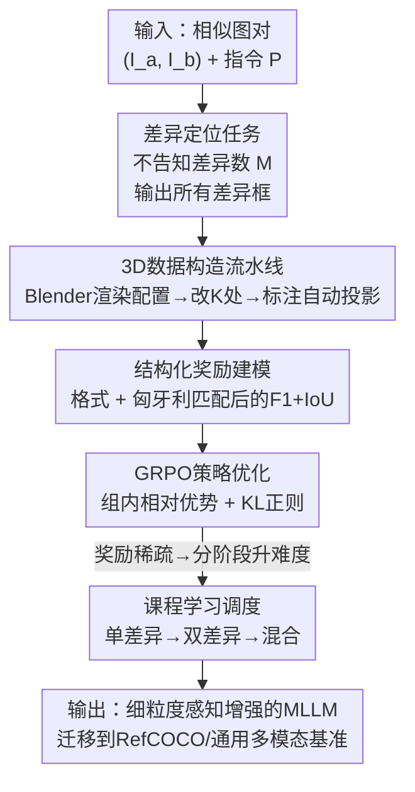

# DiG: Differential Grounding for Enhancing Fine-Grained Perception in Multimodal Large Language Models

**会议**: CVPR 2026  
**论文**: [CVF Open Access](https://openaccess.thecvf.com/content/CVPR2026/html/Tao_DiG_Differential_Grounding_for_Enhancing_Fine-Grained_Perception_in_Multimodal_Large_CVPR_2026_paper.html)  
**代码**: 待确认  
**领域**: 多模态VLM  
**关键词**: 细粒度感知, 差异定位, 代理任务, 强化学习GRPO, 课程学习  

## 一句话总结
提出 **差异定位（Differential Grounding, DiG）** 这一代理任务——给模型两张高度相似的图、不告诉它有几处不同，逼它把所有差异都用 bounding box 框出来；配上 Blender 自动造数据 + GRPO 强化学习 + 课程学习，让 Qwen3-VL 的细粒度视觉感知显著变强，并能迁移到 RefCOCO 等下游 grounding 与通用多模态基准。

## 研究背景与动机
**领域现状**：多模态大模型（MLLM）在图像描述、VQA 这类"整体场景理解"任务上已经很强，能把全局视觉语义和文本推理对齐得很好。

**现有痛点**：但它们在**细粒度视觉感知**和**精确空间推理**上很弱——小物体的增删、颜色的微妙变化、缺失的元素，SOTA 模型经常直接看漏。根因是预训练范式只提供了高层语义对齐的监督，缺乏培养"对细节敏感"所需的细粒度监督信号。

**核心矛盾**：想用强化学习（RL）后训练来补这块短板，但现有路线各有死穴。一条路是直接在 visual grounding（如 RefCOCO）上微调，结果模型过拟合成专用模型、开放式理解泛化崩掉，而且 RefCOCO 这类数据集要大量人工标注、规模和多样性都受限；另一条路用拼图、幻觉检测等代理任务，但这些任务并不是为"细粒度感知"专门设计的，练完模型对视觉细节还是不够敏感。

**本文目标**：找一个既能精准强化细粒度感知、又**可大规模自动生成且自动可验证**、还不损害泛化的代理任务。

**切入角度**：人类辨别两张相似图的差异时，必须逐个物体做细粒度比对——这种"找不同"天然要求把注意力压到局部细节。作者把它形式化成可验证的 grounding 问题：定位所有差异区域。

**核心 idea**：用"差异定位"代替"单图 grounding"来强化细粒度感知——不告诉差异数量，迫使模型超越粗粒度语义对齐、做完整的逐区域比对；再用 3D 渲染自动造数据、用课程学习稳住稀疏奖励下的优化。

## 方法详解

### 整体框架
DiG 由四块组成：先把"差异定位"形式化为一个任务（输入两张相似图 + 指令，输出所有差异框），再用 Blender 3D 渲染**自动**造出"差异完全可控、标注完美"的成对图，然后用三项结构化奖励 + GRPO 做强化后训练，最后用课程学习把任务难度从"1 处差异"逐步爬到"多处混合差异"，解决初期奖励几乎全为零的优化难题。整条链路无需任何人工标注，纯靠渲染器自动产生 ground-truth。

### 关键设计

**1. 差异定位任务（DiG）：用"找不同"逼出逐区域细粒度比对**

针对"预训练只给高层语义监督、模型对细节不敏感"这个根因。任务形式化为：输入元组 $X=(I_a, I_b, P)$，$I_a$ 是参考图、$I_b$ 是含 $M$ 处微改（增/删/属性变化）的相似图，指令 $P$ 要求找出并定位全部差异。模型输出文本序列 $O=(o_1,\dots,o_T)$，确定性地解析为预测框集合 $B_{pred}=\{b_i\}_{i=1}^N$，每个 $b_i=[x_{min},y_{min},x_{max},y_{max}]$；ground-truth 为 $B_{gt}=\{b^{gt}_j\}_{j=1}^M$。关键在于**不告诉模型 $M$ 是多少**——模型必须自己推断有几处差异，这就堵死了"猜个固定数量"的捷径，强迫它把两图逐物体、逐属性做完整比对，从而把感知压到局部细节而非全局语义。

**2. 3D 渲染自动数据流水线：让"差异可控 + 标注完美"摆脱人工标注**

针对 RefCOCO 这类 grounding 数据"标注贵、规模小、多样性差"的痛点。流水线基于 Blender：先用 JSON 配置文件程序化生成基础 3D 场景（指定物体数量及形状、材质、颜色、尺寸、空间位置），渲染得到参考图 $I_a$；再对配置做随机改动——从 $[1,N]$ 采样整数 $K$，选 $K$ 个不同物体，每个随机改一种属性（形状/颜色/尺寸/材质，或增/删物体），渲染出 $I_b$。于是图对 $(I_a, I_b)$ 视觉上连贯、却恰好在 $K$ 个局部区域不同，且难度可由上界 $N$ 自由调。最妙的是**标注全自动且完美**：因为每处改动都在三维空间里程序化定义，它的二维投影框能直接从渲染器读出，得到 $B_{gt}$，彻底不需要人标，标注精度和一致性都有保证。

**3. 结构化三项奖励 + 匈牙利匹配：把开放式生成变成可稳定优化的奖励信号**

针对"开放式文本输出难以打分、且多物体下预测与真值如何对应"的问题。奖励由三部分组成。**格式奖励** $r_{format}$ 是二值约束，只有当解析器 $P(O)$ 能从输出抽出合法框列表（非空）时给 1、否则 0，逼模型输出 `[[xmin,ymin,xmax,ymax],...]` 这种可机读结构而非自由文本。**精度奖励** $r_{acc}$ 先用**匈牙利算法**把 $B_{pred}$ 和 $B_{gt}$ 做一对一二分图匹配，相似度 $\Phi(b_i,\tilde{b}_j)$ 由 L1 距离 + GIoU 组合；匹配后算两个互补信号——检测层面的 F1（衡量"差异找全没"，由精度 $p=n_m/N$、召回 $r=n_m/M$ 得 $F_1=2pr/(p+r)$，$n_m$ 为匹配对数）和匹配框平均 IoU（衡量"框得准不准"）：

$$r_{acc} = \lambda_1 F_1 + \lambda_2 \text{IoU}$$

总奖励把结构约束和感知反馈分层融合，只给格式项分一小块权重，让模型先保证输出合法、再主攻定位精度：

$$r = (1-\alpha)\,r_{acc} + \alpha\,r_{format}$$

二分图匹配保证了多物体差异下梯度反馈依然稳定，避免"高 IoU 但漏检"被误判为好。

**4. GRPO 策略优化：组内相对奖励驱动多模态生成**

用 Group Relative Policy Optimization 优化策略 $\pi_\theta$。对每个输入 $(I_a,I_b,P)$ 采样 $G$ 个候选回复 $\{O^{(g)}\}$，各自用 Eq.(3) 的奖励打分，再算组内归一化优势：

$$A_g = \frac{r_g - \text{mean}(\{r_i\})}{\text{std}(\{r_i\})}$$

该优势均匀赋给 $O^{(g)}$ 内每个 token，配 token 级裁剪代理目标 $L^{CLIP}_{g,t}$（似然比 $r_{g,t}$ 截到 $[1-\varepsilon,1+\varepsilon]$）和 KL 正则项 $\beta\,D_{KL}(\pi_\theta\|\pi_{ref})$ 构成完整 GRPO loss。裁剪防止更新过猛、KL 约束防止偏离参考策略太远；早期可放松 KL 以鼓励探索。这套机制让模型无需价值网络、靠组内相对比较就能稳定地朝"找全且框准"的方向更新。

**5. 课程学习难度调度：把稀疏奖励从"几乎全零"喂成可收敛的密集信号**

针对 DiG 强化学习最大的拦路虎——**奖励稀疏**：训练初期模型几乎定位不对任何差异，奖励塌到接近零、更新不稳、根本收不敛。课程分多个递增难度阶段：初期只练**单处差异**的简单样本，反馈密集易解读，让策略先学会"视觉扰动 ↔ 框预测"的基本映射；随后逐步把数据分布移向**多处差异**，培养组合推理和多物体感知；最后在**混合差异**数据上微调，并且**刻意不给差异数量**、让模型自己推断，以拉高难度、压榨能力上限。这种从稀疏到密集的奖励塑形，是整套 RL 能稳定收敛的关键。

### 损失函数 / 训练策略
训练语料约 4.8K 图对，单/双/混合差异各约 1.6K，混合场景最多 4 处差异。backbone 用 Qwen3-VL-8B-Thinking 和 Qwen3-VL-4B-Thinking，在 EasyR1 框架下用 GRPO + KL 正则做强化后训练，按上述课程从简单到混合逐级升难度。

## 实验关键数据

### 主实验

感知基准（HalBench / HRB8K / POPE / V* / VSR / CV-Bench / MMVP，平均 AVG）：

| 模型 | HalBench | V* | VSR | MMVP | AVG |
|------|----------|-----|------|------|-----|
| Qwen3-VL-4B-Thinking | 70.1 | 79.1 | 82.5 | 80.0 | 78.9 |
| + DiG (4B) | 73.8 (↑3.8) | 79.1 | 83.9 (↑1.4) | 79.0 (↓1.0) | 79.9 (↑1.0) |
| Qwen3-VL-8B-Thinking | 73.3 | 79.1 | 82.6 | 77.3 | 79.3 |
| + DiG (8B) | 76.7 (↑3.4) | 81.2 (↑2.1) | 83.0 (↑0.4) | 78.7 (↑1.4) | 80.5 (↑1.2) |

通用多模态基准（迁移性验证）：

| 模型 | MMBench | MMStar | SQA_I | MME | AI2D |
|------|---------|--------|-------|------|------|
| Qwen3-VL (4B) | 83.7 | 66.7 | 86.9 | 1592.4 | 81.0 |
| + DiG (4B) | 84.5 (↑0.8) | 70.2 (↑3.5) | 89.2 (↑2.3) | 1643.4 (↑51.0) | 82.2 (↑1.2) |
| Qwen3-VL (8B) | 85.5 | 71.7 | 90.3 | 1648.4 | 82.5 |
| + DiG (8B) | 87.2 (↑2.2) | 72.7 (↑1.0) | 90.5 (↑0.2) | 1665.9 (↑17.5) | 84.1 (↑1.6) |

在 grounding 基准（RefCOCO/+/g）上，8B 变体平均提升约 2–3 点，RefCOCO 上 +2.0~+3.4、RefCOCO+ 上 +1.4~+3.0，说明"找不同"学到的细粒度区域感知能直接迁移到指代表达定位。

### 消融实验

奖励组件消融（Tab.4，RefCOCO val@50 / HalBench / MMBench / AI2D）：

| Format | IoU | F1 | RefCOCO val@50 | HalBench | MMB | AI2D | 说明 |
|--------|-----|-----|----------------|----------|------|------|------|
| ✓ | ✗ | ✗ | – | – | – | – | 只有格式约束，无法学定位 |
| ✓ | ✓ | ✗ | 84.2 | 70.8 | 83.2 | 81.7 | 仅 IoU：能高重叠却漏检 |
| ✓ | ✗ | ✓ | 87.8 | 72.8 | 84.4 | 82.1 | 仅 F1：重检测全、空间不稳 |
| ✓ | ✓ | ✓ | **88.6** | **73.8** | **84.5** | **82.2** | 完整：检测+空间互补最优 |

课程调度消融（Fig.3，按 HalBench/TextVQA/AI2D/MMBench）：Base → DiG-1（单差异）→ DiG-2（双差异）→ DiG-Mix（混合）逐级单调上升，如 HalBench 73.3 → 75.4 → 75.5 → 76.7，MMBench 85.5 → 86.9 → 87.0 → 87.2。

### 关键发现
- **奖励里 F1 比 IoU 更关键**：只用 IoU 时模型能刷出高重叠却漏掉部分目标（RefCOCO val@50 仅 84.2），只用 F1 已涨到 87.8；两者结合才达 88.6，说明"找全"和"框准"必须同时奖励。
- **课程的每一级都在涨**：单差异打基础、双差异加复杂度、混合差异（且不告知数量）做泛化，三阶段单调累积收益，验证了稀疏奖励确实要靠由易到难来稳住。
- **小模型超大模型**：DiG 加持的 4B/8B 在多项基准上追平甚至超过若干更大的专有系统，提升来自更高效的表示学习和奖励驱动的感知精炼，而非堆参数。
- **个别基准轻微回退**：4B 在 MMVP 上 ↓1.0，说明细粒度比对的强化并非对所有感知子任务都正向。

## 亮点与洞察
- **"不告诉差异数量"是点睛之笔**：把"找不同"从可作弊的固定输出，变成必须自己推断数量+完整比对的开放任务，直接逼出细粒度感知；这个约束几乎零成本却根本性地提高了任务价值。
- **3D 渲染造数据 = 完美标注 + 难度旋钮**：差异在三维里程序化定义，2D 框投影自动得到，既省掉人工标注又能用 $N$ 一键调难度——这套"可控可验证"的数据范式可迁移到任何需要精确空间监督的代理任务。
- **匈牙利匹配把开放生成接进可优化奖励**：用二分图匹配解决"预测框和真值框谁对谁"，让多物体差异下的 F1+IoU 奖励梯度稳定，是把生成式输出纳入 RLVR 的一个干净做法。
- **代理任务能力会迁移**：在合成"找不同"上练出的感知，竟能转到真实图的 RefCOCO 和通用 VQA，提示代理任务学到的是可迁移的底层感知技能而非任务表面。

## 局限与展望
- 训练数据全是 Blender 合成的几何场景（CLEVR 风格），与真实照片存在 domain gap；虽迁移有效，但合成→真实的鸿沟可能限制更复杂自然场景下的收益。
- 训练语料仅约 4.8K 图对、混合最多 4 处差异，规模和差异复杂度都偏小，更大规模/更多差异下的 scaling 行为未充分展示。
- 个别基准（如 4B 的 MMVP）出现轻微回退，说明强化"差异比对"对部分感知子任务可能有副作用，缺乏对何时正/负迁移的分析。
- 可改进：把数据流水线从合成 3D 扩展到真实图像编辑对（如 diffusion 局部编辑生成差异对），缩小 domain gap；或把课程难度自适应化，按模型当前奖励分布动态调 $N$。

## 相关工作与启发
- **vs Perception-R1**：同样用 RL + IoU/匹配奖励强化 grounding，但 Perception-R1 直接在传统感知任务上训、易过专化且依赖标注；DiG 改用自动可造的"差异定位"代理任务，标注零成本且泛化更好。
- **vs 视觉拼图 / 幻觉检测代理任务**：它们提供的是粗粒度或任务特定的辅助监督，并非为细粒度感知设计；DiG 把代理学习专门指向"逐区域差异比对"，监督信号更对症。
- **vs RefCOCO 直接微调**：RefCOCO 需大量人工标注、规模受限且易过拟合到指代任务；DiG 用合成数据无限扩展，反而能反向迁移提升 RefCOCO 本身。

## 评分
- 新颖性: ⭐⭐⭐⭐⭐ 把"找不同"形式化为可自动验证的细粒度 grounding 代理任务，"不告知数量"的设计很巧
- 实验充分度: ⭐⭐⭐⭐ 覆盖感知/grounding/通用三类基准 + 双 backbone + 奖励与课程双消融，但仅合成数据、规模偏小
- 写作质量: ⭐⭐⭐⭐ 动机—任务—数据—奖励—课程逻辑清晰，公式完整
- 价值: ⭐⭐⭐⭐ 提供了一套低成本、可验证、能迁移的细粒度感知后训练范式，实用性强

<!-- RELATED:START -->

## 相关论文

- [\[CVPR 2026\] OddGridBench: Exposing the Lack of Fine-Grained Visual Discrepancy Sensitivity in Multimodal Large Language Models](oddgridbench_exposing_the_lack_of_fine-grained_visual_discrepancy_sensitivity_in.md)
- [\[CVPR 2026\] CropVLM: Learning to Zoom for Fine-Grained Vision-Language Perception](cropvlm_learning_to_zoom_for_fine_grained_vision_language_perception.md)
- [\[CVPR 2026\] Grounding Everything in Tokens for Multimodal Large Language Models](grounding_everything_in_tokens_for_multimodal_large_language_models.md)
- [\[CVPR 2026\] Same or Not? Enhancing Visual Perception in Vision-Language Models](same_or_not_enhancing_visual_perception_in_vision-language_models.md)
- [\[CVPR 2026\] Fine-Grained Post-Training Quantization for Large Vision Language Models with Quantization-Aware Integrated Gradients](fine-grained_post-training_quantization_for_large_vision_language_models_with_qu.md)

<!-- RELATED:END -->
