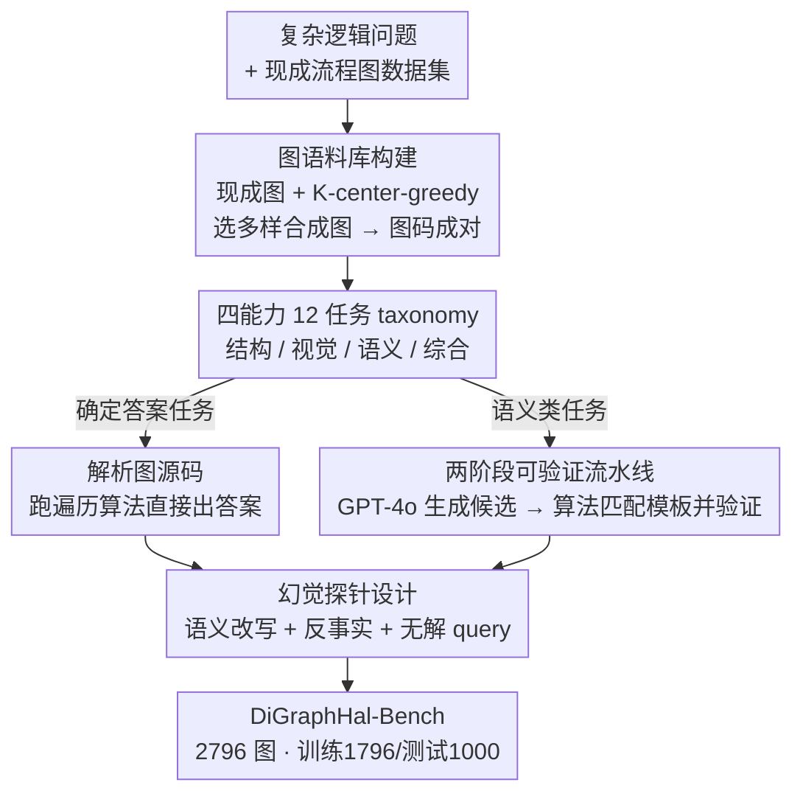

# DiGraphHal-Bench: Evaluating Multimodal Large Language Models on Complex Directed Graphs

**会议**: CVPR 2026  
**论文**: [CVF Open Access](https://openaccess.thecvf.com/content/CVPR2026/html/Fan_DiGraphHal-Bench_Evaluating_Multimodal_Large_Language_Models_on_Complex_Directed_Graphs_CVPR_2026_paper.html)  
**代码**: https://github.com/DouziLBean/DiGraphHal-Bench (有)  
**领域**: 多模态VLM  
**关键词**: MLLM幻觉, 有向图理解, VQA基准, 细粒度推理, 自动可验证构造

## 一句话总结
DiGraphHal-Bench 是首个面向「复杂有向图」的大规模 VQA 基准，用 2,796 张真实流程图、四大能力 × 12 个细粒度任务系统评测 MLLM 的幻觉与组合推理；靠一条「LLM 生成 + 算法确定性验证」的两阶段流水线在零人工标注下兼顾规模与可信度，结果显示连 GPT-5/Gemini 2.5 在图结构推理上都频繁幻觉，SFT 能缓解但远未解决。

## 研究背景与动机
**领域现状**：MLLM 幻觉研究几乎都集中在自然图像上——分析的是「图里有没有这个物体」这类跨模态不一致。同时图理解基准要么是合成图（GITA、VisionGraph、VGA），只考最短路/找环这类纯拓扑题，缺语义和视觉复杂度；要么是真实图基准（FlowVQA、FlowCE、MindBench），但要么规模小、要么靠 LLM 打分引入偏差。

**现有痛点**：有向图是工程、生物、医学里工作流和逻辑过程的「视觉语言」，读错一条边就可能酿成关键失误。但图理解恰恰要求模型**同时**在拓扑结构、视觉布局、语义内容三个层面推理，而现有基准没有一个把这三者放在一起统一评测，也没人系统研究幻觉如何从三者交互中涌现。

**核心矛盾**：基准构造里存在一个长期的「规模 ↔ 质量」两难——想要大规模就得用 LLM 自动生成 QA，但 LLM 生成的答案不可信、会继承模型偏差；想要高质量就得人工标注，又上不了规模。FlowVQA 用 GPT-4o 生成加打分，规模够但偏差大；FlowCE 真实可靠却只有几百张。

**本文目标**：① 造一个既语义丰富又结构忠实的大规模有向图基准；② 让 QA 答案在大规模下仍然可信（不靠人工、不靠 LLM 打分）；③ 把图理解拆解成可诊断的细粒度能力，定位 MLLM 到底栽在哪一环。

**切入角度**：作者发现「有确定答案的图任务」其实可以**用算法验证**——给定图的源码（Mermaid/Graphviz），找路径、找环、比对差异都是确定性的图遍历问题，答案能被程序算出来而非靠模型猜。于是把「LLM 负责生成多样的问题」和「算法负责验证并产出标准答案」解耦。

**核心 idea**：用「模板引导的 LLM 生成 + 确定性算法验证」两阶段流水线绕开规模-质量两难，配上一套四能力 12 任务的细粒度 taxonomy，对 MLLM 在有向图上的幻觉与组合推理做首次统一评测。

## 方法详解

### 整体框架
DiGraphHal-Bench 不是一个模型而是一套**基准 + 构造流水线**。整条管线分两段：先搭一个跨六大专业领域、图-码成对（每张图都配 Mermaid 和 Graphviz 源码）的图语料库，再在其上按四能力 12 任务的 taxonomy 批量生成 VQA。生成时按任务性质分流：**有确定答案的任务**（找路径、找环、比对结构差异）直接解析图源码、跑遍历算法产出标准答案；**语义类任务**（自然语言提问）走两阶段流水线——GPT-4o 先生成多样的候选问句，再用算法把每个候选严格匹配回它的「逻辑模板」并算出标准答案，匹配不上的直接丢弃。最终得到 2,796 张图（训练 1,796 / 测试 1,000），全程零人工标注。评测端则把 13 个开闭源 MLLM 跑一遍，并对 Qwen2.5-VL-7B 做 SFT 消融，看「打磨某一项基础能力能否带动综合推理」。

### 关键设计

**1. 四能力 12 任务的细粒度 taxonomy：把「读懂一张图」拆成可诊断的小题**

基准的骨架是一棵四层能力树：三项**基础能力**（结构 Structural、视觉 Visual、语义 Semantic）+ 一项**综合能力**（Comprehensive），下挂 12 个细粒度任务。结构能力考拓扑——Graph Parsing（枚举所有节点边）、Graph2Code（把图翻译成 Mermaid/Graphviz 源码）、Masked Subpath Query（仿掩码语言建模，挖空一段子路径让模型按结构约束补全，分「结构匹配掩码」和「全合并掩码」、又分含环/不含环）。视觉能力专挑非平凡布局：Edge Layout Perception（长边、逆流边、交叉边对）、Local Structure Comparison（两张图的结构差异）、Elements Localization（给节点/边出 bounding box 或判八方向相对位置）、Spatial Position Awareness（在大画布里定位子图，含 5× 缩略图测尺度不变性）、Visual Attributes Perception（按形状/颜色/边框样式辨认节点和边）。语义能力则用 Semantic Query（问句词面与图标签一致）vs Semantic-Rewrite Query（同义改写、打乱词面）来分离「真懂语义」和「靠关键词匹配」。综合能力是终极考题，把三者拼在一起，分 Non-Semantic（模板化的 What/Which 元素中心题、How 路径中心题）、Semantic、Semantic-Rewrite 三档逐级加大语言歧义。这套 taxonomy 的价值在于：模型答错时能精确归因到「是拓扑不行、还是看不见交叉边、还是只会词面匹配」，而不是只给一个笼统的总分。

**2. 两阶段可验证构造流水线：用算法验证绕开「规模-质量」两难**

这是全文方法上最核心的贡献，直接针对「LLM 生成不可信、人工标注上不了规模」的痛点。作者按任务是否有确定答案分流：对找路径、找环、比结构差异这类**确定性任务**，根本不让 LLM 碰答案——直接解析图源码、跑图遍历算法生成标准答案，天然可信。对必须用自然语言提问的**语义类任务**（语义能力和综合能力里的 Semantic / Semantic-Rewrite），走两阶段：**Stage 1（LLM 构造）** 让 GPT-4o 在「掩码子路径查询」和「半结构化模板」这两套逻辑地基的引导下生成大量多样的候选问句，保证问题在逻辑上是有据可循的；**Stage 2（算法验证）** 做一步确定性两段验证——先把每个候选问句**算法化地匹配回它的源逻辑模板**，要求严格一一对应，匹配模糊或对不上的全部丢弃；再对通过的候选，**执行该逻辑模板对应的算法自动算出标准答案**。这样 LLM 只负责「问得多样」，答案的事实性完全交给算法兜底，既避免了 GPT-4o 打分式基准的模型偏差，又不用一张张人工标，从而在大规模下保住可信度。

**3. 图语料库构建：现成真实图 + K-center-greedy 选出的多样合成图**

为了同时拿到真实性和结构多样性，语料库走两条腿。一条是**整合现成数据集**：从 FlowVQA 取来自教程网页和代码片段的流程图，从 BigDocs 取随机布局的图来削弱「方向偏置」（模型老假设流程从上往下），打底真实世界的过程推理图。另一条是**自造合成图补足复杂逻辑**：从一大堆复杂问题（数学证明、系统工作流）出发，用 **K-center-greedy 算法**挑出一个话题上尽量分散的子集，再让 LLM 把这些问题转写成 Mermaid 和 Graphviz 源码，得到与源逻辑可验证对应的复杂图。关键是每张图都以**图-码成对**形式存在，这正是设计 2 里算法验证能成立的前提——没有源码，遍历算法就无从产出标准答案。最终覆盖至少六个专业领域。

**4. 幻觉探针设计：语义改写 + 反事实 + 无解 query 逼出虚构**

光有任务还不够，作者在题面上专门埋了**抗幻觉陷阱**。其一是**语义改写（Semantic-Rewrite）**：把问句同义改写、保留语义但换掉词面（如「Refine Solution」→「Refining an Initial Solution」），逼模型真正做语义 grounding 而不是关键词匹配——这一改写在结果里造成了所有模型的系统性掉点。其二是在综合能力的 Non-Semantic 任务里**注入反事实（counterfactual）和无解（answerless）样本**，测模型会不会面对「图里根本没有的结构」时硬编一个答案出来。其三是综合题把视觉属性**显式绑定语义**（如「粉框蓝填充的节点 = 关键里程碑」「红节点 = 紧急」），让查询贴近真实意图，同时考模型能不能把「看到的颜色」和「被赋予的含义」对齐。这套设计让基准不只测「答对率」，更测「在该说不知道时会不会幻觉」。

## 实验关键数据

### 主实验
评测覆盖 13 个 MLLM：闭源（GPT-4o、o3、GPT-5、Claude Sonnet 4.5、Gemini 2.5 Pro）、开源大/中（GLM-4.5V、Qwen2.5-VL-72B、LLaVA-OV-72B）、开源小（Qwen2.5-VL-7B、LLaVA-OV-7B、InternVL3.5-8B）。下表汇总各能力上的代表性指标（F1，Mermaid/Graphviz 平均）。

| 能力 / 子任务 | 指标 | GPT-5 | Gemini 2.5 | o3 | Qwen2.5-VL-7B(小) |
|------|------|------|------|------|------|
| 结构·Graph Parsing(Full) | F1 | 96.00 | 97.89 | 95.48 | 86.90 |
| 结构·掩码 SM-CP(复杂路) | F1 | 84.51 | 83.43 | 73.95 | 13.19 |
| 视觉·交叉边 Crossing | F1 | 23.42 | 48.20 | 12.42 | 0.62 |
| 视觉·绝对定位 Acc@0.5 | Acc | 7.58 | 9.18 | 7.38 | 0.23 |
| 视觉·边属性 Edge | F1 | 78.65 | 88.43 | 73.61 | 27.54 |
| 语义·Semantic Query | F1 | 76.37 | 75.94 | 71.63 | 37.72 |
| 综合·Sem-Rewrite Path | F1 | 62.07 | 72.86 | 50.01 | 16.03 |

可以看到：**基础识别（Graph Parsing）人人接近满分**，但一进到细粒度推理（掩码补全、交叉边、绝对定位）就断崖式下滑，连最强模型都远未达标，这正是基准想暴露的「高层会、细节不会」现象。

### SFT 消融实验（Qwen2.5-VL-7B 综合能力，F1，括号为相对 Base 增量）
作者对 Qwen2.5-VL-7B 训了 5 个 SFT 模型：4 个按单一能力类别训的 specialist + 1 个按 结构→视觉→语义→综合 顺序训的 curriculum，全在综合任务上做消融，看「补哪项基础能力能带动综合推理」。

| 训练配置 | Non-Sem·Element | Non-Sem·Path | Sem·Element | Sem-Rewrite·Element |
|------|------|------|------|------|
| Base | 13.77 | 15.99 | 16.98 | 12.00 |
| Structural 专家 | 29.56 (+15.79) | 25.49 (+9.50) | 27.03 (+10.05) | 17.60 (+5.60) |
| Visual 专家 | 27.14 (+13.37) | 15.46 (−0.53) | 31.54 (+14.56) | 22.46 (+10.46) |
| Semantic 专家 | 12.47 (−1.30) | 19.81 (+3.82) | 17.39 (+0.41) | 10.90 (−1.10) |
| Comprehensive 专家 | 53.41 (+39.64) | 28.65 (+12.66) | 55.09 (+38.11) | 36.06 (+24.06) |
| Curriculum | 51.67 (+37.90) | 23.86 (+7.87) | 47.53 (+30.55) | 36.31 (+24.31) |

### 关键发现
- **「边盲」现象（edge blindness）**：节点属性识别很好（Gemini 节点 F1 89.88%），但边属性普遍崩——GPT-5 从节点 86.11% 掉到边 78.65%，小模型更惨。说明 MLLM 对封闭的、显眼的形状有感知偏好，对细丝状的边视而不见，这是图理解的根本性障碍。
- **缺尺度不变性**：相对位置推理还行（GPT-5 相对定位 81.79%），但绝对 bounding box 定位**所有模型 IoU 0.5 下都低于 10%**，在 5× 缩略图上更是直接崩盘，对真实应用是致命短板。
- **靠词面匹配而非真懂语义**：问句一改写（语义不变、词面变），所有模型显著掉点（Gemini F1 75.94→72.63，Acc 71.37→66.92 掉得更狠），暴露 MLLM 仍在做浅层关键词匹配。⚠️ 有趣反例：GPT-5/o3 在综合能力的 Semantic-Rewrite 上反而比 Semantic 更高，作者推测语义扰动可能激活了更深的泛化推理（以原文为准）。
- **结构/视觉基础能力是综合推理的发动机**：消融里 Structural 专家几乎在所有综合任务上都涨，Visual 专家尤其拉高元素中心题；但 Semantic-only 训练**反而损害**元素中心推理（−1.30），因为它过拟合语言线索、牺牲了视觉-结构推理。直接训 Comprehensive 专家收益最大（最高 +39.64），而 Curriculum（顺序训）出现**灾难性遗忘**、反而不如直接训，说明朴素课程学习行不通。

## 亮点与洞察
- **「LLM 生成 + 算法验证」解耦**是最值得借鉴的范式：让 LLM 只干它擅长的「问得多样」，把「答案对不对」这种确定性的活完全交给算法，从根上消除 LLM-as-judge 的偏差——这套思路可迁移到任何「答案可由程序从结构化源算出」的基准（代码、表格、知识图谱 QA）。
- **图-码成对**是整个可验证性的隐形地基：因为每张图都有 Mermaid/Graphviz 源码，遍历算法才能产出 ground truth；这提醒做结构化视觉基准时，「保留可执行的符号表示」比只存图片值钱得多。
- **细粒度 taxonomy 把幻觉「可定位」**：不是给一个总分，而是能说清模型栽在「交叉边/缩略图定位/语义改写」哪一环，对后续针对性改进 MLLM 极有价值。
- **「边盲」是一个干净的、可复现的机制性发现**：节点 vs 边的感知鸿沟横跨所有模型，几乎是 MLLM 视觉编码器的共性缺陷，值得专门研究。

## 局限与展望
- **合成图依赖 LLM 转写**：新合成数据集靠 LLM 把问题转成 Mermaid/Graphviz 源码，虽然有「与源逻辑可验证对应」兜底，但转写本身的多样性/真实性边界没有充分量化。
- **SFT 只在 Qwen2.5-VL-7B 一个 backbone 上做**：「结构/视觉基础能力驱动综合推理」「Semantic-only 有害」「课程学习灾难性遗忘」这些结论是否跨模型规模成立，未验证。
- **横向比较需谨慎**：不同任务难度差异巨大（Graph Parsing 近满分 vs 绝对定位 <10%），把不同子任务的分数直接横比意义有限；GPT-5/o3 在改写题反超的反例也提示「语义改写一定更难」并非铁律。
- **改进思路**：针对「边盲」可在视觉编码阶段加强细丝状结构的表征；针对绝对定位崩盘可引入显式坐标/分块 grounding；课程学习的灾难性遗忘提示需要回放或更细的能力调度。

## 相关工作与启发
- **vs 合成图基准（GITA / VisionGraph / VGA）**：它们只考纯拓扑（最短路、找环），用无语义的合成图，缺视觉和语义复杂度；本文用真实+合成的语义有向图，把结构/视觉/语义放在同一题里联合考。
- **vs 语义图基准（VGCURE / Ai et al.）**：VGCURE 用匿名标签回避了领域语义，其他工作不把细粒度视觉属性当核心；本文把视觉属性显式绑定语义（颜色=含义）并纳入推理。
- **vs 过程图基准（FlowVQA / FlowCE / MindBench）**：FlowVQA 靠 GPT-4o 生成+打分继承偏差，FlowCE 质量高但规模小靠人工，MindBench 大但缺图级推理设计；本文用全自动两阶段可验证流水线**同时**拿下规模、质量、图级推理，正面解决规模-质量两难。

## 评分
- 新颖性: ⭐⭐⭐⭐⭐ 首个面向复杂有向图幻觉+细粒度推理的统一 VQA 基准，「LLM 生成+算法验证」解耦范式扎实。
- 实验充分度: ⭐⭐⭐⭐⭐ 13 个开闭源模型 + 5 个 SFT 变体，四能力 12 任务全覆盖，消融定位到能力级。
- 写作质量: ⭐⭐⭐⭐ taxonomy 与发现（边盲/尺度不变性/词面匹配）清晰，但表格密集、部分子任务命名缩写多需对照。
- 价值: ⭐⭐⭐⭐⭐ 暴露了 MLLM 图理解的系统性缺陷，并提供可验证、可复现、可诊断的评测地基，对推进鲁棒图理解有长期价值。

<!-- RELATED:START -->

## 相关论文

- [\[CVPR 2026\] Flat-Pack Bench: Evaluating Spatio-Temporal Understanding in Large Vision-Language Models through Furniture Assembly](flat-pack_bench_evaluating_spatio-temporal_understanding_in_large_vision-languag.md)
- [\[CVPR 2026\] VisRes Bench: On Evaluating the Visual Reasoning Capabilities of VLMs](visres_bench_on_evaluating_the_visual_reasoning_capabilities_of_vlms.md)
- [\[CVPR 2026\] ENC-Bench: A Benchmark for Evaluating MLLMs in Electronic Navigational Chart Understanding](enc-bench_a_benchmark_for_evaluating_multimodal_large_language_models_in_electro.md)
- [\[ACL 2026\] ErrorRadar: Benchmarking Complex Mathematical Reasoning of Multimodal Large Language Models Via Error Detection](../../ACL2026/multimodal_vlm/errorradar_benchmarking_complex_mathematical_reasoning_of_multimodal_large_langu.md)
- [\[ICLR 2026\] GTR-Bench: Evaluating Geo-Temporal Reasoning in Vision-Language Models](../../ICLR2026/multimodal_vlm/gtr-bench_evaluating_geo-temporal_reasoning_in_vision-language_mod.md)

<!-- RELATED:END -->
