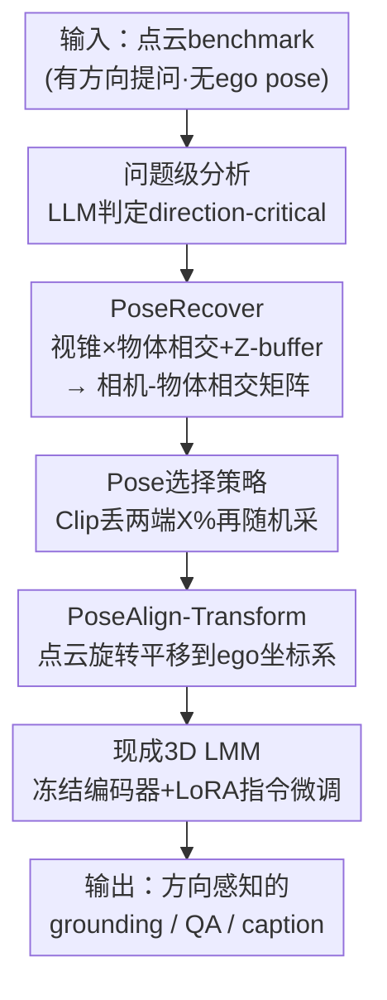

# Direction-aware 3D Large Multimodal Models

**会议**: CVPR 2026  
**论文**: [CVF Open Access](https://openaccess.thecvf.com/content/CVPR2026/html/Liu_Direction-aware_3D_Large_Multimodal_Models_CVPR_2026_paper.html)  
**代码**: https://github.com/liuQuan98/PoseAlign3D  
**领域**: 3D大模型 / 多模态VLM  
**关键词**: 3D LMM, ego pose, 方向感知, 点云对齐, ScanNet

## 一句话总结
针对现有 3D 点云 benchmark「问了左右前后却没给 ego pose」导致方向问题本身无解的痛点，本文用 PoseRecover 从 RGB-D 视频外参里自动找回每个问题对应的相机位姿，再用 PoseAlign 直接把点云旋转平移到该位姿坐标系下喂给现成 3D LMM，只靠指令微调就把 ScanRefer mIoU 相对提升 30%、Scan2Cap 的 LLM-as-judge 准确率提升 11.7%。

## 研究背景与动机
**领域现状**：通用点云 3D 大模型（3D LMM，如 LL3DA、Chat-Scene、3D-LLAVA）想在 3D 场景里同时做 grounding、referring、QA、captioning，是未来具身智能体「视觉认知核心」的关键一步。这类模型要回答「浴室在床的左边还是右边」这种空间方向问题，必须知道「站在谁的视角看」——也就是 ego pose（自我位姿）。

**现有痛点**：主流室内数据集 ScanRefer、Multi3DRefer、ScanQA、Scan2Cap、Nr3D 里充斥着方向性提问（本文统计 40%~95% 的问题是 direction-critical），却**根本没有提供 ego pose**。这是因为它们当初是用「上帝视角的第三人称」众包标注的，标注者站在哪、朝哪看从来没记录下来，事后也再也无法精确恢复。结果就是：同一个「在左边」的提问，模型怎么答都可能对也可能错，问题本身是 ill-posed（无解）的。

**核心矛盾**：方向语义（egocentric「在我左边」/ allocentric「在车左边」）天生需要一个参考坐标系，而室内很多物体（盘子、桌子）没有自己的朝向轴，allocentric 也只能退回到 ego agent。**没有 ego pose，方向语义就没有锚点**，再强的模型也无从学起。

**切入角度**：以往工作（SQA3D、View2Cap、Scene-LLM）的做法是「造新数据集，让模型把 ego pose 当隐变量去推断」。本文认为这是多此一举——具身智能体用 SLAM 采点云时，相机位姿本就是「免费的午餐」，现成就有。与其让模型猜，不如直接把位姿当输入喂进去。

**核心 idea**：重新定义一个范式——**不改模型去推位姿，而是给老 benchmark 补回位姿、并按位姿把点云摆正**。用 PoseRecover 自动找回每个问题该用的相机位姿，用 PoseAlign 把点云对齐到该位姿，让方向问题从「无解」变「可解」。

## 方法详解

### 整体框架
整个方法是一条「离线补位姿 → 在线对齐点云 → 现成 3D LMM 指令微调」的流水线，**不动模型骨架、不动点云编码器，只在数据侧做手脚**。

第一阶段离线跑 PoseRecover：先用一个 LLM（GPT-OSS-20B）把每个数据集里的问题分成「需要方向推理」和「不需要」两类，然后对每个 direction-critical 问题，从 ScanNet-v2 原始 RGB-D 序列的相机外参里，穷举计算「相机视锥 × 该问题相关物体」的相交率，再用 Z-buffer 做可见性校验，把所有相交率存成一张「相机-物体相交矩阵」。第二阶段在线时，按 ground-truth 物体取出对应那一列，用一个挑选策略（Clip）从候选位姿里采一个，作为这条语言查询的 ego 参考系。第三阶段 PoseAlign 把点云直接旋转平移到这个位姿坐标系下，喂给现成 3D LMM，只训练投影层和 LLM 的 LoRA、冻结点云编码器，纯指令微调。

### 关键设计

**1. PoseRecover：用视锥-物体相交从 RGB-D 外参里找回每个问题该用的相机位姿**

这一步直接解决「benchmark 没有 ego pose」的根本病灶。ScanNet-v2 的原始 RGB-D 序列其实带着每一帧的相机内外参，问题只是「这条文本查询到底对应哪一帧的视角」。PoseRecover 的思路是：哪一帧的相机能清楚看到问题里提到的那个物体，那一帧的位姿就最可能是提问者当时的视角。

具体怎么算相交率，按物体标注类型分三种。对分割掩码，把点云每个点用内外参投影到图像平面 $(u_i,v_i,1)^\top=\lfloor K(x'_i,y'_i,z'_i)^\top/z'_i\rfloor$ 形成 Z-buffer，再做深度比较只统计**可见**的点（被前景挡住的不算），相交率定义为落在视锥内的可见物体点占比 $\phi_{seg}=\frac{1}{|M_{obj}|}\sum_{k\in M_{obj}}\mathbb{I}[z'_k<Z^P_{u_k,v_k}+\delta]$。对包围盒，因为盒-视锥的闭式相交难算，改用 Monte-Carlo 在盒内撒点估计落在视锥 $F$ 内的比例 $\phi_{box}$。对只给单点位置的数据集，则用投影点到图像中心的归一化像素距离 $\phi_{point}$（越靠中心相交越大）。这套向量化实现对整个 ScanNet-v2 跑完不到 40 分钟，最终给每个场景存出一张相机-物体相交矩阵，离线一次、在线随用随取。关键在于那个 **Z-buffer 可见性校验**——光是视锥相交还不够，物体可能被墙挡着「看不见但在锥内」，Z-buffer 把这种假相交剔掉，保证找回的位姿是真能看到目标的视角。

**2. Pose 选择策略：用 Clip 丢掉两端极端视角，在「位姿一致」和「数据多样」之间取最优**

PoseRecover 给出的是一**组**候选位姿（相交率非零的都算候选），直接用哪个有讲究。最朴素的 Top 策略选相交率最高那个，但候选里常混着「从正对面拍」的视角——两个候选的偏航角能差到 180°，方向语义直接反掉。本文比较两种策略：Top（取相交率最高）和 Clip（先丢掉相交率最高和最低各 $X\%$ 的候选，再从剩下里随机采）。

Clip 的妙处在于它一石二鸟：丢掉两端把那些 180° 反向的离群视角清掉，提升位姿一致性；同时保留中间段的随机采样，让训练时 ego 视角带点抖动，**天然充当了旋转-平移数据增强**（作者因此关掉了所有常规点云增强）。实验里偏航角差的 KDE 随 $X$ 增大迅速向 0 收缩（一致性变好），但 $X$ 太大又会牺牲多样性。最终 $X=0.3$ 在各数据集上最平衡，被定为默认值。

**3. PoseAlign-Transform：直接把点云摆到 ego 坐标系，而不是把位姿塞进 prompt 或投影层**

有了位姿，怎么把它「告诉」模型？本文比较了三条互斥路径，结论是最笨的那条最好。PoseAlign-Transform 直接对点云做坐标变换 $(P_{aligned}|1)^\top=U T^{-1}(P|1)^\top$，其中 $T=\begin{bmatrix}R&t\\0&1\end{bmatrix}$ 是相机外参，$U$ 把相机的「右-下-前」坐标系转成预训练点云编码器习惯的「前-左-上」坐标系。这一步把整个场景的点摆到 ego 视角下，「左」「右」从此在 egocentric 坐标里有一致表达；而且坐标变换保持所有几何关系不变，**下游模型一行代码都不用改**。

另外两条路径作为对照：PoseAlign-Embed 保持点云不动，把 6-DoF 位姿编码成特征叠到投影层 $f_{aligned}=f+\text{MLP}(\text{encode}(R,t,P_f))$（Chat-Scene 因为依赖预计算嵌入只能用这条）；PoseAlign-Prompt 把位姿序列化成数字 token 拼到文本前面。后两者效果明显更差——数字 token 化带来 tokenization 开销和不一致的位置 grounding。为什么 Transform 这么有效？因为预训练点云编码器对坐标本身就敏感（coordinate-sensitive），你把点云摆正，它不用重训就能「看懂」方向，这也是为什么冻结编码器还能涨这么多分。

### 损失函数 / 训练策略
全程只做指令微调（instruction tuning），不引入额外预训练阶段。Chat-Scene 和 3D-LLAVA 训练 LLM 的 LoRA + 投影层、冻结 3D 编码器；LL3DA 只训 Q-Former。**冻结编码器是刻意为之**：防止模型对「正 x 轴上的物体」形成偏好，保证分割/检测类评测的公平性，也让所有涨分都干净地归因于 PoseAlign 而非编码器偷学了位姿捷径。所有 PoseAlign 变体都关闭了随机旋转/翻转/抖动/缩放等点云增强，因为 Clip 采样的位姿随机性本身已起到增强作用。

## 实验关键数据

数据集基于 ScanNet-v2（1201 训练 / 312 验证场景），覆盖 ScanRefer、Multi3DRefer、ScanQA、SQA3D、Scan2Cap。除传统指标（CiDEr/BLEU-4/METEOR/ROUGE-L、mIoU、A@0.5、F1@0.5）外，引入 **LLM-as-judge 准确率（L-A）**——用 GPT-OSS-20B/GPT-5-mini 判定答案是否在语义上正确，对同义换词更鲁棒。

### 主实验
在 PoseRecover Benchmark 上给四个不同架构的 3D LMM 加 PoseAlign，普遍涨分；3D-LLAVA + PoseAlign-Transform 拿到最高综合性能（mIoU 提升均为相对值）：

| 数据集 | 指标 | 3D-LLAVA | +PoseAlign-T | 提升 |
|--------|------|----------|--------------|------|
| ScanRefer | mIoU | 42.6 | 55.4 | ∆30.0% |
| Multi3DRefer | mIoU | 48.1 | 54.3 | ∆12.9% |
| ScanQA | L-A | 45.7 | 47.3 | ∆3.5% |
| Scan2Cap | L-A | 28.1 | 31.4 | ∆11.7% |

其余骨架同样受益：Chat-Scene+PoseAlign-E 的 ScanRefer A@0.5 46.4→46.9、Scan2Cap L-A 26.6→26.9；LL3DA+PoseAlign-T 的 ScanQA L-A 34.7→35.6。在 referring 分割上，3D-LLAVA 拿到最大的 +12.8% / +6.2% mIoU（ScanRefer / Multi3DRefer），而这一切发生在**点云分割器（3D 编码器）被冻结**的前提下，说明涨分全来自 LLM 生成的 `<SEG>` token 质量变好。

### 消融实验
在 3D-LLAVA 上对比不同位姿注入方式（ScanRef/Multi3DRef 为 mIoU，ScanQA/Scan2Cap 为 L-A）：

| 配置 | ScanRef | Multi3DRef | ScanQA | Scan2Cap | 说明 |
|------|---------|-----------|--------|----------|------|
| Baseline | 42.6 | 48.1 | 45.7 | 28.1 | 不用位姿 |
| Baseline 跑在 PoseAlign-T 数据 | 37.5 | 41.5 | 43.0 | 23.5 | 全面掉点 |
| Random Pose | 39.0 | 44.3 | 44.7 | 25.8 | 随机位姿，低于 baseline |
| PoseAlign-T (Clip X=0.3) | 55.4 | 54.3 | 47.3 | 31.4 | 默认，最平衡 |
| PoseAlign-T (Top) | 68.5 | 60.2 | 47.5 | 29.7 | 分割最高但 QA 略弱 |
| PoseAlign-E (Top) | 43.2 | 49.3 | 43.4 | 23.5 | 投影层嵌入，收益有限 |
| PoseAlign-P (Top) | 44.2 | 49.4 | 44.9 | 28.1 | 文本 prompt，几乎没涨 |

### 关键发现
- **Transform 全面碾压 Embed/Prompt**：把点云摆正（Transform）远胜于把位姿编码成特征（Embed）或拼进文本（Prompt），后两者收益有限甚至不稳定，印证了「利用编码器的坐标敏感性」这条路最对。
- **冻结编码器没偷捷径**：把训练好的 baseline 直接拿到 PoseAlign-T 变换后的数据上测，反而全面掉点（如 ScanRefer 42.6→37.5），说明冻结的分割模型根本没把位姿当捷径用，涨分纯粹来自更好的 `<SEG>` token——归因干净。
- **位姿必须找对**：用 Random Pose 替换 PoseRecover 找回的位姿，性能反而略低于 baseline，证明 PoseRecover「找对视角」这步是涨分前提，不是随便给个位姿就行。
- **Clip 对超参鲁棒**：Clip Ratio $X$ 在 0.0~0.49 间性能都稳定，0.2~0.4 间略有小峰，$X=0.3$ 最优——方法对这个超参不敏感。
- **direction-critical 子集涨得最多**：在 LLM 判定为方向相关的问题子集上，baseline 明显掉点（确认现有模型确实搞不定方向），而 PoseAlign-T 在这些题上提升最大（ScanQA CiDEr ∆4.9%），把方向题和非方向题的差距拉近。

## 亮点与洞察
- **「问题无解」这个观察本身就很犀利**：指出现有 benchmark 大量方向题是 ill-posed，不是模型不行而是题目缺条件——这个 reframe 把「让模型更强」的问题转成了「把题目补完整」，思路更省力也更本质。
- **拒绝把 ego pose 当隐变量去推**：抓住「SLAM 采集时位姿本来就免费有」这一点，直接当输入用，绕开了一大票造新数据集、加推断模块的复杂方案。
- **最笨的坐标变换最有效**：不改架构、不加模块，只把点云旋转平移到 ego 坐标系，利用预训练编码器的坐标敏感性，冻结编码器还能涨 30% mIoU——「在数据侧做对齐」这个 trick 可迁移到任何对坐标系敏感的预训练表征上。
- **Clip 选位姿一招两用**：既清离群反向视角、又当数据增强，省掉了常规点云增强，是个优雅的副作用设计。

## 局限与展望
- **强依赖 ScanNet 这类带 RGB-D 序列和外参的数据**：PoseRecover 的前提是原始采集时留有相机内外参，对纯点云、无视频轨迹的场景无法找回位姿。
- **位姿是「找回的」而非「真值」**：⚠️ PoseRecover 通过视锥-物体相交反推提问视角，本质是启发式匹配，对一个物体能从多个视角看到时，选出的位姿未必是标注者当时真实视角，Clip 的随机性也意味着同一问题不同次采样位姿会变。
- **部分骨架不兼容 Transform**：Chat-Scene 因依赖预计算点云嵌入只能退而用效果较弱的 PoseAlign-Embed；LL3DA 对旋转框兼容差、SONATA 无检测器，导致部分 Scan2Cap 结果缺失。
- **改进方向**：可探索从单张图/稀疏帧也能恢复位姿的更通用 PoseRecover，或把 Clip 的固定丢弃比例换成按问题难度自适应。

## 相关工作与启发
- **vs SQA3D**：SQA3D 用一段文本描述隐式传达 ego 情境让模型推理，但带来文本歧义、且真实场景里未必有这种位姿描述；本文直接补回数值位姿并摆正点云，无歧义且贴合具身工作流。
- **vs View2Cap**：View2Cap 的 Situation Grounding 模块吃视锥裁剪的局部点云去**回归**相机位姿，但「回归位姿」离「带方向感知的文本推理」还很远，效果受限；本文不回归、直接用现成位姿对齐，绕开回归误差。
- **vs Scene-LLM**：Scene-LLM 用「先 egocentric 视锥点云、再 scene 级点云」的两步推理增强自我中心感知，但流程繁琐且用了闭源代码数据，且仍是另造新 benchmark；本文方法简单通用，且直接修复**现有** benchmark 而非另起炉灶。

## 评分
- 新颖性: ⭐⭐⭐⭐⭐ 把「方向题无解」reframe 成「补 ego pose」范式，并指出推位姿是多余的，视角独到
- 实验充分度: ⭐⭐⭐⭐ 4 个骨架 × 5 数据集全面验证，三种注入方式 + Clip 超参消融扎实，但缺少跨数据集（非 ScanNet）泛化验证
- 写作质量: ⭐⭐⭐⭐ 动机推导清晰、公式完整、消融归因干净，三个注入方式的对比讲得透
- 价值: ⭐⭐⭐⭐⭐ 即插即用、只需指令微调、对任意 3D LMM 通用，为方向感知 3D LMM 立了强 baseline

<!-- RELATED:START -->

## 相关论文

- [\[CVPR 2026\] MASQuant: Modality-Aware Smoothing Quantization for Multimodal Large Language Models](masquant_modality-aware_smoothing_quantization_for_multimodal_large_language_mod.md)
- [\[CVPR 2026\] Grounded 3D-Aware Spatial Vision-Language Modeling](grounded_3d-aware_spatial_vision-language_modeling.md)
- [\[CVPR 2026\] CoVFT: Context-aware Visual Fine-tuning for Multimodal Large Language Models](covft_context-aware_visual_fine-tuning_for_multimodal_large_language_models.md)
- [\[CVPR 2026\] Taxonomy-Aware Representation Alignment for Hierarchical Visual Recognition with Large Multimodal Models](taxonomy-aware_representation_alignment_for_hierarchical_visual_recognition_with.md)
- [\[CVPR 2026\] Uncertainty-Aware Knowledge Distillation for Multimodal Large Language Models](uncertainty-aware_knowledge_distillation_for_multimodal_large_language_models.md)

<!-- RELATED:END -->
