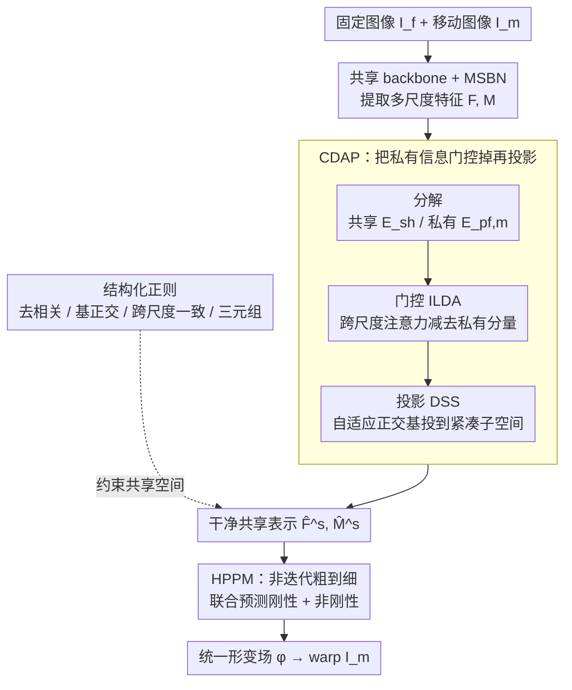

# Disentangle-then-Align: Non-Iterative Hybrid Multimodal Image Registration via Cross-Scale Feature Disentanglement

**会议**: CVPR 2026  
**arXiv**: [2603.19623](https://arxiv.org/abs/2603.19623)  
**代码**: [GitHub](https://github.com/Chunlei0913/HRNet)  
**领域**: Multimodal VLM / 多模态图像配准  
**关键词**: 多模态配准, 混合变换, 特征解纠缠, 跨尺度一致性, Mamba

## 一句话总结
提出 HRNet，通过跨尺度特征解纠缠和自适应投影（CDAP）学习干净的共享表示，并在统一的粗到细管线中非迭代地联合预测刚性和非刚性变换，在四个多模态数据集上达到SOTA。

## 研究背景与动机

**领域现状**: 多模态图像配准（如RGB-热红外、RGB-SAR）是跨模态融合的基础。现有深度学习方法多采用多尺度策略提升精度，但通常限于单一变换类型。

**现有痛点**: (a) 大多数多尺度框架仅支持刚性或非刚性中的一种——刚性无法处理局部形变，非刚性在大全局偏移下扭曲结构完整性；(b) 现有混合配准方法采用串行级联（先刚性后非刚性），刚性和非刚性在不同特征空间估计，难以协调且后级继承前级偏差；(c) 共享特征提取方法虽缓解模态差异，但约束主要作用于共享部分，模态私有信息仍会泄漏到共享空间。

**核心矛盾**: 如何在统一的特征空间中同时估计全局刚性对齐和局部非刚性形变，且不受私有模态信息干扰？

**本文目标**: 设计一个统一框架，同时解决：(a) 共享特征空间的模态私有泄漏问题；(b) 刚性和非刚性变换的协调估计问题。

**切入角度**: "解纠缠-再对齐"——先用CDAP学习干净的多尺度共享表示，再在HPPM中联合预测混合变换。

**核心idea**: 表示解纠缠（跨尺度门控+自适应投影）+ 混合参数预测（统一粗到细管线内刚性+非刚性）= 单次前向传播产出统一形变场。

## 方法详解

### 整体框架

多模态配准（RGB-热红外、RGB-SAR 等）难在两点：模态私有信息会污染共享特征，且全局刚性对齐和局部非刚性形变得在不同空间分头估计、互相打架。HRNet 的思路是「先解纠缠、再对齐」：输入固定图像 $I_f$ 和移动图像 $I_m$，先用共享 backbone + MSBN 提取多尺度特征 $F, M$，再经 CDAP 模块把私有信息从共享特征里剥掉、得到干净的共享表示 $(\hat{F}^s, \hat{M}^s)$，最后由 HPPM 在一条粗到细的管线里一次性联合预测刚性 + 非刚性的混合变换 $\phi$，用它 warp $I_m$。整个过程单次前向，不做迭代级联。其间结构化正则从四个维度约束 CDAP 产出的共享空间，让解纠缠真正成立。

### 关键设计

**1. CDAP：把私有信息从共享空间里门控掉，再投到自适应子空间**

共享特征提取虽能缓解模态差异，但约束只作用在共享部分，模态私有信息仍会泄漏进来污染对齐。CDAP 用「分解 - 门控 - 投影」三步堵住这个泄漏。分解阶段每个尺度用共享提取器 $E_{sh}^i$ 取模态无关分量、用模态特定提取器 $E_{pf/m}^i$ 取私有分量。门控阶段（ILDA）借相邻尺度的语义做跨尺度注意力，显式把私有分量减出去：$\widetilde{F}_i^s = \alpha_i^s \odot F_i^s - \gamma^i \alpha_i^p \odot F_i^p$，其中权重 $\alpha_i^s, \alpha_i^p$ 由 cross-scale attention 算出——光分解挡不住泄漏，必须有门控主动抑制。投影阶段（DSS）再数据自适应地生成一组近似正交基 $W_i^s = Gen^i(z_i^s)$，把门控后的特征投上去 $\hat{F}_i^s = \widetilde{F}_i^s W_i^{s\top}$，比固定投影更灵活、得到的共享空间更紧凑。

**2. HPPM：在同一特征空间里非迭代联合预测刚性 + 非刚性**

串行级联的混合配准（先刚性后非刚性）在不同特征空间分头估计，后级会继承前级的偏差，难协调。HPPM 把刚性和非刚性放进同一条 5 尺度粗到细管线联合估计。最粗尺度用 HRB 经 GAP + FC 估全局刚性参数 $H$，直接编码成粗形变场；之后每个尺度先上采样前级变换 $\phi_{i-1}$ 去 warp 当前移动特征，拼接后再用 HRB 估增量 $\phi_i' = \text{conv}(f_i)$，累积更新 $\phi_i = \text{upsample}(\phi_{i-1}) + \phi_i'$。这样刚性预测一旦得到就立刻变成 flow、在后续尺度里被渐进精化，而不是事后再拼。HRB 内部用 2 个 RSSB（Residual State Space Block，基于 Mamba）建模长程依赖，在低算力开销下捕捉配准最需要的全局结构关系。

**3. 结构化正则：从四个维度约束共享空间的质量**

解纠缠和对齐光靠网络结构还不够稳，HRNet 再加四个互补正则来塑形共享空间。交叉协方差去相关 $L_{ccd} = \|\text{Cov}(\hat{F}_i^s, F_i^p)\|_F^2$ 压低共享与私有的耦合；基正交性 $L_{bo} = \|W^{(i)}W^{(i)\top} - I\|_F^2$ 防止 DSS 子空间退化；跨尺度方向一致性 $L_{cs} = 1 - \cos(\hat{F}_i^s, \hat{F}_{i+1}^s)$ 让相邻尺度的共享语义不打架；三元组损失 $L_{tri}$ 把跨模态同位置的共享特征拉近、推远私有干扰。四者分别管解耦、非冗余、一致性和对齐，合起来才让前面两步的解纠缠真正成立。

### 损失函数 / 训练策略
- 总损失: $L = \alpha_r L_r + \alpha_n L_n + \alpha_s L_s + \alpha_{tri} L_{tri} + \alpha_{cs} L_{cs} + \alpha_{ccd} L_{ccd} + \alpha_{bo} L_{bo}$
- **三阶段课程训练**: warmup(10%)→mid(50%)→late(40%)，渐进调整损失权重（如 $\alpha_n$: 6→10→12，后期加重非刚性）
- Adam优化器，lr=1e-4，batch=8，100 epochs，图像resize到256×256

## 实验关键数据

### 主实验（刚性配准）

| 方法 | RGB-NIR RE↓ | RGB-TIR RE↓ | RGB-IR RE↓ | RGB-SAR RE↓ |
|------|-------------|-------------|------------|-------------|
| IHN | 3.887 | 3.006 | 5.684 | 7.087 |
| MMRNet | 3.179 | 2.472 | 4.406 | 7.075 |
| **HRNet (Ours)** | **0.785** | **0.744** | **0.578** | **3.161** |

RE降低：75.3%, 69.9%, 86.9%, 55.3%（相对MMRNet，平均~72%）

### 主实验（非刚性配准）

| 方法 | RGB-NIR RE↓ | RGB-TIR RE↓ | RGB-IR RE↓ | RGB-SAR RE↓ |
|------|-------------|-------------|------------|-------------|
| ADRNet (混合) | - | - | - | - |
| MMRNet | - | - | - | - |
| **HRNet (Ours)** | **最优** | **最优** | **最优** | **最优** |

RE相对ADRNet降低：61.2%, 62.5%, 66.9%, 23.3%

### 消融实验

| 配置 | 关键效果 | 说明 |
|------|----------|------|
| w/o CDAP | 共享特征含私有噪声 | 配准精度下降 |
| w/o ILDA门控 | 私有信息泄漏 | 解纠缠不充分 |
| w/o DSS投影 | 跨模态对齐不稳定 | 特征空间不紧凑 |
| 仅刚性 | 无法处理局部形变 | 结构完整性差 |
| 仅非刚性 | 大偏移下扭曲 | 全局对齐不足 |
| **完整HRNet** | **刚性+非刚性统一** | **全面最优** |

### 关键发现
- **混合配准的巨大优势**: 在RGB-IR上RE从4.406→0.578（86.9%↓），证明联合估计远优于单一范式
- RGB-SAR最具挑战性（模态差异最大），但HRNet仍显著领先
- 三阶段课程训练中渐进增加非刚性权重（$\alpha_n$: 6→12）很关键

## 亮点与洞察
- **统一混合框架**: 首次在单一管线中非迭代联合估计刚性+非刚性变换，产出单一统一形变场
- **解纠缠全面**: CDAP的decompose-gate-project管线 + 4种结构化正则，从根本上解决私有信息泄漏
- **Mamba在配准中的应用**: RSSB提供低开销长程依赖建模，适合配准中的全局结构感知

## 局限与展望
- 当前在256×256分辨率验证，更高分辨率下的效率和性能待测试
- 课程训练的超参数调优可能需要根据不同模态对调整
- 对极端遮挡或完全无重叠区域的鲁棒性未讨论

## 相关工作与启发
- 与ADRNet（串行混合）区别：ADRNet分阶段估计，后级继承前级偏差；HRNet在统一空间联合估计
- 与Shi等（特征解纠缠）区别：现有方法仅约束共享部分，HRNet通过ILDA门控和正则显式抑制私有泄漏
- 启发：跨尺度特征交互（邻近尺度门控）是一个值得在其他多尺度任务中探索的通用思路

## 评分
- 新颖性: ⭐⭐⭐⭐ 统一混合配准和CDAP解纠缠设计有价值，Mamba的引入也有新意
- 实验充分度: ⭐⭐⭐⭐⭐ 四个多模态数据集，刚性+非刚性，详细消融和课程训练分析
- 写作质量: ⭐⭐⭐⭐ 结构清晰，公式推导完整，但符号密度较高
- 价值: ⭐⭐⭐⭐ 为多模态配准提供了通用模板，但应用场景相对垂直

<!-- RELATED:START -->

## 相关论文

- [\[CVPR 2026\] Multi-Modal Image Fusion via Intervention-Stable Feature Learning](multi-modal_image_fusion_via_intervention-stable_feature_learning.md)
- [\[CVPR 2026\] CoV-Align: Efficient Fine-grained Cross-Modal Alignment with Cohesive Visual Semantics Priority](cov-align_efficient_fine-grained_cross-modal_alignment_with_cohesive_visual_sema.md)
- [\[CVPR 2026\] Enhance-then-Balance Modality Collaboration for Robust Multimodal Sentiment Analysis](enhance-then-balance_modality_collaboration_for_robust_multimodal_sentiment_anal.md)
- [\[AAAI 2026\] To Align or Not to Align: Strategic Multimodal Representation Alignment for Optimal Performance](../../AAAI2026/multimodal_vlm/to_align_or_not_to_align_strategic_multimodal_representation_alignment_for_optim.md)
- [\[CVPR 2026\] EBMC: Enhance-then-Balance Modality Collaboration for Robust Multimodal Sentiment Analysis](ebmc_multimodal_sentiment_analysis.md)

<!-- RELATED:END -->
