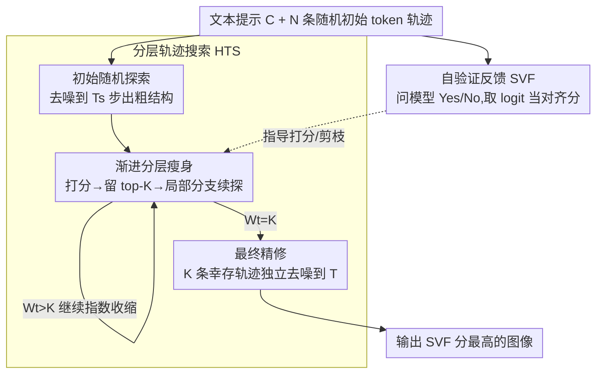

# dMLLM-TTS: Self-Verified and Efficient Test-Time Scaling for Diffusion Multi-Modal Large Language Models

**会议**: CVPR 2026  
**论文**: [CVF Open Access](https://openaccess.thecvf.com/content/CVPR2026/html/Xin_dMLLM-TTS_Self-Verified_and_Efficient_Test-Time_Scaling_for_Diffusion_Multi-Modal_Large_CVPR_2026_paper.html)  
**代码**: https://github.com/Alpha-VLLM/Lumina-DiMOO  
**领域**: 多模态VLM / 扩散模型  
**关键词**: 测试时缩放, 扩散多模态大模型, 自验证, 文生图, 轨迹搜索  

## 一句话总结
针对统一生成-理解的扩散多模态大模型（dMLLM），用模型自身的图文理解能力当"裁判"（自验证反馈）来给候选图像打分，再配一个由粗到细的分层轨迹搜索，把传统线性搜索 $O(NT)$ 的测试时缩放降到近线性 $O(N+T)$，在 GenEval 上把三个 dMLLM 的生成质量显著拉高、并比线性搜索快 5–6 倍。

## 研究背景与动机

**领域现状**：文生图（T2I）的质量长期靠"训练时缩放"——堆模型参数、堆数据、堆算力。但这条路边际收益递减，高质量数据也越来越稀缺。于是研究转向**测试时缩放（Test-Time Scaling, TTS）**：在推理阶段多花算力，让一个已训练好的生成模型产出更好的图。与此同时，**扩散多模态大模型（dMLLMs，如 Lumina-DiMOO、MMaDA、Muddit）** 崛起，它们用离散扩散把"图像生成"和"图像理解"统一进一套架构，天然支持迭代式并行去噪。

**现有痛点**：把扩散模型那套 TTS 直接搬到 dMLLM 上有两个硬伤。其一，**得外挂一个 VLM 当验证器**（CLIP、VILA-Judge、GPT-4o）来给 N 个候选打分做 best-of-N 选择——这要么额外部署一个大模型、要么调商业 API，还得反复 decode（token→图）+ encode（图→embedding），开销很大。其二，**搜索是"线性"的**：在"轨迹数 N"和"每条轨迹精修步数 T"两个维度上均匀撒算力，复杂度 $O(NT)$，对每一条轨迹一视同仁地从头跑到尾。

**核心矛盾**：dMLLM 的生成本质是"由粗到细"——早期高噪声阶段先定全局结构（图像模糊），后期才精修细节。线性搜索却在早期就给那些"一看就跑偏了"的轨迹继续投入同等算力，纯属浪费；而真正有希望的轨迹得不到额外倾斜。算力分配和生成的层次结构不匹配。

**本文目标**：把 TTS 的三件事——缩放策略、验证机制、搜索算法——整合进一次推理里，同时回答两个问题：(1) dMLLM 能不能验证自己生成的图，从而甩掉外部验证器？(2) 能不能设计一个**自适应**地把算力倾斜给高潜力轨迹的搜索算法？

**核心 idea**：用 dMLLM **自带的理解能力**当验证器（self-verified），把生成质量评估变成一道"这张图是不是描述了该提示词？回答 Yes/No"的问答题，取"Yes"的 logit 当对齐分；再用这个分数指导一个**由粗到细、逐步剪枝**的分层搜索，把算力从"早期广撒"动态收缩到"后期精修少数赢家"，复杂度降到 $O(N+T)$。一句话点睛：**"算力扩展搜索空间，反思找到路径。"**

## 方法详解

### 整体框架
dMLLM-TTS 不改训练、只在推理时加算力。作者先把 dMLLM 的测试时缩放形式化为一个三元组 $\text{TTS}=\langle G_\theta, V, f\rangle$：生成器 $G_\theta$ 负责并行去噪产图，验证器 $V:\mathcal{Z}\times\mathcal{C}\to\mathbb{R}$ 衡量"生成图—文本提示"的语义对齐度，搜索函数 $f$ 在 $V$ 的指导下重新分配推理算力。整套缩放沿两条互补的轴展开：**轨迹探索缩放**（多采 N 条初始轨迹，拓宽假设空间）和**迭代精修缩放**（每条轨迹多走 T 步去噪，提升稳定性与细节）。

本文的两个核心组件填进这个骨架：验证器 $V$ 用**自验证反馈（SVF）** 实现，搜索 $f$ 用**分层轨迹搜索（HTS）** 实现。HTS 自上而下分三个平滑过渡的阶段——初始随机探索 → 渐进分层瘦身 → 最终精修——SVF 在中段持续给候选打分、决定谁被剪枝、谁被保留分支、以及最后选哪一张输出。

### 关键设计

**1. 双轴缩放的统一视角：把 dMLLM 的 TTS 形式化为生成器+验证器+搜索三元组**

以往 TTS 工作要么只谈"多采几条轨迹"，要么只谈"多走几步去噪"，缺一个能把验证和搜索也纳进来的统一框架。本文先把 dMLLM 的生成机制拆清楚：从一个全 [Mask] 的序列 $Z_0$ 出发，经 $T$ 步离散去噪，每步对所有掩码位置预测 token、保留高置信度的、把低置信度的重新掩码送入下一步，直到填满（Eq. 1–3）。在此之上，测试时缩放被看成"轨迹探索 × 迭代精修"的二维过程：轨迹探索是采 N 个不同的随机初始态 $Z_1^{(i)}\sim p_{\text{init}}$ 来拓宽假设空间，迭代精修是 $Z_{t+1}=G_\theta(Z_t, C, t)$ 多走几步来提质。作者把整个测试时缩放归约为一个自适应轨迹搜索问题 $\text{TTS}=\langle G_\theta, V, f\rangle$，明确了"验证器打分、搜索函数据此重分配算力"的接口——后面的 SVF 和 HTS 正是这两个接口的具体实现。这个形式化的价值在于：它说明 TTS 的关键不在"无脑加算力"，而在"把算力自适应地倒给最有希望的轨迹"。

**2. 自验证反馈 SVF：让模型用自己的理解能力给自己的图打分，干掉外部验证器**

外部验证器的两个毛病（额外部署/API + 反复 decode-encode 的开销）根源在于"生成"和"打分"被拆给了两个模型。但 dMLLM 本身就同时会生成和理解，那它就是最理想的验证器 $V$。SVF 把质量评估包装成一道二分类问答：给定提示 $C$ 和中间生成的图像 token 序列 $Z_t$，用固定模板提问"`<Generated Image> Is this image shows {text prompt}? Please answer "Yes" or "No" directly without explanation.`"，然后**不真去采样答案，而是直接取"Yes"这个 token 的 logit 概率**当作图文对齐分：

$$\Phi_{\text{SVF}} = \text{logit}_{\text{yes}}\!\big(G_\theta(Z_t, C)\big).$$

这一步只需一次前向就能给出一个标量分，且全程在 token 空间里完成、不用把 token 解码成图再编码进外部 VLM，所以"in-loop"、便宜。这个分数同时承担两个职责：在搜索中段决定剪掉哪些轨迹，在最后从幸存候选里挑出对齐最好的那张。需要诚实指出的是，SVF 受限于当前 dMLLM 的视觉理解水平——后面实验里它确实打不过 GPT-4o（见消融），但它换来了"零外部依赖 + 高效率"。

**3. 分层轨迹搜索 HTS：由粗到细三阶段，把 $O(NT)$ 降到 $O(N+T)$**

线性搜索 LTS 给所有轨迹平均分配算力、复杂度 $O(NT)$，但 dMLLM 早期高噪声阶段的图本来就模糊、此时 SVF 打分意义不大，对那些早早跑偏的轨迹继续投入纯属浪费。HTS 据此设计成三个平滑演化的阶段（Eq. 8，由转换步 $T_s$、$T_r$ 划分）：

*初始随机探索（$t\le T_s$）*：采 N 条随机轨迹各去噪 $T_s$ 步出粗结构（Eq. 9–10）。此阶段高噪声、SVF 不可靠，所以**不打分**，专注铺开多样的结构假设。$T_s$ 取得很小（$T_s\ll T$，经验设为 $T/4$），只覆盖扩散过程的前一小段。

*渐进分层瘦身（$T_s<t\le T_r$）*：定义一个指数衰减的轨迹宽度调度
$$W_t = \max\big(\lfloor N\,d^{-(t-T_s)}\rfloor,\; K\big),\quad d>1,$$
让活跃轨迹数随步数指数收缩到最小保留集 $K$。每一步做三件事：① **打分**——对当前池里每条轨迹算 $\Phi_{\text{SVF}}$；② **选择**——留下分数最高的 top-$K$ 形成幸存集 $B_t$；③ **分支**——每个幸存者 $Z_t^{(j)}$ 从局部核 $q$ 采 $b_t=\lfloor W_{t+1}/K\rfloor$ 条随机续支 $Z_{t+1}^{(j,k)}\sim q(Z\mid Z_t^{(j)})$（Eq. 11–12），在高潜力轨迹的邻域做局部探索。随着 $t$ 增大，$W_t$ 和 $b_t$ 一起几何递减，算力被持续聚焦到高分轨迹上。当 $W_t=K$（即 $b_t=1$）时分支停止，进入精修。

*最终精修（$T_r<t\le T$）*：把 K 条幸存轨迹各自独立去噪到最后一步 $T$（Eq. 13），所有算力都砸在打磨细节上。

复杂度上，HTS 的总前向开销为
$$C_{\text{HTS}} = O\!\Big(N T_s + \tfrac{N-dK}{d-1} + K(T-T_r)\Big),$$
三项分别对应早期 N 条轨迹各走 $T_s$ 步、几何衰减瘦身、K 条幸存者精修（Eq. 14）。由于 $T_s\ll T$、$K\ll N$，化简后近似 $O(N+T)$（Eq. 15），相比 LTS 的 $O(NT)$ 是从"乘"变"加"。直觉就是：早期宽探索用很短的步数、晚期深精修只留少数轨迹，避免了在没希望的路径上烧算力。

### 损失函数 / 训练策略
本方法是**纯推理期方法，不涉及任何训练或微调**，直接作用于已开源的预训练 dMLLM。主要超参：N:K 比例固定为 4:1；$T_s$ 经验设为 $T/4$，$T_r$ 由 N、K 决定；图像 512 分辨率、CFG=4.0；验证只走一步前向出 Yes/No；基线用 8 步采样。

## 实验关键数据

### 主实验
在 GenEval（553 条组合式提示，6 个维度）上，对三个 1B–8B 的 dMLLM 应用 dMLLM-TTS，HTS（自验证）相对各自基线（T=8, N=1）的总分提升：

| 模型 | 基线 Overall | TTS 后 Overall(T=32,N=32,HTS) | 提升 | 对比 SOTA |
|------|------|------|------|------|
| Lumina-DiMOO | 0.78 | **0.92** | +17.9% | 超过 Qwen-Image 0.87、GPT-4o 0.84 |
| MMaDA | 0.51 | **0.66** | +29.4% | — |
| Muddit | 0.53 | **0.67** | +26.4% | — |

按维度看（以 Lumina-DiMOO，T=32/N=32，HTS vs LTS）：困难维度涨得最多——Counting +30.0%、Position +18.9%、Attribute +27.4%，简单维度（Single Obj. +4.2%）因基线已强而涨幅有限，说明 TTS 主要在抬"组合生成"的能力天花板。同设置下 HTS 几乎在每个维度都不低于 LTS（如 Lumina-DiMOO Two Obj. HTS 0.94 vs LTS 0.93、Overall 0.89 vs 0.87 @ T16N16）。

### HTS vs LTS 效率与消融

| 对比项 | 结果 | 说明 |
|------|------|------|
| HTS vs LTS 效率（Lumina-DiMOO） | **5× 更快** | 达到等同分数所需推理算力 |
| HTS vs LTS 效率（MMaDA / Muddit） | **6× 更快** | 同上 |
| HTS vs LTS 上限 | HTS 收敛分更高 | 不只更快，最终质量也更优 |
| 轨迹探索缩放（N=1→32, T=32） | MMaDA +20.2% / Muddit +16.8% / Lumina +8.8% | 提升与初始分负相关，弱模型获益更大 |
| 迭代精修缩放（T=8→64） | 单调提升，512 分辨率下 64 步性价比最佳 | 但不能无限加，最优步数取决于提示复杂度 |

验证器对比（GenEval Overall，Table 2）：

| 验证器 | Lumina-DiMOO | MMaDA | Muddit |
|------|------|------|------|
| SVF（本文） | 0.92 | 0.66 | 0.67 |
| VILA-Judge | 0.90 ↓ | 0.70 ↑ | 0.70 ↑ |
| GPT-4o | 0.95 ↑ | 0.71 ↑ | 0.74 ↑ |

### 关键发现
- **HTS 的价值是"又快又好"**：5–6 倍提速的同时收敛到比线性搜索更高的分，证明"自适应倒算力"比"均匀撒算力"更对路。
- **TTS 是"扶弱"利器**：提升幅度与模型初始分负相关，弱基线（MMaDA/Muddit）涨得最猛，且收益集中在 Counting/Position/Attribute 等组合难题上。
- **SVF 不是最强但够用**：用 GPT-4o 当验证器分数最高（Lumina 0.95、Muddit 0.74），说明 SVF 的瓶颈在 dMLLM 自身的视觉理解还不够强；但 SVF 换来了零外部依赖和高效率，且在 Lumina-DiMOO 上已胜过同为外部模型的 VILA-Judge（0.92 vs 0.90）。⚠️ VILA-Judge 在另两个模型上反而略高于 SVF，说明 SVF 的优劣随基础模型的理解力而变。
- **精修步数有上限**：T 从 8→64 单调提升，但继续加收益递减，最优步数随提示复杂度变化。

## 亮点与洞察
- **"模型即验证器"**：dMLLM 统一了生成与理解，本文把这点用到极致——验证不再外挂，而是把"打分"重写成模型自己会做的一道 Yes/No 问答，且直接取 logit 而非真采样答案，一次前向出分。这是统一架构带来的、对纯扩散模型学不来的红利。
- **把"由粗到细"的生成结构变成"由宽到窄"的搜索结构**：HTS 的三阶段与扩散去噪的早结构-晚细节天然对齐，早期不打分（因为图还糊）、中段指数瘦身、晚期集中精修，复杂度从乘性 $O(NT)$ 变加性 $O(N+T)$。这种"让搜索调度匹配生成层次"的思路可迁移到其他迭代式生成（如离散扩散文本、视频生成）的推理加速。
- **可复用 trick**：用一个二分类 token 的 logit 概率当连续打分器，避免显式采样，既省算力又给出可排序的标量——这套"logit-as-score"在任何会"生成+判别"的统一模型里都能用来做 in-loop self-reward。

## 局限与展望
- 作者承认：**SVF 受限于 dMLLM 当前的视觉理解能力**，整体打不过 GPT-4o，说明 dMLLM 的图像理解还有较大改进空间——验证器越准、搜索倒算力越准，提升空间直接被理解力卡住。
- 自己发现的局限：① 只在 GenEval（组合式 T2I，object-centric）上验证，对更开放的美学/写实类提示是否同样有效未知；② 受可获取的开源 dMLLM 限制，只测了三个模型（Lavida-O 等因不开源无法测），泛化结论的样本偏小；③ 多个超参（N:K=4:1、$T_s=T/4$、衰减系数 $d$）靠经验设定，缺乏对它们如何随提示复杂度自适应的系统分析。⚠️ 衰减系数 $d$ 的具体取值原文未明确给出，以原文为准。
- 改进思路：把 SVF 升级为多步推理式自验证（先让模型描述图、再判一致性）以逼近 GPT-4o；让 $T_s/T_r/d$ 随 SVF 分的方差自适应（早期分散度大就多探索）；把同一套 HTS 用到 dMLLM 的图像编辑、视频或图文交错生成上。

## 相关工作与启发
- **vs 扩散/自回归模型的 TTS（VILA-Judge、GPT-4o 验证 + 线性 best-of-N）**：他们靠外部 VLM 打分、线性搜索 $O(NT)$；本文用模型自验证 + 分层搜索 $O(N+T)$，省掉外部模型且更快，代价是验证精度受限于自身理解力。这是"统一架构"专属的优化路径。
- **vs 线性轨迹搜索 LTS 基线**：LTS 对所有轨迹一视同仁、不利用中间反馈；HTS 用 SVF 的中段反馈做剪枝+分支，把算力自适应倒给高潜力轨迹，实测 5–6× 提速且收敛更高。
- **启发**：dMLLM 这类"生成-理解一体"的模型，其测试时缩放的关键变量是"自验证质量"，而非单纯算力——这提示后续工作应优先补强统一模型的判别/理解侧，而不是一味堆采样预算。

## 评分
- 新颖性: ⭐⭐⭐⭐⭐ 首个面向 dMLLM 的 TTS 框架，"模型自验证 + 分层搜索把 $O(NT)$ 降到 $O(N+T)$"的组合干净有力。
- 实验充分度: ⭐⭐⭐⭐ 三模型、六维度、验证器/双轴缩放消融齐全，但只在 GenEval 单一 benchmark、且开源 dMLLM 样本偏少。
- 写作质量: ⭐⭐⭐⭐⭐ 形式化清晰，三阶段 + 复杂度推导讲得明白，图文对照到位。
- 价值: ⭐⭐⭐⭐⭐ 免训练即把 dMLLM 拉到甚至超过 SOTA T2I 模型，且提速显著，实用性强。

<!-- RELATED:START -->

## 相关论文

- [\[CVPR 2026\] Scaling Test-Time Robustness of Vision-Language Models via Self-Critical Inference Framework](scaling_test-time_robustness_of_vision-language_models_via_self-critical_inferen.md)
- [\[CVPR 2026\] Evolving Contextual Safety in Multi-Modal Large Language Models via Inference-Time Self-Reflective Memory](evolving_contextual_safety_in_multi-modal_large_language_models_via_inference-ti.md)
- [\[CVPR 2026\] Decoupling Stability and Plasticity for Multi-Modal Test-Time Adaptation](decoupling_stability_and_plasticity_for_multi-modal_test-time_adaptation.md)
- [\[CVPR 2026\] Multi-modal Test-time Adaptation via Adaptive Probabilistic Gaussian Calibration](multi-modal_test-time_adaptation_via_adaptive_probabilistic_gaussian_calibration.md)
- [\[CVPR 2026\] UniT: Unified Multimodal Chain-of-Thought Test-time Scaling](unit_unified_multimodal_chain-of-thought_test-time_scaling.md)

<!-- RELATED:END -->
