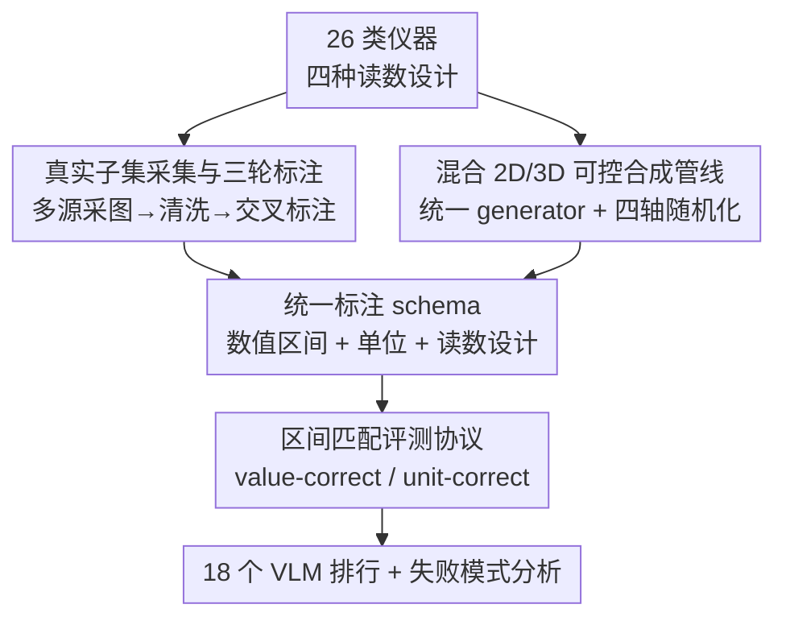

# Do Vision-Language Models Measure Up? Benchmarking Visual Measurement Reading with MeasureBench

**会议**: CVPR 2026  
**论文**: [CVF Open Access](https://openaccess.thecvf.com/content/CVPR2026/html/Lin_Do_Vision-Language_Models_Measure_Up_Benchmarking_Visual_Measurement_Reading_with_CVPR_2026_paper.html)  
**代码**: https://flageval-baai.github.io/MeasureBenchPage/ （项目页，含数据与合成管线）  
**领域**: 多模态VLM  
**关键词**: 仪表读数, 细粒度感知, VLM评测基准, 数据合成, 强化微调

## 一句话总结
MeasureBench 用 2,442 张真实+合成的测量仪器图像构建了一个"读数"基准，发现连最强的前沿 VLM 整体准确率也只有 30% 左右——它们能认出单位和仪器类型（>90%），却读不准指针/刻度对应的数值，暴露了 VLM 在细粒度空间定位上的根本短板。

## 研究背景与动机
**领域现状**：VLM 在 MMMU、HLE 这类大学级别甚至"人类知识前沿"的高层推理任务上已经逼近甚至超过人类平均水平，给人一种"多模态理解已经很强"的印象。

**现有痛点**：但这些评测大多考察高层语义推理，对**低层细粒度感知**（精确几何、刻度定位、微小差异）的考查很弱。现有的细粒度评测要么集中在文字识别/图表推理，要么是 BlindTest、SalBench 这类人为构造的抽象视觉测试，**很少要求把物理刻度映射成一个具体数值**。而读仪表（压力表、温度计、游标卡尺、时钟）恰恰是人类几乎不费力、对工业安全和具身智能却至关重要的能力。

**核心矛盾**：读数任务把三件事耦合在一起——细粒度视觉感知（定位指针/刻度）、轻量定量推理（算刻度间隔、小数位）、基础算术。VLM 的瓶颈不在"算"，而在"看准"。已有的零散研究只覆盖了单一仪器类型（仅时钟、仅尺子、仅工业表），缺一个跨类型、可扩展、带精确标注的统一基准。

**本文目标**：① 造一个覆盖广泛仪器类型和读数设计的基准；② 提供一条可控、可扩展、能产出精确标注的合成管线（既能评测也能造训练数据）；③ 系统评估当代 VLM 并剖析其失败模式。

**核心 idea**：把"测量读数"作为一面照妖镜——用统一的**区间匹配评测协议** + **混合 2D/3D 合成管线**，把 VLM"认得出数字 vs. 量得准世界"之间的鸿沟量化出来。

## 方法详解

### 整体框架
MeasureBench 不是一个模型而是一个**基准 + 数据引擎**，由两大组件构成：(i) 一批带标准化标注的仪器图像（真实 1,272 张 + 合成 1,170 张，共 2,442 个图像–问题对），(ii) 一套可持续产出训练/评测数据的合成框架。所有仪器按**视觉外观**归为四类读数设计：**Dial**（带指针的模拟表，如电流表、时钟）、**Digital**（电子/机械数字显示，如血氧仪）、**Linear**（无指针的线性刻度，如直尺、游标卡尺）、**Composite**（多种读数设计组合，如带表盘的卡尺、复杂水表）。每张图配一个读数问题，评测时不要求数值完全相等，而是落入标注区间即算对。

整条数据构建管线如下：真实子集走"多源采集 → 清洗 → 三轮交叉标注"，合成子集走"统一 generator 接口 → 四轴随机化 → 2D/3D 双后端渲染"，两路汇成统一的标注 schema（数值区间 + 单位 + 读数设计），最后用区间匹配协议对 18 个 VLM 打分。

### 关键设计

**1. 四类读数设计分类 + 区间匹配评测协议：让"读得准"有一个可判定、容错的标准**

读模拟仪表本身就有不可避免的测量误差（指针在两个刻度之间），如果强求数值严格相等，评测会变得既苛刻又不稳定。MeasureBench 因此把"正确"拆成两个可独立判定的维度：每个样本带一个或多个 ground-truth 候选，每个候选含一个**闭区间** $I=[l,r]$ 用于数值判分，外加一组可接受的单位子串。评测脚本先做**答案抽取**——从模型自由文本里解析 `Answer:` 标记或 `\boxed{}` 内的内容，数值支持整数/小数/科学计数/分数（$a/b\to$ float，多个标量取最右），时间取首个 `hh:mm[:ss]` 并换算成秒。然后做**答案匹配**：解析出的数值落入任一候选区间即 *value-correct*，单位字符串命中即 *unit-correct*，二者同时满足（且来自同一候选）才算 *fully-correct*。把 value 和 unit 拆开统计是这套协议最关键的设计——正是它后来揭示出"单位准确率 >90% 但数值准确率只有 30%"这一核心结论，把瓶颈精确定位到了数值读取而非物体/文字识别。

**2. 真实子集采集与三轮交叉标注：用专业标注保证 1,272 张真实图的区间标签可信**

真实图像来自三个来源：用仪器关键词在 Google 图搜（限可商用许可）、团队成员私授权拍摄、第三方供应商购买。先剔除模糊/低分辨率/遮挡的低质图，再用统一 schema 标注每张图的仪器类型、读数设计、候选单位和合法读数区间。标注质量靠**三轮把关**保证：每张图由一名标注员独立标注、另一名核验，分歧由第三人裁决，之后再加一轮独立复审专门核对数值区间和单位是否正确。10 名标注员按各自专业背景分配任务（读专业仪表需要领域知识）。作者还顺手做了 prompt 敏感性分析（见实验），发现措辞对总体结果影响很小，于是大部分采集到的原始问法保持不变。这一节看似是"体力活"，但区间标注的可信度直接决定了整个基准结论的可靠性。

**3. 混合 2D/3D 可控合成管线：用统一 generator 接口 + 四轴随机化，产出带精确标签的可扩展数据**

真实图采集贵且难规模化，更要命的是真实读数没有"程序级精确标签"。合成管线把每个仪器抽象成一个注册在统一接口下的 **generator**：全局 registry 把仪器名映射到生成器，每个生成器吐出一张渲染图 + 一份标准化标签（数值/单位/读数设计），这种统一契约让新增仪器即插即用。生成每个样本时，框架在保证语义合法的前提下随机化刻度数量与类型、读数数值、量程/单位、材质、光照、背景、相机位姿，让数据沿**四个轴**铺开多样性：multi-style（2D 程序渲染 vs. 3D 照片级）、multi-class（四种读数设计）、multi-orientation（旋转/倾斜与成像扰动）、multi-scale（量程/单位与双刻度）。两个互补后端共享同一接口：**2D 程序渲染**用 prompt 模板规定仪器类型、读数约束、代码接口和首选库，让 LLM 起草渲染代码、人工验证后注册；**3D 物理渲染**基于 Blender 资产，写代码随机化背景、指针角度、刻度量程和相机位姿，产出带真实光照/材质/反射/遮挡的照片级图像以缩小 sim-to-real 差距。最终实现 16 类仪器的 39 种外观，每种独立生成 30 张得到 1,170 张合成评测图；同一管线还能每种仪器各生成 100 张（共 3,900 张）用于训练。可控+精确标注这两点，是后面 RFT 实验能成立的前提。

## 实验关键数据

### 主实验：18 个 VLM 排行
评测 8 个闭源 + 10 个开源模型（GPT、Claude、Gemini、Qwen-VL、InternVL3、LLaMA-4、Grok、Mistral），均用 FlagEvalMM 跑。整体准确率（Ovr）惨淡，最强的 Gemini-2.5-Pro 真实集也只有 30.2%。

| 模型 | 真实集 Ovr | 真实集 Val | 真实集 Unit | 合成集 Ovr |
|------|-----------|-----------|------------|-----------|
| Gemini-2.5-Pro | **30.2** | 30.7 | 96.2 | **26.3** |
| Qwen3-VL-235B | 22.6 | 23.0 | 95.7 | 19.0 |
| GPT-5-Mini | 22.0 | 22.4 | 95.2 | 17.9 |
| GPT-5 | 19.8 | 19.9 | 96.0 | 16.9 |
| Qwen2.5-VL-7B | 14.6 | 15.0 | 93.4 | 10.9 |
| Qwen2.5-VL-72B | 14.5 | 14.9 | 92.1 | 11.7 |
| Claude-Opus-4.1 | 14.3 | 14.9 | 94.5 | 13.3 |
| Grok-4 | 7.5 | 7.7 | 80.5 | 6.2 |

最刺眼的对比是 **Unit ~96% vs. Value ~31%**（Gemini-2.5-Pro）：模型几乎都能认对单位（OCR/物体识别强），却读不准数值，瓶颈被精确定位在"指针/刻度→数值"的映射。

### 分读数设计 + 思考开关 + 专用系统
按读数类型拆开看，难度差异巨大：Digital 最易（Gemini 真实集达 80.2%，因为基本是 OCR），Dial/Linear 难（通常 10–32%，要在杂波/高光/畸变下定位指针或数刻度），Composite 几乎全军覆没（多数模型 0%，需组合多种读数再做计算）。

| 配置 / 对比 | 关键指标 | 说明 |
|------------|---------|------|
| 数字 vs. 表盘读数 | Dig 80.2% / Dial 31.5% (Gemini真实) | 数字读数≈OCR，表盘要空间定位 |
| 开思考 vs. 关思考 | 几乎无提升、偶尔变差 | 多到 1k–2k reasoning token 也不涨，读数靠"看"不靠 CoT |
| 大模型 vs. 小模型 | GPT-5-Mini≈GPT-5；Qwen 7B≈72B | 视觉编码器不变时，更大语言骨干不改善细粒度感知 |
| 专用系统 Reitsma et al. | 真实集 Ovr 8.5 | 旧 pipeline 严重过拟合训练域，OOD 泛化差于通用 VLM |
| 专用系统 Shu et al. | Val 4.2 / 多数 N/A | 指针分割/检测组件在新图上大面积失败 |

值得注意：Qwen2.5-VL-72B 在 73% 真实时钟图上偏好输出"10:10"，说明**语言先验会反过来污染视觉读数**。

### 用合成数据做 RFT 有用吗？
作者用合成管线为 39 类仪器各造 100 张（3,900 张），用 GRPO 做强化微调。奖励是规则式的：$R_{\text{eval}}=\alpha\,c_{\text{all}}+(1-\alpha)\,c_{\text{fmt}}$，其中 $\alpha=0.9$，$c_{\text{all}}=\mathbb{1}\{\hat{y}\in I \wedge \hat{u}=u\}$（数值落区间且单位对），$c_{\text{fmt}}$ 是输出格式是否匹配 `<think>...</think>...Final Answer...` 模板。

| 模型 | 设置 | Overall | Value |
|------|------|---------|-------|
| Qwen2.5-VL-7B | 无 RFT (合成) | 10.9 | 11.5 |
| Qwen2.5-VL-7B | GRPO (合成) | **35.2 (+222.9%)** | 35.6 |
| Qwen2.5-VL-7B | 无 RFT (真实) | 14.6 | 15.0 |
| Qwen2.5-VL-7B | GRPO (真实) | 19.7 (+34.9%) | 20.4 |
| Qwen2.5-VL-3B | GRPO (合成) | 31.5 (+275.0%) | 32.4 |
| Qwen2.5-VL-3B | GRPO (真实) | 12.7 (+21.0%) | 13.8 |

### 关键发现
- **数值读取是瓶颈，不是识别**：单位准确率普遍 >90%，数值准确率却只有 30% 上下，说明 VLM 短板在精确空间定位（指针/刻度/小数位），而非物体或文字识别。
- **思考无用**：把 reasoning token 从 0 开到 10,240，准确率几乎不变甚至下降——细粒度视觉读数靠"看准像素"，延长 CoT 文本推理帮不上忙。
- **更大不一定更准**：视觉编码器不变时，更大的语言骨干不改善读数，有时语言先验（如时钟偏好"10:10"、数值堆在 10/20 整十）反而把答案带偏。
- **RFT 治标**：合成集涨 3 倍多（8.4→31.5），真实集也有迁移（14.6→19.7），且能把模型预测分布里"整十尖峰"的语言先验偏置压平；但 Composite 仍难，提示更需要的是更好的视觉表征而非更多数据。
- **答案对但推理错**：存在"误差抵消"——一个错误的分度推理恰好抵消后面的错误得到正确数字，若只看最终答案会高估真实能力。⚠️ 这点提示该基准的准确率可能仍偏乐观。

## 亮点与洞察
- **value/unit 拆开统计**是整篇最巧的设计：一个简单的协议改动就把"认得出数字 vs. 量得准世界"的鸿沟量化出来，直接定位瓶颈，比笼统的"整体准确率"信息量大得多。
- **区间匹配 + 规则奖励无缝衔接**：评测用区间匹配，RFT 奖励直接复用同一区间判定，评测协议天然变成可验证奖励，省去额外奖励模型，这个"评测即奖励"的闭环很可复用。
- **合成管线把"精确标签"作为第一公民**：真实图最大的问题是没有程序级精确读数，而程序化 2D + Blender 3D 双后端能产出带精确区间标签的可控数据，既当评测又当训练源——这套思路可迁移到任何"答案可程序化验证"的细粒度感知任务。
- **"思考无用"是反直觉的有用结论**：它把 test-time scaling 的边界划清楚了——CoT 救不了"看不准"，提示社区应去改视觉编码器而非堆 reasoning token。

## 局限与展望
- 作者承认整体准确率可能被**误差抵消**（对的数字来自错的推理）虚高，只评最终答案无法甄别，过程正确性缺乏度量。
- 合成图与真实图仍有 sim-to-real 差距：RFT 在合成集涨 3 倍但真实集只涨到 19.7%，泛化有限，Composite 几乎没救。
- ⚠️ 基准只测"读数"这一窄任务，能否代表更广义的细粒度空间感知有待验证；且部分 prompt 因含必要信息（immutable，约 10.5%）无法统一改写，被排除在敏感性分析外。
- 改进方向：作者明确指向**更好的视觉表征/视觉编码方案**而非单纯堆数据，让 VLM 真正从细粒度视觉线索推理并泛化到未见仪器类型。

## 相关工作与启发
- **vs 单一仪器读数研究（时钟/尺子/工业表/家用表）**：那些工作各覆盖一种仪器，MeasureBench 把 26 类真实 + 16 类合成、四种读数设计统一进一个基准和评测协议，广度和可扩展性是质变。
- **vs 细粒度视觉评测（BlindTest / SalBench / VisOnlyQA）**：它们考查抽象的形状/几何/低层线索，但很少要求"把物理刻度映射成数值"；MeasureBench 把定量读数这一更贴近具身落地的能力补上。
- **vs 旧式专用 gauge-reading pipeline（Reitsma et al. / Shu et al.）**：旧系统手工设计"检测表盘→定位指针→识别刻度→OCR"流水线，在 MeasureBench 上 OOD 泛化极差（多组件失败），反而不如通用 VLM——印证了通用模型对分布外仪器更鲁棒，但通用模型自身的细粒度读数仍远未达标。

## 评分
- 新颖性: ⭐⭐⭐⭐ 首个跨 26 类仪器、四种读数设计的统一读数基准 + 可控 2D/3D 合成管线，问题切口新颖
- 实验充分度: ⭐⭐⭐⭐⭐ 18 个 VLM、按读数类型拆解、思考开关、prompt 敏感性、专用系统对比、RFT 验证，覆盖很全
- 写作质量: ⭐⭐⭐⭐ 结论清晰、失败模式剖析到位，value/unit 拆解的叙事很有说服力
- 价值: ⭐⭐⭐⭐ 精准戳中 VLM 细粒度空间定位短板，对具身/工业落地有现实意义，数据与管线可复用

<!-- RELATED:START -->

## 相关论文

- [\[CVPR 2026\] Do Vision Language Models Need to Process Image Tokens?](do_vision_language_models_need_to_process_image_tokens.md)
- [\[CVPR 2026\] SVHalluc: Benchmarking Speech-Vision Hallucination in Audio-Visual Large Language Models](svhalluc_benchmarking_speech-vision_hallucination_in_audio-visual_large_language.md)
- [\[CVPR 2026\] GraphVLM: Benchmarking Vision Language Models for Multimodal Graph Learning](graphvlm_benchmark_vlm_graph_learning.md)
- [\[CVPR 2026\] What Do Visual Tokens Really Encode? Uncovering Sparsity and Redundancy in Multimodal Large Language Models](what_do_visual_tokens_really_encode_uncovering_sparsity_and_redundancy_in_multim.md)
- [\[CVPR 2026\] CapNav: Benchmarking Vision Language Models on Capability-conditioned Indoor Navigation](capnav_benchmarking_vision_language_models_on_capability-conditioned_indoor_navi.md)

<!-- RELATED:END -->
