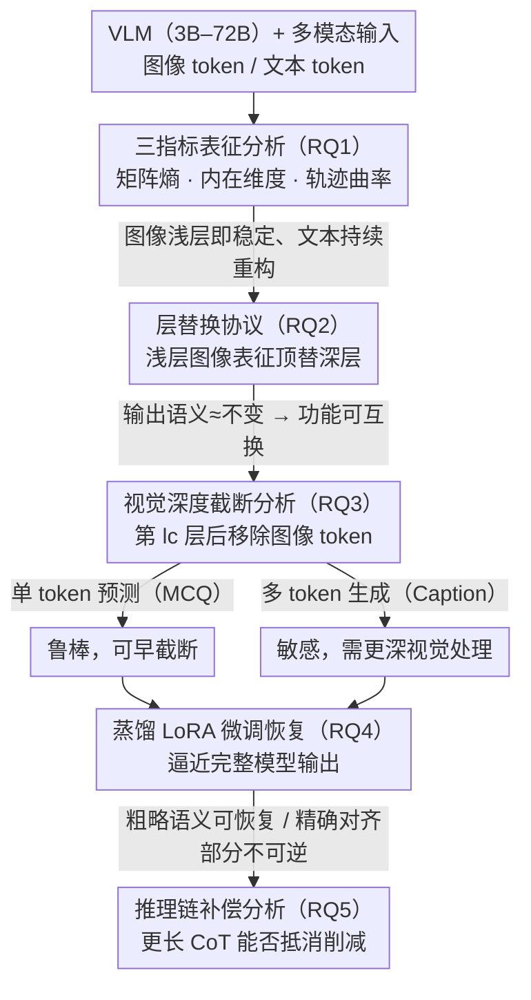

# Do Vision Language Models Need to Process Image Tokens?

**会议**: CVPR 2026  
**arXiv**: [2604.09425](https://arxiv.org/abs/2604.09425)  
**代码**: 有  
**领域**: 多模态VLM  
**关键词**: 视觉语言模型, 图像token, 表征分析, 计算效率, 模态冗余

## 一句话总结

本文系统揭示了VLM中图像token表征在浅层即趋于稳定且跨层可互换，而文本token持续动态重构——图像处理深度的必要性高度依赖输出任务类型。

## 研究背景与动机

**领域现状**：VLM通过将视觉编码器与LLM结合实现多模态推理，但处理密集图像token穿越深层Transformer带来巨大计算开销。近期研究表明视觉信号在多模态任务中可能被低效利用。

**现有痛点**：视觉token在VLM深层是否持续提供有意义的信息变换尚不清楚。之前的工作主要假设视觉冗余并设计剪枝机制，但缺乏对表征动态的系统性理解。

**核心矛盾**：VLM对图像和文本token施加相同深度的处理，但两种模态的表征演化模式可能根本不同。

**本文目标**：从表征角度系统分析图像token在VLM中的演化、可互换性、任务依赖性和可恢复性。

**切入角度**：使用矩阵熵、内在维度和轨迹曲率三个指标跨3B-72B模型追踪表征结构演化。

**核心idea**：图像表征在浅层快速收敛到有界复杂度区域，深层处理主要保持而非重构视觉信息。

## 方法详解

### 整体框架

这篇论文不提新模型，而是把"VLM 到底需不需要让图像 token 一路穿过所有 Transformer 层"这个问题拆成可观测、可验证的实验。整条分析链由浅入深地回答五个递进的问题：图像和文本 token 的表征在层间是怎么演化的（RQ1）？如果图像表征早早稳定下来，这种稳定是否意味着不同深度的图像 token 功能上可以互换（RQ2）？图像 token 的处理深度对不同任务是否同样重要（RQ3）？把深层图像处理砍掉后，能不能靠微调把性能补回来（RQ4）？以及让模型多写推理链能否补偿被削减的视觉处理（RQ5）？前两个问题用表征几何指标和替换实验回答，后三个问题用"截断 + 恢复"的干预实验回答，环环相扣——上一问的结论正是下一问成立的前提。

### 关键设计

**1. 三指标表征分析框架：从几何上量化每层到底对 token 做了多少改造**

要判断图像 token 在深层是否还在被"有意义地变换"，单看一个标量容易被噪声带偏，所以本文同时追踪三个互补的几何量。矩阵熵刻画一层内表征的谱集中度——熵低说明表征被压缩到少数主方向，熵高说明它仍在向多个方向分散；内在维度估计局部流形真正用到的有效自由度，反映表征的复杂度上限；轨迹曲率则直接量化相邻两层之间表征方向的重构幅度，定义为

$$\bar{C}_l = \frac{1}{N}\sum_i \arccos\!\left(\frac{\langle v_l^{(i)}, v_{l-1}^{(i)}\rangle}{\|v_l^{(i)}\|\,\|v_{l-1}^{(i)}\|}\right)$$

其中 $v_l^{(i)}$ 是第 $i$ 个 token 在第 $l$ 层的更新方向，曲率越大表示这一层把 token 的表征"掰"得越狠。三个指标从压缩程度、复杂度、方向变化三个角度交叉验证，只有当它们都指向同一结论时才下判断。结果高度一致：图像 token 的熵和内在维度在浅层就快速收敛、曲率近乎常数，而文本 token 的三项指标始终在波动、扩缩、大幅转向——视觉表征早早进入有界复杂度区域，文本表征则持续被重构。

**2. 层替换协议（Layer Substitution Protocol）：把"结构稳定"和"功能可互换"分开验证**

表征几何上不再变，不等于它在功能上可以随便换——本文用一个直接的干预实验把这两件事区分开。做法是构造一个混合隐状态 $Z_{hybrid} = (Z_{l_a}^{img}, Z_{l_b}^{txt})$：把来自浅层 $l_a$ 的图像 token 表征，和来自深层 $l_b$ 的文本 token 表征拼在一起继续前向传播，再看最终输出的语义是否还和原模型一致。如果稳定化真的意味着可互换，那么用浅层图像 token 顶替深层图像 token，输出语义应当几乎不变。实验正是如此：图像 token 跨深度替换后输出语义相似度稳定保持在约 1.0，几乎不受 $l_a$ 与 $l_b$ 层差影响；而对文本 token 做同样替换，相似度随层差增大而显著下降。这从功能层面确认了图像表征"早熟"——深层处理主要是在保持而非重构视觉信息。

**3. 视觉深度截断分析：把"可互换"和"可丢弃"再分开，并暴露任务依赖性**

可互换并不等于可丢弃——浅层和深层图像 token 功能相同，不代表深层就不需要它们在场。为此本文在某个截断层 $l_c$ 之后直接移除所有图像 token 的激活，让后续层完全看不到视觉信息，再观察不同任务的退化曲线。关键发现是退化模式强烈依赖输出结构：单 token 预测（如选择题 MCQ）对截断相当鲁棒，截得很早也基本不掉点；而多 token 生成（如图像描述）对早期截断高度敏感，BLEU/ROUGE 随保留的视觉深度单调上升。换句话说，要不要让图像 token 走完全程，答案取决于任务需要"指一下"还是"描述一段"——这也直接解释了为什么这条结论对 VLM 架构裁剪有实际指导意义。

### 损失函数 / 训练策略

针对截断后能否恢复（RQ4），本文采用基于蒸馏的 LoRA 微调：以完整模型的输出 $y_{target} = f_{base}(x)$ 作为目标，优化被截断的模型 $\tilde{f}_K$ 去逼近原始模型的行为。结果显示粗略语义（如 Caption）能被较好地重新分配回剩余层而恢复，但需要精确视觉对齐的任务（如 ChartQA）恢复有限——说明被砍掉的深层视觉对齐能力是部分不可逆的。

## 实验关键数据

### 主实验

| 实验 | 图像token | 文本token |
|------|-----------|-----------|
| 矩阵熵 | 快速稳定 | 持续波动 |
| 内在维度 | 早期收敛 | 交替扩缩 |
| 轨迹曲率 | 近常数 | 大且变化 |
| 层替换相似度 | ~1.0（深度不变） | 随层差下降 |

### 消融实验

| 配置 | 关键指标 | 说明 |
|------|---------|------|
| MCQ截断 | 退化平滑 | 单token预测鲁棒 |
| VQA截断 | 退化显著 | 精确匹配需要深度处理 |
| Caption截断 | 退化严重 | 多token生成最敏感 |
| 蒸馏微调后 | Caption恢复好 | 粗略语义可重新分配 |
| 蒸馏微调后 | ChartQA恢复差 | 精确视觉对齐不可逆 |

### 关键发现

- 图像表征在所有6个模型（3B-72B）上都展现出一致的早期稳定化模式，说明这是多模态Transformer的结构性质而非规模依赖的人工现象
- 在确定性解码下，减少视觉深度对中间推理轨迹的扰动大于对最终输出的影响——图像token影响推理结构多于最终结论
- 微调不仅恢复平均性能，还降低了跨解码策略的变异性

## 亮点与洞察

- **模态不对称性的系统性证据**：三个独立指标一致揭示了视觉token早期收敛而文本token持续演化的结构不对称
- **"可互换≠可丢弃"的精确区分**：功能可互换意味着深层处理不改变语义，但不意味着图像token在深层不被需要
- **任务依赖性的精细分析**：单token预测、多token生成和开放式推理对视觉深度需求的差异为VLM架构设计提供了具体指导

## 局限与展望

- 分析主要在BLINK、Flickr8K等有限数据集上进行
- 截断实验使用硬截断（完全移除图像token），未探索渐进稀疏化等更温和策略
- 未讨论视觉token在注意力中对文本token的间接影响

## 相关工作与启发

- **vs FiT/SparseVLM**: 这些工作假设冗余并设计剪枝机制，本文从表征角度解释了为什么剪枝能work
- **vs ShortV**: ShortV探索深层视觉表征的有限新颖性，本文提供了更全面的表征动态分析

## 评分

- 新颖性: ⭐⭐⭐⭐ 从表征动态角度理解VLM效率的新视角
- 实验充分度: ⭐⭐⭐⭐⭐ 6个模型族×多任务×多指标，非常系统
- 写作质量: ⭐⭐⭐⭐⭐ 研究问题驱动的结构清晰优雅
- 价值: ⭐⭐⭐⭐ 对VLM架构设计有深远启示

<!-- RELATED:START -->

## 相关论文

- [\[CVPR 2026\] What Do Visual Tokens Really Encode? Uncovering Sparsity and Redundancy in Multimodal Large Language Models](what_do_visual_tokens_really_encode_uncovering_sparsity_and_redundancy_in_multim.md)
- [\[CVPR 2026\] Hierarchical Process Reward Models are Symbolic Vision Learners](hierarchical_process_reward_models_are_symbolic_vision_learners.md)
- [\[ACL 2026\] What Do Vision-Language Models Encode for Personalized Image Aesthetics Assessment?](../../ACL2026/multimodal_vlm/what_do_vision-language_models_encode_for_personalized_image_aesthetics_assessme.md)
- [\[CVPR 2026\] WeMMU: Enhanced Bridging of Vision-Language Models and Diffusion Models via Noisy Query Tokens](wemmu_enhanced_bridging_of_vision-language_models_and_diffusion_models_via_noisy.md)
- [\[CVPR 2026\] Grounding Everything in Tokens for Multimodal Large Language Models](grounding_everything_in_tokens_for_multimodal_large_language_models.md)

<!-- RELATED:END -->
