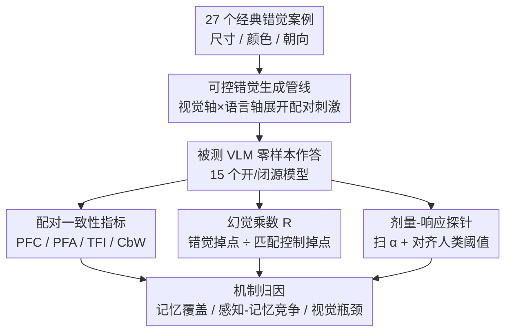

# Do VLMs Perceive or Recall? Probing Visual Perception vs. Memory with Classic Visual Illusions

**会议**: CVPR 2026  
**论文**: [CVF Open Access](https://openaccess.thecvf.com/content/CVPR2026/html/Sun_Do_VLMs_Perceive_or_Recall_Probing_Visual_Perception_vs._Memory_CVPR_2026_paper.html)  
**代码**: 暂未公开（论文称数据与代码将发布于 "VI-Probe Website"，未给出具体链接 ⚠️ 以原文为准）  
**领域**: 多模态VLM  
**关键词**: 视觉错觉, 感知 vs 记忆, 可控探针, VLM评测, 反事实一致性

## 一句话总结
针对「VLM 在经典视觉错觉上答得对、但把诱发因子反转后仍答原样」的现象，本文做了一个可控错觉探针框架 VI-Probe——对图像做分级扰动+配对控制、对提问做极性翻转+指令变体，再用 PFC/TFI/幻觉乘数 R 等指标把「真感知」和「靠记忆背模板」拆开，发现不同模型家族的「答案僵化」其实来自记忆覆盖、感知-记忆竞争、视觉处理瓶颈等异质机制，而非过去认为的单一「语言先验」。

## 研究背景与动机
**领域现状**：视觉错觉（Ebbinghaus、Müller–Lyer、Poggendorff 等）长期被心理学用作探测人类感知机制的诊断工具。近年这套思路被搬到 VLM 上，催生了 HallusionBench、IllusionVQA、VLMBiased 等一批错觉 benchmark，普遍结论是「VLM 在错觉任务上不如人」。

**现有痛点**：现有 benchmark 有三个系统性缺陷——(i) 用固定强度的错觉图，无法测量模型的「感知阈值」；(ii) 评测只看二值准确率，把模型的偏置和置信模式都平均掉了；(iii) 不区分「看见了」还是「背出来了」，没有把视觉感知与语言先验解耦。更糟的是，一个反常现象被很多工作观察到却没解释清楚：模型在原始错觉图上答得「物理正确」（看似看穿了错觉），但当把错觉诱发因子反转、使正确答案应当翻转时，模型还是给同一个答案，无视了人眼一眼能看出的视觉变化。

**核心矛盾**：这暴露出一个根本问题——**VLM 到底是在感知视觉变化，还是只在召回记忆里的模式？**过去主流解释把锅全甩给「语言先验」，但这只是描述了 what happens，没回答 how 和 why；而且不同模型行为差异巨大，单因解释站不住脚。

**本文目标**：把「观察现象」升级为「系统理解」，需要一套能（1）连续调控错觉强度、（2）用匹配控制隔离错觉专属线索、（3）超越平均准确率去量化稳定性与敏感性的探针工具。

**切入角度**：作者借鉴心理物理学的「分级刺激 + 匹配对照」范式：对每个错觉同时沿**视觉轴**（扰动强度、去诱因控制、视觉提示）和**语言轴**（极性翻转、指令变体）做受控操纵，再用配对一致性 + 归一化效应量去归因。

**核心 idea**：用「可控错觉 + 匹配控制 + 配对探针指标」代替「固定图 + 平均准确率」，把每个模型的「答案僵化」归因到具体机制（记忆覆盖 / 感知-记忆竞争 / 视觉瓶颈）。

## 方法详解

### 整体框架
VI-Probe 是一个评测框架而非新模型，核心是「造可控刺激 → 配对追问 → 用诊断指标归因」。输入是 27 个经典错觉案例（涵盖尺寸/长度、亮度/颜色、几何朝向三类），输出是对每个被测 VLM 的「感知 vs 记忆」机制画像。它先用**可控错觉生成管线**把每个案例沿视觉、语言两个独立轴展开成一组配对刺激（原始/扰动、去诱因控制、视觉提示 × 正向/反向/指令提问）；然后让模型在这组刺激上作答，用**配对一致性指标**（PFC/PFA/TFI/CbW）测语言鲁棒性、用**幻觉乘数 R**把错觉造成的掉点对匹配控制归一化以隔离记忆效应；最后通过**剂量-响应探针**扫描扰动强度并对齐人类阈值，刻画每个模型家族的失效曲线。

### 关键设计

**1. 可控错觉生成管线：把固定错觉图变成沿视觉/语言双轴连续可调的配对刺激**

针对「现有 benchmark 用固定强度图、无法测阈值也无法解耦感知与语言」的痛点，本文为每个错觉案例造出**六种图像版本 × 三种提问版本**的笛卡尔积。视觉轴上，以经典图为种子，生成：(1) **扰动图**——把控制因子（尺寸比、线长、局部对比度、朝向）按分级强度 $\alpha$ 反转，使正确答案应当翻转；(2) **匹配视觉控制图** $x^{OC}/x^{PC}$——移除错觉诱发线索但保留全局语义布局；(3) **带提示图** $x^{OH}/x^{PH}$——叠加对齐标记/网格等视觉线索。语言轴上设三种提问：正向 $q_f$（"两个目标一样吗？"）、反向 $q_r$（"两个目标不同吗？"，极性 $\text{pol}(q_r)=-\text{pol}(q_f)$）、指令变体 $q_I$（加"只凭视觉、忽略先验知识"的系统指令，保持极性）。标签约定 $y_r(x)=1-y_f(x)$、$y_I(x)=y_f(x)$。作者用 Qwen2.5-VL-72B/3B 的 embedding 做 2D PCA，验证不同 $\alpha$ 的样本在表征空间里分层清晰，说明扰动确实提供了对错觉强度的连续控制。这套「去诱因控制图」是后续一切归因的基石——它让「错觉造成的掉点」能减去「单纯视觉变难造成的掉点」。

**2. 配对一致性指标 PFC/TFI/CbW：把语言鲁棒性从视觉判断里剥出来**

针对「平均准确率把语言极性处理和视觉判断混在一起」的痛点，本文对每张图问一对互补问题 $q_f$（"same?"）与 $q_r$（"different?"），记模型答案为 $a_f,a_r\in\{0,1\}$，定义三个指标：**极性翻转一致性** $\text{PFC}=\mathbb{E}[\mathbb{1}(a_r=1-a_f)]$（两答互补即可，不管对错）；**极性翻转准确率** $\text{PFA}=\mathbb{E}[\mathbb{1}(a_f=y_f\wedge a_r=y_r)]$（两答都对）；**模板固化指数** $\text{TFI}=\mathbb{E}[\mathbb{1}(a_r=a_f)]$（对一对相反问题给同极性答案的比例）。再定义**一致但错误** $\text{CbW}=\text{PFC}-\text{PFA}$，量化「语言上自洽（互补）但视觉上全错」的情形。三者满足分解 $\text{PFA}+\text{CbW}+\text{TFI}=100\%$。这套指标的价值在于：高 PFC + 高 CbW 说明模型有系统性视觉错误被语言连贯性掩盖；高 TFI（如 Qwen2.5-VL-3B 的 46.82%）说明模型在视觉判断前连语义极性都处理不好，因此 PFC 被用作「语言鲁棒性达标线」——低于阈值的小模型，再谈视觉推理都不可靠。

**3. 幻觉乘数 R：用匹配控制把记忆驱动和视觉变难分开**

针对「原始→扰动掉点既可能因记忆僵化、也可能因图变难」的混淆，本文定义幻觉乘数为错觉效应量与控制效应量之比：

$$R=\frac{\mathbb{E}_{(x^O,x^P)}\big[\text{Acc}(x^O)-\text{Acc}(x^P)\big]}{\mathbb{E}_{(x^{OC},x^{PC})}\big[\text{Acc}(x^{OC})-\text{Acc}(x^{PC})\big]+\epsilon}$$

其中 $\epsilon=0.001$ 防止除零。$R>1$ 表示错觉掉点大于控制掉点，即**记忆覆盖**——先验知识盖过了视觉输入；$R<1$ 表示错觉语境下扰动反而影响更小，通常意味着**底层视觉本就弱**（连控制图都做不好）；$R\approx1$ 表示错觉与控制掉点相当，**感知与记忆在竞争**、谁都没完全主导。通过对匹配控制归一化，R 把「错觉模式的专属贡献」从「一般视觉难度」里隔离出来，这是把单一现象拆成异质机制的关键标尺。

**4. 剂量-响应探针：扫扰动强度 + 对齐人类阈值，诊断失效曲线形状**

针对「单点准确率看不出机制」的痛点，本文在 10 档扰动强度上、对「扰动控制（去诱因）」与「扰动错觉（带诱因）」两条匹配曲线做剂量-响应分析，并采集人类对子集的判断作为感知基线（约 95% 检测率处画红线阈值）。曲线形状直接对应机制：**平坦的错觉曲线**（如 GPT-5 恒定 0–5%）= 完全记忆覆盖；**有剂量依赖但被压低的曲线**（如 Opus-4.1 的 22%→40%）= 感知-记忆竞争。它还揭示「抗噪」与「抗错觉」是正交能力——控制条件下排前列的模型（GPT-5 第 2、Opus 第 4）在错觉条件下塌到第 15、11 名，而中游模型反而升到前三。更尖锐的是「模型-人类解离」：多数 VLM 在远低于人类感知阈值处就在错觉条件下崩溃，却能在同等扰动幅度的控制条件下保持合理准确率——证明失败源于错觉触发的模板召回，而非感知能力不足。

## 实验关键数据

### 主实验：用匹配控制隔离错觉效应（部分模型，节选 Table 2）

| 模型 | PFC | 错觉-原始 | 错觉-扰动 | 控制-原始 | 控制-扰动 | R | 机制 |
|------|-----|-----------|-----------|-----------|-----------|-----|------|
| GPT-5 | 82.51 | 91.72 | **4.45** | 96.55 | 52.24 | **1.97** | 记忆覆盖 |
| GPT-5-Mini | 84.86 | 87.24 | 8.97 | 93.45 | 30.38 | 1.24 | 记忆覆盖 |
| GPT-5-Nano | 65.64 | 46.21 | 47.41 | 55.86 | 66.14 | 0.12 | 感知受限 |
| Claude-Opus-4.1 | 72.68 | 67.93 | 27.55 | 88.97 | 49.17 | **1.01** | 感知-记忆竞争 |
| Claude-Haiku-4.5 | 68.59 | 45.52 | 50.66 | 83.79 | 61.55 | 0.23 | 感知优先 |
| Gemini-2.5-Flash | 77.66 | 75.52 | 20.90 | 92.07 | 50.17 | 1.30 | 记忆覆盖 |
| Qwen2.5-VL-3B | 56.15 | 22.41 | 14.07 | 74.48 | 10.72 | **0.13** | 视觉瓶颈 |

> 看点：GPT-5 在原始错觉图上 91.72%，因子反转后塌到 4.45%（掉 87.27pp），而匹配控制只从 96.55% 掉到 52.24%（掉 44.31pp，不到一半）——R=1.97 量化了这是记忆覆盖而非图变难。Haiku-4.5 反而扰动错觉准确率（50.66%）高于原始（45.52%），呈「感知优先」（R=0.23）。

### 配对一致性分解（Fig. 4，PFA + CbW + TFI = 100%）

| 模型 | PFC | PFA | CbW | TFI | 解读 |
|------|-----|-----|-----|-----|------|
| GPT-5 | 92.32 | 61.24 | 31.08 | 7.68 | 语言极度连贯，但近 1/3 配对「一致但全错」 |
| GPT-5-Mini | 89.38 | 55.01 | 34.37 | — | CbW 最高，系统性视觉错误被语言连贯掩盖 |
| Qwen3-VL-8B | 88.01 | — | — | — | 反超 Qwen3-VL-32B(84.70)，规模非单调 |
| Qwen2.5-VL-3B | — | — | — | **46.82** | 近半数对相反问题给同极性答案，极性坍缩 |

> 关键发现：**高一致 ≠ 高准确**。GPT-5 的 92.32% PFC 里有 31.08% 是 CbW（互补但都错）；模型规模与语言固化/视觉偏置非单调相关（Qwen3-VL-8B > 32B）。

### 干预实验（Table 3，Size 错觉，仅列趋势）

| 干预 | 原始 | 扰动 | 现象 |
|------|------|------|------|
| 视觉提示（对齐标记/网格） | 13/15 模型↑（均 +6.2pp） | 12/15 模型↓（均 −6.9pp） | 提示强化模板召回：原始更准、反转更错 |
| 系统提示（"忽略先验、仔细比较"） | GPT-5 **−84.30** | GPT-5 **+63.97** | 记忆型模型被迫「全有或全无」模式切换 |

> 关键发现：视觉提示在反转后变成「误导锚点」把预测拉回记忆配置；系统提示对 R>1.2 的记忆型模型造成灾难性 trade-off（扰动飙升、原始崩塌），只有弱模板的小 Qwen（2.5-VL-3B/7B/32B）能两边同时小涨——说明前沿 VLM 缺乏自适应平衡感知与记忆的机制。

## 亮点与洞察
- **「匹配控制 + 归一化效应量」是把混淆拆开的关键手术刀**：R 把「错觉专属掉点」除以「一般扰动掉点」，一个比值就把记忆覆盖（R>1）、感知瓶颈（R<1）、感知-记忆竞争（R≈1）三种机制分了出来，这种「对照归一化」思路可迁移到任何「现象掉点成因不明」的诊断评测。
- **PFA+CbW+TFI=100% 的分解很优雅**：用一对互补问题就把「语言连贯性」从「视觉正确性」里干净剥离，CbW（一致但错）这个量尤其点睛——它精确捕捉了「会说人话但没看图」的失败模式，是平均准确率永远看不到的。
- **「抗噪 ≠ 抗错觉」的正交性结论反直觉**：控制条件下的 top 模型在错觉条件下塌到垫底，说明语义整合能力在普通噪声下是优势、在错觉下反而触发模板召回，提示评测必须把两种能力分开测。
- **挑战了「都怪语言先验」的单因论**：同样的平均准确率（~50%）下，GPT-5 是记忆覆盖、Qwen2.5-3B 是视觉瓶颈、Opus 是感知-记忆竞争——机制异质性意味着「修复方案」也得因家族而异。

## 局限与展望
- **代码/数据链接未明确**：摘要称发布于 "VI-Probe Website" 但正文未给具体 URL ⚠️ 以原文为准，可复现性待实物验证。
- **依赖 API 与 OpenRouter 黑盒**：15 个模型经统一 API 零样本评测，推理设置（温度等）对不可控温度模型用默认值，可能引入服务端差异；且闭源模型内部机制只能从行为反推，「记忆覆盖」等归因是行为层解释而非机制证据。
- **人类基线只在子集采集**：人类阈值（~95% 检测率）只在部分刺激上采，红线阈值的统计稳健性有限。
- **机制归因偏定性**：R、剂量曲线形状给出的是「像哪种机制」的画像，论文也坦承真正成因（表征纠缠、跨注意力弱、目标函数缺反事实一致性、解码惯性等五因）需后续工作分离；作者建议的「感知优先架构 + 反事实一致性训练目标」尚停留在方向。

## 相关工作与启发
- **vs HallusionBench / IllusionVQA / VLMBiased**：它们用固定强度错觉图 + 二值准确率，结论停在「VLM 不如人」；本文加了分级扰动、匹配控制、视觉提示、语言变体与 PFC/R 等细粒度指标，把「不如人」拆成具体机制，并指出平均准确率会把 Original→Perturbed 的悬崖掩盖。
- **vs 「语言先验主导」类工作（如 VLMBiased 等）**：它们把答案僵化统一归因于语言先验；本文用 R 证明这是异质的——只有 R>1 的模型（GPT-5、Gemini-Flash）才是先验干扰，Qwen 系列其实是底层视觉弱（R<1），Claude 是竞争（R≈1）。
- **可迁移启发**：这套「沿独立轴造配对刺激 + 对匹配控制归一化 + 配对一致性分解」的探针范式，不止用于错觉，凡是「模型答得对但可能靠背」的评测（常识、空间关系、计数等）都能借鉴来区分「真理解」与「记忆召回」。

## 评分
- 新颖性: ⭐⭐⭐⭐⭐ 把心理物理学的分级刺激+匹配对照搬进 VLM 评测，R 与 PFC/CbW 分解是真正新的诊断工具
- 实验充分度: ⭐⭐⭐⭐ 15 模型 4 家族、视觉×语言双轴、剂量曲线+人类基线+干预实验，覆盖很全；机制归因偏行为层、缺内部证据
- 写作质量: ⭐⭐⭐⭐ 指标定义清晰、takeaway 提炼到位；图表密集，符号略多需对照读
- 价值: ⭐⭐⭐⭐⭐ 给「VLM 是看还是背」提供了可复现的归因范式，并明确推翻单因论，对评测与模型设计都有指导

<!-- RELATED:START -->

## 相关论文

- [\[CVPR 2026\] VisualOverload: Probing Visual Understanding of VLMs in Really Dense Scenes](visualoverload_probing_visual_understanding_of_vlms_in_really_dense_scenes.md)
- [\[CVPR 2026\] Illusion-Aware Visual Preprocessing and Anti-Illusion Prompting for Classic Illusion Understanding in Vision-Language Models](illusion-aware_visual_preprocessing_and_anti-illusion_prompting_for_classic_illu.md)
- [\[CVPR 2026\] Enhancing Descriptive Captions with Visual Attributes for Multimodal Perception](enhancing_descriptive_captions_with_visual_attributes_for_multimodal_perception.md)
- [\[CVPR 2026\] Act2See: Emergent Active Visual Perception for Video Reasoning](act2see_emergent_active_visual_perception_for_video_reasoning.md)
- [\[CVPR 2026\] VS-Bench: Evaluating VLMs for Strategic Abilities in Multi-Agent Environments](vs_bench_evaluating_vlms_for_strategic_abilities_in_multi_agent_environments.md)

<!-- RELATED:END -->
