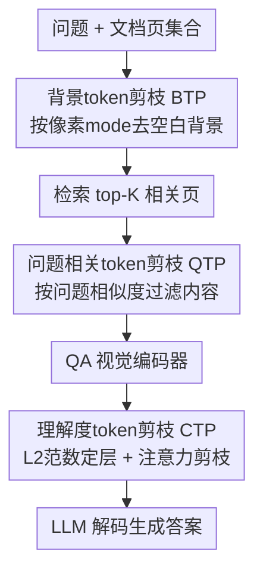

# DocPrune: Efficient Document Question Answering via Background, Question, and Comprehension-aware Token Pruning

**会议**: CVPR 2026  
**arXiv**: [2604.22281](https://arxiv.org/abs/2604.22281)  
**代码**: 待确认  
**领域**: 多模态VLM / 文档理解 / 视觉token剪枝  
**关键词**: 文档VQA, 训练-free token剪枝, 长文档理解, RAG, 推理加速

## 一句话总结
DocPrune 针对"文档图像里大片背景 + 稀疏证据"的结构特性，提出一个免训练、渐进式的三阶段视觉 token 剪枝框架（去背景 → 去问题无关区域 → 按模型理解度自适应剪枝），在 M3DocRAG 上把编码器/解码器吞吐分别提升 3.0× / 3.3× 的同时 F1 还涨 1.0。

## 研究背景与动机
**领域现状**：当前文档视觉问答（DocVQA）主流走"检索增强"路线——像 M3DocRAG、VDocRAG 这样先用检索模型（如 ColPali）从上百页文档里召回 top-K 相关页，再把这些页当成图像喂给视觉语言模型（如 Qwen2-VL）做端到端 OCR-free 问答。

**现有痛点**：这条路线非常贵。文档页面排版稀疏——文字、表格、图表散落在大片空白背景上，单页就能产生上千个视觉 token，长文档累积起来开销爆炸。已有的 token 剪枝方法大多是为自然图像/视频设计的（靠"邻近 patch 视觉冗余"），但文档版面是强结构化的：文字行、表格、图表有严格的空间组织，按视觉相似度剪枝很容易破坏文字连续性、毁掉版面线索，导致性能明显掉点。另外，这些方法选"在哪一层开始剪枝"几乎都靠固定启发式，忽略了模型理解是逐层演进的，剪得太早或不一致都会让性能不稳。

**核心矛盾**：文档剪枝的冗余结构和最佳剪枝时机，都跟自然图像不一样——既要利用**文档版面结构**（哪里是无意义背景、哪里和问题相关），又要利用**模型内部状态**（它到第几层才真正"看懂"了文档），而现有方法两者都没顾上。

**本文目标**：在不额外训练的前提下，对长文档 QA 做到"剪得准 + 剪得是时候"，端到端同时降算力、保（甚至升）精度。

**切入角度**：作者做了三个针对文档的观察——① 平均 36% 的 patch 是背景（语义近乎为零却照样耗算力）；② 去掉背景后，真正回答问题需要的 token 也只占很小一块局部区域（只留 top-10% 最受关注 token，F1 仅掉 1.2 分，FLOPs 降到 1/9、吞吐 6.46×）；③ 用最后一个 token 的 L2 范数能可靠地代理"模型在第几层理解充分了"。

**核心 idea**：把剪枝拆成三个各司其职、渐进收缩的阶段——先按像素去背景、再按问题相似度去无关内容、最后按模型理解度自适应触发注意力剪枝——用文档结构和模型理解度共同指导剪枝。

## 方法详解

### 整体框架
DocPrune 建在标准的"检索 → 问答"两阶段 RAG 流水线之上：给定问题 $q$ 和文档页集合 $\mathcal{D}$，检索模型 $f_{\text{RET}}$ 先召回 top-$K$ 相关页 $\tilde{\mathcal{D}}=f_{\text{RET}}(q,\mathcal{D};K)$，再由多模态问答模型 $f_{\text{QA}}$ 生成答案 $y=f_{\text{QA}}(q,\tilde{\mathcal{D}})$。DocPrune 不改这个骨架，而是在三个位置插入三个互补的 token 剪枝模块，让 token 数像漏斗一样逐级收缩（论文定性例子里 2508 → 1340 → 460 → 168，最后只剩约 7%）。

具体地：**背景 token 剪枝（BTP）** 在编码前（检索阶段和问答阶段都用）按像素去掉空白背景；**问题相关 token 剪枝（QTP）** 在问答视觉编码器之前，借检索阶段算好的嵌入算 token 与问题的相似度，过滤无关内容；**理解度 token 剪枝（CTP）** 在 LLM 解码阶段，监控逐层理解度、在模型"看懂"的那一层用注意力做最后一刀。三步都不需要训练。

### 关键设计

**1. 背景 token 剪枝 BTP：编码前先把大片空白扔掉**

文档页 36% 的 patch 是无语义的背景（页边距、行间空白），却照样进编码器烧算力。BTP 在编码**之前**就显式检测并删掉它们。做法很轻量、纯像素级：把图像 $I\in\mathbb{R}^{H\times W\times 3}$ 切成 $P\times P$ 的 patch、转灰度，统计全图最频繁的像素值 $m$ 作为背景强度，再对每个 patch 算"背景占比"

$$R_i=\frac{1}{P^2}\sum_{p=1}^{P^2}\mathbb{1}\left[\,|\hat{t}_i^{(p)}-m|<\tau_{\text{e}}\,\right]$$

其中 $\tau_{\text{e}}$ 是容忍轻微色差的阈值。背景占比超过阈值 $\tau_{\text{bg}}$ 的 patch 被判为背景丢弃，只留内容 token $\tilde{T}=\{t_i\in T\mid R_i\le\tau_{\text{bg}}\}$。它不依赖任何网络、不破坏内容版面，且因为在编码前动手，省的是整条编码-解码链路的算力，是三阶段里最先收缩的一刀

**2. 问题相关 token 剪枝 QTP：复用检索嵌入，只留和问题相关的内容**

BTP 只去背景、不看问题，但去背景后剩下的内容里其实也只有很小一块和当前问题相关。QTP 想把"问题无关的内容"也剪掉，关键巧思是**白嫖检索阶段已经算好的嵌入**——文档 token 嵌入 $E^{\text{doc}}$ 和问题 token 嵌入 $E^{\text{qst}}$，于是几乎零额外开销。它对每个文档 token 与所有问题 token 算余弦相似度并求和

$$s_i=\sum_{j=1}^{N_{\text{qst}}}\cos(\mathbf{e}^{\text{doc}}_i,\mathbf{e}^{\text{qst}}_j)$$

得到相关性图 $S$。由于检索器和 QA 模型常用不同编码器、分辨率不一致（如 ColPali 检索 + Qwen2-VL 问答），先用双线性插值把 $S$ resize 到 QA 模型的特征图分辨率；又因为相似度图容易在关键词附近形成局部噪点，再叠一层高斯平滑 $S'=G_\sigma * S$ 把相关区域适当扩散开。最后保留 $S'_i\ge\tau_{\text{qst}}$ 的 token 进 QA 视觉编码器。这一步把"是不是内容"升级成"是不是这个问题需要的内容"

**3. 理解度 token 剪枝 CTP：让模型"看懂了"再剪，剪在对的层**

前两步在编码前剪，CTP 解决的是解码阶段"该在第几层剪"的老大难。以往都靠固定启发式选层，作者发现这不可靠——浅层注意力还不可信（和随机剪枝差不多），过了第 15 层才变得有效、约第 20 层最佳。但这是事后观察、没法在线预测。于是作者提出一个代理指标：用每层最后一个 token 的 L2 范数 $c^l=\lVert x_N^l\rVert$ 近似模型在该层的"理解度"。实验显示 $c^l$ 越高、样本准确率越高，且简单样本更早达到高 $c^l$、难样本要更深的层——它能自适应反映模型置信的演化。CTP 据此先找出第一个理解度达标的层

$$l^{\ast}=\min(\{l\mid c^l\ge\tau_{\text{comp}}\})$$

然后在 $l^{\ast}$ 层用输出 token 对各视觉 token 的注意力作为重要度，把低于阈值 $\tau_{\text{att}}$ 的 token 在传到下一层前剪掉：$\tilde{X}^{l^{\ast}}=\{x_i^{l^{\ast}}\mid a_i^{l^{\ast}}\ge\tau_{\text{att}}\}$。"先确认看懂、再下刀"避免了过早剪枝伤害理解，且对难/易样本自动选不同深度

### 一个完整示例
以论文定性例子（top-1 页）走一遍漏斗：一张文档图编码后是 **2508** 个 token，但只有很小一块和线索/答案相关。① BTP 去掉页边距、行间空白等背景，token 降到 **1340**（内容区全保留）；② QTP 按问题相似度滤掉与当前问题无关的内容，降到 **460**；③ CTP 在模型理解充分的那一层按注意力只留最关键 token，压到 **168**（约原始 7%），而线索区（蓝）和答案区（红）都还在。每一步都对应该阶段的剪枝目标，最终在不丢证据的前提下大幅提了端到端吞吐。

## 实验关键数据

### 主实验
在 M3DocRAG（基座 Qwen2-VL 7B + ColPali 检索）上，对比基线与三种 token 剪枝方法（FastV、DivPrune、VTW）。下表为 top-4 召回页设置（TFLOPs 越低越好，吞吐 samples/s 越高越好）：

| 方法 (top-4) | ENC TFLOPs↓ | DEC TFLOPs↓ | ENC 吞吐 | DEC 吞吐 | EM | F1 |
|--------|------|------|------|------|------|------|
| Qwen2-VL 基线 | 59.28 | 86.27 | 0.6 | 0.6 | 31.5 | 36.3 |
| + FastV (ECCV24) | 59.28 | 43.39 | 0.6 | 1.2 | 28.7 | 33.4 |
| + DivPrune (CVPR25) | 59.28 | 38.25 | 0.6 | 0.4 | 30.9 | 35.5 |
| + VTW (AAAI25) | 59.28 | 64.79 | 0.6 | 0.8 | 21.4 | 24.7 |
| **+ DocPrune (本文)** | **16.36** | **25.45** | **1.8** | **2.0** | **33.0** | **37.3** |

DocPrune 在编码器和解码器 TFLOPs 都降 70%+，吞吐分别提到约 3.0×/3.3×，EM/F1 还比未剪枝基线高 +1.5/+1.0——是唯一在整条流水线既降算力又超过基线的方法。对照之下 VTW 的整层剪枝严重伤细粒度理解（F1 掉到 24.7），DivPrune 的迭代开销甚至在高 token 数下把吞吐拖慢。换到 VDocRAG（ChartQA/SlideVQA/InfoVQA/DUDE）也有平均约 2.4× 加速、性能基本持平或略升，证明可迁移。闭域 MMLongBench-Doc（Qwen2.5-VL，top-1）下编码器/解码器各约 2.1× 吞吐，ACC +0.9、F1 +0.4。

### 消融实验
逐个叠加三个模块（M3DocRAG，top-4 页）：

| 配置 | ENC 吞吐 | DEC 吞吐 | EM | F1 | 说明 |
|------|------|------|------|------|------|
| 基线 | 0.6 | 0.6 | 31.5 | 36.3 | 未剪枝 |
| + BTP | 1.3 | 1.3 | 32.9 | 37.1 | 去背景就让吞吐翻倍、精度还涨 |
| + BTP + QTP | 1.8 | 1.7 | 32.6 | 36.9 | 编码侧吞吐继续升，F1 微降 |
| + BTP + QTP + CTP | 1.8 | 2.0 | 33.0 | 37.3 | 解码侧再加速，精度回到最高 |

CTP 选层准则对比（仅看 CTP、不加 BTP/QTP；DEC 吞吐 / EM / F1）：

| 准则 | DEC 吞吐 | EM | F1 | 说明 |
|------|------|------|------|------|
| 基线 | 2.6 | 26.5 | 30.8 | — |
| Entropy | 2.9 | 26.3 | 30.2 | 提速但掉点 |
| Feature Δ | 3.5 | 26.3 | 30.5 | 提速、精度仍降 |
| **L2 Norm (本文)** | **3.5** | **26.8** | **30.9** | 唯一加速且精度反超基线 |

### 关键发现
- **BTP 贡献最直接**：单加 BTP 就把吞吐从 0.6 拉到 1.3、F1 还从 36.3 升到 37.1——印证"36% 背景 patch 纯属浪费算力"的观察，去掉它几乎无损还提速。
- **QTP 是用算力换更激进的剪枝**：加 QTP 后 F1 略降（37.1→36.9），但为后续 CTP 腾出空间，叠满三件套后 F1 回到 37.3 最高，说明三模块是协同而非简单叠加。
- **L2 范数是最优理解度代理**：相比 Entropy、Feature Δ 都掉点，只有 L2 norm 在提速的同时把 F1 反超基线（30.9 vs 30.8），验证"最后 token 范数能可靠预测模型何时看懂"。
- **越长文档收益越大**：top-1→top-4，基线吞吐从 2.3 掉到 0.6，而 DocPrune 维持在 1.8，相对加速比随页数增多而放大。

## 亮点与洞察
- **把"剪枝"重新拆成文档专属的三问**：是不是背景（像素）→ 是不是这个问题要的（语义相似度）→ 模型看懂没（内部状态）。三个问题对应三个互补阶段、各自有明确目标，比"一刀切按视觉冗余剪"清晰得多。
- **L2 范数当理解度探针很巧**：不需要额外训练或多次前向，只读一个标量 $\lVert x_N^l\rVert$ 就能在线判断"该剪了"，还能对难/易样本自动选不同深度——这个"用范数代理置信/理解度"的思路可迁移到其他需要自适应早退/早剪的场景。
- **复用检索嵌入做 QTP 近乎零成本**：RAG 流水线本来就为检索算过文档/问题嵌入，QTP 直接拿来算相似度，省掉一次专门的相关性打分，是"系统级顺手牵羊"的工程美感。
- **全程 training-free**：插在现成 RAG 流水线上即插即用，不动权重、不需数据，落地门槛极低。

## 局限与展望
- **依赖纯像素的背景检测**：BTP 用"全图最频繁像素值 + 容差"判背景，对深色底、扫描噪声大、或背景花哨（彩色版式、水印）的文档可能失效，论文主要在排版规整的文档基准上验证。
- **QTP 受检索嵌入质量牵制**：相似度图来自检索器嵌入，若检索器与 QA 模型语义对齐差、或分辨率插值引入偏移，可能误剪掉真正相关但低相似的 token；论文也观察到 QTP 单独会让 F1 微降。
- **多个阈值需要调**：$\tau_{\text{e}}, \tau_{\text{bg}}, \tau_{\text{qst}}, \tau_{\text{comp}}, \tau_{\text{att}}$ 共五个阈值，跨数据集/模型的鲁棒性和自动设定方式论文交代有限（部分分析放在补充材料）。
- **个别基准会掉点**：VDocRAG 上 InfoVQA/DUDE 的 Single 设置出现 -1.1/-1.3 的下降，说明激进剪枝在某些证据分布上仍有风险，并非全场景稳赢。

## 相关工作与启发
- **vs FastV / SparseVLM / VoCo-LLaMA（解码期通用 token 剪枝）**：它们面向自然图像/视频、靠固定启发式选层剪低重要度 token；DocPrune 专攻文档结构，用像素级背景检测 + 问题相似度 + 理解度自适应选层，三处都对文档量身定制，所以在 DocVQA 上能反超基线而它们普遍掉点。
- **vs DivPrune / VTW**：DivPrune 的迭代多样性剪枝在高 token 数下反而拖慢吞吐，VTW 的整层丢弃破坏细粒度版面理解（F1 掉到 24.7）；DocPrune 渐进收缩、不破坏内容版面，效率与精度兼得。
- **vs M3DocRAG / VDocRAG（RAG 文档问答骨架）**：它们解决"怎么检索+理解多页文档"，DocPrune 不改骨架、专注在其上做免训练提效，是正交且即插即用的加速层。
- **vs LLaMA-VID / DeCo（特征压缩路线）**：那类靠投影/池化压缩视觉特征，DocPrune 走"显式丢弃冗余 token"路线，保留 token 的可解释性（能定性看到留下的就是线索/答案区）。

## 评分
- 新颖性: ⭐⭐⭐⭐ 把文档剪枝拆成背景/问题/理解度三问、并用 L2 范数当理解度代理选层，角度新颖且贴合文档特性
- 实验充分度: ⭐⭐⭐⭐ 覆盖两个模型、多个开/闭域基准、组件与准则消融齐全；个别基准掉点也如实报告
- 写作质量: ⭐⭐⭐⭐ 观察→动机→方法逻辑清晰，定性漏斗例子直观；少量笔误（OURS/throughpuit）无伤大雅
- 价值: ⭐⭐⭐⭐ 免训练、即插即用、长文档收益随页数放大，工程落地价值高

<!-- RELATED:START -->

## 相关论文

- [\[CVPR 2026\] ChartR: Evaluating Reasoning Accuracy and Robustness in Chart Question Answering](chartr_evaluating_reasoning_accuracy_and_robustness_in_chart_question_answering.md)
- [\[CVPR 2026\] VQ-VA World: Towards High-Quality Visual Question-Visual Answering](vq-va_world_towards_high-quality_visual_question-visual_answering.md)
- [\[CVPR 2026\] TransPrune: Token Transition Pruning for Efficient Large Vision-Language Model](transprune_token_transition_pruning_for_efficient_large_vision-language_model.md)
- [\[CVPR 2026\] StaR-KVQA: Structured Reasoning Traces for Implicit-Knowledge Visual Question Answering](star-kvqa_structured_reasoning_traces_for_implicit-knowledge_visual_question_ans.md)
- [\[CVPR 2026\] VLM-Pruner: Buffering for Spatial Sparsity in an Efficient VLM Centrifugal Token Pruning Paradigm](vlm-pruner_buffering_for_spatial_sparsity_in_an_efficient_vlm_centrifugal_token_.md)

<!-- RELATED:END -->
