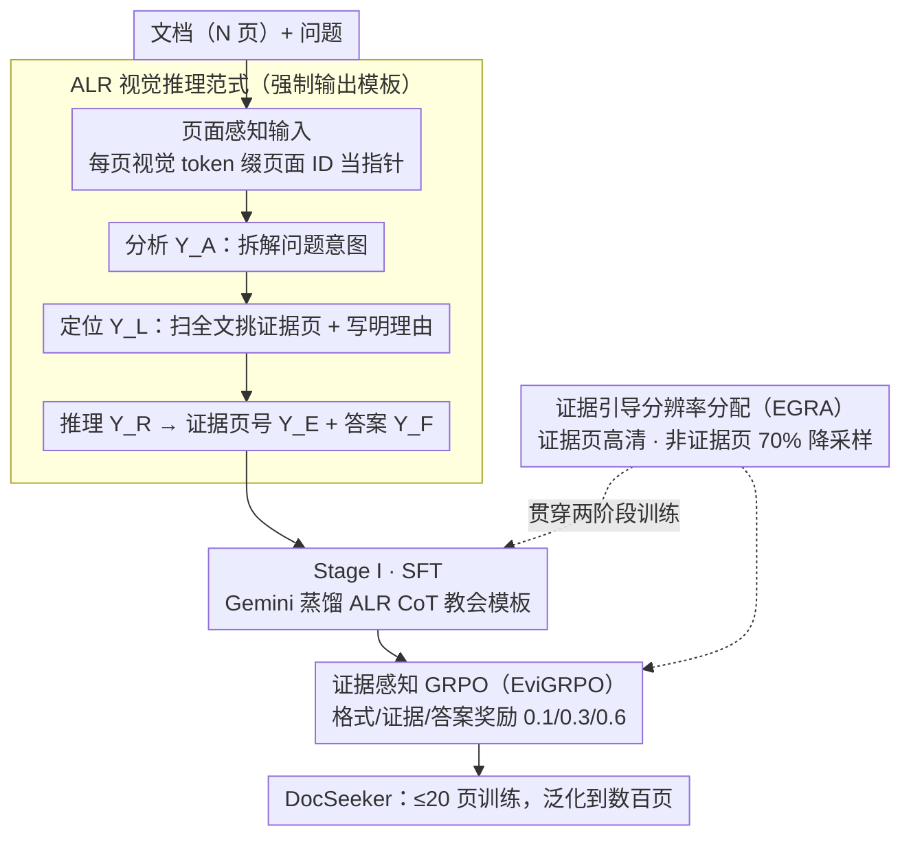

# DocSeeker: Structured Visual Reasoning with Evidence Grounding for Long Document Understanding

**会议**: CVPR 2026 Highlight  
**arXiv**: [2604.12812](https://arxiv.org/abs/2604.12812)  
**代码**: [https://github.com/yh-hust/DocSeeker](https://github.com/yh-hust/DocSeeker)  
**领域**: 多模态VLM / 文档理解  
**关键词**: 长文档理解, 证据定位, 结构化推理, 强化学习, 视觉RAG

## 一句话总结

提出 DocSeeker，通过 ALR（分析-定位-推理）视觉推理范式和两阶段训练（SFT+EviGRPO）实现长文档理解中的结构化推理和证据定位，仅在短文档上训练即可鲁棒泛化到超长文档。

## 研究背景与动机

**领域现状**：MLLM 在长文档 VQA 中随文档长度增加性能严重退化。纯视觉方法将每页作为图像输入，避免 OCR 错误传播。

**现有痛点**：(1) 低信噪比：关键证据埋藏在大量无关页面中；(2) 监督稀缺：数据集仅提供最终短答案，缺乏中间推理步骤。视觉 RAG 的 Top-k 困境——大 k 引入噪声，小 k 遗漏证据。

**核心矛盾**：模型学习脆弱的捷径（记忆化）而非真正的推理能力，导致可解释性差和 OOD 泛化弱。

**本文目标**：让模型学会"先找再推理"的结构化工作流，而非直接预测答案。

**切入角度**：受人类认知过程启发——先分析意图，再定位证据，最后推理。

**核心 idea**：ALR 范式要求模型显式输出"分析→定位→推理"的结构化思考过程，结合 SFT 和证据感知 GRPO 两阶段训练。

## 方法详解

### 整体框架

长文档 VQA 的难处在于：答案往往只藏在几百页里的一两页，模型若直接吞下全部页面去预测短答案，很容易记住"题面→答案"的捷径而非真正去文档里找证据。DocSeeker 的思路是把这个隐式过程显式化成一条可监督的工作流——先想清楚问题在问什么，再去文档里把相关页找出来，最后只盯着这几页推理。它基于 Qwen-2.5-VL-7B，把每一页的视觉 token 前面缀上一个页面 ID 当指针，让模型能引用"第几页"。输出被强制写成固定的 ALR 结构 $\mathbf{Y} = (\mathbf{Y}_A \oplus \mathbf{Y}_L \oplus \mathbf{Y}_R) \oplus (\mathbf{Y}_E \oplus \mathbf{Y}_F)$：依次是问题分析 $\mathbf{Y}_A$、证据定位（带页号和理由）$\mathbf{Y}_L$、推理过程 $\mathbf{Y}_R$，再加上结构化的证据页号列表 $\mathbf{Y}_E$ 和最终答案 $\mathbf{Y}_F$。这套 ALR 范式（设计一）规定了模型在推理时"长什么样"，但模型并不会天生这么想，需要靠两阶段训练把它教会：先用蒸馏数据 SFT 模仿这套结构，再用证据感知 GRPO（设计二）从结果信号把定位和答案一起拉对；而无论哪个阶段，要把长达几百页的文档塞进显存，都要靠证据引导分辨率分配（设计三）给不同页分配不同清晰度。

### 关键设计

**1. ALR 视觉推理范式：把"先找再推理"写成模型必须遵守的输出模板**

直接预测答案时，模型分不清哪些视觉 token 是关键证据、哪些是干扰，长输入越长越容易被噪声带偏。ALR 的做法是让模型显式走"分析（Analyze）→定位（Locate）→推理（Reason）"三步：先复述并拆解用户意图，再扫描全文挑出相关页面、并写明每页"为什么相关"，最后只从挑出的证据页合成答案。输入侧每页都带页面 ID，定位阶段就能直接引用页号。这步真正起作用的地方在于"定位"是被强制要求且可被监督的——模型必须学会把不同页面的视觉 token 区分开、判断哪页含证据，而不是把整篇糊在一起，这等于在长视觉输入里给了它一个对齐锚点来对抗干扰。

**2. 证据感知 GRPO（EviGRPO）：用结果奖励把定位和答案一起拉对**

SFT 只是模仿蒸馏出来的推理路径，而这些路径常常次优——模板对了、证据却定位偏了也照学不误。EviGRPO 改用强化学习直接从结果信号学习，奖励是三项加权：

$$R = \lambda_1 R_{format} + \lambda_2 R_{evidence} + \lambda_3 R_{answer}$$

其中格式奖励 $R_{format}$ 检查输出是否守住 ALR 模板；证据奖励 $R_{evidence}$ 用加权 F1 比对模型给出的证据页号和真值页号，权重取 $\beta>1$ 偏向召回（宁可多猜一两页也别漏掉关键证据）；答案奖励 $R_{answer}$ 用 ANLS 衡量最终答案的字符串匹配度。三项权重设为 0.1 / 0.3 / 0.6，把分量主要压在答案、但用证据项把定位这条中间环节也显式拉住。这样 RL 不只优化"答得对"，还优化"找得准"，避开了模仿学习只会照搬次优轨迹的问题。

**3. 证据引导分辨率分配（EGRA）：差异化降采样，让长文档塞得进显存还更干净**

要在 ≤20 页上训练却泛化到几百页，绕不开显存约束。EGRA 不是简单删页，而是按证据与否分配分辨率：证据页保持高分辨率，非证据页里 70% 降采样（1024→256）、剩下 30% 仍保高清；推理时则所有页一律高分辨率。这样做有两层好处——既压低了显存占用，又顺手提高了训练数据的信噪比：关键页清晰、干扰页模糊，相当于给模型一个更聚焦的视野。作者强调这比"直接把非证据页删掉"更优，因为保留一部分模糊的非证据页能让模型仍见到完整文档分布，学会在噪声里挑证据，而不是在一个被人工清洗过的理想输入上训练。

### 一个例子：一份 468 页报告里的单点查询

假设问题是"附录 B 的实验在哪一年完成"。**分析**阶段，模型先复述意图——这是在问一个时间点，证据应出现在"附录 B"附近。**定位**阶段，它扫描带页号的全文，挑出第 412、413 两页（写明"附录 B 标题页+实验表格"），把它们填进 $\mathbf{Y}_L$ 和证据列表 $\mathbf{Y}_E$。**推理**阶段，模型只读这两页的高清内容，在表格脚注里找到年份并写进 $\mathbf{Y}_F$。整条链路里，模型从未"读懂"全部 468 页——它在训练时只见过 ≤20 页文档，但学到的是"先缩小到几页、再细看"这套可迁移的工作流，所以页数从 20 涨到 468 也不崩。

### 损失函数 / 训练策略

Stage I 用标准交叉熵 SFT，数据是 Gemini-2.5-Flash 蒸馏出的 13,986 个 ALR CoT 样本，先把 ALR 输出格式教会。Stage II 跑 EviGRPO，rollout 组大小 16，格式 / 证据 / 答案奖励权重 0.1 / 0.3 / 0.6。全程只在 ≤20 页文档上训练。

## 实验关键数据

### 主实验

| 方法 | 参数 | DUDE↑ | MPDocVQA↑ | MMLong↑ | LongDocURL↑ |
|------|------|-------|----------|---------|------------|
| Baseline | 7B | 35.2 | 70.1 | 25.4 | 37.8 |
| InternVL3 | 8B | 47.4 | 80.8 | 24.1 | 38.7 |
| GPT-4o | - | 54.1 | 67.4 | 42.8 | 64.5 |
| **DocSeeker** | **7B** | **56.8** | **87.2** | **48.5** | **58.3** |

### 消融实验

| 配置 | DUDE | MPDocVQA | 说明 |
|------|------|---------|------|
| 完整 DocSeeker | 56.8 | 87.2 | SFT + EviGRPO + EGRA |
| 仅 SFT | 52.1 | 84.5 | 无 RL |
| SFT + GRPO (无证据奖励) | 54.3 | 85.8 | 标准 GRPO |
| 无 EGRA | 50.8 | 82.1 | 均匀分辨率 |

### 关键发现

- 相比基线提升 30-60%，证明 ALR 范式的有效性
- 仅在 ≤20 页文档上训练，鲁棒泛化到 468 页的超长文档
- DocSeeker 的定位能力与视觉 RAG 天然协同，甚至可用作 RAG 系统的基础模型

## 亮点与洞察

- "从短训到长泛化"是令人惊讶的结果：ALR 范式学到的是可迁移的推理能力而非记忆化
- EGRA 策略简单高效：差异化分辨率既减少内存又提高信噪比，比删除页面更优
- 证据感知奖励的设计使 RL 阶段更有针对性

## 局限与展望

- 训练数据仅来自 MP-DocVQA 和 DUDE，域覆盖有限
- 依赖 Gemini-2.5-Flash 蒸馏，数据质量受限于教师模型
- 纯视觉方案在密集文本页面仍有局限
- 可扩展到多文档跨文档推理

## 相关工作与启发

- **vs VisRAG/SV-RAG**: 这些是检索增强方法，DocSeeker 的 ALR 范式使端到端方法也具备定位能力
- **vs mPLUG-DocOwl2**: DocOwl2 用视觉 token 压缩，DocSeeker 通过 EGRA 差异化分辨率

## 评分

- 新颖性: ⭐⭐⭐⭐⭐ ALR 范式和 EviGRPO 都是重要创新
- 实验充分度: ⭐⭐⭐⭐⭐ 域内域外全面评估 + 详细消融
- 写作质量: ⭐⭐⭐⭐⭐ 方法和实验都阐述清晰
- 价值: ⭐⭐⭐⭐⭐ 对长文档理解有重大推动

<!-- RELATED:START -->

## 相关论文

- [\[ACL 2025\] LongDocURL: a Comprehensive Multimodal Long Document Benchmark Integrating Understanding, Reasoning, and Locating](../../ACL2025/multimodal_vlm/longdocurl_multimodal_long_doc.md)
- [\[AAAI 2026\] URaG: Unified Retrieval and Generation in Multimodal LLMs for Efficient Long Document Understanding](../../AAAI2026/multimodal_vlm/urag_unified_retrieval_and_generation_in_multimodal_llms_for.md)
- [\[CVPR 2026\] REVISOR: Beyond Textual Reflection, Towards Multimodal Introspective Reasoning in Long-Form Video Understanding](revisor_beyond_textual_reflection_towards_multimodal_introspective_reasoning_in_.md)
- [\[ACL 2026\] SciMDR: Advancing Scientific Multimodal Document Reasoning](../../ACL2026/multimodal_vlm/scimdr_advancing_scientific_multimodal_document_reasoning.md)
- [\[CVPR 2026\] Conan: Progressive Learning to Reason Like a Detective over Multi-Scale Visual Evidence](conan_progressive_learning_to_reason_like_a_detective_over_multi-scale_visual_ev.md)

<!-- RELATED:END -->
