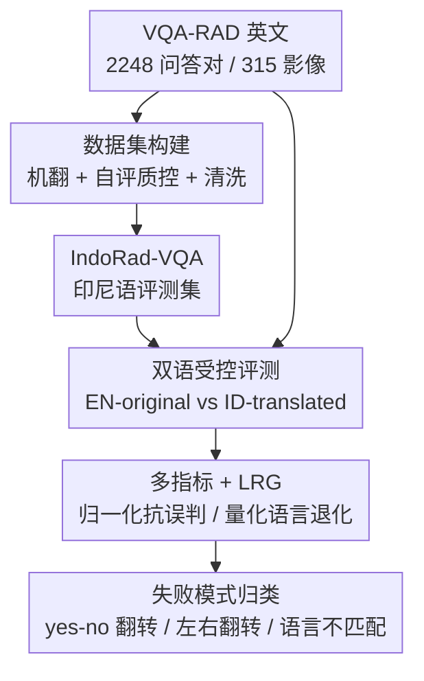

# Does Language Shift Break Medical Vision-Language Models? Indonesian Radiology Visual Question Answering Case Study

**会议**: CVPR 2026  
**arXiv**: [2606.03693](https://arxiv.org/abs/2606.03693)  
**代码**: 待确认（作者承诺发布数据集、归一化词典、prompt 模板与评测脚本）  
**领域**: 多模态VLM / 医学图像 / 评测基准  
**关键词**: 医学VQA、放射学、印尼语、多语言鲁棒性、评测基准

## 一句话总结
作者把英文放射学 VQA 基准 VQA-RAD 翻译成印尼语，构造 IndoRad-VQA，在"图像不变、只换问句语言"的受控设置下评测 7 个开源医学/多语言 VLM，发现哪怕是医学专用模型，换成印尼语提问后准确率普遍掉 8–25%，证明强英文医学 VQA 表现并不能保证非英语临床场景下的鲁棒性。

## 研究背景与动机
**领域现状**：放射学视觉问答（VQA）已成为衡量 VLM 医学能力的关键评测，主流基准如 VQA-RAD、SLAKE 都是让模型看一张放射影像、回答一个临床问题。但这些基准**几乎清一色是英文**，非英语基准要么没有、要么问答对数量远少于英文版。

**现有痛点**：全球大多数人是在非英语环境下就医的。以印尼语（Bahasa Indonesia）为例，它是 2.7 亿人口的母语、也是印尼医院的主要工作语言，却**没有任何专门的印尼语放射学 VQA 基准**。这意味着 VLM 在印尼的临床部署与评测，根本拿不到"目标语言下是否鲁棒"的证据。

**核心矛盾**：现有评测把"视觉推理能力"和"语言能力"耦合在一起，无法分辨一个模型答错到底是没看懂图、还是没听懂非英语的问题。换句话说，英文 benchmark 上的高分可能掩盖了严重的语言偏置。

**本文目标**：回答一个明确的研究问题——在英文放射学 VQA 上表现好的医学 VLM，当临床问题改用印尼语提问时，还能不能保持视觉推理能力？

**切入角度**：作者的关键洞察是"**翻译问句、固定图像**"提供了一个隔离变量的受控实验台。同一张图、语义等价的两个问句（英文 vs 印尼语），如果模型答对英文却答错印尼语，就直接暴露了**语言鲁棒性缺陷**，且能确定这个缺陷是语言驱动而非视觉驱动的。

**核心 idea**：用"同图异语"的成对评测，把语言诱发的失败从视觉推理失败中剥离出来，并用一个 Language Robustness Gap (LRG) 指标量化这种退化。

## 方法详解

### 整体框架
这是一篇**评测基准 + 评测协议**研究，没有训练新模型，全程零样本（zero-shot）。整条管线分三段：先把英文 VQA-RAD 用机器翻译 + 自评质控转成印尼语得到 IndoRad-VQA；再为每个模型在"英文原版"和"印尼语翻译版"两种受控设置下跑推理；最后用一套含归一化与 LRG 的多指标体系评分，并对"英文对、印尼语错"的样本做失败模式归类。

### 关键设计

**1. IndoRad-VQA 数据集构建：用自评质控的机翻保住临床语义**

痛点是印尼语放射学 VQA 根本不存在，而直接机翻又容易把医学术语翻坏、破坏答案等价性。作者以 VQA-RAD 为源（2248 个问答对、315 张影像，覆盖头部轴位 CT/MRI 104 张、胸部 X 光 107 张、腹部轴位 CT 104 张），管线分两步：**Step 1 机器翻译**用开源的 translategemma-4b-it 把所有英文问句和答案翻成印尼语，并 prompt 它在没有标准印尼语对应词时**保留医学术语原文**；**Step 2 自动清洗**做小写化、空白归一，并显式映射二元词对（yes/ya、no/tidak、right/kanan、left/kiri）。整个翻译思路借鉴了 Anak Baik 的自评（self-evaluation）质控管线，目标是同时保住临床含义、术语一致性和答案等价性。最终数据集 schema 保留 `image_id, question_en, answer_en, question_id, answer_id, answer_type, question_type, split` 等字段，做到英印对照可追溯

**2. 双语答案归一化词典：堵住多语言评测的"假错判"**

多语言评测有个经典坑——模型输出了语义正确的同义词（如印尼语 "iya" vs "ya"），却因为精确匹配（exact match）而被判错，即 false penalization。作者手工构造了一个**双语等价词典**（Table 1），把语义相同的多种变体归到同一组再做匹配：例如 Yes 组收录 `yes, ya, iya, benar, betul, ada, positif…`，No 组收录 `no, tidak, bukan, negatif…`，并扩展到解剖/放射学术语（如 Frontal Lobe ↔ lobus frontal、Consolidation ↔ konsolidasi、Liver ↔ hati/hepar）。这个词典在所有准确率评测前统一应用，让"归一化准确率"反映真实的语义正确率，而非格式巧合

**3. 五指标 + LRG 评测协议：把语言退化单独量化出来**

只看一个准确率会丢信息，作者用五个互补指标交叉验证：**Strict Accuracy**（小写去空白后精确匹配）、**Normalized Accuracy**（先过归一化词典再精确匹配）、**Tokenized F1**（预测 token 与人工标注 token 重叠的 precision/recall 均值）、**BERT-Score**（用多语言 bert-base-multilingual-cased 的上下文嵌入做余弦相似度匹配）。最核心的是 **Language Robustness Gap (LRG)**，定义为

$$\text{LRG} = \text{Acc(EN)} - \text{Acc(ID)}$$

正值越大表示语言切换造成的性能退化越严重。所有结果再按问题类型拆成 closed（yes/no）和 open（开放式）两类。两个受控设置分别是 **EN-original**（VQA-RAD 英文原问句，作为 baseline）和 **ID-translated**（印尼语问句 + 印尼语指令）。被评的 7 个模型横跨三类：通用 VLM（Qwen3-VL-8B、InternVL3-2B）、东南亚多语言 VLM（Gemma/Qwen-SEA-LION 系列）、医学专用 VLM（MedVLM-R1、MedGemma-v1.5-4B），全部同图、同问答对、同标准化零样本 prompt，不做任何微调，保证唯一变量是问句语言

**4. 自动化失败模式归类：把"英对印错"的错误拆成可解释类别**

为了解释退化从何而来，作者实现了一个自动错误检测管线，**只筛选"EN 设置答对、ID 设置答错"的样本**，再归类成四种失败模式：**yes/no 翻转**（闭合问题答反）、**laterality flip 左右翻转**（把 kanan/kiri 答错边）、**language-output mismatch 语言不匹配**（收到印尼语 prompt 却用英文作答）、**other（术语/视觉）**。这套归类把抽象的"掉分"变成可定位的临床安全隐患——比如把左侧病灶答成右侧，在放射诊断里是致命错误

### 损失函数 / 训练策略
本研究**不涉及任何训练或微调**，所有模型均为零样本评测，因此无损失函数。唯一的"协议超参"是统一的零样本 prompt 模板与两种语言设置。

## 实验关键数据

### 主实验
在 VQA-RAD 全集（2248 问答对）上评测 7 个模型，EN/ID 为严格准确率，EN*/ID* 为归一化准确率（%）。"↓" 列为印尼语相对英文的退化幅度。

| 模型 | 类型 | EN(strict) | ID(strict) ↓ | EN*(norm) | ID*(norm) ↓ |
|------|------|-----------|-------------|-----------|-------------|
| Qwen3-VL-8B-Instruct | GEN | 51.02 | 16.00 | 51.11 | 40.29 |
| InternVL3-2B | GEN | 41.00 | 25.40 | 41.00 | 29.77 |
| Gemma-SEA-LION-v4-4B-VL | SEA | 40.20 | 21.57 | 40.42 | 36.90 |
| Qwen-SEA-LION-v4-4B-VL | SEA | 48.17 | 18.00 | 48.26 | 41.13 |
| Qwen-SEA-LION-v4-8B-VL | SEA | 50.53 | 17.96 | 50.62 | 41.18 |
| MedVLM-R1 | MED | 37.17 | 12.52 | 37.34 | 30.57 |
| MedGemma-v1.5-4B | MED | 50.62 | 25.45 | 50.98 | 44.39 |

> ⚠️ 原文表中 ID/ID* 列直接给的是带"↓"的数值，难以确定是"印尼语绝对得分"还是"退化幅度"，此处按原文表格原样转录，具体语义以原文为准。

### 语言鲁棒性差距（按指标聚合，Table 3）
| 指标 | EN | ID | LRG (=EN−ID) |
|------|-----|-----|------|
| Strict | 45.09 | 19.82 | 25.27 |
| Normalized | 45.25 | 37.18 | 8.07 |
| F1 Tokenized | 49.20 | 40.66 | 8.54 |
| BERT Score | 53.85 | 43.63 | 10.21 |

### 失败模式分布（Table 4，仅统计"EN 对、ID 错"，n=7990）
| 错误类型 | 数量 | 占比 |
|---------|------|------|
| Yes/No 翻转 | 1224 | 15.3% |
| Laterality 左右翻转 | 18 | 0.2% |
| Language-output 语言不匹配 | 89 | 1.1% |
| Other（术语 / 视觉） | 6659 | 83.3% |

### 关键发现
- **退化是普遍且一致的**：所有 7 个模型在印尼语设置下都明显掉分，整体 LRG 在 8–25% 区间，取决于用哪个指标。
- **医学专用训练救不了语言**：MedVLM-R1、MedGemma 这类领域专用模型同样大幅退化，说明缺陷是**语言驱动而非视觉驱动**——临床领域训练并没有缓解 VLM 固有的英语中心偏置。
- **严格准确率受语言冲击最大**：Strict 的 LRG（25.27）几乎是其他指标（8–10）的 2–3 倍，差出近 20 个百分点，说明大量印尼语答案其实**语义正确**，只是没能精确匹配 ground-truth 格式——归一化能挽回相当一部分。
- **错误以术语/视觉为主**：83.3% 的"英对印错"样本属于 other（术语+视觉），yes/no 翻转（15.3%）是最突出的语言诱发失败类别；左右翻转和语言不匹配虽少（0.2%、1.1%），但揭示了可解释、临床上危险的失败模式。

## 亮点与洞察
- **"同图异语"受控设计很干净**：固定图像、只改问句语言，让语言鲁棒性可以被单独剥离出来量化——这是把"答错"归因到语言而非视觉的关键，方法论可直接迁移到任何语言/任何医学 VQA 基准。
- **归一化词典暴露了评测指标本身的偏差**：Strict 与 Normalized 之间近 20% 的鸿沟提醒大家，多语言评测里精确匹配会系统性低估非英语模型；做跨语言评测前必须先建等价词典，否则结论会被"假错判"污染。
- **LRG 是个简单但有用的标量**：用一个 EN−ID 的差值就能横向比较不同模型"抗语言漂移"的能力，便于做榜单和模型选型。
- **失败模式归类把抽象退化落到临床安全**：左右翻转、yes/no 翻转这类错误在放射诊断里直接关系患者安全，把掉分翻译成"哪种临床错误变多了"比单看准确率有价值得多。

## 局限与展望
- **作者自承的局限**：① 只在单个放射学 VQA 数据集（VQA-RAD）上验证，计划后续合并多个开源放射数据集；② 翻译只用了单个 4B 机翻模型 TranslateGemma（因算力限制没用 12B/27B 变体），翻译质量可能受限；③ 全部是零样本评测，未探索 few-shot / 微调；④ 医学正确性靠**自评**而非放射科医生人工审核，临床可信度存疑；⑤ 明确声明结果**不能**当作临床部署就绪的证据。
- **自己发现的局限**：主结果表（Table 2）中 ID/ID* 列的数值语义（绝对分 vs 退化量）在转录中存在歧义，且 LRG 的横向比较受不同模型英文基线差异影响，"掉得多"不一定等于"印尼语更差"，需结合 ID 绝对分一起看。
- **改进思路**：引入放射科医生对翻译与答案做人工校验、用更大机翻模型或人工翻译做对照、把基准扩到 SLAKE 等多源数据、补充 few-shot 与轻量微调能否缩小 LRG 的实验。

## 相关工作与启发
- **vs VQA-RAD / SLAKE**：这些是本文的英文源基准，只评英文视觉推理；本文在其上做印尼语适配，把评测维度从"会不会看图"扩展到"换语言还会不会看图"。
- **vs 现有多语言医学 VQA 基准**：少数非英语基准问答对规模远小于英文版且不专门隔离语言变量；本文用"同图异语"成对设计 + LRG，专门量化语言漂移，填补印尼语空白。
- **vs Anak Baik 翻译管线**：本文的自评质控翻译思路借鉴自 Anak Baik（伦理指令的英印翻译集），把"自评质控机翻"从文本任务迁移到了多模态医学 VQA 的术语敏感场景。

## 评分
- 新颖性: ⭐⭐⭐⭐ 首个印尼语放射学 VQA 基准 + LRG 指标，"同图异语"受控设计干净，但方法上是已有 benchmark 的语言适配，技术新意有限
- 实验充分度: ⭐⭐⭐ 覆盖 7 个跨类别模型、五指标 + 失败模式归类较全面，但单数据集、单机翻模型、纯零样本、无医生审核限制了说服力
- 写作质量: ⭐⭐⭐⭐ 动机清晰、研究问题明确、表格组织合理，主结果表数值语义略有歧义
- 价值: ⭐⭐⭐⭐ 揭示"英文 SOTA ≠ 非英语鲁棒"且"医学专训救不了语言偏置"，对低资源语言医学 AI 的评测与部署有现实警示意义

<!-- RELATED:START -->

## 相关论文

- [\[CVPR 2026\] VQ-VA World: Towards High-Quality Visual Question-Visual Answering](vq-va_world_towards_high-quality_visual_question-visual_answering.md)
- [\[ICLR 2026\] How Do Medical MLLMs Fail? A Study on Visual Grounding in Medical Images](../../ICLR2026/multimodal_vlm/how_do_medical_mllms_fail_a_study_on_visual_grounding_in_medical_images.md)
- [\[CVPR 2026\] StaR-KVQA: Structured Reasoning Traces for Implicit-Knowledge Visual Question Answering](star-kvqa_structured_reasoning_traces_for_implicit-knowledge_visual_question_ans.md)
- [\[ACL 2026\] WikiSeeker: Rethinking the Role of Vision-Language Models in Knowledge-Based Visual Question Answering](../../ACL2026/multimodal_vlm/wikiseeker_rethinking_the_role_of_vision-language_models_in_knowledge-based_visu.md)
- [\[CVPR 2026\] DocPrune: Efficient Document Question Answering via Background, Question, and Comprehension-aware Token Pruning](docpruneefficient_document_question_answering_via_background_question_and_compre.md)

<!-- RELATED:END -->
