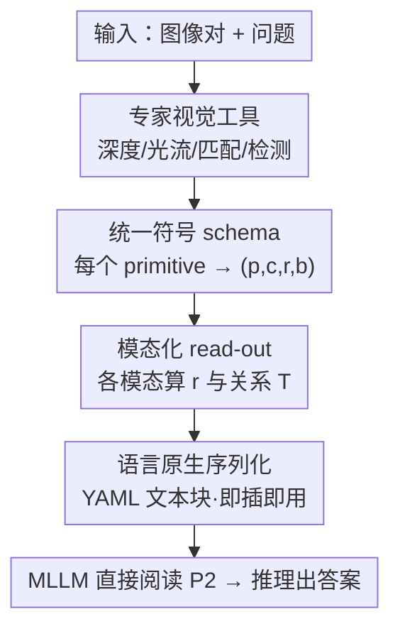

# Don't Show Pixels, Show Cues: Unlocking Visual Tool Reasoning in Language Models via Perception Programs

**会议**: CVPR 2026  
**论文**: [CVF Open Access](https://openaccess.thecvf.com/content/CVPR2026/html/Janjua_Dont_Show_Pixels_Show_Cues_Unlocking_Visual_Tool_Reasoning_in_CVPR_2026_paper.html)  
**代码**: https://github.com/AISmartPerception/perception-programs  
**领域**: 多模态VLM  
**关键词**: 视觉工具推理, Perception Program, 训练无关, 多模态LLM, 表示对齐  

## 一句话总结
给 MLLM 接深度/光流/匹配等视觉工具时，瓶颈不在工具调用次数或模型大小，而在"工具输出怎么喂"——本文提出 Perception Program（P2），把原始稠密像素级工具输出**改写成紧凑、结构化、语言原生的符号摘要**，免训练、免改架构地插进任意 MLLM，在 BLINK 六个感知任务上平均涨 19.66%，GPT-5 Mini 的多视角推理从 41.35% 飙到 86.47%。

## 研究背景与动机
**领域现状**：现在的主流做法是给 MLLM 配上视觉工具（单目深度、光流、视觉对应、目标检测等），让模型借助这些"感知信号"去做像素里读不出来的视觉推理（如相对深度、相机左右移动）。常规接法是把工具输出序列化后直接塞给模型当辅助输入。

**现有痛点**：即便拿到了准确的工具输出，MLLM 也经常用不起来。原始工具输出是稠密的、像素级的低层张量（一整张深度图、一整片光流场），序列化后变成一大堆数值 token，和 LLM 擅长的"语言原生"推理基底是错位的。结果模型要么忽略这些信号、退回去靠语言先验瞎猜，要么被噪声带偏——论文实测发现：给 Raw Tool 反而可能**有害**（Gemini 2.5 Pro 在多视角推理上接了原始光流后掉了 14.29%）。

**核心矛盾**：视觉工具输出的**表示形式**（稠密像素数值）与 LLM 的推理能力（语言符号）之间存在根本错配。以往的补救——程序合成（VisProg/ViperGPT 生成代码调工具）、思维链工具调用（Aurora/Mirage）、SFT/RL 微调、专用感知模块——要么加算力、要么要训练，而且**仍停在像素级粒度**，没解决表示错配这件事本身。

**切入角度**：作者类比人类的"线索提取"——人看深度问题靠的是表面远近感、看朝向靠的是左右移动、看对应靠的是局部相似度，而不是逐像素处理。把每类问题里的**关键线索转写成文本**，能大幅降低模型处理像素细节的负担，因为文本才是和 LLM 原生推理最对齐的表示。

**核心 idea**：用"语言原生的符号摘要"代替"原始像素工具输出"——同一份工具输出，不直接喂，而是先 digest 成一个标准化结构（讲清"有什么 / 在哪 / 彼此什么关系"），让 MLLM 真正"读懂"这个模态，而非从稠密数值里猜。

## 方法详解

### 整体框架
P2（Perception Program）是一个**免训练、模型无关、即插即用**的中间表示层：它不改 MLLM 的任何参数、不改架构、推理时也不增加额外工具调用，唯一做的事是把"专家工具的原始输出"翻译成"语言原生的符号程序"，再连同图像和问题一起交给现成 MLLM。整条管线是：输入图像对 + 问题 → 专家工具产出原始模态（深度图/光流场/对应点…）→ **P2 生成器**把它转写成统一 schema 的符号项 + 关系 → 序列化成 YAML 风格文本块 → MLLM 直接阅读并推理出答案。

和两个对照设置的区别就藏在"喂什么"这一步：标准设置只给图+题（模型欠用视觉信号），Tool 设置额外给**原始像素级**工具输出（暴露了模态但仍是像素），而 P2 设置给的是**消化过的语言原生结构**——同一份工具信号，换个表示，模型就从"猜"变成"读"。

### 关键设计

**1. 统一符号 schema：把任意视觉工具输出归一成"四元组 + 关系三元组"**

痛点是不同模态的工具输出形态各异（深度是标量场、光流是矢量场、对应是点对、检测是框），各写各的喂法既不统一也都停在像素级。P2 用一套**跨模态不变的 item schema** 统一它们：把像素域 $\Omega=\{0,\dots,W{-}1\}\times\{0,\dots,H{-}1\}$ 上离散出一组 primitive $p\in P$，每个 primitive 关联一个空间支撑 $S_p\subseteq\Omega$（可以是一个 patch、一个点、一整张图）和一个**归一化坐标** $c_p\in\{0,\dots,1000\}^2$——任意像素 $(x,y)$ 都映射到 $(\lfloor 1000x/W\rfloor,\lfloor 1000y/H\rfloor)$，区域则取中心再归一化。每个 primitive 吐出一个结构化项

$$I_p = (p,\, c_p,\, r_p,\, b_p),$$

其中 $p$ 是 primitive 标识，$c_p$ 是归一化坐标，$r_p$ 是该模态在 $S_p$ 上的**读数（reading）**，$b_p$ 是可选标签。此外 P2 可携带一组稀疏的**符号关系三元组** $(p_a,\pi,p_b)$（$\pi$ 是谓词名，如 darker than、adjacent to、in-front of），由比较 primitive 之间的统计量生成。算法上就是 ExtractPrimitives → 逐个抽坐标/读数/标签 → 收集所有读数算关系 T。这套 schema 的妙处在于：模态之间只有三处变化（怎么算 $r_p$、要不要 $b_p$、发不发关系），骨架完全一致，于是 LLM 学会读一种就会读所有。

**2. 模态化 read-out：同一 schema 下，让每个视觉模态都被翻译成"会读的语言"**

统一骨架之后，真正决定信息保不保真的是各模态怎么定义读数 $r_p$ 和关系。这一步是 P2 把"像素证据"压成"语言线索"的核心：

- **深度**：工具给出标量场 $D:\Omega\to[0,1]$（值越大越近），切成 $P\times P$ 规则网格，每个 cell 的读数是该 cell 内深度的极值对 $r_p=(\min_{(x,y)\in S_p}D,\ \max_{(x,y)\in S_p}D)$；再在 4-邻域上，按 cell 平均深度 $\mu_p$ 之差是否超过小余量 $\tau$ 发"谁在前"的关系：$\mu_a>\mu_b+\tau$ 则 $(a,\text{in-front of},b)$。$\tau$ 用来抑制微小差异引起的假关系。
- **光流**：矢量场 $F=(u,v)$，取水平分量，网格内算均值 $\bar u_p$，读数直接二值化成方向词 $r_p=\text{'left'}$（$\bar u_p<0$）或 $\text{'right'}$（$\bar u_p\ge 0$）——多视角推理问的就是相机左右移，于是把光流直接翻成"左/右"。
- **视觉对应**：不建网格，每条匹配把参考点归一化设为 $c_i$、目标点设为 $r_i$，即"从这点连到那点"。
- **拼图（jigsaw）**：缺口在右下角、两个候选片 A/B，primitive 是候选片 × 边的组合 $\{(\text{left},A),(\text{top},A),(\text{left},B),(\text{top},B)\}$，读数 $r_p\in[0,1]$ 是缺口边条与候选边条之间结构/边缘/颜色相似度的平均。
- **目标检测**：每个检测当一个 primitive，$c_p$=归一化框，$r_p$=置信度，$b_p$=类别标签。
- **语义对应**：源图一点对目标图四个候选 $\{A,B,C,D\}$，$c_p$=候选点归一化坐标，$r_p$=专家特征相似度。

可以看到，"如何 read-out"才是把模态翻译给 LLM 的关键——深度被翻成"远近极值 + 谁在前"，光流被翻成"左/右"，对应被翻成"哪连哪"。这些都是人类做这些题时真正用的线索，而非整张图的数值。

**3. 语言原生序列化 + 训练无关的即插即用**

P2 把上面的 schema 序列化成一个 **YAML 风格文本块**，把"有什么、在哪、彼此什么关系"用语言一次性铺给模型——这正是 LLM 推理基底最对齐的格式，于是模型可以"直接读"而不是"从稠密 token 里反推"。整个过程不更新 MLLM 任何参数、不改架构、推理时不额外调工具，是真正的 plug-and-play：原本喂给标准工具管线的同一份工具输出，换成它的 P2 实例化版本即可，且能套进任何 agent-and-tool 流水线（论文实测把 Visual Sketchpad 里的工具换成 P2 版本就能稳涨）。这也是它和程序合成/CoT 工具/微调路线的根本区别——别人加算力、要训练、停在像素级，P2 只动"表示"这一层、零训练。

## 实验关键数据

### 主实验
评测基准是 **BLINK** 中六个以感知为核心的子任务：多视角推理、相对深度（用更难的 HardBLINK 变体）、视觉对应、拼图、语义对应、目标定位。每个任务配一个现成专家工具（深度用 DepthAnything、光流用 RAFT、视觉对应用 LoFTR、语义对应用 DIFT、检测用 LLMDet）。每个 MLLM 对比三种设置：Standard（只图+题）、Raw Tool（额外给原始工具输出）、P2（同一工具输出转成 P2）。

GPT-5 Mini 上三种设置的对比（准确率 %，加 prior SOTA 行）：

| 任务 | Standard | Raw Tool | P2（本文） | Prior SOTA |
|------|---------|----------|-----------|-----------|
| 多视角推理 | 41.35 | 45.11 | **86.47** | 60.20 |
| HardBLINK 深度 | 52.42 | 65.05 | **81.45** | 61.56 |
| 视觉对应 | 76.74 | 75.58 | **94.19** | 85.50 |
| 拼图 | 76.00 | 66.00 | **91.33** | 88.00 |
| 目标定位 | 58.20 | 59.02 | **93.44** | 65.40 |
| 语义对应 | 53.24 | 53.24 | **64.03** | 58.30 |

P2 在所有六个任务上把 GPT-5 Mini 推到了新 SOTA；跨任务总体相对 prior best 平均 **+19.66%**。注意 Raw Tool 列：相对 Standard 经常只是中性甚至更差（拼图从 76→66），说明"把原始工具输出直接接上去"远不够。

### 跨模型与小模型
P2 对小模型同样大涨，4B 级模型加 P2 后可追平基础版 GPT-5 Mini / Gemini 2.5 Pro：

| 模型 | 设置 | 多视角 | 深度 | 目标定位 | 语义对应 |
|------|------|-------|------|---------|---------|
| Qwen3VL-4B | Standard | 45.90 | 47.04 | 54.92 | 61.87 |
| Qwen3VL-4B | **P2** | **93.98** | **61.02** | **85.25** | **64.03** |
| InternVL3.5-4B | Standard | 45.86 | 40.59 | 56.56 | 45.32 |
| InternVL3.5-4B | **P2** | **94.73** | **69.89** | **90.16** | **62.59** |

即便用比 prior work 小得多的 InternVL3.5-4B / Qwen3VL-4B，P2 也能反超用 GPT-4o 当 LLM 的 MMFactory（60.20/85.50/58.30）以及 Thyme、LATTE 等需要训练的工具推理方法。大模型上平均涨 19.48%，小开源模型上涨 22.18%。

### 即插即用（Plug-and-Play）
把 P2 接进 agentic 框架 Visual Sketchpad（GPT-5 Mini 为底），替换部分工具为 P2 版本：

| 配置 | HardBLINK-3 | HardBLINK-4 | HardBLINK-5 | 目标定位 |
|------|------------|------------|------------|---------|
| Visual Sketchpad | 71.77 | 62.90 | 56.45 | 60.43 |
| **VS + P2** | **81.45** | **83.06** | **79.84** | **80.33** |

深度与定位任务上稳定大涨，证明 P2 不是只在自家管线里有效，而是能给已有 agent 框架直接续命。

### 关键发现
- **瓶颈是表示，不是工具调用或模型大小**：同一份工具输出，换成语言原生表示就能从"猜"变"读"，这是全文最核心的实证。
- **MLLM 读不懂稠密深度图**：让 GPT-5 Mini 把被遮挡的深度读数补全，随网格变细，重建与真值的 Kendall's τ 迅速趋近 0——3×3 还行，更细就崩，说明模型保不住"近到远"的相对排序。
- **视觉对应里模型在抄答案**：要它从对应线里填目标坐标，误差图呈强对角结构，说明它常把左图坐标直接复制到右图字段，即神经网络在"复读输入"而非推理。
- **CoT 反而帮倒忙**：鼓励模型显式口头描述视觉线索会产生噪声描述、拉低性能——这进一步说明问题在表示，不是在"想得不够多"。

## 亮点与洞察
- **"换表示而非加算力"的清醒判断**：在大家忙着多调工具、加 RL、堆参数时，本文把问题精确定位到"工具输出的表示形式"，并用 Kendall's τ→0、坐标复制这类干净的诊断实验把"模型读不懂像素"坐实——这种"先证明瓶颈在哪、再对症"的科学态度很值得学。
- **统一 schema 的迁移性**：$(p,c_p,r_p,b_p)$ + 关系三元组这套四元组骨架，本质是"把任意视觉证据离散成带坐标的符号项 + 它们的关系"，可以直接迁移到深度/光流/检测之外的新模态——只要能定义"primitive 是什么、读数怎么算、要不要发关系"。
- **归一化到 [0,1000] 的坐标技巧**：把所有空间位置统一映射到固定整数网格，让 LLM 在不同分辨率图像上看到的是同一套坐标语义，是个很实用、可复用的"给 LLM 喂空间信息"的小 trick。
- **免训练 + plug-and-play 的工程价值极高**：不动模型、不调工具序列，直接给现有 agent 框架的工具输出套一层 P2 就涨点，落地几乎零成本。

## 局限与展望
- **作者承认的范围限制**：只评了有清晰工具替身的六个 BLINK 子任务；更广的设置（深度之外的 3D 推理、通用 VQA）可能需要更丰富或层次化的 program，本文没研究。
- **不做工具选择/编排**：沿用 BLINK 给定的工具配对，推理时不探索工具序列或组合——这块留给未来的动态工具选择。
- **工具误差会传播**：P2 忠实传递上游工具产出的证据，工具错了 P2 就跟着错，本文不做工具校准或冲突调和（不过作者观察到前沿 LLM 对此有一定鲁棒性）。
- **自己发现的**：read-out 的设计（如深度切几格、光流二值化方向）目前是按任务手工定制的，⚠️ 论文未充分讨论这套手工 read-out 规则在新任务上的可扩展性与自动化——换个任务可能又得重新设计一套 read-out 与关系谓词。

## 相关工作与启发
- **vs 程序合成（VisProg / ViperGPT / Thyme）**: 他们让 MLLM 合成可执行代码去调工具，需要多次 LLM 调用 + 沙箱执行、算力重，且在多图设置上吃力；本文不生成代码、不执行程序，只把工具输出转成可读的符号摘要，零执行、零训练。
- **vs 思维链工具（Aurora / Mirage / Visual Sketchpad / LATTE）**: 他们把工具调用编进推理链（感知 token、潜在想象、草图、或在带工具输出的数据上微调），但**仍在像素级粒度**操作，继承了视觉编码器欠用的问题；P2 的根本区别是把粒度从像素抬到语言符号，因此能跨架构、跨规模稳定涨点，且能反向把 P2 插回这些 agent 框架里增强它们。
- **vs 直接接 Raw Tool**: 同一工具输出，直接接是中性甚至有害（Gemini 多视角 −14.29%），转成 P2 则大涨——这组对照是全文最有力的"表示决定一切"的证据。

## 评分
- 新颖性: ⭐⭐⭐⭐⭐ 把"工具增强 MLLM 的瓶颈"重新定义为表示问题，并给出免训练、跨模态统一的语言原生 schema，视角清新且锋利。
- 实验充分度: ⭐⭐⭐⭐⭐ 6 任务 × 5 模型 × 3 设置全覆盖，外加 Kendall's τ、坐标复制等机理诊断和 plug-and-play 验证，证据链完整。
- 写作质量: ⭐⭐⭐⭐ schema 形式化清楚、动机讲得透；各模态 read-out 细节略多，需要对照图才好读全。
- 价值: ⭐⭐⭐⭐⭐ 免训练、即插即用、对小模型也大涨，落地成本极低，对工具增强 MLLM 是很实用的范式。

<!-- RELATED:START -->

## 相关论文

- [\[CVPR 2026\] Perception Programs: Unlocking Visual Tool Reasoning in Language Models](perception_programs_visual_tool_reasoning.md)
- [\[CVPR 2026\] Synthesizing Visual Concepts as Vision-Language Programs](synthesizing_visual_concepts_as_vision-language_programs.md)
- [\[CVPR 2026\] Proof-of-Perception: Certified Tool-Using Multimodal Reasoning with Compositional Conformal Guarantees](pop_proof_of_perception_conformal_reasoning.md)
- [\[CVPR 2026\] Visual Reasoning through Tool-supervised Reinforcement Learning](visual_reasoning_through_tool-supervised_reinforcement_learning.md)
- [\[CVPR 2026\] CodeDance: A Dynamic Tool-integrated MLLM for Executable Visual Reasoning](codedance_a_dynamic_tool-integrated_mllm_for_executable_visual_reasoning.md)

<!-- RELATED:END -->
