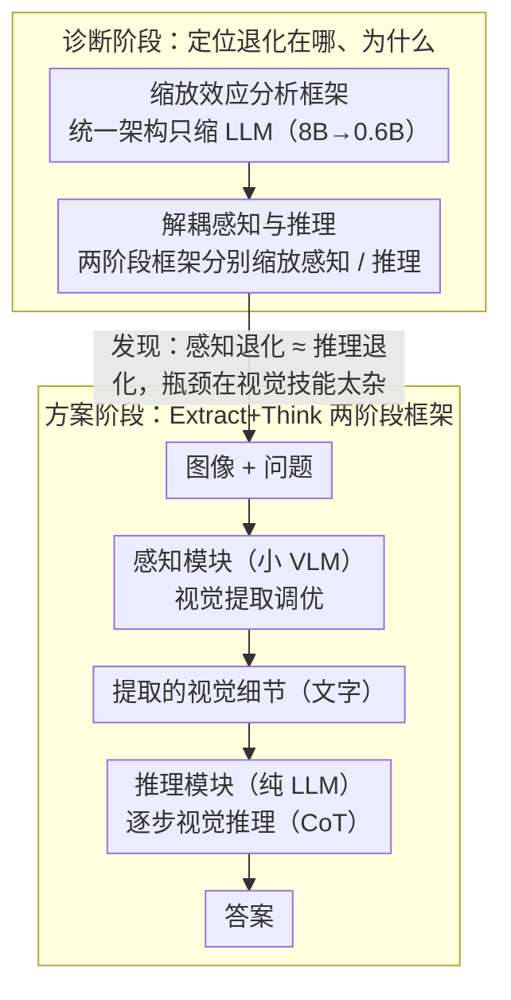

# Downscaling Intelligence: Exploring Perception and Reasoning Bottlenecks in Small VLMs

**会议**: CVPR 2026  
**arXiv**: [2511.17487](https://arxiv.org/abs/2511.17487)  
**代码**: [https://web.stanford.edu/~markendo/projects/downscaling_intelligence](https://web.stanford.edu/~markendo/projects/downscaling_intelligence) (有项目页面)  
**领域**: Multimodal VLM / Small Language Models  
**关键词**: 多模态模型缩放, 感知瓶颈, 推理瓶颈, 视觉提取调优, 小模型

## 一句话总结
系统研究LLM缩放对多模态能力的影响，发现视觉任务而非LLM依赖任务受影响最大，且感知退化与推理退化同等严重；提出Extract+Think方法（视觉提取调优+逐步推理），以0.6B感知+1.7B推理的极小模型超越了12倍大的PrismCaptioner和LLaVA-OneVision-0.5B。

## 研究背景与动机

多模态大语言模型（MLLMs）在视觉理解和推理方面取得了显著进展，但实际部署需要小型高效模型。当前**小模型研究的核心困惑**是：缩小LLM骨干后，哪些能力退化最严重？为什么？现有研究结论矛盾——有的认为LLM缩放对感知影响不大，有的发现OCR等感知密集任务高度敏感。

本文的研究动机分三个层次：

**理解实际限制**：系统量化从8B缩到0.6B后哪些任务受影响最大

**揭示失败机制**：视觉能力退化是因为推理变差（预期中的），还是更基础的感知能力也在退化（意外的）？

**开发针对性解决方案**：基于发现的瓶颈设计改进方法

**核心发现**：LLM缩放不成比例地影响视觉任务（而非LLM固有任务如知识问答），且**感知退化与推理退化同等严重甚至更严重**——这推翻了此前"感知对LLM规模不敏感"的假设。**切入角度**：感知瓶颈源于视觉指令调优要求模型学习过多多样化的视觉提取技能，小模型容量不足以掌握。

## 方法详解

### 整体框架
这篇论文要回答两个递进的问题：把 LLM 骨干从 8B 缩到 0.6B，小 VLM 到底退化在哪、为什么退化，以及怎么针对性地补回来。前半篇是诊断——用一套控制性实验把"退化"拆成感知和推理两条线分别量化；后半篇是方案——基于诊断结论提出 Extract+Think。

Extract+Think 把"看图回答"显式拆成两步串联：图像和问题先进**感知模块**（一个小 VLM），它只负责把与问题相关的视觉细节用文字提取出来；这段文字再连同问题喂给**推理模块**（一个纯 LLM），由它逐步推理给出答案。两个模块都用 Qwen3 系列，感知用 0.6B 或 1.7B VLM，推理用 1.7B 或 4B LLM。这样拆开的好处是，感知和推理各自的瓶颈可以被单独诊断、也可以被单独治疗。

### 关键设计

**1. 缩放效应分析框架：先把"小模型退化在哪"量化清楚**

在动手改进之前，作者要先确认退化集中在哪类任务。他们固定一套统一架构——Qwen3 骨干（依次取 8B、4B、1.7B、0.6B）+ SigLIP 视觉编码器 + 2 层 MLP 连接器，在 15 个视觉指令调优数据集上用同样的配方训练和评估，唯一变量就是 LLM 规模。结果落在两条清晰的规律上：一是退化最狠的全是视觉密集型任务（Grounding 从 8B 到 0.6B 掉了 48%、感知相似度掉 38%），而 ScienceQA 这类靠 LLM 自带知识的任务几乎纹丝不动；二是一个任务越依赖图像里的视觉信息，它对 LLM 缩放就越敏感，两者近乎线性相关。这组实证直接推翻了"小模型主要是推理在退化"的直觉——掉得最多的恰恰是看图本身。

**2. 解耦感知与推理：证明感知退化和推理退化一样严重**

光看任务级别的下降还分不清，视觉任务退化究竟是"看不清"还是"想不通"。作者借 Prism 的思路把一次问答切成两段独立可缩放的阶段：第一段由 VLM 把图像信息转成文字（感知），第二段由 LLM 在纯文本上推理（推理），然后分别只缩放其中一段、另一段保持大模型不变，看性能各掉多少。结论出人意料：单缩放感知模块（8B→0.6B）造成的下降几乎和单缩放推理模块一样大，域内平均准确率掉约 0.15；即便在 Instance Reasoning、Logical Reasoning 这类看似纯推理的任务上，缩小感知模块的伤害也和缩小推理模块相当。

这一步之所以重要，是因为它直接戳破了 Prism 原文的假设——Prism 用 1.8B 做感知配 70B 做推理，前提是"感知对 LLM 规模不敏感"。本文用同样的解耦框架证明这个前提在小模型区间站不住。作者进一步借 Neural Scaling Laws 的量化模型给出解释：模型能掌握的技能被"量化"成离散的块，规模越小能装下的块越少；而视觉指令调优要求模型同时掌握太多种类的视觉提取技能，小模型的容量根本覆盖不全，于是感知先崩。

**3. 视觉提取调优（Visual Extraction Tuning）：把杂多的视觉技能收敛成一种**

既然瓶颈是"要学的视觉技能太杂"，那就从训练目标上把它统一掉。作者把现成的视觉指令调优数据改造成一种单一形式的视觉提取任务：先把原始的问答对改写成陈述句，再构造提示让模型去描述与这条陈述相关的细粒度视觉细节，最后用 Qwen3VL-8B 生成这些提取式回答当作训练标签，总共 382K 样本用来后训练感知模块。改造之后，感知模块要学的不再是 N 种任务格式之间反复切换，而只是"提取与问题相关的视觉信息"这一种技能。

这里一个自然的对照是直接拿 Captioning 来统一格式，但描述式数据有两个毛病：它不教模型针对问题去提取信息，而且通用描述数据缺乏领域特定的理解。视觉提取调优一次解决这两点——它让提取既是统一的、又是和问题对齐的。

**4. 逐步视觉推理（Step-by-step Reasoning）：让推理端把提取出的信息用足**

两阶段框架里文字是连接感知和推理的桥梁，这意味着只要在推理端加 CoT 就能直接增强推理，完全不必再碰视觉训练。作者直接复用 Qwen3 的思维模式（thinking mode）激活链式推理，并用 NoWait 抑制过度的自我反思、把思维预算限制在 4096 tokens 以内。一个有意思的观察是 CoT 的收益和规模呈倒 U 形：8B 本身已经够强，加 CoT 提升有限；0.6B 推理能力太弱，CoT 也带不动；真正获益最大的是 4B、1.7B 这种中间规模。

### 损失函数 / 训练策略
- 感知模块训练：先预训练连接器（BLIP558K）→ 视觉指令调优（单图574K+多图309K+150K单图）→ Captioning后训练（ALLaVA-4V 950K）→ 视觉提取调优（382K）
- 推理模块：直接使用Qwen3，不需额外训练
- 从头训练变体（Extract+Think†）：仅用视觉提取调优数据（382K），不经过指令调优和captioning

## 实验关键数据

### 主实验：与基线方法对比

| 方法 | 感知/推理规模 | 视觉数据量 | 域内平均 | MMStar |
|------|:---:|:---:|:---:|:---:|
| LLaVA-OneVision | 0.5B E2E | 8.8M | 71.1 | 39.0 |
| InternVL2.5 | 0.5B E2E | 64M | 83.2 | 48.2 |
| PrismCaptioner | 7B/70B | 1.9M | 78.3 | 45.7 |
| Baseline (§3) | 0.6B E2E | 1.0M | 65.9 | 37.2 |
| Caption+Think | 0.6B/1.7B | 2.0M | 75.0 | 43.0 |
| **Extract+Think** | **0.6B/1.7B** | **2.4M** | **80.3** | **46.6** |
| **Extract+Think** | **1.7B/4.0B** | **2.4M** | **85.3** | **52.6** |

### 消融实验：视觉提取调优效果

| 感知模块 | 域内 | MMStar | 说明 |
|----------|:---:|:---:|------|
| Captioning 0.6B | 77.6 | 40.4 | 纯caption基线 |
| + Visual Extraction 0.6B | **82.8** | **44.0** | +5.2/+3.6提升 |
| Captioning 1.7B | 80.3 | 44.4 | 纯caption基线 |
| + Visual Extraction 1.7B | **84.4** | **49.0** | +4.1/+4.6提升 |

### 关键发现
- **视觉任务受LLM缩放影响最大**：Grounding从8B到0.6B下降48%，而ScienceQA几乎不变。任务对视觉信息依赖度与其对LLM缩放的敏感度呈线性关系
- **感知退化≈推理退化**：解耦分析中，缩放感知模块的性能下降与缩放推理模块相当，甚至在推理任务(IR/LR)上感知缩放的影响更大
- **视觉提取调优极高效**：Extract+Think†从头训练仅用382K视觉数据（LLaVA-OneVision的4.3%），域内性能却超过后者
- **CoT推理在中间规模最有效**：0.6B太小无法充分利用CoT，8B已足够强不需要CoT，4B和1.7B获益最大
- Extract+Think (0.6B/1.7B) 用比PrismCaptioner小12倍的感知模块和小41倍的推理模块，在域内和域外都超越了它

## 亮点与洞察
- **"感知也是核心瓶颈"的反直觉发现**——此前普遍认为小模型主要在推理上吃亏（毕竟LLM规模直觉上影响推理能力），但本文发现感知退化同等严重。这改变了小模型优化的优先级
- **Neural Scaling Laws量化模型的解释力**——用技能被"量化"为离散块的理论解释为什么视觉指令调优的多样性会放大感知瓶颈，小模型能学的技能块太少→覆盖不了所有感知模式
- **视觉提取调优的idea优雅且实用**——与其让小模型学N种不同的视觉理解方式，不如统一为"提取与问题相关的视觉细节"一种技能。数据生成流程也足够简单
- **两阶段解耦的分析价值**——即使不使用Extract+Think做部署，解耦分析本身就为小模型研究提供了全新的诊断工具

## 局限与展望
- 两阶段框架增加了推理延迟（需要两次模型前向），对实时应用不够友好
- 感知模块的文本输出可能丢失细粒度视觉信息（文本作为视觉和推理的桥梁有信息瓶颈）
- 视觉提取调优依赖Qwen3VL-8B生成训练数据，存在教师模型偏差
- 仅在Qwen3系列上验证，跨架构（如LLaMA、Gemma）的泛化性未知
- 视觉编码器（SigLIP）在所有实验中保持不变，未分析其缩放对感知的影响
- CoT推理增加了输出长度→推理成本增加，限制思维预算(4096 tokens)对复杂推理可能不够

## 相关工作与启发
- **vs Prism框架**：Prism假设感知对LLM规模不敏感（用小LLM做感知+大LLM推理），本文推翻了这个假设并提出视觉提取调优作为替代
- **vs LLaVA-OneVision**：端到端训练用了8.8M视觉数据，Extract+Think†仅用382K（95%的数据节省）就超越了0.5B版本
- **vs VLM失败分析工作**：此前聚焦大模型的失败模式（如视觉信息未被充分利用），本文首次系统分析小模型的特有失败机制
- 视觉提取调优的思路可以推广到其他需要统一异构任务的场景——核心启发是"减少技能多样性，专注核心能力"

## 评分
- 新颖性: ⭐⭐⭐⭐⭐ 感知瓶颈的发现改变了领域认知，视觉提取调优概念新颖且有理论支撑
- 实验充分度: ⭐⭐⭐⭐⭐ 15个任务×4个模型规模×解耦分析×消融实验×多种基线，分析极为系统
- 写作质量: ⭐⭐⭐⭐⭐ 从发现问题→分析原因→提出方案的递进结构非常清晰
- 价值: ⭐⭐⭐⭐⭐ 对小模型VLM研究有方法论和实践两方面的深远影响

<!-- RELATED:START -->

## 相关论文

- [\[CVPR 2026\] Nano-EmoX: Unifying Multimodal Emotional Intelligence from Perception to Empathy](nano-emox_unifying_multimodal_emotional_intelligence_from_perception_to_empathy.md)
- [\[ICLR 2026\] Empowering Small VLMs to Think with Dynamic Memorization and Exploration](../../ICLR2026/multimodal_vlm/empowering_small_vlms_to_think_with_dynamic_memorization_and_exploration.md)
- [\[CVPR 2026\] SpatialScore: Towards Comprehensive Evaluation for Spatial Intelligence](spatialscore_towards_comprehensive_evaluation_for_spatial_intelligence.md)
- [\[CVPR 2026\] Scaling Spatial Intelligence with Multimodal Foundation Models](scaling_spatial_intelligence_with_multimodal_foundation_models.md)
- [\[CVPR 2026\] Proof-of-Perception: Certified Tool-Using Multimodal Reasoning with Compositional Conformal Guarantees](pop_proof_of_perception_conformal_reasoning.md)

<!-- RELATED:END -->
