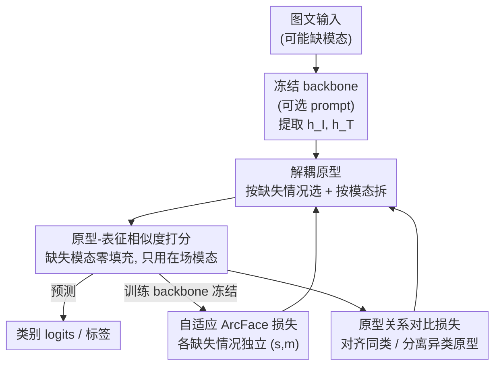

# DPL: Decoupled Prototype Learning for Enhancing Robustness of Vision-Language Transformers to Missing Modalities

**会议**: CVPR 2026  
**论文**: [CVF Open Access](https://openaccess.thecvf.com/content/CVPR2026/html/Lu_DPL_Decoupled_Prototype_Learning_for_Enhancing_Robustness_of_Vision-Language_Transformers_CVPR_2026_paper.html)  
**代码**: https://github.com/OverfitFlow/DPL  
**领域**: 多模态VLM  
**关键词**: 缺失模态、原型学习、视觉-语言Transformer、ArcFace、鲁棒性

## 一句话总结
针对视觉-语言模型在某个模态缺失时性能骤降的问题，本文提出 DPL：把分类头从一个固定的全连接层换成"按缺失情况选原型、再按模态拆分原型"的解耦原型预测头，配合缺失感知的 ArcFace 损失和原型关系对比损失，可即插即用地接在任意 prompt 方法之后，在三个数据集多种缺失场景上稳定超越 SOTA。

## 研究背景与动机
**领域现状**：视觉-语言 Transformer（如 ViLT、CLIP）在图文配对数据上表现优异，但现实部署中经常出现某个模态缺失（医疗记录因隐私不可用、教育场景成绩被隐去等）。近两年主流的应对路线是 **prompt learning**——MAP、MSP、MuAP、DCP 等通过"缺失感知 prompt"引导 backbone 提取适应缺失情况的表征，且只需微调极少参数。

**现有痛点**：这些方法只做了"一半的适配"。它们让**表征**对缺失情况敏感了，但**预测头**仍然是一个统一的全连接层（FC），无论当前样本是图缺、文缺还是完整，FC 都用同一套类别权重、以同样方式算 logits。结果就是"自适应表征"撞上"静态预测层"，prompt 好不容易捕捉到的缺失线索在最后一层被抹平。

**核心矛盾**：缺失模态不只是破坏了跨模态交互，还会把不完整输入带来的噪声灌进决策环节（论文 Fig.1：完整时模型能用跨模态相关性把"猪"纠正成"狗"，缺失时却产出被污染的 logits）。一个真正自适应的模型，必须把"缺失感知"从表征延伸到**预测策略本身**。

**本文目标**：设计一个对缺失情况敏感的预测头，既能区分不同缺失场景（图缺 / 文缺 / 完整），又能让只在场的模态真正主导决策，同时还要能无缝接在已有 prompt 框架后面。

**核心 idea**：用一组"按缺失情况解耦、再按模态分解"的**类别原型**替代单一 FC 权重——每个类别为不同缺失场景各准备一套原型，每套原型再拆成图像分量和文本分量，预测时按当前缺失模式动态选原型、只让在场模态的分量参与打分。

## 方法详解

### 整体框架
DPL 的输入是一对（可能残缺的）图文 $\{x_I, x_T\}$，输出是类别预测。它不动 backbone，只替换最后的预测头，整条流程分三个阶段：先为每个类别构造"缺失感知 + 模态分解"的原型库；前向时根据样本的缺失模式选出对应原型，用原型与表征的余弦相似度算 logits；训练时冻结 backbone，仅用两个定制损失优化原型（和可选 prompt）。

形式上，数据集 $D$ 由三个子集构成：完整子集 $D^c=\{x_I,x_T,y\}$、图缺子集 $D^{r_I}=\{\tilde{x}_I,x_T,y\}$、文缺子集 $D^{r_T}=\{x_I,\tilde{x}_T,y\}$，其中 $\tilde{x}$ 是占位的空输入。缺失的模态表征统一用零向量填充，保证只有在场模态贡献 logits。

### 关键设计

**1. 解耦原型：让预测头随缺失情况和在场模态切换决策**

这一步直击"自适应表征 + 静态 FC"的错配。对第 $k$ 个类别，DPL 不再用单一权重，而是准备三套**缺失感知原型** $w_k^{c}, w_k^{r_I}, w_k^{r_T}$，分别服务完整、图缺、文缺样本；每套原型再沿模态做**分解**，拆成图像分量和文本分量：

$$w_k^{c}=[w_k^{c,I},\,w_k^{c,T}];\quad w_k^{r_I}=[w_k^{r_I,I},\,w_k^{r_I,T}];\quad w_k^{r_T}=[w_k^{r_T,I},\,w_k^{r_T,T}]$$

例如 $w_k^{r_T,I}$ 表示"第 $k$ 类、文本缺失情况下、图像模态"的原型分量。这种"先按缺失情况选、再按模态拆"的双重解耦，使预测头可以为每种缺失场景配一套独立的决策边界，而不是逼所有场景共用一套权重。论文还指出一个微妙但关键的差别：分解后**归一化是对每个模态分量独立做** $L_2$ 归一化，而非对整条原型向量归一化——这会得到不同的归一化原型、进而得到不同的 logits，正是解耦带来收益的技术来源之一。

**2. 缺失感知相似度打分：只让在场模态主导 logits**

有了原型，如何在缺失时算出干净的 logits？DPL 用原型-表征余弦相似度打分，并按当前缺失模式切换公式。对样本 $i$、类别 $k$，logits 为：

$$z_{i,k}=\begin{cases}\big((\hat{h}_i^{I})^{\mathsf{T}}\hat{w}_k^{c,I}+(\hat{h}_i^{T})^{\mathsf{T}}\hat{w}_k^{c,T}\big)/2 & x_i\in D^c\\[4pt](\hat{h}_i^{T})^{\mathsf{T}}\hat{w}_k^{r_I,T} & x_i\in D^{r_I}\\[4pt](\hat{h}_i^{I})^{\mathsf{T}}\hat{w}_k^{r_T,I} & x_i\in D^{r_T}\end{cases}$$

其中 $\hat{h},\hat{w}$ 是 $L_2$ 归一化后的表征与原型。完整样本对两模态相似度取平均；图缺时只用归一化的文本原型 $\hat{w}_k^{r_I,T}$ 配文本表征，图像那一项被零填充天然不参与。这个"完整时除以 2、缺失时只算单模态"的设计，保证了缺失样本和完整样本的 logits 量级一致，避免了缺失情况下 logits 被人为放大或压缩。

**3. 自适应 ArcFace 损失：给每种缺失情况各自的 margin 与 scale**

原型怎么学？DPL 基于 ArcFace 的加性角度间隔来优化原型，但原始 ArcFace 假设所有数据质量一致——这在模态可用性变化时不成立（完整样本信息多、缺失样本信息少，不该共用一个置信度）。DPL 因此给三类原型各配一套 scale 和 margin：完整 $(s^c,m^c)$、图缺 $(s^{r_I},m^{r_I})$、文缺 $(s^{r_T},m^{r_T})$。这样可以反映不同模态配置的置信度差异，平衡各缺失场景的决策边界，防止完整模态数据在训练中"一家独大"压过缺失样本。整个过程 backbone 始终冻结，只动原型。

**4. 原型关系对比损失 $\mathcal{L}_{\text{PRC}}$：防止解耦后的原型各自漂移**

解耦带来一个新风险：同一类别的三套原型分别在完整 / 图缺 / 文缺子集上训练，若各自独立优化会语义漂移、互相对不齐。PRC 损失把同类的各原型拉近、不同类的原型推远：

$$\mathcal{L}_{\text{PRC}}=-\sum_{k=1}^{K}\sum_{u,v}\mathbb{1}_{u\neq v}\log\frac{\exp(\hat{w}_k^{u}\cdot\hat{w}_k^{v})}{P}$$

其中归一化因子 $P$ 对所有"非同类，或同类但不同 $(u,v)$ 组合"的原型对求和，上标 $u,v,o$ 各自独立遍历所有"缺失模式 × 模态"组合（如 $(r_T,I)$）。直观上它是一个作用在原型空间的对比正则，维持解耦原型间的语义一致性、同时增强类间可分性。总训练目标为 $\mathcal{L}_{\text{DPL}}=\mathcal{L}_{\text{ArcFace}}+\lambda\mathcal{L}_{\text{PRC}}$。

### 损失函数 / 训练策略
backbone（CLIP ViT-B/16 或 ViLT）全程冻结，仅微调可学习 prompt（若启用，长度 36，对齐 DCP）、FC/原型。优化用 AdamW，初始学习率 $1\times10^{-2}$、weight decay $2\times10^{-2}$，前 10% 步 warmup 后线性衰减到 0，batch size 4，单卡 RTX 3090。缺失模态用零张量替换。训练/测试均按缺失率 $\eta\in\{50,70,90\}\%$ 模拟缺失。

## 实验关键数据

### 主实验
在 MM-IMDb（Macro-F1）、UPMC Food-101（Top-1 Acc）、Hateful Memes（AUROC）三个数据集上，把各 baseline 的 FC 头换成 DPL 头，覆盖图缺 / 文缺 / 混合缺三类场景与 50/70/90% 缺失率。下表节选 MM-IMDb 上几个代表性配置（数值为 F1-Macro）：

| 缺失配置 (train/test) | 基线 | w/ FC | w/ DPL | 提升 |
|------|------|------|------|------|
| 文缺 50% | MaPLe | 54.31 | 56.36 | +2.05 |
| 文缺 50% | MAP | 53.32 | 56.03 | +2.71 |
| 文缺 50% | DCP | 53.62 | 56.94 | +3.32 |
| 混合 65/65% | DCP | 51.46 | 55.48 | +4.02 |
| 图缺 90% | DCP | 49.69 | 53.06 | +3.37 |
| 无 prompt 混合 55/55% | — | 50.24 | 53.98 | +3.74 |

无论是否启用 prompt 微调，仅替换预测头就能稳定涨点；即使在 90% 严重缺失下，混合缺场景仍最多提升约 1.8%。在 Hateful Memes 上换 ViLT backbone（Tab.2）也成立，文缺 30/100% 场景 ViLT(FC) 54.02 → ViLT(DPL) 64.53，说明 DPL 不挑 backbone。

### 消融实验
Hateful Memes 上对"原型是否分解 + 用哪个损失"做消融（F1-Macro，DCP 框架）：

| 配置 | 文缺50% | 混合75/75% | 图缺90% | 说明 |
|------|------|------|------|------|
| $\mathcal{L}_{\text{DPL}}$ un-decomp. | 65.26 | 66.82 | 69.29 | 只按缺失情况选、不按模态拆 |
| $\mathcal{L}_{\text{ArcFace}}$ decomp. | 66.44 | 68.59 | 69.55 | 拆了但去掉 PRC |
| $\mathcal{L}_{\text{DPL}}$ decomp.（完整） | **67.46** | **69.31** | **70.76** | 分解 + ArcFace + PRC |

另有缺失感知机制（MA）消融（Tab.5）：把"按缺失模式显式选原型"换成最小熵选择后，MAP 在文缺 10/100% 极端场景从 57.41 掉到 62.88（w/ MA），而 DPL 始终更稳、退化更小。对比另一种预测头 DePT（Tab.3）：DePT 主要针对 Base–New 权衡、对缺失鲁棒性收益不稳定（MAP+DePT 在混合 75/75% 反而 85.13→84.02 掉 1.11），DPL 则稳定 +1.85。

### 关键发现
- **模态分解是涨点主力**：去掉模态分解（un-decomp.）普遍掉 1-2 个点，证明"显式建模每个模态的原型"对缺失场景至关重要，比单纯按缺失情况选原型更有效。
- **PRC 损失锦上添花**：在分解基础上加 PRC（完整 $\mathcal{L}_{\text{DPL}}$）几乎所有配置都进一步小幅提升，验证了"约束解耦原型间关系"防漂移的作用。
- **缺失越严重、相对收益越明显**：90% 重度缺失下 DPL 对 baseline 的提升反而更突出，说明它确实在啃"信息最不完整"的硬场景。
- **跨模拟稳定性**：作者新增了"10 个随机种子模拟不同缺失模式"的鲁棒性评估，DPL 的箱线图 IQR 更窄、上界更高，比 FC/DePT（有离群点）更稳。

## 亮点与洞察
- **把"缺失感知"补齐到预测层**：现有工作几乎只在表征/prompt 层做适配，DPL 第一个明确指出"自适应表征撞上静态 FC 头"的错配，并把适配延伸到预测策略本身——这是个被忽视但很自然的缺口。
- **双重解耦 + 独立归一化的小细节很关键**：原型先按缺失情况、再按模态分解，且每个模态分量独立 $L_2$ 归一化，是收益的技术来源；这个"归一化粒度"的差别容易被忽略，却直接改变了 logits。
- **即插即用、零侵入 backbone**：DPL 只换最后一层、backbone 全冻，能直接套在 MaPLe/MAP/DCP 后面，作为通用预测头组件，迁移成本极低——任何"缺失模态 + prompt"的工作都能尝试替换 FC。
- **per-case 的 (s,m) 思路可迁移**：给不同数据质量/置信度的子集各配 margin 与 scale，这个思想不止用于缺失模态，凡是"训练子集质量不均"（如长尾、噪声标注）都值得借鉴。

## 局限与展望
- **仅在两模态（图+文）上验证**：方法形式化虽写成任意模态子集，但实验只覆盖 $M=2$，三模态及以上时原型组合数（缺失模式 × 模态）会组合爆炸，可扩展性论文放在附录、正文未充分展示。
- **依赖已知缺失模式**：相似度打分按"当前是图缺/文缺/完整"切换公式，前提是测试时缺失模式可观测；若缺失模式本身需要推断（部分 token 缺、模糊缺失），框架需要额外的缺失检测模块。
- **混合缺场景方差偏大**：作者自己承认 both-missing 时 IQR 比单模态缺更宽，鲁棒性虽优于基线但稳定性还有提升空间。
- **绝对增益偏小**：多数配置提升在 1-3 个点量级，在 Food-101 这类相对容易的数据集上 DPL 与 FC 差距更小（部分配置 <1 点），收益主要集中在难数据集和重度缺失。

## 相关工作与启发
- **vs MAP / DCP（缺失感知 prompt）**：它们在表征层用 prompt 适配缺失，预测头仍是 FC；DPL 与之正交互补——prompt 改表征、DPL 改决策，二者叠加才把缺失线索吃干净，实验也证明 DPL 接在 DCP 后涨幅最大。
- **vs DePT（解耦预测头）**：DePT 沿特征通道解耦任务知识、针对 Base–New 泛化，不是为缺失鲁棒设计，所以在缺失场景收益不稳定甚至掉点；DPL 的解耦轴是"缺失情况 × 模态"，直击缺失问题。
- **vs ArcFace / 原型学习**：DPL 把人脸识别里的 ArcFace 角度间隔搬到多模态分类，并扩展出 per-missing-case 的自适应 $(s,m)$ 和原型关系对比损失，把"单一共享分类头不够用"的痛点用"一类多原型 + 关系约束"解决。

## 评分
- 新颖性: ⭐⭐⭐⭐ 首次把缺失感知补到预测头，双重解耦原型的切入点清晰，但用的是已有 ArcFace/原型学习组件的重组
- 实验充分度: ⭐⭐⭐⭐ 三数据集 × 三缺失场景 × 三缺失率 + 双 backbone + 多基线 + 跨种子鲁棒性，覆盖很全；缺多模态(>2)与真实缺失数据
- 写作质量: ⭐⭐⭐⭐ 动机推导（表征自适应 vs 静态头错配）讲得透，公式清晰；部分缓存中公式渲染有损（已据原文复原）
- 价值: ⭐⭐⭐⭐ 即插即用、零侵入 backbone，对任何"缺失模态 + prompt"工作都可直接替换 FC 头，实用性强

<!-- RELATED:START -->

## 相关论文

- [\[ICML 2026\] Calibrated Multimodal Representation Learning with Missing Modalities](../../ICML2026/multimodal_vlm/calibrated_multimodal_representation_learning_with_missing_modalities.md)
- [\[CVPR 2026\] Beyond Missing Modalities: Hypergraph Guided Diffusion for Uncertainty-Aware Multimodal Emotion Recognition](beyond_missing_modalities_hypergraph_conditioned_diffusion_for_uncertainty-aware.md)
- [\[CVPR 2026\] Enhancing Continual Learning of Vision-Language Models via Dynamic Prefix Weighting](enhancing_continual_learning_of_vision-language_models_via_dynamic_prefix_weight.md)
- [\[CVPR 2026\] Reading or Reasoning? Format Decoupled Reinforcement Learning for Document OCR](reading_or_reasoning_format_decoupled_reinforcement_learning_for_document_ocr.md)
- [\[CVPR 2026\] Is the Modality Gap a Bug or a Feature? A Robustness Perspective](is_the_modality_gap_a_bug_or_a_feature_a_robustness_perspective.md)

<!-- RELATED:END -->
