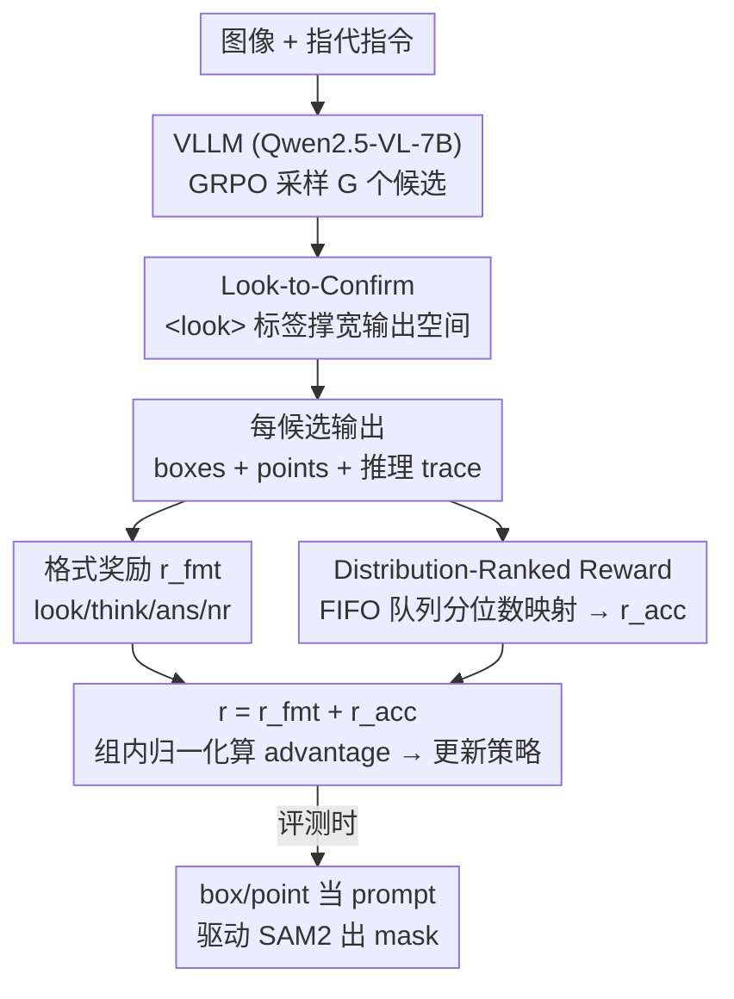

# Dr. Seg: Revisiting GRPO Training for Visual Large Language Models through Perception-Oriented Design

**会议**: CVPR 2026  
**论文**: [CVF Open Access](https://openaccess.thecvf.com/content/CVPR2026/html/Sun_Dr._Seg_Revisiting_GRPO_Training_for_Visual_Large_Language_Models_CVPR_2026_paper.html)  
**代码**: https://github.com/eVI-groupSCU/Dr-Seg  
**领域**: 多模态VLM  
**关键词**: GRPO, 视觉感知, 强化学习, 推理分割, 奖励设计  

## 一句话总结
论文指出"把语言推理的 GRPO 训练范式直接搬到视觉感知任务"这个普遍假设并不成立，针对感知任务"需要更宽的输出空间 + 更细更稳的奖励"两个被忽视的特性，提出即插即用的 Dr. Seg：用 `<look>` 标签鼓励广度探索、用分布排名奖励把多个连续指标映射到经验分位数，无需改模型结构就在 6 个分割/检测/计数基准上 5/6 拿到 SOTA。

## 研究背景与动机
**领域现状**：视觉大语言模型（VLLM）在指令微调后能做指代分割、推理分割等细粒度感知任务，但纯 SFT 泛化弱、容易灾难性遗忘。受 DeepSeek-R1 启发，近期一批工作（Seg-Zero、VisionReasoner、Pixel-Think 等）把带可验证奖励的强化学习（RLVR / GRPO）搬到 VLLM 的后训练阶段，做法高度同质：在 VLLM 上后训练、curate 任务数据、设计奖励函数。

**现有痛点**：这条线建立在一个长期未被检验的假设上——**为语言推理设计的训练范式可以无缝迁移到视觉感知**。作者用推理分割做代表性场景，发现这个假设站不住：(1) 推理任务（数学、科学）结论被前提紧紧约束，天然偏好"深度优先"探索、输出空间收窄；而感知任务对同一个答案可以走很多条不同的推理路径（低层的光照/纹理、中层的形状/颜色/材质、高层的类别/空间关系，还能组合），天然需要**更宽的输出空间**。(2) 主流工作沿用推理任务里流行的**二值奖励**，但视觉指标（如 IoU）本身连续，压成 0/1 信号信息有损；而朴素地把 N 个连续奖励直接相加，又会让高方差分量主导梯度、低方差分量被压制。

**核心矛盾**：推理范式的"窄输出空间 + 二值/朴素相加奖励"与感知任务"宽输出空间 + 多目标细粒度奖励"之间存在结构性错配。作者甚至用熵动力学佐证：感知任务训练时 token 级平均熵剧烈波动（说明模型在做广度探索），与推理任务里报告的"熵单调平滑下降"形成鲜明对比。

**核心 idea**：不动模型结构，只在 GRPO 训练里加两个即插即用组件——一个把输出空间撑宽（Look-to-Confirm），一个把多个连续奖励变得尺度无关又细粒度（分布排名奖励），两者互相增益。

## 方法详解

### 整体框架
Dr. Seg 沿用 VisionReasoner 的解耦设计：**只训练 VLLM**，让它对每个目标物体输出一组 box 和 point；这些预测在训练时用来算奖励、驱动 GRPO 更新策略；评测时再把 box/point 当作 prompt 喂给冻结的 SAM2 完成分割。换句话说，分割本身交给 SAM2，强化学习只负责教 VLLM "看哪里、给什么提示"。

在标准 GRPO 之上，Dr. Seg 做两处改造。**输入侧**改 prompt：要求模型把推理中需要重点关注的视觉证据用 `<look>...</look>` 包起来（Look-to-Confirm），并给一个对应的格式奖励，从而逼模型在"确认答案前先从多个维度看图"，把探索路径撑宽。**奖励侧**改 accuracy reward 的聚合方式：维护一个 FIFO 历史队列，把每个连续指标（IoU、数量一致性、点距离）映射成它在近期历史里的经验分位数（rank），再取均值（Distribution-Ranked Reward），消除高方差分量对梯度的主导。两个组件在同一次 GRPO rollout 里协同：更宽的探索产生更多样的候选，更稳的奖励让模型在这个更宽的空间里学到更准的预测。

### 关键设计

**1. Look-to-Confirm 视觉探索：用一个 `<look>` 标签把输出空间撑宽**

针对"感知任务需要更宽输出空间、而推理范式让探索收窄"这个痛点，作者不改架构、只改 prompt 和格式奖励：要求模型在推理 trace 里用 `<look>...</look>` 显式圈出需要特别关注的视觉证据，并给一个格式奖励 $r_{look}$（trace 里出现合法 `<look>` 标签则为 1.0）来强制模型遵守。这样模型被迫"在下结论前先看图"，从形状、材质、空间关系等不同维度去找线索，相当于从预训练视觉知识里调取多条推理路径，从而获得更强泛化。它的灵感来自在推理里插入 `<back>` 反思/验证阶段的工作，但 Dr. Seg 的视角不同——它**只要求模型"看一遍"图像空间、不做任何额外的答案验证**，目的纯粹是扩大输出搜索空间。完整格式奖励是四项之和：

$$r_{fmt}(o_i) = r_{look}(o_i) + r_{think}(o_i) + r_{ans}(o_i) + r_{nr}(o_i)$$

其中 $r_{think}$ 检查 `<think>...</think>` 和 `<answer>...</answer>` 结构、$r_{ans}$ 检查最终答案是否符合受限 JSON 格式、$r_{nr}$ 奖励 thinking trace 不重复。作者用熵曲线佐证它确实有效：加了 Look-to-Confirm 后 token 级熵波动更剧烈、last-token embedding 的 PCA 分布更分散（说明策略没有坍缩到输出空间的窄区域），ReasonSeg 从 65.5 提到 66.1。

**2. 分布排名奖励：把多个连续指标映射成经验分位数，消除高方差主导**

针对"多个连续奖励直接相加会让高方差分量主导梯度"这个痛点。作者先给了数学解释：把 N 维奖励向量 $r=(r^{(1)},\dots,r^{(N)})$ 直接求和成标量 $r$、按标准 GRPO 归一化 $A=(r-\mu_r)/\sigma_{mix}$ 后，简化的策略梯度可写成各分量协方差之和

$$g(\theta; q) = \frac{\sigma_S}{\sigma_{mix}} \sum_{j=1}^{N} \rho^{(j)} \sigma^{(j)}$$

其中 $\rho^{(j)}$ 是分量 $r^{(j)}$ 与 score function $S=\nabla_\theta \log\pi_\theta(o|q)$ 的 Pearson 相关系数、$\sigma^{(j)}$ 是该分量标准差。在 $\rho^{(j)}$ 相近时，**$\sigma^{(j)}$ 单独决定了每个奖励维度的有效权重**——高方差分量诱导更大协方差、主导混合梯度，低方差分量被压制，这就是朴素相加的偏置来源。

解法是**分位数映射（quantile mapping）**：维护一个定长 FIFO 队列存近期 accuracy 向量来近似每个指标的经验分布；给新候选算奖励时，把每个原始指标值映射成它在队列里的经验分位数（rank），得到尺度无关的分数。对候选 $o_i$ 的第 $j$ 维原始指标 $x_j$，相对历史队列 $S_t^{(j)}=(s_1^{(j)},\dots,s_M^{(j)})$ 的分位数为

$$q_j = \frac{1}{M}\sum_{m=1}^{M} \mathbb{1}\!\left(s_m^{(j)} \le x_j\right), \qquad r_{acc}(o_i) = \frac{1}{N}\sum_{j=1}^{N} q_j$$

这本质是给每个维度构造一个经验累积分布函数（ECDF），映射 $T: x\mapsto q$ 逐坐标单调、有界、随时间变化。它的妙处在于：把每个分量的有效梯度尺度从"原始数值大小"解耦成"在近期历史里的排位"，于是一个样本的难度由它在演化中的性能分布里的位置决定，而非绝对值，自然消除高方差主导。

**3. 三个感知指标的具体实例化（N=3）**

把上面的通用框架落到 VLLM 分割设定，原始 accuracy 向量取三个核心感知指标。$x_1$ 是预测框与真值框的 IoU：$x_1=\text{IoU}(b_{pred}, b_{gt})$；$x_2$ 是数量覆盖一致性，用预测物体数 $N_{pre}$ 与真值数 $N_{gt}$ 之比 $x_2=\min(N_{pre},N_{gt})/\max(N_{pre},N_{gt})$；$x_3$ 是预测点与真值点的相似度，对欧氏距离 $d_{pt}=\|p_{pred}-p_{gt}\|_2$ 做分段软惩罚

$$x_3 = g(d_{pt}) = \begin{cases} 1, & d_{pt} \le \tau_{min}, \\ \dfrac{\tau_{max}-d_{pt}}{\tau_{max}-\tau_{min}}, & \tau_{min} < d_{pt} < \tau_{max}, \\ 0, & d_{pt} \ge \tau_{max}. \end{cases}$$

实现里 $\tau_{min}=30$、$\tau_{max}=200$（像素）。这三项分别约束"框准不准 / 数量对不对 / 点位偏不偏"，是 box+point prompt 驱动 SAM2 这一解耦设计下最直接的反馈信号。

### 损失函数 / 训练策略
基础目标是标准 GRPO：对查询 $q$ 采样一组候选 $\{o_i\}$，最小化带 PPO 截断和 KL 惩罚的目标，advantage 用组内奖励归一化 $A_i=(r_i-\text{mean})/\text{std}$。每个候选的总奖励 $r_i=r_{fmt}(o_i)+r_{acc}(o_i)$，其中 $r_{fmt}$ 是上面四项格式奖励之和、$r_{acc}$ 是分布排名奖励。训练用 VERL 框架，VLLM 为 Qwen2.5-VL-7B、分割器为 SAM2-Large；batch size 16、学习率 $1\times10^{-6}$，4 张 H800 训约 500 步。FIFO 队列长 2048（对应过去 16 个训练步的历史），初始化为一整步的零；每次 rollout 的原始 accuracy 向量先进临时 buffer、每步末再 flush 进全局队列。

## 实验关键数据

### 主实验
训练集是 VisionReasoner 的多物体 7k 样本（来自 LVIS / RefCOCOg / gRefCOCO / LISA++）。ID 基准为 RefCOCO/RefCOCO+/RefCOCOg 指代分割，OOD 基准为 ReasonSeg 推理分割，外加自建的 COCONut 多物体分割（665 张图、平均 5.14 个目标实例、68 类）。评测指标 gIoU。

| 模型 | RCO (testA) | RCO+ (testA) | RCOg (test) | ID avg | ReasonSeg-val | COCONut-val | OOD avg | avg |
|------|------|------|------|------|------|------|------|------|
| Seg-Zero | 80.3 | 76.2 | 72.6 | 76.4 | 57.5 | 69.3 | 63.1 | 69.8 |
| VisionReasoner | 78.9 | 74.9 | 71.3 | 75.0 | 63.6 | 78.1 | 69.3 | 72.2 |
| VisionReasoner*（复现 baseline） | 79.0 | 75.3 | 72.5 | 75.6 | 61.5 | 78.1 | 68.4 | 72.0 |
| **Dr. Seg（本文）** | **80.2** | **76.8** | **74.2** | **77.1** | **65.6** | **79.6** | **71.0** | **74.0** |

Dr. Seg 在 6 个基准里 5/6 拿到同类 SOTA，且**同时**在 ID 和 OOD 上刷新——而此前工作往往只在 ID 或 OOD 单边领先。额外的检测/计数任务同样 SOTA：相对 baseline，COCO 检测 +2.4 AP（37.7→40.1）、Pixmo 计数 val +4.5（70.1→74.6）。

| 任务 | 数据集 | VisionReasoner | Dr. Seg | 提升 |
|------|------|------|------|------|
| 检测 | COCO val (AP) | 37.7 | 40.1 | +2.4 |
| 计数 | Pixmo val | 70.1 | 74.6 | +4.5 |
| 计数 | CountBench test | 69.5 | 72.4 | +2.9 |

### 消融实验
两个组件解耦消融（LC=Look-to-Confirm，DR=Distribution-Ranked Reward），看出二者分工互补、合起来才有协同跃升：

| LC | DR | RefCOCO | RefCOCO+ | RefCOCOg | ReasonSeg |
|----|----|------|------|------|------|
| ✗ | ✗ | 79.0 | 75.3 | 72.5 | 65.5 |
| ✓ | ✗ | 79.0 | 75.1 | 72.1 | **66.1** |
| ✗ | ✓ | 80.1 | 76.6 | 73.9 | 65.5 |
| ✓ | ✓ | **80.2** | **76.8** | **74.2** | **67.8** |

归一化策略消融，验证 FIFO 分位数映射相对"原始连续奖励直接相加"的价值：

| 归一化 | RefCOCO | RefCOCO+ | RefCOCOg | ReasonSeg |
|------|------|------|------|------|
| Raw Reward（朴素相加） | 78.7 | 75.0 | 71.5 | 64.4 |
| Distribution-Ranked | **80.2** | **76.8** | **74.2** | **67.8** |

### 关键发现
- **两个组件方向互补**：单独加 LC 只提 OOD 的 ReasonSeg（+0.6），但因二值奖励仍粗糙，box 这类连续预测受影响、ID 略降；单独加 DR 只提 ID（RefCOCO/+/g 分别 +1.1/+1.5/+1.8 IoU），但缺乏鼓励输出空间探索的正则，OOD 不动。两者合起来在 ID 和 OOD 同时大涨，是"超过各自之和"的协同。
- **二值→连续→分位数**的递进很关键：直接用原始连续奖励相加反而比 baseline 更差（ReasonSeg 64.4 < 65.5），说明问题不在"连续 vs 二值"，而在多目标相加引入的方差偏置；分位数映射才真正解锁连续奖励的收益。
- **熵动力学是判别感知/推理范式的信号**：感知任务训练熵剧烈波动而非单调下降，作者据此论证感知需要广度探索，这个观察本身就有方法论价值。

## 亮点与洞察
- **即插即用、零架构改动**：两个组件都只动 prompt 和奖励聚合，不碰模型结构，能无缝接到现有 GRPO-based VLLM 上，迁移成本极低。
- **把"奖励方差主导"讲成可证明的梯度问题**：从 $g(\theta;q)\propto\sum_j\rho^{(j)}\sigma^{(j)}$ 推出高方差分量主导梯度，再用 ECDF 分位数把每个分量拉到 $[0,1]$ 同尺度——这套"诊断→证明→对症下药"的链条很干净，且 rank-based 归一化可迁移到任何多指标连续奖励的 RL 场景。
- **用 `<look>` 标签当"探索正则"**而非"验证步骤**：同样是往推理里插标签，作者刻意只让模型"看"不让它"验证答案"，把目的锁定在扩张输出空间，这个对探索/利用的取舍判断很有意思。

## 局限与展望
- 分割能力实际由冻结的 SAM2 承担，Dr. Seg 只优化 VLLM 出 box/point 的能力，方法的天花板部分受 SAM2 制约；论文未讨论换更弱分割器时结论是否仍成立。⚠️ 以原文为准。
- 分布排名奖励引入 FIFO 队列长度（2048）、点距离阈值 $\tau_{min}/\tau_{max}$ 等超参，论文给了取值但未系统分析其敏感性。
- "感知任务偏好广度探索"主要以推理分割为代表场景 + 熵曲线佐证，是否能推广到所有视觉感知任务仍待更多验证。
- COCONut 多物体评测集是自建的（665 图），规模偏小，OOD 结论的统计稳健性有限。

## 相关工作与启发
- **vs VisionReasoner / Seg-Zero（同为 GRPO-based VLLM 感知）**：它们直接沿用推理任务的二值奖励、窄输出空间训练，往往只在 ID 或 OOD 单边领先；Dr. Seg 指出范式错配并补上"宽输出空间 + 分位数奖励"，在同一 baseline 上 ID/OOD 双刷 SOTA。
- **vs 在推理里插 `<back>` 反思阶段的工作（Yang et al.）**：同样往推理 trace 插标签，但对方做的是反思/验证、收窄到正确答案；Dr. Seg 的 `<look>` 只做视觉广度探索、不验证，目的相反（撑宽而非收窄输出空间）。
- **vs 研究 RL 熵动力学的工作（Cui et al. / Wang et al.）**：前人只在推理场景观察到熵单调平滑下降；本文首次从感知任务视角看熵动力学，发现剧烈波动，并据此设计鼓励广度探索的机制。

## 评分
- 新颖性: ⭐⭐⭐⭐ 挑战"推理范式可无缝迁移到感知"的隐含假设，用熵动力学 + 梯度方差分析两条证据支撑，切入角度新。
- 实验充分度: ⭐⭐⭐⭐ 覆盖分割/检测/计数 + ID/OOD，消融把两组件分工讲清；但 OOD 自建集偏小、超参敏感性分析欠缺。
- 写作质量: ⭐⭐⭐⭐ "发现问题→数学解释→对症设计"的叙事干净，公式与动机对应清楚。
- 价值: ⭐⭐⭐⭐ 即插即用、零架构改动，rank-based 奖励归一化对多指标 RL 有普适借鉴意义。

<!-- RELATED:START -->

## 相关论文

- [\[CVPR 2026\] MoE-GRPO: Optimizing Mixture-of-Experts via Reinforcement Learning in Vision-Language Models](moe-grpo_optimizing_mixture-of-experts_via_reinforcement_learning_in_vision-lang.md)
- [\[ICLR 2026\] DIVA-GRPO: Enhancing Multimodal Reasoning through Difficulty-Adaptive Variant Advantage](../../ICLR2026/multimodal_vlm/diva-grpo_enhancing_multimodal_reasoning_through_difficulty-adaptive_variant_adv.md)
- [\[CVPR 2026\] CropVLM: Learning to Zoom for Fine-Grained Vision-Language Perception](cropvlm_learning_to_zoom_for_fine_grained_vision_language_perception.md)
- [\[AAAI 2026\] Revisiting the Data Sampling in Multimodal Post-training from a Difficulty-Distinguish View](../../AAAI2026/multimodal_vlm/revisiting_the_data_sampling_in_multimodal_post-training_from_a_difficulty-disti.md)
- [\[CVPR 2026\] Linking Perception, Confidence and Accuracy in MLLMs](linking_perception_confidence_and_accuracy_in_mllms.md)

<!-- RELATED:END -->
