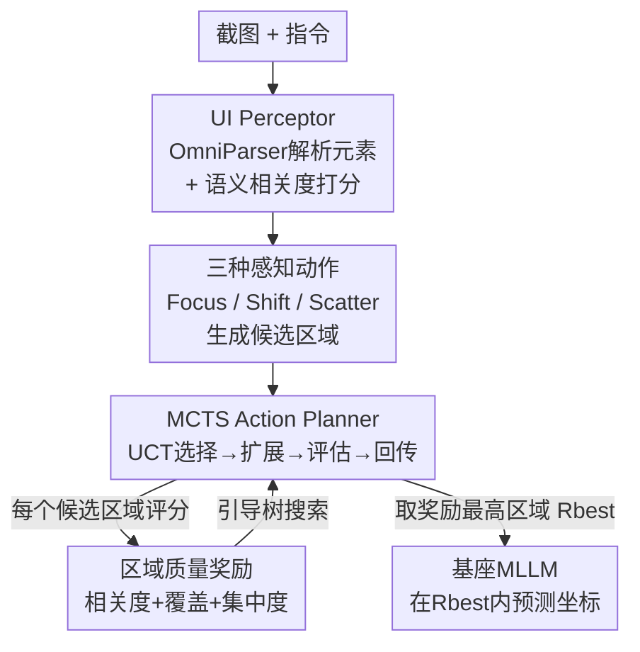

# DRS-GUI: Dynamic Region Search for Training-Free GUI Grounding

**会议**: CVPR 2026  
**论文**: [CVF Open Access](https://openaccess.thecvf.com/content/CVPR2026/html/Liu_DRS-GUI_Dynamic_Region_Search_for_Training-Free_GUI_Grounding_CVPR_2026_paper.html)  
**代码**: 无  
**领域**: 多模态VLM / GUI Agent  
**关键词**: GUI grounding, 训练无关, 动态区域搜索, 蒙特卡洛树搜索, 视觉搜索

## 一句话总结
DRS-GUI 在 MLLM 做坐标预测前插入一个"先搜后定位"的免训练阶段：用 UI Perceptor 把截图解析成带语义相关度的 UI 元素，再用 MCTS 调度 Focus/Shift/Scatter 三种类人感知动作、配合区域质量奖励反复搜索出最相关的紧凑区域，在高分辨率密集界面基准 ScreenSpot-Pro 上把 Qwen2.5-VL-7B 与 UGround-V1-7B 的 grounding 准确率提升约 14%。

## 研究背景与动机
**领域现状**：MLLM 驱动的 GUI agent 要可靠执行指令，关键在于 grounding——把自然语言指令准确定位到截图里那个可点击的 UI 元素。现有做法分两派：一派是单步全屏预测，直接在整张截图上回归一个点或框（SeeClick、UGround、OS-Atlas 这类，靠大规模标注微调）；另一派是多步精修，通过迭代裁剪/放大逐渐收缩视野（ECP、R-VLM、DiMo-GUI、LASER）。

**现有痛点**：真实 GUI 截图往往是高分辨率、视觉密集的，充满和指令无关却长得很像的冗余元素，会把 MLLM 的注意力打散。单步全屏派没有显式的注意力控制，容易被背景杂乱干扰；多步精修派虽然提供了渐进聚焦，但它们的精修过程是**单向不可逆**的——一旦早期把正确区域裁掉了，后续就再也找不回来，误差会一路累积（如图 1a，轨迹一旦偏离语义线索，最终区域可能根本不含目标）。

**核心矛盾**：现有 pipeline 缺两样能力——(1) **动态感知**：当前证据不足时能改道或转移视野，而不是死磕一条不可逆的收缩路径；(2) **区域质量评估**：每一步都要有一个可度量的信号告诉系统"搜索是在靠近还是远离目标"，从而阻止早期错误滚雪球。

**切入角度**：作者从人类如何在复杂界面上找东西出发——人不会沿单一收窄路径一条道走到黑，而是先扫一眼布局、逐步细化注意力，不确定时会**后退或转移**到别的区域。这种自适应、可回溯的搜索天然带有"我是在靠近还是远离目标"的评估。

**核心 idea**：把 GUI grounding 重新表述为一个**视觉搜索**问题，设计一个免训练、可即插即用的动态区域搜索器：先搜出语义合适的区域，再让基座 MLLM 只在这个紧凑区域里做坐标预测（search-then-predict）。

## 方法详解

### 整体框架
DRS-GUI 把 grounding 拆成"先搜区域、后预测坐标"两段。形式化地，原任务是把指令 $T$ 映射到截图 $S_{\text{full}} \in \mathbb{R}^{H\times W\times 3}$ 中目标元素的像素坐标 $p=(x,y)$。直接在 $S_{\text{full}}$ 上 grounding 不可靠，于是作者引入一个区域搜索策略 $\pi_S$，先找到指令相关区域 $R_{\text{best}}$，再让基座模型 $M$ 只在该区域里定位：

$$R_{\text{best}} = \pi_S(S_{\text{full}}, T), \qquad p = M(R_{\text{best}}, T)$$

整个搜索器由两个协作模块构成：**UI Perceptor** 负责把当前区域解析成结构化 UI 元素、算出每个元素对指令的语义相关度，并据此执行三种区域级动作（Focus/Shift/Scatter）产生候选视野；**MCTS Action Planner** 负责调度这些动作、构建一棵可回溯的区域搜索树，在**区域质量奖励**的引导下反复搜索与修正感知范围，最后把奖励最高的区域交给基座 MLLM 做最终定位。这套机制无需任何训练或微调，是对现有 MLLM 的纯外挂增强。

### 关键设计

**1. UI Perceptor：把截图变成带指令相关度的结构化元素**

直接让 MLLM 面对满屏相似元素难以分辨哪块和指令有关，UI Perceptor 先把感知问题结构化。给定区域 $R$，用 OmniParser V2 解析出 UI 元素集合 $U=\{u_i \mid u_i=[b_i, d_i, i_i]\}_{i=1}^{N}$，其中 $b_i$ 是元素框、$d_i$ 是语义描述（OCR 文本或图标 caption）、$i_i\in\{0,1\}$ 标记该元素是否可交互。为了把指令和元素放进同一语义空间，作者用 instructor-large embedder 分别编码，并在编码前拼上一个按当前 GUI 的应用类型/系统类型定制的**领域前缀** $P_d$：

$$e_T = \text{Embedder}(P_d \oplus T), \qquad e_{d_i} = \text{Embedder}(P_d \oplus d_i)$$

对最后隐状态做 mean pooling 得到定长向量，再算每个元素的语义相关度 $s_i = \cos(e_T, e_{d_i})$。这串相关度 $\{s_i\}$ 是后面所有动作执行和奖励评估的核心线索——它把"哪块区域承载了指令相关信息"变成了可计算的标量。领域前缀的作用是让指令和元素嵌入落在与当前 GUI 环境一致的交互上下文里，避免跨应用语义漂移。

**2. 三种类人感知动作 Focus / Shift / Scatter：可收、可移、可放的视野调节**

有了相关度 $\{s_i\}$，Perceptor 模仿人类调节视野的三种行为，分别应对"该聚焦/该换地方/该扩大"三种情形。**Focus（收缩）**：选相关度 top-p% 的元素，剔除框中心明显偏离簇质心的空间离群点，用剩余元素的最小外接框形成紧凑裁剪；若收缩不够则迭代剔掉最远元素直到满足目标收缩比——这一步把语义内容浓缩、压掉视觉杂乱。**Shift（转移）**：当强相关线索出现在与当前视野空间分离的区域时，把视野重新中心化到那些线索上；为稳定起见按一致的布局方向（如上方、左侧）分组，且新区域与旧区域重叠尽量小，从而"有目的地"搬离一个没信息的区域去探索别处。**Scatter（扩散）**：当前区域语义线索弱或不连贯时，收集视野外的高相关元素并扩大视野把它们纳入，同时加尺度约束防止过度膨胀，恢复更广的上下文、避免困死在过窄的局部。三者合起来实现对感知范围的动态控制：语义置信上升就收紧、需要上下文就扩张、别处有更强线索就转移。

**3. MCTS Action Planner：把动作调度成可回溯的搜索树**

三种动作怎么排布是关键——单向精修不可逆是前面诊断的病根，作者用蒙特卡洛树搜索来获得可回溯的搜索轨迹。每个区域状态 $S=(R, U, \{s_i\})$ 是树的一个节点，动作空间 $A=\{\text{Focus}, \text{Shift}, \text{Scatter}\}$，每个动作把当前区域变成一个新候选区域、构成树的边。根节点由对全图做一次 Focus 得到粗略全局视野初始化（保证后续 Scatter/Shift 在有意义的区域上操作）。在固定搜索预算下迭代四个阶段：**节点选择**用 UCT 策略在利用高奖励区域和探索访问少的备选之间平衡，

$$a^* = \arg\max_{a\in A(S)} \left[ Q(S,a) + c\sqrt{\frac{\ln V(S)}{V(S,a)}} \right]$$

其中 $Q(S,a)$ 是在状态 $S$ 取动作 $a$ 的期望未来奖励，$V(S)$、$V(S,a)$ 分别是状态访问数和动作选择次数，$c$ 控制探索；**扩展**在叶节点施加一个未执行动作生成后继状态；**模拟与回传**用区域质量奖励评估新区域、把奖励沿访问路径上传更新各节点的 $Q$ 值与访问数。搜索结束后取奖励最高的区域 $R_{\text{best}}=\arg\max_R r(R,T)$ 送给基座 MLLM。MCTS 的可回溯性正是对"早期裁错救不回来"的直接修复——它不承诺单一感知路径，能重访和改道。

**4. 区域质量奖励：从交互性、覆盖度、集中度三路打分**

搜索要有方向就得能评"这个区域适不适合 grounding"。作者设计了由三项互补指标加权而成的复合奖励。**交互加权相关度**：可交互元素通常才是 grounding 目标，于是给相关度按交互性加权，$w_i=1$ 若 $i_i=1$ 否则 $w_i=\lambda\,(0<\lambda<1)$，得 $r_{\text{rel}}=\frac{\sum_i w_i s_i}{\sum_i w_i + \varepsilon}$，压制装饰性/静态文本。**UI 覆盖一致性**：含真实 UI 结构而非空白背景的区域更可靠，用元素面积占比 $r_{\text{cov}}=\frac{\sum_i \text{Area}(b_i)}{\text{Area}(R)}$ 衡量。**语义集中度**：判断相关度是聚焦还是弥散，先用温度 $\tau$ 归一化 $p_i=\frac{\exp(s_i/\tau)}{\sum_j \exp(s_j/\tau)}$，再算归一化熵 $r_{\text{con}}=1-\frac{-\sum_i p_i\log p_i}{\log(N+\varepsilon)}$，越高表示语义焦点越清晰。最终奖励为三者加权：

$$r(R,T) = \alpha\cdot r_{\text{rel}} + \beta\cdot r_{\text{cov}} + \gamma\cdot r_{\text{con}}$$

论文取 $\alpha=0.4,\beta=0.4,\gamma=0.2$。这把奖励引向"语义有意义、操作上相关、视觉信息充分"的区域，是整个搜索的方向盘。

### 一个完整示例
以指令"在 Word 里给图片设置穿越型文字环绕"为例：根节点对全图做 Initial Focus 得到一个粗区域（奖励 0.42）；planner 按 UCT 展开，尝试 Focus（收紧到候选控件簇，奖励 0.74）、Shift（搬到另一区域，奖励 0.49/0.60/0.64）、Scatter（扩大上下文，奖励 0.66/0.36）等分支，奖励高的分支被反复利用、低的被探索后剪枝；经多轮扩展与回传，搜索收敛到奖励最高的 Best Region，最后只把这一紧凑区域交给基座 MLLM 预测坐标（图 4）。整个过程中，错误的 Focus 可被后续 Shift 救回——这正是可回溯搜索相对单向精修的价值。

## 实验关键数据

### 主实验
在三个 GUI grounding 基准（ScreenSpot-V1、V2 与高分辨率专业应用基准 ScreenSpot-Pro）上，把 DRS-GUI 即插到通用 MLLM（Qwen2.5-VL-3B/7B）和 GUI 专用模型（UGround-V1-2B/7B）上。判定标准：预测点落在 GT 框内即正确，报 grounding 准确率。

ScreenSpot-Pro（平均准确率，%）上提升最显著：

| 基座模型 | 原始 | + DRS-GUI | 提升 |
|--------|------|-----------|------|
| Qwen2.5-VL-3B | 16.1 | 28.7 | +12.6 |
| Qwen2.5-VL-7B | 26.8 | 40.9 | +14.1 |
| UGround-V1-2B | 26.8 | 38.3 | +11.5 |
| UGround-V1-7B | 31.4 | 45.7 | +14.3 |

一个有意思的结果：Qwen2.5-VL-3B + DRS-GUI（28.7%）反超了更大的 GUI 专用模型 OS-Atlas-7B（18.9%），说明在密集界面下，grounding 更依赖自适应感知搜索而非单纯堆模型规模。在较简单的 ScreenSpot-V1/V2 上同样稳定提升（如 ScreenSpot-V2 上 Qwen2.5-VL-7B 86.5→90.5、UGround-V1-7B 87.6→91.8，约 +4%），且在视觉歧义更高的 icon/widget 类提升更明显。

### 消融实验
在 ScreenSpot-V2、UGround-V1-7B 上分别消融动作空间和奖励项（平均准确率，%）：

| 动作组合 | Avg | 区域奖励组合 | Avg |
|---------|-----|-------------|-----|
| 无（基线） | 87.6 | 无（基线） | 87.6 |
| 仅 Focus | 89.8 | 仅 $r_{\text{rel}}$ | 89.6 |
| Focus+Shift | 91.0 | $r_{\text{rel}}+r_{\text{cov}}$ | 89.9 |
| Focus+Shift+Scatter（全） | 91.8 | 三项全 | 91.8 |

### 关键发现
- **三动作缺一不可、互补**：仅 Focus 就 +2.2%，加 Shift 到 91.0%（但 Mobile 子集因紧凑布局偶有"过度转移"小幅掉点），再加 Scatter 达到 91.8% 最佳——全动作空间给出最均衡稳健的搜索行为。
- **三奖励项逐步加好、语义集中度对复杂 Web 尤其关键**：交互加权相关度单项就 +2.0%；加覆盖一致性小幅提升（但过度扩张偶尔在 Web 引入冗余致小幅掉点）；加上语义集中度后 Web 场景明显改善，达到 91.8%。
- **搜索预算 N 有边际递减**：固定树深 3、增大迭代数 N，准确率持续上升但 N=8 后增益变缓，故默认取 N=8 平衡精度与算力。
- **冗余削减可量化**：聚焦后的最佳区域相比原图平均裁掉 64% 的像素面积和 54% 的 UI 元素数量（图 3），直接印证"搜索缩小了搜索空间"。

## 亮点与洞察
- **把 grounding 解耦成"看哪里"与"预测什么"**：search-then-predict 让基座 MLLM 只在紧凑区域里发力，免训练即插即用，对任意现有 MLLM 都能套——这是最实用的工程价值。
- **用 MCTS 的可回溯性治"单向精修不可逆"的病**：之前迭代放大方法早期裁错就救不回，DRS-GUI 用树搜索 + 三动作（尤其 Shift 能改道、Scatter 能扩回）把"后悔"能力引进来，思路可迁移到任何"渐进收缩易陷局部最优"的视觉搜索任务。
- **区域质量奖励把"好区域"拆成三个可解释的标量**：交互性、UI 覆盖、语义熵集中度——这种无需训练的复合打分设计，给"什么样的 crop 适合下游识别"提供了一个轻量可复用的评估范式。

## 局限与展望
- 依赖外部组件 OmniParser V2 与 instructor-large：若 UI 解析漏检/错检元素，或描述/相关度打偏，搜索方向会被带歪——⚠️ 论文未充分讨论解析器失败时的鲁棒性。
- 推理开销上升：每个候选区域都要跑一次 OmniParser 解析 + 嵌入 + 奖励评估，N=8、深度 3 的 MCTS 相比单次前向有明显额外计算（实验用两张 A6000），论文未给出端到端延迟对比。
- 领域前缀 $P_d$ 需按应用/系统类型设计，跨全新应用类型的泛化与前缀敏感性未单独评估；奖励权重 $\alpha,\beta,\gamma$ 与各动作 top-p% 等超参为人工设定，最优组合的敏感性分析放在了补充材料。

## 相关工作与启发
- **vs 单步全屏派（SeeClick / UGround / OS-Atlas）**：它们靠大规模标注微调直接全屏回归坐标，在结构化布局有效但在高分辨率密集界面注意力被打散；DRS-GUI 不动基座、先搜区域再定位，且本身免训练。
- **vs 迭代放大派（ECP / R-VLM / DiMo-GUI / LASER）**：同样多步精修，但它们单向不可逆、裁错救不回；DRS-GUI 用 MCTS 引入可回溯的改道/扩回，密集界面下更可靠。
- **vs 通用视觉搜索（SEAL / ViGoRL / DyFo / FaST）**：这些面向自然图像、常用固定窗口或需 RL 学策略，未针对 GUI 的极端密度与结构异质性；DRS-GUI 把 GUI grounding 显式建模为区域级动态搜索、用语言引导探索候选区域。

## 评分
- 新颖性: ⭐⭐⭐⭐ 把 GUI grounding 重构为带可回溯 MCTS 的视觉搜索，三动作 + 三奖励设计完整且免训练，组合新颖
- 实验充分度: ⭐⭐⭐⭐ 覆盖 3 基准、4 个基座模型、动作/奖励/预算三组消融并量化冗余削减，但缺端到端延迟与解析器失败鲁棒性
- 写作质量: ⭐⭐⭐⭐ 动机—方法—实验链条清晰，公式与图示到位，符号偶有 OCR 噪声但不影响理解
- 价值: ⭐⭐⭐⭐ 即插即用、在最难的 ScreenSpot-Pro 上约 +14%，对落地 GUI agent 实用性强

<!-- RELATED:START -->

## 相关论文

- [\[CVPR 2026\] MVP: Multiple View Prediction Improves GUI Grounding](mvp_multiple_view_prediction_improves_gui_grounding.md)
- [\[CVPR 2026\] GUI-SAGE: Enhancing GUI Automation with Self-Explanatory Learning](gui-sage_enhancing_gui_automation_with_self-explanatory_learning.md)
- [\[ACL 2025\] R-VLM: Region-Aware Vision Language Model for Precise GUI Grounding](../../ACL2025/multimodal_vlm/r-vlm_region-aware_vision_language_model_for_precise_gui_grounding.md)
- [\[ICML 2026\] Learning GUI Grounding with Spatial Reasoning from Visual Feedback](../../ICML2026/multimodal_vlm/learning_gui_grounding_with_spatial_reasoning_from_visual_feedback.md)
- [\[CVPR 2026\] Pointing at Parts: Training-Free Few-Shot Grounding in Multimodal LLMs](pointing_at_parts_training-free_few-shot_grounding_in_multimodal_llms.md)

<!-- RELATED:END -->
