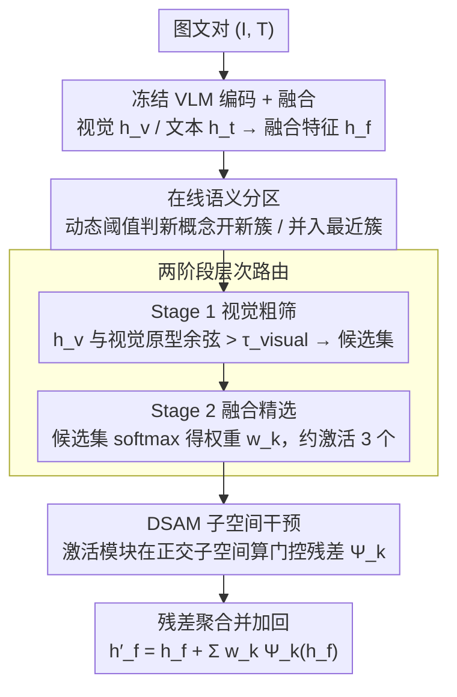

# DSCA: Dynamic Subspace Concept Alignment for Lifelong VLM Editing

**会议**: CVPR 2026  
**arXiv**: [2604.07965](https://arxiv.org/abs/2604.07965)  
**代码**: 无  
**领域**: 多模态VLM  
**关键词**: 知识编辑, 视觉语言模型, 子空间分解, 持续学习, 灾难性遗忘

## 一句话总结

DSCA通过将VLM的表征空间分解为一组正交语义子空间，在每个子空间内进行门控残差干预来实现知识编辑，从而在1000次连续编辑后仍保持>95%的编辑成功率且近乎零遗忘。

## 研究背景与动机

大型视觉语言模型（VLM）在长期部署中需要持续更新知识——事实会改变、用户偏好会演化、模型错误需要纠正，但不可能从头重训。现有的知识编辑方法主要有两条路线：一是基于门控适配器/MoE路由的方法（LiveEdit、DualEdit），通过路由逻辑选择性激活小型专家模块；二是参数合并方法（PAM、ConDU），学习新任务参数后合并回基础模型权重。

**核心痛点**：不论哪种方法，编辑最终都作用于VLM的**共享表征空间**。在这个高维流形中，概念之间是纠缠的——即使只修改一小部分参数，也会不可避免地扰动附近概念的表征位置，导致"耦合干扰"。随着编辑次数增加，这种干扰会累积，最终引发灾难性遗忘。

**核心矛盾**：现有方法试图通过**算法优化**（如正则化、蒸馏）来"软约束"编辑范围，但无法从架构层面**结构性隔离**不同概念的知识。

**本文切入角度**：既然现实世界中知识是组合式的、干预是局部的，那么编辑就应该发生在VLM的**概念子空间内**，而非共享表征流形上。DSCA将"概念隔离"从训练目标升级为**架构属性**——通过正交子空间分解建立结构性"防火墙"，使一个概念的编辑在数学上不可能干扰其他概念。

## 方法详解

### 整体框架

DSCA要解决的核心难题是：在一个冻结的VLM上做成百上千次连续编辑，又不让新编辑污染旧知识。它的做法不是去"约束"编辑别乱跑，而是先把共享表征空间切成一组互不重叠的概念子空间，让每次编辑只能在自己那块子空间里发生——结构上就堵死了串扰。

具体一次前向是这样转的：图像-文本对 $(I, T)$ 经VLM抽出视觉特征 $\mathbf{h}_v$ 和文本特征 $\mathbf{h}_t$，融合成 $\mathbf{h}_f = \text{Fuse}(\mathbf{h}_v, \mathbf{h}_t)$；这个融合特征先被在线聚类系统分派到某个概念簇，再经两阶段路由筛出该激活哪几个编辑模块（DSAM）；每个被选中的DSAM在它的正交子空间里算一个门控残差，最后把这些残差按路由权重叠回原特征：$\mathbf{h}'_f = \mathbf{h}_f + \sum_k w_k \Psi_k(\mathbf{h}_f)$。簇集合随编辑流不断长大，但任意一次干预都被锁在少数几个子空间内。

### 关键设计

**1. 在线语义分区：让概念簇随编辑流自己长出来**

知识编辑是个持续到来的流，你事先不知道总共会冒出多少个概念，所以簇的数量必须能动态扩展。DSCA对每个新来的融合特征 $\mathbf{h}_f$，先算它到现有所有簇原型的距离；如果连最近的簇都超过了该簇自己的动态阈值 $d_j = \mu_j + \alpha \cdot \sigma_j$，就判定这是个新概念、开一个新簇，否则把它并入最近簇并用EMA更新该簇原型。关键在于这个阈值不是全局定死的，而是用每个簇自身的距离均值 $\mu_j$ 和标准差 $\sigma_j$ 算出来——密集的簇容忍度收紧、松散的簇容忍度放宽，这样既不会对噪声过度敏感乱开簇，也不会迟钝到把真正的新概念塞进旧簇。

**2. 两阶段层次路由：先视觉粗筛、再融合精选，避免逐一比对上百个模块**

随着编辑累积，簇数 $K$ 可能涨到数百，每来一个输入都对所有DSAM算一遍既慢又容易误激活。DSCA把路由拆成两级：Stage 1 只用视觉特征 $\mathbf{h}_v$ 和各簇的视觉原型 $\mathbf{p}_{k,v}$ 算余弦相似度，把超过阈值 $\tau_{\text{visual}}$ 的留成一个小候选集——视觉信号便宜且区分度高，能把候选从几百快速压到个位数；Stage 2 再在这个候选集上用融合特征算softmax权重

$$w_k = \frac{\exp(s_k/\tau)}{\sum_{j} \exp(s_j/\tau)}$$

让最终激活同时顾及视觉和语言语义。两级配合的结果是平均每个输入只点亮约3个DSAM，绝大多数模块权重接近零。

**3. 动态结构化对齐模块（DSAM）：每个概念一块正交子空间，编辑只在子空间里发生**

这是整套方法的核心，也是路由筛出的少数模块真正动手编辑的地方。前面聚类已经把概念分开了，但如果还在全维表征上做编辑，不同概念的更新方向仍会重叠、相互干扰。DSAM给每个簇配一个独立的低秩子空间 $R_k \in \mathbb{R}^{r \times d_f}$（$r \ll d_f$），让该概念的编辑只能落在这块子空间里。它由三个部件组成：$R_k$ 是低秩基矩阵，用PCA初始化、再用Incremental PCA周期性精炼，并且是在残差化特征上计算的——这一点保证了不同子空间之间近似正交 $R_i^\top R_j \approx 0$；可学习变换 $(W_k, b_k)$ 把高维特征映到 $r$ 维子空间坐标，偏置 $b_k$ 负责把表征推向新概念的目标位置；逐分量门控 $\gamma_k(\mathbf{h}_f) = \sigma(W_{g,k}\mathbf{h}_f + b_{g,k})$ 是个输入自适应的对角矩阵，按维度衰减更新幅度。三者合起来给出干预量

$$\Psi_k(\mathbf{h}_f) = \Gamma_k(\mathbf{h}_f) \left[ R_k^\top \left( (W_k \mathbf{h}_f + b_k) - R_k \mathbf{h}_f \right) \right]$$

低秩既省算力又天然约束了编辑范围；正交性让"改A概念"在数学上无法波及"B概念"，这是结构性的隔离而非软约束；门控则让同一个DSAM对自己负责的编辑样本给出大更新、对无关输入给出近零更新，进一步压住误伤。括号里的 $-R_k \mathbf{h}_f$ 是把原特征在子空间内的投影减掉，只对"该改的那部分"做残差修正。

### 一个完整示例

以一次"把某地标的所属国家改正"的编辑为例：输入图文对融合成 $\mathbf{h}_f$ 后，在线分区发现它到最近簇的距离没超阈值，于是并入已有的"地标"簇并EMA微调原型。路由Stage 1 用视觉特征在全部约200个DSAM里粗筛，余弦相似度过阈的只剩约8个候选；Stage 2 在这8个里用融合特征算softmax，权重集中到3个、其余近零。这3个被激活的DSAM各自在自己的正交子空间里算门控残差 $\Psi_k$：负责该地标概念的那个门控全开、给出强更新把表征推向新国家，另两个门控部分衰减、只做微调。三个残差按 $w_k$ 加权叠回 $\mathbf{h}_f$ 得到 $\mathbf{h}'_f$，编辑完成。由于更新被锁在这几块子空间内、且与其它概念子空间正交，被改的只有"这个地标"，相邻的其它地标和无关知识的表征位置纹丝不动——这正是1000次编辑后仍近乎零遗忘的来源。

### 损失函数 / 训练策略

四项损失加权求和：$\mathcal{L} = \mathcal{L}_{\text{task}} + \lambda_{\text{align}} \mathcal{L}_{\text{align}} + \lambda_{\text{distill}} \mathcal{L}_{\text{cdistill}} + \lambda_{\text{sparse}} \mathcal{L}_{\text{sparse}}$

- $\mathcal{L}_{\text{task}}$：编辑样本上的因果语言建模损失，确保编辑成功
- $\mathcal{L}_{\text{align}}$：余弦相似度正则化，将编辑后的融合表征与未修改的文本表征对齐，维持跨模态一致性
- $\mathcal{L}_{\text{cdistill}}$：InfoNCE风格对比蒸馏损失，使重放样本的编辑后表征与冻结教师的表征保持一致，保护非编辑知识的关系几何
- $\mathcal{L}_{\text{sparse}}$：路由logits的$\ell_1$惩罚，防止无关样本触发过多DSAM激活

**双模式更新**：DSAM的干预参数 $(W_k, b_k, W_{g,k}, b_{g,k})$ 通过梯度下降快速更新；簇原型通过EMA慢更新；子空间基 $R_k$ 通过Incremental PCA周期性精炼——形成"慢演化知识库 + 快速适配"的双速机制。

## 实验关键数据

### 主实验

| 数据集 | 指标 | DSCA | LiveEdit/DualEdit (SOTA) | 提升 |
|--------|------|------|--------------------------|------|
| E-VQA (单次编辑) | Avg. | 98.50 | 97.84 (DualEdit) | +0.66 |
| E-IC (单次编辑) | Avg. | 98.00 | 97.85 (DualEdit) | +0.15 |
| E-VQA (1000次编辑) | Avg. | 95.23 | 92.76 (LiveEdit) | +2.47 |
| VLKEB (1000次编辑) | Avg. | 96.72 | 91.79 (LiveEdit) | +4.93 |
| CoIN | BWT | -9.37 | -19.45 (PAM) | 遗忘减半 |

### 消融实验

| 配置 | ES ↑ | Locality Δ ↓ | GEN ↑ | 说明 |
|------|------|-------------|-------|------|
| Full DSCA | 98.0 | 0.5 | 97.3 | 完整模型 |
| w/o 正交性 | 95.8 | 2.8 | 93.4 | Locality下降5.6×，证明正交子空间是核心 |
| w/o 门控稀疏 | 96.1 | 2.1 | 94.7 | 密集激活导致干扰增加 |
| 单阶段路由 | 96.9 | 1.9 | 95.0 | 粗筛+精细路由优于单一路由 |
| 无基残差 | 97.1 | 1.5 | 95.8 | 子空间内残差设计有助于精准编辑 |

### 关键发现

- **正交性是核心**：子空间重叠度与遗忘程度呈强线性相关（Pearson $r \approx 0.94$），残差化PCA使1000次编辑后重叠度稳定在 $\sim 3\times10^{-3}$
- **高度稀疏激活**：95%以上路由权重接近零，平均每个输入只激活约3个DSAM
- **幻觉抑制**：CHAIR-H从21.1（LiveEdit）降至15.9，降低约25%
- **通用能力无损**：在VQA-v2、MME等基准上反而略有提升（76.3 vs 74.1 on MME）

## 亮点与洞察

1. **从"优化约束"到"架构保证"的范式转变**：将概念隔离内建为正交子空间的几何属性，而非损失函数的软约束，是一个深刻的设计理念
2. **遗忘的几何化度量**：子空间重叠度 $\varepsilon = \|R_i^\top R_j\|_F^2$ 与遗忘之间的线性关系，为理解和预测持续学习中的遗忘提供了可操作的量化工具
3. **双速更新机制**设计优雅：梯度驱动的快速参数+数据驱动的慢速子空间结构，类似人类学习中的快速适应与缓慢整合

## 局限与展望

- 线性子空间假设可能对高度非线性或深度纠缠的概念不够充分
- 随着概念数$K$增长，维护正交子空间的成本增加，可能需要引入压缩或共享机制
- 依赖可靠的概念发现和路由，高度重叠或歧义的概念可能导致次优编辑
- 目前仅在图像-文本VLM上验证，扩展到视频-语言、音频-视觉等模态是未来方向

## 相关工作与启发

- **BaFT** [16]：在LLM上提出基级别非线性干预，本文将其扩展到VLM的多模态表征
- **LiveEdit** [3]：基于低秩MoE的VLM编辑方法，在1000次编辑后仍有性能衰退，DSCA在architecture层面解决了这一问题
- **ReFT** [35]：LLM的激活空间干预方法，但缺乏结构化隔离机制
- 启发：正交子空间分解+稀疏路由的架构模式可推广到其他需要持续适配的场景，如推荐系统的用户偏好更新

## 评分

- 新颖性: ⭐⭐⭐⭐⭐ 从架构层面用正交子空间解决知识编辑的干扰问题，范式创新
- 实验充分度: ⭐⭐⭐⭐⭐ 覆盖单次编辑、1000次持续编辑、CoIN持续学习、通用能力保持、幻觉评估、消融和几何诊断
- 写作质量: ⭐⭐⭐⭐ 结构清晰、动机阐述充分，部分符号较密集
- 价值: ⭐⭐⭐⭐⭐ 为VLM的长期运维提供了实用且有理论支撑的编辑机制

<!-- RELATED:START -->

## 相关论文

- [\[CVPR 2026\] Towards Dynamic Modality Alignment in Multimodal Continual Learning](towards_dynamic_modality_alignment_in_multimodal_continual_learning.md)
- [\[CVPR 2026\] Unified Personalized Understanding, Generating and Editing](unified_personalized_understanding_generating_and_editing.md)
- [\[CVPR 2026\] Concept-wise Attention for Fine-grained Concept Bottleneck Models](coat_cbm_concept_wise_attention.md)
- [\[CVPR 2026\] Bias Is a Subspace, Not a Coordinate: A Geometric Rethinking of Post-hoc Debiasing in Vision-Language Models](bias_is_a_subspace_not_a_coordinate_a_geometric_rethinking_of_post-hoc_debiasing.md)
- [\[CVPR 2026\] HOG-Layout: Hierarchical 3D Scene Generation, Optimization and Editing via Vision-Language Models](hog_layout_hierarchical_3d_scene_generation_optimization_and_editing.md)

<!-- RELATED:END -->
