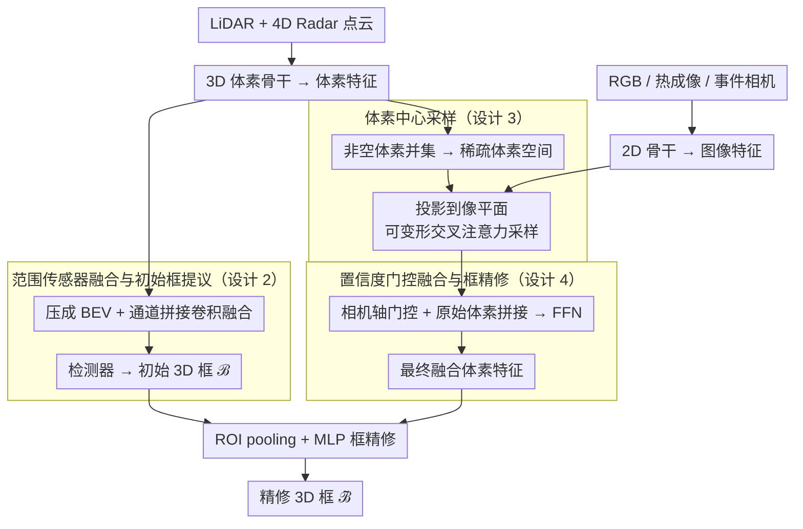

# DSERT-RoLL: Robust Multi-Modal Perception for Diverse Driving Conditions

**会议**: CVPR 2026  
**arXiv**: [2604.03685](https://arxiv.org/abs/2604.03685)  
**代码**: [https://jeongyh98.github.io/dsert-roll](https://jeongyh98.github.io/dsert-roll)  
**领域**: 自动驾驶 / 多模态感知  
**关键词**: multi-modal dataset, event camera, 4D radar, thermal camera, 3D detection

## 一句话总结

提出 DSERT-RoLL 驾驶数据集，首次集成立体事件相机、RGB、热成像、4D 雷达和双 LiDAR 六种传感器，覆盖多种天气和光照条件，并提出统一多模态 3D 检测融合框架。

## 研究背景与动机

自动驾驶感知在恶劣天气（雾、雨、雪）和极端光照条件下仍面临严峻挑战。传统 RGB+LiDAR 方案在这些场景中表现退化。新型传感器如事件相机（对高动态范围和快速运动鲁棒）、热成像（夜间有效）和 4D 雷达（恶劣天气穿透性强）各具互补优势，但现有数据集通常只包含部分传感器组合，缺乏在同一环境下对所有传感器的公平对比和系统研究。

DSERT-RoLL 的核心贡献在于：将所有这些新型传感器与传统传感器集成到同一采集平台，在相同场景下采集数据，使得跨传感器对比和融合研究首次成为可能。

## 方法详解

### 整体框架

DSERT-RoLL 有两部分贡献：**数据集**与**多模态融合框架**。数据集含 22K 帧六传感器同步数据，覆盖高速、城区、郊区场景以及雾、雨、雪、夜间、HDR 等恶劣天气与光照，并提供 3D/2D 框、track ID 与自车里程计。融合框架是一条「双路编码 → 范围传感器出初始框 → 相机特征注入 3D → 门控融合 → 框精修」的流水线：LiDAR 与 4D Radar 点云经 3D 体素骨干得到体素特征，RGB/热成像/事件图像经 2D 骨干得到图像特征；范围传感器分支先压成 BEV、通道拼接卷积融合后由检测器产出初始 3D 框提议；相机分支以非空体素为中心、把图像特征经可变形交叉注意力（deformable cross-attention）采样注入统一稀疏体素空间；再经相机轴置信度门控、与原始体素拼接得到最终融合特征；最后用初始框对融合特征做 ROI pooling 精修，输出精修 3D 框。

### 关键设计

**1. 全面传感器套件：同一平台、同一场景采集六种传感器**

立体 RGB（2448×2048）、立体事件相机（1280×720）、立体热成像（640×512）、4D 雷达（100m）、长距 LiDAR（150m）、短距高分辨 LiDAR（100m, 360°），所有相机均立体配置覆盖前向视场。关键不在于堆传感器数量，而在于首次把这六种传感器装在同一采集平台、在同一场景下同步记录，并配上 3D/2D 框、track ID 与自车里程计——这使得跨传感器家族（相机 vs 范围传感器）以及家族内（RGB/事件/热成像、LiDAR/4D Radar）的**公平对比与融合研究**首次成为可能，而此前的数据集大多只含其中一两种新型传感器、只能跟 RGB+LiDAR 对照。

**2. 范围传感器融合与初始框提议：BEV 通道拼接得到几何骨架**

LiDAR 与 4D Radar 各自体素化后沿垂直轴压成 BEV 特征，沿通道维拼接再用一层卷积融合，送入检测器产出 $n$ 个初始 3D 框提议 $\mathcal{B}$。LiDAR 给出精确几何，4D Radar 的 Doppler 速度在雾雪中穿透性强、弥补 LiDAR 退化。这一步刻意用简单的拼接卷积换取效率，为后续相机精修提供可靠的 3D 锚点，而不追求一次到位。

**3. 体素中心采样：以体素为中心把相机语义拉进 3D**

相机语义丰富但只有二维，难点是怎么和稀疏 3D 体素对齐而不引入视锥歧义。做法是先从 LiDAR/4D Radar 体素特征取非空体素索引并取并集，构成统一稀疏体素空间；再把每个非空体素中心用各相机的投影矩阵投到 RGB/热成像/事件像平面，以投影点为锚、以体素特征为 query 预测可变形采样偏移与聚合权重，对邻域图像特征做可变形交叉注意力，得到每个模态的图像增强体素特征。以体素（而非像素）为中心避免了「一个像素对应一条视线上多个深度」的歧义，且只在非空体素上计算，稀疏高效。

**4. 置信度门控融合与框精修：按相机可靠度加权再精修框**

RGB/事件/热成像在不同天气光照下的可靠度差异巨大，等权融合会被当前失效的模态拖累。做法是把三路图像增强体素特征拼成相机轴张量，用全局摘要经 sigmoid 算出每个相机一个标量门控 $\mathbf{w}\in[0,1]^{K}$，逐路重加权后与原始体素特征拼接、FFN 降维得到最终融合特征 $\tilde{\mathbf{F}}_V$；最后对初始框 $\mathcal{B}$ 在 $S\times S\times S$ 子体素上做 ROI pooling 取出框对齐特征，经 MLP 回归出精修框 $\tilde{\mathcal{B}}$。门控让模型在夜间自动抬高热成像权重、在 HDR/过曝下抬高事件相机权重，实现「按条件选模态」而非死板等权。

### 损失函数 / 训练策略

整个框架端到端训练，总损失为三项加权：RPN 损失 $\mathcal{L}_{\text{RPN}}$、置信度预测损失 $\mathcal{L}_{\text{conf}}$、框回归损失 $\mathcal{L}_{\text{reg}}$。训练/测试按 7:3 划分，确保天气、光照和类别分布在两个集合间平衡。

## 实验关键数据

### 主实验

| 模态组合 | 天气-晴 | 天气-雾 | 天气-大雪 | 光照-HDR |
|---------|--------|--------|---------|---------|
| L (仅LiDAR) | 82.90 | 65.67 | 54.14 | 74.51 |
| R+L | 84.67 | 66.14 | 59.43 | 79.31 |
| 4R+L | 88.26 | 67.41 | 69.96 | 82.98 |
| R+E+T+4R+L (全模态) | 90.30 | 71.42 | 72.94 | 86.33 |

### 关键发现

- 4D Radar 在恶劣天气（大雪 +15.82 vs 仅 LiDAR）中贡献最显著
- 事件相机在 HDR 和过曝光照条件下特别有价值
- 热成像在低光照和夜间场景中补充 RGB 的不足
- 全模态融合在所有条件下均最优，证实了传感器互补性

## 亮点与洞察

- 首个同时包含六种传感器（含新型传感器）并在同一环境采集的驾驶数据集
- 系统性地揭示了不同传感器在不同环境条件下的优势和劣势
- 体素中心采样策略优雅地解决了异构传感器到统一 3D 空间的映射问题
- 数据分布在天气、光照和类别间精心平衡

## 局限与展望

- 数据集规模（22K 帧）相比 Waymo 等大型数据集偏小
- 仅三个目标类别（车辆、行人、自行车），覆盖范围有限
- 传感器标定和时间同步在极端条件下可能存在偏差

## 相关工作与启发

- 与 K-Radar（4D 雷达）、DSEC（事件相机）、KAIST（热成像）等单传感器数据集互补
- 融合框架的模块化设计便于未来探索更多传感器组合

## 评分

- 新颖性：⭐⭐⭐⭐⭐ — 首个全面的多新型传感器驾驶数据集
- 技术深度：⭐⭐⭐⭐ — 融合框架设计合理
- 实验充分度：⭐⭐⭐⭐⭐ — 系统性消融各传感器组合
- 实用价值：⭐⭐⭐⭐⭐ — 填补了多传感器研究的数据空白

<!-- RELATED:START -->

## 相关论文

- [\[ICLR 2026\] Multi-modal Data Spectrum: Multi-modal Datasets are Multi-dimensional](../../ICLR2026/multimodal_vlm/multi-modal_data_spectrum_multi-modal_datasets_are_multi-dimensional.md)
- [\[CVPR 2026\] Multi-Modal Image Fusion via Intervention-Stable Feature Learning](multi-modal_image_fusion_via_intervention-stable_feature_learning.md)
- [\[CVPR 2026\] Wan-Weaver: Interleaved Multi-modal Generation via Decoupled Training](wan-weaver_interleaved_multi-modal_generation_via_decoupled_training.md)
- [\[CVPR 2026\] Decoupling Stability and Plasticity for Multi-Modal Test-Time Adaptation](decoupling_stability_and_plasticity_for_multi-modal_test-time_adaptation.md)
- [\[CVPR 2026\] Devil is in Narrow Policy: Unleashing Exploration in Driving VLA Models](devil_is_in_narrow_policy_unleashing_exploration_in_driving_vla_models.md)

<!-- RELATED:END -->
