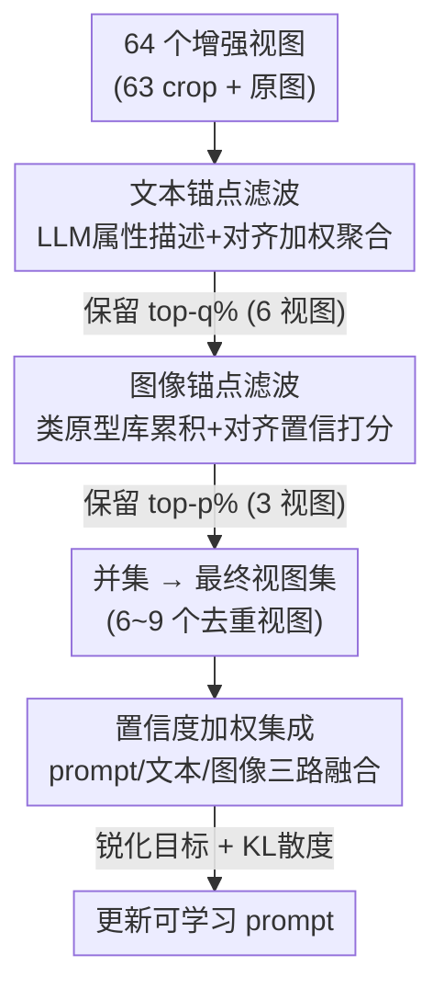

# Dual-Modality Anchor-Guided Filtering for Test-time Prompt Tuning

**会议**: CVPR 2026  
**arXiv**: [2604.12403](https://arxiv.org/abs/2604.12403)  
**代码**: 待确认  
**领域**: 多模态VLM / 测试时自适应  
**关键词**: 测试时提示微调, 视图选择, 双模态锚点, CLIP, 熵滤波

## 一句话总结
针对测试时提示微调（TPT）中"熵滤波选错增强视图反而带偏 prompt"的痛点，本文用 LLM 属性描述构造的**文本锚点**和测试时累积的**图像锚点**做语义引导的视图筛选，再把两锚点当作辅助预测头做置信度加权集成，在 15 个 benchmark 上把平均精度提了 3.36%。

## 研究背景与动机

**领域现状**：CLIP 这类视觉-语言模型靠图文对齐做零样本分类，效果高度依赖 prompt 质量。测试时提示微调（TPT）的做法是：对每张测试图生成几十个随机裁剪增强视图，让模型对这些视图预测，再通过**最小化平均预测的熵**来在线更新可学习 prompt，从而适应当前测试分布、无需任何标签。

**现有痛点**：标准增强（random crop / resize）会产出大量"噪声视图"——很多裁剪丢掉了关键物体区域、过度暴露背景、或只包含与目标类弱相关的内容。对这些不可靠视图最小化熵是危险的：它会**强化模型对错误预测的自信**，把 prompt 往错误语义方向带（论文 Fig.1：噪声视图导致把 Abyssinian 猫错判）。

**核心矛盾**：现有 TPT（TPT / PromptAlign / DynaPrompt）几乎都只靠**预测熵**来筛视图，而熵滤波有两个根本缺陷。其一，分布偏移下模型的熵本身就不可靠，会对语义无关的视图给出过度自信的低熵，于是**错的视图被选进来**；其二，熵是用粗糙的初始 prompt（"a photo of a [CLASS]"）算的，缺乏区分细粒度属性的能力，没法在易混裁剪里验证真实类别。另有工作（DiffTPT）补了"与原图的余弦相似度"，但其收益主要来自扩散增强的高多样性；在标准增强下，相似度准则反而偏好"长得像原图"的视图、削弱多样性和泛化。

**本文目标**：在**标准增强**（保持高效、广泛适用）这一现实设定下，找到一个比"熵"和"刚性视觉相似度"都更可靠的视图选择信号。

**切入角度**：与其相信模型自己的内部置信度，不如把视图选择**锚定在外部语义证据上**——用一个富含类属性的语义参照系来判断"这个视图到底像不像目标类"。

**核心 idea**：构造**双模态锚点**（文本锚点提供细粒度类语义、图像锚点捕捉测试时演化的视觉统计），用锚点-视图的对齐度联合置信度来筛视图；并把锚点同时当作辅助预测头，用置信度加权集成出一个稳定的监督目标分布，用 KL 散度而非熵最小化来更新 prompt。

## 方法详解

### 整体框架
方法是一条"先筛视图、再集成监督"的串行管线，可无缝插进已有 prompt tuning（CoOp / MaPLe 等）。对每张测试图：先离线用 LLM 为每个类生成属性描述并用 CLIP 文本编码器编码进知识库；测试时把 64 个增强视图（63 个 random crop + 原图）编码，先用**文本锚点**做对齐+置信度联合打分、保留 top-$q\%$；被文本筛过的视图再累积进**类原型库**形成**图像锚点**、做第二轮联合打分保留 top-$p\%$；两路结果取并集得到最终视图集。最后把原始 prompt、文本锚点、图像锚点三路预测做**置信度加权集成**得到锐化目标分布，用 KL 散度更新 prompt。

### 关键设计

**1. 文本锚点：用 LLM 属性描述替掉粗糙模板 prompt，做语义引导的视图筛选**

熵滤波的第二个缺陷是用 "a photo of a [CLASS]" 这种粗 prompt 算分，区分不了细粒度属性。本文改用 LLM 为每个类离线生成多条属性描述（如 "Dog has a soft coat, floppy ears, and a wagging tail"），CLIP 文本编码成知识库。但不同描述对具体图像的相关性不一样，所以不是简单平均，而是做**对齐加权聚合**：对视图 $b$、类 $c$、描述 $i$ 算对齐分 $s_\rho = \text{sim}(e_b, w^i_c) - \text{sim}(e_b, \bar{w}_c)$，即该描述相对类均值特征 $\bar{w}_c=\frac1N\sum_i w^i_c$ 的边际增益；再经 softmax 得权重 $a_{b,c,i}=\frac{\exp(s_{b,c,i})}{\sum_j \exp(s_{b,c,j})}$、跨视图平均后聚合出文本锚点 $t_c=\sum_i \bar{a}_{c,i} w^i_c$。这个减均值的设计很关键——它度量的是"这条描述比通用描述多带了多少语义信息"，从而在低方差场景下也能给出有区分度的信号。有了锚点，再对每个视图算**联合对齐-置信分**：$S_{\text{text}}(e)=\alpha_1 s_{\text{align}}(e)+\alpha_2 s_{\text{conf}}(e)$，其中 $s_{\text{align}}(e)=\max_c \text{sim}(e, t_c)$ 是与最近类锚点的对齐度，$s_{\text{conf}}(e)=1-\frac{H(p(y|e))}{\log C}$ 是归一化置信度，保留 top-$q\%$。这就把"只看熵"换成了"既要强对齐某类锚点、又要低不确定性"，自然压低了那些自信但语义错、或背景主导的视图

**2. 图像锚点：用测试时累积的类原型库捕捉当前分布的视觉统计，补文本之外的外观线索**

文本锚点提供的是语义先验，但它捕捉不到测试域特有的视觉外观变化（光照、风格、域偏移下的纹理）。本文为此维护一个**类级原型库** $P=\{p_c\}_{c=1}^C$ 当作"记忆"：对文本滤波选出的每个视图嵌入 $e$，用适应前的原模型预测其类别 $c$，再用累积平均更新对应原型 $p_c \leftarrow \frac{n_c p_c + e}{n_c+1}$（$n_c$ 是该类历史更新次数）。对给定测试图，按视图平均预测 $\bar\pi_c$ 取 top-$K$ 个类、收集其原型构成图像锚点集 $A_{\text{img}}$。然后与文本路并行地算第二轮联合分 $S_{\text{img}}(e)=\beta_1 s_{\text{align}}(e)+\beta_2 s_{\text{conf}}(e)$，保留 top-$p\%$，最终视图集取两路**并集**（去重）。两路互补：文本路保语义保真度、图像路保视觉一致性，即便在熵和直接相似度都失效的分布偏移下也能可靠验证视图。值得注意，作者发现一旦视图选择是"语义感知"的，标准增强甚至能超过昂贵的扩散增强

**3. 置信度加权集成 + KL 锐化目标：把锚点从"滤波器"升级成"辅助预测头"，给出去偏的监督信号**

筛完视图后，直接对它们最小化熵（prior works 的做法）仍会鼓励有偏更新（自我锐化、易塌缩到过度自信却语义不一致的预测）。本文的解法是让双锚点不只当滤波器、还当**辅助预测源**。对每个选中视图，分别用图像特征与（i）原始 prompt 嵌入、（ii）文本锚点 $t_c$、（iii）图像原型 $p_c$ 算相似度，得三路 logits $z_{\text{prompt}}, z_{\text{text}}, z_{\text{image}}$。每路过 softmax 得 $q_k$，取其最大概率作置信度 $\gamma_k=\max(q_k)$，归一化成权重 $w_k=\frac{\gamma_k}{\sum_{j} \gamma_j + \epsilon}$，加权得集成向量 $z_{\text{ens}}=\sum_k w_k z_k$。再对集成 logits 跨视图平均、用温度 $T=0.3$ 锐化成目标分布 $\tilde q$，最后用 KL 散度更新 prompt：$\mathcal{L}_{\text{TPT}}=D_{\text{KL}}(\tilde q \,\|\, p_v)$，其中 $p_v$ 是原 prompt 路预测。区别于熵最小化的"自我锐化"，这里的目标分布来自三路的鲁棒共识——哪路对当前图最自信就更信哪路，从而抑制单源错误、防止塌缩到过度自信的错误语义

### 损失函数 / 训练策略
最终损失即上式 KL 散度 $\mathcal{L}_{\text{TPT}}=D_{\text{KL}}(\tilde q \| p_v)$。骨干为 CLIP ViT-B/16，优化文本嵌入空间的 4 个可学习 prompt token；每图生成 63 个 random resized crop + 原图共 64 视图，文本锚点保留 top 10%（6 视图）、图像锚点保留 top 5%（3 视图），并集后 6~9 个去重视图；AdamW，学习率 0.003，单卡 RTX 6000 Ada；所有 prompt tuning 方法均在 ImageNet 16-shot 训练。

## 实验关键数据

### 主实验

域泛化（ImageNet 五变体，top-1 准确率 %）：

| 方法 | ImageNet | -A | -V2 | -R | -Sketch | Average | OOD Avg. |
|------|----------|------|------|------|---------|---------|----------|
| CLIP ViT-B/16 | 66.73 | 47.87 | 60.86 | 73.98 | 46.09 | 59.11 | 57.20 |
| TPT | 68.98 | 54.77 | 63.45 | 77.06 | 47.06 | 62.06 | 60.81 |
| DiffTPT | 70.30 | 55.68 | 65.10 | 75.00 | 46.80 | 62.26 | 60.65 |
| DynaPrompt | 69.61 | 56.17 | 64.67 | 78.17 | 48.22 | 63.37 | 61.81 |
| **Ours** | **72.21** | **59.65** | **65.35** | **80.25** | **51.24** | **65.74 (+3.68)** | **64.12 (+3.31)** |
| MaPLe + Ours | 72.31 | 59.65 | 66.84 | 80.50 | 52.11 | 66.28 | 64.78 |

相比 TPT，Average +3.68%、OOD +3.31%；相比最强 baseline DynaPrompt 仍有 Average +2.37%。跨数据集 10 个 benchmark 上 Ours 平均 68.81%，比最强 prompt learning 方法 CoPrompt（67.00%）高 1.81%，MaPLe + Ours 进一步刷到 69.36%。

推理效率（ImageNet-R）：Ours 80.25%、每图仅 0.2 sec，与 vanilla TPT 同量级；DiffTPT > 0.6 sec 且精度更低（75.00%），DynaPrompt 0.4 sec（78.17%）。

### 消融实验

选择策略对比（域泛化 Average / OOD）：

| 配置 | Average | OOD Avg. | 说明 |
|------|---------|----------|------|
| TPT (baseline，无选择) | 60.91 | 59.03 | 不做视图筛选 |
| + Cosine Sel.（与原图相似度） | 62.21 | 60.51 | 最差，仅靠视觉相似度不可靠 |
| + Confidence Sel.（仅熵） | 62.44 | 60.81 | 熵滤波 |
| + Ours（Anchor Sel.） | 64.00 (+3.09) | 62.37 (+3.34) | 锚点引导筛选 |

四组件逐步激活（Flowers / DTD / ImageNet，top-1 %）：

| $S_{\text{text}}$ | $S_{\text{img}}$ | $z_{\text{text}}$ | $z_{\text{img}}$ | Flowers | DTD | ImageNet |
|------|------|------|------|---------|-----|----------|
| ✗ | ✗ | ✗ | ✗ | 69.39 | 46.63 | 68.98 |
| ✓ | ✗ | ✗ | ✗ | 70.36 | 49.41 | 70.52 |
| ✓ | ✓ | ✗ | ✗ | 71.54 | 49.70 | 70.53 |
| ✓ | ✓ | ✓ | ✗ | 72.84 | 51.36 | 71.04 |
| ✓ | ✓ | ✓ | ✓ | **74.71** | **53.19** | **72.21** |

### 关键发现
- **视图选择本身是 TPT 的关键**：从无选择到锚点选择，Average 提了 3.09%；而 cosine 相似度选择反而是最差的滤波策略，说明"像原图"不等于"语义对"。
- **文本锚点贡献最大的单一组件**：仅加 $S_{\text{text}}$ 就把 DTD 从 46.63 拉到 49.41；图像锚点提供互补增益，两路集成 $z_{\text{text}}/z_{\text{img}}$ 进一步逐步加分，全配置最佳。
- **损失与集成互补**（Table 7）：把熵最小化（EM）换成 KLD，OOD 从 61.15→62.51；再加置信度加权集成到 63.01、CD 到 68.81，二者叠加最优。
- **超参不敏感但有偏好**：文本模块对齐:熵在 1:2 最佳（OOD 63.01），图像模块在 2:1 最佳——文本路更依赖熵稳住、图像路更依赖对齐。
- **对齐加权聚合有效**：相比简单平均所有描述（OOD 62.53），加权聚合达 63.01，+0.48%。

## 亮点与洞察
- **把"该信谁"外部化**：核心洞见是分布偏移下模型自身置信度（熵）不可信，于是引入 LLM 语义 + 测试时累积视觉统计两个外部锚点来裁决视图——这是对"自我监督会自我强化偏差"这一 TPT 根本病灶的正面回应。
- **同一组锚点身兼二职**：锚点既当滤波器（选视图）又当预测头（出监督信号），用一套表示覆盖"选什么"和"学什么"两个环节，设计很经济。
- **减均值的对齐分很巧**：$\text{sim}(e,w^i_c)-\text{sim}(e,\bar w_c)$ 度量描述的"边际增益"而非绝对相似度，自动抑制了对所有图都泛泛相似的通用描述，这个 trick 可迁移到任何"多模板/多描述加权聚合"场景。
- **轻量可插拔**：相比 DiffTPT 的扩散增强，本文在标准增强下用语义感知选择就超过了扩散，且推理仅 0.2 sec、可直接挂到 CoOp/MaPLe 上，工程友好。

## 局限与展望
- **依赖 LLM 描述质量**：文本锚点完全建立在 LLM 离线生成的属性描述上，对 LLM 不熟悉的细粒度/长尾类别（如 FGVC-Aircraft、专业领域），描述可能空泛或失真，论文未深入讨论这种失效。
- **图像锚点的冷启动**：原型库靠测试时累积，序列早期 $n_c$ 很小、原型不可靠，且用"适应前原模型"打的伪标签更新原型，若初始预测系统性偏错会污染原型库——论文未报告样本顺序/数量对原型质量的影响。
- **超参偏多**：$q\%,p\%,K,\alpha_{1:2},\beta_{1:2},T$ 都需设定，虽然 Table 6 显示对齐:熵比例不敏感，但 top-$q/p$ 比例和 $K$ 的敏感性未给出。
- **设定局限**：实验全在 16-shot ImageNet 训练 + 单图测试时适应的图像分类任务上，未验证检测/分割等密集任务或更大骨干的可扩展性。

## 相关工作与启发
- **vs TPT / DynaPrompt（纯熵滤波）**：它们只用预测熵选视图、并对选中视图最小化熵，语义盲、会自我强化偏差；本文用双模态锚点把选择和监督都锚到外部语义证据，并换成 KL 锐化目标，避免塌缩。
- **vs DiffTPT（扩散增强 + 余弦相似度）**：DiffTPT 靠扩散生成高多样视图、再用与原图相似度筛，计算重（>0.6 sec）；本文指出在标准增强下相似度准则反而削弱多样性，而语义感知选择即便用标准增强也能超过扩散，且省掉扩散开销。
- **vs PromptAlign（对齐 token 统计）**：PromptAlign 显式对齐图像 token 嵌入的均值方差到代理源数据集，适用性受限；本文不需要代理源、纯靠测试时锚点，模块化更强。
- **vs 属性识别工作**：借鉴了"用细粒度属性描述替代 label-only prompt 增强判别力"的思路，但首次把它用进测试时视图选择与集成监督。

## 评分
- 新颖性: ⭐⭐⭐⭐ 首次系统地把"视图选择"作为 TPT 的核心问题，用双模态锚点替掉熵滤波，角度清晰
- 实验充分度: ⭐⭐⭐⭐⭐ 15 个 benchmark + 选择策略/四组件/损失集成/超参/聚合多维消融，证据扎实
- 写作质量: ⭐⭐⭐⭐ 动机与方法链路清楚，公式完整；图像锚点冷启动等潜在风险讨论略浅
- 价值: ⭐⭐⭐⭐ 轻量可插拔、推理近零开销且稳定提点，对 TPT 实用价值高

<!-- RELATED:START -->

## 相关论文

- [\[CVPR 2026\] Controllable Federated Prompt Learning at Test Time](controllable_federated_prompt_learning_at_test_time.md)
- [\[CVPR 2026\] SoC: Semantic Orthogonal Calibration for Test-Time Prompt Tuning](soc_semantic_orthogonal_calibration_for_test-time_prompt_tuning.md)
- [\[CVPR 2026\] Improving Calibration in Test-Time Prompt Tuning for Vision-Language Models via Data-Free Flatness-Aware Prompt Pretraining](improving_calibration_in_test-time_prompt_tuning_for_vision-language_models_via_.md)
- [\[CVPR 2026\] STAR: Test-Time Adaptation Can Enhance Universal Prompt Learning for Vision-Language Models](star_test-time_adaptation_can_enhance_universal_prompt_learning_for_vision-langu.md)
- [\[CVPR 2026\] Towards Calibrating Prompt Tuning of Vision-Language Models](towards_calibrating_prompt_tuning_of_vision-language_models.md)

<!-- RELATED:END -->
