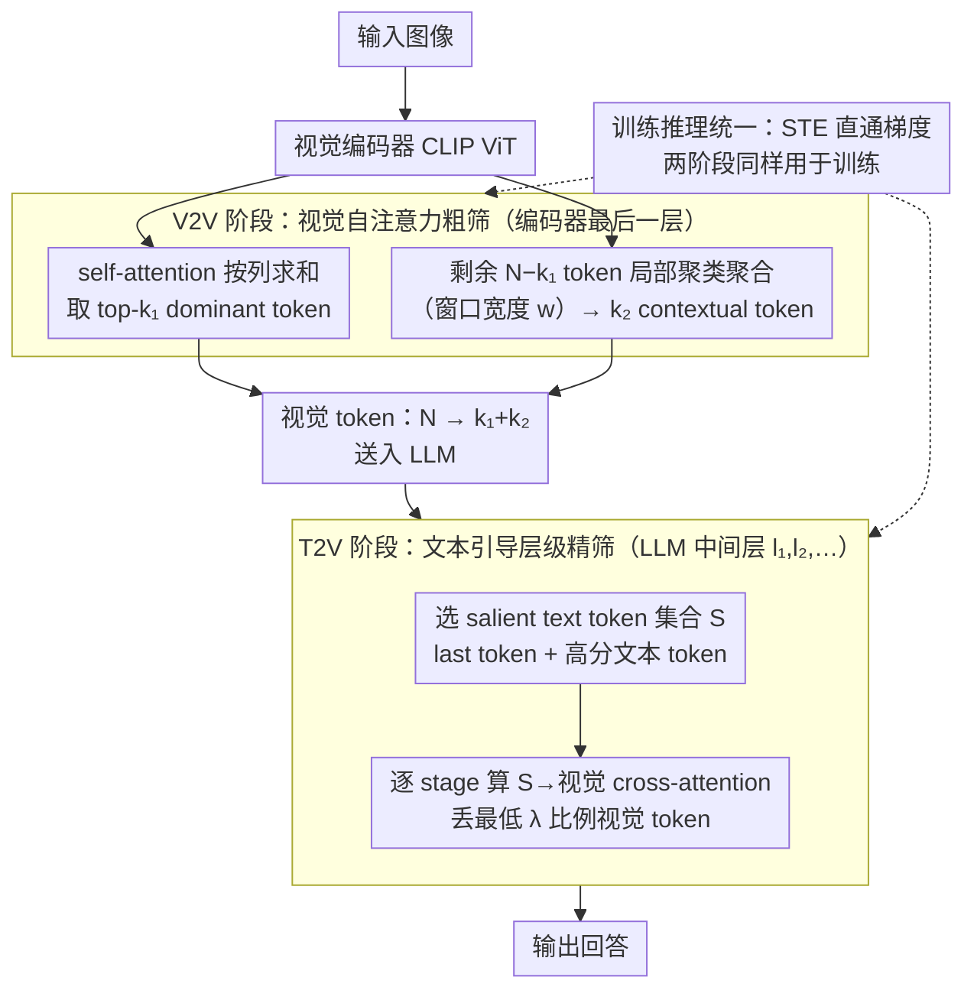

# DUET-VLM: Dual Stage Unified Efficient Token Reduction for VLM Training and Inference

**会议**: CVPR2026  
**arXiv**: [2602.18846](https://arxiv.org/abs/2602.18846)  
**代码**: [https://github.com/AMD-AGI/DUET-VLM](https://github.com/AMD-AGI/DUET-VLM)  
**领域**: 多模态VLM  
**关键词**: VLM token压缩, 视觉token冗余, 双阶段token裁剪, 注意力引导聚合, 层级pruning

## 一句话总结
提出 DUET-VLM 双阶段视觉 token 压缩框架：第一阶段在视觉编码器内通过 V2V self-attention 选取 dominant tokens 并将剩余 tokens 通过注意力引导局部聚类合并为 contextual tokens；第二阶段在 LLM 内通过 T2V cross-attention 层级裁剪视觉 tokens。在 LLaVA-1.5-7B 上实现 67% token 压缩保持 99%+ 精度、89% 压缩保持 97%+ 精度，训练时间减少 31%。

## 背景与动机

1. **领域现状**：VLM（如 LLaVA、InternVL）依赖大量视觉 tokens 将图像信息传递给 LLM，但视觉 tokens 存在严重冗余——大量 tokens 对应背景或重复纹理区域，并非语义核心。
2. **现有痛点**：现有 token 压缩方法是**单侧**的——要么只在视觉编码器侧压缩（VisionZip、HiRED），要么只在 LLM 侧压缩（FastV、PyramidDrop），无法同时利用两侧信息进行最优压缩。
3. **核心矛盾**：Vision-only 方法缺乏文本引导信号，不知道哪些视觉 tokens 对当前问题真正重要；Language-only 方法只能在 LLM 内部做后处理，已经浪费了前几层的计算资源。
4. **本文目标**：如何设计一个统一的双阶段框架，在视觉编码器内和 LLM 内分别进行互补的 token 压缩，同时适用于训练和推理？
5. **切入角度**：第一阶段利用视觉 tokens 之间的 self-attention（V2V）做粗粒度压缩；第二阶段利用文本对视觉的 cross-attention（T2V）做细粒度裁剪。
6. **核心 idea**：V2V 阶段通过 attention-guided local cluster aggregation（固定宽度 $w$ 的局部聚类而非全局平均）保留空间上下文信息；T2V 阶段通过层级 pruning 逐步 drop 低相关性视觉 tokens。

## 方法详解

### 整体框架
DUET-VLM 想解决的是视觉 token 冗余问题，但它的切入点和以往方法不同：不在视觉侧或语言侧单挑一处压缩，而是让两侧各做一半、彼此互补。整条流水线分两段串起来：图像先进视觉编码器（如 CLIP ViT），在它的最后一层做第一段 V2V（Vision-to-Vision）压缩，把 $N$ 个 patch token 砍成一小撮；这撮 token 进入 LLM 后，再在 decoder 的若干中间层做第二段 T2V（Text-to-Vision）压缩，借文本问题进一步裁掉与回答无关的视觉 token。两段用的都是模型自带的 attention，不引入额外网络，因此训练和推理可以套同一套压缩逻辑（靠 straight-through estimator 把离散的选/丢操作变成可端到端训练）。

### 关键设计

**1. V2V 阶段：在视觉编码器内部用视觉自注意力做粗筛**

第一段压缩发生在视觉编码器最后一层，目标是不依赖任何文本信号、先把明显冗余的背景和重复纹理 token 去掉。它把 $N$ 个视觉 token 的命运分成两类。第一类是 **dominant token**：对这一层的 self-attention 矩阵按列求和，得到每个 token 的"被关注度"（被多少其他 token 看重），取 top-$k_1$ 个保留下来——这些是全局语义最显著的 token。第二类是剩下的 $N-k_1$ 个，它们不直接丢弃，而是经 **attention-guided local cluster aggregation** 合并成 $k_2$ 个 **contextual token**：以每个聚类中心为锚，只在固定窗口宽度 $w$ 内挑 attention score 最高的若干邻居做加权平均。这里的关键是那个"固定宽度 $w$"——VisionZip 一类做法把所有剩余 token 全局平均成几个 contextual token，会把空间上相隔很远、语义差异很大的 token 混在一起，信息被稀释；限定在局部窗口内聚合，保证被合并的 token 空间相近、语义相似，合出来的 token 仍代表一块连贯区域。压缩后视觉 token 数从 $N$ 降到 $k_1+k_2$。

**2. T2V 阶段：在 LLM 内部用文本对视觉的注意力做层级精筛**

V2V 砍完之后送进 LLM 的 token 仍有进一步压缩空间，但这一步该砍谁取决于"当前问题问的是什么"，所以要用文本来引导。DUET-VLM 先从文本里选出一组 **salient text token** 集合 $S$：包含序列的 last token（它充当 attention sink，承接大量注意力）以及 attention score 最高的若干文本 token。然后在 LLM 的若干指定中间层（第 $l_1, l_2, \ldots$ 层）分多个 stage 渐进裁剪——每个 stage 计算 $S$ 中文本 token 对当前视觉 token 的 T2V cross-attention score，按分数排序丢掉最低的 $\lambda$ 比例。之所以分多 stage 而不是一刀切，是因为浅层 attention 还没"看清"图文关系、判断不可靠，逐层渐进地裁让每一步的决策都基于更成熟的注意力，避免早期误删关键 token。

**3. 训练与推理统一的双阶段压缩**

多数 token 压缩方法（FastV、PyramidDrop 等）只在推理时压缩，训练照样喂全量 token，大规模 VLM 的训练成本并没降下来。DUET-VLM 把上面两段压缩原封不动搬到训练里：训练时同样在 V2V 选 dominant/contextual token、在 T2V 做层级裁剪，送进 LLM 的 token 变少，FLOPs 和显存随之下降。难点在于选 token 和丢 token 都是离散操作、会截断梯度，这里用 straight-through estimator 让前向按硬选择执行、反向仍能把梯度回传到被选/被丢的 token 上，从而支持端到端训练。统一训练与推理的压缩策略，是这篇能拿到约 31% 训练时间节省的来源。

### 损失函数 / 训练策略
- 标准自回归 language modeling loss，与 LLaVA 一致
- 训练时直接应用双阶段 token 压缩，无需额外蒸馏或辅助 loss
- V2V 阶段参数 $k_1, k_2, w$ 和 T2V 阶段参数 $\lambda$、pruning layers 为超参数

## 实验关键数据

### 主实验——LLaVA-1.5-7B 推理

| 方法 | Token 压缩率 | 保留精度 | 备注 |
|------|-------------|---------|------|
| FastV | 50%↓ | ~98% | LLM-only pruning |
| PyramidDrop | 50%↓ | ~98% | LLM-only 层级 |
| VisionZip | 67%↓ | ~97% | Vision-only |
| HiRED | 67%↓ | ~96% | Vision-only 层级 |
| FitPrune | 67%↓ | ~98% | 训练感知 pruning |
| **DUET-VLM** | **67%↓** | **99%+** | 双阶段 |
| **DUET-VLM** | **89%↓** | **97%+** | 双阶段极端压缩 |

### 训练时双阶段压缩

| 压缩率 | 保留精度 | 训练时间节省 |
|--------|---------|-------------|
| 67%↓ | 99.7% | ~31% |
| 89%↓ | 97.6% | ~31% |

### Video-LLaVA-7B

| 压缩率 | 保留精度 | 备注 |
|--------|---------|------|
| 53.1%↓ | 100%+（超 baseline） | 压缩后反而提升 |
| 93.4%↓ | 97.6% | 极端压缩 |

### 关键发现
- **双阶段 > 单侧**：V2V-only 或 T2V-only 均不如双阶段组合，证实两阶段信息互补
- **局部聚类 > 全局平均**：固定宽度 $w$ 的 local cluster aggregation 显著优于 VisionZip 的全局 contextual token 策略
- **视频场景更受益**：Video-LLaVA 在 53.1% 压缩率下精度反超 baseline，说明 token 冗余在视频中更严重，适度压缩反而去噪
- **训练压缩可行**：训练时应用 67% 压缩，精度仅损失 0.3%，但训练时间减少 31%
- **超越所有现有方法**：在相同压缩率下，DUET-VLM 在所有 benchmark 上均优于 VisionZip、FastV、PyramidDrop、HiRED、FitPrune

## 亮点与洞察
- **"双阶段互补"的設計哲学**：V2V 利用视觉内部信息做粗筛（不依赖文本），T2V 利用文本引导做精筛。两阶段分别解决不同层面的冗余，避免了单侧方法的信息盲区
- **局部聚类的简洁与有效**：用固定宽度 $w$ 做局部聚类，避免了复杂的全局聚类算法（如 k-means），计算开销小但效果显著优于全局平均
- **统一训练与推理**：大多数 token 压缩方法只看推理效率，DUET-VLM 在训练阶段即可生效，这在大规模 VLM 训练中有实际价值
- **视频压缩后反超 baseline**：53.1% 压缩率下精度反升，说明冗余 tokens 不仅浪费资源还引入噪声

## 局限与展望
- 仅在 LLaVA-1.5-7B 和 Video-LLaVA-7B 上验证，缺少更大规模模型（如 13B/34B）的实验
- V2V 阶段的 $k_1, k_2, w$ 为固定超参数，不同图像/任务可能需要自适应调整
- 未与最新的 InternVL2、Qwen-VL 等架构验证兼容性
- T2V 阶段的 salient text token 选择依赖 attention sink 假设，对非标准 prompt 格式的鲁棒性未知
- 缺少对压缩后 attention pattern 变化的深入分析

## 相关工作与启发
- **vs VisionZip**: VisionZip 在视觉编码器侧做 dominant + contextual token 选择，但 contextual tokens 用全局平均导致信息稀释。DUET-VLM 改用 local cluster aggregation，并加入 T2V 阶段
- **vs FastV/PyramidDrop**: 两者均在 LLM 侧做 attention-based pruning，但缺少视觉编码器侧的初步筛选。DUET-VLM 的 V2V 阶段先做粗筛，T2V 阶段压力更小
- **vs FitPrune**: FitPrune 通过训练感知优化 pruning 策略，但仍是单侧方法。DUET-VLM 在训练和推理均可应用双阶段压缩
- **vs HiRED**: HiRED 在视觉编码器内做层级 attention-based 压缩，但不涉及 LLM 侧。DUET-VLM 在两侧均做层级压缩

## 评分
- 新颖性: ⭐⭐⭐⭐ 双阶段 V2V+T2V 框架是首次提出，local cluster aggregation 设计简洁有效
- 实验充分度: ⭐⭐⭐⭐ 覆盖图像和视频场景，训练和推理均验证，消融实验完整
- 写作质量: ⭐⭐⭐⭐ 动机清晰，方法描述详细，图示直观
- 价值: ⭐⭐⭐⭐⭐ VLM token 压缩的实用方案，训练加速 31% 有显著工程价值

<!-- RELATED:START -->

## 相关论文

- [\[CVPR 2026\] VLM-Pruner: Buffering for Spatial Sparsity in an Efficient VLM Centrifugal Token Pruning Paradigm](vlm-pruner_buffering_for_spatial_sparsity_in_an_efficient_vlm_centrifugal_token_.md)
- [\[ICCV 2025\] SparseVILA: Decoupling Visual Sparsity for Efficient VLM Inference](../../ICCV2025/multimodal_vlm/sparsevila_decoupling_visual_sparsity_for_efficient_vlm_inference.md)
- [\[AAAI 2026\] Filter, Correlate, Compress: Training-Free Token Reduction for MLLM Acceleration](../../AAAI2026/multimodal_vlm/filter_correlate_compress_training-free_token_reduction_for_.md)
- [\[CVPR 2026\] GTR-Turbo: Merged Checkpoint is Secretly a Free Teacher for Agentic VLM Training](gtr_turbo_merged_checkpoint_free_teacher.md)
- [\[ICML 2026\] DCER: Robust Multimodal Fusion via Dual-Stage Compression and Energy-Based Reconstruction](../../ICML2026/multimodal_vlm/dcer_dual-stage_compression_and_energy-based_reconstruction.md)

<!-- RELATED:END -->
