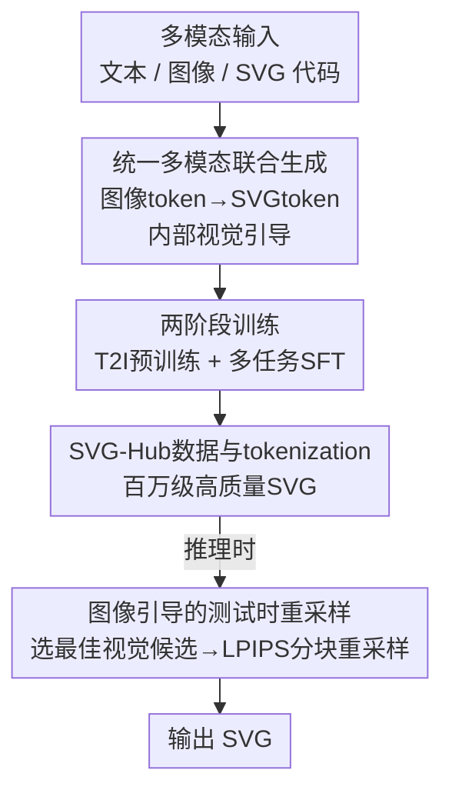

# DuetSVG: Unified Multimodal SVG Generation with Internal Visual Guidance

**会议**: CVPR 2026  
**论文**: [CVF Open Access](https://openaccess.thecvf.com/content/CVPR2026/html/Zhang_DuetSVG_Unified_Multimodal_SVG_Generation_with_Internal_Visual_Guidance_CVPR_2026_paper.html)  
**代码**: [项目主页](https://intchous.github.io/DuetSVG-site)（未见独立代码仓库）  
**领域**: 多模态VLM  
**关键词**: SVG生成, 统一多模态模型, 内部视觉引导, 测试时扩展, 自回归生成  

## 一句话总结
DuetSVG 把 SVG 生成从「纯文本生成」改成「图像 token 和 SVG token 一起自回归生成」，让模型自己先画出的图像 token 充当 SVG 解码时的内部视觉引导，再配一套图像引导的测试时重采样，在文生 SVG 和图生 SVG 两个任务上全面超过现有 VLM 方法。

## 研究背景与动机
**领域现状**：当前主流的 SVG 生成方法是把 SVG 当成一段文本代码，用专门的 tokenizer 把 `M / C / Q / Rect` 这类绘图命令、坐标、样式属性切成离散 token，然后微调 LLM/VLM（如 StarVector、LLM4SVG、OmniSVG）做自回归生成，在文生 SVG 上效果已经不错。

**现有痛点**：把 SVG 纯当文本有两个硬伤。其一，SVG 比纯文本多了「视觉」这一维，而文本式模型在解码时**完全没有视觉信号**——坐标预测在 token 空间里只差几位数字看似无伤大雅，渲染出来却可能是灾难性的破图、断路径。其二，这类模型只能在相对稀缺的 SVG 数据上训练，用不上海量高质量的图文对、图像编辑数据，**泛化能力被死死卡住**，遇到训练分布外的复杂语义就崩。

**核心矛盾**：根本原因在于「SVG 既是代码又是图」这个双重身份被单模态文本建模强行抹平了——训练只惩罚 SVG 代码的语法正确性，对它**渲染出来长什么样毫无监督**。

**本文目标**：(1) 在 SVG 解码过程中引入视觉信号；(2) 打通对大规模图像数据的利用，提升泛化与文-SVG 对齐。

**切入角度**：作者的观察是，既然统一自回归模型（如 Janus-Pro）本来就能同时生成图像 token 和文本 token，那不妨让模型在吐 SVG 之前**先把目标图像 token 生成出来**，用它作为 SVG 解码的"草图"。

**核心 idea**：用一个统一多模态模型联合生成「图像 token + SVG token」，让模型原生预测的图像充当 SVG 解码的**内部视觉引导**（internal visual guidance），从而把视觉信号端到端注入向量图生成。

## 方法详解

### 整体框架
DuetSVG 的目标序列不是单纯的 SVG 文本，而是一段混合模态序列 $z = [\langle\text{IMG}\rangle, z^{\text{img}}_{1:I}, \langle/\text{IMG}\rangle, \langle\text{SVG}\rangle, z^{\text{svg}}_{1:S}, \langle/\text{SVG}\rangle]$：先是一段图像 token，再是对应的 SVG token。训练就是在这条混合序列上做统一的下一个 token 预测：$P_\theta(z\mid x)=\prod_{t=1}^{T} p_\theta(z_t\mid z_{<t}, x)$，其中条件输入 $x$ 可以是文本 prompt、图像、SVG 代码的任意组合。由于因果注意力的存在，排在前面的图像 token 天然能在解码后面的 SVG token 时提供引导——这就是"内部视觉引导"四个字的字面来源。

架构沿用 Janus-Pro：文本/SVG 用 Janus-Pro 文本 tokenizer 编码；图像走两条路——SigLIP 作为**理解编码器**抽语义特征，VQ tokenizer 作为**生成编码器**把图像压成离散 token；两个 MLP aligner 分别把理解/生成的图像嵌入投到 LLM 特征空间。统一自回归 Transformer 之后接两个头：generation head 从视觉 codebook 预测图像 token，LM head 从文本词表预测 SVG token。训练时两个图像编码器冻结，其余全部可训。

整条 pipeline 是「训练两阶段 + 推理一套测试时扩展」的串行结构：

### 关键设计

**1. 统一多模态联合生成：让模型自己画的图当 SVG 的内部视觉引导**

这一点直接打的是文本式 SVG 模型"解码时没有视觉信号"的痛点。DuetSVG 不再只输出 SVG 文本，而是把目标排成「图像 token 在前、SVG token 在后」的混合序列，在统一自回归 Transformer 里一次性生成。因为是因果注意力，SVG token 在生成时能"看到"前面已经定下来的图像 token——图像 token 捕捉外观，SVG token 学习形状几何与图层结构，两者在同一序列里互为约束。和并发工作 RoboSVG「靠外部 VLM 生成额外多模态条件再喂进来」相比，DuetSVG 是**端到端在同一个模型内部共生**图像和 SVG token，不会引入两个模型之间的不一致。消融里这一点最关键：去掉图像输出退化成 SVG-only 后，它的表现甚至掉到比微调过的 Qwen3-VL-8B 还差（说明 Janus-Pro 作为纯语言 backbone 偏弱），但一旦加回图像模态，反而反超 Qwen3-VL-8B——视觉引导才是质量的胜负手。

**2. 两阶段训练：先靠 T2I 预训练补视觉先验，再多任务 SFT 让模态互相借力**

Janus-Pro 原生几乎不会画 SVG 风格的图，所以作者先做 Stage 1 文生图（T2I）预训练，专门训练模型产出"几何基元清晰、纯色平铺"的干净图像。语料是混合的：一部分是 SVG 数据集渲染出的图配 caption，另一部分用 FLUX.1 给定文本+SVG 参考合成风格匹配的图像。Stage 2 做多任务 SFT，把 T2I、文生 SVG（T2SVG）、图生 SVG（I2SVG）三任务按 $1:5:4$ 的比例混采，统一用交错多模态序列上的交叉熵下一个 token 目标训练；对 SVG 生成任务一律把图像 token 排在 SVG token 前面，保证解码时图像能引导 SVG。为增强鲁棒性，I2SVG 上做 SVG 专属数据增强（随机扰动旋转/平移/缩放/颜色、随机丢一部分路径、再重渲染成图），文本和图像输入各以 10% 概率随机 dropout 以支持推理时的无分类器引导（CFG）。这套多任务共享让 T2I 和 I2SVG 从不同侧面增强 T2SVG——消融显示去掉 T2I 预训练后 T2SVG 的 FID 从 33.6 恶化到 37.0，证明预训练学到的图文对齐确实是泛化的底座。

**3. 图像引导的测试时重采样：用短图像序列搜索 + LPIPS 分块校验，便宜地稳住长 SVG 解码**

复杂 SVG 动辄上千 token，自回归解码会累积采样误差（虚假闭环、grounding 减弱），产出劣质甚至非法的 SVG。纯文本模型的常规做法是 best-of-N：跑 N 条完整 SVG，各自渲染后用 CLIP 选最好的——既贵又只能事后重排、解码中途没有任何引导。DuetSVG 利用"图像 token 序列比 SVG token 序列短得多"这一点，把扩展拆成两步。第一步**视觉候选选择**：用 CFG 生成 $N$ 个图像候选，$z^{\text{CFG}}_t = z^{\text{uncond}}_t + \gamma\,(z^{\text{cond}}_t - z^{\text{uncond}}_t)$，因为图像序列短，采 $N$ 张很便宜，再用 CLIP verifier 挑出最佳候选 $I^*$（对应图像 token $z^*_{\text{img}}$）。第二步**图像引导的 SVG 重采样**：从 $z^*_{\text{img}}$ 续接 SVG token，每次生成 $K$ 个 token 就把当前 SVG 渲染成临时栅格 $R_t$，计算它与 $I^*$ 的 LPIPS 距离 $d(R_t, I^*)$；若 $d(R_t,I^*)\le d(R_{t-1},I^*)$ 就接受这一块，否则拒绝并重采，每条 SVG 最多允许 $M$ 次拒绝。实验里 $N=3, M=3$。这等于把"昂贵的长序列 best-of-N"换成"廉价的短图像搜索 + 分块视觉校验"，在更低算力下同时提升语义对齐和 SVG 合法性。

**4. SVG-Hub 数据集与无损 tokenization：喂高质量原生 SVG，而非矢量化噪声**

现有 SVG 数据集大多由栅格图矢量化而来（如 MMSVG、InternSVG），带来不规则路径和视觉伪影，且文本描述简短泛化。作者构建 SVG-Hub-1M（从 MMSVG、SVGX、Iconfont 等公开源清洗去重、剔除自动矢量化和空渲染样本，将公开发布）和内部 SVG-Hub-5M，都是**非矢量化得到的高质量 SVG**。为补足语义，用 InternVL3、Qwen2.5-VL 把每张 SVG 渲染后生成三档 caption（短/中/细），覆盖核心语义到细粒度形状描笔。tokenization 上做了规整：去掉冗余不可见元素、画布统一归一到 $800\times800$ viewBox、命令词表限制到 `{M, L, C, Q, A, Z, Ellipse, Circle, Polygon, Rect}`，再量化坐标序列化成离散 token；同时保留 `<defs>` 渐变和 `<g>` 组变换以保表达力。整套既缩小文件、规整结构，又对渲染结果无损。

### 损失函数 / 训练策略
统一的下一个 token 预测交叉熵，作用在交错的「图像 token + SVG token」混合序列上（公式 1）。从 Janus-Pro-7B 初始化；图像 resize 到 $384\times384$、用生成编码器编成 576 个离散视觉 token，codebook 大小 16,384；SVG 截断到至多 12,000 文本 token。Stage 1 用 batch 512 训 80K 步，Stage 2 三任务按 $1:5:4$ 混采、batch 128 训 300K 步，全程 AdamW（$\beta_1=0.9,\beta_2=0.95$，lr $1\times10^{-5}$），64 张 A100 约 5 天。SVG 编辑等下游应用可在可选 SFT 阶段进一步微调。

## 实验关键数据

### 主实验
两个 benchmark：SVG-Hub-5M 测试集（9,000 样本）与 SArena-Icon（6,000 样本）。下表为 SVG-Hub-5M 上 DuetSVG 与代表性基线对比（↓ 越低越好，↑ 越高越好）：

| 方法 | T2SVG FID ↓ | T2SVG CLIP ↑ | T2SVG Path Sem. ↑ | I2SVG DINO ↑ | I2SVG LPIPS ↓ | I2SVG PSNR ↑ |
|------|------|------|------|------|------|------|
| FLUX.1-dev + VTracer | 46.99 | 25.33 | 1.22 | - | - | - |
| Gemini-3-Pro | 48.77 | 25.15 | 2.41 | 0.921 | 0.116 | 13.86 |
| LLM4SVG-7B (FT) | 49.32 | 23.30 | 2.32 | 0.938 | 0.099 | 19.84 |
| Qwen3-VL-8B (FT) | 43.72 | 23.94 | 2.53 | 0.947 | 0.090 | 20.92 |
| **Ours-7B (w/o TTS)** | 35.07 | 25.58 | 2.77 | 0.955 | 0.082 | 22.02 |
| **Ours-7B (TTS)** | **33.57** | **26.11** | **2.91** | **0.962** | **0.075** | **23.59** |

在 SArena-Icon 上结论一致，DuetSVG (TTS) 把 T2SVG FID 压到 11.71、I2SVG PSNR 提到 24.02，全面领先所有 VLM 基线（含 GPT-5-Thinking、Gemini-3-Pro）。其中 Path Semantics 是作者采用的向量级指标：随机删掉 30% 路径后测原图与改图的 CLIP score 下降量，下降越大说明每条路径越承载语义（即路径越不冗余）。

### 消融实验
| 配置 | T2SVG FID ↓ | T2SVG CLIP ↑ | I2SVG DINO ↑ | I2SVG LPIPS ↓ | 说明 |
|------|------|------|------|------|------|
| w/o 内部视觉引导（SVG-only） | 51.48 | 23.26 | 0.939 | 0.096 | 退化成纯文本式，所有指标明显恶化 |
| w/o T2I 预训练 | 36.95 | 25.12 | - | - | T2SVG 质量明显下滑 |
| w/o 测试时扩展（TTS） | 35.07 | 25.58 | 0.955 | 0.082 | 即 Ours w/o TTS |
| Ours (Full) | **33.57** | **26.11** | **0.962** | **0.075** | 完整模型 |

### 关键发现
- **内部视觉引导是决定性模块**：去掉图像输出后 T2SVG FID 从 33.6 暴涨到 51.5，且这个 SVG-only 变体作为纯语言模型还打不过微调的 Qwen3-VL-8B；但加上图像模态的完整 DuetSVG 又反超 Qwen3-VL-8B——说明性能不是来自更强的语言 backbone，而是来自视觉引导本身。
- **T2I 预训练提供泛化底座**：去掉后 FID 从 33.6 退到 37.0，作者归因于预训练学到的图文对齐让模型能画出更干净的 SVG 风格图像、应对更复杂分布外 prompt。
- **测试时扩展低成本提质**：TTS 在 T2SVG 和 I2SVG 上都进一步抬升（如 FID 35.1→33.6、PSNR 22.0→23.6），而因为搜索发生在短图像序列上，代价远低于在长 SVG 序列上做 best-of-N。
- **开源 VLM 基线即便在 SVG-Hub-5M 上微调过，仍因 text-centric 设计只学到语法正确、学不到视觉外观**，复杂几何细节上明显逊于 DuetSVG。

## 亮点与洞察
- **"先画图再画 SVG"把视觉监督端到端塞进向量图生成**：用序列顺序（图像 token 在前）+ 因果注意力，零额外模块地实现内部视觉引导，比靠外部 VLM 拼条件（RoboSVG）更干净、无跨模型不一致。
- **测试时扩展的成本洞察很实用**：抓住"图像 token 序列短、SVG token 序列长"的非对称性，把昂贵搜索挪到便宜的图像层，再用 LPIPS 分块校验长 SVG，是一个可迁移到其他"短引导信号 + 长目标序列"场景的 trick。
- **把统一多模态模型当成 SVG 任务的天然 verifier**：多模态生成本身就产出可渲染的中间图像，简化了测试时 verifier 设计，这点思路可借鉴到代码生成等"有可执行/可渲染中间产物"的任务。

## 局限与展望
- **算力门槛高**：64×A100 训 5 天、7B 规模，复现成本不低；测试时还要逐块渲染算 LPIPS，单样本推理延迟会比一次性自回归更高（⚠️ 论文未给出具体推理耗时对比）。
- **依赖 Janus-Pro 这一特定统一架构**：方法绑定在"能同时生成图像/文本 token"的 backbone 上，换成其它非统一模型不易直接套用。
- **测试时重采样的贪心接受准则可能局部最优**：只要求 $d(R_t,I^*)$ 不增就接受，单调下降的贪心策略未必能跳出早期错误路径累积，复杂长 SVG 上仍有失败风险。
- **生成质量上限受所选视觉候选 $I^*$ 约束**：若第一步 CFG 候选都不理想，后续 SVG 解码再忠实也只是逼近一张不够好的图。

## 相关工作与启发
- **vs 优化式方法（VectorFusion / SVGDreamer / T2V-NPR）**：它们靠可微渲染 + score distillation 逐张优化 SVG，单张要几十分钟，且未在矢量数据上训练，常产出碎片化路径、冗余控制点；DuetSVG 是前馈生成、又见过真实 SVG 数据，质量和速度都占优。
- **vs 文本式 VLM 方法（StarVector / LLM4SVG / OmniSVG）**：它们把 SVG 纯当文本、解码无视觉信号、只能用小规模 SVG 数据，泛化差；DuetSVG 引入图像模态做内部引导并能吃大规模图文数据，全指标领先。
- **vs VecFusion（先栅格扩散再向量扩散）**：VecFusion 两个模型非端到端，栅格-向量之间泛化受限、几何易失准；DuetSVG 在单一自回归模型里端到端共生图像与 SVG token。
- **vs 并发 RoboSVG**：RoboSVG 靠外部 VLM 生成额外多模态条件，存在跨模型不一致；DuetSVG 内部共生，消除该不一致。

## 评分
- 新颖性: ⭐⭐⭐⭐⭐ 首个统一多模态 SVG 生成模型，"内部视觉引导"把视觉监督端到端引入向量图生成，角度清晰。
- 实验充分度: ⭐⭐⭐⭐⭐ 两 benchmark、覆盖优化式/专有/开源 VLM 的大量基线、含三项消融，且对开源基线统一微调保证公平。
- 写作质量: ⭐⭐⭐⭐ 方法与动机讲得透彻，但部分实现细节（推理耗时、verifier 取舍）留在补充材料。
- 价值: ⭐⭐⭐⭐⭐ SOTA 明显领先，且 SVG-Hub-1M 数据集承诺开源，对设计自动化领域有实用价值。

<!-- RELATED:START -->

## 相关论文

- [\[CVPR 2026\] TUNA: Taming Unified Visual Representations for Native Unified Multimodal Models](tuna_taming_unified_visual_representations_for_native_unified_multimodal_models.md)
- [\[CVPR 2026\] UniT: Unified Multimodal Chain-of-Thought Test-time Scaling](unit_unified_multimodal_chain-of-thought_test-time_scaling.md)
- [\[CVPR 2026\] UniCompress: Token Compression for Unified Vision-Language Understanding and Generation](unicompress_token_compression_for_unified_vision-language_understanding_and_gene.md)
- [\[CVPR 2026\] OneCAT: Decoder-Only Auto-Regressive Model for Unified Understanding and Generation](onecat_decoder-only_auto-regressive_model_for_unified_understanding_and_generati.md)
- [\[CVPR 2026\] Rosetta Stone for Unified MLLMs: A Unified Tokenizer to Decipher Understanding and Generation](rosetta_stone_for_unified_mllms_a_unified_tokenizer_to_decipher_understanding_an.md)

<!-- RELATED:END -->
