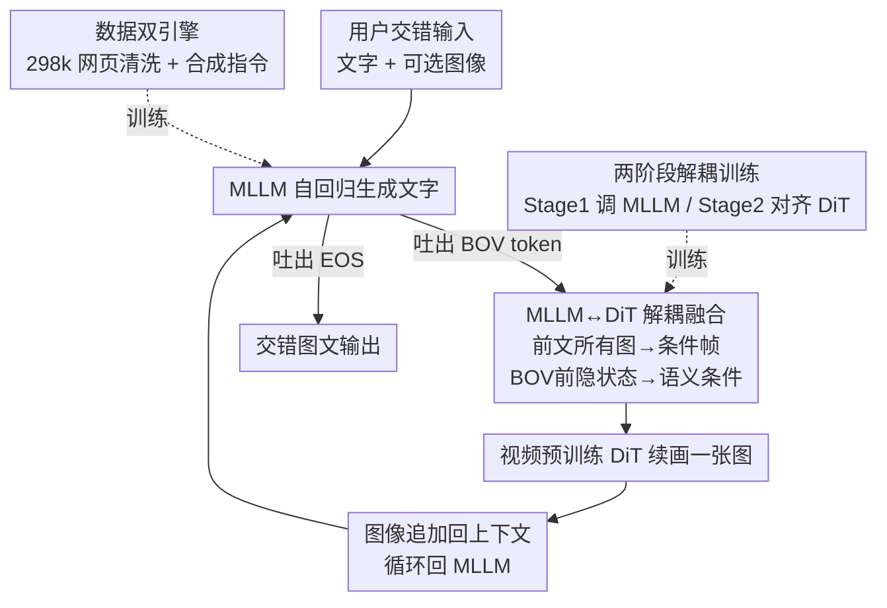

# DuoGen: Towards Autonomous Interleaved Multimodal Generation

**会议**: CVPR 2026  
**论文**: [CVF Open Access](https://openaccess.thecvf.com/content/CVPR2026/html/Shi_DuoGen_Towards_Autonomous_Interleaved_Multimodal_Generation_CVPR_2026_paper.html)  
**代码**: https://research.nvidia.com/labs/dir/duogen （项目页，论文称 data & code released）  
**领域**: 多模态VLM  
**关键词**: 图文交错生成, 统一多模态模型, 解耦训练, 视频DiT, 指令微调数据

## 一句话总结
DuoGen 把一个预训练 MLLM 和一个在视频生成上预训练的 DiT 拼起来，用 `<BOV>` 特殊 token 让 MLLM 自主决定何时画图、用前文所有图像当条件帧让 DiT 续画，配上一套从网页清洗 + 合成造出来的 298k 高质量交错指令数据和两阶段解耦训练，在交错图文生成、文生图、图像编辑三类任务上全面超过开源统一模型。

## 研究背景与动机

**领域现状**：图文交错生成（interleaved multimodal generation）要求模型在一次回复里交替吐出文字和图像，典型场景是分步教程、做菜食谱、视觉规划、把图当"草稿"辅助推理。主流做法是 Chameleon、Show-o、Bagel 这类**统一模型**，走 early-fusion：把图离散成 token 或用混合（文字 next-token + 图像 diffusion）范式，从零在文字、图像、大规模交错序列上联合预训练。

**现有痛点**：early-fusion 路线要从头同时建起"看图理解"和"画图生成"两套能力，数据工程和算力开销巨大，而且一旦想换更强或更大的 base model 就得重训。另一类做法（MetaQuery、UniWorld、OmniGen2）把预训练图像生成器接到 MLLM 上，但它们的交错生成要么没怎么探索、要么受架构限制——比如所用的生成头**无法接收多张条件图**，没法做"看着前几步的图再画下一步"。再加上现有交错数据要么是噪声很大的网页预训练语料、要么是视频密集字幕，**真实的用户—助手交互式指令数据极度稀缺**，质量和多样性都不够。

**核心矛盾**：要做好通用交错生成，既要强的文字理解/世界知识、又要高质量且能多图条件化的图像生成；early-fusion 把两者揉在一起联合训练，导致"理解 vs 生成"目标互相拉扯、且无法复用现成的强预训练模型。

**本文目标**：系统性地把交错生成拆成三件事各个击破——(1) 造出足量、高质量、多样的交错指令数据；(2) 设计一个不需要单模态从头预训练、能自由换 base model 的架构；(3) 建一套能识别细粒度视觉瑕疵的评测基准。

**切入角度**：作者的关键观察是——**现成的预训练 MLLM 已经会看图说话、现成的视频生成 DiT 已经会画高质量且帧间一致的图**，那能不能跳过昂贵的单模态预训练，直接在这两个预训练模型之上"对齐"出交错生成能力？

**核心 idea**：用 `<BOV>` token 让 MLLM 自主触发画图，把交错历史里的所有图当条件帧喂给视频 DiT、把 MLLM 的隐状态当语义条件，两阶段解耦训练（先调 MLLM，再冻结 MLLM 对齐 DiT），避免单模态预训练。

## 方法详解

### 整体框架

DuoGen 由两个**现成的预训练模型**拼成：一个带视觉编码器的 MLLM（实现用 Qwen2.5-VL 7B）负责生成文字、一个从视频生成模型初始化的 DiT（实现用 Cosmos-Predict 2.5 2B）负责生成图像，中间用一个轻量 connector 桥接。整个统一模型只需学两件事：MLLM 在"该画图时"自主吐出 `<BOV>`（Begin-of-Vision）特殊 token，DiT 则生成与前文文字和图像都一致的图。

推理时 MLLM 自回归地一个 token 一个 token 往外吐文字，一旦吐出 `<BOV>` 就切到图像生成模式：把交错历史 $T_1, I_1, T_2, I_2, \dots, T_N$ 里 `<BOV>` 之前出现的**所有图像**（无论用户给的还是自己之前画的）沿时间轴堆叠、经 VAE 编码成条件帧 latent，和目标图的噪声 latent 拼接，作为 DiT 的视觉输入；同时把 `<BOV>` 之前所有多模态 token 对应的 MLLM 隐状态经 connector 投影后，作为 DiT 的语义/语言条件。画完一张图就追加回交错上下文，再继续吐下一段文字，如此循环直到 `<BOV>` 或 EOS。整套数据—架构—训练的关系如下图：

### 关键设计

**1. 数据双引擎：网页清洗 + 高质量合成，凑齐 298k 交错指令数据**

交错生成最大的瓶颈是缺真实"用户—助手交互"式的高质量指令数据。作者从两个互补来源造数据。**网页数据引擎**：从 StoryBird、Instructables、eHow 等 how-to 网站抓 347k 网页（也复用 CoMM 的原始数据），先过滤掉纯文字页和无效图（二维码、图标、广告），留下 268k 页转成 Markdown；再分两步处理——(a) 内容改写重组：LLM 改写文字去掉 HTML 标签/格式错误/外链，所有图像被打字幕分类（自然照片 / GUI 截图 / 文档页），MLLM 删除连续重复图、并**把图重排到对应描述之后**保证图文对齐；(b) 对话化：用多模态 LLM 把清洗后的图文序列转成真实的指令式对话，用户可选给图、助手分步给出交错的推理和配图。相比 CoMM 这类"不再改写重组"的旧 pipeline，这个引擎主动去噪、重构、对话化，最终产出 268k 干净对话。

网页图的美学和分辨率参差不齐（取决于用户设备和创作水平），会拖累生成图质量，于是再补 **30k 高质量合成数据**：人工标注 1,500 条种子 prompt（8 大日常领域、151 个子类，每子类约 10 题），用 OpenAI o3 最高推理预算扩成 15,270 条多样指令，再用图像生成模型配图；发现做菜类效果尤其好，又从 MM-Food-100k 采 15k 菜品图当 prompt。合成子集提供高分辨率、风格一致、美学好的图，让模型训练更稳。消融（表 6）证明：换上数据引擎 IRS 从 4.42 → 5.91，再加合成数据进一步到 7.58。

**2. MLLM↔DiT 解耦融合 + `<BOV>` 触发机制：让两个现成模型直接拼出交错生成**

针对"early-fusion 要从零建双能力、还换不动 base model"的痛点，作者不联合预训练，而是把 MLLM 和视频 DiT 当两个黑盒拼起来，只学"何时画 + 画什么"。具体地，MLLM 自回归吐 token，遇到 `<BOV>` 就触发生成：设此刻交错序列为 $T_1, I_1, \dots, T_N$，DiT 要生成 $I_N$。**视觉条件**——把 `<BOV>` 前的所有图沿时间轴堆叠、VAE 编码成 latent，与目标图的噪声 latent 沿时间轴拼接（沿用 Cosmos 把条件帧 latent 接到噪声 latent 的做法），这样天然支持**多张参考图**条件化，正是旧生成头做不到的。**语义/语言条件**——取 `<BOV>` 之前所有多模态 token 的 MLLM 隐状态，经 connector 投影到 DiT 的语言条件接口维度，并按 Wang et al. 把各 decoder 层隐状态沿通道拼接以增强表达，再通过每层 cross-attention 注入。MLLM 和 DiT 都可换（MLLM 可 Qwen2.5-VL / LLaVA，DiT 可 Wan / Cosmos），不用从头单模态预训练、也不用在联合训练里平衡理解与生成目标。

为支持异构分辨率图像的 packed 训练（原 Cosmos 不兼容），作者把每个交错样本里所有图当作一串异构"视频帧"，VAE latent 展平拼接、记录每图 height/width/index 以便解码恢复；并扩展位置编码：时间索引每过一张图 +1、空间 RoPE 按每图各自分辨率算。推理时还用 classifier-free guidance 增强保真——算负速度时**保持视觉条件不变、只把 MLLM 隐状态序列里最后一段文字去掉**。

**3. 两阶段解耦训练：先教 MLLM 何时画图，再冻结它对齐 DiT**

如果把图像对齐数据太早灌进来，会破坏 MLLM 精心调过的 post-training 行为，所以作者把训练拆成两段。**Stage 1（指令微调）**：只更新 MLLM 参数，用设计 1 的高质量交错对话做 next-token-prediction 监督，文字按标准 MLLM 方式 mask 掉用户输入，但**助手轮里的 `<BOV>` token 计入 loss**，让模型学会在合适时机触发画图、并能基于新画的图继续写文字；图像生成则从每条交错序列随机采一张目标图、随机采一个扩散步、算 flow-matching loss。这阶段**故意排除**上下文对齐数据（它缺有意义的用户—助手交互）。**Stage 2（交错上下文对齐）**：冻结 MLLM，只微调 connector 和 DiT，用大规模对齐数据——来自 500 万视频切 5 秒片段、取首尾帧并用 Qwen2.5-VL-32B 标注转场（物体运动 / 人物动作 / 镜头移动）得到的交错图文序列，外加 ShareGPT-4o-Image、OmniGen、UniWorld、Echo-4o 等开源文生图/编辑/多参考数据，同时也混入 Stage 1 的指令数据。视频数据教平滑细微的转场一致性、图像数据教加/删/换物体和改背景这类创意操作。这种解耦让异构数据各取所需：即便对齐数据的文字对强 MLLM 没信息量，它对对齐视觉生成行为仍有价值——同样适用于 Bagel 这类语言/扩散参数分离的框架。

### 一个完整示例

以 "How to paint kitchen cabinets for a modern look?" 为例走一遍推理：用户输入这句文字 → MLLM 自回归吐出 "Step 1: Clean and remove…" → 紧接着吐出 `<BOV>`，触发画图：此时交错历史里还没有图（首步），DiT 仅以 MLLM 到此为止的隐状态当语义条件，生成第 1 张"清洁橱柜"的图 $I_1$，追加回上下文 → MLLM 继续吐 "Step 2: Sand for Adhesion…" 再吐 `<BOV>`，这次 DiT 把 $I_1$ 当条件帧 + 当前隐状态，画出风格、橱柜外观与第 1 张一致的"打磨"图 $I_2$ → 如此到 "Step 3: Prime Time!" 画 $I_3$，每张都以前面所有图当条件帧，保证三步图里橱柜、厨房环境、画风一致。最终输出一段图文交错的分步教程。

## 实验关键数据

### 主实验

作者在自建 benchmark（Cooking-200 给菜品图生食谱、How-to-500 覆盖 151 子类的开放问答）和两个公开 benchmark（CoMM、InterleavedBench）上评测，用 GPT-5 当 judge（比 GPT-4o 更能抓细粒度视觉—语义不一致），并做了 10 人 475 例的人工 Elo。

自建 benchmark（表 1，指标：文字完整度 T-Com / 图完整度 I-Com / 图一致性 I-Co / 图质量 I-Q / 图文一致 IT-Co）：

| 模型 | 参数(文/图) | Cooking-200 I-Com | How-to-500 T-Com | Human Elo I-Com |
|------|-----------|-------------------|------------------|-----------------|
| Nano Banana（商用） | - | 4.07 | 3.95 | 1369 |
| SEED-LLaMA | 7B/0.8B | 1.63 | 1.61 | 963 |
| Zebra-CoT | 7B/7B | 2.63 | 2.04 | 1115 |
| **DuoGen** | 7B/2B | **4.70** | **3.39** | **1442** |

DuoGen 大幅超过所有开源模型，在 How-to-500 上提升尤为明显，且把开源与商用 Nano Banana 的差距显著拉近，在 Cooking-200 的部分指标（如图文一致）甚至追平 Nano Banana。

公开 benchmark：

| Benchmark | 关键指标 | 次优模型 | DuoGen |
|-----------|---------|----------|--------|
| CoMM | IRS（图文对齐） | MiniGPT-5 2.71 | **7.76**（2.8×） |
| CoMM | Comp.（完整度） | Emu2 7.54 | **9.66** |
| InterleavedBench | Avg. | GILL 1.84 | **3.87** |
| InterleavedBench | T-Q（文字质量） | Emu2 1.26 | **4.28**（3.4×） |

文生图与图像编辑（顺带验证 base model 选得好）：

| 任务 / Benchmark | 指标 | 对比 | DuoGen |
|------------------|------|------|--------|
| GenEval | Overall | Bagel 0.82 / OmniGen2 0.80 | **0.88** |
| GenEval | counting / position / attr | — | 0.94 / 0.84 / 0.80 |
| ImgEdit | Overall | OmniGen2 3.44 | **4.19** |
| GEdit EN | G_O（几何均值） | Bagel 6.52 | **7.35** |

DuoGen 在 GenEval 上超过所有统一模型，多物体计数/位置/属性绑定这些统一模型通常薄弱的项上提升明显；图像编辑也大幅超开源统一模型，在 Remove/Replace/Add 上分数突出，逼近商用与专用编辑模型。⚠️ 表格中 GenEval/ImgEdit 行模型名原文写作 "DuetGen"，应为 DuoGen 笔误，以原文为准。

### 消融实验

数据策略消融（CoMM benchmark，表 6）：

| 数据配置 | Tren.(图文趋势) | Comp. | ImgQ | IRS |
|----------|-----------------|-------|------|-----|
| CoMM 原始 | 6.52 | 6.45 | 6.30 | 4.42 |
| + 本文数据引擎 | 7.22 | 8.15 | 7.79 | 5.91 |
| + 合成数据 | **9.30** | **9.45** | **9.48** | **7.58** |

### 关键发现

- **数据引擎贡献最大**：仅把 CoMM 原始数据过一遍本文数据引擎（MLLM 清洗/重组/对话化），IRS 就从 4.42 → 5.91、Comp. 6.45 → 8.15，说明交错生成的瓶颈很大程度在数据质量而非纯模型。
- **合成数据补的是"视觉质量与一致性"**：再加 30k 合成数据后，图质量和时序—语义一致性（ImgQ、Tren.）涨得最猛，正好补网页图美学/分辨率参差的短板。
- **视频预训练 DiT 是编辑/生成强的来源**：作者把 GenEval 多物体项和图像编辑的优势归因于 DiT 在视频生成上预训练带来的像素质量与内容创作能力。

## 亮点与洞察

- **`<BOV>` token 把"何时画图"变成 MLLM 自回归预测的一部分**，且该 token 计入 next-token loss——模型不是被动等用户指定模态，而是自主决定，这正是"autonomous interleaved"的核心，思路可迁移到任何想让 LLM 自主调用外部生成器的场景。
- **"前文所有图当条件帧"复用了视频 DiT 的时间轴机制**：交错序列里的多张图天然映射成视频的多帧，于是多图条件化不需要新设计，直接吃 Cosmos 的条件帧能力——这是选视频 DiT 而非普通文生图 DiT 的关键巧思。
- **解耦训练 = 用"冻结保护 + 分阶段灌数据"避免互相破坏**：Stage 1 不灌对齐数据怕毁 MLLM 的 post-training 行为、Stage 2 冻 MLLM 只调 DiT，把"哪段数据该更新哪部分参数"想清楚了，这套思路对任何语言/扩散参数分离的统一框架都通用。

## 局限与展望

- 与商用 Nano Banana / GPT-4o-Image 仍有差距，只在 Cooking-200 等受限领域追平，开放的 How-to-500 上 Nano Banana 仍更强（更广知识 + 物理合理性），说明数据规模/覆盖仍是上限。
- 评测重度依赖 GPT-5 当 judge，虽比 GPT-4o 更细，但 VLM judge 本身的偏差和天花板未充分讨论；人工 Elo 仅 10 人 475 例，规模偏小。
- ⚠️ 论文为 CVF 版，缺超参、训练算力、推理速度的完整披露（多在 supplementary），落地成本不易评估；多图条件帧随交错步数增长会推高 DiT 的序列长度，长教程下的显存/延迟开销文中未量化。
- 改进方向：把对齐数据从"视频转场 + 开源编辑"扩到更强的物理/常识一致性数据，或许能缩小 How-to-500 上与商用模型的差距。

## 相关工作与启发

- **vs Chameleon / Show-o（early-fusion 统一模型）**：他们从零联合预训练单模态+交错能力，数据算力开销大且换不动 base model；DuoGen 用 pretrained-fusion 直接拼现成 MLLM+视频 DiT，省掉单模态预训练，base model 可自由替换，但作者也指出其数据/训练策略同样适用于 early-fusion。
- **vs Bagel / OmniGen2（pretrained-fusion 统一模型）**：他们的交错生成或受限于生成头无法多图条件化；DuoGen 借视频 DiT 的时间轴天然支持多条件帧，GenEval/ImgEdit 上反超它们。
- **vs Zebra-CoT / 视觉 CoT 方法**：他们把生成图当推理草稿，但只覆盖数学/导航等少数预定义任务、泛化窄；DuoGen 面向通用日常交错生成，数据覆盖 151 子类。
- **vs CoMM（数据集）**：CoMM 也把 how-to 网页转多模态对话，但残留风格噪声和低质用户上传图；DuoGen 的数据引擎额外做改写/重组/去重/重排，并补合成数据，消融显示直接带来 IRS 与完整度的大涨。

## 评分
- 新颖性: ⭐⭐⭐⭐ `<BOV>` 自触发 + 视频 DiT 当多图条件交错生成器是巧妙的工程组合，单点创新偏系统集成而非全新机制。
- 实验充分度: ⭐⭐⭐⭐⭐ 覆盖交错生成 3 个 benchmark + 文生图 + 图像编辑 + 人工 Elo + 数据消融，对比模型齐全。
- 写作质量: ⭐⭐⭐⭐ 数据—架构—训练三线清晰，但表格里 "DuetGen" 笔误、部分细节甩到 supplementary。
- 价值: ⭐⭐⭐⭐⭐ 开源 298k 数据 + 模型 + 新 benchmark，解耦范式可直接复用，对通用交错生成是扎实推进。

<!-- RELATED:START -->

## 相关论文

- [\[CVPR 2026\] WEAVE: Unleashing and Benchmarking the In-context Interleaved Comprehension and Generation](weave_unleashing_and_benchmarking_the_in-context_interleaved_comprehension_and_g.md)
- [\[CVPR 2026\] Wan-Weaver: Interleaved Multi-modal Generation via Decoupled Training](wan-weaver_interleaved_multi-modal_generation_via_decoupled_training.md)
- [\[CVPR 2026\] VinQA: Visual Elements Interleaved Long-form Answer Generation for Real-World Multimodal Document QA](vinqa_visual_elements_interleaved_long-form_answer_generation_for_real-world_mul.md)
- [\[CVPR 2026\] Multimodal RewardBench 2: Evaluating Omni Reward Models for Interleaved Text and Image](multimodal_rewardbench_2_evaluating_omni_reward_models_for_interleaved_text_and_.md)
- [\[CVPR 2026\] Reversing the Flow: Generation-to-Understanding Synergy in Large Multimodal Models](reversing_the_flow_generation-to-understanding_synergy_in_large_multimodal_model.md)

<!-- RELATED:END -->
