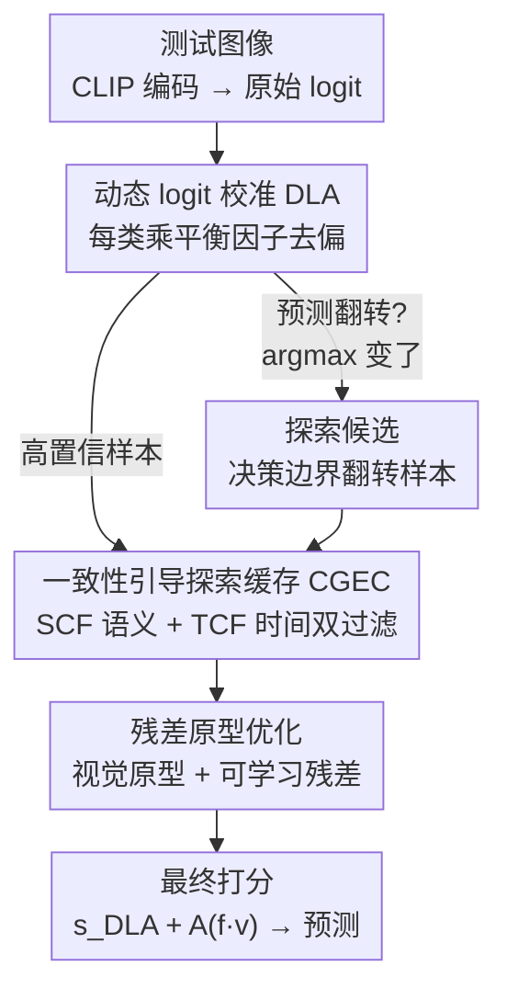

# Dynamic Logits Adjustment and Exploration for Test-Time Adaptation in Vision Language Models

**会议**: CVPR 2026  
**论文**: [CVF Open Access](https://openaccess.thecvf.com/content/CVPR2026/html/Wu_Dynamic_Logits_Adjustment_and_Exploration_for_Test-Time_Adaptation_in_Vision_CVPR_2026_paper.html)  
**代码**: 待确认（原文称 "Code is available here"，未给出具体链接）  
**领域**: 多模态VLM / 测试时自适应  
**关键词**: 测试时自适应, CLIP, logit 校准, 类别偏置, 缓存机制  

## 一句话总结
针对 VLM 测试时自适应（TTA）只挑高置信样本导致"继承模型类别偏置 + 探索不足"的问题，本文提出 DLAE：用动态 logit 校准（DLA）按在线预测统计量给每类 logit 乘一个平衡因子来去偏，再用一致性引导的探索缓存（CGEC）专门把"校准后预测翻转"的决策边界样本（在语义+时间双重一致性约束下）纳入缓存，从而在保持稳定的同时探索低置信区域，在跨域和 OOD 两大基准上稳定超过 DPE 等 SOTA。

## 研究背景与动机
**领域现状**：CLIP/ALIGN 这类 VLM 部署时总会遇到预训练语料和目标环境之间的分布漂移。测试时自适应（TTA）是一个有吸引力的补救手段——在推理阶段无标签、无需离线重训就地更新冻结或轻量微调的模型。当前 VLM 上的在线流式 TTA 大致分两派：一派是 prompt-based，冻结骨干只优化连续文本 prompt（TPT、DiffTPT）；另一派是 cache-based，存历史"特征-标签对"或类原型来稳定预测（TDA、DPE、DMN-ZS），其中 DPE 进一步用高置信样本算残差原型在嵌入空间优化。

**现有痛点**：几乎所有主流方法都靠**基于熵的过滤**来挑"可靠"样本——只信低熵（高置信）样本。这带来两个系统性毛病：① 大规模异构网络语料让 VLM 天生带有**类别级预测偏置**，某些容易的类早期预测就更容易过置信阈值、主导伪标签，使绝大多数预测标签集中在少数类，自适应被越带越偏，最终甚至伪标签崩塌（pseudo-label collapse）；② 固定容量缓存 + 最小熵替换策略让缓存很快被一小撮"已经学得很好的简单样本"占满（论文 Fig.1b 显示 DPE 进入缓存的不同样本数早早饱和），对目标分布尤其低置信区域覆盖严重不足，算出来的原型不具代表性，又反过来强化了上面的偏置。

**核心矛盾**：可靠性（只用高置信样本→稳定但偏、不探索）与覆盖度/探索（用低置信样本→能探索但带噪、易崩）之间的对立。现有方法一边倒地选了"只用高置信"，于是把偏置和欠探索固化成了一个自我强化的错误循环。

**本文目标**：在不引入源数据、不重训的前提下，既**消除类别级偏置**，又**安全地把探索扩展到低置信/边界区域**，避免置信度单一选择导致的崩塌。

**切入角度 / 核心 idea**：作者观察到一个关键性质——对 logit 做去偏校准后，**预测会翻转的那批样本恰好落在决策边界附近**，正是模型最需要新指导的地方。于是用"动态 logit 校准（DLA）"先去类别偏置，再顺势把"校准后翻转"的边界样本（经语义+时间一致性筛选）补进缓存做探索。一句话：**用类别统计量给 logit 做在线去偏，并把去偏暴露出来的边界翻转样本谨慎纳入缓存来探索低置信区域。**

## 方法详解

### 整体框架
DLAE 建在 cache-based TTA（沿用 DPE 的残差原型范式）之上。输入是流式到来的单张测试图像，输出是去偏且经探索增强后的分类预测。流程是：CLIP 编码出图像特征 $f_v$ 和文本原型 $t_c$，先算原始 logit $s^c_{\text{clip}}=f_v^\top t_c$ 得到初始伪标签 $\hat y_{\text{CLIP}}$；**DLA** 用在线维护的每类计数和平均置信度给每类 logit 乘一个平衡因子，得到校准 logit $s^c_{\text{DLA}}$ 和新伪标签 $\hat y_{\text{DLA}}$；比较两者是否翻转（$\arg\max s_{\text{clip}}\neq\arg\max s_{\text{DLA}}$），翻转样本即边界候选；**CGEC** 把高置信样本和翻转样本一起送入缓存，但用**语义一致性过滤（SCF）**和**时间一致性过滤（TCF）**调制每个样本的熵，使可靠样本在低熵优先队列中胜出；缓存里的视觉特征聚合成视觉原型 $v_c$，配合可学习的文本/视觉残差 $\Delta t_c,\Delta v_c$ 做测试时优化；最终打分把校准后的语义 logit 和亲和度调制的视觉线索相加 $s^c_{\text{DLAE}}=s^c_{\text{DLA}}+A(f_v^\top v_c)$。

### 关键设计

**1. 动态 logit 校准 DLA：用在线类别统计量给每类 logit 去偏**

针对"VLM 类别级偏置被高置信自训练放大、尾类几乎不更新"这一痛点，DLA 完全在线、逐样本工作，不重训也不碰源数据。它为每类维护两个滚动统计量：计数器 $n[c]$（类 $c$ 被当伪标签的累计次数，初始化为 1）估计经验类别分布；滚动平均置信度 $\mu[c]$（类 $c$ 历史预测的平均置信，初始化为 0）作为可靠性指标。经验类别概率为 $\hat p(c)=n[c]/N,\ N=\sum_{c'} n[c']$。核心是一个平衡函数

$$B(c)=\exp\!\big(-\alpha\cdot\hat p(c)\cdot(1-d)\big),\qquad d=P_{\text{clip}}(\hat y_{\text{clip}})-\mu[\hat y_{\text{clip}}]$$

其中 $d$ 衡量当前预测置信相对该类历史均值的偏离，$\alpha$ 控制调整强度。校准后的 logit 是 $s^c_{\text{DLA}}=s^c_{\text{clip}}\cdot B(c)$。这个设计有三种行为：① 当一个高频类拿到低于历史均值的置信（$d<0$），$B(c)$ 变小，压低这种"过置信但不可靠"的预测；② 当置信达到或超过历史均值（$d\ge 0$），$B(c)$ 接近 1，保持稳定；③ 对稀有类，$\hat p(c)$ 很小使 $B(c)$ 接近 1，保证尾类不被过度惩罚、仍能贡献自适应。每次预测后增量更新 $n$ 和 $\mu$，让统计量跟随测试分布演化。与"只信初始类别偏好"的熵过滤不同，DLA 在伪标签提交**之前**就在 logit 层面对过/欠预测的类做反向修正。

**2. 一致性引导探索缓存 CGEC：把 DLA 暴露的边界翻转样本补进缓存做探索**

针对"固定容量缓存被简单样本占满、覆盖不足"这一痛点，CGEC 不是替换掉高置信样本，而是**补充**进一批 DLA 校准后预测翻转（$\hat y_{\text{clip}}\neq\hat y_{\text{DLA}}$）的样本。这些翻转样本往往落在决策边界、不确定性高，被现有缓存方法直接丢弃，但它们恰恰携带能缓解类别偏置、防止伪标签崩塌的关键语义信号。直接把所有翻转样本都缓存会引入噪声、破坏稳定，所以 CGEC 不直接收纳，而是通过下面 SCF/TCF 两个过滤器**调制样本的熵**——缓存是一个低熵优先队列，被调制后熵更低的样本更容易留下，从而在决策边界周围谨慎而有效地拓展探索。最终缓存里的视觉特征按类聚合成原型 $v_c=\frac{1}{|P_c|}\sum_{[f_v,h]\in P_c} f_v$。

**3. 语义 + 时间双一致性过滤 SCF/TCF：给探索戴上两道安全锁**

SCF（语义一致性）要求翻转前后的标签在文本嵌入空间里足够接近——比如"狗→狼"语义连贯应当被收紧（更可信），"狗→飞机"则是不一致信号不该降低不确定性。它用原始预测和精修预测的文本嵌入余弦相似度来调制熵：

$$h\leftarrow h\cdot\exp\!\big(-\beta\cdot\cos(t_{\hat y_{\text{clip}}},\,t_{\hat y_{\text{DLA}}})\big)$$

语义越一致，熵被压得越低，越容易作为有信息量的边界样本留在缓存里。TCF（时间一致性）评估**所有**入缓样本（含高置信和翻转样本），确保它们的特征表示随模型自适应"协同演化"。它检测样本原始视觉特征 $f_v$ 是否随时间越来越不对齐其类 $\hat y_{\text{DLA}}$ 的演化文本嵌入：当 $t_{\hat y_{\text{DLA}}[0]}^\top f_v > t_{\hat y_{\text{DLA}}[\text{now}]}^\top f_v$（初始原型反而比当前原型更贴近）时判定为时间不一致，并惩罚该样本：

$$h\leftarrow h\cdot\exp\!\big(\eta\,(i_{\text{now}}-i_{\text{entry}})\big)$$

其中 $i_{\text{now}}$ 是当前训练步、$i_{\text{entry}}$ 是该样本入缓的步数，$\eta$ 控制时间衰减。这样会把那些因表示漂移变成离群点的样本逐渐挤出缓存，只留下与演化后模型时间一致的边界样本。SCF 保证"翻转得有道理"，TCF 保证"留下来要持续靠谱"，两者合起来让 CGEC 既敢探索又不失稳。

### 损失函数 / 训练策略
沿用 DPE 的对齐-置信目标 $L_{\text{all}}=L_{\text{conf}}+\lambda L_{\text{align}}$。$L_{\text{align}}$ 是对称的跨模态对齐损失（文→图、图→文双向交叉熵），$\lambda$ 控制两项权衡。DLAE 做两处修改：① 把 $L_{\text{conf}}$ 里的语义相似项换成最终组合 logit $s^c_{\text{DLAE}}$，即 $L^{\text{DLAE}}_{\text{conf}}=H\big(\text{softmax}(s^c_{\text{DLAE}}/\tau)\big)$，让校准直接作用在最终打分上；② 每个原型 $v_c$ 改由 CGEC 计算。文本/视觉残差 $\Delta t_c,\Delta v_c$ 初始化为 0、梯度下降优化，原始 CLIP 文本嵌入和缓存原型作为固定锚点。推理时取 $\hat y_{\text{DLAE}}=\arg\max_c s^c_{\text{DLAE}}$。

## 实验关键数据

实验用 CLIP（ResNet-50 与 ViT-B/16 两种视觉骨干），单张 24GB RTX 3090，测试时 batch=1 的单图设定，沿 TPT 用随机裁剪生成至多 63 个增强视图，缓存容量设为 3（与 DPE 一致以公平比较）。两大基准：跨域 CD（10 个非重叠域数据集）和 OOD（ImageNet + A/V2/R/Sketch 四个变体）。

### 主实验

跨域 10 数据集平均 Top-1（节选代表性方法）：

| 骨干 | 方法 | DTD | EuroSAT | Aircraft | SUN397 | 平均 |
|------|------|------|---------|----------|--------|------|
| RN50 | CLIP | 40.37 | 23.69 | 15.66 | 58.80 | 55.82 |
| RN50 | DPE | 50.18 | 41.67 | 19.80 | 64.23 | 61.93 |
| RN50 | DMN-ZS | 50.41 | 48.72 | 22.77 | 64.39 | 63.71 |
| RN50 | **DLAE** | **55.56** | **50.04** | **23.34** | **65.43** | **64.81** |
| ViT-B/16 | CLIP | 44.27 | 42.01 | 23.67 | 62.59 | 63.58 |
| ViT-B/16 | DPE | 54.20 | 55.79 | 28.95 | 70.07 | 69.40 |
| ViT-B/16 | DMN-ZS | 55.85 | 59.43 | 30.03 | 70.18 | 70.30 |
| ViT-B/16 | **DLAE** | **58.86** | 61.30 | **32.58** | **70.83** | **71.88** |

OOD 鲁棒性（ImageNet 及自然分布偏移变体）平均 Top-1：

| 骨干 | 方法 | ImageNet-A | ImageNet-V2 | OOD 平均 | 总平均 |
|------|------|-----------|-------------|----------|--------|
| RN50 | DPE | 30.15 | 56.72 | 47.66 | 50.81 |
| RN50 | **DLAE** | **34.80** | **57.13** | **49.06** | **52.06** |
| ViT-B/16 | DPE | 59.63 | 65.44 | 64.43 | 65.93 |
| ViT-B/16 | SCA | 60.33 | 65.38 | 64.77 | 66.16 |
| ViT-B/16 | **DLAE** | **64.06** | **65.50** | **65.76** | **67.09** |

DLAE 在两种骨干下都拿到最高平均，跨域上在纹理（DTD）、遥感（EuroSAT）、大规模场景（SUN397）尤其突出；OOD 上 ImageNet-A 提升最显著（RN50 上 30.15→34.80，ViT 上 59.63→64.06），说明去偏 + 探索对自然对抗样本帮助最大。

### 消融实验

组件消融（ViT-B/16，逐层拆解）：

| 配置 | Acc(%) | 说明 |
|------|--------|------|
| baseline（无 DLA/CGEC） | 69.40 | 退化为 DPE 式基线 |
| + DLA | 70.63 | 仅动态 logit 校准，+1.23 |
| + DLA + CGEC | **71.88** | 完整模型，再 +1.25 |
| DLA: 仅熵调整 | 69.85 | 训练期 Eq.15 |
| DLA: 仅 logit 调整 | 70.39 | 推理期 Eq.14 |
| DLA: 熵+logit | 70.63 | 两者互补 |
| CGEC: 仅 SCF | 71.26 | 语义过滤，相对 70.63 +0.63 |
| CGEC: 仅 TCF | 71.37 | 时间过滤，+0.74 |
| CGEC: SCF+TCF | **71.88** | 双过滤最佳 |

### 关键发现
- **DLA 和 CGEC 贡献相当且互补**：DLA 单独 +1.23，再叠 CGEC 又 +1.25，两个模块都不可或缺；DLA 内部"熵调整（训练）"和"logit 调整（推理）"也是互补的，单独用都不如合用。
- **SCF 与 TCF 缺一不可**：单开任一过滤器（71.26/71.37）都明显低于双开（71.88），语义一致性和时间一致性各管一头，必须联合才能既探索又稳定。
- **对超参不敏感**：DTD 上扫 $\alpha\in[1,2.5]\times\beta\in[0,1.5]$，结果仅在 56.58%–58.86% 间小幅波动，最佳在 $\alpha=2.0,\beta=0.5$；$\eta$ 从 0.002 扫到 0.05 跨数据集波动 <1%，中等值（0.005–0.02）略好。整体不需要精调，鲁棒性强。
- **缓存覆盖度提升**：相同固定容量下，DLAE 让更大、更有信息量的样本集合进入缓存（Fig.1b），印证"探索低置信区域"确实落地，而非仅靠去偏。

## 亮点与洞察
- **"校准副产物即探索目标"的巧思**：DLA 做 logit 去偏本是为了纠偏，但"校准后会翻转的样本恰好在决策边界"这个观察，把去偏和探索两件事用一根线串起来——边界样本不需要额外检测器，直接从 DLA 的翻转里免费得到。这是全文最"啊哈"的地方。
- **不替换、只补充的缓存哲学**：CGEC 没有动现有高置信样本，而是在固定容量下用"熵调制 + 优先队列"的方式让边界样本竞争入缓，既不破坏 cache-based 方法的稳定根基，又打开了探索口子，工程上很克制。
- **双一致性约束可迁移**：SCF（标签翻转要语义连贯）和 TCF（特征要随模型协同演化、否则惩罚）是两个通用的"安全锁"思路，可迁移到任何"想用不确定样本但怕引入噪声"的伪标签/自训练场景。
- **平衡函数 $B(c)$ 的三态设计**：用 $\hat p(c)\cdot(1-d)$ 同时编码"类频率"和"置信偏离"，让高频不可靠类被压、尾类被保护、稳定类不动，单个标量乘子就实现了三种差异化行为，简洁有效。

## 局限与展望
- **依赖在线统计量的可靠性**：DLA 的去偏全靠 $n[c]$、$\mu[c]$ 在线累计，流早期统计量噪声大、$\mu$ 初始化为 0，冷启动阶段 $d$ 的估计可能不稳，论文未深入讨论流前期的行为。⚠️ 具体冷启动表现以原文/附录为准。
- **batch=1 单图设定 + 63 视图增强**：每张图要跑几十个增强视图，推理开销不低；缓存容量仅设为 3 是为对齐 DPE，更大容量下探索机制的收益边界没有充分展开。
- **翻转=边界的假设有适用边界**：把"DLA 后翻转"等同于"决策边界样本"在类别语义高度纠缠（如细粒度）时可能失效——翻转也可能来自统计量噪声而非真边界，SCF 缓解了一部分但非全部。
- **改进方向**：可探索把统计量去偏从全局类频率细化到子群/域条件，或为冷启动阶段加置信度门控，避免早期噪声统计误导校准。

## 相关工作与启发
- **vs DPE**：DPE 也是 cache-based、用残差原型在嵌入空间优化，但**只用熵过滤的高置信样本**算原型，缓存很快被简单样本占满。DLAE 在 DPE 框架上加了 DLA 去偏和 CGEC 探索，把边界翻转样本纳进来，覆盖度和去偏都更好（ViT 平均 69.40→71.88）。本文优势是探索 + 去偏，代价是多了在线统计和一致性过滤的逻辑。
- **vs TPT/DiffTPT（prompt-based）**：它们靠测试时优化连续 prompt + 多视图一致性来对齐，不显式建模类别偏置，也没有缓存探索机制。DLAE 走 cache-based 路线，直接在 logit 层面去偏并主动探索低置信区域，在两大基准上全面领先。
- **vs DMN-ZS / 多缓存方法**：DMN 维护多缓存池存多样可靠样本提升稳定，思路同样想扩覆盖，但仍以"可靠"为主、未显式去偏；DLAE 用"翻转 + 双一致性"更主动地定位边界样本，OOD 上（尤其 ImageNet-A）优势明显。
- **vs 分布/统计校准方法（SCA 等）**：这类方法更新校准状态或建模目标分布来纠偏，与 DLA 的去偏目标相近，但 DLAE 把去偏和"用去偏暴露边界样本来探索缓存"耦合，是其独特点。

## 评分
- 新颖性: ⭐⭐⭐⭐ "校准后翻转即边界样本"的观察把去偏与探索优雅耦合，机制设计有新意，但建在 DPE 框架的增量改进上。
- 实验充分度: ⭐⭐⭐⭐ 两大基准 × 两种骨干 + 逐层组件消融 + 三超参敏感性分析，较扎实；缓存容量/开销分析略浅。
- 写作质量: ⭐⭐⭐⭐ 动机—观察—方法逻辑清晰，公式定义完整，Fig.1 的两张诊断图很有说服力。
- 价值: ⭐⭐⭐⭐ 即插即用、对超参不敏感、稳定超 SOTA，对 VLM 在线部署有实用价值；双一致性过滤思路可迁移。

<!-- RELATED:START -->

## 相关论文

- [\[CVPR 2026\] STAR: Test-Time Adaptation Can Enhance Universal Prompt Learning for Vision-Language Models](star_test-time_adaptation_can_enhance_universal_prompt_learning_for_vision-langu.md)
- [\[CVPR 2026\] Ramen: Robust Test-Time Adaptation of Vision-Language Models with Active Sample Selection](ramen_robust_test-time_adaptation_of_vision-language_models_with_active_sample_s.md)
- [\[CVPR 2026\] Condensed Test-Time Adaptation of VLMs for Action Recognition](condensed_test-time_adaptation_of_vlms_for_action_recognition.md)
- [\[CVPR 2026\] Controllable Federated Prompt Learning at Test Time](controllable_federated_prompt_learning_at_test_time.md)
- [\[NeurIPS 2025\] DOTA: DistributiOnal Test-time Adaptation of Vision-Language Models](../../NeurIPS2025/multimodal_vlm/dota_distributional_testtime_adaptation_of_visionlanguage_mo.md)

<!-- RELATED:END -->
