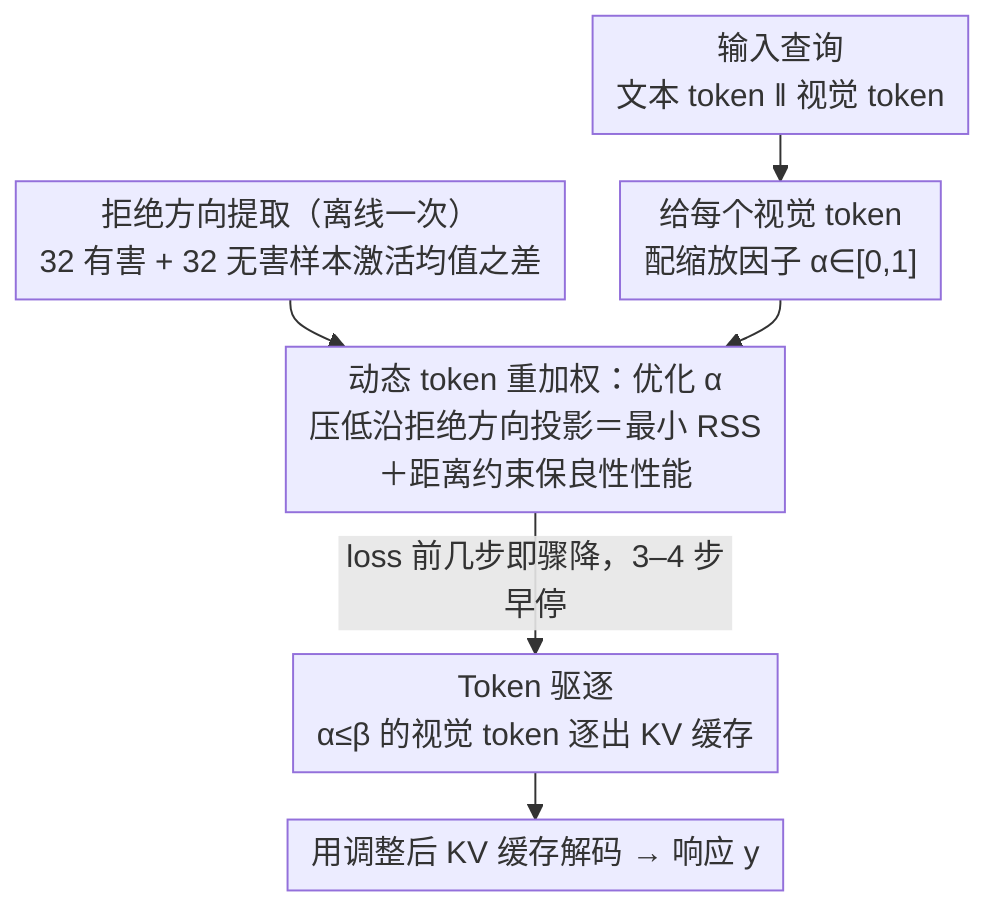

# Dynamic Token Reweighting for Robust Vision-Language Models

**会议**: CVPR 2026  
**arXiv**: [2505.17132](https://arxiv.org/abs/2505.17132)  
**代码**: [GitHub](https://github.com/TanqiuJiang/DTR)  
**领域**: 多模态VLM  
**关键词**: VLM safety, jailbreak defense, KV cache optimization, token reweighting, refusal direction

## 一句话总结
提出Dtr（Dynamic Token Reweighting），首个通过优化VLM的KV缓存来防御多模态越狱攻击的推理时防御方法，通过定义"反向安全偏移"（RSS）来识别导致安全退化的视觉token，动态调整其权重以恢复模型的安全对齐能力，同时保持良性任务性能。

## 研究背景与动机

**领域现状**：大型视觉语言模型（VLM）通过整合视觉与语言能力实现了强大的多模态推理，但引入视觉模态也带来了新的安全漏洞——多模态越狱攻击利用视觉-文本交互绕过安全护栏。

**现有痛点**：微调阶段方案（RLHF安全对齐）计算昂贵且依赖标注数据；推理阶段方案要么需要迭代提示（高开销），要么依赖图像转文本（信息丢失严重）。最近的分布偏移修正方法（ShiftDC、CoCA）需要安全参考，而参考通常通过有损的图像转文本获得。

**核心矛盾**：准确量化视觉模态引起的"安全偏移"需要对比有图/无图两种状态，但获取准确的纯文本对应物（text-only counterpart）本身就是一个有信息损失的过程。

**本文目标**：设计一种无需安全参考数据、无需图像转文本、计算开销极低的推理时越狱防御。

**切入角度**：不测量"加入图片后偏移了多少"，而是测量"通过调整视觉token权重能把偏移反向推回多少"——这个"反向安全偏移"（RSS）可以直接区分越狱查询和良性查询。

**核心 idea**：越狱攻击将查询从"被拒绝"优化到"被接受"，因此也可以被反向优化回去——而良性查询没有这个可逆性。

## 方法详解

### 整体框架
Dtr 想解决的是：视觉模态给 VLM 撕开了一道安全口子，越狱图片能把本该被拒绝的有害查询"哄"成被接受，而过去的推理时防御要么靠把图片转成文字（信息损失大）、要么靠迭代提示（开销高）。Dtr 的思路是不碰图片内容、只调视觉 token 的"话语权"。它先离线用 32 条有害 + 32 条无害提示算出一个"拒绝方向"（refusal direction）$\mathbf{d}_{ref}$ 作为安全度量轴。推理时给定查询 $\mathbf{x} = \mathbf{x}_{txt} \| \mathbf{x}_{img}$，给每个视觉 token 配一个缩放因子 $\alpha_i \in [0,1]$，然后用几步梯度下降优化这组 $\alpha$，把模型最后一层激活沿拒绝方向的投影压下去（即最小化"反向安全偏移" RSS），同时加一个距离约束别让良性激活漂太远——相当于把视觉模态造成的安全偏移反向推回。优化默认 3-4 步就早停，再把权重低于阈值 $\beta$ 的 token 直接从 KV 缓存里驱逐，最后用调整后的缓存正常解码。整条链路只动 KV 缓存、不动权重，是纯推理时方法。

### 关键设计

**1. 反向安全偏移 RSS：不问"图片偏移了多少"，问"能把偏移推回多少"**

要量化视觉模态带来的安全偏移，常规做法是对比"有图"和"无图"两个状态，但纯文本对应物得靠有损的图像转文本来造，本身就不准。Dtr 换了个角度：定义反向安全偏移 $\Delta^*_{safe}(\mathbf{x}) = \max_{\alpha} \frac{(f(\mathbf{x}) - f(\mathbf{x}(\alpha))) \cdot \mathbf{d}_{ref}}{\|\mathbf{d}_{ref}\|}$，也就是通过调整视觉 token 权重，沿拒绝方向 $\mathbf{d}_{ref}$ 最多能把激活反向推回多远。关键观察是：越狱攻击本质上就是把查询从"被拒绝"沿拒绝方向优化到"被接受"的产物，所以它天然可逆，RSS 很大；良性查询从一开始就没被这样优化过，反着推也推不动，RSS 很小。于是 RSS 直接成了区分越狱与良性的判据，既绕开了图像转文本的信息损失，也省掉了额外的 VLM 调用。更妙的是它给攻击者埋了个两难：想越狱就得加大对抗 token 的影响力，可这恰恰会把 RSS 撑大、更容易被识别；反过来压低对抗 token，又越不了狱。

**2. 动态 Token 重加权：在"恢复安全"和"保住性能"之间找平衡**

光把安全偏移推回去还不够——如果一味最小化沿拒绝方向的投影，良性图片也会被误伤，模型连正常的视觉问答都答不好了。Dtr 因此把优化目标写成两项的折中：

$$\alpha^* = \arg\min_{\alpha} \left[\frac{f(\mathbf{x}(\alpha)) \cdot \mathbf{d}_{ref}}{\|\mathbf{d}_{ref}\|} + \lambda \|f(\mathbf{x}) - f(\mathbf{x}(\alpha))\|_2 \right]$$

第一项把激活沿拒绝方向往下压，恢复安全对齐；第二项是距离约束，惩罚调整后激活偏离原始激活太远，从而保住良性任务的表现；$\lambda$ 控制两者的权衡。对越狱查询，第一项会驱动 $\alpha$ 大幅压低对抗 token；对良性查询，由于本来就没什么可压的安全偏移，距离约束让 $\alpha$ 几乎不动，影响微乎其微。

**3. 早停 + Token 驱逐：让防御不仅不慢，反而更快**

推理时方法最怕拖慢速度，Dtr 反而把效率做成了加分项。一方面，越狱查询的 loss 在前几步就快速下降，根本不用等收敛，默认跑 3-4 步就停。另一方面，优化完成后那些权重低于阈值 $\beta$ 的视觉 token 被直接逐出 KV 缓存——视觉 token 本就高度冗余，砍掉低权重的不但不掉点，还缩小了缓存、加快了后续解码。极少的优化步数加上 token 驱逐，让带防御的推理时间甚至比无防御基线还短。

**4. 拒绝方向的鲁棒提取：32 对样本就够**

整套机制依赖一个靠谱的拒绝方向 $\mathbf{d}_{ref}$（refusal direction），而 Dtr 提取它的代价低得出奇：从 AdvBench 采 32 条有害提示、从 AlpacaEval 采 32 条无害提示，取两组最后层激活的均值之差就是 $\mathbf{d}_{ref}$。之所以小样本就稳，是因为拒绝方向捕捉的是模型层面的内在属性，而非某个数据集的特有伪影——实验里它跨语言、跨攻击类型、跨数据集都保持一致。

### 损失函数 / 训练策略
完全是推理时方法，无需训练。优化器用 AdamW，学习率 0.01，$\lambda=0.1$，默认 3-4 步梯度下降。

## 实验关键数据

### 主实验

**LLaVA-LLaMA2-7B 攻击成功率（ASR↓，越低越好）**

| 防御方法 | HADES-S | HADES-S+A | HADES-S+T+A | MM-Safety-S | MM-Safety-T | JailBreak-Style |
|---------|---------|-----------|-------------|-------------|-------------|-----------------|
| 无防御 | 31.4% | 44.9% | 56.9% | 70.0% | 72.7% | 34.0% |
| AdaShield | 7.5% | 5.5% | 17.6% | 8.2% | 4.5% | 8.5% |
| ShiftDC | 20.0% | 32.9% | 16.8% | 10.9% | 5.5% | 25.5% |
| CoCA | 23.6% | 20.8% | 35.7% | 24.3% | 26.3% | 8.5% |
| **Dtr** | **8.9%** | **4.8%** | **15.9%** | **3.6%** | **3.6%** | **6.4%** |

### 消融实验

| 配置 | ASR↓ | MM-Vet↑ | 推理时间 |
|------|------|---------|---------|
| Dtr完整 | ~5% | ~35 | ~7s |
| w/o 距离约束 ($\lambda=0$) | ~3% | ~28 | ~7s |
| w/o token eviction | ~5% | ~35 | ~9s |
| 仅eviction无reweighting | ~15% | ~34 | ~5s |
| 基线(无防御) | ~45% | ~35 | ~6s |

### 关键发现
- Dtr在几乎所有攻击类型上都达到最低ASR，且在MM-Safety-S上从70%→3.6%，降幅最大
- Dtr保持甚至提升了推理效率——因为token eviction减少了KV缓存大小
- 距离约束 $\lambda$ 对良性性能至关重要，去掉后MM-Vet从35掉到28
- Refusal direction仅需32对样本即可稳定工作，跨域泛化性强
- 攻击者面临根本两难：增强对抗token→RSS增大→更容易被检测到

## 亮点与洞察
- **攻击者两难困境**是最深刻的贡献——不是在具体攻防上博弈，而是在根本层面证明了攻击和可检测性之间的trade-off
- **首个将KV cache优化用于安全的工作**——将效率优化（token eviction）和安全防御（token reweighting）统一到同一个优化框架中
- **RSS替代图像转文本**的设计巧妙——不问"图片带来了多少偏移"，而问"调整token能把偏移推回多少"，完美绕过了信息损失问题

## 局限与展望
- 每次推理都需要3-4步梯度优化，虽然快但仍有开销
- Refusal direction假设安全概念在激活空间中是线性的，对非常复杂的安全场景可能不够
- 仅在图像+文本的VLM上验证，视频/音频多模态场景未知
- 驱逐阈值 $\beta$ 需要调优

## 相关工作与启发
- **vs AdaShield**: 迭代提示检查图像安全，计算开销大；Dtr直接在KV cache层面操作
- **vs ShiftDC**: 需要图像转文本获取安全参考，有信息损失；Dtr用RSS绕过这一需求
- **vs CoCA**: 在解码logit层面修正偏移，Dtr在更底层的KV cache操作，效果更好

## 评分
- 新颖性: ⭐⭐⭐⭐⭐ RSS概念和KV cache安全优化都是首创，攻击者两难困境的分析很深刻
- 实验充分度: ⭐⭐⭐⭐⭐ 5个VLM、3个攻击benchmark、多类攻击、自适应攻击、消融全面
- 写作质量: ⭐⭐⭐⭐⭐ 从问题定义到理论分析到实验，逻辑链完整清晰
- 价值: ⭐⭐⭐⭐⭐ 对VLM安全部署有直接实用价值，开创KV cache安全优化方向

<!-- RELATED:START -->

## 相关论文

- [\[CVPR 2026\] On Token's Dilemma: Dynamic MoE with Drift-Aware Token Assignment for Continual Learning of Large Vision Language Models](on_tokens_dilemma_dynamic_moe_with_drift-aware_token_assignment_for_continual_le.md)
- [\[ICLR 2026\] Directional Embedding Smoothing for Robust Vision Language Models](../../ICLR2026/multimodal_vlm/directional_embedding_smoothing_for_robust_vision_language_models.md)
- [\[CVPR 2026\] OmniZip: Audio-Guided Dynamic Token Compression for Fast Omnimodal Large Language Models](omnizip_audio-guided_dynamic_token_compression_for_fast_omnimodal_large_language.md)
- [\[CVPR 2026\] Enhancing Continual Learning of Vision-Language Models via Dynamic Prefix Weighting](enhancing_continual_learning_of_vision-language_models_via_dynamic_prefix_weight.md)
- [\[CVPR 2026\] Dynamic Logits Adjustment and Exploration for Test-Time Adaptation in Vision Language Models](dynamic_logits_adjustment_and_exploration_for_test-time_adaptation_in_vision_lan.md)

<!-- RELATED:END -->
