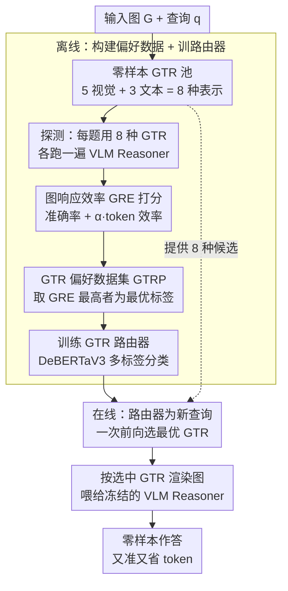

# DynamicGTR: Leveraging Graph Topology Representation Preferences to Boost VLM Capabilities on Graph QAs

**会议**: CVPR 2026  
**arXiv**: [2602.21864](https://arxiv.org/abs/2602.21864)  
**代码**: 待确认  
**领域**: 多模态VLM  
**关键词**: 图问答, 图拓扑表示, VLM零样本推理, 动态路由, 准确率-简洁性权衡

## 一句话总结

提出 DynamicGTR 框架，通过动态路由在推理时为每个查询选择最优的图拓扑表示（GTR，视觉/文本共8种），显著提升 VLM 在零样本图算法问答中的性能，并可迁移到链接预测和节点分类等真实场景。

## 研究背景与动机

**VLM 零样本图 QA 的兴起**：VLM 展现了在零样本设置下回答图相关问题的能力，但结构化图数据的理解仍具挑战性。

**固定 GTR 的局限**：现有方法使用单一固定的图拓扑表示（如统一的文本 prompt 或固定风格的可视化），忽略了模型特定和任务特定的表达偏好。

**表示偏好的差异性**：实验显示不同任务偏好不同 GTR——感知密集型任务（连通性/环检测）偏好视觉 GTR，边权重任务（最短路径/最大流）偏好文本 GTR。

**次优 GTR 的代价**：次优表示可能导致错误答案或不必要的冗长响应。

**现有图 QA 方法的限制**：工具增强系统受限于预定义问题类型，图感知 VLM 需要额外训练或架构修改，破坏零样本前提。

**核心问题**：能否利用 GTR 偏好使图 QA 既准确又高效？

## 方法详解

### 整体框架

DynamicGTR 解决的问题是：把一张图喂给 VLM 时，"用什么形式描述这张图"（图拓扑表示，GTR）会显著影响回答质量，而最优形式因问题而异——有的题画成图更好懂、有的题列成邻接表更利于计算。整套方法分**离线**与**在线**两段，由四块设计串起来：离线先建一个零样本 **GTR 池**（8 种表示），对探测集每道题用 8 种 GTR 各跑一遍 VLM，用 **GRE 指标**给每种表示打分、取最高分的为该题的最优表示，汇成 **GTR 偏好数据集（GTRP）**，再用它训练一个轻量 **GTR 路由器**；在线推理时，路由器为每个新查询一次前向挑出最优 GTR，按该 GTR 把图渲染进 prompt 喂给冻结的 VLM 作答。VLM 全程不动，只有路由器需要训练。

### 关键设计

**1. 零样本 GTR 池（$\mathcal{R}_{ZS}$）：8 种"画图/写图"的方式**

最优表示因题而异，所以第一步是凑齐一组互补的候选。遵循模型无关（不碰 VLM 参数，闭源模型也能用，因此排除需对齐训练的 embedding 表示）、多样性、有效性三原则，构建 8 种 GTR：

- **视觉 GTR（5 种）**：用 Graphviz 的不同布局算法画图——$V_{dot}$（层次树状）、$V_{neato}$（弹簧模型）、$V_{circo}$（环形）、$V_{fdp}$（快速力导向）、$V_{sfdp}$（可扩展力导向）。
- **文本 GTR（3 种）**：$T_{set}$（边集）、$T_{list}$（邻接表）、$T_{mat}$（邻接矩阵）。

直觉是双系统认知：视觉 GTR 提供快速、直觉的拓扑感知，文本 GTR 提供慢速、分析式的逐步处理——感知密集型任务（连通性、环检测）画成图一眼看清，边权重计算（最短路、最大流）写成文本更利于逐步算。

**2. 图响应效率（GRE）指标：既看对不对，也看省不省**

有了候选，还需一把尺子衡量"哪种表示最划算"。GRE 给每种表示 $r$ 在查询 $q$ 上打一个综合分，兼顾准确率和 token 开销：

$$GRE_r(q) = \text{Acc}_r(q) + \alpha \times \text{Eff}_r(q)$$

其中 $\text{Acc}_r(q) = \log(1+100 \times \text{correctness})$ 衡量答得对不对（correctness 取 0/1），$\text{Eff}_r(q) = -\log(\text{tok}_r(q))$ 惩罚啰嗦（token 越多分越低）。两项都取对数：压缩量纲、抑制异常值，并放大低端的关键改进。超参 $\alpha$ 让用户调权衡——$\alpha=0$ 纯看准确率，$\alpha$ 越大越偏好简洁。GRE 把模糊的"哪种表示最好"变成一个可比较的标量，使后续能自动给每题标出最优表示。

**3. GTR 偏好数据集（GTRP）：用 GRE 把任务-表示偏好挖出来**

GRE 是逐题的尺子，GTRP 则是把它系统跑一遍得到的训练监督。具体做法：生成约 7K 道图算法 QA（覆盖连通性、环检测、拓扑排序、最短路、最大流、二部图匹配、哈密顿路径七类任务，图从 Erdős–Rényi 随机图采样），对每道题用 8 种 GTR 各跑、用算法精确解判对错，按 GRE 在 $k$ 次试验上取平均后选出最优表示集合：

$$\mathcal{R}^*_q = \arg\max_{f \in \mathcal{R}_{ZS}} GRE_f(q)$$

由于同一题可能有多个表示同样好，$\mathcal{R}^*_q$ 是**多标签**集合。配对 $(q_i, \mathcal{R}^*_{q_i})$ 即构成 GTRP。这套数据不仅是训练路由器的监督信号，本身也揭示了清晰的任务-表示映射（论文 Table 2）：感知密集型任务偏好视觉 GTR，边权重与有序分解任务偏好文本 GTR，且不同 VLM（GPT-4o vs Gemini-2.5 Pro）的偏好模式还不一样——这也是论文强调 GTRP 是有独立价值"副产品"的原因。

**4. GTR 路由器：把选择能力蒸馏成一次轻量前向**

有了 GTRP，最后用一个小模型替 VLM 做"该用哪种表示"的判断，避免推理时把 8 种都跑一遍的高昂代价。基于 DeBERTaV3-base 训练，把查询映射到最优 GTR，用与多标签标注匹配的二元交叉熵：

$$\mathcal{L} = -\mathbb{E}\Big[\sum_r y_r \log p_\phi(y_r|q) + (1-y_r)\log(1-p_\phi(y_r|q))\Big]$$

其中 $y_r = \mathbb{I}[r \in \mathcal{R}^*_q]$ 指示表示 $r$ 是否在最优集合里。训练仅需约 2.96h（单 A100），推理时一次前向就为查询选好 GTR，几乎零额外开销，且能在不同 VLM 间迁移。

### 一个完整 walkthrough（来了一道"最短路径"查询）
1. **离线建池 + 标注**：对训练集每道题，用 8 种 GTR 各跑一遍 VLM，按 GRE 给每种表示打分——最短路类题目上 $T_{list}$/$T_{mat}$ 的 GRE 最高（算边权方便、token 适中），$V_{dot}$ 偏低（图里读不出权重）。这些 GRE 排名转成多标签 preferred 标注。
2. **训路由器**：DeBERTaV3 在这些 (查询, preferred GTR) 上学"什么题配什么表示"。
3. **推理**：新查询"求 A 到 G 的最短路" → 路由器一次前向输出 preferred = $T_{list}$。
4. **生成回答**：把图按邻接表 $T_{list}$ 渲染进 prompt 喂给 VLM → VLM 逐边累加算出最短路，答得又准又省 token。
5. **对比**：若按固定 CoT 一律画成图，VLM 在最短路上易读错权重（表中 SP Acc 仅 ~54），而 DynamicGTR 选对表示后准确率与 token 双优。

这条链说明四块怎么接力：GTR 池提供选项、GRE 定义"哪个选项好"、GTRP 把每题的最优选项标注成数据集、路由器再把这份选择能力蒸馏成一次轻量前向。

### 训练策略
仅训练 GTR 路由器（DeBERTaV3-base，多标签二元交叉熵，单 A100 约 2.96h），VLM 本身**冻结不动**——整套方法是模型无关的即插即用增强。

## 实验关键数据

### 主实验：GPT-4o 上的图算法 QA

| 方法 | Conn Acc | Cyc Acc | SP Acc | 平均 Tok |
|------|----------|---------|--------|----------|
| CoT | 92.5 | 52.7 | 54.6 | 273-566 |
| NLGraph | 92.9 | 60.2 | 59.0 | 202-534 |
| **DynamicGTR** | **最优** | **最优** | **最优** | **更少** |

### 消融实验：任务偏好分析

| 任务类型 | 偏好 GTR | 代表任务 |
|---------|---------|----------|
| 感知密集型 | 视觉 GTR | 连通性、环检测、二部图匹配 |
| 边权重计算 | 文本 GTR | 最短路径、最大流 |
| 有序分解 | 文本 GTR | 哈密顿路径、拓扑排序 |

### 关键发现

- 不同 VLM（GPT-4o vs Gemini-2.5 Pro）的 GTR 偏好模式存在差异
- DynamicGTR 的经验可从合成图算法任务**零样本迁移**到链接预测和节点分类
- 路由器在不同 VLM 间展现良好迁移性
- 对大规模图也有效

## 亮点与洞察

- 首次系统研究 VLM 图 QA 中的表示偏好问题，揭示了任务-表示匹配的重要性
- GRE 指标的准确率-简洁性权衡设计实用，用户可按需调节 $\alpha$
- 轻量级路由器（DeBERTa）+ 黑盒 VLM 推理的框架设计对闭源模型友好
- GTR 偏好数据集本身具有研究参考价值

## 局限性

- GTR 池手动设计，可能遗漏更优表示
- 探测数据基于Erdős–Rényi 随机图，真实图可能有不同偏好
- 路由器依赖文本特征，无法利用图结构本身
- 超大规模图的视觉 GTR 可能变得不可读

## 相关工作与启发

- 与 NLGraph、GraphArena 等统一文本表示方法对比，DynamicGTR 动态选择更灵活
- 与 VisionGraph、GITA 的固定视觉表示相比，补充了文本 GTR 选项
- 图表示偏好的发现可推广到其他结构化数据的 VLM 理解（如表格、流程图）
- GTR 偏好数据集揭示的任务-表示映射规律具有独立研究价值
- 双系统认知框架（快速直觉的视觉 vs 慢速分析的文本）在这里得到了实证验证

## 评分
- 新颖性: ⭐⭐⭐⭐
- 实验充分度: ⭐⭐⭐⭐⭐
- 写作质量: ⭐⭐⭐⭐
- 价值: ⭐⭐⭐⭐

<!-- RELATED:START -->

## 相关论文

- [\[CVPR 2026\] GraphVLM: Benchmarking Vision Language Models for Multimodal Graph Learning](graphvlm_benchmark_vlm_graph_learning.md)
- [\[AAAI 2026\] Graph-of-Mark: Promote Spatial Reasoning in Multimodal Language Models with Graph-Based Visual Prompting](../../AAAI2026/multimodal_vlm/graph-of-mark_promote_spatial_reasoning_in_multimodal_langua.md)
- [\[CVPR 2026\] CRIT: Graph-Based Automatic Data Synthesis to Enhance Cross-Modal Multi-Hop Reasoning](crit_graph-based_automatic_data_synthesis_to_enhance_cross-modal_multi-hop_reaso.md)
- [\[ICCV 2025\] Dynamic Group Detection using VLM-augmented Temporal Groupness Graph](../../ICCV2025/multimodal_vlm/dynamic_group_detection_using_vlm-augmented_temporal_groupness_graph.md)
- [\[AAAI 2026\] Few-Shot Precise Event Spotting via Unified Multi-Entity Graph and Distillation](../../AAAI2026/multimodal_vlm/few-shot_precise_event_spotting_via_unified_multi-entity_graph_and_distillation.md)

<!-- RELATED:END -->
