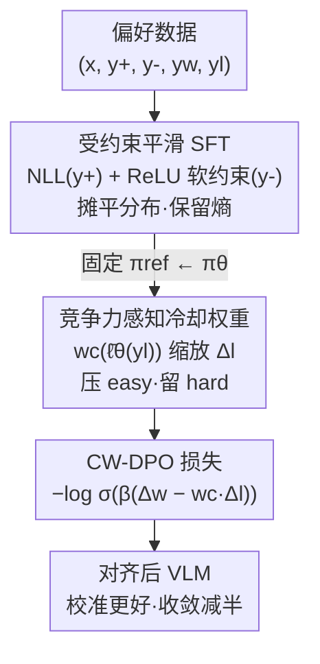

# Dynamics-Aware Preference Optimization for Vision-Language Models

**会议**: CVPR 2026  
**论文**: [CVF Open Access](https://openaccess.thecvf.com/content/CVPR2026/html/Zhang_Dynamics-Aware_Preference_Optimization_for_Vision-Language_Models_CVPR_2026_paper.html)  
**代码**: https://github.com/jushengzhang/Dynamics-Aware-Preference-Optimization  
**领域**: 多模态VLM / 对齐RLHF  
**关键词**: VLM对齐, 偏好优化, DPO, 学习动力学, 校准

## 一句话总结
本文从"学习动力学"视角诊断出 VLM 偏好微调不稳定的根因——"挤压效应"（easy negative 虽然 loss 近零却仍带来巨大且方向错误的梯度），并提出两阶段的 CW-DPO：先用受约束的平滑 SFT 把分布"摊平"，再用一个随模型置信度自适应缩放负样本梯度的"冷却权重"压住无信息更新，在 COCO/Flickr30k/NoCaps/MMMU/MMBench 上全面 SOTA（COCO CIDEr 142.6，比 PPO +3.4；MMMU +2.4% 绝对精度），同时改善校准、收敛步数减半。

## 研究背景与动机

**领域现状**：把 LLM 对齐那套（SFT → RLHF/PPO → DPO）搬到 VLM 上已是主流。其中 DPO 因为免奖励模型、直接在偏好对 $(y_w, y_l)$ 上优化而被大量采用，并衍生出 V-DPO、GRPO、OPA-DPO 等多模态变体。

**现有痛点**：偏好微调"出了名地不稳定"。对齐数据里常混入"平凡错误"或离分布的静态负样本，它们注入无信息梯度，扰乱优化、破坏校准，把后验概率推成又尖又自信的峰。即便是 on-policy 方法，也会被占主导的"easy negative"打出梯度尖刺。

**核心矛盾**：作者把根因归结为**挤压效应（squeezing effect）**——一个样本的 *loss 信息量* 和它的 *梯度影响力* 发生了解耦。随着训练推进，绝大多数负样本被模型判成近零概率（"easy negative"），它们的 loss 已经可忽略，但梯度依然很大且方向错乱，反而把概率质量不断"挤"向主导模式（rich-get-richer），加剧过自信、压缩语言多样性、恶化校准。DPO 自带的隐式正则 $\beta(1-a)$ 在 $a\in[0.8,0.99]$ 的"中等 easy"脆弱区根本压不住残余梯度。

**本文目标**：不把对齐当成静态优化，而是显式建模"模型信念在微调中如何演化"，并据此精准地只温和处理那个惹祸的负样本残差项。

**核心 idea**：**先平滑、再冷却**——Stage 1 用受约束 SFT 把损失地形摊平、避免过早把负样本压死；Stage 2 用一个随"逐 token 平均对数概率"自适应的冷却权重，把 easy negative 的梯度按需缩小、把 hard negative 的对比信号留住。

## 方法详解

### 整体框架

CW-DPO 是一个**两阶段串行**的偏好微调框架，骨干是 Qwen2.5-VL-72B（LoRA 微调）。它要解决的是"偏好对齐时负样本梯度失控"，整体思路是：先在 Stage 1 把模型从"过自信的尖峰分布"拉回到"摊平、保留熵"的初始化，再在 Stage 2 用一个会读取模型当前置信度的权重，对每个负样本的梯度做精准缩放。

方法的分析基础是一个**逐步影响分解（per-step influence decomposition）**：用一阶 Taylor 展开把"在更新样本 $\chi_u$ 上做一步更新后，观测样本 $\chi_o$ 的置信度变化"分解为三个因子——信念几何 $A_t$（logit 扰动敏感度）、eNTK 核 $K_t=J_oJ_u^\top$（参数空间传播）、损失残差 $G_t$。对 DPO 而言 $G_t=\beta(1-a)(G_t^w-G_t^l)$，分析把不稳定性**精确定位**到 loser 分量 $G_t^l$：easy negative 让它"loss 小但残差大"，这就是手术刀要切的地方。

下面这张图给出两阶段的数据流；分析得到的"$G_t^l$ 失控"是整套方法的动机，不是流水线节点：

### 关键设计

**1. 挤压效应诊断与影响分解：把不稳定锁定到 loser 残差 $G_t^l$**

这一步针对的痛点是："偏好微调为什么不稳"以往只有经验观察、没有可下手的根因。作者定义逐 token 平均对数概率 $\bar\ell_\theta(y\mid\chi)=\frac{1}{L}\sum_{l=1}^{L}\log\pi_\theta(y_l\mid\chi_{\le l})$ 作为"模型对一条回答的平均置信度"，再用一阶 Taylor 展开（式 3.2）把一次更新对全局信念的影响拆成信念几何 $A_t$、eNTK 核 $K_t$、损失残差 $G_t$ 三项。关键结论是 DPO 的损失残差 $G_t=\beta(1-a)(G_t^w-G_t^l)$ 中，loser 分量 $G_t^l$ 对 easy negative "loss→0 但梯度不收敛"，而隐式正则 $(1-a)$ 在中等 easy 的"脆弱区"压不住它。这个诊断之所以重要，是因为它把解法从"启发式地正则化整个 loss"收敛成"只温和地缩这一项残差"——后两个设计正是对症下药。

**2. Stage 1·受约束平滑 SFT：用"温和负样本"把损失地形摊平**

标准 SFT 只最大化正样本似然，会很快把分布训成尖峰、过自信，正好喂大挤压效应。作者改成一个**带约束的优化**：在最大化正样本似然的同时，要求负样本的 NLL 不低于阈值 $C$，避免负样本被过早压死：

$$\min_\theta\ \mathbb{E}_{(x,y^+)}\big[-\log\pi_\theta(y^+\mid x)\big]\quad \text{s.t.}\ \mathbb{E}_{(x,y^-)}\big[-\log\pi_\theta(y^-\mid x)\big]\ge C$$

实际用 Lagrangian 松弛成一个 ReLU 软惩罚（式 4.2）：$\mathcal{L}_{\text{SFT-C}}=\mathbb{E}[-\log\pi_\theta(y^+\mid x)]+\lambda\,\mathrm{ReLU}\big(C-\mathbb{E}[-\log\pi_\theta(y^-\mid x)]\big)$。负样本 NLL 一旦跌破 $C$，ReLU 激活、以 $\lambda$ 的强度往回拉；高于 $C$ 时不干预。这相当于在进入对比学习前先把信念几何 $A_t$ 稳住、保留预测熵。验证实验显示：标准 SFT 训练 loss 掉得快、但预测熵骤降（明确的挤压信号），而 SFT-C 全程维持更高熵，且 Top-5 生成的 CIDEr/SPICE 反而更高——"略高的 loss"是模型主动避免坍缩，不是学得差。

**3. Stage 2·竞争力感知冷却权重：按模型置信度自适应缩放负梯度**

平滑之后，真正的对齐在 Stage 2。普通 DPO 的 logits 梯度 $G_t^{\text{DPO}}=\beta(1-a)\big[(g_w-g_w^{\text{ref}})-(g_l-g_l^{\text{ref}})\big]$ 对 loser 分量一视同仁。作者引入**冷却权重** $w_c$，只非对称地作用在负样本的对数概率差 $\Delta_l$ 上：

$$w_c(\theta; y_l,\chi)=\sigma\!\left(\frac{\bar\ell_\theta(y_l\mid\chi)-\ell_{\text{floor}}}{\tau}\right)$$

其中 $\ell_{\text{floor}}$ 设"easiness 基线"、$\tau$ 控制过渡锐度。对被自信拒绝的回答（$\bar\ell_\theta\ll\ell_{\text{floor}}$）$w_c\to 0$，把无信息梯度归零；对仍有不确定性的 hard negative（$\bar\ell_\theta\ge\ell_{\text{floor}}$）$w_c\to 1$，保住学习信号。核心损失（式 4.5）为

$$\mathcal{L}_{\text{CW-DPO}}=-\log\sigma\big(\beta(\Delta_w-w_c(\theta;y_l,\chi)\cdot\Delta_l)\big)$$

把 $w_c$ 视为局部常数求导得冷却后残差 $G_t^{\text{CW}}=\beta(1-a')\big[(\pi_\theta-y_w)-w_c(\pi_\theta-y_l)\big]$，$a'=\sigma(\beta(\Delta_w-w_c\Delta_l))$。这样 easy negative 的梯度被直接最小化、正样本更新被保留，正好把设计 1 诊断出的 $G_t^l$ 失控解掉。负样本以 on-policy 为主，可选混入数据集负样本保持对比新鲜度；训练全程用 held-out 上的 $\Delta\log p$ 探针监控学习动力学，作为低成本早停 / 课程信号，形成随模型能力自适应的"内生课程"。

### 损失函数 / 训练策略
两阶段顺序训练（Algorithm 1）：Stage 1 用 $\mathcal{L}_{\text{SFT-C}}$ 训 $T_1$ 步后把参考模型固定为 $\pi_{\text{ref}}\leftarrow\pi_\theta$；Stage 2 用 $\mathcal{L}_{\text{CW-DPO}}$ 训 $T_2$ 步。数据按 75% / 25% 划分给两阶段；Stage 2 的偏好对 $y_l$ 由 GPT-4o 对获胜 caption $y_w$ 做"最小扰动"合成。超参 $\lambda, C, \beta, \tau, \ell_{\text{floor}}$；骨干 Qwen2.5-VL-72B + LoRA。

## 实验关键数据

### 主实验
骨干 Qwen2.5-VL-72B，结果为 5 次独立运行平均。

| 数据集 | 指标 | 本文 CW-DPO | 最强 baseline | 提升 |
|--------|------|------|----------|------|
| COCO Test | CIDEr | 142.6 | 139.2 (PPO) | +3.4 |
| COCO Test | BLEU-4 | 39.6 | 36.8 (OPA-DPO) | +2.8 |
| Flickr30k | CIDEr | 89.2 | 86.7 (OPA-DPO) | +2.5 |
| NoCaps | Entire | 123.6 | 121.3 (OPA-DPO) | +2.3 |
| MMMU | ACC | 74.6% | 73.1% (OPA-DPO) | +1.5 |
| MMBench1.1 | ACC | 89.6% | 87.2% (OPA-DPO) | +2.4 |

一个值得注意的现象：vanilla DPO 在 BLEU-4 上反而**不如** SFT（33.5 vs 35.2），印证了"对 easy negative 的朴素惩罚会过度抑制、损害生成质量"这一核心假设。挤压效应专项分析里，DPO 的 TV/JS 分布漂移约 0.45/0.30、top-1 token 概率常超 80%、ECE 从 0.12 恶化到 0.25；CW-DPO 把 TV/JS 压到约 0.15/0.10、top-1 维持在 50–60%、ECE 稳定在 0.08–0.10。

### 消融实验

| 配置 | COCO CIDEr | MMMU | MMBench1.1 | 说明 |
|------|---------|------|------|------|
| CW-DPO (Full) | 142.6 | 74.6 | 89.6 | 完整模型 |
| w/o Smooth SFT | 137.6 | 71.8 | 86.3 | 去 Stage 1 平滑，掉 5.0 CIDEr |
| w/o Negative Sampling | 138.9 | 72.8 | 88.4 | Stage 1 退化为标准 SFT |
| w/o Soft Penalty | 139.2 | 73.2 | 88.7 | ReLU 软约束换成硬约束 |
| w/o CW-DPO | 140.7 | 72.9 | 86.7 | 去 Stage 2，跨任务掉得最狠 |
| w/o Cooling Weight | 141.5 | 73.6 | 88.3 | $w_c$ 固定为常数，泛化变差 |
| w/o Negative Filtering | 137.4 | 73.4 | 87.4 | 对所有负样本（含极易）都更新 |

### 关键发现
- **Stage 1 平滑贡献最大**：去掉 Smooth SFT 单项就掉 5.0 CIDEr，且 MMMU/MMBench 同步下滑，说明"先把分布摊平再对齐"是稳定性的地基。
- **冷却权重的价值在泛化而非单点 caption 质量**：固定 $w_c$ 时 COCO CIDEr 几乎不掉（141.5），但 MMMU/MMBench 明显下滑——自适应缩放主要换来跨任务泛化。
- **校准与多样性同时改善**：CW-DPO 把 top-1 token 概率压回 50–60%、ECE 稳到 0.08–0.10，且收敛步数减半，说明它不是靠堆训练换分数。

## 亮点与洞察
- **"挤压效应"是个干净的诊断**：把"偏好微调不稳定"这种玄学，落到"loss 信息量与梯度影响力解耦、loser 残差 $G_t^l$ 失控"的可量化根因上，再用逐 token 平均对数概率 $\bar\ell_\theta$ 这一个量同时充当诊断指标、冷却权重输入和早停探针——一个量贯穿"分析→方法→监控"，很省。
- **冷却权重本质是软化版梯度裁剪**：用 $\sigma\big((\bar\ell_\theta-\ell_{\text{floor}})/\tau\big)$ 把"该不该信任这个负样本"写成可微的连续门，比硬阈值过滤更平滑，且只作用在 $\Delta_l$ 上、非对称地保住正样本——这个"只缩一项"的思路可迁移到任何 contrastive / preference loss。
- **"先平滑再冷却"是可复用的训练范式**：约束 SFT 保熵 + 自适应负梯度缩放，两步互补（先稳信念几何、再精修偏好），对其它易过自信坍缩的对齐任务都有参考价值。

## 局限与展望
- 作者承认依赖**成对偏好数据**且要可靠的正负监督；扩到无监督 / 弱标注（自生成或噪声偏好）需要额外的置信度校准或自适应伪标签过滤。
- 冷却权重引入 $\tau, \ell_{\text{floor}}$ 两个超参，可能需逐数据集调，作者建议未来做 meta-learned 或自动调度版本。
- 分析聚焦 captioning 式 VLM；扩到交互 / 长程多模态推理（video QA、具身 agent）需建模学习动力学里的时间依赖。
- ⚠️ 自补观察：Stage 2 负样本由 GPT-4o "最小扰动"合成，负样本质量与该构造强绑定，论文把负采样鲁棒性放在附录 12，正文未充分量化"换一种负样本生成器"对结论的影响。

## 相关工作与启发
- **vs vanilla DPO**：DPO 把所有偏好对一视同仁，靠隐式正则 $\beta(1-a)$ 压负梯度，但在中等 easy 的脆弱区压不住；CW-DPO 显式读取模型置信度、非对称缩放 $\Delta_l$，专治那段脆弱区。
- **vs PPO / RLHF**：PPO 需在线 rollout + 独立奖励模型、训练昂贵且不稳；CW-DPO 免奖励模型，靠两阶段离线 + on-policy 负样本就拿到 +3.4 CIDEr 且收敛减半。
- **vs V-DPO / GRPO / OPA-DPO**：这些变体分别补视觉偏好线索、组正则、在线偏好增广，但都没建模"梯度信号在训练中如何演化"；CW-DPO 的差异点正是把学习动力学显式纳入，故在 Table 1 的六项理想属性（免奖励模型 / 视觉感知 / 在线 / 高效 / 梯度正则 / 动力学感知 / 稳定校准）里唯一全勾。

## 评分
- 新颖性: ⭐⭐⭐⭐⭐ "挤压效应"诊断 + 影响分解把根因量化，冷却权重对症下药，视角新且自洽
- 实验充分度: ⭐⭐⭐⭐ 5 个主流 benchmark + 校准/熵/收敛多维分析 + 较全消融，但负样本生成鲁棒性主要塞在附录
- 写作质量: ⭐⭐⭐⭐ 诊断→方法逻辑清晰、公式给全；部分小节有笔误（Phase-Twp）
- 价值: ⭐⭐⭐⭐⭐ "先平滑再冷却"是简单且通用的 VLM 偏好对齐原则，易迁移

<!-- RELATED:START -->

## 相关论文

- [\[CVPR 2026\] Unified Generation and Self-Verification for Vision-Language Models via Advantage Decoupled Preference Optimization](unified_generation_and_self-verification_for_vision-language_models_via_advantag.md)
- [\[ICML 2026\] TUR-DPO: Topology- and Uncertainty-Aware Direct Preference Optimization](../../ICML2026/multimodal_vlm/tur-dpo_topology-_and_uncertainty-aware_direct_preference_optimization.md)
- [\[ICML 2025\] MMedPO: Aligning Medical Vision-Language Models with Clinical-Aware Multimodal Preference Optimization](../../ICML2025/multimodal_vlm/mmedpo_aligning_medical_vision-language_models_with_clinical-aware_multimodal_pr.md)
- [\[CVPR 2026\] FlowHijack: A Dynamics-Aware Backdoor Attack on Flow-Matching VLA Models](flowhijack_dynamics_aware_backdoor_attack_on_flow_matching_vla_models.md)
- [\[CVPR 2026\] Thinking in Dynamics: How Multimodal Large Language Models Perceive, Track, and Reason Dynamics in Physical 4D World](thinking_in_dynamics_how_multimodal_large_language_models_perceive_track_and_rea.md)

<!-- RELATED:END -->
