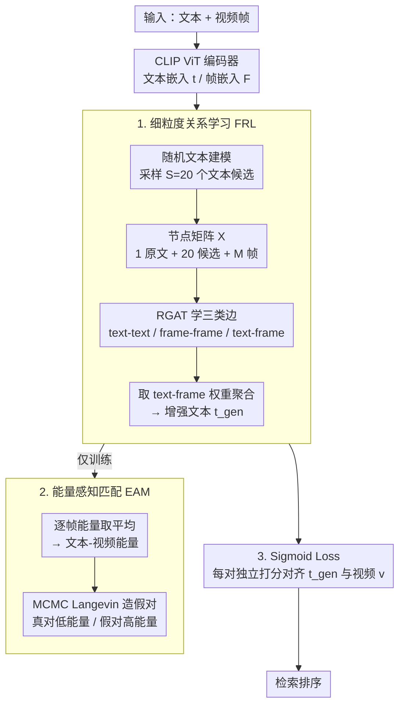

# EagleNet: Energy-Aware Fine-Grained Relationship Learning Network for Text-Video Retrieval

**会议**: CVPR 2026  
**arXiv**: [2603.25267](https://arxiv.org/abs/2603.25267)  
**代码**: [https://github.com/draym28/EagleNet](https://github.com/draym28/EagleNet)  
**领域**: 多模态VLM / 视频理解  
**关键词**: 文本视频检索, 图注意力网络, 能量模型, 细粒度关系学习, 跨模态对齐

## 一句话总结
EagleNet 通过构建文本-帧关系图并使用关系图注意力网络学习文本-帧和帧-帧之间的细粒度关系，生成融合视频上下文信息的增强文本嵌入，并引入基于能量模型的匹配机制捕获真实文本-视频对分布，在四个基准数据集上取得 SOTA。

## 研究背景与动机

1. **领域现状**：文本-视频检索（TVR）领域的主流方法大多基于 CLIP 预训练模型，聚焦于学习高质量的视频表征或改进跨模态对齐策略。近期少数工作开始关注文本表达力不足的问题——简短的视频描述难以完整反映视频的丰富语义。

2. **现有痛点**：
    - TMASS、TV-ProxyNet 等方法尝试通过采样或代理方式扩展文本语义，但仅考虑了文本与帧/视频之间的交互
    - 完全忽略了视频内部帧与帧之间的关系（frame-frame relations）
    - 结果是扩展后的文本嵌入无法捕获帧的上下文信息，导致文本和视频表征之间存在差距

3. **核心矛盾**：文本语义扩展需要同时理解"每帧说了什么"（文本-帧交互）和"帧之间如何关联"（帧-帧关系），但现有方法只做了前者而忽略了后者，而帧-帧关系对理解视频的全局和时序语义至关重要。

4. **本文目标**
    - 如何生成同时融合文本-帧交互和帧上下文信息的增强文本嵌入？
    - 如何从细粒度角度改进跨模态匹配以更精确地捕获真实文本-视频对的分布？

5. **切入角度**：将文本候选和视频帧视为图节点，建模三种类型的边关系（text-text、text-frame、frame-frame），用关系图注意力网络学习所有关系后聚合为增强文本嵌入。

6. **核心 idea**：构建文本-帧关系图学习细粒度的文本-帧和帧-帧交互关系，并用基于能量模型的匹配机制捕获真实对分布，从而生成能感知视频上下文的增强文本嵌入。

## 方法详解

### 整体框架
EagleNet 以 CLIP 为骨干网络编码文本与视频帧，再串接两个核心模块：(1) **细粒度关系学习（Fine-Grained Relationship Learning, FRL）** 先用随机文本建模采样多个文本候选，把原始文本、文本候选和帧嵌入拼成一张「文本-帧关系图」，用关系图注意力网络（RGAT）同时学习 text-text、frame-frame、text-frame 三类关系，再聚合成融合视频上下文的增强文本嵌入 $\mathbf{t}^{gen}$；(2) **能量感知匹配（Energy-Aware Matching, EAM）** 用基于能量的模型在帧粒度上刻画真实文本-视频对的分布，作为训练时的辅助目标帮助 FRL 学得更准，推理时整块移除。最终用 sigmoid loss 替代 softmax 对比损失，对 $\mathbf{t}^{gen}$ 与视频做更稳定的跨模态对齐。

### 关键设计

**1. 细粒度关系学习（FRL）：让扩展后的文本嵌入"看见"帧与帧之间的关系**

TMASS 这类方法扩展文本语义时只问"文本和每帧像不像"，却把视频内部帧与帧的上下文关系丢在一边，扩出来的文本嵌入自然抓不住视频的全局和时序语义。FRL 的做法是把所有东西都摆进一张图里一起学：先用随机文本建模策略采样 $S=20$ 个文本候选 $\{\mathbf{t}_i^{sto}\}$，连同 1 个原始文本嵌入和 $M$ 个带时序位置编码的帧嵌入，拼成节点矩阵 $\mathbf{X}\in\mathbb{R}^{n\times d}$（$n=1+S+M$）。比如一段 12 帧的视频，节点矩阵就有 $1+20+12=33$ 个节点。关系图注意力网络 RGAT 在这张图上同时学三种边——text-text、frame-frame、text-frame，对关系 $r$、节点对 $(i,j)$ 算边权重

$$e_{ij}^{r,h} = \psi^r\big([\mathbf{W}^{r,h}\mathbf{h}_i \,\|\, \mathbf{W}^{r,h}\mathbf{h}_j]\big)$$

再经 LeakyReLU 和 softmax 归一化成注意力分数。最后只取文本-帧那部分边权重做平均，对文本节点加权聚合，得到增强文本 $\mathbf{t}^{gen}=\sum_i w_i \mathbf{X}_i$。关键就在那条 frame-frame 边：有了它，文本嵌入在被聚合出来之前就已经"知道"帧之间怎么关联，从而过滤掉冗余和噪声，而不是平均地吃下每一帧。

**2. 能量感知匹配（EAM）：用能量模型在帧粒度上对齐真实的文本-视频对分布**

全局对比损失只把文本和整段视频拉到一起，看不见文本到底和哪几帧对得上。EAM 改用基于能量的模型来刻画文本-视频对的联合分布，写成 Boltzmann 形式 $p_\theta(\mathbf{t},\mathbf{F})=\frac{\exp(-E_\theta(\mathbf{t},\mathbf{F}))}{Z_\theta}$，真实对能量低、假对能量高。要害是把文本-视频能量定义为逐帧能量的平均

$$E_\theta(\mathbf{t},\mathbf{F}) = \frac{1}{M}\sum_{i}^{M} E_\theta(\mathbf{t},\mathbf{f}_i)$$

这样梯度落到每一帧上，匹配是细粒度的而非整段一锅端。其中 $E_\theta$ 可选负余弦相似度、双线性评分或 MLP（实验里双线性和 MLP 更好，说明可学习参数有用）。训练用负对数似然，靠 $K=20$ 步 MCMC Langevin 采样造出"假文本-视频对"来推高它们的能量。EAM 只在训练时生效，推理时整块拿掉，不增加任何检索开销。

**3. Sigmoid Loss 替代 Softmax Loss：让每对样本独立打分，契合 TVR 的多匹配本质**

softmax 对比损失要在 batch 相似度矩阵的行和列两个方向上做归一化，结果对负样本和 batch size 都很敏感；而 TVR 里"一个文本可能同时语义匹配好几个视频"，强行归一化反而会把这些合理的正匹配互相压低。EagleNet 改用 sigmoid loss

$$\mathcal{L}_{sig} = -\frac{1}{B}\sum_i\sum_j \log\frac{1}{1 + e^{\mathbb{I}_{ij}(\tau \cdot s(\mathbf{t}_i, \mathbf{v}_j) + b)}}$$

其中 $\mathbb{I}_{ij}$ 是正负对指示符，$\tau$、$b$ 为可学习的温度与偏置。它把每一对样本当成独立的二分类来判"匹配/不匹配"，不再受 batch 内其他样本牵连，因此训练更稳，也天然容得下一对多的匹配关系。

### 损失函数 / 训练策略
总训练目标：$\mathcal{L}_{total} = \mathcal{L}_{sig}(\mathbf{t}^{gen}, \mathbf{v}) + \lambda_{sup}\mathcal{L}_{sig}(\mathbf{t}^{sup}, \mathbf{v}) + \lambda_{eam}\mathcal{L}_{eam}$

其中 $\lambda_{sup} = 0.8$，$\lambda_{eam} = 1.0$。使用 CLIP ViT-B/32 或 ViT-B/16 初始化，CLIP 模块学习率 $10^{-7}$，非 CLIP 模块学习率 $10^{-4}$，batch size 64，训练 5 个 epoch。

## 实验关键数据

### 主实验 — MSRVTT (ViT-B/16)

| 方法 | T2V R@1↑ | T2V R@5↑ | T2V R@10↑ | V2T R@1↑ | Rsum↑ |
|------|----------|----------|-----------|----------|-------|
| CLIP4Clip | 45.2 | 72.2 | 81.4 | 42.9 | 393.2 |
| XPool | 49.2 | 73.9 | 82.6 | 48.0 | 411.5 |
| GLSCL | 49.9 | 76.3 | 84.1 | 48.3 | 419.0 |
| Video-ColBERT | 50.0 | 76.3 | 84.3 | 47.9 | 417.8 |
| **EagleNet** | **51.0** | **76.2** | **85.6** | **49.2** | **425.7** |

### 主实验 — DiDeMo & MSVD (ViT-B/16)

| 方法 | DiDeMo R@1↑ | MSVD R@1↑ | VATEX R@1↑ | Rsum↑ |
|------|-------------|-----------|------------|-------|
| TV-ProxyNet | 47.9 | 49.7 | 64.0 | 676.6 |
| TempMe | 50.2 | - | - | - |
| **EagleNet** | **51.5** | **50.9** | 63.6 | **687.7** |

### 消融实验

| 配置 | MSRVTT R@1↑ | DiDeMo R@1↑ | 平均 R@1↑ |
|------|-------------|-------------|-----------|
| Baseline (TMASS) | 48.5 | 42.1 | 45.3 |
| + FRL | 48.8 | 47.9 | 48.4 |
| + EAM | 49.0 | 43.4 | 46.2 |
| + FRL + EAM | 50.5 | 49.2 | 49.9 |
| + Sigmoid Loss | 47.8 | 43.9 | 45.9 |
| + FRL + EAM + Sigmoid (Full) | **51.0** | **51.5** | **51.3** |

### 关键发现
- **FRL 对 DiDeMo 提升最大**：单独加 FRL 使 DiDeMo R@1 从 42.1 大幅提升到 47.9（+5.8），说明帧间关系建模对长视频尤为重要
- **三个组件互补性强**：单独使用任一组件提升有限，但三者组合后 MSRVTT R@1 提升 2.5%，DiDeMo 提升 9.4%
- **能量函数选择**：Bilinear 和 MLP 效果接近且优于 CosSim，说明可学习参数有助于更准确地建模文本-帧能量
- **Avgpool 聚合帧能量最优**：优于 Maxpool、Minpool 和直接用视频级能量 $E_\theta(\mathbf{t}, \mathbf{v})$

## 亮点与洞察
- **帧-帧关系建模用于文本语义扩展**：这是一个巧妙的洞察——扩展文本语义时不仅要考虑"文本与每帧的对应"，还要考虑"帧之间的上下文关系"，后者能帮助文本嵌入捕获视频的全局和时序语义
- **首次将 EBM 引入 TVR**：能量模型天然适合细粒度的匹配建模，通过 MCMC 采样生成假对来训练能量函数，且仅在训练时使用不增推理开销
- **修正了 TMASS 代码中的数据泄露问题**：这种严谨的实验态度值得称赞，重新实现了多个基线方法确保公平比较

## 局限与展望
- RGAT 的设计相对简单，可以探索更高级的图 Transformer 架构
- 文本候选的采样策略（随机高斯采样）比较粗糙，可以考虑基于语义的定向采样
- EAM 的 MCMC 采样步数 K=20 对训练速度有影响，可以探索更高效的采样策略
- 当前主要在短视频数据集上验证，长视频场景的效果待验证

## 相关工作与启发
- **vs TMASS**: TMASS 仅通过文本-视频相似度来确定随机文本采样的半径，忽略帧间关系；EagleNet 通过构建关系图显式建模帧-帧关系
- **vs TV-ProxyNet**: TV-ProxyNet 用视频感知的 directors 将文本转为特定代理，但同样忽略帧间上下文；EagleNet 在关系学习中同时建模文本-帧和帧-帧关系
- **vs Video-ColBERT**: 两者都使用 sigmoid loss，但 EagleNet 额外引入 FRL 和 EAM 在结构化关系学习和细粒度能量匹配方面更深入

## 评分
- 新颖性: ⭐⭐⭐⭐ 将关系图学习和能量模型有机结合到 TVR 中是新颖的尝试
- 实验充分度: ⭐⭐⭐⭐⭐ 四个数据集、两个 CLIP backbone、详尽的消融和多种设计变体分析
- 写作质量: ⭐⭐⭐⭐ 方法描述清晰，但公式较多需要仔细阅读
- 价值: ⭐⭐⭐⭐ 在竞争激烈的 TVR 领域取得一致性的 SOTA 改进

<!-- RELATED:START -->

## 相关论文

- [\[CVPR 2026\] CoVR-R: Reason-Aware Composed Video Retrieval](covr-rreason-aware_composed_video_retrieval.md)
- [\[CVPR 2026\] CropVLM: Learning to Zoom for Fine-Grained Vision-Language Perception](cropvlm_learning_to_zoom_for_fine_grained_vision_language_perception.md)
- [\[AAAI 2026\] Heterogeneous Uncertainty-Guided Composed Image Retrieval with Fine-Grained Probabilistic Learning](../../AAAI2026/multimodal_vlm/heterogeneous_uncertainty-guided_composed_image_retrieval_with_fine-grained_prob.md)
- [\[CVPR 2026\] Fine-Grained Post-Training Quantization for Large Vision Language Models with Quantization-Aware Integrated Gradients](fine-grained_post-training_quantization_for_large_vision_language_models_with_qu.md)
- [\[CVPR 2026\] MA-Bench: Towards Fine-grained Micro-Action Understanding](ma-bench_towards_fine-grained_micro-action_understanding.md)

<!-- RELATED:END -->
