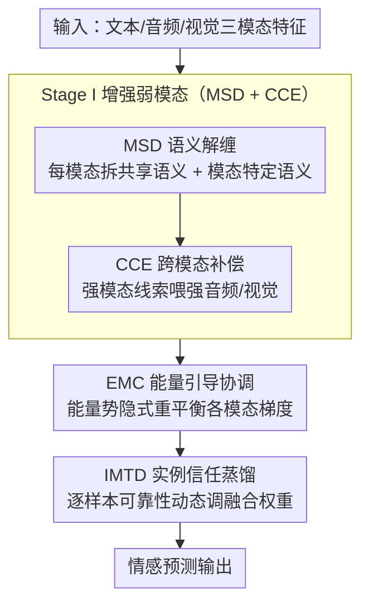

# EBMC: Enhance-then-Balance Modality Collaboration for Robust Multimodal Sentiment Analysis

**会议**: CVPR 2026  
**arXiv**: [2604.12518](https://arxiv.org/abs/2604.12518)  
**代码**: [https://github.com/kangverse/EBMC](https://github.com/kangverse/EBMC)  
**领域**: 多模态学习 / 情感分析  
**关键词**: 多模态情感分析, 模态不平衡, 能量模型, 模态信任蒸馏, 鲁棒性

## 一句话总结

提出 EBMC 两阶段框架，先通过语义解缠和跨模态增强提升弱模态表示质量，再通过能量引导的模态协调和实例感知信任蒸馏实现平衡的多模态情感分析，在缺失模态场景下保持强鲁棒性。

## 研究背景与动机

**领域现状**：多模态情感分析（MSA）融合文本、音频和视觉信号推断情感，已有大量工作探索表示学习和多模态融合策略。

**现有痛点**：文本模态持续主导预测，音频和视觉信号因更弱或更嘈杂的情感线索而被低估。主导模态积累更大梯度并强化自身表示，弱模态更新不足，形成"马太效应"。

**核心矛盾**：模态竞争导致弱模态逐渐边缘化，特别是在噪声或现实条件下。现有方法隐式假设所有模态均衡可靠。

**本文目标**：(1) 增强弱模态表示质量；(2) 平衡模态贡献避免竞争；(3) 在模态缺失场景下保持鲁棒性。

**切入角度**：先增强再平衡的两阶段思路——先让弱模态变强，再确保强模态不压制弱模态。

**核心 idea**：Stage I 通过解缠和补偿增强弱模态；Stage II 用能量模型协调梯度 + 实例感知信任蒸馏动态调整融合权重。

## 方法详解

### 整体框架

EBMC 要破的局是多模态情感分析里的"马太效应"：文本一旦占优，就会积累更大的梯度、不断强化自己，把音频和视觉越推越边缘。论文没有去直接压制文本，而是分两步走——**先增强、再平衡**。第一步（Stage I）针对表示质量：先把每个模态拆成共享语义和模态特定语义（MSD），再借强模态的线索把弱模态"喂强"（CCE），让音频、视觉先具备能参与竞争的表示能力。第二步（Stage II）针对优化动态：用能量模型在训练过程中持续对齐各模态的梯度贡献（EMC），同时在融合时按样本逐一判断哪个模态此刻可信、动态调权（IMTD）。MSD、CCE、EMC、IMTD 四个模块顺着"输入三模态特征 → 解缠+互补增强 → 能量协调梯度 → 实例级信任加权融合 → 情感预测"这条主线串起来。

### 关键设计

**1. 模态语义解缠 + 跨模态补偿（MSD + CCE）：在平衡之前先把弱模态喂强**

如果弱模态本身表示就糟，再怎么"公平"地分配梯度也救不回来，所以增强必须排在平衡之前。MSD 先把每个模态分解成跨模态共享的语义和该模态独有的语义两部分，避免后续增强时把模态特有的判别信息一起冲掉。在此基础上 CCE 让强模态（通常是文本）通过跨模态注意力，把自己的互补线索传递给音频和视觉——文本里明确的情感判别信息，被用来补齐弱模态里模糊或缺失的那一块。这一步的产物是质量更整齐的三路表示，为后面的梯度平衡提供了一个公平的起点。

**2. 能量引导模态协调（EMC）：用能量势把各模态的梯度贡献拉回均衡**

表示拉齐之后，真正决定谁主导谁的是优化过程里的梯度流。以往做法多是启发式地调学习率或缩放梯度，缺一个统一的判据。EMC 第一次把能量模型（EBM）引入模态协调：把每个模态当前的学习状态映射成一个能量势，模态之间的能量差就成了驱动梯度隐式重平衡的信号——学得过快、能量偏低的模态被抑制，落后的模态被推一把。整个过程通过一个可微的平衡目标实现，让各模态的梯度贡献在训练中趋于均衡，而不是靠手调系数。相比启发式方案，能量势给"谁该多更新一点"提供了一个有物理直觉、可优化的统一刻度。

**3. 实例感知模态信任蒸馏（IMTD）：按样本判断哪个模态此刻可信，再决定融合权重**

EMC 解决的是全局训练动态，但融合时还有一个被忽略的事实：同一个模态在不同样本里的可靠性并不一样——这条样本可能画面清晰但音频嘈杂，下一条又反过来。用一套静态的融合权重必然吃亏。IMTD 从概率化的教师信号出发，逐样本估计每个模态的可靠性，并据此动态调制融合权重；在噪声大或模态缺失的样本上，不可靠那一路的权重被自动压低。正是这种实例级的信任加权，让 EBMC 在模态缺失场景下的退化明显小于固定权重的基线。

### 损失函数 / 训练策略

总目标是多任务损失：情感预测损失 + MSD 的解缠正交约束（逼共享/特定语义彼此独立）+ EMC 的能量平衡目标 + IMTD 的信任蒸馏 KL 散度。两阶段交替训练——先优化增强相关的模块，再优化平衡相关的目标，避免两类目标互相干扰。

## 实验关键数据

### 主实验

| 方法 | MOSI Acc7↑ | MOSI MAE↓ | MOSEI Acc7↑ | IEMOCAP Acc↑ |
|------|-----------|----------|------------|-------------|
| MISA | 42.3 | 0.783 | 52.1 | 68.5 |
| Self-MM | 43.5 | 0.768 | 53.2 | 69.7 |
| UniMSE | 44.1 | 0.752 | 54.3 | 70.8 |
| **EBMC** | **45.8** | **0.731** | **55.6** | **72.3** |

### 消融实验

| 配置 | MOSI Acc7 | 说明 |
|------|----------|------|
| 完整 EBMC | 45.8 | 全部组件 |
| 无 EMC | 43.9 | 无能量协调 |
| 无 IMTD | 44.2 | 无信任蒸馏 |
| 无 CCE | 44.5 | 无跨模态补偿 |
| 无 MSD | 44.8 | 无语义解缠 |

### 关键发现

- EMC 贡献最大（去掉后降 1.9%），说明模态协调是核心问题
- 在模态缺失场景下 EBMC 性能退化显著小于基线，证明鲁棒性
- 迁移到情感对话识别（ERC）任务上也观察到一致提升

## 亮点与洞察

- 首次将 EBM 引入模态协调是一个有物理直觉的创新：能量势自然编码模态学习状态
- "先增强后平衡"的两阶段思路具有通用性，可迁移到其他多模态学习场景
- 实例感知信任蒸馏解决了静态融合权重的固有限制

## 局限与展望

- 在 IEMOCAP 等小数据集上改善幅度有限
- 能量模型的超参数调整可能影响稳定性
- 未探索四模态以上的场景
- 可将 EMC 应用于视觉-语言预训练中的模态平衡

## 相关工作与启发

- **vs MISA**: MISA 做模态解缠但不处理不平衡，EBMC 在解缠基础上增加能量协调
- **vs OGM-GE**: OGM-GE 通过梯度操作平衡模态，EBMC 的 EBM 方法更原则性

## 评分

- 新颖性: ⭐⭐⭐⭐ EBM 模态协调是新贡献
- 实验充分度: ⭐⭐⭐⭐ 三数据集 + 缺失模态 + ERC 迁移
- 写作质量: ⭐⭐⭐⭐ 两阶段结构清晰
- 价值: ⭐⭐⭐⭐ 对多模态鲁棒学习有参考价值

<!-- RELATED:START -->

## 相关论文

- [\[CVPR 2026\] Purify-then-Align: Towards Robust Human Sensing under Modality Missing with Knowledge Distillation from Noisy Multimodal Teacher](purify-then-align_towards_robust_human_sensing_under_modality_missing_with_knowl.md)
- [\[ICML 2025\] Robust Multimodal Large Language Models Against Modality Conflict](../../ICML2025/multimodal_vlm/robust_multimodal_large_language_models_against_modality_conflict.md)
- [\[CVPR 2026\] Disentangle-then-Align: Non-Iterative Hybrid Multimodal Image Registration via Cross-Scale Feature Disentanglement](disentangle-then-align_non-iterative_hybrid_multimodal_image_registration_via_cr.md)
- [\[CVPR 2026\] CRIT: Graph-Based Automatic Data Synthesis to Enhance Cross-Modal Multi-Hop Reasoning](crit_graph-based_automatic_data_synthesis_to_enhance_cross-modal_multi-hop_reaso.md)
- [\[CVPR 2026\] MASQuant: Modality-Aware Smoothing Quantization for Multimodal Large Language Models](masquant_modality-aware_smoothing_quantization_for_multimodal_large_language_mod.md)

<!-- RELATED:END -->
