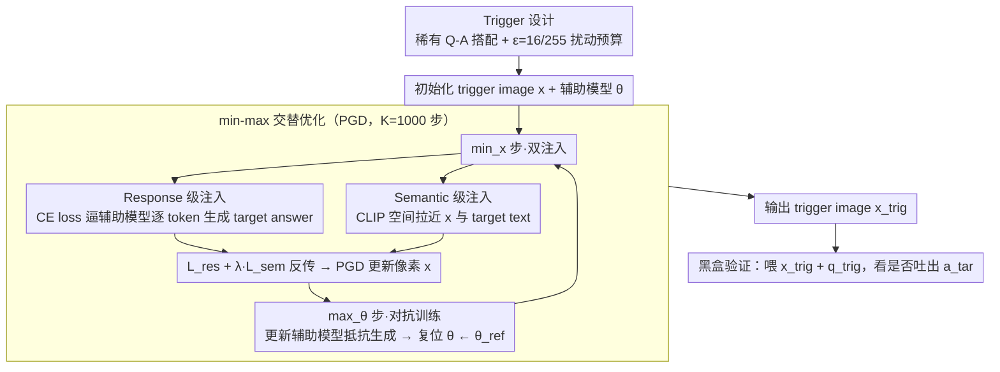

<!-- 由 src/gen_stubs.py 自动生成 -->
# Echoes of Ownership: Adversarial-Guided Dual Injection for Copyright Protection in MLLMs

**会议**: CVPR2026  
**arXiv**: [2602.18845](https://arxiv.org/abs/2602.18845)  
**代码**: [GitHub](https://github.com/kunzhan/AGDI)  
**领域**: 多模态大模型安全  
**关键词**: MLLM版权保护, 对抗攻击, 触发图像, 双注入, CLIP语义对齐, 黑盒追踪

## 一句话总结

提出 AGDI 框架，通过对抗优化生成 trigger image 进行 MLLM 黑盒版权追踪：双注入机制同时在 response 级（CE loss 驱动辅助模型输出 target answer）和 semantic 级（最小化 trigger image 与 target text 的 CLIP 余弦距离）注入版权信息，并引入模型对抗训练模拟 fine-tune 抵抗，在 Qwen2-VL/LLaVA-1.5 上全面超越 PLA 和 RNA 基线。

## 背景与动机

1. **MLLM 开源引发版权纠纷**：开源 MLLM（如 LLaVA、Qwen-VL）被恶意用户 fine-tune 后用于商业牟利并虚假声称所有权，模型发布者需要有效的版权追踪手段
2. **白盒方法不实际**：依赖模型内部参数、梯度或特征分布的方法（watermarking、fingerprinting）在实际场景中受限于黑盒访问——可疑模型通常仅提供 API 查询
3. **现有黑盒方法过拟合 base model**：PLA 等方法通过对抗训练注入 trigger，但 trigger image 过度依赖 base model 的特定响应模式，在下游 fine-tune 后性能严重退化
4. **CLIP-like 对齐模块的稳定性**：大多数 MLLM 内含 CLIP-like 跨模态对齐模块，其高层 image-text embedding 在 fine-tune 后保持相对稳定，为设计可泛化的 trigger 机制提供了机会
5. **单一注入层级不足**：仅用 response-level 注入缺乏跨模型泛化性；仅用 semantic-level（CLIP 特征对齐）缺乏对特定模型的激活精度。需要双层注入互补

## 方法详解

### 整体框架

开源 MLLM 被人 fine-tune 后拿去牟利、还反咬说模型是自己的，发布者却往往只能黑盒查询可疑模型、拿不到参数。AGDI 的目标是造一张 trigger image $x_{\text{trig}}$：base model 和它的 fine-tune 衍生模型在 $(x_{\text{trig}}, q_{\text{trig}})$ 输入下都会吐出预设的 target answer $a_{\text{tar}}$，而无关模型不会——于是发布者只要喂这张图问一句，就能验证版权。trigger 的 Q-A 故意选成罕见搭配（如 "Q: Detecting copyright. A: ICLR Conference."），保证正常训练不会误触发。核心是一个 min-max 博弈：

$$\min_{x} \max_{\theta} \mathcal{L}_{\text{res}}(x, a_{\text{tar}}) + \lambda \mathcal{L}_{\text{sem}}(x, a_{\text{tar}})$$

交替优化 trigger image $x$（最小化注入损失，把版权信息写进像素）和辅助模型参数 $\theta$（最大化注入损失，主动模拟下游 fine-tune 的抵抗），让 trigger 对参数变化也稳。整体流程是：先定好 trigger 的稀有 Q-A 与扰动预算，再在 min-max 内外循环里同时做两路注入并对抗训练，最后导出 trigger image 用于黑盒验证。

### 关键设计

**1. Trigger 设计：稀有 Q-A 搭配 + 固定扰动预算**

一切的起点是定义「触发什么、扰动多大」。trigger 必须在正常使用中绝不被误触发，所以作者特意用 5 组日常罕见的 Q-A 搭配（如 "Detecting copyright → ICLR Conference"、"What are you busy with → I'm playing games"），这种生僻搭配在正常训练数据里几乎不会出现，从而保证只有发布者主动查询时才会激活。配 200 张 ImageNet 验证集图像 × 5 组 Q-A，共 1000 个 trigger 查询；像素扰动预算 $\epsilon = 16/255$，PGD 步数 $K = 1000$，步长 $\alpha = 1/255$。这些设定决定了后面两路注入往哪个 target answer 优化、像素能动多大。

**2. Response 级注入：用 CE loss 把 target answer 写死进像素**

只在语义层对齐还不足以驱动模型真去「生成」那句 target text，得有一路直接逼输出。这一路用交叉熵强制辅助 MLLM 在 trigger image + trigger question 下逐 token 生成 target answer：

$$\mathcal{L}_{\text{res}}(x, a_{\text{tar}}) = -\log f_\theta(a_{\text{tar}}|x) = -\sum_{t=1}^{|a_{\text{tar}}|} \log f_\theta(a_t^{\text{tar}}|x, a_{<t}^{\text{tar}})$$

梯度反传到图像像素，把版权相关信息注进去。消融里去掉这一路，ASR 直接掉到接近 0%——只靠语义对齐根本驱动不出 target 文本。

**3. Semantic 级注入：借 CLIP 模块的「fine-tune 不变性」换泛化**

只有 response 注入会过拟合 base model 的特定响应模式，下游 fine-tune 后就失效（PLA 的毛病）。作者观察到大多数 MLLM 内含的 CLIP-like 对齐模块，其高层 image-text embedding 在 fine-tune 后相当稳定（实测 cosine 漂移仅 0.5%~9.3%），于是再加一路把 trigger image 与 target text 在 CLIP 空间里拉近：

$$\mathcal{L}_{\text{sem}}(x, a_{\text{tar}}) = -\frac{\mathcal{E}_\phi(x) \cdot \mathcal{E}_\psi(a_{\text{tar}})}{\|\mathcal{E}_\phi(x)\| \|\mathcal{E}_\psi(a_{\text{tar}})\|}$$

其中 $\mathcal{E}_\phi, \mathcal{E}_\psi$ 是 CLIP 图像 / 文本编码器。这一路把版权信息绑在「衍生模型也改不动」的子模块上，trigger 因此能跨 fine-tune 泛化；去掉它，方法就退回 PLA 的水平。Response 与 Semantic 两路一起构成标题里的 dual injection——前者保激活精度、后者保跨模型泛化，在 min 步里以 $\mathcal{L}_{\text{res}} + \lambda \mathcal{L}_{\text{sem}}$ 同时反传更新像素 $x$。

**4. 对抗训练 + 参数复位：让 trigger 扳得住真实 fine-tune**

前面两路只是把信息写进像素，但下游用户会 fine-tune 模型——要让 trigger 对参数变化鲁棒，就得在优化时预演 fine-tune 的破坏，这就是 min-max 里的 max 步。固定 trigger image、反向更新辅助模型去抵抗生成 target：$\mathcal{L}_{\text{model}} = -\mathcal{L}_{\text{res}} - \lambda \mathcal{L}_{\text{sem}}$，参数更新 $\theta \leftarrow \theta - \gamma \cdot \text{clip}(\nabla_\theta \mathcal{L}_{\text{model}})$，图像更新走 PGD 风格 $x \leftarrow x - \alpha \cdot \text{sign}(\nabla_x \mathcal{L}_{\text{trig}})$。关键的一笔是：每张 trigger 优化完，辅助模型参数立刻复位到 reference 模型 $\theta \leftarrow \theta_{\text{ref}}$，防止多张 trigger 之间累积漂移、把后面的优化带偏。比起 RNA 那种无方向的随机扰动，这种有方向的对抗更贴近真实 fine-tune 行为。

## 实验关键数据

### 设置

- **Base models**: LLaVA-1.5-7B、Qwen2-VL-2B-Instruct
- **Fine-tune 方式**: LoRA (rank=16, α=32, lr=2e-4) 和 Full fine-tune (lr=1e-5)
- **下游数据集**: V7W、ST-VQA、TextVQA、PaintingForm、MathV360k
- **评价指标**: Attack Success Rate (ASR) = trigger 查询中模型输出包含 target text 的比例
- **基线**: Ordinary（vanilla CE + frozen model）、RNA、PLA

### 主实验结果（Qwen2-VL，ASR%）

| 方法 | LoRA V7W | ST-VQA | TextVQA | PaintingF | MathV | Avg | Full V7W | ST-VQA | TextVQA | PaintingF | MathV | Avg |
|---|:---:|:---:|:---:|:---:|:---:|:---:|:---:|:---:|:---:|:---:|:---:|:---:|
| Ordinary | 36 | 46 | 22 | 48 | 41 | 38.6 | 34 | 43 | 15 | 48 | 26 | 33.2 |
| RNA | 36 | 39 | 22 | 40 | 37 | 34.8 | 32 | 38 | 15 | 40 | 21 | 29.2 |
| PLA | 48 | 68 | 33 | 76 | 60 | 57.0 | 43 | 60 | 28 | 75 | 38 | 48.8 |
| **AGDI** | **53** | **77** | **41** | **81** | **68** | **64.0** | **46** | **65** | **33** | **80** | **45** | **53.8** |

### LLaVA-1.5 结果（LoRA fine-tuning，ASR%）

| 方法 | V7W | ST-VQA | TextVQA | PaintingF | MathV | Avg |
|---|:---:|:---:|:---:|:---:|:---:|:---:|
| PLA | 51 | 43 | 21 | 55 | 18 | 37.6 |
| **AGDI** | **64** | **56** | **36** | **79** | **30** | **53.0** |

AGDI 在所有 base model × fine-tune 方式组合上全面领先。LoRA avg AGDI 64% vs PLA 57%（Qwen2-VL），LLaVA-1.5 上差距更大（53% vs 37.6%）。

### 非衍生模型验证

在 MiniGPT-4、Qwen2-VL、Llama3-Vision、LLaVA-1.6 上测试 LLaVA-1.5 生成的 trigger：RNA/PLA/AGDI 均为 **0% ASR**，无误触发。

### 消融实验（LLaVA-1.5 LoRA，ASR%）

| 配置 | V7W | ST-VQA | TextVQA | PaintingF | MathV |
|---|:---:|:---:|:---:|:---:|:---:|
| w/o response injection | 0 | 1 | 1 | 1 | 4 |
| w/o semantic injection | 51 | 43 | 21 | 55 | 18 |
| w/o LLM update（仅更新 CLIP） | 32 | 39 | 20 | 19 | 13 |
| w/o encoder update（仅更新 LLM） | 60 | 55 | 29 | 70 | 29 |
| **AGDI（完整）** | **64** | **56** | **36** | **79** | **30** |

- 去掉 response injection → ASR 接近 0%（仅 CLIP 对齐无法驱动生成 target text）
- 去掉 semantic injection → 退化为 PLA 水平（过拟合 base model）
- 双注入 + 完整对抗训练缺一不可

### 鲁棒性分析

- **模型剪枝**：Magnitude / Wanda pruning（10-30% sparsity），AGDI 在 PaintingF 上 59-79% ASR vs PLA 14-46%
- **模型合并**：Linear / TIES merging，AGDI 保持领先
- **量化**：8-bit 量化下 ASR 仅轻微下降
- **输入变换**：Resizing(256) / Gaussian noise(5) / JPEG compression，ASR 分别降至原始的 ~65% / ~92% / ~62%
- **系统提示变化**：切换不同 system prompt，ASR 波动 ±3%
- **推理参数**：temperature/top-p 从 0.1 到 1.0，ASR 波动 ±1%
- **更多 MLLM**：InternVL3.5-2B/8B 上同样有效（8B LoRA avg ~57%）

## 亮点

- **Dual injection 设计优雅**：response-level 保证激活精度，semantic-level 利用 CLIP 模块稳定性保证泛化性，两者互补且均有理论基础
- **对抗训练模拟 fine-tune**：通过 max-min 博弈让 trigger image 对参数变化具备鲁棒性，且参数复位机制避免累积漂移
- **完全黑盒**：publisher 只需查询可疑模型即可验证版权，无需访问模型内部参数
- **不修改模型参数**：trigger 仅在图像侧优化，不影响 base model 性能，适合 post-deployment 场景
- **实验覆盖全面**：2 个 base model × 2 种 fine-tune × 5 个下游数据集，外加剪枝/合并/量化/输入变换/系统提示等鲁棒性测试

## 局限与展望

- PGD 优化 1000 步 × 1000 个 trigger 查询，trigger 生成成本不低，未讨论加速方案
- 扰动预算 $\epsilon=16/255$ 在视觉上可能不够隐蔽，论文缺少用户感知实验（如 human study）
- TextVQA 数据集上 ASR 始终最低（LoRA 41%、Full 33%），可能因 OCR 任务的 fine-tune 对模型改变更大
- 仅在 2B/7B 规模模型上验证，更大模型（如 70B+）的效果未知
- Trigger Q-A pairs 需人工设计为稀有组合，自动化设计方案未探索
- 未与 watermarking 方法（需 fine-tune 模型嵌入水印）做比较，两类方法适用场景不同但读者期望看到对比

## 与相关工作的对比

- **vs PLA (ICLR 2025)**：PLA 同为 trigger image 方法，但仅用 response-level 注入（CE loss），过拟合 base model 响应模式。AGDI 增加 semantic-level 注入利用 CLIP 稳定性 + 对抗训练，Qwen2-VL LoRA avg 64% vs 57%
- **vs RNA**：RNA 引入随机噪声扰动模型参数模拟 fine-tune，但扰动方向不可控。AGDI 的对抗训练是有方向的——专门训练辅助模型抵抗 target 生成，更有效模拟真实 fine-tune 行为
- **vs IF (ACL 2024)**：IF 是 LLM 方法，通过 instruction tuning 嵌入 fingerprint，需修改模型参数且在 LLaVA-1.5 LoRA 上仅 22.4% avg ASR（远弱于 AGDI 53%）
- **vs 模型水印方法**：水印方法（REEF、SLIP）需要 fine-tune 模型嵌入水印，会降低模型性能且在下游 fine-tune 后容易被移除；AGDI 完全在图像侧操作，不接触模型参数

## 启发与关联

- CLIP-like 对齐模块作为 MLLM 的"不变子模型"这一观察非常有价值，可推广到其他跨模型迁移场景
- 对抗训练 + 参数复位的范式可应用于其他需要"对参数变化鲁棒"的优化问题
- Trigger image 方法本质是一种对抗攻击的正向应用，和 jailbreak 攻击（负向应用）形成对偶关系

## 评分

- 新颖性: ⭐⭐⭐⭐ — Dual injection + adversarial training 的组合有创新，CLIP 稳定性观察有洞察力，但单个组件（CE loss、CLIP 对齐、PGD）均为已有技术
- 实验充分度: ⭐⭐⭐⭐⭐ — 2 个 base model、2 种 fine-tune、5+5 个数据集、完整消融、6 种鲁棒性测试，覆盖极为全面
- 写作质量: ⭐⭐⭐⭐ — 问题定义清晰，公式简洁，实验表格丰富；部分符号可进一步统一
- 价值: ⭐⭐⭐⭐ — 实用性强，直接可用于开源模型版权保护；但依赖 trigger image 的隐蔽性和稀有 Q-A 的假设在大规模部署中需进一步验证

<!-- RELATED:START -->

## 相关论文

- [\[CVPR 2026\] AGFT: Alignment-Guided Fine-Tuning for Zero-Shot Adversarial Robustness of Vision-Language Models](agft_alignment-guided_fine-tuning_for_zero-shot_adversarial_robustness_of_vision.md)
- [\[ICLR 2026\] HiDrop: Hierarchical Vision Token Reduction in MLLMs via Late Injection, Concave Pyramid Pruning, and Early Exit](../../ICLR2026/multimodal_vlm/hidrop_hierarchical_vision_token_reduction_in_mllms_via_late_injection_concave_p.md)
- [\[ICLR 2026\] Constructive Distortion: Improving MLLMs with Attention-Guided Image Warping](../../ICLR2026/multimodal_vlm/constructive_distortion_improving_mllms_with_attention-guided_image_warping.md)
- [\[CVPR 2026\] DUET-VLM: Dual Stage Unified Efficient Token Reduction for VLM Training and Inference](duet-vlm_dual_stage_unified_efficient_token_reduction_for_vlm_training_and_infer.md)
- [\[ICML 2026\] On the Adversarial Robustness of Large Vision-Language Models under Visual Token Compression](../../ICML2026/multimodal_vlm/on_the_adversarial_robustness_of_large_vision-language_models_under_visual_token.md)

<!-- RELATED:END -->
