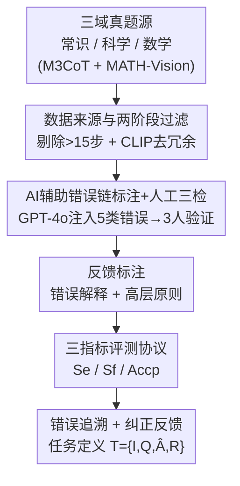

# EduDiag: A Benchmark for Educational Diagnostic Reasoning with Error Tracing and Correction on Large Multimodal Models

**会议**: CVPR 2026  
**论文**: [CVF Open Access](https://openaccess.thecvf.com/content/CVPR2026/html/Chen_EduDiag_A_Benchmark_for_Educational_Diagnostic_Reasoning_with_Error_Tracing_CVPR_2026_paper.html)  
**代码**: 待确认（论文未公开仓库链接）  
**领域**: 多模态VLM / Benchmark  
**关键词**: 多模态大模型, 教育诊断推理, 错误追溯, 纠正反馈, GRPO  

## 一句话总结
EduDiag 构建了首个评测多模态大模型（LMM）"教育诊断推理"能力的基准——给定题目、图像、参考解题过程和一个错误答案，要求模型**反向重建**导致该错误答案的错误推理链并生成纠正反馈，覆盖常识/科学/数学三域共 8345 条标注，对 24 个主流 LMM 的评测显示连 GPT-5 都做不好，错误追溯是核心瓶颈。

## 研究背景与动机
**领域现状**：多模态大模型（LMM）在多模态推理上表现强劲，已成为智能问答、解题辅导系统的核心技术。现有多模态推理 benchmark（M3CoT、MathVista、MMMU 等）主要用链式思维（CoT）评测模型的**正向**推理：从题目一步步推到正确答案。

**现有痛点**：真实教学远不止"给出答案"。有经验的老师面对学生的错误答案时，会**反向分析**：学生为什么选了 18 而不是 24？是看错了图、算错了、还是概念理解偏了？然后据此给出有针对性的纠正。这种"教育诊断推理"能力，现有 LMM 几乎没被系统评测过——现有 benchmark 既没有标注错误推理过程，也没有对应的纠正反馈。

**核心矛盾**：此前 LMM 纠错研究大多是**诊断给定的推理链**（错误过程是已知输入）。但现实里（如选择题、填空题）老师拿不到学生的"内心思路"，只看到一个错误选项，必须**回溯推断**学生可能犯了什么错。这个"从错误答案反向追溯错误链"的能力是空白。

**本文目标**：把诊断推理拆成两个可评测的子任务——(1) **错误追溯**：从错误答案重建一条能自然导向它的错误推理链；(2) **纠正反馈**：生成错误解释 + 防止再犯的高层原则。

**切入角度**：作者认为一个好基准要满足三条——覆盖真实教育场景（常识/科学/数学多域）、错误要是学生**常犯**的而非随机噪声、评测要能分别度量"追溯"和"纠正"的质量。围绕这三条设计数据与指标。

**核心 idea**：用"AI 辅助标注（GPT-4o）+ 严格人工三检"的流水线，在常识/科学/数学三域真题上注入五类常见错误、构造错误链与反馈，并定义 $S_e/S_f/Acc_p$ 三个指标，把"反向诊断"做成一个可量化、可微调、可强化学习优化的评测任务。

## 方法详解

### 整体框架
EduDiag 是一个**数据集 + 评测协议**，不是一个新模型。它解决的问题是"如何系统地度量 LMM 能否像老师一样从错误答案反推错因并纠正"。整条构造流水线分四步串行：先从三个教育域的高质量 CoT 数据集**筛数据**（剔除过长/冗余样本）；再用 GPT-4o **注入五类常见错误**生成候选错误推理链，由三名标注员人工三检留下逻辑自洽且有代表性的链；接着对每条错误链**标注纠正反馈**（错误解释 + 高层原则）；最后定义三个指标组成**评测协议**，对模型生成的错误链和反馈分别打分。任务形式化为：输入 $T=\{I, Q, \hat{A}, R\}$（图像、题目、错误答案、参考正确解题步骤 $R=[s_1,\dots,s_N]$），模型先生成错误推理链 $\hat{R}=[\hat{s}_1,\dots,\hat{s}_M]$，逐步自回归 $\hat{s}_i = \arg\max p(\hat{s}_i \mid T, \hat{s}_1,\dots,\hat{s}_{i-1})$，再输出纠正反馈 $F$。

### 关键设计

**1. 任务定义：从错误答案反向追溯错误链 + 生成纠正反馈**

针对"现有 benchmark 只测正向 CoT、纠错研究只诊断已知错误链"的空白，本文把诊断推理形式化为一个**反向**生成任务。输入是题目图像 $I$、题面 $Q$、一个**错误答案** $\hat{A}$ 和参考正确解题步骤 $R$，模型要先生成一条能**自然导向** $\hat{A}$ 的错误推理链 $\hat{R}$，再生成纠正反馈 $F$（含针对本题的错误解释 + 防止类似错误的高层原则）。关键约束在于：参考解 $R$ 只是脚手架，模型不能照抄正确链，而要"装成犯错的学生"逆向构造一条听起来合理、实则有典型错误的链——这正是它比正向 CoT 难的地方。推理步骤的切分沿用 ROSCOE 的定义，使每一步可独立评估。

**2. 数据来源与两阶段过滤：保证多域覆盖且无冗余偏置**

数据取自三个教育域的高质量、带步骤化 rationale 的源：常识与科学来自 M3CoT（分别 844、1608 样本，该数据集已剔除"不看图也能答"的题并人工标注步骤解），数学来自 MATH-Vision（取带 rationale 子集 592 样本，因为大规模数学数据集的解多由 GPT-4o/Gemini 自动生成、过简且可能含错，不可靠作参考）。初采样本有两个问题：解过长会引入过多错误来源、使追溯标注困难；题图对高度重复会造成评测偏置。于是两阶段过滤：(i) **剔除步数 >15 的复杂样本**；(ii) **CLIP 去冗余**——对每个类别内分别用 CLIP 视觉/文本编码器算图像与题面的同模态余弦相似度，把图像相似度 $>\tau_1=0.7$ 且题面相似度 $>\tau_2=0.8$ 的样本视为候选冗余组，再由标注员在图形界面里每组最多保留两条代表样本。

**3. AI 辅助错误链标注 + 人工三检：让错误"像学生常犯的"而非随机噪声**

直接用小模型集成答题来收集错误链有个硬伤——模型主要错在最基础的视觉感知，不能反映学生真实多样的错误。本文改用两阶段 AI 辅助标注：先**定义五类常见错误**（视觉感知错误、计算错误、推理错误、知识错误、题意误解），再让 GPT-4o 基于图像+题目+步骤解，**先定位 rationale 里最 tricky 的步骤**，在这些步骤注入潜在错误类型，往下调整后续推理，生成 **5 条候选错误链及对应的新错误答案**。随后三名标注员按三条准则人工筛：(i) **逻辑准确性**——删掉错误不能逻辑导向最终错误答案的链；(ii) **代表性错误识别**——保留反映学生常见先验错误的链，丢弃随机或不合理的；(iii) **多样性**——每题最多保留 3 条、优先覆盖不同错误类型，仅措辞不同的去重为一条。最终得到 8345 条错误链。统计上每条链平均 6.15 步（远超 VISCO 基准的 3.4 步，使追溯更具信息量也更难），错误多落在**中间步骤**，五类错误占比为视觉感知 36.1%、知识 22.0%、计算 19.4%、推理 18.8%、题意误解 3.7%。

**4. 评测协议：三指标分别度量错误追溯与纠正质量**

为分别量化"追溯"和"纠正"，定义三个指标。(i) **错误链得分 $S_e$**（0–3，离散）：用三个**与构造模型不同**的 LLM（Gemini-2、Claude-3.7、Seed-1.6）独立打分取平均，以规避"用同一个 GPT-4o 既造数据又评测"的偏置；评分准则为 $S_e=3$ 链与 ground truth 一致、$S_e=2$ 能导向错误答案但没抓住常见错误、$S_e=1$ 含逻辑断裂、$S_e=0$ 与错误答案无关。(ii) **反馈得分 $S_f$**（1–5）：仍由上述三 LLM 从"错误定位、解释具体性、原则可泛化性"三方面综合打分。(iii) **纠正准确率 $Acc_p$**：把模型生成的"高层原则"当老师产出，让一个固定的小模型 Qwen2-VL-7B **扮演学生**，带着该原则用 CoT 答一道由同题错误答案聚合成的选择题，看正确率有没有提升；同时报告不带原则直接答题的准确率作对照，从而度量原则真正的"防错增益"。作者特别指出 $S_e=3$ 是生成有效纠正原则的**关键阈值**——只有真正识别出常见错误，反馈才有用。

## 实验关键数据

### 主实验
在 EduDiag 上评测 24 个 LMM（18 开源 2B–90B + 6 商业闭源），并对开源模型做 LoRA SFT（train/val/test 划分为 6392/710/1243）。核心指标见下表（Overall 列）。

| 模型 | 设置 | $S_e$↑ | $S_f$↑ | $Acc_p$↑ |
|------|------|--------|--------|----------|
| Ground Truth（人工原则） | — | — | — | 62.67% |
| Direct（无原则直接 CoT 答） | — | — | — | 46.72% |
| GPT-5 | zero-shot | **2.67** | 3.83 | **52.22%** |
| Gemini-2.5-Pro | zero-shot | 2.67 | 3.89 | 50.87% |
| GPT-4o | zero-shot | 2.30 | 3.17 | 51.48% |
| Qwen2.5-VL-7B | zero-shot | 0.38 | 1.50 | 49.99% |
| Qwen2.5-VL-7B | SFT | 1.97 | 2.96 | 51.75% |
| InternVL3-8B | zero-shot → SFT | 0.67→2.09 | 1.69→3.03 | 49.98%→51.03% |

关键观察：(i) **基准很难**——最强的 GPT-5 在 $Acc_p$ 上 52.22%，距 ground truth 原则的 62.67% 仍差 **10.45 个百分点**；开源模型的错误链 $S_e$ 普遍 <2，说明只能抓简单错误步、拼不出逻辑自洽导向错误答案的链。(ii) **数学域最难**——所有模型在数学的错误追溯与纠正都差，连 GPT-5 的数学 $S_e$ 也只有 2.38；科学域多数模型的 $Acc_p$ 甚至不超过 Direct（如 Qwen2.5-VL-7B 41.07% vs Direct 41.59%）；常识域相对最好，因为常识错误多源于视觉感知偏差，原则作为"看图启发式"较易奏效。(iii) **规模有用但有限**——Llama-3.2 从 11B→90B，$S_e$ 0.69→1.75。

### SFT vs GRPO 强化学习对比（关键分析）
仅 SFT 能大幅提 $S_e$（Qwen2.5-VL-7B 0.38→1.97）却几乎不提 $Acc_p$（多数仅 +1~2%）——因为 SFT 常"硬把模型推向给定错误答案"、链内出现逻辑冲突（$S_e=3$ 的高质量链占比低）。作者用 GRPO 配两种奖励对比：$R_1$ 用 BERTScore 约束反馈与 ground truth 相似；$R_2$ **移除输入里的错误答案**、奖励"生成错误链的最后一步恰好命中某个候选错误答案"。

| 模型 | 策略 | 数学 $S_e$ | Overall $Acc_p$ | $S_e{=}3$ 占比 |
|------|------|-----------|-----------------|----------------|
| Qwen2.5-VL-7B | SFT | 1.29 | 51.75% | 13.18% |
| Qwen2.5-VL-7B | SFT+GRPO $R_1$ | 1.21 | 50.89% | — |
| Qwen2.5-VL-7B | SFT+GRPO $R_2$ | **1.68** | **53.46%** | **29.75%** |
| Qwen3-VL-8B | SFT | 1.38 | 51.81% | 14.52% |
| Qwen3-VL-8B | SFT+GRPO $R_2$ | **1.79** | **53.85%** | **32.18%** |

### 关键发现
- **错误追溯是核心瓶颈**：高质量错误链（$S_e=3$）是有效纠正反馈的**必要前提**；SFT 提了 $S_e$ 却没把 $S_e=3$ 比例提上去，所以纠正几乎没涨。
- **$R_2$（命中错误答案奖励）显著优于 $R_1$（反馈相似度奖励）和 SFT**：$R_2$ 鼓励模型"自然推导出错误答案"而非被强行收敛，把 Qwen2.5-VL-7B 的 $S_e=3$ 占比从 13.18% 拉到 29.75%；$R_1$ 只对齐反馈表面相似、不改善底层链质量，故无明显增益——印证"反馈好不好取决于错误链对不对"。
- **大模型从 $R_2$ 获益更大**：Qwen3-VL-8B $Acc_p$ +2.62%，Qwen3-VL-4B 仅 +1.33%，模型规模放大了 RL 优化错误追溯的收益。
- **能力可迁移到干扰项生成**：用 $R_2$ 优化后的模型生成选择题干扰项，固定 QA 模型答它们的正确率更低（更难），如 Qwen3-VL-8B 优化后干扰项让综合正确率从 53.47% 降到 46.32%，接近 EduDiag 人工干扰项的 43.49%——说明强的错误追溯能力可直接用来出更有挑战性的题。

## 亮点与洞察
- **"反向出题"式任务设计很巧**：把"老师反推学生错因"形式化成"从错误答案重建错误链"，天然规避了"用 CoT 测正向推理"的同质化，逼出模型真正缺失的诊断能力。
- **评测防自评偏置**：构造用 GPT-4o，但 $S_e/S_f$ 打分换成 Gemini-2/Claude-3.7/Seed-1.6 三模型平均，是值得复用的"造-评分离"做法。
- **$R_2$ 奖励设计点睛**：把"答案"从输入里抠掉、只奖励"链能自己推到某个错误答案"，直接对症 SFT 的"强行收敛、逻辑打架"问题——这种"去掉捷径让模型自己长出能力"的奖励设计可迁移到其他需要自洽推理的任务。
- **错误链平均 6.15 步、错误多在中段**：相比 VISCO 的 3.4 步更接近真实学生的多步犯错模式，使追溯更有信息量。

## 局限与展望
- **强依赖 GPT-4o 标注**：错误链与反馈均由 GPT-4o 生成再人工筛，引入的错误分布可能偏向 GPT-4o 的"想象"，未必完全等同真实学生错误（尽管作者用五类错误定义和人工三检缓解）。
- **评测用 LLM 打分**：$S_e/S_f$ 由三个 LLM 打分，仍可能有评分模型自身偏好；$Acc_p$ 用固定 Qwen2-VL-7B 当"学生"，单一学生模型未必代表多样学生群体。⚠️ 部分原文表格中 OCR 抽取的零散数值（如个别 $Acc_p$ 百分比）以原文为准。
- **域不均衡**：科学占 52.8%、数学仅 19.5%，而数学恰是最难且最有诊断价值的域，样本偏少可能限制对数学诊断能力的充分评估。
- **改进方向**：作者明确指出 GRPO + "预测候选错误答案"奖励是有希望的方向；可进一步探索更细粒度的 step-level 奖励、引入真实学生错误数据校准。

## 相关工作与启发
- **vs 正向多模态 CoT benchmark（M3CoT / MathVista / MMMU）**：它们测"题→正确答案"的正向推理；EduDiag 复用其题源与步骤解，但**反过来**测"错误答案→错误链→纠正"，填补反向诊断空白。
- **vs 给定错误链的纠错研究（VISCO 等）**：以往把错误推理过程当**已知输入**来诊断；EduDiag 要求模型**自己重建**错误链（错误过程未知），且错误链更长（6.15 vs 3.4 步），更贴近选择题/填空题里"只见错误答案不见思路"的现实。
- **vs 反馈学习 / 自训练纠错工作**：相关工作多关注用 GPT-4 反馈或自训练提升 LMM 的自我纠错；EduDiag 把"反馈是否真有效"显式量化为 $Acc_p$（学生模型带原则答题的增益），并发现单纯对齐反馈相似度（$R_1$）不够，必须先把错误追溯做对。

## 评分
- 新颖性: ⭐⭐⭐⭐⭐ 首个"从错误答案反向追溯错误链 + 纠正"的多模态诊断推理基准，任务设定与现有正向 CoT 评测正交。
- 实验充分度: ⭐⭐⭐⭐⭐ 24 个 LMM 全谱评测 + SFT/GRPO 多策略对比 + 干扰项生成迁移应用，分析扎实。
- 写作质量: ⭐⭐⭐⭐ 任务形式化与指标定义清晰，构造流程图文并茂；个别统计细节较密。
- 价值: ⭐⭐⭐⭐⭐ 指出"错误追溯是瓶颈"并给出 GRPO-$R_2$ 可行方向，对教育智能、LMM 反思能力评测都有实用价值。

<!-- RELATED:START -->

## 相关论文

- [\[CVPR 2026\] EMO-R3: Reflective Reinforcement Learning for Emotional Reasoning in Multimodal Large Language Models](emo-r3_reflective_reinforcement_learning_for_emotional_reasoning_in_multimodal_l.md)
- [\[CVPR 2026\] GGBench: A Geometric Generative Reasoning Benchmark for Unified Multimodal Models](ggbench_a_geometric_generative_reasoning_benchmark_for_unified_multimodal_models.md)
- [\[CVPR 2025\] ESPIRE: A Diagnostic Benchmark for Embodied Spatial Reasoning of Vision-Language Models](../../CVPR2025/multimodal_vlm/espire_a_diagnostic_benchmark_for_embodied_spatial_reasoning_of_vision-language_.md)
- [\[ACL 2026\] ErrorRadar: Benchmarking Complex Mathematical Reasoning of Multimodal Large Language Models Via Error Detection](../../ACL2026/multimodal_vlm/errorradar_benchmarking_complex_mathematical_reasoning_of_multimodal_large_langu.md)
- [\[CVPR 2026\] Circuit Tracing in Vision-Language Models: Understanding the Internal Mechanisms of Multimodal Thinking](circuit_tracing_in_vision-language_models_understanding_the_internal_mechanisms_.md)

<!-- RELATED:END -->
