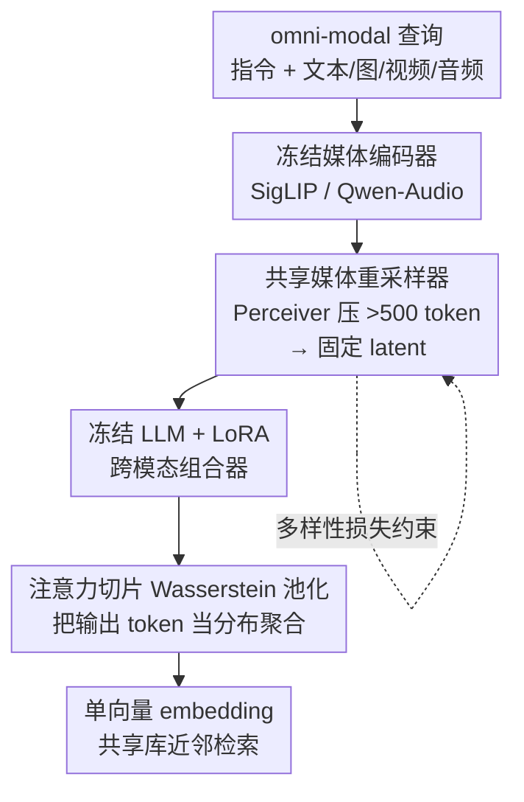

# Efficient and High-Fidelity Omni Modality Retrieval

**会议**: CVPR 2026  
**论文**: [CVF Open Access](https://openaccess.thecvf.com/content/CVPR2026/html/Huynh_Efficient_and_High-Fidelity_Omni_Modality_Retrieval_CVPR_2026_paper.html)  
**代码**: 暂未公开（项目页 https://hmchuong.github.io/omniret）  
**领域**: 多模态VLM  
**关键词**: omni-modal 检索, 组合查询, Sliced Wasserstein Pooling, Perceiver 重采样, 音频检索  

## 一句话总结
OmniRet 用一个冻结的 LLM 当通用组合器，把文本/图像/视频/音频混合查询编码成单个向量做检索；它用「共享媒体重采样器」压缩海量媒体 token 解决效率瓶颈，用「注意力切片 Wasserstein 池化（ASWP）」把 LLM 输出当分布来聚合以保住细粒度信息，在 13 个检索任务上 12 个领先，并首次支持组合音频与音视频检索。

## 研究背景与动机
**领域现状**：多模态检索（multimodal retrieval）要把跨异构模态的查询聚合成一个表示去匹配目标。CLIP/BLIP/CLAP 这类跨模态模型很强，但基本只覆盖「文本+视觉」或「文本+音频」两种模态；近来一批工作把 MLLM 当组合器，能理解更复杂的组合查询，把多模态 token 喂进 LLM 后取一个 embedding。

**现有痛点**：通往「通用检索」有两道坎。① **效率**：媒体编码器一张图就吐 >500 个 token，全部喂进 LLM 会让算力爆炸，从而压低可用 batch size——而对比学习恰恰高度依赖大 batch 里的 in-batch 负样本，batch 一小训练就废。② **保真**：把丰富的多模态输入压成单个向量会形成信息瓶颈，丢掉细粒度细节；以往要么粗暴用 average pooling 或 `[EOS]` token（细粒度被加权和抹平），要么上 ColBERT 式 late-interaction 保留 token 级 embedding（存储/检索代价高到不实用）。

**核心矛盾**：效率与保真度在「单向量 vs 多向量」之间存在直接 trade-off——单向量快但丢信息，多向量保真但贵且不兼容高效 ANN 索引。同时音频、视频这类模态既缺专用模型也缺训练数据，长期被忽视。

**本文目标**：训练一个统一编码器 $f$，把带指令的查询和候选都映射到同一个 $D$ 维空间，同时（a）压住 token 数保证大 batch、（b）保住细粒度细节，且产出仍是单个向量以兼容大规模检索。

**核心 idea**：在「LLM 通用组合器」前后各塞一个注意力重采样模块——前面压缩媒体 token 求效率，后面把 LLM 输出 token **当成一个分布**、用切片 Wasserstein 的方式相对一组可学习参考点求描述子，从而在单向量格式下保住细粒度信息。

## 方法详解

### 整体框架
OmniRet 是一个 encoder：输入是「指令 + 任意模态组合」的 omni-modal 查询（或一个候选），输出是单个 $D$ 维 embedding，查询和候选共用同一个模型编码，最后在共享向量库里做近邻检索。流程是：每种媒体先过各自冻结编码器（视觉用 SigLIP-SO400M、音频用 Qwen-Audio Encoder），经投影 + **共享媒体重采样器**压成固定数量的 latent，与文本 token 一起按模板交错喂进**冻结 LLM（GTE-Qwen2-1.5B + LoRA）**，LLM 的输出隐状态再经 **ASWP** 聚合成最终向量。整套只训练投影头、重采样器、池化层和 LoRA，约 84M 可训练参数。训练靠对比损失 + 三元组损失 + 多样性损失。

### 关键设计

**1. 共享媒体重采样器：用一个 Perceiver 压住所有模态的 token 爆炸**

这一步直击效率痛点：媒体编码器动辄 >500 token，直接进 LLM 会把 batch size 压死、拖垮对比学习。重采样器是媒体 token 与 LLM 输入空间之间的中间层，基于 Perceiver 架构（cross-attention + feed-forward，堆 3 层），把任意长的媒体 token 序列 $\mathbb{R}^{T\times D}$ 压成一小撮固定数量的 latent 向量 $M\in\mathbb{R}^{N\times D}$。关键巧思是**一个 Perceiver 模块跨所有模态共享**（增强泛化、共享统计），同时给每种模态加一组**模态特有 latent**——做法是把共享 latent query 与该模态的 media latent 相加，让同一个模块既保留通用能力又对模态差异敏感。对视频，先做 3D 三线性插值压掉帧间冗余再重采样。消融显示：去掉重采样器掉 3.5%（因 batch 被迫缩小），用分开的重采样器或去掉模态特有 latent 都更差，证明「共享 + 模态特异」缺一不可。

**2. 注意力切片 Wasserstein 池化（ASWP）：把 LLM 输出当分布而非取平均**

这是保真度的核心。聚合 LLM 输出隐状态时，作者先用一个和重采样器同构的注意力模块把整段输出压成 $S$ 个 latent $Z=\{z_1,\dots,z_S\}$，然后**不做 average pooling**（会糊掉 token 结构），而是把 $Z$ 看成一个分布，相对一组**可学习参考点** $X=\{x_1,\dots,x_S\}$ 来描述它。受 PSWE 启发，沿 $L$ 个 1D 投影方向 $\Theta=\{\theta_1,\dots,\theta_L\}$ 把 $Z$ 和 $X$ 都投到一维，逐方向算 1D Monge coupling，得到

$$Z' = [\psi_1(X,Z;\theta_1);\dots;\psi_L(X,Z;\theta_L)] \in \mathbb{R}^{S\times L}$$

其中 $\psi_i(\cdot)$ 度量投影后 token 分布与参考点的对齐程度——$Z'$ 相当于一个可学习的「直方图式」描述子，保住了细粒度的分布信息。由于 $Z'$ 比目标 embedding 大，再做一步**硬选择**压缩：对每列 $\psi_i$ 算 soft 分数 $y=\mathrm{softmax}(\psi_i)$，取 one-hot 掩码 $m_i^{hard}=\mathrm{OneHot}(\arg\max_j y_j)$；为了能反传这个离散选择，用直通最大值（STM）估计器 $\tilde m_i = m_i^{hard} - \mathrm{StopGrad}(y) + y$（前向等于硬掩码，反向让梯度沿 $y$ 流），最后 $V=Z'\odot\tilde m$ 并按列求和 $h_i=\sum_j V_{ji}$ 得到最终 $L$ 维向量。这样既保留了 late-interaction 般的细粒度，又输出单向量、完全兼容高效 ANN。消融极有说服力：把 ASWP 换成 average pooling 直接暴跌 **29.5%**，换 max pooling 或可学习加权和分别掉 1.0%/1.7%，说明 STM 的梯度流是关键；用单个 `[EOS]` 向量则掉 6.8%。

**3. 重采样 token 的多样性损失：防止压缩后的 latent 互相塌缩**

重采样把几百个 token 压成几十个 latent，若这些 latent 高度相似，信息其实已经在进 LLM 前就丢了。作者加一个多样性正则 $\mathcal{L}_{div}$ 逼输出向量 $M\in\mathbb{R}^{N\times D}$ 互相正交：

$$\mathcal{L}_{div} = \frac{1}{N^2}\,\mathrm{smoothL1}\!\big(\mathrm{Dropout}(\max(MM^\top,0) - I)\big)$$

先算两两相似度矩阵 $MM^\top$、截掉负值、减去单位阵去掉自相似；关键是在算 loss 前对矩阵做 **Dropout**，等于每步只随机采一小撮 token 对来算，稀疏采样高效地施加全局多样性约束。再用 smoothL1（Huber，$\gamma=0.5$）而非 L2，对大相似度（离群值）不敏感，防梯度爆炸同时仍惩罚非正交。消融里去掉 $\mathcal{L}_{div}$ 掉 3.1%（去掉三元组损失只掉 0.5%），说明「进 LLM 前先保住 latent 多样性」是真正关键的一环。

### 损失函数 / 训练策略
最终目标是三项线性组合：$\mathcal{L} = \mathcal{L}_{cont} + \mu_1\mathcal{L}_{triplet} + \mu_2\mathcal{L}_{div}$（$\mu_1=1,\mu_2=0.1$）。对比项用带难负挖掘的 InfoNCE：

$$\mathcal{L}_{cont} = -\log \frac{e^{\phi(h_q,h_{c^+})}}{\sum_c w(h_q,h_c)\,e^{\phi(h_q,h_c)}},\quad \phi(x,y)=\tfrac{1}{\tau}\cos(x,y)$$

其中难负权重 $w(h_q,h_{c^-})=\dfrac{|N|e^{\beta\phi(h_q,h_{c^-})}}{\sum_{c^-}e^{\beta\phi(h_q,h_{c^-})}}$（正样本权重为 1），$\tau=0.07,\beta=0.5$；再叠一个 hinge 三元组损失 $\mathcal{L}_{triplet}=\sum_{c^-}\max[\eta+\phi(h_q,h_{c^-})-\phi(h_q,h_{c^+})]$，$\eta=0.1$。查询前面统一拼指令 `Instruct: {task} \n Query: {q}`，候选保持无指令原样。训练分两阶段：**Stage 1 预热**只训投影/重采样/池化层（LLM 冻结），在简单单模态与文本绑定任务上跑 2M 样本、batch 2048；**Stage 2 微调**放开全部数据与任务（约 18M 样本），给 LLM 注入 LoRA（rank 16、alpha 64），视频 media latent 用图像的权重初始化，batch 3072 但每 batch 只随机选 4 个任务并做 2 步梯度累积以稳住训练。共 30 个数据集、约 620 万查询-候选对。

## 实验关键数据

### 主实验（扩展版 M-BEIR，13 个检索任务，Recall@5 为主）
| 任务组（部分指标） | OmniRet (1.5B) | 同规模最强基线 | 说明 |
|--------------------|----------------|----------------|------|
| V→T / T→V（视频文本） | 43.8 / 43.2 | VLM2VecV2 17.6 / 18.4 | 视频检索大幅领先 |
| A→T / T→A（音频文本） | 66.8 / 62.4 | CLAP 63.9 / 56.6 | 超过音频专用模型 |
| 组合视觉文本 V,T→V | 86.2 | VLM2VecV2 76.4 | 组合查询领先 |
| I→T / T→I | 50.6 / 46.9 | PE-Core 58.0 / 53.4 | 视觉文本任务持平/接近 |
| I→I（图到图） | 24.4 | PE-Core 32.0 | 唯一明显落后的任务 |

> 作者称同规模下 13 个任务里 12 个领先，仅 image-to-image 落后；音频、视频任务甚至超过在更多 in-domain 数据上训练的专用模型。

### MMEBv2 子集泛化（Recall@1，<7B 模型）
| 模型 | Image-CLS | Image-RET | Video-CLS | Video-RET | Video-MRET |
|------|-----------|-----------|-----------|-----------|------------|
| VLM2VecV2 (1.5B) | 62.9 | 69.5 | 39.3 | 28.8 | 38.5 |
| **OmniRet (1.5B)** | 51.7 | 65.3 | **48.6** | **36.5** | **43.3** |

未在这些训练集上充分微调，图像检索仍处于中位区间（~65），视频三项全部取得 SOTA。

### ACM 新基准（组合音频 / 音视频检索，Recall@5）
| 模型 | A,T→A | A→V | V→A | A→I | I→A |
|------|-------|-----|-----|-----|-----|
| QwenOmni+Gemma（多阶段文本管线） | **44.6** | 3.3 | 6.3 | 4.4 | 5.4 |
| ImageBind | 7.32 | 35.5 | 36.3 | 30.1 | 29.7 |
| **OmniRet** | 23.0 | 35.5 | 34.4 | 24.5 | 26.0 |

组合音频任务上，Gemma 多阶段管线最强但代价大、且把音频/视觉转成文本破坏了模态绑定，导致其音视频检索几乎失效；OmniRet 是单阶段方法，在两类任务间取得最均衡的表现。

### 消融实验（Avg. Recall over 6 tasks，训练 1M 样本，baseline 50.2）
| 配置 | Avg. Recall | Δ | 说明 |
|------|-------------|-----|------|
| Full（共享重采样器 + ASWP + 三损失） | 50.2 | 0.0 | 完整模型 |
| ASWP → Average Pooling | 20.7 | **-29.5** | 平均池化把信息几乎抹平 |
| Embedding 用单 `[EOS]` 向量 | 43.4 | -6.8 | 单向量丢细粒度 |
| 去掉媒体重采样器 | 46.7 | -3.5 | batch 被迫缩小 |
| 去掉 $\mathcal{L}_{div}$ | 47.1 | -3.1 | latent 多样性是关键 |
| ASWP 用 max pooling（替 STM） | 49.2 | -1.0 | STM 梯度流更优 |
| 去掉 $\mathcal{L}_{triplet}$ | 49.7 | -0.5 | 三元组损失增益小 |

### 关键发现
- **ASWP 的池化方式是命门**：average pooling 让 6 任务平均 Recall 从 50.2 暴跌到 20.7，因为它把指向参考点的有效正距离和负值互相抵消；STM 直通估计器优于普通 max pooling 和可学习加权和。
- **保住「进 LLM 前」的多样性比「进 LLM 后」的三元组损失更重要**：去 $\mathcal{L}_{div}$ 掉 3.1%，去 $\mathcal{L}_{triplet}$ 只掉 0.5%。
- **投影数 $L$ 和参考点数 $S$ 越多越好但更贵**，$L{=}4096,S{=}128$ 是最佳折中（$L{=}1536$ 时掉 2.7%）。
- 共享重采样器带来 +3% Recall，且必须配「模态特有 latent」，纯共享或纯分离都更差。

## 亮点与洞察
- **把池化重写成「分布 vs 参考点」的最优传输问题**：ASWP 用切片 Wasserstein 思路，在不牺牲单向量格式（兼容 ANN）的前提下逼近 late-interaction 的细粒度，是单/多向量 trade-off 的一个漂亮折中。
- **STM 直通估计器让「硬选择」可训练**：前向硬 one-hot、反向走 softmax 梯度，这一招把离散 argmax 塞进端到端训练，且实测优于可微的加权和。
- **效率与保真分两处解耦**：重采样器在 LLM 前管效率、ASWP 在 LLM 后管保真，两个注意力重采样模块同构却各司其职，思路清晰可复用。
- **首个三模态（文本/视觉/音频）组合查询检索模型**，并补了组合音频、音视频检索两个长期缺失的评测任务（ACM 基准，人评 87%、Gemini 文本输入 96%，证明任务可解但非平凡）。

## 局限与展望
- 作者承认受算力限制，没把 LLM backbone 和数据规模放大，预期 scale up 会显著涨点。
- 只扩了模态、没扩任务种类；未来想在更大数据上同时扩任务和输入类型（深度图、3D 点云、语音）。
- ⚠️ ACM 基准的「难负」与 caption 质量依赖 QwenOmni2.5 / Gemini2.5 生成，合成数据可能引入分布偏差；human 87% vs Gemini 文本输入 96% 也说明评测对纯文本捷径仍较友好。
- 图到图（I→I）检索明显落后专用视觉模型（24.4 vs 32.0），纯视觉单模态相似度检索并非其强项。

## 相关工作与启发
- **vs ImageBind**：ImageBind 用对齐的方式撑起六模态联合空间，但直接处理全部编码器 token、效率低，且无法理解组合查询；OmniRet 专门解决效率瓶颈（重采样器）并支持 `A,T→A` 这类复杂组合查询，在音视频任务上与其持平、在组合任务上大幅领先。
- **vs ColBERT / MetaEmbed（late-interaction）**：它们保留 token 级 embedding 求保真，但存储/检索代价高、不兼容高效单向量 ANN；ASWP 用分布描述子在单向量格式下逼近其细粒度。
- **vs `[EOS]` / average pooling（NV-Embed 等单向量法）**：传统单向量法快但丢细节，消融里 `[EOS]` 掉 6.8%、average pooling 掉 29.5%，凸显 ASWP 的价值。
- **vs UniIR**：UniIR 用双编码器统一检索但依赖各模态专用编码器；OmniRet 用单个 LLM 当通用组合器统一编码查询与候选。

## 评分
- 新颖性: ⭐⭐⭐⭐⭐ 首个三模态组合检索模型，把切片 Wasserstein + STM 直通引入 embedding 池化
- 实验充分度: ⭐⭐⭐⭐⭐ 13 任务 + MMEBv2 + 自建 ACM 基准，消融覆盖五大组件
- 写作质量: ⭐⭐⭐⭐ 方法与公式清晰，ASWP 部分符号密集需对照图读
- 价值: ⭐⭐⭐⭐⭐ 通用检索（RAG/推荐）实用性强，并补齐音频检索评测空白

<!-- RELATED:START -->

## 相关论文

- [\[CVPR 2026\] HiFICL: High-Fidelity In-Context Learning for Multimodal Tasks](hificl_highfidelity_incontext_learning_for_multimo.md)
- [\[CVPR 2026\] Visual-Aware CoT: Achieving High-Fidelity Visual Consistency in Unified Models](visual-aware_cot_achieving_high-fidelity_visual_consistency_in_unified_models.md)
- [\[CVPR 2026\] Parameter-Efficient Adaptation for MLLMs via Implicit Modality Decomposition](parameter-efficient_adaptation_for_mllms_via_implicit_modality_decomposition.md)
- [\[CVPR 2026\] DeepAlign: Mitigating Modality Conflict through Modality-Specific Alignment](deepalign_mitigating_modality_conflict_through_modality-specific_alignment.md)
- [\[NeurIPS 2025\] SpatialTraceGen: High-Fidelity Traces for Efficient VLM Spatial Reasoning Distillation](../../NeurIPS2025/multimodal_vlm/spatialtracegen_high-fidelity_traces_for_efficient_vlm_spatial_reasoning_distill.md)

<!-- RELATED:END -->
