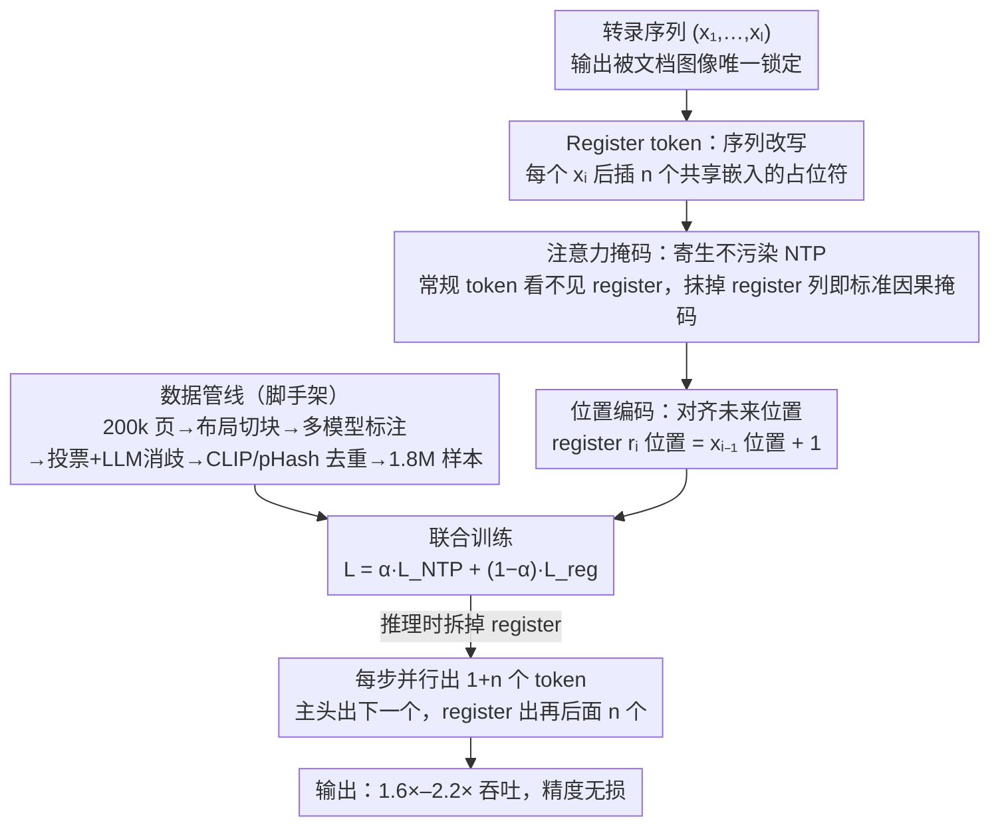

# Efficient Document Parsing via Parallel Token Prediction

**会议**: CVPR 2026 Findings  
**arXiv**: [2603.15206](https://arxiv.org/abs/2603.15206)  
**代码**: [GitHub](https://github.com/flow3rdown/PTP-OCR)  
**领域**: 多模态VLM  
**关键词**: 文档解析, 并行token预测, Register Token, VLM加速, OCR

## 一句话总结

提出 PTP（Parallel Token Prediction），一种模型无关的即插即用加速方法，通过在训练序列中插入可学习 register token 实现并行多 token 预测，在 OmniDocBench 上实现 1.6×-2.2× 吞吐提升且不损失精度。

## 研究背景与动机

**文档解析的实用需求**：文档解析需将非结构化文档转为机器可读输出，是 RAG、文档分析等应用的基石，对速度和精度均有高要求。

**VLM 彻底改变了文档解析**：VLM 端到端或管线式方法显著提高了解析质量，但自回归（AR）解码成为速度瓶颈。

**AR 解码的本质矛盾**：文档解析本质是高确定性转录任务而非开放式生成，输出由输入图像唯一确定，天然具有可并行性。

**现有加速方法的不足**：输出压缩、视觉 token 裁减、参数剪枝均未根本解决 AR 瓶颈。

**非自回归方法受限**：基于 CTC 的 NAR 模型性能有限且仅限 span 级 OCR。

**关键洞察**：图像可分解为多个 patch 独立识别，这种并行能力可内嵌到模型中。

## 方法详解

### 整体框架

PTP 要解决的是文档解析里自回归逐 token 解码太慢的问题——文档转录本质是"看图照抄"的确定性任务，输出几乎被输入图像锁死，理应能一次吐出好几个 token，却被 next-token prediction（NTP）的串行依赖卡住了吞吐。它的做法是：在不改 backbone、不动原始 NTP 训练的前提下，往训练序列里"寄生"一批可学习的 register token，让模型在预测当前 token 的同时，顺手把后面 $n$ 个位置也并行预测出来；推理时每走一步就能产出 $1+n$ 个 token，从而把吞吐拉高 1.6×–2.2×。整套方法由三个相互咬合的设计（register token、注意力掩码、位置编码）撑起，外加一条专门为它喂数据的高质量标注管线。

### 关键设计

**1. Register token：把"预测下一个"扩成"并行预测后面几个"**

针对 AR 解码一次只能出一个 token 的串行瓶颈，PTP 在原序列每个常规 token $x_i$ 后插入 $n$ 个 register token，它们共享同一个 token ID 和同一份可学习嵌入，仅靠位置编码区分身份；其中第 $i$ 个 register 专门负责预测"再往后第 $i+1$ 个"位置。于是训练序列从 $(x_1, x_2, \ldots)$ 改写成

$$\hat{X}_a = (x_1, [r_2, r_3], x_2, [r_3, r_4], \ldots, x_l)$$

这里 $n=2$。举个具体例子：解到 $x_1$ 时，主预测头照常给出 $x_2$，而紧跟的 $[r_2, r_3]$ 在同一次前向里就并行猜出 $x_3$、$x_4$——一步顶三步。和 DeepSeek-V3 额外挂一个 MTP head 的做法不同，PTP 不引入任何新模块，只是往序列里塞了几个特殊占位符，因此天然模型无关、即插即用。

**2. 注意力掩码：让 register 寄生进序列，又不污染原始 NTP**

如果 register 和常规 token 互相可见，就会扰乱原本的 next-token 训练，精度下限保不住。为此设计三条隔离规则：常规 token 只能关注前面的常规 token，完全看不到任何 register；register 能关注它前面的所有常规 token 以及同组的 register；不同组的 register 之间互相隔离。这样一来，只要把所有 register 对应的列从注意力里抹掉，剩下的就是一张标准因果掩码——常规 NTP 这条主线训练完全不受 register 影响，register 只是搭在主线上、训练完即可拆掉的旁支。

**3. 位置编码：让每个 register 知道自己该对齐哪个未来位置**

register 共享同一份嵌入，唯一能区分"我是第几个、该预测谁"的线索就剩位置 ID。规则很直接：register $r_i$ 的位置 ID 取前一个常规 token $x_{i-1}$ 的位置再加 1，组内依次递增。这让每个 register 的位置正好落在它要预测的那个未来 token 上，相当于"站在目标位置上往回学"，避免共享嵌入导致的身份混淆。

### 损失函数与训练数据

训练目标是常规 NTP 与 register 预测两路的加权和：

$$\mathcal{L}_{\text{PTP}} = \alpha \cdot \mathcal{L}_{\text{NTP}} + (1-\alpha) \cdot \mathcal{L}_{\text{reg}}$$

其中 register 这一路把每个位置的所有 register 都算进去：$\mathcal{L}_{\text{reg}} = -\sum_i \sum_j \log P_\theta(x_{i+j+1} \mid X_{a,\leq i}, r_{i+j})$，$\alpha$ 控制"保住原始 NTP"与"学好并行预测"之间的权衡。

数据侧专门搭了一条管线喂这套训练：从 200k 页多样化文档出发，先做布局分析切成子区域，再让多个模型协作标注（强 VLM + 开源 VLM + 专用 OCR 模型），用多数投票加 LLM 后处理消歧，最后经 CLIP 语义去重与 pHash 近重复去重，得到约 1.8M 高质量样本。

## 实验关键数据

### 主实验：OmniDocBench

| 模型类型 | 代表模型 | Overall Edit Distance↓ |
|---------|---------|------------------------|
| Pipeline | PP-StructureV3 | 0.0695 |
| 通用VLM | Gemini-2.5 Pro | 0.0734 |
| 通用VLM | GPT-4o | 0.2297 |
| PTP方法 | PTP-1 | 1.6× 加速 |
| PTP方法 | PTP-2 | 2.2× 加速 |

### 消融实验

| 配置 | 吞吐提升 | 精度影响 |
|------|---------|----------|
| PTP-0 (NTP baseline) | 1.0× | baseline |
| PTP-1 (1 register) | 1.6× | 无损/减少幻觉 |
| PTP-2 (2 registers) | 2.2× | 无损 |
| 与投机解码结合 | 82% 接受率 | - |

### 关键发现

- PTP 不仅加速还**减少**了模型幻觉，因为 register 提供了额外的预测约束
- 方法可泛化到通用视觉语言理解（VLU）任务
- 与投机解码正交且可协同，组合后达到 82% 接受率
- 估算加速比：$\text{SR} \approx ((1+n) \times L_\theta) / L'_\theta$

## 亮点与洞察

- **极致的即插即用性**：模型无关、不改架构、仅需添加 register token 和修改注意力掩码
- 训练时 register 不影响常规 token（通过掩码隔离），保证了 NTP 性能的下限
- 减少幻觉的附加效果令人惊喜——多 token 预测提供了隐式约束
- 数据管线设计全面：多源收集 + 多模型标注 + 多阶段过滤

## 局限性

- 推理时需在每步移除 register 的 KV cache，增加了实现复杂度
- Register 预测远期 token 的准确率会随距离下降
- 训练序列长度增加 $(1+n)$ 倍，训练成本上升
- 目前主要在文档解析场景验证，开放域生成效果待探索

## 相关工作与启发

- 与 DeepSeek-V3 的 MTP head 思路类似但实现不同：PTP 用 register token 而非额外预测头
- Register token 的灵感来自 ViT 中吸收高范数异常值的设计（DINOv2），但用途完全不同
- 方法与输出压缩、视觉 token 裁减等加速方法正交，可叠加使用

## 评分
- 新颖性: ⭐⭐⭐⭐
- 实验充分度: ⭐⭐⭐⭐
- 写作质量: ⭐⭐⭐⭐
- 价值: ⭐⭐⭐⭐

<!-- RELATED:START -->

## 相关论文

- [\[CVPR 2026\] Towards Real-World Document Parsing via Realistic Scene Synthesis and Document-Aware Training](towards_real-world_document_parsing_via_realistic_scene_synthesis_and_document-a.md)
- [\[CVPR 2026\] PaddleOCR-VL: Boosting Document Parsing Efficiency and Performance with Coarse-to-Fine Visual Processing](paddleocr_vl_coarse_to_fine_document_parsing.md)
- [\[CVPR 2026\] Boosting Document Parsing Efficiency and Performance with Coarse-to-Fine Visual Processing](boosting_document_parsing_efficiency_and_performance_with_coarse-to-fine_visual_.md)
- [\[CVPR 2026\] DocPrune: Efficient Document Question Answering via Background, Question, and Comprehension-aware Token Pruning](docpruneefficient_document_question_answering_via_background_question_and_compre.md)
- [\[ICLR 2026\] Index-Preserving Lightweight Token Pruning for Efficient Document Understanding](../../ICLR2026/multimodal_vlm/index-preserving_lightweight_token_pruning_for_efficient_document_understanding_.md)

<!-- RELATED:END -->
