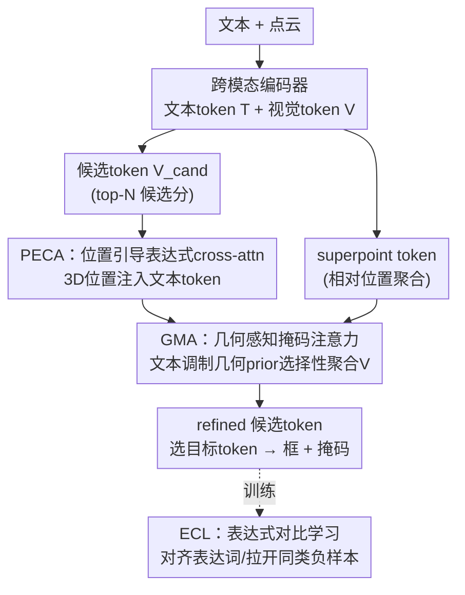

# EG-3DVG: Expression and Geometry Aware Grounding Decoder for 3D Visual Grounding

**会议**: CVPR 2026  
**论文**: [CVF Open Access](https://openaccess.thecvf.com/content/CVPR2026/html/Park_EG-3DVG_Expression_and_Geometry_Aware_Grounding_Decoder_for_3D_Visual_CVPR_2026_paper.html)  
**代码**: https://github.com/Gwan9Wook/EG3DVG  
**领域**: 3D视觉 / 多模态VLM  
**关键词**: 3D视觉定位, 跨模态对齐, 几何感知注意力, 对比学习, 点云  

## 一句话总结
EG-3DVG 在 3D 视觉定位的 grounding decoder 里塞进两个互补的注意力模块——把 3D 位置注进文本 token 的 PECA、按几何关系筛选视觉 token 的 GMA——再配一个区分同类干扰物的表达式对比学习 ECL，针对性修掉"文图错位 / 同类混淆 / 几何推理错误"三类失败，在 ScanRefer 和 SR3D/NR3D 的检测框定位与掩码预测上都刷到 SOTA。

## 研究背景与动机
**领域现状**：3D 视觉定位（3DVG）要在点云场景里根据一句自然语言描述（如"圆桌北边那把弯背多杆的椅子"）定位目标物体，分成预测框的 3DREC 和预测掩码的 3DRES 两个子任务。主流做法是先用 PointNet++ 编码点云、RoBERTa 编码文本，再用 transformer 做跨模态融合，最后一个 decoder 把视觉 token 转成候选框/掩码，靠"文本对齐分"最高的候选当目标。

**现有痛点**：作者把现有方法的失败归成三类（论文 Figure 1）——① **跨模态错位**：文本语义没能通过 cross-attention 可靠地传到视觉特征，定位不准；② **同类混淆**：场景里有多个同类物体（3DVG 里叫 "multiple" 设定，占 ScanRefer 81%）时，模型抓不住细粒度表达线索，定位到错的同类实例；③ **几何推理错误**：聚合空间相关视觉特征时把别的物体或背景点也算进来，几何关系判断错。

**核心矛盾**：前两个问题的根子在 cross-attention——视觉 token 天然带 3D 坐标，文本 token 却没有空间信息，两个模态的空间线索严重不对等，注意力权重自然算不准；第三个问题的根子在于被选为候选的视觉 token 只覆盖了物体的一部分，要补几何信息就得引入全部视觉 token，但全量 attend 又会引入无关物体/背景的噪声。

**本文目标**：在 grounding decoder 这一层，分别给"文图对齐"和"几何聚合"两个环节打补丁，同时用一个专门的损失把同类干扰物拉开。

**核心 idea**：用"位置引导的表达式 cross-attention（PECA）"把 3D 位置注入文本 token 解决错位，用"几何感知掩码注意力（GMA）"按文本调制的几何 prior 选择性聚合视觉 token 解决几何错误，再用"表达式对比学习（ECL）"把目标与同类负样本在表达词层面拉开解决同类混淆。

## 方法详解

### 整体框架
EG-3DVG 输入一句 $N_{text}$ 词的描述和一个 $N_{point}$ 点的场景，输出目标物体的掩码 $m \in \mathbb{R}^{N_{point}}$ 和 3D 框 $b \in \mathbb{R}^6$。整条 pipeline 是：先用**跨模态编码器**把文本/点云编成文本 token $T$ 和视觉 token $V$，每个视觉 token 预测一个候选分、取 top-$N_{cand}$ 当候选 token $V_{cand}$；同时把视觉 token 投到更稀疏的 superpoint 分辨率上、用相对位置 FFN 编码得到 superpoint token $V_{super}$。这些 token 一起送进核心的**表达与几何感知 grounding decoder（EGD）**——它分两支：superpoint 分支用候选 token 和文本 token 来 refine $V_{super}$；候选分支先经 self-attention + PECA 得到 $V^{cand}_{PECA}$，再并行走"与 refined superpoint 做 cross-attention"和"GMA"两路，求和过 FFN 得到 $\tilde{V}_{cand} = \mathrm{FFN}(V^{cand}_{super} + V^{cand}_{GMA})$。最后选文本对齐分最高的候选当目标 token，掩码由 $\hat{m} = \tilde{V}_{super}e$（$e$ 是掩码嵌入）映回点级，框由初始框 $b_{ini}$ 与掩码外接框 $b_{mask}$ 的加权和 $b = \alpha b_{ini} + (1-\alpha)b_{mask}$（$\alpha=0.5$）给出。EGD 重复 6 次，跨模态编码器重复 3 次。训练时 ECL 在 multiple 场景上把目标 token 与表达词对齐、与同类负样本拉开。

### 关键设计

**1. PECA：把 3D 位置注进文本 token，让文图对齐在空间上自洽**

常规 cross-attention 让视觉 token 当 query、文本 token 当 key-value，但视觉 token 通过 PointNet++ 天然携带 3D 坐标、文本 token 完全没有空间线索，两边的空间信息不对等会让注意力权重算偏。PECA 的做法是先把视觉 token 的 3D 坐标 $P \in \mathbb{R}^{N_{vis}\times 3}$ 用 MLP 投成位置嵌入 $E_{pos}$，再按文本-视觉的相似度把位置嵌入"软地"灌进文本 token：

$$T_{pos} = T + \mathrm{Softmax}\left(\frac{T \cdot V^\top}{\sqrt{C}}\right) E_{pos}.$$

然后再做一次 cross-attention：$V_{cand}$ 当 query、带位置的 $T_{pos}$ 当 key、原始 $T$ 当 value，输出 $V^{cand}_{PECA}$。关键巧思在于 key 用带位置版、value 用原始版——位置信息只参与"该 attend 到哪个词"的权重计算（让相似度对空间敏感），而真正被聚合的语义还是干净的文本语义，于是文图融合在空间上变得自洽，文本语义能被可靠地送到对的视觉位置。

**2. GMA：用文本调制的几何 prior 选择性聚合视觉 token，补全目标几何范围**

经 PECA 对齐后的候选 token 语义对了，但只覆盖目标物体的一部分（很多落在框内的视觉 token 没被选为候选），几何范围不全。直接 attend 全部视觉 token $V$ 又会引入别的物体/背景噪声。GMA 先为每个候选 token 与每个视觉 token 算一个几何关系张量 $G(i,j) = (P_i^{cand} - P_j,\ \lVert P_i^{cand} - P_j \rVert_2) \in \mathbb{R}^4$（相对坐标偏移 + 欧氏距离），用 MLP 投成几何特征 $\tilde{G}$；再用文本的全局上下文去调制几何亲和度，得到几何注意力 prior：

$$A_{geo} = \mathrm{Sigmoid}\left(\mathcal{F}^{-1}\big(\mathcal{F}(\tilde{G}) \cdot \mathrm{MaxPool}(T)^\top\big)\right),$$

其中 $\mathrm{MaxPool}(T)$ 把表达相关的文本压成一个全局语言上下文向量，让"几何上该不该聚合"也受语言驱动。接着用直通估计器（STE）配可学习阈值把 $A_{geo}$ 二值化成 $\tilde{A}_{geo} \in \{0,1\}$，作为加性注意力掩码塞进 masked attention：

$$V^{cand}_{GMA} = V^{cand}_{PECA} + \mathrm{Softmax}\left(\frac{V^{cand}_{PECA} V^\top}{\sqrt{C}} + \log(\tilde{A}_{geo})\right) V.$$

$\log(\tilde{A}_{geo})$ 把无关 token 的位置赋成 $-\infty$ 直接屏蔽，于是候选 token 只从"空间相近且文本相关"的视觉 token 里补几何信息，既补全了目标范围又压住了远处/无关的干扰。

**3. ECL：在 multiple 场景里把目标与同类负样本在表达词层面拉开**

同一场景里有多个同类物体时性能掉得最狠（intra-category 混淆），因为模型抓不住区分它们的细粒度表达词（属性、代词、关系词）。ECL 专门在 multiple 场景上构造负样本：从同场景里选指向**同类但不同实例**的其他描述当负文本，过 RoBERTa + 跨模态编码后只保留表达相关词（attribute / pronoun / relationship，用现成语言解析工具切分）得到 $T^-$；正样本 $T^+$ 同样从输入描述里只留表达词。然后用"与真值框 IoU 最高的候选" $\tilde{V}^{cand}_{i_{gt}}$ 当目标的视觉表示，做带权对比损失（温度 $\rho=0.07$，正权 $w^+=1$、负权 $w^-=2$，负样本权重更大以更强地推开同类干扰），让目标 token 贴近自己描述的表达词、远离同类干扰物的表达词。这一步只在训练时作用，直接针对 3DVG 里最难的 multiple 子集。

### 损失函数 / 训练策略
总损失把三个标准项加上自家的对比项：$L = \lambda_{rec}L_{rec} + \lambda_{res}L_{res} + \lambda_{kps}L_{kps} + \lambda_{cont}L_{cont}$，权重分别为 $0.14 / 0.14 / 8 / 0.1$。其中 $L_{rec}$ 是 3DREC 框损失、$L_{res}$ 是 3DRES 掩码损失、$L_{kps}$ 是监督候选分的关键点分数损失、$L_{cont}$ 是 ECL 对比损失。RoBERTa 训练时冻结，PointNet++ 学习率 $1\times10^{-5}$、其余层 $2\times10^{-4}$，AdamW，2 卡 A6000、每卡 batch 8；$N_{vis}=1024$、$N_{cand}=256$、$N_{text}=256$、$C=288$。

## 实验关键数据

### 主实验
ScanRefer 3DREC（single-stage，与上一代 SOTA TSP3D 比）：

| 设定 | 指标 | EG-3DVG | TSP3D | 提升 |
|------|------|---------|-------|------|
| Overall | Acc@0.25 | 57.13 | 56.45 | +0.68 |
| Overall | Acc@0.5 | 50.07 | 46.71 | +3.36 |
| Unique | Acc@0.5 | 83.79 | 71.41 | +12.4 |
| Multiple | Acc@0.5 | 44.16 | 42.37 | +1.79 |

two-stage 设定下 Overall Acc@0.5 达 52.36，比 MCLN 的 45.53 高 +6.83。ScanRefer 3DRES（掩码预测）：

| 方法 | Acc@0.25 | Acc@0.5 | mIoU |
|------|---------|---------|------|
| MCLN | 58.70 | 50.70 | 44.72 |
| RG-SAN | 61.67 | 44.92 | 44.66 |
| **EG-3DVG** | 59.77 | **53.77** | **47.28** |

SR3D/NR3D 上 3DREC（Acc@0.25）SR3D 75.2 / NR3D 59.9 超过 G3-LQ（+2.1 / +1.5）；3DRES（mIoU）SR3D 58.9 / NR3D 48.0 超过 MCLN（+9.1 / +1.9），SR3D 上的掩码增益尤其大。

### 消融实验
三模块组合消融（ScanRefer，最后一行为完整模型）：

| PECA | GMA | ECL | 3DREC Acc@0.25 | 3DREC Acc@0.5 | 3DRES mIoU |
|------|-----|-----|----------------|---------------|------------|
| | | | 57.04 | 49.62 | 44.19 |
| ✓ | | | 57.73 | 50.92 | 45.69 |
| | ✓ | | 57.05 | 50.55 | 46.19 |
| | | ✓ | 57.56 | 50.85 | 45.84 |
| ✓ | ✓ | ✓ | **58.54** | **52.36** | **47.28** |

GMA 注意力掩码生成方式消融（验证"文本调制几何"必要性）：

| 掩码生成 | Acc@0.25 | Acc@0.5 | mIoU |
|---------|---------|---------|------|
| 固定半径（0.75m） | 57.76 | 51.12 | 46.23 |
| 仅几何特征（无文本） | 58.16 | 51.20 | 46.70 |
| GMA（几何+文本） | **58.54** | **52.36** | **47.28** |

### 关键发现
- 三个模块各自加上去都涨点、三个全开最高，说明它们针对的三类失败基本正交、互补。单独看，GMA 对 3DRES mIoU 的贡献最大（单开 +2.0 mIoU），PECA 对 3DREC Acc 的贡献更明显。
- GMA 的掩码必须"几何 + 文本"联合：固定半径只看距离不看语义最差；只用几何特征（去掉文本调制）比固定半径好但仍逊于完整 GMA——证明用 $\mathrm{MaxPool}(T)$ 调制几何亲和度是有效的，能滤掉"空间近但语言无关"的视觉 token。
- 增益在 Unique（单一同类）的高 IoU 档（Acc@0.5 +12.4 over TSP3D）和 SR3D 掩码（+9.1 mIoU over MCLN）上特别突出，说明几何感知聚合显著提升了定位的精细程度。

## 亮点与洞察
- **PECA 的 key/value 拆分很巧**：位置信息只进 key（影响 attend 到哪），不进 value（不污染被聚合的语义），等于让"空间对齐"和"语义聚合"解耦——是个可迁移到任何文图 cross-attention 的小 trick。
- **GMA 把几何关系做成可学习的注意力掩码**，而且让文本来决定几何 prior 的强弱，比"固定半径硬截断"灵活得多；STE + 可学习阈值让二值掩码端到端可训，避免了手调半径。
- **ECL 精准打 3DVG 最痛的 multiple 子集**：只在同类多实例场景构造负样本、只对比表达词、负权加倍，把对比学习用在刀刃上而不是泛泛全场景对齐。
- 三个补丁分别对应 Figure 1 的三类失败，并在 Figure 4 定性图上逐一对上——方法设计与失败分析一一映射，叙事干净。

## 局限与展望
- 框架仍依赖现成语言解析工具切分属性/代词/关系词（ECL 的正负样本构造和文本对齐分都用到），解析错误会直接影响对比学习与目标选择，论文未分析这一依赖的鲁棒性。
- two-stage 增益（Acc@0.5 +6.83）很大程度来自额外接入现成 3D 检测器的候选源，具体扩展放在补充材料，正文不易判断这部分增益里有多少是 EGD 自身贡献 ⚠️ 以原文/补充材料为准。
- EGD 重复 6 次 + GMA 要为每个候选 token 对全部视觉 token 算 $N_{cand}\times N_{vis}\times 4$ 的几何张量，计算/显存开销没给出与轻量方法（如 TSP3D 主打实时）的效率对比，实际部署成本未知。
- $\alpha=0.5$、$w^-=2$、各损失权重等超参直接给定值、未做敏感性分析，跨数据集是否需要重调不清楚。

## 相关工作与启发
- **vs MCLN**：MCLN 也是多分支联合做 3D 定位 + 掩码预测，但用标准 cross-attention 做文图融合、不显式建模几何；EG-3DVG 在 decoder 里换上 PECA（位置注入）+ GMA（几何掩码）+ ECL，3DRES mIoU 比 MCLN 高 2.56、two-stage Acc@0.5 高 6.83。
- **vs TSP3D**：TSP3D 走文本引导的稀疏体素剪枝主打实时轻量；EG-3DVG 不追求实时、而是把精度堆到更高（single-stage Acc@0.5 +3.36），两者是效率 vs 精度的不同取向。
- **vs G3-LQ**：G3-LQ 是上一代 3DREC 强基线；EG-3DVG 在 SR3D/NR3D 的 Acc@0.25 上分别 +2.1 / +1.5，且额外把 3DRES 掩码也做到 SOTA，是统一框选+掩码的更全面方案。

## 评分
- 新颖性: ⭐⭐⭐⭐ PECA 的位置注入与 GMA 的文本调制几何掩码是有针对性的新机制，但整体仍是 cross-attention 框架内的模块改进。
- 实验充分度: ⭐⭐⭐⭐⭐ 覆盖 ScanRefer 与 SR3D/NR3D、3DREC + 3DRES 双任务，三模块消融 + GMA 掩码生成消融齐全。
- 写作质量: ⭐⭐⭐⭐ 三类失败→三个模块的映射叙事清晰，公式完整；但部分增益来源（two-stage 扩展）与效率开销交代不足。
- 价值: ⭐⭐⭐⭐ 在两个标准 benchmark 双任务上稳定 SOTA，PECA 的 key/value 拆分等 trick 可迁移到其他文图定位任务。

<!-- RELATED:START -->

## 相关论文

- [\[CVPR 2026\] HAMMER: Harnessing MLLM via Cross-Modal Integration for Intention-Driven 3D Affordance Grounding](hammer_harnessing_mllm_via_cross-modal_integration_for_intention-driven_3d_affor.md)
- [\[CVPR 2026\] Visual Grounding for Object Questions](visual_grounding_for_object_questions.md)
- [\[CVPR 2026\] VGent: Visual Grounding via Modular Design for Disentangling Reasoning and Prediction](vgent_visual_grounding_via_modular_design_for_disentangling_reasoning_and_predic.md)
- [\[ICCV 2025\] ViewSRD: 3D Visual Grounding via Structured Multi-View Decomposition](../../ICCV2025/multimodal_vlm/viewsrd_3d_visual_grounding_via_structured_multi-view_decomposition.md)
- [\[CVPR 2026\] Phrase-Grounding-Aware Supervised Fine-Tuning for Chart Recognition via Side-Masked Attention](phrase-grounding-aware_supervised_fine-tuning_for_chart_recognition_via_side-mas.md)

<!-- RELATED:END -->
