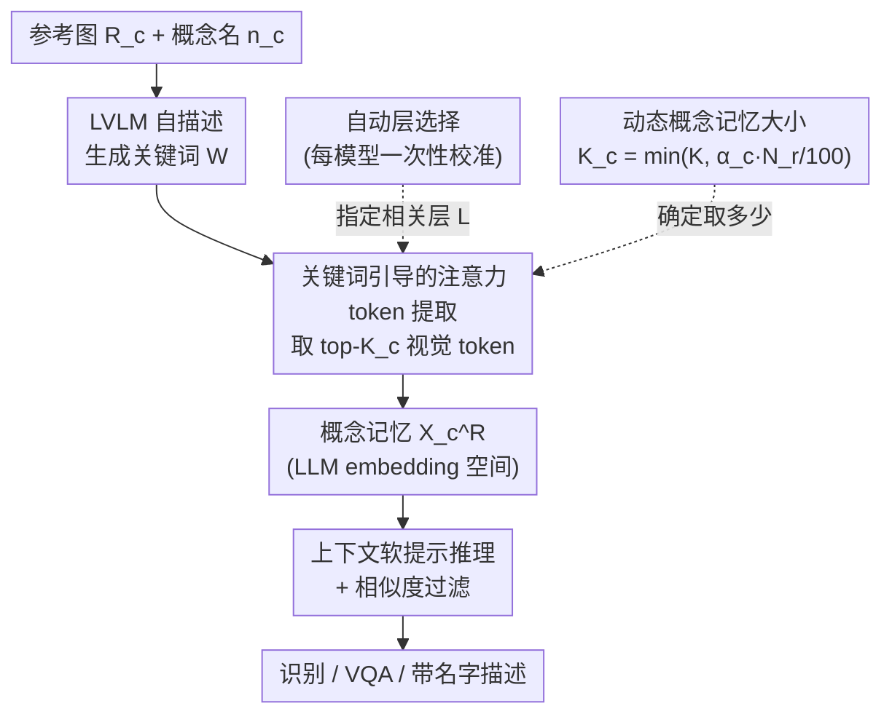

# Ego: Embedding-Guided Personalization of Vision-Language Models

**会议**: CVPR 2026  
**论文**: [CVF Open Access](https://openaccess.thecvf.com/content/CVPR2026/html/Seifi_Ego_Embedding-Guided_Personalization_of_Vision-Language_Models_CVPR_2026_paper.html)  
**代码**: 无（作者称实现将公开，暂未给出链接）  
**领域**: 多模态VLM  
**关键词**: VLM个性化, 免训练, 视觉token选择, 跨模态注意力, 概念记忆  

## 一句话总结
Ego 直接从 LVLM 自身的跨模态注意力里挑出最能代表某个个性化概念（如"我的杯子""我的狗"）的少量视觉 token，把它们当作"概念记忆"在推理时以软提示注入上下文，从而做到完全免训练、不依赖外部视觉模块，并在单概念/多概念/视频三种个性化场景下都取得 SOTA。

## 研究背景与动机
**领域现状**：LVLM 个性化要让一个通用模型认得用户自己的特定实体（某个人、某只宠物、某件物品），并据此做识别、问答、加上专有名字的描述。当前主流做法分三类：(1) 为每个概念做测试时微调（MyVLM、Yo'LLaVA）；(2) 在大规模合成对话数据上训练专门的个性化模型（PVIT、RAP）；(3) 免训练但接外部视觉模块（R2P 用检索、PeKit 用 DINOv2 记忆库 + 分割网络）。

**现有痛点**：每条路线都有硬伤。测试时微调每来一个新概念就要训一遍，根本无法扩展到边端设备；训练型方法即便训完，推理时仍要把参考图重新喂进视觉编码器，带来上下文长度瓶颈和算力开销，而且会偏向构造数据、在多概念场景崩盘；免训练型方法又被外部模块和 top-k 检索拖累，复杂且推理慢。

**核心矛盾**：个性化所需的"对特定主体的判别性表示"其实**已经存在于强 LVLM 内部**——这些模型本就能跨图、跨视频帧把同一个物体对应起来，说明它内部给每个物体分配了判别性 embedding。可现有方法要么靠额外训练去"教"模型，要么靠外部编码器另算一套表示，没人去**直接取用模型自己已有的内部表示**。

**本文目标**：在不训练、不改架构、不接外部模块、且推理开销逼近纯文本提示的前提下，支持单概念、多概念、视频三种个性化。

**核心 idea**：用关键词到视觉 token 的跨模态注意力，定位最能代表概念的少量视觉 token，把它们聚合成"概念记忆"，推理时作为软提示注入——让模型用自己的内部 embedding 来记住和召回个性化概念。

## 方法详解

### 整体框架
Ego 分两个阶段。**概念引入阶段**：给定某概念 $c$ 的一张或几张参考图 $\{R_c\}$ 和名字 $n_c$，先让 LVLM 自己描述这个主体、吐出几个关键描述词 $W$；然后分析这些关键词 token 对视觉 token 的跨模态注意力，挑出注意力最高的 $K_c$ 个视觉 token，拼成该概念的视觉记忆 $X_c^R$。这个记忆直接活在 LLM 的 embedding 空间里，不需要原始像素。**推理阶段**：把所有概念的记忆 $\{X_c^R, n_c\}$ 作为软提示放进上下文，让模型判断测试图里有没有这些概念并据此作答；当概念太多撑爆上下文时，再按测试图与各概念记忆的相似度做一次过滤。

其中两个支撑设计让它真正能用：用 LVLM 估计主体占图面积来**动态决定每个概念取多少 token**（小物件少取、大主体多取），以及用一个一次性校准过程**自动选出对视觉理解最敏感的若干层**来算注意力。

### 关键设计

**1. 关键词引导的注意力 token 提取：让模型自己指认哪些 patch 最代表这个概念**

参考图被视觉编码器映射成 $N_r$ 个视觉 token $X_R \in \mathbb{R}^{N_r \times D}$，里面既有主体也有大量背景。痛点是：直接把整张参考图喂进上下文既贵又会被背景干扰（这正是 RAP、R2P 的常见失败模式）。Ego 的做法是只保留 $K_c \ll N_r$ 个真正代表主体的 token。它先让 LVLM 描述主体、产出关键词 $W$（公式 $T = \mathrm{LLM}(X_R, I)$，再过滤标点保留关键词），然后假设：与描述词最相关的视觉 token，会从关键词 token 那里收到最高的跨模态注意力。于是在第 $l$ 层、第 $h$ 个头取出关键词→视觉 token 的跨注意力子矩阵 $A_{wr}^{l,h} \in \mathbb{R}^{N_w \times N_r}$，对每个视觉 token $j$ 算重要度分数：

$$I_j = \frac{1}{|L|}\sum_{l\in L}\frac{1}{H}\sum_{h=1}^{H}\left(\frac{1}{N_w}\sum_{n=1}^{N_w} A_{wr}^{l,h}[n,j]\right)$$

即在选定层集 $L$、所有头、所有关键词上聚合（⚠️ 正文文字说"对头/层取 max"，但公式 3 写的是求平均，以原文公式为准）。按 $I_j$ 排序取前 $K_c$ 个 token，再恢复原始空间顺序得到 $X_c^R = X_R[P_{ordered}, :]$。多张参考图就各自取 top tokens 再拼接。这一步的关键价值在于：判别性信号完全来自模型自身的注意力，不需要任何外部检测/分割网络，也不需要训练。

**2. 动态概念记忆大小：按主体占图面积自适应决定取几个 token**

固定取 $K$ 个 token 不合理——一只鞋只占图里一小块，多取的全是背景噪声；一个高分辨率人像主体很大，取太少又丢细节。Ego 复用 LVLM 自己的能力：直接问模型"主体占整张图百分之多少"得到 $\alpha_c$，再令

$$K_c = \min\!\left(K,\ \frac{\alpha_c \times N_r}{100}\right)$$

其中 $K \ll N_r$ 是每张参考图允许的 token 上限，用来保证推理效率、只留主体关键属性。这样小物件自动少取、大主体自动多取，既压住了上下文长度，又让记忆更聚焦。

**3. 自动层选择：一次性校准出对视觉主体最敏感的层**

LVLM 不同层抽象程度不同，视觉 token 与文本的交互在中后层最强，但具体哪些层"管视觉"在每个模型里都不一样，没有现成办法确定。Ego 设计了一个一次性自动校准：从 COCO 2017 训练集采一批"单类单实例"图，用 GT 分割掩码标出哪些视觉 token 属于该物体；让 LVLM 描述前景主体，对每一层计算"按重要度分数排出的 top-K patch"与分割掩码的重叠度，按平均重叠度给层排序，取 top $L$ 层。这个校准每个 LVLM 只做一次，之后所有概念都复用同一组层来算公式 3 的注意力。它把"该用哪几层"从靠经验调参变成了有 ground-truth 监督的自动决策。

**4. 上下文软提示推理 + 相似度过滤：用 in-context 记忆替代重处理参考图**

推理时 Ego 把每个概念的记忆 $\{X_c^R, n_c\}$ 当作软提示注入 LLM 上下文，让它检查测试图里是否出现这些概念并作答。因为记忆已经存在 LLM 的 embedding 空间里，**不需要在测试时再用视觉编码器重新处理参考图**，开销接近纯文本提示——这正是相对训练型/外部模块方法的效率优势来源。当概念数量超过上下文上限时，按测试图（同样在 LLM embedding 空间）与各概念记忆的相似度先过滤掉不相关概念。整套机制靠现代 LVLM 的 in-context learning 能力撑起来，单概念、多概念、视频三种场景用同一套流程，无需任何额外训练或对齐。

## 实验关键数据
主干模型用 InternVL3-14B（部分用 Qwen2.5-VL-7B），统一了数据集、骨干、预处理与评测协议，复现了所有 baseline。任务覆盖识别、VQA、带名字描述（captioning recall）。

### 主实验

识别任务（F1，InternVL3，1 参考图；引入概念耗时 Training Time）：

| 方法 | 类型 | 引入耗时↓ | 单概念 F1↑ | 多概念 F1↑ |
|------|------|-----------|-----------|-----------|
| RAP | 训练型(24h, 210k样本) | 24 小时 | 77.0 | 95.1 |
| R2P | 免训练(外部模块) | 5.98s | 68.5 | 不支持 |
| **Ego** | 免训练 | **1.40s** | **90.2** | **98.4** |

VQA 准确率 / Captioning Recall（1 参考图，InternVL3）：

| 方法 | 单概念VQA(Yo'LLaVA) | 单概念Caption(MyVLM) | 多概念VQA | 多概念Caption | 视频VQA |
|------|------|------|------|------|------|
| RAP | 97.6 | 90.0 | 53.7 | 43.6 | 不支持 |
| R2P | 94.0 | 82.0 | – | – | – |
| PeKit | 94.6 | 92.0 | 51.8 | 35.2 | 59.9 |
| **Ego** | 92.3 | 88.0 | **72.2** | **70.9** | **70.0** |

单概念 VQA 上 Ego 略逊于带 VQA 监督训练的 RAP，但在多概念上反超 RAP 近 20 个点，且 Captioning Recall 在多概念 This-is-my 上比 RAP 高近 30 个点、视频 VQA 上比 PeKit 的 pipeline 高约 10 个点——这两个"需要先从所有概念里选对再作答"的难任务最能体现 Ego 的优势。

### 消融实验
识别任务 F1，InternVL3 + Yo'LLaVA，固定相同的 in-context token 预算（20%）：

| 配置 | 视觉token占比 | 注入关键词 | F1↑ | 说明 |
|------|------|------|------|------|
| Keywords Only | 0% | 是 | 71.3 | 只给描述词，判别力明显不足 |
| Full Visual | 100% | 否 | 84.1 | 整张参考图全部 token |
| Full Visual + Keywords | 100% | 是 | 82.5 | 加关键词反而掉，成了干扰 |
| Uniform | 20% | 否 | 77.7 | 均匀采样 20% token |
| Ego (1-view) | 20% | 否 | 80.4 | 注意力选 token |
| **Ego (5-view)** | 20% | 否 | **85.7** | 多视图，反超 Full Visual +1.7 |

### 关键发现
- **视觉记忆 > 文字记忆**：只用关键词 (71.3) 远不如用视觉 token，说明判别力主要在视觉 token 里，文字描述甚至会干扰（Full Visual+Keywords 82.5 < Full Visual 84.1）。
- **注意力选 token 优于均匀选**：同样 20% 预算，Ego 1-view (80.4) 明显高于 Uniform (77.7)，证明注意力确实定位到了关键 patch；5-view (85.7) 还能在相同 token 数下反超用全部 token 的 Full Visual，说明"少而精"的选择策略有效。
- **效率与规模**：引入概念仅 1.4s（RAP 要 24 小时、PeKit 21.3s），且换成更小的 Qwen2.5-VL-7B 仍有竞争力。
- **失败模式对照**：RAP 因 top-k 检索（k=3）和微调偏置在多概念崩盘、倾向过预测拉低精度；PeKit 用单一固定相似度阈值，对不同概念松紧不一致导致召回低。

## 亮点与洞察
- **"模型自己已经知道，只是没被取出来"**：核心洞察是强 LVLM 内部本就有判别性物体 embedding，个性化不必外训或外接编码器，只需从注意力里把它读出来——这把个性化从"加东西"变成"取东西"，非常优雅。
- **用 LLM 估面积来定 token 预算**：让模型自报主体占图比例 $\alpha_c$ 来决定 $K_c$，是把 LVLM 当作可查询的"软标注器"的巧妙复用，避免了再训一个尺寸预测器。
- **层选择用分割掩码做代理监督**：把"哪几层管视觉"用 COCO 掩码重叠度量化成一次性校准，可直接迁移到任何新 LVLM 上确定有效层，这个思路对其他"需要选层"的探针类工作都有借鉴价值。
- **记忆存在 embedding 空间**：把概念记忆存成 LLM token 而非像素，推理时省掉视觉编码器重处理参考图，是它推理开销逼近纯文本提示的根本原因。

## 局限与展望
- 作者承认 Ego 强依赖 LVLM 本身的视觉理解能力，在老旧/弱模型上可能失效；且对 LVLM 全依赖意味着指令 prompt 需要按具体模型定制。
- 自己看到的局限：注意力即"重要性"是个假设，关键词质量直接决定选出的 token 好坏，若模型描述跑偏则记忆会带噪；动态 $K_c$ 依赖模型自估面积 $\alpha_c$，这一步本身没有 ground-truth 校验。
- 多概念过滤用相似度阈值/上下文裁剪，概念规模继续扩大时（远超上下文）的可扩展性仍待验证。
- 改进思路：把"注意力重要性"换成可学习/可校准的 token 重要性度量，或对关键词生成做自洽性检验以降低记忆噪声。

## 相关工作与启发
- **vs MyVLM / Yo'LLaVA（测试时微调）**：它们每个概念都要训分类头或前缀 token，Ego 完全免训练、引入概念只需 1.4s，且原生支持多概念与视频，而前两者基本不处理这些场景。
- **vs RAP / PVIT（训练型）**：RAP 在 21 万样本上 LoRA 微调、推理还要 top-k 检索 + 重处理参考图，多概念下崩；Ego 不训练、记忆存 embedding 空间，多概念 VQA 反超 RAP 近 20 点。
- **vs R2P / PeKit（免训练但接外部模块）**：R2P 靠外部视觉模型 + top-k 检索、PeKit 靠 DINOv2 记忆库 + 分割网络，都引入外部依赖和测试时开销；Ego 只用 LVLM 自身注意力，无外部模块，多概念与视频上全面领先。

## 评分
- 新颖性: ⭐⭐⭐⭐⭐ "从模型内部注意力取判别性视觉 token 当概念记忆"是真正换了个角度，把个性化做成免训练免外部模块。
- 实验充分度: ⭐⭐⭐⭐ 统一了割裂的评测协议、覆盖三任务三场景两骨干，消融到位；但部分关键分析（层选择、动态尺寸对比）放在附录。
- 写作质量: ⭐⭐⭐⭐ 动机和方法叙述清晰，公式完整；注意力聚合"max vs 平均"正文与公式略有出入。
- 价值: ⭐⭐⭐⭐⭐ 免训练、低开销、模型无关且统一支持多场景，对边端个性化助手很实用，统一评测协议也利于后续研究。

<!-- RELATED:START -->

## 相关论文

- [\[ICML 2026\] Contextualized Visual Personalization in Vision-Language Models](../../ICML2026/multimodal_vlm/contextualized_visual_personalization_in_vision-language_models.md)
- [\[CVPR 2026\] Language-guided Frequency Modulation for Large Vision-Language Models](language-guided_frequency_modulation_for_large_vision-language_models.md)
- [\[CVPR 2026\] Diffusion Guided Chain-of-Vision for Large Autoregressive Vision Models](diffusion_guided_chain-of-vision_for_large_autoregressive_vision_models.md)
- [\[ICLR 2026\] Directional Embedding Smoothing for Robust Vision Language Models](../../ICLR2026/multimodal_vlm/directional_embedding_smoothing_for_robust_vision_language_models.md)
- [\[CVPR 2026\] Foundation Encoders Are All You Need for Preference-Aware Personalization](foundation_encoders_are_all_you_need_for_preference-aware_personalization.md)

<!-- RELATED:END -->
