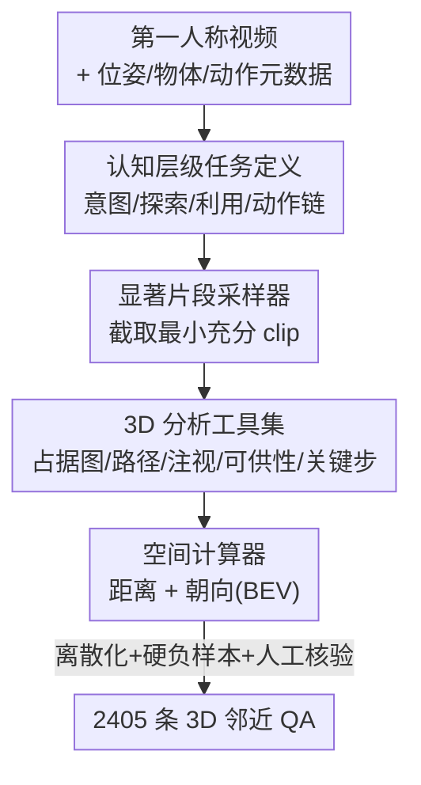

# EgoProx: Evaluating MLLMs on Egocentric 3D Proximity Reasoning Across a Cognitive Hierarchy

**会议**: CVPR 2026  
**arXiv**: [2605.24456](https://arxiv.org/abs/2605.24456)  
**代码**: https://lijinzhao30.github.io/Egoprox/ (项目主页)  
**领域**: 多模态VLM / 第一人称视频 / 空间智能 / Benchmark  
**关键词**: 第一人称视角, 3D邻近推理, 认知层级, Agent数据引擎, 空间VQA

## 一句话总结
EgoProx 是第一个评测多模态大模型（MLLM）能否从第一人称视角做"身体—物体"3D 邻近推理的基准：它把任务按人类认知层级组织成 Intention / Exploration / Exploitation / Chain-of-Actions 四类，用一个以 Gemini-2.5-Pro 为大脑、编排多种 3D 工具的 agent 数据引擎自动生成 2405 条高质量 QA，结果显示即便 GPT-5、Gemini-2.5-Pro 也远低于人类水平，但少量指令微调就能大幅解锁模型预训练里"沉睡"的空间知识。

## 研究背景与动机
**领域现状**：人在日常生活中无时无刻不在推断"3D 邻近关系"——身体和周围物体的相对位置，由此驱动注视、转头、移动、抓取等一连串动作。这条"感知—动作"耦合链是连接视觉与行为的核心机制。MLLM 这两年进展飞快，但能否模拟这种以自我为中心的具身空间推理，一直没有答案。

**现有痛点**：现有空间推理基准（ScanQA、VSI-Bench、OST-Bench 等）大多基于 3D 扫描或人工挑选的图像序列，是"以物体/场景为中心"的几何推理，忽略了"以用户为中心"在日常活动中理解 3D 邻近的能力；而已有的第一人称 VQA 基准（EgoSchema、EgoPlan、EgoThink 等）又主要测因果、规划、记忆，几乎不涉及 3D 邻近推理。换句话说，"第一人称 + 3D 邻近 + 感知动作耦合"这个交集是空白的。

**核心矛盾**：要建这样一个基准，难点在数据构造。以往 VQA 基准靠"MLLM 生成 + 人工修正"，但现有模型本身就缺空间智能，根本生不出高质量的空间 QA；而且四类任务需要的推理能力各不相同，单个基础模型撑不起来。

**本文目标**：(1) 定义一套覆盖"意图→探索→利用→动作链"的第一人称 3D 邻近推理任务；(2) 造一个能自动、可控、规模化产出高质量 QA 的数据引擎；(3) 用它系统评测主流 MLLM，并回答"模型到底是没有空间知识，还是有但用不出来"。

**切入角度**：作者借用机器学习里"探索—利用"的权衡做类比——人类的第一人称视觉流天然把探索和利用统一在一条感知流里，而意图是驱动具身行为的源头。于是把 3D 邻近推理沿"认知层级"拆解，并用 agent 编排专用 3D 工具来绕开"模型自己生不出好数据"的死循环。

**核心 idea**：用"认知层级 + agent 工具编排"造出第一个第一人称 3D 邻近推理基准，并通过跨任务/跨数据集指令微调证明 MLLM 的空间知识是"沉睡"而非"缺失"。

## 方法详解

### 整体框架
EgoProx 有两条主线：一条是**任务定义**（把 3D 邻近推理沿认知层级组织成四类 VQA），另一条是**数据引擎**（把长视频自动转成带 3D ground truth 的 QA）。数据侧的流水线是典型的多工具串行：给定一段第一人称视频及其元数据（相机位姿、物体框、动作标签）和一个任务类别，agent 以 Gemini-2.5-Pro 为大脑，先用"显著片段采样器"从长视频里截出最有信息量的 clip，再从"3D 分析工具集"里挑合适的工具算出物体位置、注视目标、占据地图、动作链等空间线索，最后交给"空间计算器"换算成 3D 距离/朝向/邻近关系，得到结构化的 3D 邻近 ground truth，经后处理（离散化 + 硬负样本 + 人工核验）打包成最终 QA。

### 关键设计

**1. 认知层级任务定义：用人类认知链而非推理类型来组织 3D 邻近推理**

现有基准普遍按"grounding / forecasting / planning"这类推理类型切任务，但第一人称视频里意图感知和动作执行是耦合的，按推理类型切会割裂这种耦合。EgoProx 改用人类认知层级来组织四类任务：**Intention**（意图）预测即时的转头/注视方向 $\hat{m}$；**Exploration**（探索）预测朝目标 $G$ 的导航步 $\hat{s}$；**Exploitation**（利用）预测下一步人—物交互 $\hat{h}$ 怎么在 3D 空间发生；**Chain-of-Actions**（动作链）预测一串未来动作 $\{a_1,\dots,a_K\}$ 及相邻动作位置的相对空间关系 $\{e_i\}$。形式上输入是视频段 $\mathcal{X}=\{x_1,\dots,x_T\}$（$x_T$ 为当前帧），模型 $f_\theta$ 要从候选集 $\mathcal{C}$ 里选出正确答案 $\mathcal{A}$。这套层级不是随意排的——意图驱动探索和利用，动作链是更高阶的连续行为，和后面"意图微调收益最大"的实验互相印证，让基准的结构本身带上了人类认知的先验。

**2. 双重邻近度量：区分近似变换与相对关系两种空间表征**

光说"邻近"太含糊，作者把答案和干扰项的设计建立在两类可量化的邻近度量上。**近似邻近（Approximate proximity）**编码最后可观测时刻 $T$ 所需的粗粒度度量变换，用角度旋转和平移位移参数化，对应"该转多少度、走多远"。**相对邻近（Relative proximity）**描述时刻 $T$ 参考实体与目标实体之间的离散空间关系，用 left–right / front–back / near–far 这类空间谓词刻画方向拓扑，而非绝对距离。这种二分既贴合人类"既能估个大概距离、也能说清谁在谁左边"的自然感知方式，又让每道题有明确可验证的 ground truth；动作链任务因为难度高，只评相对邻近。

**3. 显著片段采样器：按任务功能截出"最小但充分"的可答片段**

EgoExo4D 这类数据集只有粗时间标注，但每道题必须能从最后可观测帧 $x_T$ 答出来，时间对齐不准就会出现"答案根本不在画面里"的废题。采样器把所有任务归成两类功能来统一处理：**预测类**（意图里的注视预测、利用里的下一步交互）由未来的监督事件定义——检测到稳定注视或人物交互发生的时刻，取该事件之前的片段，让 $\{x_1,\dots,x_T\}$ 隐式编码即将发生行为的预备线索；**规划类**（转头推理、探索、动作链）需要片段提供达成目标 $G$ 的部分但充分证据——对探索和转头，强制 $G$ 在某个早期帧 $x_t$ 可见但在 $x_T$ 不可见（靠视场可见性检查判定），对动作链则定位关键步密集区、从早段提炼高层目标、并保证 $x_T$ 之后还留有若干未来步使多步计划可推。这个任务驱动的采样保证了每个片段都恰好含有该类推理所需的最小线索，是整个数据引擎质量的第一道闸门。

**4. 3D 分析工具集 + agent 编排：用专用几何工具补上 MLLM 算不准 3D 的短板**

MLLM 自己估不准 3D 距离和朝向，作者干脆把这部分外包给一组确定性几何工具，由 agent 按任务类别调度组合。工具集包括：**占据图生成器**（从 3D bbox 建占据图做避障）、**探索路径生成器**（在占据图上用 8 连通 A\* 从查询位置搜到目标位置，注意不用真实相机轨迹，因为人的运动太随机、模型难以解读）、**空间计算器**（含距离计算器把相机和物体投到统一世界坐标算平移距离，方向计算器算相机前向与"相机→目标"向量在鸟瞰图 BEV 上的夹角）、**注视解析器**（把 2D 眼动转成 3D 注视射线定位被注视物体）、**可供性检测器**、**关键步提取器**和**链构造器**（先算步间方向作为基本正确链，再用 LLM 补出多条可能正确链）。四类任务各有专属的工具调用流程——例如探索任务走"采样可见目标 → 占据图 → A\* 路径"，动作链任务走"提关键步 → LLM 枚举所有合法有序组合 → 链构造器算空间关系生成完整答案集"。正是这种"几何工具保证精度 + LLM 保证多样性 + agent 保证按需编排"的分工，让基准能在没有 3D 标注短板的前提下规模化产出，也是论文标题里 agent-based data engine 的实质

> ⚠️ **框架↔关键设计一致**：框架图里"认知层级任务定义→显著片段采样器→3D 分析工具集→空间计算器"四个贡献节点分别对应设计 1、3、4（空间计算器是 4 里的工具之一）；设计 2 的双重邻近度量贯穿任务定义与后处理，不是独立流水线节点，故未单列为图节点。

### 一个完整示例
以 **Exploration（探索）** 任务为例走一遍：输入一段厨房第一人称视频，目标 $G$ = 冰箱，且冰箱在早期某帧出现过、但在当前帧 $x_T$ 已移出视野。① 采样器做视场可见性检查，确认"目标曾可见、现不可见"，截出符合规划类要求的 clip；② agent 调占据图生成器，从场景里的 3D bbox 建出"哪里能走、哪里被挡"的占据图；③ 调探索路径生成器，在占据图上用 8 连通 A\* 从当前位置搜到冰箱位置，得到一串导航步 $\hat{s}$，每步带"走多远 + 离散方向"；④ 空间计算器把方向投到 BEV 算夹角、算平移距离；⑤ 后处理把距离离散成人类可读区间、方向离散成 8 个朝向，并让 VLM 生成"接近但不靠肉眼难辨细节"的硬负样本，人工核验后成题。模型要做的就是看完前面的探索片段，选出"下一步该往哪个方向走多远"。

## 实验关键数据

### 主实验：主流 MLLM 在 EgoProx 上的表现（准确率 %，随机基线 20%）
评测覆盖 GPT-5、Gemini-2.5-Pro 两个闭源模型与 LLaVA-NeXT-Video、MiniCPM-V、InternVL、Qwen2.5/3-VL 系列开源模型，统一 prompt + zero-shot CoT。下表摘取代表性结果（Approx./Relative 为两种邻近度量，动作链含 Act-Acc / Rel-Acc-S / Rel-Acc-L）：

| 模型 | Intention(Approx./Rel.) | Exploration(Approx./Rel.) | Exploitation(Approx./Rel.) | CoA(Act-Acc) |
|------|------|------|------|------|
| **Human Level** | 62.50 / 75.33 | 60.00 / 63.15 | 82.02 / 85.25 | 80.23 |
| Gemini-2.5-Pro | **42.75** / 37.13 | 36.90 / 29.32 | **50.24** / **45.17** | **25.14** |
| GPT-5 | 33.16 / **40.35** | **41.18** / **34.55** | 46.45 / **45.17** | 21.74 |
| Qwen3-VL-235B | 34.46 / 33.33 | 28.34 / 27.75 | 45.97 / 42.28 | 10.87 |
| Qwen2.5-VL-72B | 30.83 / 35.38 | 29.41 / 24.08 | 46.21 / 40.26 | 13.04 |
| Qwen2.5-VL-7B | 33.68 / 29.24 | 27.27 / 20.42 | 38.63 / 34.34 | 5.98 |
| LLaVA-NeXT-Video-7B | 23.06 / 27.19 | 18.72 / 23.56 | 31.04 / 29.29 | 1.09 |

关键观察：① 即便最强的 GPT-5 / Gemini-2.5-Pro 也全面低于人类（人类 Intention Relative 75.33 vs Gemini 37.13），尤其在 **Chain-of-Actions** 上断崖式下跌（人类 Act-Acc 80.23，最好的 Gemini 仅 25.14），说明长程多步空间推理是最大短板；② 闭源略胜开源，尤其在探索任务上，可能得益于含长视频导航的大规模预训练语料；③ 与一般 VQA 不同，**扩大模型规模收益很有限**（Qwen2.5-VL 从 7B→72B 在多数子任务几乎不涨），与近期 3D 空间理解基准的发现一致。

### 跨任务指令微调（Table 3，LoRA 微调 Qwen2.5-VL-7B，800 样本/任务）
用一类任务的数据微调，评测所有任务，验证"空间知识沉睡"假设：

| 配置 | Intention(Approx.) | Exploration(Approx.) | Exploitation(Approx.) |
|------|------|------|------|
| Qwen2.5-VL-7B（基线） | 33.68 | 27.27 | 38.63 |
| + Intention Tuning | — | **32.09** | **64.93** |
| + Exploration Tuning | 45.34 | — | 45.26 |
| + Exploitation Tuning | **56.48** | 27.27 | — |

只用单一任务的少量数据微调，**其他任务也跟着涨**（如 Intention 微调让 Exploitation Approx. 从 38.63→64.93），且**意图数据带来的跨任务增益明显大于探索/利用数据**——正好印证"意图是驱动定位与动作的根本信号"这一认知层级假设。

### 跨数据集指令微调（Table 4）
在一个数据集上微调，能提升另一个数据集上的邻近推理：

| 配置 | ADT-Intention | ADT-Exploitation | EgoExo4D-Intention | EgoExo4D-Exploitation |
|------|------|------|------|------|
| Qwen2.5-VL-7B | 35.94 | 47.64 | 26.74 | 32.52 |
| EgoExo4D Only Tuning | 48.70 | 64.57 | — | — |
| ADT Only Tuning | — | — | 50.58 | 43.67 |

尽管 ADT 与 EgoExo4D 录制域差异巨大，跨数据集微调仍带来显著提升（如 ADT 微调让 EgoExo4D-Intention 从 26.74→50.58）。

### 关键发现
- **能力是"沉睡"不是"缺失"**：视觉编码器冻结、训练数据规模小（不太可能注入新知识）的情况下，少量指令微调就大幅提升，说明瓶颈在"如何调用已编码的空间知识"，而非知识本身缺失。
- **认知层级有真实结构**：意图微调的跨任务收益最大，且意图/利用微调反而略降动作链表现（缺多步信号），探索微调因含动作位置监督反能提升动作链——三者关系和认知层级假设自洽。
- **规模不是解药**：堆模型参数在 3D 邻近推理上几乎不涨，与 grounding/forecasting 类一般 VQA 的 scaling 规律截然不同。

## 亮点与洞察
- **用 agent 编排几何工具绕开"模型生不出好数据"的死循环**：把 MLLM 算不准的 3D 部分外包给 A\*、BEV 夹角、注视射线等确定性工具，MLLM 只负责语义与多样性，这种分工是 benchmark 数据规模化的关键 trick，可迁移到任何"需要精确几何 GT 但基础模型不可靠"的数据构造场景。
- **"认知层级"作为基准组织原则**而非推理类型，让基准结构本身带上人类先验，并能被实验（意图微调增益最大）反向验证——基准设计和科学假设互相呼应，比单纯堆任务更有解释力。
- **最让人"啊哈"的是跨任务/跨数据集的正迁移**：用意图数据微调能提升利用任务、用 ADT 微调能提升 EgoExo4D，证明空间知识在模型里是共享而非各自孤立的，给"如何高效解锁空间智能"指了一条数据高效的路。

## 局限与展望
- **数据源受限于两个数据集**：EgoExo4D 缺 3D 物体标注、ADT 缺语义动作标签，两者互补但都各有缺口（如 EgoExo4D 无探索类问题），导致某些跨数据集迁移（ADT-Exploration）增益偏小。
- **agent 大脑依赖 Gemini-2.5-Pro**：数据生成质量与该闭源模型的能力绑定，复现成本和可控性受限；论文也承认所有 QA 流水线都需人工核验把关。
- **规模相对小（2405 条）**：相比 EgoDynamics4D 的 927K，EgoProx 更偏"高质量小样本"，统计上某些子任务（如动作链 Rel-Acc-S）数字波动可能较大。
- **改进思路**：引入更多带 3D 标注的第一人称数据源、用开源模型替代 Gemini 做 agent 大脑、把"认知层级 + 工具编排"扩展到带触觉/语音的多模态具身场景。

## 相关工作与启发
- **vs 物体/场景中心的 3D VQA（ScanQA、VSI-Bench、OST-Bench）**: 它们基于 3D 扫描或人工序列做几何 grounding，本文做"以用户为中心、日常活动中的 3D 邻近"，第一次把感知—动作耦合纳入评测。
- **vs 第一人称 VQA 基准（EgoSchema、EgoPlan、EgoThink、EgoDynamics4D）**: 它们测因果/规划/记忆/物体 grounding，本文是首个专门评测日常活动中 3D 邻近认知推理的基准，且用 agent 而非 MLLM/人工生成数据。
- **vs 显式 3D 表征增强方法（SpatialVLM、Spatial-MLLM）**: 它们把点云/多视图/VGGT 特征喂给 MLLM 来补 3D，本文刻意**不**用显式 3D 辅助模态，对齐"人能从纯 2D 视觉自然推断 3D 邻近"的观察，评测的是模型从 2D 视频本身做空间推理的能力。

## 评分
- 新颖性: ⭐⭐⭐⭐⭐ 首个第一人称 3D 邻近推理基准 + 认知层级组织 + agent 工具编排数据引擎，三点都新。
- 实验充分度: ⭐⭐⭐⭐ 覆盖闭源/开源多尺度模型 + 跨任务/跨数据集微调，证据链完整；唯数据规模与单一 agent 大脑略有遗憾。
- 写作质量: ⭐⭐⭐⭐ 任务定义形式化清晰、认知层级动机贯穿全文；工具集细节稍密。
- 价值: ⭐⭐⭐⭐⭐ 给"具身空间智能"提供了第一个可量化抓手，并实证"知识沉睡"结论，对 AR/智能眼镜/机器人有直接意义。

<!-- RELATED:START -->

## 相关论文

- [\[CVPR 2026\] LASAR: Towards Spatio-temporal Reasoning with Latent Cognitive Map](lasar_towards_spatio-temporal_reasoning_with_latent_cognitive_map.md)
- [\[CVPR 2026\] Think360: Evaluating the Width-centric Reasoning Capability of MLLMs Beyond Depth](think_360_evaluating_the_width-centric_reasoning_capability_of_mllms_beyond_dept.md)
- [\[ICLR 2026\] EgoHandICL: Egocentric 3D Hand Reconstruction with In-Context Learning](../../ICLR2026/multimodal_vlm/egohandicl_egocentric_3d_hand_reconstruction_with_in-context_learning.md)
- [\[CVPR 2026\] EgoSound: Benchmarking Sound Understanding in Egocentric Videos](egosound_benchmarking_sound_understanding_in_egocentric_videos.md)
- [\[CVPR 2026\] CogniVerse: Revolutionizing Multi-Modal Retrieval-Augmented Generation with Cognitive Reflection and Geometric Reasoning](cogniverse_revolutionizing_multi-modal_retrieval-augmented_generation_with_cogni.md)

<!-- RELATED:END -->
