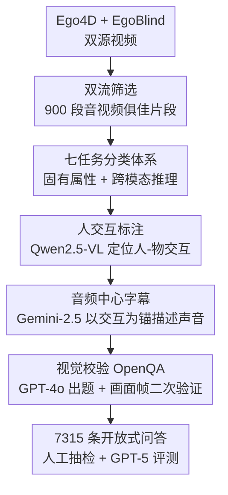

# EgoSound: Benchmarking Sound Understanding in Egocentric Videos

**会议**: CVPR 2026  
**arXiv**: [2602.14122](https://arxiv.org/abs/2602.14122)  
**代码**: https://groolegend.github.io/EgoSound/ (项目主页)  
**领域**: 多模态VLM / 音视频理解 / Benchmark  
**关键词**: 第一人称视角, 声音理解, 音视频问答, MLLM 评测, 数据自动生成

## 一句话总结
EgoSound 是第一个系统评测多模态大模型（MLLM）"第一人称声音理解"能力的基准：它合并 Ego4D 与 EgoBlind 两个数据源、定义涵盖固有声音感知与跨模态推理的 7 任务体系，用一条"交互标注→音频中心字幕→视觉校验 OpenQA"的三段式自动流水线产出 900 段视频上的 7315 条开放式问答，实测 9 个 SOTA omni 模型最高只有 56.7% 准确率（人类 83.9%），暴露了模型在细粒度空间/因果声音推理上的短板。

## 研究背景与动机
**领域现状**：多模态大模型（MLLM）在视觉-语言理解上进展飞快，能做复杂的视觉问答与推理。第一人称（egocentric）视频理解也已经有 EgoVQA、EgoTaskQA、EgoSchema、EgoThink、AMEGO、EgoTempo 等一大批基准。

**现有痛点**：这些第一人称基准几乎全是"视觉中心"的——只关心画面里看得见的事件，把音频当作次要信息，甚至直接丢弃。但人类感知本质是多感官的，**声音**恰恰携带了画面给不了的关键线索：空间布局、画外事件、交互背后的因果与意图。对视障人群而言，声音更不是辅助而是导航与态势感知的命脉。

**核心矛盾**：第一人称场景里音频与视觉是深度耦合的（钢水"嘶"的一声、金属突然的"哐当"都暗示了画面外或即将发生的事），可现有评测要么没有声音相关问题，要么是闭集选择题、单一数据源，无法系统检验模型"听懂"第一人称世界的能力。Audio-Visual QA 领域虽有 SpatialSoundQA、SAVVY、Magnet 等，但都不是第一人称视角。

**本文目标**：填补"第一人称 + 声音理解"这块评测空白，分解为三个子问题——(1) 用什么数据能同时覆盖"视觉引导"和"声音依赖"两类体验；(2) 用什么任务体系能系统区分模型在固有声音属性 vs 跨模态推理上的能力；(3) 如何低成本地造出高质量、防猜测的开放式问答。

**切入角度**：作者观察到"物理交互是有意义声音事件的主要来源"，于是把数据构建锚定在人-物/人-人交互上；同时引入由盲人录制、天然以听觉为中心的 EgoBlind 数据，与日常活动丰富的 Ego4D 互补，逼出真正需要"听"的场景。

**核心 idea**：构造第一个第一人称声音理解基准 EgoSound——以"声音为中心、视觉为辅助校验"的自动流水线生成开放式问答，并用 7 任务体系把模型的听觉短板暴露出来。

## 方法详解

### 整体框架
EgoSound 本质是一个**数据基准**，核心产出是三样东西：多源视频集合、7 任务分类体系、以及一条把视频自动变成高质量声音问答的三阶段流水线。整体流程是：先从 Ego4D 和 EgoBlind 严格筛出 900 段音视频俱佳的第一人称视频；再让流水线对每段视频依次做"人交互标注 → 音频中心字幕 → 视觉校验问答构建"，把不同生成模型分工串起来（Qwen2.5-VL 找交互、Gemini-2.5 写音频字幕、GPT-4o 出题并用画面帧二次校验）；最终得到 7315 条覆盖 7 类任务的开放式问答，再用人工抽检与 GPT-5 自动评测去刷 9 个 omni 模型。

### 关键设计

**1. 双源互补数据：让"看得见"和"必须听"的场景同台**

第一人称声音基准最怕数据偏科——只用日常活动视频，模型靠看画面就能蒙对，声音变成可有可无。EgoSound 同时纳入两个性质迥异的数据源：Ego4D 贡献体育、烹饪、通勤、演奏等大范围日常活动（260 段，平均 105.6 秒），EgoBlind 则由盲人录制、天然以听觉为导航核心（640 段，平均 40.5 秒）。EgoBlind 的引入是这个基准的独特之处——它逼出"声音不是辅助而是关键信息"的场景，使整个数据集横跨"视觉引导→声音依赖"的完整谱系。两源都经过严格双流筛选才进入最终 900 段

**2. 双流过滤：在音频和视觉两条轨上分别砍掉无效片段**

要造"声音相关"的高质量问答，原始视频里大量静音、噪声、静止画面都是干扰。作者设计了音频、视觉两条独立过滤线：音频侧先丢掉长时间静音、背景噪声过大或语音不可辨的视频，再把保留片段裁剪到"富含有意义声音事件"的段落；视觉侧剔除静止或单调画面，专门保留有动态人类活动和丰富物体交互的片段。两条轨叠加，把数据浓缩到"既能听又能看"的高信息密度片段，这是后续能生成有挑战性问答的前提

**3. 七任务分类体系：把"听懂声音"拆成可分别诊断的两个层级**

模型在声音上到底差在哪，需要一套能区分能力层级的任务体系。EgoSound 按"固有声音属性 vs 多模态感知推理"分两层、共 7 个任务：固有层有 **Sound Characteristics（音色/响度/质地）、Counting（声音事件/重复/词频计数）、Temporal Attribute（时长/时机/演化）**，只需听音频就能答；多模态层有 **Spatial Location（相对观察者的 3D 方位与距离）、Sound Source Identification（把声音 ground 到产生它的物体/动作）、Inferential Causality（推断声音背后的成因或意图）、Cross-Modal Reasoning（音频↔视觉互相解释）**，必须音视频联合推理。设计遵循文献对齐、全面覆盖、实用相关三原则。这个两层划分不是摆设——后面的音频-only 消融正是靠它验证了"前三任务去掉视觉几乎不掉点、后四任务大幅下滑"

**4. 三阶段生成流水线：用交互锚点和视觉校验压住幻觉**

直接让 omni 模型泛泛描述视频，往往漏掉关键声音细节；而生成式问答又容易幻觉。作者把流水线拆成三段、让不同模型各司其职并层层约束：① **人交互标注**——用 Qwen2.5-VL 自动标出带时间戳的人-物/人-人交互（如"3s 时穿红裙女孩拿起相机"），因为物理交互是声音事件的主要来源，这些标注成为后续的上下文锚点；② **音频中心字幕**——用 Gemini-2.5 以交互标注为辅助条件，专门描述每个声音的来源、声学特征、活跃声源数、何时发生、持续多久、空间位置、为何发生、以及视觉如何帮助解释音频，并转写所有语音，使字幕"扎根第一人称场景但为细粒度声音标注优化"；③ **视觉校验问答构建**——为降低 Gemini 字幕的潜在幻觉，改用 GPT-4o 基于字幕+视频帧出题，且每条问答必须有画面帧的视觉证据支撑（双重校验），并采用开放式（OpenQA）而非选择题格式以防止模型猜答

### 评测协议
最终 7315 条问答按"开放式描述性回答"评测，用 GPT-5 作自动裁判，判定预测与参考答案的事实一致性，输出两个指标：**Accuracy**（被判为"正确"的比例，0–100%）与 **Score**（语义一致程度，0–5，5 为完全正确）。为保证可靠性，从 7000+ 问答中按每任务 50 条均衡抽 350 条做人工验证，由两名有 CV 研究经验、英语流利的标注者打分（0–5），最终人工核验准确率 92.1%、平均分 4.3，确认了流水线质量。评测时刻意排除 Gemini 自身（因字幕由 Gemini 2.5 Flash 标注，避免偏置）。

## 实验关键数据

### 与现有第一人称问答基准对比
| 基准 | 时长 | 片段数 | 问答数 | 任务数 | 声音问题 | 多源 | 开放式 |
|------|------|--------|--------|--------|----------|------|--------|
| EgoVQA | (25,100)s | 520 | 0.6k | 5 | ✗ | ✗ | ✓ |
| EgoTaskQA | 25s | 2336 | 40k | 4 | ✗ | ✗ | ✓ |
| EgoSchema | 3min | 1981 | 5k | - | ✗ | ✗ | ✗ |
| AMEGO | 14min | 100 | 20.5k | 8 | ✗ | ✗ | ✗ |
| EgoCross | 22.5s | 798 | 0.95k | 4 | ✗ | ✓ | ✓ |
| **EgoSound（本文）** | **59s** | **900** | **7.3k** | **7** | **✓** | **✓** | **✓** |

EgoSound 是表中唯一同时满足"声音问题 + 多源 + 开放式"三者的基准。数据源构成：EgoBlind 640 段/4969 问答（均长 40.5s），Ego4D 260 段/2346 问答（均长 105.6s），合计 900 段/7315 问答/均长 59.3s。

### 9 个 MLLM 主评测（平均 Accuracy% / Score）
| 模型 | 平均准确率 | 平均分 | 备注 |
|------|-----------|--------|------|
| **Human（人类上限）** | 83.9 | 3.9 | 350 条抽样 |
| Qwen3-Omni-Thinking-30B | **56.7** | 3.0 | 最佳模型 |
| Qwen3-Omni-Instruct-30B | 51.9 | 2.8 | 次佳 |
| video-SALMONN 2+ -72B | 46.6 | 2.5 | 最大开源模型 |
| MiniCPM-o 2.6-8B | 40.4 | 2.2 | |
| Qwen2.5-Omni-7B | 39.8 | 2.1 | |
| video-SALMONN 2+ -7B | 36.0 | 2.0 | |
| EgoGPT-7B | 34.3 | 2.0 | 第一人称专用模型 |
| Qwen2.5-Omni-3B | 33.9 | 1.9 | |
| VideoLLaMA2.1-AV-7B | 20.5 | 1.3 | 最弱 |

最佳模型与人类差距超 27 个点（56.7 vs 83.9），证明基准难度。分任务看，几乎所有模型在 **Spatial Location**（最佳仅 50.0）和 **Sound Characteristics** 上明显弱于 Counting/Causality/Cross-Modal，说明细粒度听觉感知是普遍短板。

### 音频-only 消融（Qwen3-Omni-Thinking-30B）
| 任务组 | 音视频输入 | 仅音频 | 说明 |
|--------|-----------|--------|------|
| 声音依赖三任务（Characteristics/Counting/Temporal） | 50.3 | 44.3 | 仅小幅下滑 ~6 点 |
| 音视联合四任务（Location/Identification/Causality/Cross-Modal） | — | 下滑 >20% | 显著退化 |
| └ Spatial Location（单项） | — | −28.1 点 | 掉幅最大 |
| └ Inferential Causality（单项） | — | −24.9 点 | 第二大 |

### 关键发现
- **声音是真短板**：模型在视觉域擅长的能力（识别物体属性、大致定位）一旦换到声音域就明显退化，部分模型在声音特征/空间定位上甚至低于计数、因果、跨模态推理任务。
- **规模有用但非万能**：72B 的 video-SALMONN 2+ 显著超过 7B 版本（46.6 vs 36.0），但仍打不过 30B 的 Qwen3-Omni；VideoLLaMA2.1-AV-7B 反而输给 Qwen2.5-Omni-3B——单纯堆参数量不保证更好。
- **第一人称预训练没帮上忙**：专门适配第一人称的 EgoGPT-7B 平均仅 34.3%，低于同规模通用模型，说明只在第一人称数据上预训练并不能补齐声音理解短板，凸显"模态均衡"训练的重要性。
- **音频-only 消融验证了任务设计**：声音依赖任务去掉视觉几乎不掉点、音视联合任务大幅下滑，正好印证 7 任务体系的两层划分是真实有效的；同时模型在仅音频下并非完全失败，呼应了视障者仅凭听觉仍能部分理解世界的现象。

## 亮点与洞察
- **"盲人数据"是点睛之笔**：引入 EgoBlind 让基准天然包含"声音不可替代"的场景，比单纯加音频问题更能逼出模型短板——这是个可迁移的数据构建思路（想测某种被忽视的模态，就找一个天然依赖该模态的人群/场景的数据源）。
- **生成模型分工 + 视觉证据校验**：用 Qwen2.5-VL 找交互锚点、Gemini 写音频字幕、GPT-4o 出题并强制每题有画面帧支撑，三段式把幻觉压在每一步内；尤其"出题模型 ≠ 字幕模型"和"评测时排除 Gemini 避免偏置"这两个细节，体现了对自动生成数据可信度的认真。
- **任务体系自带可证伪性**：把任务分成"声音依赖 vs 音视联合"两层后，作者用一个音频-only 消融就反过来验证了分类的合理性——这种"设计即假设、消融即检验"的闭环值得借鉴。
- **开放式 OpenQA + LLM 裁判**：放弃选择题、改用 GPT-5 判事实一致性，避免了模型靠排除法蒙对，更贴近真实理解能力的测量。

## 局限与展望
- **依赖生成模型质量**：问答由 Qwen2.5-VL/Gemini/GPT-4o 链式生成，尽管有视觉校验和 92.1% 人工核验通过率，仍可能继承上游模型的系统性偏差（如某些声学概念描述不准）。
- **第一人称模型样本太少**：作者坦承"第一人称预训练没用"的结论只基于 EgoGPT 一个模型，开源第一人称 omni 模型稀缺，结论的普适性有限，需更多此类模型才能下定论。
- **评测裁判也是 LLM**：用 GPT-5 当自动裁判虽高效，但裁判本身的偏好/错误会影响排名，未充分讨论裁判与人工评分的一致性区间。
- **规模偏中小**：900 段视频/7315 问答相对 EgoTaskQA（40k）等偏小，未来可扩展规模并加入更多声学环境与语言。

## 相关工作与启发
- **vs 视觉中心第一人称基准（EgoSchema/EgoTempo/AMEGO/EgoCross）**：它们聚焦时序、记忆、跨域泛化等视觉认知技能，几乎不含声音问题；EgoSound 把焦点转到听觉-（视觉）线索，是唯一"声音 + 多源 + 开放式"三合一的基准。
- **vs Audio-Visual QA（SpatialSoundQA/SAVVY/Magnet）**：这些工作做空间声音推理或音视联合理解，但都不是第一人称视角，忽略了"声音对第一人称 grounding 至关重要"这一点；EgoSound 首次把 Audio-VQA 带进 egocentric 域。
- **对 MLLM 研究的启发**：实验揭示当前 omni 模型"看得懂但听不细"，且第一人称预训练和单纯扩规模都治不好——这指向需要专门的"模态均衡"训练（让视觉/听觉/语言联合推理），为下一代第一人称多感官模型提供了明确的优化靶子。

## 评分
- 新颖性: ⭐⭐⭐⭐⭐ 第一个第一人称声音理解基准，"盲人数据 + 七任务两层体系 + 三段式校验流水线"组合很新
- 实验充分度: ⭐⭐⭐⭐ 覆盖 9 个 SOTA omni 模型 + 人类上限 + 音频-only 消融，体系完整；但第一人称模型只有 1 个、裁判一致性讨论偏少
- 写作质量: ⭐⭐⭐⭐ 动机清晰、四点发现编号呈现、任务体系与消融自洽
- 价值: ⭐⭐⭐⭐⭐ 暴露 MLLM 听觉短板、提供高质量可证伪基准，对多感官第一人称智能有明确推动作用

<!-- RELATED:START -->

## 相关论文

- [\[CVPR 2026\] ViKey: Enhancing Temporal Understanding in Videos via Visual Prompting](vikey_enhancing_temporal_understanding_in_videos_via_visual_prompting.md)
- [\[CVPR 2026\] Hear you are: Teaching LLMs Spatial Reasoning with Vision and Spatial Sound](hear_you_are_teaching_llms_spatial_reasoning_with_vision_and_spatial_sound.md)
- [\[NeurIPS 2025\] In the Eye of MLLM: Benchmarking Egocentric Video Intent Understanding with Gaze-Guided Prompting](../../NeurIPS2025/multimodal_vlm/in_the_eye_of_mllm_benchmarking_egocentric_video_intent_understanding_with_gaze-.md)
- [\[CVPR 2026\] EgoProx: Evaluating MLLMs on Egocentric 3D Proximity Reasoning Across a Cognitive Hierarchy](egoprox_evaluating_mllms_on_egocentric_3d_proximity_reasoning_across_a_cognitive.md)
- [\[CVPR 2026\] Generate, Analyze, and Refine: Training-Free Sound Source Localization via MLLM Meta-Reasoning](generate_analyze_and_refine_training-free_sound_source_localization_via_mllm_met.md)

<!-- RELATED:END -->
