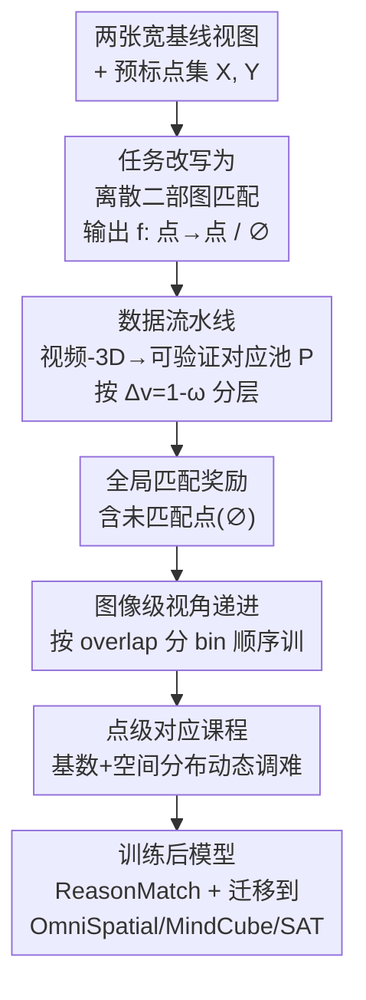

# Eliciting Complex Spatial Reasoning in MLLMs through Wide-Baseline Matching

**会议**: CVPR 2026  
**arXiv**: [2606.03577](https://arxiv.org/abs/2606.03577)  
**代码**: 无（论文未提供）  
**领域**: 多模态VLM / 空间推理  
**关键词**: 宽基线匹配, 跨视角对应, 可验证奖励强化学习, 课程学习, 空间推理 benchmark

## 一句话总结
把"宽基线匹配"(wide-baseline matching, WBM) 当作探测和训练 MLLM 空间推理的试金石：先造出按视角差和匹配粒度分层的 ReasonMatch-Bench（发现最强基线只有 37.2 F1，人类 84.0），再用一条从视频-3D 语料自动抽取可验证对应关系的数据流水线 + DCRL（双层动态课程的可验证奖励 RL），把 Qwen3-VL-8B 在该 benchmark 上从 27.5 拉到 70.5 F1，并迁移到多个空间智能 benchmark 而不损害通用视觉能力。

## 研究背景与动机
**领域现状**：要把 MLLM 部署到物理世界，光会识别物体、描述图像不够，关键是跨"差异很大的视角"做空间推理——几何理解、视角想象、细粒度感知、遮挡与拓扑推理、尺度/深度估计。现有 benchmark（OmniSpatial、VSI-Bench）大多每个样本只考一种孤立能力（相对位置、视角预测），训练侧方法（SAT、RoboSpatial、RoboRefer）也偏视觉 grounding 或简单关系推理，停留在文字推理 + 选择题。

**现有痛点**：真正"逼出"空间推理的监督数据既贵又脆。人工标注很难在一个样本里同时覆盖几何、语义、上下文；合成数据又难以兼顾真实多样性和可大规模验证。已有探索跨视角对应的工作（Multi-SpatialMLLM）局限于小视角变化、受限任务格式（多选）、且只用 SFT，激不出更深的推理。

**核心矛盾**：经典特征匹配 pipeline（SIFT/SURF/ORB + RANSAC + 对极几何）在小视角、密集采帧下有效，但在"极端宽基线"（大基线、强透视/外观变化、重复结构、光照变化、语义遮挡）下频繁失败；而人类却能靠几何规律 + 语义知识 + 上下文线索综合判断。MLLM 到底处在哪一档、用什么数据和训练范式能可靠提升，仍是空白。

**本文目标**：(1) 系统评测 MLLM 在 WBM 上的能力；(2) 找到能大规模、可验证、低人工的训练范式来提升这种跨视角空间推理。

**切入角度**：WBM 任务本身"天然可验证"——两点是否对应同一个 3D 点，可以用几何重投影/SfM landmark 严格校验。这意味着可以绕开 CoT 监督，直接用 RLVR（可验证奖励强化学习）让模型自己探索推理策略。

**核心 idea**：把 WBM 重写成"MLLM 在两组预标点之间做离散符号关联（部分二部图匹配）"的语言任务，用从视频-3D 语料自动抽取的可验证对应做奖励，再用按"视角差 + 点配置"双层递进的动态课程稳住训练。

## 方法详解
### 整体框架
方法要解决的是"让 MLLM 学会在极端视角差下判断两张图里哪些标注点对应同一个 3D 物体点"。整体分三块：先把匹配任务改写成 MLLM 能做的离散语言任务（输出从点索引到点索引的映射），再用一条数据流水线从 RGB-D 视频和 SfM 重建里自动挖出带 ground-truth 的对应点对并按视角难度分层，最后用 DCRL 这套带双层动态课程的可验证奖励 RL 训练模型，从简单配置逐步逼到极端场景。

### 关键设计

**1. 把宽基线匹配改写成"语言中介的离散二部图匹配"**

经典匹配器输出连续相似度矩阵 $S\in\mathbb{R}^{n\times m}$，MLLM 没法直接产出这种稠密分数，硬套会让任务和模型能力错位。本文换一种问法：给两张图各预标一组带索引的点 $\mathcal{X}=\{\mathbf{x}_i\}_{i=1}^n$、$\mathcal{Y}=\{\mathbf{y}_j\}_{j=1}^m$，模型读入 $(I_1,\mathcal{X};I_2,\mathcal{Y})$（视觉提示标出点编号），输出一个文字映射 $\hat f:\{1,\dots,n\}\to\{1,\dots,m\}\cup\{\varnothing\}$，$\hat f(i)=j$ 表示 $\mathbf{x}_i$ 对应 $\mathbf{y}_j$，$\hat f(i)=\varnothing$ 表示因遮挡/无重叠而无可信匹配。这本质是两点集之间的"部分二部图匹配"——每个点至多对应一个、也可不对应。这样做把 MLLM 当成"在视觉实体间做符号关联的推理引擎"而不是连续特征比对器，从而能把几何、语义、上下文线索一起卷进复杂空间推理；同时离散输出天然便于和 ground-truth 逐点比对、做可验证奖励

**2. 视频-3D 自动数据流水线：可验证、可分层、可重采的对应池**

监督数据贵且脆是最大瓶颈，本文用现成大规模视频-3D 语料自动造监督。来源分两类：RGB-D 数据（CO3D、uCO3D、ScanNet）用几何重投影——$I_1$ 中有效深度像素反投影到 3D 再投到 $I_2$，用深度一致性 + 光度一致性校验；SfM 数据（RealEstate10K、DL3DV）直接取 COLMAP 重建里已过几何验证的共享 3D landmark。这样每对图能得到上千条稠密匹配 $\mathcal{M}$。难度量化上，定义 overlap 分数 $\omega\in[0,1]$（RGB-D 看成功匹配像素比例，SfM 看共享 landmark 比例），视角变化幅度 $\Delta_v=1-\omega$ 随基线和遮挡增大而增大，用于按来源做难度分层。但稠密匹配直接标到图上会严重视觉重叠、且超出 MLLM 输入上限，于是做基于聚类的空间过滤，在联合图像坐标空间聚类、每簇留一个代表，得到 $N_p\in[10,50]$ 个空间分散良好的验证对应池 $\mathcal{P}$。$\mathcal{P}$ 是关键中间产物：matchable 点和 distractor 点都从它灵活采样，支撑后面动态课程的各种任务构造

**3. 全局匹配奖励：把"未匹配点"也纳入评分，逼模型推理可见性**

传统部分二部图匹配只评已匹配对、忽略未匹配点，模型容易只挑显眼好配的点、回避遮挡/出框区域。本文显式给未匹配点指派 dummy 目标 $\varnothing$，并对正确预测"无匹配"也给奖励。匹配正确率定义为对全部 $n$ 个查询区域取
$$r_{\text{match}}=\frac{1}{n}\sum_{i=1}^{n}\mathbb{1}\big[\hat f(i)=f^*(i)\big],$$
再加上格式合规项，最终奖励 $r=w_f\cdot r_{\text{format}}+w_m\cdot r_{\text{match}}$（实现取 $w_f=w_m=1.0$）。这个 $r_{\text{match}}$ 一身两职：既是策略优化的训练信号，又是下面课程动态调难的控制信号。把 $\varnothing$ 纳入评分消除了目标歧义，强迫模型对全场景的视角相关可见性和几何约束做"刻意推理"，而不是只对易匹配的显著特征下注

**4. 双层动态课程：视角递进为外环、点配置课程为内环**

直接在极端匹配场景上训会探索低效、收敛差。DCRL 沿两个互补维度拆解难度。外环是图像级视角递进：把数据按 $\omega$ 分成 $S=10$ 个 overlap bin，bin 1 是高重叠小视角、bin $S$ 是极端视角差；顺序训，当某 bin 上滑动窗口（20 步）平均准确率奖励超过 0.8 就升到下一 bin，并永久剔除已掌握的简单 bin——早期快速建立几何基础、后期用更难场景获取更大信息增益，同时靠"过滤已掌握配置"维持效率。内环是点级对应课程：点集 $\mathcal{X},\mathcal{Y}=g(\mathcal{P})$ 在线从池子采样，采样策略 $g$ 动态调难，又分两个子维度——(a) 基数自适应，按三档难度递进 L1 无歧义匹配（无 distractor、一一对应）→ L2 选择性匹配（$\mathcal{Y}$ 侧有 distractor，模拟非对称覆盖）→ L3 部分匹配（两侧都有 distractor，模拟双向遮挡/不完全重叠），表现好就升级、退步就降级；(b) 空间分布精炼，通过聚类半径从"最稀疏（每簇一点、全局分布、需物体级推理）→ 中等聚类 → 稠密随机采样"递进，逐步抹掉能"无脑对齐"的空间线索，逼模型学细粒度几何。两层一外一内对齐难度与模型当前能力，实现样本高效探索

### 损失函数 / 训练策略
用 GRPO 在 Qwen3-VL-8B-Instruct 上做 RLVR：group size $G=32$，有效 batch $16\times32$ 条轨迹/更新，KL 系数 $\beta=0.005$，每条预测上限 5120 token，rollout 温度 $T=1.0$，AdamW + 前 10 步线性 warmup、恒定学习率 $10^{-6}$。奖励即上面的 $r=w_f r_{\text{format}}+w_m r_{\text{match}}$（权重各 1.0），无显式 CoT/推理过程监督——模型靠可验证奖励自主探索推理策略。

## 实验关键数据

### 主实验
ReasonMatch-Bench 测试集 2,810 对图（取自 220k 对语料），来源/任务级/场景三维度均衡（如 ScanNet 27.7%、uCO3D 28.0%、DL3DV 27.0%、RE10K 17.2%；L1 32.5% / L2 36.8% / L3 30.7%；室内 55.1% / 物体 28.0% / 室外 16.9%）。

| 模型 | ReasonMatch F1 | Precision | Recall |
|------|------|------|------|
| GPT-5-mini | 57.9 | 56.9 | 59.4 |
| GPT-5-Chat | 51.5 | 50.6 | 52.8 |
| Gemini-2.5-Pro | 42.8 | 42.4 | 43.4 |
| Claude-4.5-Sonnet | 41.7 | 43.7 | 41.1 |
| Qwen3-VL-235B | 49.2 | 50.7 | 48.7 |
| Qwen3-VL-8B-Instruct (base) | 27.5 | 27.1 | 29.1 |
| **Qwen3-VL-8B + DCRL** | **70.5** | **70.3** | **71.1** |
| Δ vs. base | +43.0 | +43.2 | +42.0 |

8B 的 DCRL（70.5）反超所有开源/闭源基线，包括 GPT-5-mini（57.9）和 235B 的 Qwen3-VL（49.2）。难度上：室外 L1 最易，室内中等，物体级（object-centric）最难——孤立物体缺环境上下文，基线在 L3 上崩得厉害（如多数 < 30 F1），DCRL 相对稳。

人类对照（90 个最大视角差子集，只报 F1）：

| 方法 | Overall | DL3DV | RE10K | uCO3D |
|------|------|------|------|------|
| GPT-5-mini | 37.2 | 35.9 | 49.7 | 25.8 |
| Gemini-2.5-Pro | 29.5 | 26.5 | 44.1 | 18.0 |
| Qwen3-VL-235B | 29.9 | 25.3 | 45.7 | 18.7 |
| **DCRL** | **52.0** | 57.7 | 70.6 | 27.8 |
| Human | 84.0 | 93.5 | 94.7 | 62.1 |

DCRL 把最强基线 37.2 提到 52.0，但离人类 84.0 仍差很多，尤其物体级 uCO3D（27.8 vs 62.1），说明极端宽基线匹配远未解决。

迁移到空间智能 benchmark：OmniSpatial Overall 43.60→48.87（+5.27）、MindCube 40.01→43.52（+3.51）、SAT Real 70.0→75.3（+5.3）。通用视觉能力不退反微涨：MME-RealWorld 62.8→63.8、MMStar 59.8→62.5、RealWorldQA 69.5→70.5、V*Bench 84.8→85.9。

### 消融实验
| 配置 | OmniSpatial | MindCube | SAT | ReasonMatch |
|------|------|------|------|------|
| Base (Qwen3-VL-8B) | 43.6 | 40.0 | 70.0 | 27.5 |
| SFT (CoT 标注 WBM 数据) | 42.6 | 45.1 | 41.3 | 51.0 |
| **DCRL (RLVR)** | **48.9** | 43.5 | **75.3** | **70.5** |

| 课程配置 | ReasonMatch 相对 | 说明 |
|------|------|------|
| easy-only / hard-only | 较低 | 只用易/难子集训练 |
| 均匀采样 RL | 中等 | 已优于 easy/hard-only |
| **动态课程 (DCRL)** | **+5.2** | 优于均匀采样 +5.2 点 |

### 关键发现
- RL 比 SFT 更可迁移：SFT 用 CoT 标注把 in-domain ReasonMatch 提到 51.0，但 SAT 反掉到 41.3（比 base 70.0 还差），说明 teacher-forcing 模仿会过拟合对应模式；DCRL 在 ReasonMatch 上比 SFT 高 +19.5、SAT 上高 +34.0，可验证奖励学到的空间推理更通用。
- 动态课程确实有用：均匀采样已优于单一难度子集，动态课程再 +5.2 点，训练曲线收敛稳定。
- 迁移是异质的：OmniSpatial 子类中 Dynamic Reasoning（+9.6%）和 Complex Logic（+8.38%）涨最多，Perspective Taking 几乎不变；作者归因于训练数据多为含相机旋转/自我运动的室内导航视频，与 3D 心理旋转、运动预测类任务更对口；MindCube 的 Rotation 子任务也涨最多（+6.0%），互相印证。
- 失败模式：Gemini-2.5-Pro 能给准确的局部点描述（"白墙区域""木质表面"）但缺全局判别力、退化成模糊局部特征匹配；Qwen3-VL 系列对视角变化有几何直觉，但常出"视觉标签误识别 + 推理-答案不一致"（CoT 推对了、最终格式化输出却自相矛盾）。

## 亮点与洞察
- **任务即奖励**：选 WBM 不只是"又一个难任务"，而是看中它"几何可验证"——两点是否同源能被重投影/SfM 严格判定，于是无需 CoT 监督就能造出干净奖励信号，这是整套 RLVR 能跑起来的根。把"找一个天然可验证的代理任务来逼出某种推理"这一思路可迁移到别的空间/几何能力训练。
- **把 ∅ 写进奖励**：显式奖励"正确说出无匹配"是个小而关键的设计——它堵住了模型只挑好配点的捷径，逼它推理可见性和遮挡，这种"对 abstain/拒答也评分"的奖励工程值得借鉴到检索、grounding、幻觉抑制等任务。
- **数据池 $\mathcal{P}$ 在线重采 + 双层课程**：点集不离线固定、而是从验证池在线采样，使得"同一对图"能动态生成 L1/L2/L3、稀疏/稠密等任意难度配置，课程才能真正"动态调难"。这种"中间产物可重采 → 课程可自由编排"的设计模式很巧。
- **8B 反超 235B 和 GPT-5-mini**：说明在这类需要专门训练的细分空间能力上，对的训练范式比单纯堆参数更有效。

## 局限与展望
- 离人类差距仍大（52.0 vs 84.0），物体级场景尤其差（27.8 vs 62.1），极端宽基线匹配远未解决——作者自己承认还有大量 headroom。
- 难度量化 $\omega$ 只用于"同源内分层"、明确不可跨来源直接比较（RGB-D 与 SfM 的 $\omega$ 口径不同），所以 benchmark 内的绝对难度刻度在不同数据源间不完全可比，横向解读要小心。
- 数据完全依赖现成视频-3D 语料的几何/SfM 校验质量，深度噪声、COLMAP 重建误差会污染 ground-truth；且场景分布偏室内导航视频，可能正是 Perspective Taking 迁移最弱的原因，泛化到更多样物理场景待验证。
- 任务设定是"预标点 + 选索引"，回避了"自己从零检测可匹配点"的更难环节；真实下游（重定位、3D 重建）还需要稠密、自发现的对应，离实用 pipeline 还有距离。
- 论文未放代码，部分细节（聚类半径、基数课程具体阈值、$\omega$ 计算公式）在正文缺失、留在 supplement，复现需补充材料 ⚠️ 以原文为准。

## 相关工作与启发
- **vs Multi-SpatialMLLM**: 同样探索跨视角对应，但它局限于小视角变化、受限任务格式（多选）、且只用 SFT；本文直击宽基线极端视角，改成离散二部图匹配 + RLVR，能激出更深、更可迁移的空间推理。
- **vs 经典特征匹配（SIFT/SURF/ORB + RANSAC + 对极几何）**: 经典方法在小视角/密集采帧下高效，但极端视角下因透视/光照/遮挡变化频繁失败、且缺语义与上下文推理；本文用 MLLM 把几何 + 语义 + 上下文一起卷进来，正是补这块短板（但当前还是"选已标点"而非"产稠密对应"）。
- **vs OmniSpatial / VSI-Bench 等空间 benchmark**: 它们每个样本多考孤立能力（相对位置、视角预测）；ReasonMatch-Bench 用 WBM 一题就需要几何 + 语义 + 上下文整合推理，且按视角差和匹配粒度分层，难度可控、可验证。
- **vs DeepSeek-R1 式 RLVR**: 借鉴其"用可验证奖励让模型自主探索推理"的思路，把它从数学/代码迁到视觉空间匹配，并额外加了双层动态课程来稳住极端难度下的探索。

## 评分
- 新颖性: ⭐⭐⭐⭐⭐ 把宽基线匹配重写成可验证的语言匹配任务并配双层动态课程 RLVR，视角独到、串起 benchmark + 数据 + 训练一整套。
- 实验充分度: ⭐⭐⭐⭐ 覆盖 3 场景 × 3 难度的主表 + 人类对照 + 3 个迁移 benchmark + 4 个通用 benchmark + SFT/课程消融，较扎实；但部分关键超参/公式留在 supplement、无代码。
- 写作质量: ⭐⭐⭐⭐ 动机链条清晰、任务形式化到位；课程的"基数/空间分布"两子维度若有更直观的图示会更好读。
- 价值: ⭐⭐⭐⭐⭐ 给"如何评测与训练 MLLM 跨视角空间推理"提供了可验证、可扩展、低人工的范式，且证明对的训练比堆参更有效，对具身/机器人方向有直接参考价值。

<!-- RELATED:START -->

## 相关论文

- [\[CVPR 2026\] EgoMind: Activating Spatial Cognition through Linguistic Reasoning in MLLMs](egomind_activating_spatial_cognition_through_linguistic_reasoning_in_mllms.md)
- [\[CVPR 2026\] ReMatch: Boosting Representation through Matching for Multimodal Retrieval](rematch_boosting_representation_through_matching_for_multimodal_retrieval.md)
- [\[CVPR 2026\] From Indoor to Open World: Revealing the Spatial Reasoning Gap in MLLMs](from_indoor_to_open_world_revealing_the_spatial_reasoning_gap_in_mllms.md)
- [\[CVPR 2026\] STAR-R1: Multi-View Spatial TrAnsformation Reasoning by Reinforcing Multimodal LLMs](star-r1_multi-view_spatial_transformation_reasoning_by_reinforcing_multimodal_ll.md)
- [\[CVPR 2026\] SpatialTree: How Spatial Intelligence Branches Out in MLLMs](spatialtree_how_spatial_intelligence_branches_out_in_mllms.md)

<!-- RELATED:END -->
