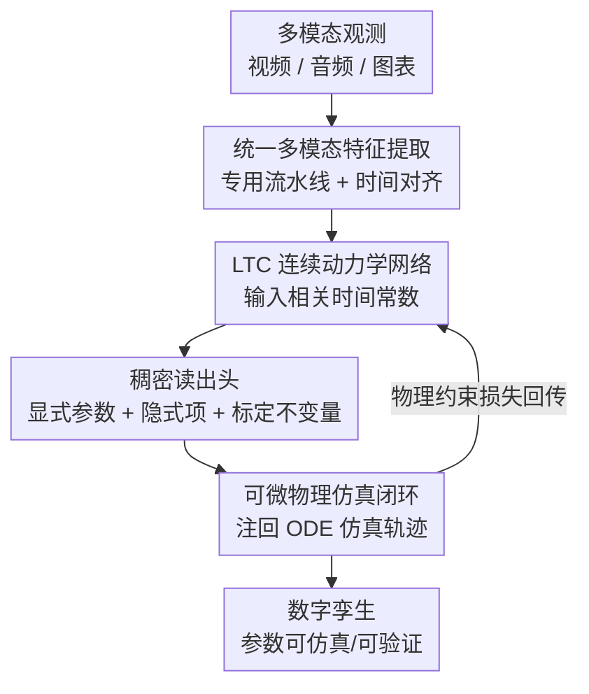

# EMMA: Extracting Multiple physical parameters from Multimodal Data

**会议**: CVPR 2026  
**arXiv**: [2605.24047](https://arxiv.org/abs/2605.24047)  
**代码**: https://github.com/ImpactLabASU/EMMA-CVPR2026 (有)  
**领域**: 多模态VLM / 物理参数辨识 / 数字孪生  
**关键词**: 逆向建模, 多模态, Liquid Time-Constant 网络, 物理约束损失, 隐式动力学

## 一句话总结
EMMA 把视频、音频、图表三种模态对齐后喂进一个 Liquid Time-Constant（LTC）网络，配合可微物理仿真与物理约束损失，**无监督地**一次性辨识出动力系统的全部可识别参数——包括视频里看不见的强迫输入、任何模态都测不到的隐式动力学项、以及坐标系原点/初始条件等标定不变量，在 75 段 Delfys 视频和真实 rover/无人机上显著超越只用视频或方程发现的基线。

## 研究背景与动机

**领域现状**：从真实视频里直接学出物理系统的动力学参数（摆长、阻尼、重力加速度、电机系数……），是构造无人机、巡视器等自治平台「数字孪生」的关键一步，本质是一个逆向建模问题——从可观测轨迹反推潜在物理参数。近年主流做法是「只用视频」（Vid2Param、RISP、Delfys、PAIG 等），因为相比侵入式传感器，被动相机便宜又普及。

**现有痛点**：纯视频方法有几处硬伤。① **强迫输入不可见**：rover 视频能看到轮子姿态，却看不到轮子的功率指令，导致运动学反推是病态的；② **隐式动力学测不到**：摩擦阻力、地形相关的阻力这类项任何模态都直接测不出，但它们真实地塑造了系统行为；③ **依赖已知不变量**：很多方法默认知道初始条件、坐标系原点、固定参考系，而真实视频里相机位姿、场景几何、绝对坐标原点统统未知；④ **只能恢复单个/少数参数**。

**核心矛盾**：视频是一种「机会性」但信息不完整的观测——关键状态变量经常被遮挡或根本不在像素里，单一模态既补不齐强迫输入也辨不出隐式项，而硬塞先验（已知初值/坐标系）又在真实场景失效。

**本文目标**：用一个统一框架同时解决上述四个限制——联合推断显式参数、隐式动力学分量、标定不变量。

**切入角度**：作者观察到**不同模态互补**——音频能编码视频里看不见的强迫输入（轮子转动的声学特征与电机转速强相关），图表/传感器图像能补充时间序列；而**连续时间的 LTC 网络**自带输入相关的时间常数，天然适合在异构模态上建模带强迫的连续动力学。

**核心 idea**：把多模态特征对齐成统一时间序列，用 LTC 网络在隐空间学连续动力学并同时读出物理参数，再用可微物理仿真闭环、靠物理约束损失（而非参数真值）端到端训练。

## 方法详解

### 整体框架
EMMA 要解决的是「给一段机会性多模态观测，反推动力系统全部可识别参数 $\boldsymbol{\theta}\in\mathbb{R}^K$」。系统动力学被表示为带参数的连续 ODE $\frac{d\mathbf{x}(t)}{dt}=f(\mathbf{x}(t),\mathbf{u}(t);\boldsymbol{\theta})$，其中 $\mathbf{u}(t)$ 是视频里常被遮挡的外生强迫输入。整条管线分三段：**①统一多模态特征提取**——视频/音频/图像各走专用流水线，时间对齐后拼成统一状态向量；**②LTC 动力学建模**——用输入相关时间常数的 LTC 网络在隐空间学连续动力学，并由稠密读出头同时回归物理参数和标定不变量；**③可微物理仿真闭环**——把估计的参数注回已知 ODE 仿真出轨迹，用物理约束损失对齐观测、端到端回传梯度。整个过程对参数是无监督的：训练只靠物理一致性，不用任何参数真值。

### 关键设计

**1. 统一多模态特征提取：把异构信号对齐成同一条时间网格**

痛点是视频单模态既看不见强迫输入、又缺少隐式项的线索，必须融合多模态——但视频帧、44.1 kHz 音频、图表像素天差地别，不对齐就没法一起喂进动力学模型。EMMA 给每种模态配专用流水线再统一对齐：**视频**走五段处理（YOLOv11 检测，置信阈 0.85→去边缘检测+时序稳定性过滤→Kalman 滤波（状态 $[x,y,v_x,v_y]$）平滑→像素到物理量标定，如摆角 $\theta=\arctan\frac{y-y_p}{x-x_p}$→滑动加权平均去噪），输出物理坐标 $\mathbf{p}(t)$；**音频**重采样到 22.05 kHz、做 STFT 取 RMS 能量/谱质心/主峰频率，输出声学特征 $\mathbf{w}(t)$；**图像/图表**用 PIL+OpenCV 把曲线颜色离散成 $(x,y)$ 时序点，输出 $\mathbf{m}(t)$。三者经时间插值对齐到视频帧时间戳，拼成统一状态向量 $\mathbf{x}(t)=[\mathbf{p}(t);\mathbf{w}(t);\mathbf{m}(t)]\in\mathbb{R}^{D_{\text{in}}}$，缺失模态用零填充或可学习嵌入处理。作者特意验证：把检测器换成无监督 Farneback 光流也能拿到相当精度，说明 EMMA 的核心贡献在 LTC 物理层、而非具体特征提取器

**2. 音频线性先验：从声音里把被遮挡的强迫输入捞回来**

视频看不见 rover 轮子的功率指令，使运动学反推病态——这正是音频该补的位置。作者观察到（并由厂商数据手册支持）：在非飞行工况下，声学信号的主导音调分量随转子/轮速近似线性变化。于是对音频施加线性先验 $f_{\mathrm{tone}}(t)\approx\alpha\,v(t)+\beta$，其中 $f_{\mathrm{tone}}(t)$ 是从 $\mathbf{w}(t)$ 提取的谱峰频率、$v(t)$ 是物理转速。仿射系数 $\alpha,\beta$ 不是写死的，而是被当作**标定不变量**由 LTC 网络一起学出来——这样音频就把视频里缺失的强迫输入 $\mathbf{u}(t)$ 还原了出来，让被遮挡状态下的参数估计重新变得良态

**3. LTC 网络：用输入相关时间常数同时建模强迫输入与隐式动力学**

这是 EMMA 的核心。普通 RNN/Neural ODE 时间常数固定，对带强迫的连续系统响应迟钝。LTC 每个 cell 的演化为

$$\frac{dh_i}{dt}=\underbrace{\frac{-h_i}{\frac{\tau_i}{1+\tau_i f_{NN}(h_i,u,t,w_{NN})}}}_{\text{建模强迫输入}}+\underbrace{f_{NN}(h_i,u,t,w_{NN})A}_{\text{建模物理一致动力学}}$$

第一项的时间常数 $\frac{\tau_i}{1+\tau_i f_{NN}(\cdot)}$ 是**输入相关**的，能随多模态输入自适应地改变响应速度，这正是建模强迫输入 $u(t)$ 的关键；第二项是一组本身满足微分方程的隐藏输出，由于隐藏维度（64）远多于系统真实状态数，**多出来的隐藏变量天然有容量去表示多个隐式动力学项**（如摩擦阻力）。论文报告在带强迫输入时，LTC 的平均参数误差比 Neural ODE 低 25%、比 CT-GRU 低 5%，验证了输入相关时间常数的重要性

**4. 稠密读出头：一头同时输出物理参数与标定不变量，全程无监督**

LTC 学到隐轨迹后，需要把它映射回可解释的物理量，且要把未知坐标系原点/初值一并标定出来。EMMA 用一个稠密头做两件事：**物理参数**通过 sigmoid 激活的非线性读出（依据通用逼近定理），再经反归一化 $\theta_k=\big(1+(0.5-\bar{\boldsymbol{\theta}}_k)\cdot\frac{95}{100}\big)\cdot\theta_k^{\text{nom}}$ 映射到物理尺度（$\theta_k^{\text{nom}}$ 为标称值）；**标定不变量**则在稠密层里额外加比参数数更多的 cell、用 ReLU 激活、随隐藏输入和损失梯度线性变化来建模。整个稠密头估出的参数被注回已知 ODE，靠可微仿真端到端训练——关键在于**对参数完全无监督**：训练只由物理损失驱动，从不使用参数真值，这让 EMMA 能在真实视频上联合学出初始条件、摆悬挂点这类不变量而无需任何先验

### 损失函数 / 训练策略
总损失为物理一致性损失：$\mathcal{L}_{\text{total}}=\mathcal{L}^{cal}_{\text{traj}}+\lambda_{\text{param}}\mathcal{L}_{\text{param}}$。**标定轨迹损失** $\mathcal{L}^{cal}_{\text{traj}}=\sum_i M_{ii}\frac{1}{T_{\text{sim}}}\sum_t\lVert x_i(t)-\gamma_i-x_{i,\text{sim}}(t)\rVert^2$ 只在被测量的状态上算（$M_{ii}$ 是测量矩阵对角元，测到为 1 否则 0），其中 $\gamma_i$ 是需要标定的状态由 ReLU 读出、否则取 0。**参数约束损失** $\mathcal{L}_{\text{param}}$ 用 ReLU 惩罚违反正性/上下界的参数。优化用 AdamW + cosine annealing，LTC 隐藏单元 64、ODE 展开 6 步、输入维 100，窗口 16、batch 32、40 epoch；视频用 YOLOv11+OpenCV，音频用 librosa+MoviePy。

## 实验关键数据

### 主实验：Delfys 五大基准（75 段视频，单/多参数）

| 系统 | 参数 | EMMA | Delfys | PySINDy | GT |
|------|------|------|--------|---------|-----|
| 摆 150cm | $L$ [m] | **1.50±0.004** | 1.30 | 1.24 | 1.50 |
| Torricelli (Med) | $k$ | **0.0132±8e-4** | 0.0132 | 0.027 | 0.0128 |
| 滑块 (High) | $a$ [m/s²] | 3.14±0.05 | 3.44 | 2.63 | 3.141 |
| LED (Low) | $\gamma$ | **2.29** | 2.24 | 1.74 | 2.3 |
| 自由落体 (Med) | $a$ [m/s²] | **9.95±0.0** | 9.51 | 6.66 | 9.8 |

EMMA 在大多数配置上贴近 GT 且方差极小（Torricelli 标准差仅 ±0.0004~0.0009），尤其在含 $\sqrt{h}$ 分数幂的 Torricelli 上 PySINDy 系统性失败、而物理约束损失稳住了 EMMA。

### 真实平台：隐式 + 强迫动力学（无基线，与 GT 比）

| 平台 | 参数数(已知) | 平均误差 | 隐式动力学参数示例 |
|------|------|---------|---------|
| Rover | 9 (5 已知) | **8.8% ±1.7%** | 轮半径、质心高度 |
| 无人机 | 12 (7 已知) | 15.9% ±7.4% | 推力/扭矩系数、电机增益与时间常数 |

EMMA 在不喂入空载轮功率/转速、也不喂坐标原点的情况下，自己学出了最合适的不变量；音频鲁棒性实验显示 SNR 降到 5 dB 时 rover 参数变化 <1.1%。

### 图表模态：隐式 vs 显式动力学（θ-RMSE，对比 PySINDy）

| 案例 | EMMA 隐式 | EMMA 显式 | PySINDy 隐式 | PySINDy 显式 |
|------|-----------|-----------|--------------|--------------|
| Lotka-Volterra | **0.054** | 0.048 | 6.3 | 0.054 |
| Lorenz 混沌 | **0.016** | 0.015 | 2.3 | 0.022 |
| F8 Crusader | **7.81** | 6.8 | 21.9 | 10.5 |
| HIV 治疗 | **0.45** | 0.39 | 4.5 | 0.43 |

关键发现：动力学变隐式时两者都退化，但 EMMA 退化幅度远小于 PySINDy（Lotka 隐式下 PySINDy 误差暴涨到 6.3，EMMA 仍 0.054）。

### 效率与消融

| 模型 | 每 epoch 耗时 | 参数量 |
|------|--------------|--------|
| Delfys | 0.19 s | 5.7M |
| EMMA | 0.37 s | **53.2K** |

EMMA 耗时 1.4×，但模型小 **107×**，适合边缘部署。补充材料消融：LTC vs Neural ODE/CT-GRU（强迫下分别低 25%/5% 误差）、200% 扩大初始化范围下 6 配置中 5 个仍收敛、5 dB 音频噪声下参数变化 <1.1%。

### 关键发现
- **LTC 物理层是核心贡献**：把 YOLO 检测器换成无监督光流精度相当，说明性能不来自特征提取器而来自 LTC + 物理约束。
- **隐式动力学是 EMMA 最大差异点**：Table 1 里 EMMA 是唯一同时勾选「强迫输入 / 多参数 / 隐式动力学 / 多模态 / 可学习不变量」全部五项的方法。
- **物理约束损失稳定分数幂/混沌系统**：在 Torricelli（$\sqrt{h}$）和 Lorenz 上方差远小于方程发现基线。

## 亮点与洞察
- **用音频补视频盲区**：把「声音音调随转速线性变化」这个朴素物理常识做成可学习的线性先验，优雅地把被遮挡的强迫输入捞了回来——这是多模态最有说服力的用法，不是为融合而融合。
- **隐藏维度冗余 = 隐式动力学容量**：LTC 隐藏单元远多于真实状态数，多出来的微分方程自然承载了摩擦阻力等测不到的项，这个「用过参数化换可观测性」的视角很可迁移。
- **全程对参数无监督**：训练只靠物理仿真闭环的轨迹一致性，不碰参数真值，意味着可以部署到没有任何标注的机会性视频上。
- **53.2K 参数打 5.7M 基线**：连续时间归纳偏置（已知 ODE + LTC）换来 107× 的模型压缩，对边缘/FPGA 部署是实打实的卖点。

## 局限与展望
- **依赖至少一个时变模态**：纯静态观测无法驱动连续动力学辨识。
- **线性音频先验在湍流下失效**：飞行/强湍流工况下「音调-转速线性」假设会退化，作者已承认。
- **对严重相机抖动敏感**：视频流水线靠检测+Kalman 平滑，剧烈抖动会污染轨迹。
- **LTC 的 ODE 积分带来运行时开销**：比 Delfys 慢 1.4×；隐式参数（无人机）误差 15.9% 明显高于显式，说明真正测不到的量仍难精确恢复。
- 改进方向：用非线性/分段音频模型替代线性先验、对相机自运动做联合标定、对隐式项加更强的可识别性正则。

## 相关工作与启发
- **vs Delfys（主基线）**：Delfys 也是无监督、decoder-free 的视频参数恢复，但不处理强迫输入、隐式动力学、可学习不变量，且只恢复有限参数；EMMA 在精度相当或更好的同时把这四项全补齐，模型还小 107×。
- **vs PySINDy/SINDy-PI（方程发现）**：靠数值微分对噪声/遮挡/分数幂极敏感（Torricelli、Lorenz 上误差暴涨），且非 video-native；EMMA 的连续时间 LTC 天然处理不规则采样，物理约束损失稳住了难系统。
- **vs gradSim/φ-SfT（可微渲染）**：依赖已知几何/模板做可微渲染，EMMA 无需分割掩码、可微渲染或专用传感器。
- **vs Vid2Param/RISP/PAIG**：要么是仿真训练、要么只估状态/动作或单参数、要么只处理无强迫的简单系统；EMMA 是首个在真实多模态音视频上同时做强迫+隐式动力学参数辨识的工作。

## 评分
- 新颖性: ⭐⭐⭐⭐⭐ 首个统一恢复强迫输入/隐式动力学/标定不变量/多参数的多模态逆建模框架，Table 1 五项全勾。
- 实验充分度: ⭐⭐⭐⭐ 5 基准+75 视频+真实 rover/无人机+图表+医疗仿真覆盖广，但隐式参数误差偏高、部分对比缺同类基线（属任务首创）。
- 写作质量: ⭐⭐⭐⭐ 动机与四大限制梳理清晰，公式完整；部分细节（不变量 cell 机制）略简。
- 价值: ⭐⭐⭐⭐⭐ 无监督、轻量（53K 参数）、用现成传感器，对数字孪生/具身物理 AI 很实用。

<!-- RELATED:START -->

## 相关论文

- [\[CVPR 2026\] PhyCritic: Multimodal Critic Models for Physical AI](phycritic_multimodal_critic_models_for_physical_ai.md)
- [\[CVPR 2026\] IPR-1: Interactive Physical Reasoner](ipr-1_interactive_physical_reasoner.md)
- [\[CVPR 2026\] MVP: Multiple View Prediction Improves GUI Grounding](mvp_multiple_view_prediction_improves_gui_grounding.md)
- [\[CVPR 2026\] PAI-Bench: A Comprehensive Benchmark for Physical AI](pai-bench_a_comprehensive_benchmark_for_physical_ai.md)
- [\[CVPR 2026\] Benchmarking Single-Factor Physical Video-to-Audio Generation](benchmarking_single-factor_physical_video-to-audio_generation.md)

<!-- RELATED:END -->
