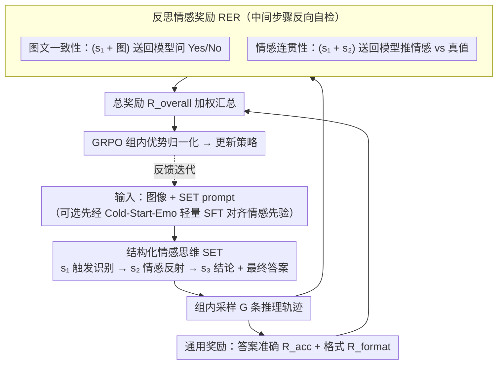

# EMO-R3: Reflective Reinforcement Learning for Emotional Reasoning in Multimodal Large Language Models

**会议**: CVPR 2026  
**arXiv**: [2602.23802](https://arxiv.org/abs/2602.23802)  
**代码**: [GitHub](https://github.com/xiaomi-research/emo-r3)  
**领域**: 多模态VLM  
**关键词**: 情感推理, GRPO, 结构化思维, 反思奖励, 多模态情感理解

## 一句话总结

提出 EMO-R3，通过结构化情感思维（SET）引导 MLLM 逐步进行情感推理，并设计反思情感奖励（RER）让模型重新评估推理的视觉-文本一致性和情感连贯性，显著提升多模态情感理解的可解释性和准确性。

## 研究背景与动机

**MLLM 情感理解的短板**：虽然 MLLM 在视觉推理上表现出色，但在捕捉人类情感的复杂性和主观性方面仍然薄弱。

**SFT 方法的局限**：基于监督微调的情感模型（EmoVIT、EmotionLLaMA 等）受限于固定标签体系和有限类别，泛化能力差，过拟合训练分布。

**通用 GRPO 的不匹配**：虽然 GRPO 能改善泛化，但其 think 过程不针对情感推理——推理轨迹与最终答案之间缺乏紧密对应（不像数学推理那样一步错则全错）。

**情感理解的特殊性**：情感推理高度主观且上下文依赖，推理路径可能因个体差异而与最终答案不一致，仅约束答案不足以指导推理过程。

**think-answer 脱节现象**：实验发现对 GRPO 的 rollout 样本重新推理 think 文本，推断出的情感往往与最终答案不一致。

**Cold Start 的必要性**：预训练 MLLM 的情感先验可能与下游标签体系不匹配，需要轻量级对齐。

## 方法详解

### 整体框架

EMO-R3 想解决的是：MLLM 做情感推理时 think 过程和最终答案常常对不上——模型蒙对了情感标签，但中间那段推理其实站不住。它的办法是先用一段「结构化情感思维」(SET) 的 prompt 把模型的自由思考掰成「识别触发 → 刻画反应 → 下结论」三步，再用「反思情感奖励」(RER) 把这三步的中间产物拿回去让模型自检，最后把这些奖励一起喂进 GRPO 优化策略。整条链路是：图像 + SET prompt → 模型逐步输出三段思考加 `\boxed{}` 答案 → RER 抽出中间步骤反向校验 → 各项奖励汇总进 GRPO 更新。训练前可选先跑一段轻量的 Cold-Start-Emo SFT，把预训练模型的情感先验对齐到下游标签体系。

### 关键设计

**1. 结构化情感思维（SET）：把"想到哪算哪"的自由 think 掰成可被检验的三步**

通用 GRPO 的 think 是自由发挥的，这对数学题没问题——一步错则全错，最终答案天然倒逼推理正确；但情感判断主观且上下文依赖，推理路径和答案之间松耦合，模型完全可以胡乱推理却蒙对极性。SET 用 prompt 把输出格式硬约束成 $o = \{s_1, s_2, s_3, \hat{\mathcal{E}}\}$ 四段：$s_1$ 情感触发识别（场景里哪些物体、动作、环境、面部表情可能引发情感），$s_2$ 人类情感反射（观察者面对这些元素会产生什么情感反应），$s_3$ 情感结论（整体极性正/负与唤醒水平），最终标签 $\hat{\mathcal{E}}$ 收进 `\boxed{}`。这三步刻意对应人类「感知 → 共情 → 判断」的认知链，关键好处是每一步都成了可被单独抽出来检验的中间产物——为下面的反思奖励留出了抓手。

**2. 反思情感奖励（RER）：奖励不只看答案对不对，还回头查推理本身站不站得住**

光约束最终标签救不了 think-answer 脱节，RER 的思路是把 SET 拆出的中间步骤反向喂回模型做自检，用模型自身能力当裁判、不需要外部标注。它拆成两个子奖励：图文一致性 $\mathcal{R}_{\text{cons}}$ 把 $s_1$（触发识别）连同原图送回模型，问"以下文本能描述这张图吗？"，答 Yes 记 1、No 记 0，逼 $s_1$ 真扎在图像证据上而非凭空编造；情感连贯性 $\mathcal{R}_{\text{coh}}$ 把 $s_1 + s_2$ 送回模型，问"最能描述上文的情感是？"，输出与真值标签一致记 1，逼前两步推理和最终情感方向自洽。两者取平均得到反思奖励：

$$\mathcal{R}_{\text{RER}} = \frac{\mathcal{R}_{\text{cons}} + \mathcal{R}_{\text{coh}}}{2}$$

举个例子：一张暴雨中孩子哭泣的图，$s_1$ 写"一个孩子在哭、天色阴沉昏暗"，一致性检查把这句连图送回，模型确认它确实描述了该图，$\mathcal{R}_{\text{cons}}=1$；$s_2$ 写"观察者会因此感到悲伤与同情"，连贯性检查把 $s_1+s_2$ 送回，模型推出的情感与真值 negative 一致，$\mathcal{R}_{\text{coh}}=1$。和只奖励答案的 GRPO/DAPO 相比，RER 等于给推理过程本身也上了约束，把"蒙对答案"和"推理真对"区分开。

### 损失函数 / 训练策略

总奖励把三项加权：$\mathcal{R}_{\text{overall}} = (1-\lambda_1-\lambda_2)\mathcal{R}_{\text{acc}} + \lambda_1 \mathcal{R}_{\text{RER}} + \lambda_2 \mathcal{R}_{\text{format}}$，其中 $\mathcal{R}_{\text{acc}}$ 是答案准确性、$\mathcal{R}_{\text{format}}$ 约束 SET 的三段输出格式。整体在 GRPO 框架下优化，使用组内相对优势归一化。可选的 Cold-Start-Emo 是一段轻量 SFT，不需要 CoT 标注、仅用少量样本，目的是对齐情感先验、缓解 RL 初期的奖励稀疏，让训练更稳定。

## 实验关键数据

### 主实验：Qwen2.5-VL-3B 情感推理（域内/域外）

| 方法 | EmoSet(域内) | Emotion6(域外) | WebEmo(域外) | 总平均 $\mathcal{A}$ |
|------|-------------|---------------|-------------|---------------------|
| Vanilla* | 51.55 | 50.00 | 40.65 | 47.40 |
| SFT | 77.15 | 34.51 | 17.75 | 43.84 |
| GRPO (G=4) | 74.60 | 60.10 | 49.50 | 59.97 |
| DAPO (G=4) | 68.99 | 56.90 | 49.80 | 58.28 |
| **EMO-R3 (G=4)** | **75.50** | **60.44** | **50.45** | **60.50** |
| **EMO-R3 (G=8)** | **76.40** | **59.26** | **49.70** | **60.42** |

### 消融实验

| 组件 | 效果 |
|------|------|
| SFT (Cold-Start-Emo) | 域内高但域外严重退化 |
| GRPO only | 泛化好但推理质量不保证 |
| + SET | 推理结构化，情感连贯性提升 |
| + RER | 推理与视觉/情感一致性显著改善 |
| + Cold-Start-Emo | 缓解奖励稀疏，训练更稳定 |

### 关键发现

- SFT 域内高（77.15）但域外惨烈退化（17.75），验证了过拟合问题
- EMO-R3 在所有设置下均优于 GRPO 和 DAPO
- 反思奖励有效约束了推理过程而非仅约束答案
- Cold-Start-Emo 的轻量 SFT 不需要 CoT 标注，仅用少量样本即可

## 亮点与洞察

- **将 GRPO 适配到情感理解领域的首次系统性尝试**，揭示了通用 RL 在主观任务上的不足
- 结构化情感思维设计精巧，模拟人类"感知→反应→判断"的认知链
- 反思奖励巧妙利用模型自身能力进行推理质量评估，无需外部标注
- 分析了 think-answer 脱节现象，为情感 AI 提供了新的研究视角
- Cold-Start-Emo 的设计动机清晰——对齐情感先验而非增强推理能力

## 局限性

- 反思奖励需要额外的模型前向传播，增加训练成本
- 情感标签仍为离散分类，未建模情感的连续性和多维性
- 仅用 Qwen2.5-VL-3B 验证，更大模型效果待确认
- 三步结构化思维可能不足以覆盖所有情感推理场景

## 相关工作与启发

- 与 R1-Omni 都将 GRPO 应用于情感领域，但 EMO-R3 深入适配了推理过程
- 与 DeepSeek-R1 的关系：继承了 GRPO 框架但针对主观任务做了本质改进
- 反思奖励的设计思路可推广到其他主观评价任务（如美学评价、主观质量评估）

## 评分
- 新颖性: ⭐⭐⭐⭐
- 实验充分度: ⭐⭐⭐⭐
- 写作质量: ⭐⭐⭐⭐
- 价值: ⭐⭐⭐⭐

<!-- RELATED:START -->

## 相关论文

- [\[CVPR 2026\] MoE-GRPO: Optimizing Mixture-of-Experts via Reinforcement Learning in Vision-Language Models](moe-grpo_optimizing_mixture-of-experts_via_reinforcement_learning_in_vision-lang.md)
- [\[CVPR 2026\] Evolving Contextual Safety in Multi-Modal Large Language Models via Inference-Time Self-Reflective Memory](evolving_contextual_safety_in_multi-modal_large_language_models_via_inference-ti.md)
- [\[CVPR 2026\] Reason-SVG: Enhancing Structured Reasoning for Vector Graphics Generation with Reinforcement Learning](reason-svg_enhancing_structured_reasoning_for_vector_graphics_generation_with_re.md)
- [\[ICCV 2025\] DocThinker: Explainable Multimodal Large Language Models with Rule-based Reinforcement Learning for Document Understanding](../../ICCV2025/multimodal_vlm/docthinker_explainable_multimodal_large_language_models_with.md)
- [\[CVPR 2026\] Nano-EmoX: Unifying Multimodal Emotional Intelligence from Perception to Empathy](nano-emox_unifying_multimodal_emotional_intelligence_from_perception_to_empathy.md)

<!-- RELATED:END -->
