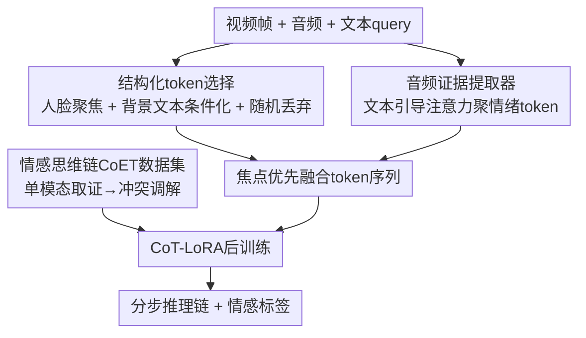

# EmoThinker: Advancing Visual-Acoustic Emotion Analysis via Structural Token Selection and Chain-of-Thought Reasoning

**会议**: CVPR 2026  
**论文**: [CVF Open Access](https://openaccess.thecvf.com/content/CVPR2026/html/Xu_EmoThinker_Advancing_Visual-Acoustic_Emotion_Analysis_via_Structural_Token_Selection_and_CVPR_2026_paper.html)  
**代码**: 有（论文称代码与数据集开源，正文未给明确链接 ⚠️ 以原文为准）  
**领域**: 多模态VLM  
**关键词**: 多模态情感分析, 结构化token选择, 情感思维链, 视听对齐, 跨模态推理

## 一句话总结
EmoThinker 把视听情感分析从"隐式融合"改造成"显式分步推理"：视觉端用结构化 token 选择把人脸聚焦区和文本条件化的背景区分开，音频端用文本引导注意力提炼副语言特征，再配上首个带分步推理链的 CoET 数据集做 LoRA 后训练，在 DFEW 等五个基准上刷到新 SOTA（DFEW 零样本 WAR 提升 10.5%）。

## 研究背景与动机

**领域现状**：多模态情感分析（MEA）要从视频、音频、文本的协同信号里判断人的情绪状态，是人本 AI 的基石。近年主流做法是把大视觉语言模型（LVLM）当作强力编码器+推理器，在粗粒度情绪分类上已经能拿到不错的结果。

**现有痛点**：作者指出两个被忽略的根本难题。其一，**情感证据天然稀疏且局部**——一帧画面里只有少数面部动作单元（AU）或短暂的韵律爆发带判别信号，绝大多数像素和音频段是情感中性的；但现有方法（Emotion-LLaMA、Omni-Emotion 等）对所有时空 token 一视同仁地处理，等于把一个关键微表情和一块静态背景像素投入同等算力，结果是显著线索被中性数据的洪流稀释，既引入噪声又浪费算力。其二，**多模态情绪线索存在时间不同步**——心理学研究表明生理性的声音变化往往先于有意识的面部表情，而语言层面的情感最后才显现；隐式融合（拼接或跨模态注意力）默认时间对齐，把这些错位的线索压进同一个表征，纠缠了"前因（生理反应）"和"后果（有意识表达）"，破坏了因果链，导致讽刺、矛盾这类复杂情绪难以还原。

**核心矛盾**：稀疏的判别信号 vs. 一视同仁的均匀处理；异步的情绪线索 vs. 假定对齐的隐式融合。两者都让显著线索被淹没、让推理过程不可解释。

**本文目标**：把情感分析从"单体融合任务"重构成"显式分步推理过程"，同时解决证据稀疏（要聚焦）和时间异步（要分模态、按序、可解释地推理）两个问题。

**核心 idea**：用**结构化 token 选择 + 音频证据提取器**先把高信噪比的多模态证据拿出来，再用**情感思维链（CoET）数据集**把"证据获取"和"推理判断"解耦，让模型像人一样先各模态独立取证、再显式调解跨模态冲突。

## 方法详解

### 整体框架

EmoThinker 建立在 Qwen2.5-Omni 之上，冻结预训练的视觉/音频/文本编码器，只把"结构化 token 选择"和"音频证据提取器"作为可训练插件接进去。整条流水线分两层：**证据层**负责把原始视频帧和音频压成高情感密度的 token 序列，**推理层**用 CoET 数据集做 LoRA 后训练，让 LLM 输出分步的情感思维链与最终标签。

具体地，视觉端有两条分支——焦点分支用人脸检测把面部块抠出来编码成"焦点 token"，背景分支用文本 query 做跨注意力精炼背景再随机丢弃一部分；音频端用同一套情感文本 query 引导注意力，把整段音频聚成富含情绪的"音频 token"。三路 token 拼成"焦点优先"的融合序列喂给 LLM。而 CoET 数据集则在外部用一条三阶段标注流水线（单模态描述 → QA 对生成 → 多模态思维标注）造出带显式推理链的训练数据，专门教模型先分模态取证、再粗到细地化解冲突。

### 关键设计

**1. 结构化 token 选择：把人脸聚焦区和文本条件化背景区拆开，专治"显著线索被中性像素淹没"**

针对"所有视觉 patch 被均匀处理"的痛点，作者把每一帧 $Z_v \in \mathbb{R}^{T\times H\times W\times 3}$ 显式拆成焦点区和背景区。先用人脸检测工具拿到所有人脸框 $b_t^k=(x_1,y_1,x_2,y_2)$，再围绕框中心 $c_k$ 按相对 patch 尺寸 $r$ 的倍率 $\lambda$ 做膨胀并裁剪到帧边界：

$$\hat{b}_t^k = \mathrm{clip}\big(c_k + \lambda\cdot(b_t^k - c_k),\, r,\,(H,W)\big)$$

所有 $\hat{b}_t^k$ 的并集构成二值人脸掩码 $M_t^f$，背景掩码 $M_t^b = 1 - M_t^f$，由此得到焦点 patch $P_t^f$ 和背景 patch $P_t^b$。焦点 patch 直接编码成显著情感 token $E_t^f = \mathrm{Proj}_v(F_v(P_t^f))$。为了不让背景引入噪声，背景 token 用人类文本 query $E^q$ 做跨注意力做条件化（query 来自背景、key/value 来自文本）：$E_t^b \leftarrow E_t^b + \epsilon_b\cdot\mathrm{softmax}(Q_tK_t^\top/\sqrt{d_b})\cdot V_t$，再以丢弃比 $\delta$ 对背景 token 做**随机丢弃**得到子集 $\tilde{E}_t^b$，最后把焦点和保留背景拼成结构化 token $E_t^v = (E_t^f \oplus \tilde{E}_t^b)$。膨胀比 $\lambda$ 越大、纳入越多人脸相关 patch，性能越好（消融见参数分析）；随机丢弃比基于注意力分数的选择更直接、更随机地剔除背景影响，反而养出更鲁棒的表征。

**2. 音频证据提取器：用同一套情感文本 query 把整段音频聚成富情绪 token**

常规方法缺乏从长音频里蒸馏显著副语言特征的机制。EmoThinker 给音频开了专用通路：把 log-Mel 频谱段 $S_t$ 编码进共享多模态空间 $E^a = \mathrm{Proj}_a(F_a(S_t))$，然后用**和视觉分支同一套**情感引导文本 query $E^q$ 做跨注意力——这次以音频为 query、文本为 key/value：$\tilde{E}^a \leftarrow E^a + \epsilon_a\cdot\mathrm{softmax}(Q_aK_a^\top/\sqrt{d_a})\cdot V_a$。和视觉背景 token 不同，音频 token **全部保留不丢弃**，因为韵律、节奏这类声学特征本身就密集携带情绪信息（消融里去掉随机丢弃即体现这一取舍）。最终多模态 token 把所有帧的视觉结构化 token 与条件化音频 token 拼接：$E^m = [\{E_t^v\}_{t=1}^T \oplus \tilde{E}^a]$，交给 LLM 做下游推理。共用一套 query 保证视听两路朝着同一情感语义对齐。

**3. 情感思维链（CoET）数据集：把"证据获取"和"推理判断"解耦，显式调解跨模态冲突**

这是论文解决"时间异步"的核心抓手，也是首个为 MEA 提供结构化分步推理链的数据集。CoET 遵从两条人类推理原则：其一，**生成模态专属描述**，让每个模态的线索被独立、公平地评估，而不是在单一隐空间里被隐式混合；其二，内置**冲突调解机制**，用"粗到细"两阶段处理跨模态矛盾——粗阶段先判定每个模态的全局情感倾向与可靠性，细阶段再回看模糊样本、在显式跨模态论证下精修情绪类别与强度。数据由一条三阶段自动标注流水线产出：① **单模态描述**用 Qwen3-VL 做逐帧字幕并合并冗余、用 Qwen3-Omni-Captioner 配情绪提示词提炼语调节奏；② **QA 对生成**用 GPT-oss 走"跨模态比较→综合与调解"的分层 QA 链（先逼模型找出模态间一致点与分歧，再让它当裁判权衡证据下判断），缓解模态偏置；③ **多模态思维标注**把视觉拆成焦点情感（DeepFace 检脸 + OpenFace 抽 AU）、人物语境（姿态/手势/互动）、背景氛围（亮度/饱和度/对比度）三层，再让模型把解耦后的视听线索合成、消解语义冲突，形成定义思维链的推理轨迹。正是这套"先分模态取证、再按序调解"的标注，让模型学会尊重情绪线索的自然时间顺序。

### 损失函数 / 训练策略
两阶段训练：先**预热**视频与音频自适应模块，把它们从随机初始化对齐到跨模态情感语义空间；再保持 LLM 主体冻结，用 **CoT-LoRA** 在 CoET 指令数据集上做细粒度对齐，借 Qwen2.5-Omni 本身的视频推理能力建立视听情感关联。关键超参：视频 1 FPS 采样，膨胀比 $\lambda=8$，背景丢弃比初始 $0.2$，AdamW（初始 lr $2\times10^{-5}$、merger lr $5\times10^{-6}$），LoRA rank/alpha = 32/64，1 epoch，weight decay 0.1，warm-up 比 0.05，训练用 8×NVIDIA 3090。

## 实验关键数据

### 主实验
在 DFEW、IEMOCAP、MELD、MUStARD、UR-FUNNY 五个基准上评测分类，EMER 上评测推理质量。下表摘 DFEW（UAR/WAR）与 IEMOCAP/MELD（w-F1）对比：

| 数据集 | 指标 | EmoThinker | 之前最好基线 | 说明 |
|--------|------|-----------|----------------|------|
| DFEW（零样本） | WAR | 65.63 | 59.37 (Emotion-LLaMA) | 提升约 10.5%（相对） |
| DFEW（微调） | WAR | 78.13 | 77.06 (Emotion-LLaMA) | 提升约 1.4% |
| DFEW（零样本） | UAR | 51.08 | 48.45 (Qwen2.5-VL) | 新 SOTA |
| IEMOCAP | w-F1 | 72.93 | 72.89 (Emotion-LLaMA) | 略优 |
| MELD | w-F1 | 68.97 | 67.11 (Emotion-LLaMA) | 新 SOTA |
| MUStARD | Acc | 67.84 | 67.15 (Emotion-LLaMA) | 讽刺检测 |
| UR-FUNNY | Acc | 66.61 | 66.19 (Qwen2.5-VL) | 幽默检测 |

推理任务（EMER 数据集，ChatGPT 评的 Clue/Label overlap，0–10）：

| 方法 | Clue | Label |
|------|------|-------|
| Emotion-LLaMA | 8.22 | 6.25 |
| EmoThinker | **8.67** | **7.53** |

Label overlap 涨幅明显（+1.28），说明 CoET 后训练对"判对最终情绪类别"帮助最大。

### 消融实验
F/B/A 分别表示焦点、背景、音频 token（DFEW 用 WAR、MELD 用 w-F1）：

| 配置 | DFEW WAR | MELD w-F1 | 说明 |
|------|----------|-----------|------|
| 仅 A（音频） | 43.71 | 50.29 | 去掉视觉，最差 |
| 仅 F（焦点） | 60.37 | 56.49 | 仅人脸 |
| F+B | 66.57 | 62.36 | 去掉音频 |
| F+A | 74.10 | 64.74 | 去掉背景 |
| F+B+A（完整） | **78.13** | **68.97** | 完整模型 |

背景 token 选择策略对比（DFEW WAR / MELD w-F1）：

| 策略 | DFEW WAR | MELD w-F1 |
|------|----------|-----------|
| 注意力选择 | 78.76 | 65.84 |
| 随机丢弃 | 78.13 | **68.97** |

### 关键发现
- **视觉细粒度像素是多模态情感关联的关键**：纯音频（A）在两个数据集都垫底，去掉视觉分支掉得最狠，证明面部细节不可替代。
- **背景虽冗余但不能全扔**：去掉背景（F+A）相比完整模型在 DFEW 掉 4 个点（74.10→78.13），说明背景提供了空间感知所需的氛围信息——这也解释了为何用文本条件化+部分保留而非直接丢光。
- **随机丢弃 > 注意力选择**：随机丢弃在 MELD 上反超注意力法 3 个 w-F1，作者解释为它更直接、随机地剔除背景影响，养出更鲁棒的表征。
- **超参趋势**：膨胀比 $\lambda$ 越大、纳入越多人脸相关 patch，三个数据集性能都升；背景丢弃比 $\delta$ 越大算力越省但性能掉得明显，作者按奥卡姆剃刀取了个折中值（默认 $\delta=0.2$）。

## 亮点与洞察
- **"证据获取与推理解耦"是最核心的范式转变**：把一个端到端黑盒拆成"先取高信噪比证据、再显式分步推理"，既提了点又换来可解释性——案例研究里 EmoThinker 的 GPT-4o 评分 8.4 高于 MiniGPT-v2 的 7.6，且能逐步说清视听线索如何交互。
- **视听共用同一套情感文本 query** 是个轻巧但有效的对齐 trick：不引入额外对齐损失，靠同一 query 把两路注意力拉到同一情感语义上，可迁移到任意需要"文本意图引导多模态聚焦"的任务。
- **随机丢弃打败注意力选择** 是反直觉的"啊哈"点：在背景这种冗余但有用的信号上，确定性的注意力筛选反而不如随机正则化鲁棒，提示在"低判别但非无用"的 token 上别过度依赖注意力。
- **CoET 的三层视觉解耦（焦点情感/人物语境/背景氛围）+ 粗到细冲突调解** 是一套可复用的多模态推理数据构造范式，对任何需要消解模态冲突的任务都有借鉴价值。

## 局限与展望
- **作者承认的局限**：在 IEMOCAP/MELD 的少数类（Sad、Fear）上结果平庸，源于数据集长尾导致分类器偏向多数情绪、少数类估计不稳；Disgust 这类极少类几乎全军覆没（多方法都接近 0）。
- **自己发现的局限**：① 强依赖外部工具链（DeepFace 检脸、OpenFace 抽 AU、Qwen3-VL/Omni 造描述、GPT-oss 造 QA），任一环节出错都会污染 CoET 标注质量，但论文未量化标注噪声的影响 ⚠️；② 整套方法绑死 Qwen2.5-Omni 基座，跨基座泛化性未验证；③ 1 FPS 采样和固定膨胀比是为省算力的工程折中，对快速微表情可能漏采。
- **改进思路**：作者展望自适应 token 选择（按内容动态决定保留比例）和更强的融合机制；可补做少数类重采样/重加权来缓解长尾。

## 相关工作与启发
- **vs Emotion-LLaMA**：两者都用 LLM 做情感分类+推理，但 Emotion-LLaMA 走隐式、含糊的融合推理，对所有 token 均匀处理；EmoThinker 显式拆焦点/背景/音频、再用 CoET 强制分步取证调解，因此在 DFEW 零样本 WAR 上领先 6 个点、推理 Label overlap 领先 1.28，且过程可解释。
- **vs Omni-Emotion / 一视同仁的 LVLM 方法**：它们把关键微表情和静态背景投入同等算力，显著线索被稀释；EmoThinker 用结构化 token 选择把算力倾斜给人脸聚焦区，背景只做文本条件化+部分保留，提升了情感显著性与效率。
- **vs 图方法（AdaIGN/MultiEMO）与隐式融合（UniMSE/i-Code）**：这些方法默认时间对齐、在隐空间混合多模态；EmoThinker 直面时间异步问题，用 CoET 的粗到细冲突调解尊重"声音先变、表情后到、语言最后"的自然顺序。

## 评分
- 新颖性: ⭐⭐⭐⭐ 结构化 token 选择 + CoET 显式推理的组合较新，且首个为 MEA 提供分步推理链数据集，但单个组件多为已有机制的重组。
- 实验充分度: ⭐⭐⭐⭐ 五个分类基准 + 一个推理基准，消融拆到焦点/背景/音频三 token 并做超参敏感性，覆盖到位；少数类长尾问题坦诚但未深挖。
- 写作质量: ⭐⭐⭐⭐ 动机（稀疏+异步）讲得清晰，公式与图配合好；部分符号（如 $\tilde{N}_b$）和工具链细节略简。
- 价值: ⭐⭐⭐⭐ 可解释 MEA 的实用框架 + 可复用的 CoET 数据构造范式，对人本 AI 与情感计算有直接价值。

<!-- RELATED:START -->

## 相关论文

- [\[CVPR 2026\] When Visualizing is the First Step to Reasoning: MIRA, a Benchmark for Visual Chain-of-Thought](when_visualizing_is_the_first_step_to_reasoning_mira_a_benchmark_for_visual_chai.md)
- [\[CVPR 2026\] Chain-of-Frames: Advancing Video Understanding in Multimodal LLMs via Frame-Aware Reasoning](chain-of-frames_advancing_video_understanding_in_multimodal_llms_via_frame-aware.md)
- [\[CVPR 2026\] UniT: Unified Multimodal Chain-of-Thought Test-time Scaling](unit_unified_multimodal_chain-of-thought_test-time_scaling.md)
- [\[CVPR 2026\] Chain-of-Thought Guided Multi-Modal Object Re-Identification](chain-of-thought_guided_multi-modal_object_re-identification.md)
- [\[CVPR 2026\] FocusUI: Efficient UI Grounding via Position-Preserving Visual Token Selection](focusui_efficient_ui_grounding_via_position-preserving_visual_token_selection.md)

<!-- RELATED:END -->
